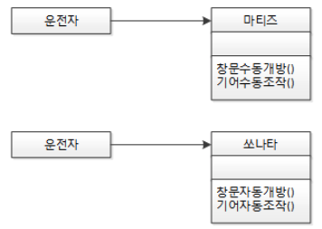
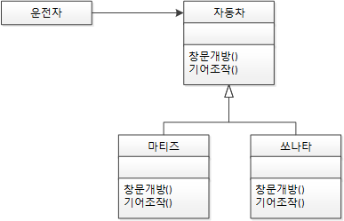
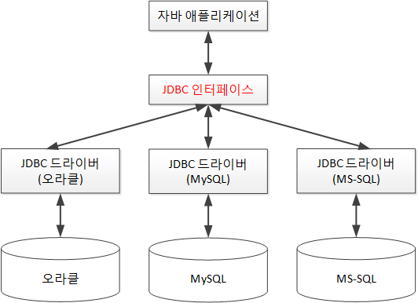
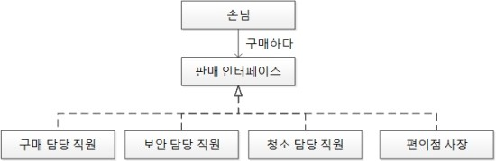

# 목차

- [목차](#목차)
- [OCP - 개방 폐쇄 원칙](#ocp---개방-폐쇄-원칙)
  - [개념](#개념)
  - [예제 1](#예제-1)
  - [예제 2](#예제-2)
  - [예제 3](#예제-3)
  - [예제 4](#예제-4)
  - [예제 5](#예제-5)
- [생각해볼 점](#생각해볼-점)
- [참고](#참고)

<br>

# OCP - 개방 폐쇄 원칙

> * "소프트웨어 엔티티(클래스, 모듈, 함수 등)는 확장에 대해서는 열려 있어야 하지만 변경에 대해서는 닫혀 있어야 한다." - 로버트 C. 마틴
> * "만족스러운 모듈화를 위한 최소한의 조건은 개방성과 폐쇄성을 모두 갖춘 모듈을 만드는 것이다." - 로버트 C. 마틴
> * "자신의 확장에는 열려 있고, 주변의 변화에 대해서는 닫혀 있어야 한다."

<br>

## 개념

* 확장에는 열려 있고, 변경에는 닫혀 있다는 원칙
  * ***기존의 코드를 변경하지 않고(Closed), 기능을 수정하거나 추가할 수 있도록(Open)해야 한다.***
  * 인터페이스의 코드는 변경하지 않고, 인터페이스에 정의된 기능을 구현하는 구현체는 추가할 수 있도록 하는 원칙 
* **사실 OCP은 런타임 의존성과 컴파일타임 의존성에 관한 이야기이다**
  * **핵심은 컴파일타임 의존성을 고정시키고 런타임 의존성을 변경하라**
  * `if-else`를 통한 컴파일 의존성이 아니다!
* 추상화와 전략 패턴
  * OCP는 추상화가 핵심이다. (구현을 숨기고, 확장하는 것)
  * 추상화만 했다고 OCP가 아니다. 변하는 것이 무엇인지 이해해야 한다.
    * **변하는 것과 변하지 않는 것이 무엇인지를 이해하고 이를 추상화의 목적으로 삼아야한다.**
  * **변하는 것(핵심 로직)과 변하지 않는 것(부가 로직)을 분리해야 한다.**
* **다형성과 인터페이스를 통해 변하는 부분과 변하지 않는 부분을 분리**
* **시스템을 변경하지 않고도 시스템의 행위를 확장할 수 있다.**

<br>

## 예제 1

<p align="center"><br>출처 : 스프링 입문을 위한 자바 객체 지향의 원리와 이해</p>

* `운전자`는 `마티즈`와 `쏘나타`의 변화에 따라 행동이 `의존적`으로 변하게 된다.
  * `운전자`가 `마티즈`를 운전하다가 차를 `쏘나타`로 바꾸면 기어와 창문의 조작 방법이 달라 `운전자`가 변화가 필요하다.

<p align="center"><br>출처 : 스프링 입문을 위한 자바 객체 지향의 원리와 이해</p>

* 상위 클래스 또는 인터페이스를 중간에 둠으로써 다양한 자동차가 생긴다고 해도 객체 지향 세계의 `운전자`는 운전 습관에 영향을 받지 않게 된다.
* 다양한 `자동차`가 생긴다고 하는 것은 자동차 입장에서는 자신의 확정에는 개방돼 있는 것이고, `운전자` 입장에서는 주변의 변화에 폐쇄돼 있는 것이다.

<br>

## 예제 2

<p align="center"></p>

* **DB의 확장에는 열려있고, JDBC인터페이스의 변화는 닫혀있다.**

<br>

## 예제 3

JVM

* 개발자가 작성한 소스코드는 운영체제의 변화에 닫혀 있고, 각 운영체제별 JVM은 확정에 열려있는 구조가 된다.

<br>

## 예제 4

<p align="center"></p>

* 편의점에서 일일 삼교대로 직원이 교대한다. 직원이 바뀐다고 해서 손님이 구매라는 행위를 하는 데는 영향이 없다.

<br>

## 예제 5
```java
// Template Method Pattern
public abstract class DiscountPolicy {
  private List<DiscountCondition> conditions = new ArrayList<>();
  
  public DiscountPolicy(DiscountCondition... conditions) {
    this.conditions = Arrays.asList(conditions);
  }
  
  public Money calculateDiscountAmount(Screening screening) {
    for(DiscountCondition each : conditions) {
      if(each.isSatisfiedBy(screening))
        return getDiscountAmount(screening);
    }
    return screening.getMovieFee();
  }
  
  abstract protected Monet getDiscountAmount(Screening screening); // 추상 메서드 -> 핵심 로직 (전략)
}
```
* 템플릿 메서드 패턴
  * 핵심 로직을 추상화

<br>

# 생각해볼 점
* OCP를 적용하는 방법은 상속(is-a)와 컴포지션(has-a)가 있다고 볼 수 있다.
  * 상속은 하위 클래스가 상위 클래스에 강하게 의존하므로, 인터페이스를 이용한 컴포지션이 더 유연하다.
  * 부모 클래스에서 자식 클래스를 만들 때, 자식 클래스에서 기능을 추가/수정 할 수 있지만, 자식 클래스를 위해 부모 클래스가 수정될 필요는 없다.
* 변화가 예상되는 부분을 추상화하는 것이기 때문에 너무 먼 미래를 생각하다보면 오히려 구조가 복잡해질 수 있다.
  * [YAGNI](https://ko.wikipedia.org/wiki/YAGNI)
* OCP를 적용하다보면 depth가 3단계, 4단계로 불어나며 오히려 프로그램의 복잡도가 증가하는 경우는?
  * 적절한 단계에서 제어하는 게 중요한 것 같다. 과도한 사용은 되려 프로그램의 본질을 퇴색할 수 있다고 생각한다.

<br>

# 참고

* [스프링 입문을 위한 자바 객체 지향의 원리와 이해](http://www.yes24.com/Product/Goods/17350624)