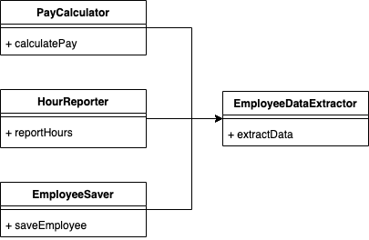
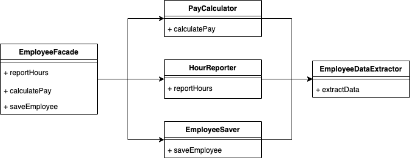

# 목차

- [목차](#목차)
- [SRP - 단일 책임 원칙](#srp---단일-책임-원칙)
  - [개념](#개념)
  - [SRP를 위반하는 예시를 통해보는 SRP의 개념](#srp를-위반하는-예시를-통해보는-srp의-개념)
  - [SRP의 간단한 예시 1](#srp의-간단한-예시-1)
  - [SRP의 간단한 예시 2](#srp의-간단한-예시-2)
- [생각해볼 점](#생각해볼-점)
- [참고](#참고)

<br>

# SRP - 단일 책임 원칙

> * "**어떤 클래스를 변경해야 하는 이유는 오직 하나뿐이어야 한다.**" - 로버트 C. 마틴
> * 단일 책임 원칙은 모델링 과정을 담당하는 추상화와 깊은 연관이 있다.
>   * 객체 모델링 설계 과정에서 단일 책임 원칙을 고려해야 한다.

<br>

## 개념

<br>

❗️ **사람들의 흔한 오해**

* 이름으로 인한 오해
  * **이름이 마치 모든 모듈이 단 하나의 일만 해야 한다는 의미로 받아들이기 쉽기 때문이다.**
* 헷갈리지 말자. **단 하나의 일만 해야 한다는 원칙은 더 저수준인 함수에 적용되는 원칙이다.**
  * 커다란 함수를 작은 함수들로 리팩토링하는 것을 의미한다.
* 더이상 헷갈리지 말자! 이는 SRP와 전혀 상관이 없다.

<br>

💁‍♂️ **SRP의 진정한 의미**

* 단일 모듈은 변경의 이유가 하나, 오직 하나뿐이어야 한다.
* 더 정확히 말하면, **하나의 모듈은 하나의, 오직 하나의 액터에 대해서만 책임져야 한다.**
  * 액터란
    * 해당 모듈에 변경을 요청하는 한 명 이상의 사람들을 가리킴.
    * 시스템이 동일한 방식으로 변경되기를 원하는 사용자 집단
    * 엑터는 엑터는 한 명일 수도, 여러 사용자가 모여 하나의 엑터일 수도 있다.
  * **하나의 모듈은 하나의, 오직 하나의 액터에 대해서만 책임져야 한다. - 로버트 C. 마틴 -**
* 정말 쉽게 말해선, **클래스가 한가지 책임만을 가져야 한다는 의미이다.**
  * **한 클래스를 한 관심사에 집중하도록 유지하는 것.**
  * 클래스를 역할과 책임에 따라 분리해서 각각 하나의 역할과 책임만 갖게하는 원칙.
  * 만약 하나의 클래스가 여러 책임을 가지고 있다면, 그 클래스는 수시로 변경될 것이며, 그 클래스를 사용하고 있는 다른 클래스들도 영향을 받게 되기 때문에 좋은 설계라 할 수 없다.
  * 같은 책임을 가진 것끼리의 그룹화를 잘 해야한다.
* **모듈 -> 단순히 함수와 데이터 구조로 응집된 집합**
  * '응집된'이 SRP를 암시한다. 즉, 응집도가 높아야 한다는 것.
  * 단일 액터를 책임지는 코드를 함께 묶어주는 힘이 바로 응집성이다.
* **SRP는 응집도에 대한 이야기이기도 하다.**
  
> 모듈이란?
> * 가장 단순한 정의는 소스 파일이다.
> * 단순히 함수와 데이터 구조로 응집된 집합

<br>

## SRP를 위반하는 예시를 통해보는 SRP의 개념

❗️ **SRP를 위반하는 예시 - 우발적 중복과 병합**

간단한 하나의 사례를 들어본다. `Employee`라는 클래스가 있으며, 세 가지 메서드를 가진다.

그리고 이 클래스는 SRP를 위반하는데, **이 세가지 메서드가 서로 매우 다른 세 명의 액터를 책임지기 때문이다.**

* `calculatePay()`: 회계팀에서 기능을 정의하며, CFO 보고를 위해 사용한다.
* `reportHours()`: 인사팀에서 기능을 정의하고 사용하며, COO 보고를 위해 사용한다.
* `save()`: DB 관리자가 기능을 정의하고, CTO 보고를 위해 사용한다.

개발자가 이 세 메서드를 `Employee`라는 단일 클래스에 배치하여 세 액터가 서로 결합되어 버린 것.

> `Employee`에게 메시지 요청을 보내는 클라이언트 모임(액터)가 하나 이상.

**여러 액터가 단일 클래스에 의존하므로, 만약 CFO팀에서 결정한 조치로 변경이 일어나면, COO팀이 의존하는 무언가에 영향을 줄 수 있다.**

예를 들어, `calculatePay()`와 `reportHours()`가 동일한 private 메서드에 의존하고 있다면, `calculatePay()`의 요구사항 변경으로 인해 private 메서드가 변경되면 `reportHours`를 사용하는 다른 액터에게도 영향을 끼치게 되는 것이다.

**이러한 문제는 서로 다른 액터가 의존하는 코드를 너무 가까이 배치했기 때문이다. 이로 인해 병합이 일어나는 것.**

**SRP는 서로 다른 액터가 의존하는 코드를 서로 분리하라고 말한다.**

<br>

👍 **해결책**

가장 간단한 해결책은 세 가지의 메서드를 각기 다른 클래스로 이동시키는 것이다.

<p align="center"></p>

그리고 데이터와 메서드를 분리시키면 된다. 

각 클래스는 자신의 메서드에 반드시 필요한 코드만 포함하게 된다. **서로의 존재를 모른다.**

<br>

👍 **퍼사드 패턴**

위와 같이 분리하는 것의 단점은 세 가지 클래스를 인스턴스화하고 추적해야 한다는 것이다.

이 단점의 해결책으론 흔히 쓰이는 퍼사드 패턴(Facade)이 있다.

<p align="center"> </p>

**`EmployeeFacade`는 코드가 거의 없고, 세 클래스의 객체를 생성하고, 요청된 메서드를 가지는 객체로 위임하는 일만 책임진다.**

> Facade는 건물의 정면을 의미한다. 즉, 프록시와 같은 역할.

<br>

## SRP의 간단한 예시 1

<p align="center"><br>출처 : 스프링 입문을 위한 자바 객체 지향의 원리와 이해</p>

* `남자`라는 클래스에 의존하는 여러 개의 클래스가 있다고 하면, `남자`클래스가 해야 할 일과 책임이 너무 많게 된다.
* 이런 경우에 역할(책임)을 분리하라는 것이 SRP이다.

<p align="center"><br>출처 : 스프링 입문을 위한 자바 객체 지향의 원리와 이해</p>

* `남자`라는 클래스를 역할과 책임에 따라 `남자친구`, `사원`, `아들`, `소대원`으로 나누었다.
  * `여자친구`랑 헤어졌다고해도 `아들-어머니`, `직장상사-사원`, `소대장-소대원`한테는 영향이 전혀 없다.

<br>

## SRP의 간단한 예시 2

```java
// SRP를 어기는 예제
class 강아지 {
  final static Boolean 수컷 = true;
  final staic Boolean 암컷 = false;
  Boolean 성별;
  
  void 소변보다() {
    if(this.성별 == 수컷)
      // 한쪽 다리를 들고 소변을 보다.
   	else
      // 뒷다리 두 개를 굽혀 앉은 자세로 소변을 보다.
  }
}
```

* `강아지`클래스가 `수컷`과 `암컷`을 한번에 구현하려고 하기에 단일 책임(행위)원칙을 위배하고 있다.

```java
// SRP를 적용한 예제
abstract class 강아지 {
  abstract void 소변보다();
}

class 수컷강아지 extends 강아지 {
  void 소변보다() {
    // 한쪽 다리를 들고 소변을 보다.
  }
}

class 암컷강아지 extends 강아지 {
  void 소변보다() {
    // 뒷다리 두 개를 굽혀 앉은 자세로 수변을 보다.
  }
}
```

* 책임을 분배해줌으로써 하나의 클래스가 하나의 책임과 역할만을 담당한다.

<br>

# 생각해볼 점
* **SRP를 지키게 되면 많은 객체를 만들게 된다.** 객체 생성비용과 많은 클래스의 관리가 오히려 처음 설계나 유지보수에 취약하지 않은가?
* 하나의 책임 (클래스나 메서드를 변경해야 할 이유가 하나)을 가지는 객체의 네이밍이 어렵다.
* **SRP를 지키기 위해선 시스템 인터페이스에 가까운 클래스일수록 더 많은 것을 위임(delegation)한다.** 반면, 시스템 인터페이스에서 멀리 떨어진 클래스일수록 위임할 것이 적어진다.
  * **대표적인 예시로 컨트롤러를 들 수 있다. 사용자 인터페이스와 가까운 컨트롤러는 폭넓은 역할을 담당하며 비즈니스 로직은 모두 다른 객체에 위임한다. 컨트롤러는 단순히 흐름만 제어할 뿐이다.**
  * **정 반대로, 매우 특수하고 제한된 역할만 수행하는 DAO(Data Access Object)는 일거리를 다른 클래스에 위임하는 경우가 거의 없다**
  * 그렇다면 책임의 절대적인 크기는 없다는 의미인가? -> 없다. 객체를 사용하는 액터에 따라 달라진다.
* 아무튼.. 내가 하고 싶은 말은
  * **메서드나 클래스가 맡은 역할이 몇 개인가를 묻는 대신, 수정해야 하는 이유가 몇 가지나 되느냐고 물어야 한다.**

# 참고

* [스프링 입문을 위한 자바 객체 지향의 원리와 이해](http://www.yes24.com/Product/Goods/17350624)
* http://www.wegra.org/blog/?tag=%EB%8B%A8%EC%9D%BC-%EC%B1%85%EC%9E%84-%EC%9B%90%EC%B9%99
* [클린 아키텍처](http://www.yes24.com/Product/Goods/77283734?OzSrank=1)
