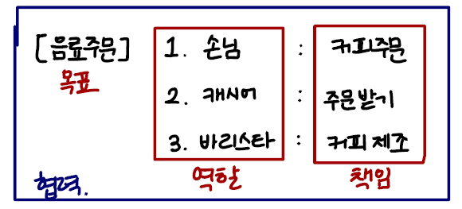
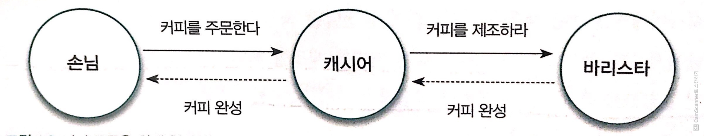
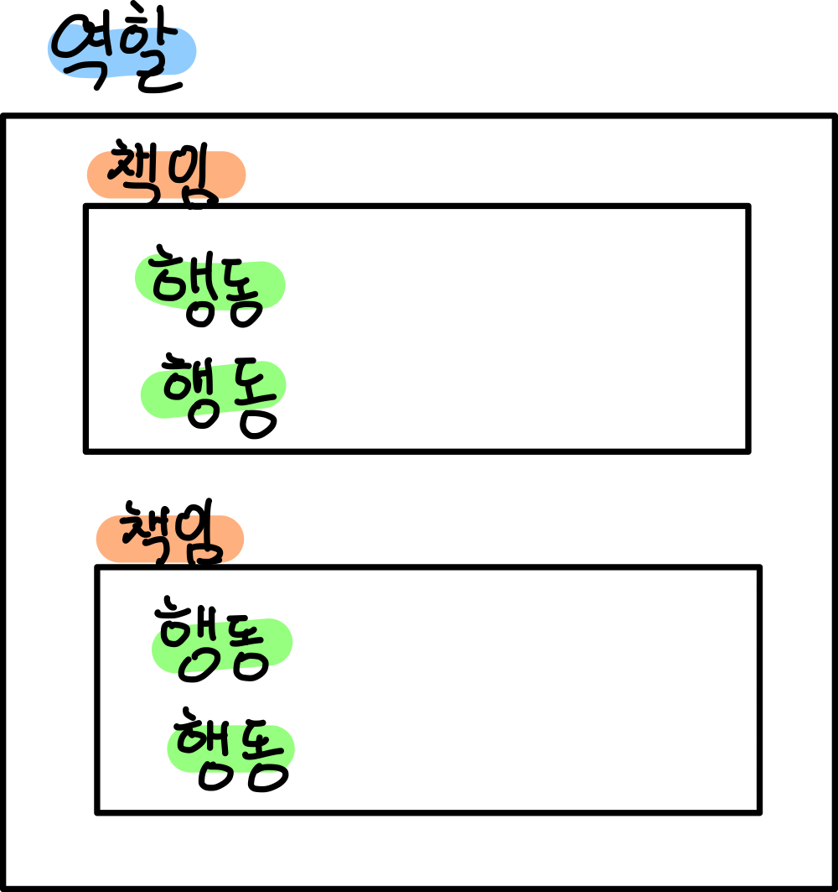

[객체지향의 사실과 오해](http://www.yes24.com/Product/Goods/18249021)를 바탕으로 정리한 자료입니다.

 

# 목차

- [목차](#목차)
- [1장. 협력하는 객체들의 공동체](#1장-협력하는-객체들의-공동체)
  - [1 핵심 요약](#1-핵심-요약)
  - [2 협력하는 사람들](#2-협력하는-사람들)
    - [2-1 협력](#2-1-협력)
    - [2-2 역할과 책임](#2-2-역할과-책임)
      - [2-3 역할과 책임의 특징](#2-3-역할과-책임의-특징)
  - [3 역할, 책임, 협력](#3-역할-책임-협력)
    - [3-1 역할과 책임을 수행하며 협력하는 객체들](#3-1-역할과-책임을-수행하며-협력하는-객체들)
      - [3-1-1 인간 세계에서의 협력](#3-1-1-인간-세계에서의-협력)
      - [3-1-2 객체 세계에서의 협력](#3-1-2-객체-세계에서의-협력)
      - [3-1-3 객체의 역할 특징](#3-1-3-객체의-역할-특징)
  - [4 협력 속에 사는 객체](#4-협력-속에-사는-객체)
    - [4-1 협력 공동체의 일원으로서 객체에 필요한 덕목](#4-1-협력-공동체의-일원으로서-객체에-필요한-덕목)
    - [4-2 상태와 행동을 함께 지닌 자율적인 존재](#4-2-상태와-행동을-함께-지닌-자율적인-존재)
      - [4-2-1 객체의 자율성은 내부와 외부로 구분된다.](#4-2-1-객체의-자율성은-내부와-외부로-구분된다)
    - [4-3 협력과 메시지](#4-3-협력과-메시지)
    - [4-4 메서드와 자율성](#4-4-메서드와-자율성)
  - [5 객체지향의 본질](#5-객체지향의-본질)
    - [5-1 객체를 지향하라](#5-1-객체를-지향하라)

 

# 1장. 협력하는 객체들의 공동체

> * 시너지를 생각하라. 전체는 부분의 합보다 크다. - 스티븐 고비 -
> * 소프트웨어 시스템이 해결하려고 하는 실재는 잘해봐야 먼 친적밖에 되지 않는다. - 버트란드 마이어 -
> * 중요한 개념
>   * 협력 = 요청 + 응답
>   * 역할 = 책임의 집합
>   * 책임 = 행동의 집합

 

🤔 객체지향을 실세계의 모방이라는 개념은 학습하는데 매우 효과적이다.
* 객체를 스스로 생각하고 스스로 결정하는 현실 세계의 생명체에 비유
  * ***상태와 행위를 `캡슐화`하는 소프트웨어 객체의 `자율성`***
* 현실 세계의 사람들이 암묵적인 약속과 명시적인 계약을 기반으로 협력하며 목표를 달성해 나가는 과정
  * ***`메시지`를 주고 받으며 공동의 목표를 달성하기 위해 `협력`***
* 실세계의 사물을 기반으로 소프트웨어 객체를 식별하고 구현까지 이어간다는 개념
  * ***객체지향의 설계의 핵심 사상인 `연결완전성`을 설명하는데 적합한 틀을 제공한다.***

 

🤔 객체지향 : 실세계의 모방
* ***철학적인 관점에서는 옳으나, 실용적인 관점에서는 옳지 않다.***
* 기본 사상을 이해하고 학습하는데에는 효과적이다.
* 소프트웨어 객체와 실세계 사물 사이에 존재하는 연관성은 희미하다. (방화벽이 대표적인 예시)

 

🙋‍♂️ ***실제 객체지향의 목표 : 새로운 세계를 창조하는 것***

* ***고객과 사용자를 만족시킬 수 있는 신세계***

 

## 1 핵심 요약

* 객체지향의 목표는 실세계의 모방이 아니다.
* 객체지향의 중요한 3가지 개념 = 협력, 역할, 책임
* 객체는 협력적이면서 자율적이어야 한다.
* 시스템의 기능은 객체의 협력으로 수행되며, 객체의 협력은 메시지를 주고 받으면서 이뤄진다.
* 메시지와 메서드의 분리를 통해서 객체의 외부와 내부를 분리하고, 이로써 객체의 자율성을 증진시킬 수 있다.
* 객체는 협력에 필요한 역할을 수행하며, 역할은 관련된 책임의 집합이다.
* 클래스에 포커스를 두지 말고 객체의 협력, 역할, 책임에 포커스를 두어라.

 

## 2 협력하는 사람들

 출처 : https://jyami.tistory.com/14

협력에 참여하는 모든 사람이 역할에 따른 책임을 완수해야 한다.

 

### 2-1 협력

 출처 : 객체지향의 사실과 오해

 💁‍♂️ ***협력 = 요청 + 응답***

* 요청이 요청을 연쇄한다. `요청 -> 요청 -> 요청`
* 요청과 응답은 서로 반대 방향으로 이루어진다.
* 역할이 있으면 책임도 주어진다.

 

### 2-2 역할과 책임

 💁‍♂️ 역할 (책임의 집합)
* 역할은 어떤 협력에 참여하는 특정한 사람이 협력 안에서 차지하는 ***책임이나 임무***를 의미한다.
* 역할이라는 단어는 의미적으로 책임이라는 개념을 내포한다. (***부분집합***)
* ***역할은 관련성 높은 책임의 집합이다.***
* 예시 - 손님, 캐시어, 바리스타 (사람)

 💁‍♂️ 책임 (행동의 집합)
* 특정한 역할은 특정한 책임을 암시한다.
* 예시 - 커피주문, 주문받기, 커피제조 (요청과 응답)

 

#### 2-3 역할과 책임의 특징

* 여러 사람이 동일한 역할을 수행할 수 있다.
  * 어떤 알바생이든 상관없이 손님의 주문을 받을 수 있다.
* 역할은 **대체 가능성**을 의미한다.
  * 손님 입장에서 캐시어는 `대체 가능`하다.
* 책임을 수행하는 방법은 자율적으로 선택할 수 있다.
  * 메서드의 로직은 역할을 맡은 사람(객체) 마음대로 할 수 있다. 
* 한 사람이 동시에 여러 역할을 수행할 수 있다.
  * 한 사람이 캐시어와 바리스타의 역할을 동시에 수행하는 것도 가능하다.

 

## 3 역할, 책임, 협력

💁‍♂️ 실세계의 커피 주문하는 과정은 객체지향의 핵심적으로 중요한 개념을 포함하고 있다.

* 사람 = 객체
* 에이전트의 요청 = 메시지 호출
* 에이전트의 요청 처리법 = 메서드

 

### 3-1 역할과 책임을 수행하며 협력하는 객체들

🤔 협력은 특정 책임을 수행하는 역할들 간의 연쇄적인 요청과 응답으로 목표를 달성하는 것이다.

 

#### 3-1-1 인간 세계에서의 협력

* **목표는 사람들의 협력을 통해 달성된다.**
* ***목표는 더 작은 책임으로 분할된다.***
* 책임은 수행할 수 있는 적절한 역할을 가진 사람에 의해 수행된다.
* 협력에 참여하는 각 개인은 책임을 수행하기 위해 다른 사람에게 도움을 요청하기도 하며, 이를 통해 연쇄적인 요청과 응답으로 구성되는 협력 관계가 완성된다.

 

#### 3-1-2 객체 세계에서의 협력

😎 객체 세계에서의 협력

* 애플리케이션의 ***기능 구현은 협력을 통해 달성***된다.
* 애플리케이션의 **기능은 더 작은 책임으로 분할**된다.
* **책임**은 적절한 **역할**을 수행할 수 있는 **객체에 의해 수행**된다.
* 객체는 자신의 책임을 수행하는 도중에 다른 객체에게 도움을 요청하기도 한다.

 

#### 3-1-3 객체의 역할 특징

* 여러 객체가 동일한 역할을 수행할 수 있다.
* 역할은 **대체 가능성**을 의미한다.
* 각 객체는 책임을 수행하는 방법을 자율적으로 선택할 수 있다.
* 하나의 객체가 동시에 여러 역할을 수행할 수 있다.

 

## 4 협력 속에 사는 객체

***객체지향 애플리케이션의 윤곽을 결정하는 것은 역할, 책임, 협력이지만 실제로 협력에 참여하는 주체는 객체이다.***

 

### 4-1 협력 공동체의 일원으로서 객체에 필요한 덕목

1. 객체는 충분히 ***협력적***이어야 한다.
   * 다른 객체의 요청에 귀 기울이고 다른 객체에서 적극적으로 도움을 요청할 정도로 열린 마음을 지녀야한다.
   * **협력적이라는 말이 다른 객체의 명령에 따라 행동하는 수동적인 존재를 의미하는 것이 아니다. 요청에 응답하는 것이며 어떤 방식으로 응답할지는 객체 스스로 판단하고 결정한다.** 심지어 요청에 응할지 여부도 객체 스스로 결정할 수 있다.
2. 객체는 충분히 ***자율적***이어야 한다.
   * **객체 공동체에 속한 객체들은 공동의 목표를 달성하기 위해 협력에 참여하지만 스스로의 결정과 판단에 따라 행동하는 자율적인 존재다.**
   * 예 ) 손님이 캐시어에게 어떤 방식으로 바리스타에게 주문 내역을 전달하라고 지시하지 않는다. 캐시어가 요청에 대해 스스로 판단하고 행동하는 자율적인 존재다.

 

**객체지향 설계의 묘미는 다른 객체와 조화롭게 협력할 수 있을 만큼 충분히 개방적인 동시에 협력에 참여하는 방법을 스스로 결정할 수 있을 만큼 충분히 자율적인 객체들의 공동체를 설계하는 데 있다.**

 

### 4-2 상태와 행동을 함께 지닌 자율적인 존재

***객체 = 상태 + 행동***

객체는 상태와 행동을 통해 자신의 상태를 직접 관리하고 스스로 판단하고 행동할 수 있어야한다.

 

#### 4-2-1 객체의 자율성은 내부와 외부로 구분된다.

> 캡슐화와 추상화를 의미한다.

* 내부
  * **객체 스스로 관리하고 외부에서 일체 간섭할 수 없도록 차단한다. (캡슐화)**
* 외부
  * 접근이 허락된 수단을 통해서만 객체와 의사소통한다.

**객체는 다른 객체가 무엇을 수행하는지는 알 수 있지만 어떻게 수행하는지에 대해서는 알 수 없다. (추상화)**

자율적인 객체로 구성된 공동체는 유지보수가 쉽고 재사용이 용이한 시스템을 구축할 수 있는 가능성을 제시한다.

 

### 4-3 협력과 메시지

* 현실 세계
  * 현실 세계에서는 타인에게 도움을 요청하기 위해서는 **다양한 메커니즘 (말, 글자...)**을 활용한다.
* 객체 세계
  * 객체지향 세계에서는 ***메시지***라는 한 가지 의사소통 수단을 사용하여 도움을 요청한다.
  * 한 객체가 다른 객체에게 요청하는 것을 **메시지를 전송**한다고 말하고 다른 객체로부터 요청 받는 것을 **메시지의 수신**한다고 말한다.
  * 객체가 수신된 메시지를 처리하는 방법을 ***메서드***라고 부른다.

 

### 4-4 메서드와 자율성

* 자율성
  * ***객체가 수신된 메시지를 처리하는 방법은 메서드다.***
  * 메시지를 받은 객체가 어떻게 요청을 처리할 지는 해당 객체에게 달려있다. (자율성)
  * 예 ) 바리스타로 전달된 커피 제조 요청이 메시지이고, 커피를 제조하는 구체적인 방법은 메서드이며, 어떻게 만들지는 바리스타 자유다.

 

## 5 객체지향의 본질

* 객체 지향 : 시스템을 상호작용하는 ***자율적인 객체들의 공동체***로 바라보고 객체를 이용해 시스템을 분할하는 방법
* 자율적인 객체 : ***상태***와 ***행위***를 함께 지니며 스스로 자기 자신을 책임지는 객체를 의미한다.
* 객체는 시스템의 행위를 구현하기 위해 다른 객체와 ***협력***한다.
  * 각 객체는 협력 내에서 정해진 ***역할***을 수행하며 역할은 관련된 ***책임***의 집합이다.
* 객체는 다른 객체와 협력하기 위해 ***메시지***를 전송하고 메시지를 수신한 객체는 메시지를 처리하는데 적합한 ***메서드***를 자율적으로 선택한다.

 

### 5-1 객체를 지향하라

* `클래스`는 도구 일 뿐이다.
  * `클래스`가 객체지향 언어의 관점에서 매우 중요한 구성요소인 것은 분명하지만 객체지향의 핵심을 이루는 중심 개념이라고 말하기에는 무리가 있다.
  * 중요한 것은 "어떤 클래스가 필요한가"가 아니라 "**어떤 객체들이 어떤 메시지를 주고받으며 협력하는가**"다. ***클래스는 객체들의 협력 관계를 코드로 옮기는 도구***에 불과하다.
* ***클래스의 구조와 메서드가 아니라 객체의 역할, 책임, 협력에 집중하라.***
  * 객체지향은 객체를 지향하는 것이지, 클래스를 지향하는 것이 아니다.

 

