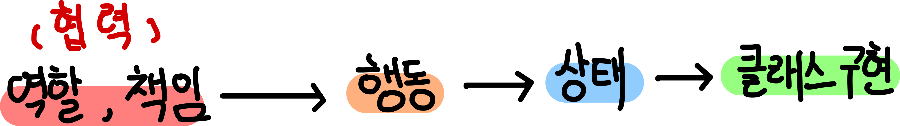
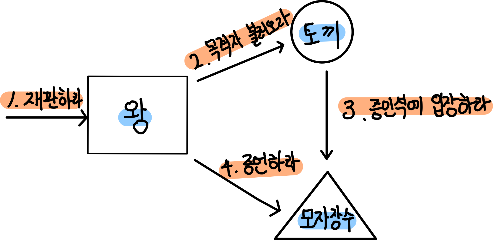
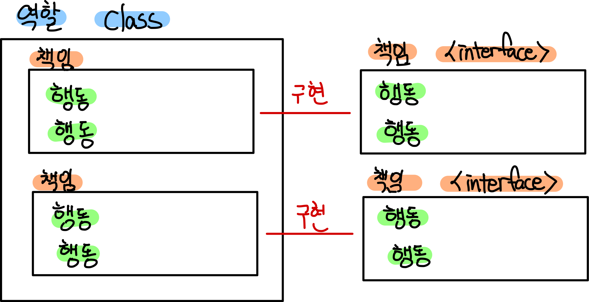
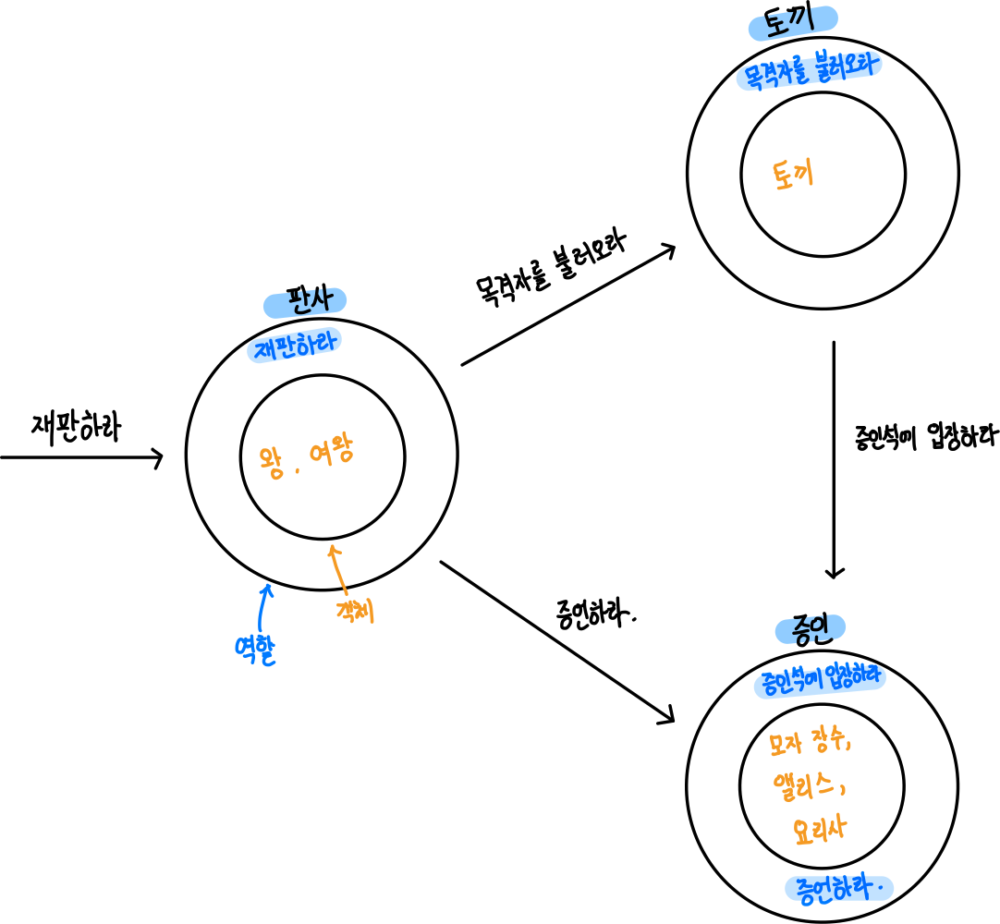

[객체지향의 사실과 오해](http://www.yes24.com/Product/Goods/18249021)를 바탕으로 정리한 자료입니다.

# 목차

- [4장 역할 책임 협력](#4장- 역할-책임-협력)
  * [1 협력](#1-협력)
    + [1-1 요청하고 응답하며 협력하는 사람들](#1-1-요청하고-응답하며-협력하는-사람들)
    + [1-2 누가 파이를 훔쳤지](#1-2-누가-파이를-훔쳤지)
    + [1-3 재판 속의 협력](#1-3-재판-속의-협력)
  * [2 책임](#2-책임)
    + [2-1 책임의 분류](#2-1-책임의-분류)
    + [2-2 책임과 메시지](#2-2-책임과-메시지)
  * [3 역할](#3-역할)
    + [3-1 책임의 집합이 의미하는 것](#3-1-책임의-집합이-의미하는-것)
    + [3-2 역할이 답이다](#3-2-역할이-답이다)
    + [3-3 대체 가능성](#3-3-대체-가능성)
  * [4 객체의 모양을 결정하는 협력](#4-객체의-모양을-결정하는-협력)
    + [4-1 흔한 오류](#4-1-흔한-오류)
  * [5 객체지향 설계 기법](#5-객체지향-설계-기법)
    + [5-1 책임 - 주도 설계](#5-1-책임---주도-설계)
    + [5-2 디자인 패턴](#5-2-디자인-패턴)
    + [5-3 테스트 - 주도 개발](#5-3-테스트---주도-개발)

# 4장 역할 책임 협력

인간은 각 개인이 처해 있는 정황 또는 ***문맥(`context`)***이 ***인간의 행동 방식***을 결정한다.

여기서 인간의 행동을 결정하는 문맥은 ***타인과의 협력***이다.

객체지향 세계에서도 객체사이의 ***협력이 행동을 결정한다.***

이번장의 주제는 **"개별적인 객체의 행동이나 상태가 아니라 객체들 간의 협력에 집중하라"**이다.

## 1 협력

객체지향에 갓 입문한 사람들의 가장 흔한 실수는 협력이라는 문맥을 고려하지 않은 채 객체가 가져야 할 상태와 행동부터 고민하기 시작하는 것이다. 중요한 것은 ***개별 객체가 아니라 객체들 사이에 이뤄지는 협력***이다.

**협력이 자리를 잡으면 저절로 객체의 행동이 드러나고 뒤이어 적절한 객체의 상태가 결정된다.**  

  

### 1-1 요청하고 응답하며 협력하는 사람들

* 협력의 본질
  * **협력의 본질**은 ***요청과 응답***으로 연결되는 사람들의 네트워크이다.
* 협력이란
  * 협력은 한 사람이 다른 사람에게 도움을 ***요청***할 때 시작된다.
  * ***요청***을 받은 사람은 일을 처리한 후 ***요청***한 사람에게 필요한 지식이나 서비스를 ***응답***한다.
  * 협력은 다수의 **연쇄적인 요청과 응답의 흐름**으로 구성된다.

### 1-2 누가 파이를 훔쳤지

파이를 훔친 하트 잭에 대한 공판이 열리고 있는 법정의 모습을 묘사하는데, 이야기에 등장하는 객체들은 하트 잭의 재판이라는 동일한 목적을 달성하기 위해 협력을 하고 있는 것이다.

### 1-3 재판 속의 협력

1. 누군가가 왕에게 재판을 ***요청***함으로써 재판 시작.
2. 왕이 하얀 토끼에게 증인을 부를 것을 ***요청***.
3. 왕의 요청을 받은 토끼는 모자 장수에게 증인석으로 입장할 것을 ***요청***
4. 모자 장수는 증인석에 입장함으로써 토끼의 요청에 ***응답***
5. 모자 장수의 입장은 왕이 토끼에게 요청했던 증인 호출에 대한 ***응답***이기도 하다.
6. 이제 왕은 모자 장수에게 증언할 것을 ***요청***
7. 모자 장수는 자신이 알고 있는 증언함으로써 왕의 요청에 ***응답***

어떤 등장인물이 **요청을 받아들일 수 있는 이유**는 그 요청에 대해 적절한 방식으로 **응답하는 데 필요한 지식과 행동 방식을 가지고 있기 때문**이다. 그리고 **요청과 응답**은 협력에 참여하는 객체가 수행할 ***책임***을 정의한다.

## 2 책임

어떤 객체가 어떤 **요청에 대해 대답**해 줄 수 있거나, **적절한 행동**을 할 의무가 있는 경우 해당 객체가 ***책임***을 가진다고 말한다.

### 2-1 책임의 분류

1. **하는 것 (doing) - 변경**
   * 객체를 생성하거나 계산을 하는 등의 스스로 하는 것
   * 다른 객체의 행동을 시작시키는 것
   * 다른 객체의 활동을 제어하고 조절시키는 것
2. **아는 것 (knowing) - 조회**
   * 개인적인 정보에 관해 아는 것
   * 관련된 객체에 관해 아는 것
   * 자신이 유도하거나 계산할 수 있는 것에 관해 아는 것

  

앞서 앨리스 예시로 보면 아래와 같다.

* 왕
  * 왕은 재판에 참여하는 "다른 객체들의 활동을 제어하고 조율"한다. 즉, **하는 것(doing)과 관련된 책임을 수행한다.**
* 하얀 토끼
  * 첫 번째 책임 : "관련된 객체에 대해 아는 것" - 모자장수에 대해서 아는 것
  * 두 번째 책임 : "다른 객체의 행동을 시작시키는 것" - 모자장수에게 입장하라고 하는 것
* 모자 장수
  * 첫 번째 책임 : "객체를 생성하거나 계산을 하는 등의 스스로 하는 것" - 스스로 입장해야 하는 것.
  * 두 번째 책임 : "자신이 유도하거나 계산할 수 있는 것에 관해 아는 것" - 자신이 증언할 걸 아는 것.

>  
>
>  책임은 객체의 ***공용 인터페이스(`public interface`)***를 구성한다.
>
>  인터페이스 == 책임, 여러 책임을 구현하는 객체. (그림 그려 넣을 것)
>
>  * 외부에 제공해 줄 수 있는 정보 (아는 것)
>  * 외부에 제공해 줄 수 있는 서비스 (하는 것)

### 2-2 책임과 메시지

* 메시지 전송이란?
  * 객체가 다른 객체에게 주어진 책임을 수행하도록 요청을 보내는 것.
  * ***객체가 다른 객체에게 전송한 요청은 그 요청을 수신한 객체의 책임이 수행되게 한다.***
  * 두 객체간의 협력은 메시지를 통해 이뤄진다.
* 책임과 메시지
  * ***책임은 협력에서 무엇을 할 수 있는지 나열하는 것.***
    * 책임은 상대 객체와 상관없이 ***외부에 제공하는 행위나 정보*** 
    * 메서드?
  * ***메시지는 협력에 참여하는 두 객체 사이의 관계를 강조.***
    * 메시지는 송신 객체와 수신 객체의 상호 협력하는 문맥이 강조된다.
    * 호출과 반환?
* 책임 != 메시지
  * 책임은 객체가 협력에 참여하기 위해 수행해야 하는 행위를 ***개략적***으로 서술한 것. - **메서드**
  * 메시지로 변환할 때는 하나의 책임이 여러 메시지로 분할되는게 일반적 - **호출과 반환**

## 3 역할

역할은 쉽게 말하면 "인터페이스"이다.

### 3-1 책임의 집합이 의미하는 것

* 왕이 여왕으로, 증인이 앨리스나 요리사로 바뀌어도 협력안에서는 똑같은 메시지를 보내고 같은 책임을 수행한다.

* 책임의 집합
  * **어떤 객체가 수행하는 책임의 집합은 객체가 협력 안에서 수행하는 역할을 암시한다.**

### 3-2 역할이 답이다

* 추상화
  * 역할을 이용해 협력을 "추상화"했기 때문에 '판사'나 '증인'의 역할을 수행할 수 있는 어떤 객체라도 협력에 참여할 수 있다.
  * **역할의 가치는 하나의 협력 안에 여러 종류의 객체가 참여할 수 있게 함으로써 협력을 추상화할 수 있다는 것이다.**
* 어떤 객체라도 역할을 대체할 수 있는가?
  * 아니다. 역할을 대체할 수 있는 **객체는 동일한 메시지를 이해할 수 있는 객체**로 한정된다. (인터페이스)
* 역할의 특성
  * 단순성
  * 유연성
  * 재사용성

### 3-3 대체 가능성

역할의 대체 가능성은 행위 호환성을 의미하고, 행위 호환성은 동일한 책임의 수행을 의미한다.

* 역할의 본질
  * 역할은 다른 객체에 의해 대체 가능함을 의미한다.
  * 인터페이스
* 객체지향에서는
  * 객체가 역할을 대체 가능하기 위해서는 협력 안에서 역할이 수행하는 모든 책임을 동일하게 수행할 수 있어야 한다.
* ***역할에 주어진 책임 이외에 다른 책임을 수행할 수도 있다.***
  * 객체는 역할(인터페이스)이 암시하는 책임보다 더 많은 책임을 가질 수 있다.
  * 객체의 타입과 역할 사이에는 ***일반화/특수화***관계가 성립된다.
    * 일반화 - 역할 (인터페이스)
    * 특수화 - 객체 (인터페이스를 구현한 객체)

## 4 객체의 모양을 결정하는 협력

### 4-1 흔한 오류

* 데이터를 저장하기 위해 객체가 존재한다. - 데이터
  * ***틀렸다. 객체는 행위를 수행하며 협력에 참여하기 위해서 존재한다. 중요한 것은 객체의 행동, 즉 책임이다.***
* 객체지향이 클래스와 클래스 관계를 표현하는 시스템의 정적인 측면에 중점을 둔다. - 클래스
  * ***틀렸다. 중점은 협력에 참여하는 동적인 객체이며, 클래스는 필요한 객체를 표현하고 생성하기 위한 메커니즘이다.***

## 5 객체지향 설계 기법

역할, 책임, 협력의 관점에서 애플리케이션을 설계하는 유용한 세 가지 기법을 살펴보자.

### 5-1 책임 - 주도 설계

* 책임 - 주도 설계란?
  * 협력에 필요한 책임들을 선별하고 적합한 객체에게 책임을 할당하는 방식으로 애플리케이션을 설계한다.
* 설계 방식
  1. 시스템이 사용자에게 제공해야 하는 기능인 **시스템 책임을 파악한다**.
  2. 시스템 책임을 ***더 작은 책임으로 분할***한다.
  3. 분할된 책임을 수행할 수 있는 적절한 객체 또는 역할을 찾아 **책임을 할당한다.**
  4. 객체가 책임을 수행하는 중에 다른 객체의 도움이 필요한 경우 이를 책임질 적절한 객체 또는 역할을 찾는다.
  5. 해당 객체 또는 역할에게 책임을 할당함으로써 **두 객체가 협력**하게 한다.

### 5-2 디자인 패턴

* 디자인 패턴이란?
  * **반복적으로 발생하는 문제와 그 문제에 대한 해법의 쌍으로 정의된다.**
  * 디자인 패턴은 공통으로 사용할 수 있는 역할, 책임, 협력의 템플릿이다. **책임 - 주도 설계의 결과물인 동시에 지름길이다.**

### 5-3 테스트 - 주도 개발

* 테스트 - 주도 개발의 흐름
  * 실패하는 테스트를 작성하고, 테스트를 통과하는 가장 간단한 코드를 작성한 후 (이 시간 동안안에는 중복이 있어도 무방), 리팩토링을 통해 중복을 제거한다.
  * 즉, ***테스트를 먼저 작성하고 테스트를 통과하는 구체적인 코드를 추가하면서 완성해가는 방식***
* 책임 - 주도 설계와의 관계
  * TDD는 책임 - 주도 설계의 기본 개념을 따른다.
  * TDD는 객체가 이미 존재한다고 가정하고 객체에게 어떤 메시지를 전송할 것인지에 관해 먼저 생각하라고 충고한다.
  * ***TDD가 어렵다고 생각 드는 건 책임과 협력의 관점에서 객체를 바라보는 훈련이 부족하기 때문이다.***
* 테스트를 작성하는 것
  * 객체의 책임을 테스트 == 객체의 메서드를 호출하고, 반환값을 검증하는 것
* 테스트에 필요한 값이나 목 객체를 사용하는 것
  * 다른 객체와 협력을 표현한 것

