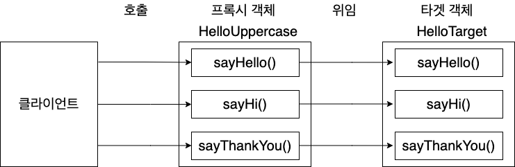
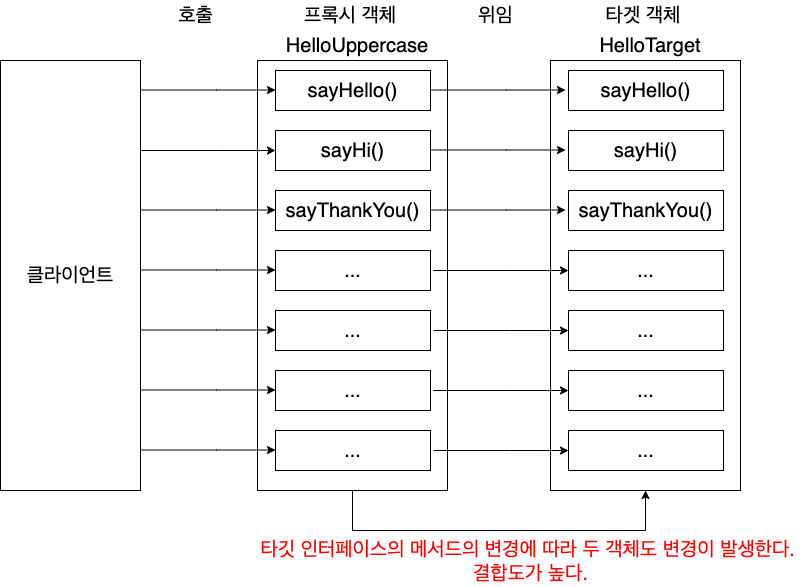
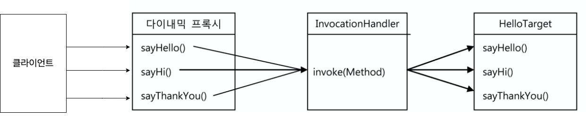
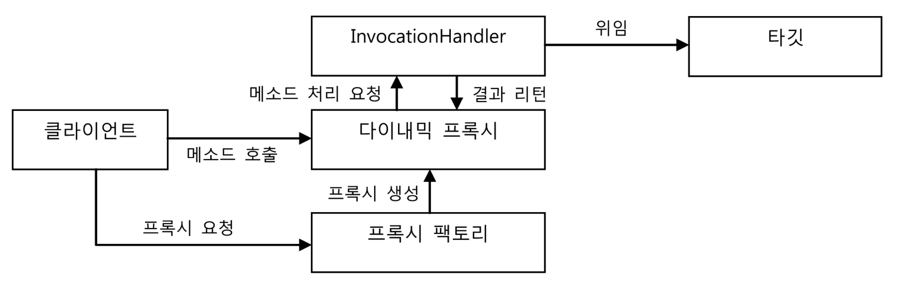

# 목차

<br>

- [목차](#목차)
- [들어가며](#들어가며)
- [사전 지식 - 리플렉션](#사전-지식---리플렉션)
- [프록시의 문제점](#프록시의-문제점)
- [다이내믹 프록시](#다이내믹-프록시)
  - [다이내믹 프록시란?](#다이내믹-프록시란)
  - [동작원리](#동작원리)
  - [예시](#예시)
- [마치며](#마치며)

<br>

# 들어가며
이번 글은 다이내믹 프록시에 대한 정리글이다.

> 본 글은 [토비의 스프링](http://www.yes24.com/Product/Goods/7516721?OzSrank=3)을 읽으며, 핵심 내용을 정리한 자료입니다.

<br>

# 사전 지식 - 리플렉션
우선 다이내믹 프록시를 이해하기 위해선 사전적 지식이 필요하다.

바로 "리플렉션"이다.

<br>

🤔 **리플렉션**
* **다이내믹 프록시와 리플렉션**
  * 다이내믹 프록시는 **리플렉션 기능을 이용해서 프록시를 만들**어준다.
  * 다이내믹 프록시를 이해하기 위해서 리플렉션 개념은 꼭 알아야한다.
* **리플렉션이란?**
  * 리플렉션은 자바의 코드 자체를 추상화해서 접근하도록 만든 것.
* **`Class`타입**
  * **자바의 모든 클래스는 그 클래스 자체의 구성정보를 담은 `Class` 타입의 객체를 가지고 있다.**
  * `클래스이름.class`혹은 `getClass()` 메서드를 호출하여 가져올 수 있다.
  * **이를 통해 클래스의 메타 데이터를 가져오거나 객체를 조작할 수 있다.**
    * 클래스 메타 데이터: 이름, 상속 정보, 구현 정보, 필드, 타입, 메서드등등

```java
// 리플렉션 간단한 예시
@Test
void invokeMethod() throws Exception {
    // given
    String name = "binghe";

    // when
    Method lengthMethod = String.class.getMethod("length"); // length
    Method charAtMethod = String.class.getMethod("charAt", int.class); // charAt

    // then
    assertThat(lengthMethod.getName()).isEqualTo("length"); // 메타데이터
    assertThat(charAtMethod.getName()).isEqualTo("charAt"); // 메타데이터
    assertThat(lengthMethod.invoke(name)).isEqualTo(name.length()); // 실행
    assertThat(charAtMethod.invoke(name, 0)).isEqualTo(name.charAt(0)); // 실행
}
```

중요한 것은 Method 객체를 통해 실제 메서드를 실행한다는 것.

<br>

> 리플렉션에 대한 더 자세한 내용은 [리플렉션 정리 글](../../Java/JVM/reflection.md)을 참고.

<br>

# 프록시의 문제점
다이내믹 프록시에 대해서 본격적으로 다루기 전에 왜 다이내믹 프록시 필요한지에 대해서 살펴본다.

개념만 살펴보기 보다는 대문자 부가기능 예시를 통해 프록시의 문제점에 대해서 살펴본다.

> Hello
```java
public interface Hello {
    String sayHello(String name);
    String sayHi(String name);
    String sayThankYou(String name);
}
```

> HelloTarget (타겟 객체 - 핵심 로직)
```java
public class HelloTarget implements Hello {

    @Override
    public String sayHello(String name) {
        return "Hello " + name;
    }

    @Override
    public String sayHi(String name) {
        return "Hi " + name;
    }

    @Override
    public String sayThankYou(String name) {
        return "Thank You " + name;
    }
}
```

> HelloUppercase (프록시 객체 - 부가 로직)
```java
public class HelloUppercase implements Hello {

    private final Hello target;

    public HelloUppercase(Hello target) {
        this.target = target;
    }

    @Override
    public String sayHello(String name) {
        return target.sayHello(name).toUpperCase();
    }

    @Override
    public String sayHi(String name) {
        return target.sayHi(name).toUpperCase();
    }

    @Override
    public String sayThankYou(String name) {
        return target.sayThankYou(name).toUpperCase();
    }
}
```

<p align="center"></p>

위와 같이 프록시 객체를 둠으로써 핵심 기능은 부가 기능을 가진 클래스의 존재 자체를 모르게 된다.

또한, 대문자가 아닌 소문자, 혹은 다른 부가 기능도 `Hello`라는 인터페이스를 구현하고 있으면, 언제든 바꿔낄 수 있다.

<br>

:scream: **이런 프록시에도 문제점은 있다**

바로 매 인터페이스마다 프록시 클래스를 정의해줘야 한다는 것이다.

이로인해 세 가지의 문제점을 야기할 수 있다.

<p align="center"> </p>

1. **부가기능이 필요 없는 메서드도 구현해서 타깃으로 위임하는 코드를 일일이 만들어줘야 한다.**
   * 심지어 타깃 인터페이스의 메서드가 추가되거나 변경될 때마다 함께 수정해줘야 한다.
   * `Hello`같이 3개면 괜찮지만, 만약 메서드가 100개 있는 인터페이스라면 끔찍하다.
2. 모든 인터페이스를 직접 구현해줘야 한다.
3. **부가기능 코드가 중복될 가능성이 많다.**
   * 트랜잭션 처리를 위한 Service를 구현한다고 가정한다면,
   * 트랜잭션이 필요한 Service마다 트랜잭션 처리용 프록시(XXXServiceTx) 객체를 만들어줘야하며, 이때 중복된 로직의 코드가 발생하게 된다.

<br>

**이러한 문제점을 해결한 것이 바로 다이내믹 프록시이다.**

<br>

# 다이내믹 프록시
이제 프록시의 문제를 알았으니, 문제를 해결한 다이내믹 프록시에 대해서 살펴본다.

<br>

## 다이내믹 프록시란?
🤔 **다이내믹 프록시란?**

* **다이내믹 프록시는 프록시 팩토리에 의해 런타임 시 다이내믹하게 만들어지는 객체를 의미**한다.
  * 타깃의 인터페이스와 같은 타입으로 만들어진다.
* 다이내믹 프록시는 모든 요청을 리플렉션을 통해 Method와 매개변수 (args)로 만들어, 하나의 객체에 위임한다.
  * 이때 하나의 객체는 `InvocationHandler`를 의미한다.

<br>

## 동작원리
🤔 **프록시의 문제를 어떻게 해결한건가?**

<p align="center"> </p>

* 일반적인 프록시와 다르게, 다이내믹 프록시는 모든 요청을 `InvocationHandler`에 위임한다.
  * 즉, `sayHello`, `sayHi`, `sayThankYou`등 메서드를 호출하면 리플렉션을 통해 `Method`와 `args`로 변환되어 `InvocationHandler`의 `invoke()`에 넘겨진다.
  * 부가로직은 기존의 프록시처럼 `InvocationHandler`에 정의해두면 된다.
* **다이내믹 프록시 객체가 클라이언트의 모든 요청을 리플렉션 정보로 변환해서 `InvocationHandler` 구현 객체의 `invoke()`메서드로 넘긴다.**
  * `public Object invoke(Object proxy, Method method, Object[] args)`
    * 만들어진 다이내믹 프록시는 메서드 요청을 리플렉션을 이용해 메타 데이터를 뽑아내고,  
    * `Method`와 매개변수와 함께 `InvocationHandler.invoke`에게 메시지 요청한다.

<br>

🤔 **다이내믹 프록시는 누가 만드는가?**

<p align="center"><br>출처: 토비의 스프링 vol.1 </p>

* **프록시 팩토리**
  * 프록시 팩토리에게 인터페이스 정보만 제공해주면 해당 **인터페이스를 구현한 클래스의 객체**를 자동으로 만들어준다.
* `InvocationHandler`
  * **프록시 팩토리가 인터페이스 구현 객체는 만들어주지만, 프록시로서 필요한 부가기능 코드는 직접 작성해야 한다.**
    * 부가기능 코드를 구현하는 것이 바로 `InvocationHandler`의 구현체이다.

<br>

## 예시
> UppercaseHandler (InvocationHandler)

```java
public class UppercaseHandler implements InvocationHandler {
    private final Hello target;

    // 다이내믹 프록시로부터 전달받은 요청을 다시 타깃 객체에 위임해야 하기 때문에 타깃 객체를 주입받는다.
    public UppercaseHandler(Hello target) {
        this.target = target;
    }

    @Override
    public Object invoke(Object proxy, Method method, Object[] args) throws Throwable {
        Object ret = method.invoke(target, args); // 타깃으로 위임(실행). 인터페이스의 메서드 호출에 모두 적용된다.
        if (ret instanceof String) {
            return ((String) ret).toUpperCase(); // 부가기능 제공 (리턴값은 클라이언트에게 전해진다.)
        }
        return ret;
    }
}
```
**위 코드에서 중요한 코드는 `method.invoke()`부분이다. 이 부분이 핵심 로직을 실행시키는 코드이다.**

<br>

> DynamicProxyTest

```java
class DynamicProxyTest {

    @DisplayName("다이내믹 프록시를 이용한 테스트 - 대문자 프록시")
    @Test
    void dynamicProxy() {
        // given
        String name = "binghe";

        // when
        // 다이내믹 프록시 생성
        Hello hello = (Hello) Proxy.newProxyInstance(
            getClass().getClassLoader(), // 클래스 로더
            new Class[]{ Hello.class },  // 다이내믹 프록시가 구현해야 할 인터페이스
            new UppercaseHandler(new HelloTarget()) // 부가 기능과 위임 관련 코드를 담고 있는 InvocationHandler
        );

        // then
        assertThat(hello.sayHello(name)).isEqualTo("HELLO BINGHE");
        assertThat(hello.sayHi(name)).isEqualTo("HI BINGHE");
        assertThat(hello.sayThankYou(name)).isEqualTo("THANK YOU BINGHE");
    }
}
```
* **타깃 인터페이스의 모든 메서드 요청이 하나의 메서드(`invoke()`)로 집중되기 때문에 중복되는 기능을 효과적으로 제공할 수 있다.**
  * `sayHello`, `sayHi`, `sayThankYou`등 메서드를 호출하면 리플렉션을 통해 `Method`로 변환되어 `invoke()`에 넘겨진다.
  * 만약 인터페이스의 메서드가 3개가 아닌 30개가 된다면 장점은 더 뚜렷해진다.
* 또한, **타깃의 종류에 상관없이도 적용이 가능하다.**

<br>

만약 `say`가 붙은 메서드에만 프록시를 적용시키고 싶다면 아래와 같이 리팩토링하면 된다.

> UppercaseHandler (InvocationHandler)
```java
@Override
public Object invoke(Object proxy, Method method, Object[] args) throws Throwable {
    Object ret = method.invoke(target, args); // 타깃으로 위임(실행).
    if (ret instanceof String && method.getName().startsWith("say")) { // String인 경우에만 대문자 변경 기능을 적용.
        return ((String) ret).toUpperCase();
    }
    return ret;
}
```

<br>

# 마치며
처음 토비의 스프링은 스프링 책인 줄 알았다.

하지만 지금은 객체지향 책에 더 가깝지 않나 싶다.

또한, 스프링이 얼마나 POJO를 지향하고, 객체지향을 지향하는지 알게된 좋은 기회였다.

다이내믹 프록시를 활용할 수 있는 곳은 무궁무진할 듯 싶다.

