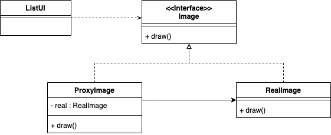

# 목차

<br>

- [목차](#목차)
- [프록시 패턴](#프록시-패턴)
  - [1 프록시 패턴이란](#1-프록시-패턴이란)
  - [2 동작 원리](#2-동작-원리)
  - [3 예시](#3-예시)
    - [3-1 프록시를 적용한 예시와 적용하지 않은 예시](#3-1-프록시를-적용한-예시와-적용하지-않은-예시)
    - [3-2 돈 예시](#3-2-돈-예시)
    - [3-3 이미지 로딩 예시](#3-3-이미지-로딩-예시)
  - [4 프록시 종류](#4-프록시-종류)
  - [5 프록시 패턴을 적용할 때 고려할 점](#5-프록시-패턴을-적용할-때-고려할-점)
  - [6 프록시 패턴 vs 데코레이터 패턴](#6-프록시-패턴-vs-데코레이터-패턴)

<br>

# 프록시 패턴

<br>

## 1 프록시 패턴이란
* 사전적 의미
  * 대리, 대리인 (현실에는 청화대 대변인, 백악관 대변인 등등 다양한 대변인이 등장한다.)
* 프록시의 의미
  * 다른 무언가와 이어지는 **인터페이스의 역할**을 하는 클래스
  * 어떠한 것과도 인터페이스의 역할을 수행할 수 있다.
    * 네트워크 연결, 메모리 안의 커다란 객체, 파일, 또는 복제할 수 없는 것, 리소스등등
* 프록시 패턴
  * **제어 흐름을 조정하기 위한 목적으로 중간에 대리자를 두는 패턴**
  * **실제 객체를 대신하는 프록시 객체를 사용해서 실제 객체의 생성이나 접근 등을 제어할 수 있도록 해주는 패턴**

<br>

## 2 동작 원리
* 대리자는 실제 서비스와 같은 이름의 메서드를 구현한다. 이때 인터페이스를 사용한다.
* 대리자는 실제 서비스에 대한 참조 변수를 갖는다. (합성)
* 대리자는 실제 서비스의 같은 이름을 가진 메서드를 호출하고 그 값을 클라이언트에게 돌려준다.
* **대리자는 실제 서비스의 메서드 호출 전후에 별도의 로직을 수행할 수도 있다.**

<br>

## 3 예시

<br>

### 3-1 프록시를 적용한 예시와 적용하지 않은 예시
**적용하지 않은 예시**
```java
// 프록시를 적용하지 않는 예제
public class Service {
  public String runSomething() {
    return "서비스 짱!!";
  }
}

public class ClientWithNoProxy {
  public static void main(String[] args) {
    Service service = new Service();
    System.out.println(service.runSomething());
  }
}
```

<br>

**적용한 예시**
<p align="center"></p>

```java
// 프록시를 적용한 예제
public interface IService {
  String runSomething();
}

public class Service implements IService {
  public String runSomething() {
    return "서비스 짱!!!";
  }
}

public class Proxy implements IService {
  IService service1;
  
  public String runSomething(){
    System.out.println("호출에 대한 흐름 제어가 주목적, 반환 결과를 그대로 전달");
    
    service1 = new Service();
    return service1.runSomething();
  }
}

public class ClientWithProxy {
  public static void main(String[] args) {
    IService proxy = new Proxy();
    System.out.println(proxy.runSomething());
  }
}
```
* 프록시가 `Service` (`RealSubject`)에 의존한다.

<br>

### 3-2 돈 예시
<p align="center"></p>

* The Proxy provides a surrogate or place holder to provide access to an object. A check or bank draft is a proxy for funds in an account. A check can be used in place of cash for making purchases and ultimately controls access to cash in the issuer's account.

<br>

### 3-3 이미지 로딩 예시
* 제품 목록을 구성할 때 관련된 모든 이미지를 로딩하면 불필요한 메모리를 사용하게 된다.
  * 이럴 경우, 스크롤을 하기 전에는 이미지를 로딩하지말고, 보여질 때 로딩하도록 하면 문제가 해결된다.
  * 이를 프록시 패턴으로 구현할 수 있다.

<p align="center"></p>

```java
interface Image {
    public void displayImage();
}

// 구체 이미지
class RealImage implements Image {
    private String filename;
    public RealImage(String filename) {
        this.filename = filename;
        loadImageFromDisk();
    }

    private void loadImageFromDisk() {
        System.out.println("Loading   " + filename);
    }

    @Override
    public void displayImage() {
        System.out.println("Displaying " + filename);
    }
}

// 프록시
class ProxyImage implements Image {
    private String filename;
    private Image image;

    public ProxyImage(String filename) {
        this.filename = filename;
    }

    @Override
    public void displayImage() {
        if (image == null) // lazy
           image = new RealImage(filename); // 최초 접근 시 객체 생성

        // 실제 이미지를 사용하기 전 처리

        image.displayImage(); // RealImage 객체에 위임

        // 실제 이미지를 사용하기 후 처리
    }
}

// 사용
public class ListUI {
    private List<Image> images;
    public ListUI(List<Image> images) {
        this.images = images;
    }

    public void onScroll(int start, int end) {
        // 스크롤 시, 화면에 표시되는 이미지를 표시
        for (int i = start; i <= end; i++) {
            Image image = images.get(i);
            image.displayImage();
        }
    }
}
```
* `Image` 인터페이스는 이미지를 표현하며 `ListUI`는 `Image` 타입을 이용해서 화면에 이미지를 표시한다.
* `RealImage`는 실제로 이미지 데이터를 로딩해서 메모리에 보관하는 콘크리트(구체적) 클래스다.
* `ProxyImage`는 프록시 역할을 한다.

<br>

## 4 프록시 종류
* 가상 프록시 (virtual proxy)
  * 위 예시중 하나인 `ProxyImage`처럼 필요한 순간에 실제 객체를 생성해주는 프록시
* 보호 프록시 (protection proxy)
  * 실제 객체에 대한 접근을 제어하는 프록시로서, 접근 권한이 있는 경우에만 실제 객체의 메서드를 실행하는 방식으로 구현한다.
* 원격 프록시 (remote proxy)
  * 자바의 RMI(Remote Method Invocation)처럼 다른 프로세스에 존재하는 객체에 접근할 때 사용되는 프록시다.

<br>

## 5 프록시 패턴을 적용할 때 고려할 점
* **실제 객체를 누가 생성할 것인가**
  * 실제 생성할 객체의 타입을 알고 있다면 구체 클래스를 사용하면 되고, 프록시를 생성하면서 실제 객체의 타입을 전달하려면 추상 타입을 이용하면 된다. (정답은 없는 듯 하다. 알아서 구현하자.)
* 위임 방식이 아닌 상속으로도 프록시를 구현할 수 있다. 하지만 유연성이 안좋다.

<br>

## 6 프록시 패턴 vs 데코레이터 패턴
* 두 패턴은 위임을 사용한다는 점에서 매우 유사하다
* **하지만 의도에서 분명한 차이가 존재한다.**
  * **프록시 패턴: 실제 객체에 대한 접근을 제어하는데 초점**
  * **데코레이터 패턴: 기존 객체의 기능을 확장하는데 초점**

