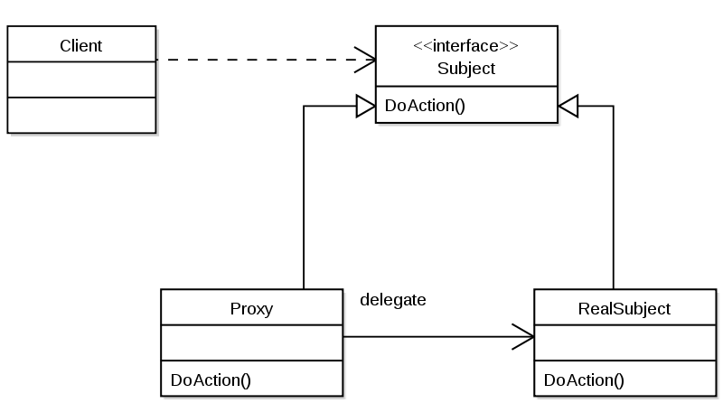

# 목차

<br>

- [목차](#목차)
- [들어가며](#들어가며)
- [프록시 개념](#프록시-개념)
  - [프록시](#프록시)
  - [프록시 특징](#프록시-특징)
  - [프록시와 전략패턴](#프록시와-전략패턴)
- [데코레이터 패턴](#데코레이터-패턴)
- [프록시 패턴](#프록시-패턴)
- [예시](#예시)
  - [프록시를 적용한 예시와 적용하지 않은 예시](#프록시를-적용한-예시와-적용하지-않은-예시)
  - [대문자 부가기능](#대문자-부가기능)
- [참고](#참고)

<br>

# 들어가며
이번 디자인 패턴은 프록시 패턴과 데코레이터 패턴이다.

기존엔 프록시 패턴과 데코레이터 패턴에 대한 필요성을 못느껴, 수동적으로 이해하고 있었다.

이번에 [토비의 스프링](http://www.yes24.com/Product/Goods/7516721?OzSrank=3)를 읽으면서 중요성을 느끼게 되었고, 프로젝트를 진행하며 프록시 패턴을 사용할 일이 생겨 더 크게 다가왔다.

이참에 프록시와 프록시 패턴, 그리고 데코레이터 패턴에 대해서 정리해본다.

<br>

# 프록시 개념
우선 프록시의 개념을 살펴본다.

<br>

## 프록시
**🤔 프록시**
> 프록시는 전략 패턴의 한계를 해결해줄 수 있다.

<p align="center"><br>출처: 토비의 스프링 vol.1</p>

* **프록시**
  * 자신이 클라이언트가 사용하려고 하는 실제 대상인 것처럼 위장해서 클라이언트의 요청을 받아주는 것을 의미한다.
  * 대리자, 대리인
* **타깃 (실체)**
  * 프록시를 통해 최종적으로 요청을 위임받아 처리하는 실제 객체를 타깃이라 한다. (핵심 비즈니스)
* **프록시의 기능**
  * 타깃과 같은 메서드를 구현하고 있다가 메서드가 호출되면 타깃 객체로 **위임**한다. **(위임)**
  * 지정된 요청에 대해서는 **부가기능을 수행**한다. **(부가기능 수행)**

<br>

## 프록시 특징
<p align="center"></p>

* **위임**
  * 부가기능 외의 나머지 모든 기능은 원래 핵심기능을 가진 클래스로 위임해줘야 한다. (부가기능에서 핵심로직에게 위임)
* **부가 기능이 핵심 기능을 사용하는 구조**
  * 핵심기능은 부가기능을 가진 클래스의 존재 자체를 모른다.
  * 따라서 **부가기능이 핵심기능을 사용하는 구조가 된다.**
* **모두 핵심로직(타깃) 인터페이스를 구현해야한다.**
  * 클라이언트 입장에선 인터페이스만 보고 사용하기 때문에 핵심 기능을 가진 객체를 사용할 것이라고 기대한다. 하지만 사실은 부가기능을 통해 핵심기능을 이용하는 것.
  * 그러기위해선 부가로직도 핵심로직 인터페이스를 구현해줘야한다.
  * 이렇게해야 부가기능과 핵심로직의 순서를 자유자재로 변경해줄 수 있다.
* **프록시가 타깃을 제어할 수 있는 위치다.**

<br>

**프록시 사용목적**
* 클라이언트가 타깃에 접근하는 방법을 제어하기 위함 (프록시 패턴)
* 타깃에 부가적인 기능을 부여해주기 위함 (데코레이터 패턴)

> DispatcherServlet의 인터셉터도 프록시인가??

<br>

## 프록시와 전략패턴

<br>

프록시를 생각하기전에 전략 패턴에 대해서 생각해보자.

전략 패턴도 프록시와 유사하게 핵심 로직과 부가로직을 분리시키기 위한 대표적인 디자인 패턴이다.

둘 다 로직을 분리시키기위해 객체로 분리시킨다.

하지만 둘 사이엔 큰 차이가 있다.

<br>

**전략 패턴의 한계**

<p align="center"><br>전략 패턴을 통한 부가기능 구현의 분리<br>출처: 토비의 스프링 vol.1</p>

* 단순히 확장성을 고려해서 한 가지 기능을 분리한다면 전형적으로 전략 패턴을 생각한다.
  * 하지만, **전략 패턴만으론 기능의 구체적인 구현 내용을 분리만 가능하지, 코드는 그대로 남는다.**
* **쉽게 말해, 구체적인 구현 코드는 제거했을지라도 위임을 통해 기능을 사용하는 코드는 핵심 코드와 함께 남아있는다.**
  * 즉, 비즈니스 로직과 트랜잭션 로직을 객체로 완전히 분리시킬 수 없다.
* **또한, 핵심 기능과 부가 기능의 순서가 변경되거나, 핵심기능을 사용하지 않는다면, 전략 패턴은 많은 수정이 필요하다.**
  * **다시 말해 객체간의 관계와 순서가 정해져있다.**


<br>

# 데코레이터 패턴
<br>

🤔 **데코레이터 패턴이란?**
* **타깃에 부가적인 기능을 런타임 시 다이내믹하게 부여해주기 위해 프록시를 사용하는 패턴.**
* **데코레이터의 의미**
  * 마치 제품이나 케익 등을 여러 겹으로 포장하고 그 위에 장식을 붙이는 것처럼 **실제 내용물은 동일하지만 부가적인 효과를 부여해줄 수 있기 때문**이라고 한다.

<br>

🤔 **다이내믹이란?**
* **코드 레벨(컴파일)에서는 어떤 방법과 순서로 프록시와 타깃이 연결되어 사용되는지 정해져 있지 않다는 의미. (동적)**
  * 코드 레벨에선 추상적인 것에 의존하고 있다는 의미. 런타임땐 구체적인 것에 의존.

<br>

:point_right: **예시**
* 소스코드를 출력하는 기능 -> 여러가지 기능을 순서로 조합하여 사용할 수 있다.

<p align="center"><br>출처: 토비의 스프링 vol.1</p>

* 또다른 대표적인 예시로는 자바 IO패키지
  * `InputStream is = new BufferedInputStream(new FileInputStream("a.txt"));`

<br>

**데코레이터 패턴의 특징**

* **자신이 위임하는 다음 대상이 무엇인지 코드레벨에선 모른다.**
  * 모두 타깃 인터페이스로 구현되기 때문에, 자신이 최종 타깃으로 위임하는지, 다음 단계의 프록시로 위임하는지 모른다.
* **순서를 정해줄 수 있다.**
  * 생성자나 setter를 통해 기능별 순서(위임 순서)를 정해줄 수 있다. 
* **구성하기에 따라서 여러 개의 데코레이터를 적용할 수 있다.**
* **타깃의 코드를 손대지 않고, 클라이언트가 호출하는 방법도 변경하지 않은 채로 새로운 기능을 추가할 때 유용하다.**
  * `UserServiceImpl` (비즈니스 로직)에 `UserServiceTx` (트랜잭션 로직)을 추가한 것 처럼!

<br>

**스프링과 데코레이터의 조합**
* **인터페이스를 통한 데코레이터 정의와 런타임 시의 다이내믹한 구성 방법은 스프링의 DI를 이용하면 굉장히 편리한다.**
  * **데코레이터 빈의 상태로 같은 인터페이스를 구현한 다른 데코레이터 또는 타깃 빈을 설정하면 된다.**

<br>

# 프록시 패턴

<br>

:scream: **프록시 != 프록시 패턴**
* 프록시: 클라이언트와 사용 대상 사이에 대리 역할을 맡은 객체를 두는 방법의 총칭
* 프록시 패턴: 프록시를 사용하는 방법중 타깃에 대한 접근 방법을 제어하려는 목적을 가진 패턴.

<br>

🤔 **프록시 패턴이란?**
* 프록시 패턴은 타깃의 기능 자체에는 관여하지 않으면서 접근하는 방법을 제어해주는 프록시를 말한다.
  * 클라이언트가 타깃에 접근하는 방식을 변경해준다.
* 프록시 패턴 vs 데코레이터 패턴
  * 프록시 패턴: 실제 객체에 대한 접근을 제어하는데 초점
  * 데코레이터 패턴: 기존 객체의 기능을 확장하는데 초점

<br>

**프록시 패턴 특징**
* Lazy한 처리가 가능하다.
  * 타깃 객체를 생성하기 복잡하거나 오래 걸린다면, 사용할 때 비로소 프록시 객체에서 타깃 객체를 생성하도록 할 수 있다.
  * 다만, 프록시가 코드에서 타깃을 구체적으로 생성해야한다.
* 아래와 같이 데코레이터와 혼용해서 사용할 수도 있다.

<p align="center"><br>출처: 토비의 스프링 vol.1</p>

<br>

:point_right: **예시**
* 접근 권한
  * `Collection.unmodifiableCollection()`: 컬렉션 접근 권한 제어용 프록시역할
  * 원격 객체에 접근하는 프록시: 다른 서버에 존재하는 객체에 접근해야한다면, 마치 로컬에 있는 것처럼 프록시를 통해 사용할 수 있다.

<br>

# 예시
이제 프록시와 프록시 패턴, 그리고 데코레이터 패턴의 개념을 이해했다.

예시를 통해 더 살펴보자.

<br>

## 프록시를 적용한 예시와 적용하지 않은 예시
**적용하지 않은 예시**
```java
// 프록시를 적용하지 않는 예제
public class Service {
  public String runSomething() {
    return "서비스 짱!!";
  }
}

public class ClientWithNoProxy {
  public static void main(String[] args) {
    Service service = new Service();
    System.out.println(service.runSomething());
  }
}
```

<br>

**적용한 예시**
<p align="center"></p>

```java
// 프록시를 적용한 예제
public interface IService {
  String runSomething();
}

public class Service implements IService {
  public String runSomething() {
    return "서비스 짱!!!";
  }
}

public class Proxy implements IService {
  IService service1;
  
  public String runSomething(){
    System.out.println("호출에 대한 흐름 제어가 주목적, 반환 결과를 그대로 전달");
    
    service1 = new Service();
    return service1.runSomething();
  }
}

public class ClientWithProxy {
  public static void main(String[] args) {
    IService proxy = new Proxy();
    System.out.println(proxy.runSomething());
  }
}
```
* 프록시가 `Service` (`RealSubject`)에 의존한다.

> 타겟 객체를 주입해주지 않고 프록시가 생성하여 사용하는 예시다.

<br>

## 대문자 부가기능
프록시 객체가 입력 값으로 들어온 문자열을 모두 대문자로 변경하는 역할을 담당하는 예시

> Hello

```java
public interface Hello {
    String sayHello(String name);
    String sayHi(String name);
    String sayThankYou(String name);
}
```

<br>

> HelloTarget (타겟 객체 - 핵심 기능)
```java
public class HelloTarget implements Hello {

    @Override
    public String sayHello(String name) {
        return "Hello " + name;
    }

    @Override
    public String sayHi(String name) {
        return "Hi " + name;
    }

    @Override
    public String sayThankYou(String name) {
        return "Thank You " + name;
    }
}
```

<br>

> HelloUppercase (부가 기능)
```java
public class HelloUppercase implements Hello {

    private final Hello target;

    public HelloUppercase(Hello target) {
        this.target = target;
    }

    @Override
    public String sayHello(String name) {
        return target.sayHello(name).toUpperCase();
    }

    @Override
    public String sayHi(String name) {
        return target.sayHi(name).toUpperCase();
    }

    @Override
    public String sayThankYou(String name) {
        return target.sayThankYou(name).toUpperCase();
    }
}
```

<br>

> HelloUppercaseTest (테스트)
```java
class HelloUppercaseTest {

    @DisplayName("일반적인 프록시 패턴 - 대문자 프록시")
    @Test
    void upperProxy() {
        // given
        String name = "binghe";

        // when
        Hello hello = new HelloUppercase(new HelloTarget()); // 타깃 객체를 프록시 객체 안으로 주입한다.

        // then
        assertThat(hello.sayHello(name)).isEqualTo("HELLO BINGHE");
        assertThat(hello.sayHi(name)).isEqualTo("HI BINGHE");
        assertThat(hello.sayThankYou(name)).isEqualTo("THANK YOU BINGHE");
    }
}
```

<br>

# 참고
* [토비의 스프링 vol.1](http://www.yes24.com/Product/Goods/7516721?OzSrank=3)
