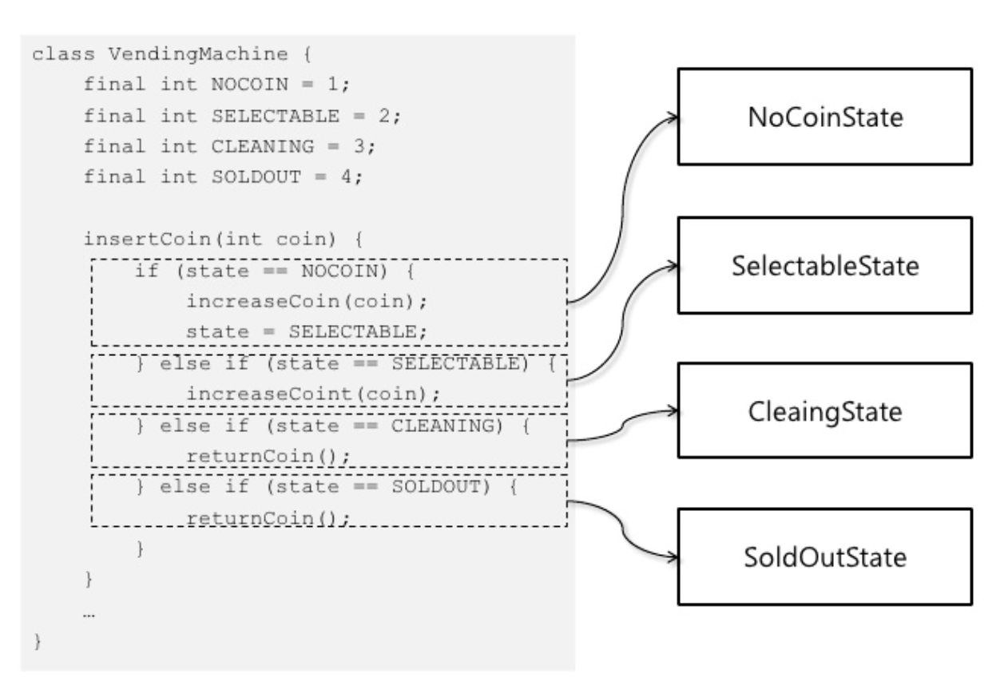

# 목차

<br>

- [목차](#목차)
- [상태 패턴](#상태-패턴)
  - [1 개념](#1-개념)
  - [2 상태 패턴을 왜 사용하는가?](#2-상태-패턴을-왜-사용하는가)
  - [3 상태 변화는 누가하는가?](#3-상태-변화는-누가하는가)
    - [3-1 상태 객체에서 처리](#3-1-상태-객체에서-처리)
    - [3-2 컨텍스트에서 처리](#3-2-컨텍스트에서-처리)
- [참고](#참고)

<br>

# 상태 패턴

<br>

## 1 개념
<p align="center"> </p>

* **객체가 특정 상태에 따라 기능(행위)을 달리하는 상황에서, 자신이 직접 상태를 체크하여 상태에 따라 기능(행위)를 호출하지 않고, 상태를 객체화 하여 상태가 행동을 할 수 있도록 위임하는 패턴**
  * 즉, 객체의 특정 상태를 클래스로 선언하고, 클래스에서는 해당 상태에서 할 수 있는 행위들을 메서드로 정의한다.
  * 각 상태 클래스들은 인터페이스로 캡슐화하여, 클라이언트에서 인터페이스를 호출하는 방식을 이용한다.
* 중요한 점은 상태 객체가 기능을 제공한다는 점이다.
* ex. 게임내의 규칙 (상태)를 객체로 추상화하는 것.

> 공학에선 상태 패턴을 흔히 '유한 상태 머신'이라고도 부른다. 
> 
> 즉, '유한 상태 머신'이 코드로 구현된 것이 상태 패턴이다.

<br>

## 2 상태 패턴을 왜 사용하는가?

**상태 패턴을 사용하지 않는 예시**
```java
public class VendingMachine {
    public static enum State {NOCOIN, SELECTABLE, SOLDOUT}

    private State state = State.NOCOIN;
    private int coin;

    public void insertCoin(int coin) {
        switch (state) {
            case NOCOIN:
                increaseCoin(coin);
                state = State.SELECTABLE;
                break;
            case SELECTABLE:
                increaseCoin(coin);
            case SOLDOUT:
                returnCoint();
        }
    }
    
    public void select(int productId) {
        switch (state) {
            case NOCOIN:
                // 아무것도 하지 않음
                break;
            case SELECTABLE:
                provideProduct(productId);
                decreaseCoin();
                if (hasNoCoint()) {
                    state = State.NOCOIN;
                }
                break;
            case SOLDOUT:
                // 아무것도 하지 않음
        }
    }
}
```
* `if-else`를 통해 상태에 따라 동일한 기능 요청의 처리를 다르게 한다.
  * 문제는 새로운 요구사항이 있으면 모든 `if`문을 수정해줘야한다.

<br>

**상태 패턴을 사용한 예시**
```java
// 상태 인터페이스 (전략)
public interface State {

    void increaseCoin(int coin, VendingMachine vendingMachine);
    void select(int productId, VendingMachine vendingMachine);
}

// 상태 객체 (핵심 로직)
public class SelectableState implements State {

    @Override
    public void increaseCoin(int coin, VendingMachine vendingMachine) {
        vendingMachine.insertCoin(coin);
    }

    @Override
    public void select(int productId, VendingMachine vendingMachine) {
        vendingMachine.provideProduct(productId);
        vendingMachine.decreaseCoin();

        if (hasNoCoin()) {
            vendingMachine.changeState(new NoCoinState());
        }
    }
}

public class NoCoinState implements State {

    @Override
    public void increaseCoin(int coin, VendingMachine vendingMachine) {
        vendingMachine.insertCoin(coin);
        vendingMachine.changeState(new SelectableState());
    }

    @Override
    public void select(int productId, VendingMachine vendingMachine) {
        // 코인 없다는 사운드 실행
    }
}
```
```java
// 컨텍스트
public class VendingMachine {

    private State state;

    public VendingMachine() {
        this.state = new NoCoinState();
    }

    public void insertCoin(int coin) {
        state.increaseCoin(coin, this); // 상태 객체에 위임
    }

    public void select(int productId) {
        state.select(productId, this); // 상태 객체에 위임
    }

    ...
}
```
<p align="center"><br>출처 : https://www.slideshare.net/madvirus/state </p>

* 기존 `if-else`에 상태 별 동작 구현 코드가 각 상태의 구현 클래스로 이동함을 알 수 있다.
* **상태 별 처리 코드를 상태로 분리함으로써 콘텍스트의 코드가 간결해지고 변경의 유연함을 얻게 된다.**

<br>

## 3 상태 변화는 누가하는가?
상태에 따라 로직을 실행하고 누가 상태를 변경시킬 것인가??

<br>

### 3-1 상태 객체에서 처리
```java
public class NoCoinState implements State {

    @Override
    public void increaseCoin(int coin, VendingMachine vendingMachine) {
        vendingMachine.insertCoin(coin);
        vendingMachine.changeState(new SelectableState()); // 상태 객체에서 컨텍스트의 상태 변경
    }

    ...
}


public class SelectableState implements State {
    ...

    @Override
    public void select(int productId, VendingMachine vendingMachine) {
        vendingMachine.provideProduct(productId);
        vendingMachine.decreaseCoin();

        if (vm.hasNoCoin()) { // 상태 변경을 위해, vm 객체가 동전이 없는지 확인
            vendingMachine.changeState(new NoCoinState());
        }
    }
}
```
* 단점
  * 상태 객체에서 컨텍스트의 상태를 변경할 수 있는 조건을 확인할 수 있게 컨텍스트에서 공개 메서드가 필요하다. (`vm.hasNoCoin()`)
  * 각 상태 클래스에서 다른 상태 클래스에 대한 의존도가 발생하여 결합도가 높아진다.
* 이럴때 사용하자
  * 상태 개수가 많고 상태 변경 규칙이 많이 바뀔 때 유리하다.

<br>

### 3-2 컨텍스트에서 처리
```java
public class VendingMachine {
    private State state;

    public VendingMachine() {
        state = new NoCoinState();
    }

    public void insertCoin(int coin) {
        state.increaseCoin(coin, this);
        if (hasCoin()) {
            changeState(new SelectableState()); // 컨텍스트에서 상태 변경
        }
    }

    public void select(int productId) {
        state.select(productId, this);
        if (state.isSelectable() && hasNoCoin()) {
            changeState(new NoCoinState()); // 컨텍스트에서 상태 변경
        }
    }
}
```
* 단점
  * 상태 종류가 지속적으로 변경되거나 상태 변경 규칙이 자주 바뀔 경우 컨텍스트의 상태 변경 처리 코드가 복잡해진다.
* 이럴때 사용하자
  * 상태 개수가 적고 상태 변경 규칙이 거의 바뀌지 않을 경우 유리하다.

<br>

# 참고
* [개발자가 반드시 정복해야 할 객체 지향과 디자인 패턴](http://www.yes24.com/Cooperate/Naver/welcomeNaver.aspx?pageNo=1&goodsNo=9179120)