[오브젝트 - 코드로 이해하는 객체지향 설계](http://www.yes24.com/Product/Goods/74219491?OzSrank=1) 를 정리한 자료입니다.

<br>

# 목차

- [목차](#목차)
- [Chapter 05 책임 할당하기](#chapter-05-책임-할당하기)
  - [1 책임 주도 설계를 향해](#1-책임-주도-설계를-향해)
    - [1-1 데이터보다 행동을 먼저 결정하라](#1-1-데이터보다-행동을-먼저-결정하라)
    - [1-2 협력이라는 문맥 안에서 책임을 결정하라](#1-2-협력이라는-문맥-안에서-책임을-결정하라)
    - [1-3 책임 주도 설계(RDD) - 중요](#1-3-책임-주도-설계rdd---중요)
  - [2 책임 할당을 위한 GRASP 패턴](#2-책임-할당을-위한-grasp-패턴)
    - [2-1 도메인 개념에서 출발하기](#2-1-도메인-개념에서-출발하기)
    - [2-2  INFORMATION EXPERT 패턴 (첫번째 원칙)](#2-2--information-expert-패턴-첫번째-원칙)
    - [2-3 높은 응집도와 낮은 결합도 (두번째 원칙)](#2-3-높은-응집도와-낮은-결합도-두번째-원칙)
    - [2-4 CREATOR 패턴 (세 번째 원칙)](#2-4-creator-패턴-세-번째-원칙)
  - [3 구현을 통한 검증](#3-구현을-통한-검증)
    - [3-1 메시지 결정 => 책임 결정](#3-1-메시지-결정--책임-결정)
    - [3-2 POLYMORPHISM 패턴](#3-2-polymorphism-패턴)
      - [분리 후 - 다형성](#분리-후---다형성)
    - [3-3 상속보다는 합성 - 중요](#3-3-상속보다는-합성---중요)
  - [4 책임 주도 설계 방법: 리팩터링 - 중요](#4-책임-주도-설계-방법-리팩터링---중요)
    - [4-1 첫번째 리팩터링 - 메서드 응집도](#4-1-첫번째-리팩터링---메서드-응집도)
    - [4-2 두번째 리팩터링 - 객체를 자율적으로 만들기](#4-2-두번째-리팩터링---객체를-자율적으로-만들기)
  - [정리](#정리)

<br>

# Chapter 05 책임 할당하기

3장에서는 역할, 책임, 협력이 객체지향의 핵심이라는 사실을 배웠다.

4장에서는 역할, 책임, 협력이 아닌 데이터에 초점을 맞출 때 어떤 문제점이 발생했는데 관해 배웠다.

* 데이터 중심적으로 설계시, 캡슐화를 위반하기 쉽고, 요소들 사이의 결합도가 높아지며, 코드 변경이 어려워 진다.

5장에서는 책임을 할당하는 방법에 대해서 다룬다.

* **책임 할당 과정은 일종의 트레이드오프 활동. :arrow_right: 정답이 없다. 상황에 맞게 평가하면 된다.**

<br>

## 1 책임 주도 설계를 향해

**책임 주도 설계는 두 가지 원칙을 따라야 한다.**

* **데이터보다 행동을 먼저 결정하라**
* **협력이라는 문맥 안에서 책임을 결정하라**

<br>

### 1-1 데이터보다 행동을 먼저 결정하라

<br>

**객체에게 중요한 것은 데이터가 아니라 외부에 제공하는 행동이다.**

* **클라이언트의 관점에서 객체가 수행하는 행동이란 곧 객체의 책임을 의미한다.**
* 객체는 협력에 참여하기 위해 존재하며 협력 안에서 수행하는 책임이 객체의 존재가치를 증명한다.

<p align="center">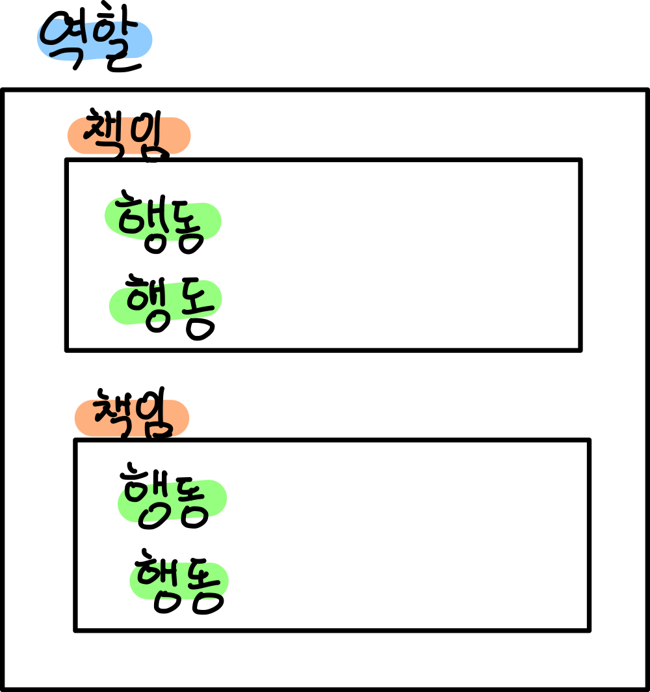 </p>

<br>

**책임 중심의 설계의 순서 (책임 :arrow_right: 데이터)**

1. 이 객체가 수행해야 하는 **책임은 무엇인가** 
2. 이 책임을 수행하는 데 필요한 **데이터는 무엇인가**

<br>

**객체지향 설계에서 가장 중요한 것 :arrow_right: 적절한 객체에게 적절한 책임을 할당하는 것.**

<br>

### 1-2 협력이라는 문맥 안에서 책임을 결정하라

<br>

**책임의 품질**

* **협력에 적합한 정도로 결정한다.**
  * 객체에게 할당된 책임이 협력에 어울리지 않으면 그 책임은 나쁜 것.
  * **객체의 입장에서 책임이 어색해 보이더라고 협력에 적합하다면 그 책임은 좋은 것.**
    * 객체는 개인주의 아니야!

<br>

**협력에 적합한 책임이란?**

* **메시지 수신자(내부)가 아니라 메시지 전송자(외부)에게 적합한 책임을 의미한다.**
  * 메시지 전송자에게 보일 책임 => 인터페이스
* **메시지를 결정한 후에 객체를 선택해야한다.**
  * 외부 인터페이스 => 구현체(객체)

<br>

**메시지 기반 설계**

* **메시지 결정  :arrow_right:  책임을 결정**
  * 객체는 외부로부터 어떠한 메시지를 받아야하는가? :arrow_right: 책임은 자동적으로 결정
* 메시지를 잘 결정하면 자동으로 책임도 할당되게 된다.

<br>

### 1-3 책임 주도 설계(RDD) - 중요

<br>

**책임 주도 설계의 흐름**

* **시스템이 사용자에게 제공해야 하는 기능인 시스템 책임을 파악한다.** (요구사항 분석)
* **시스템 책임을 더 작은 책임으로 분할한다.**
* 분할된 책임을 수행할 수 있는 적절한 객체 또는 역할을 찾아 **책임을 할당한다.**
* 객체가 책임을 수행하는 도중 다른 객체의 도움이 필요한 경우 이를 책임질 적절한 객체 또는 역할을 찾는다.
* 해당 객체 또는 역할에게 책임을 할당함으로써 두 객체가 협력하게 된다.

<br>

**책임 주도 설계의 핵심**

* 책임을 결정한 후에 책임을 수행할 객체를 결정하는 것.
  * **외부 인터페이스를 결정하고, 구현할 객체를 결정. (다형성, 추상화)**
* 협력에 참여하는 객체들의 책임이 어느 정도 정리될 때까지는 객체의 내부 상태에 대해 관심을 가지지 않는다.
  * 책임 결정 :arrow_right: 내부 구현 :arrow_right: 내부 상태

<br>

## 2 책임 할당을 위한 GRASP 패턴

> 책임을 할당하는 기준을 제공

<br>

**GRASP 패턴이란?**

* General Reponsibility Assignment Software Pattern
* 일반적인 책임 할당을 위한 소프트웨어 패턴
* **객체에게 책임을 할당할 때 지침으로 삼을 수 있는 패턴을 정리한 것.**

<br>

### 2-1 도메인 개념에서 출발하기

도메인을 그리면 큰 그림을 그릴 수 있다. 필요한 객체를 알 수 있다.

<p align="center">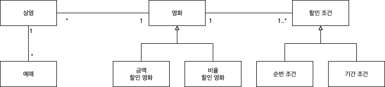 </p>

<br>

**처음 설계시 도메인은 완벽하지 않아도 된다**

* 중요한 것은 설계를 시작하는 것이지 처음부터 도메인을 너무 완벽하게 설계하려고 하지 마라.
* 차라리 빨리 설계와 구현을 통해 도메인을 변경해라.

<br>

### 2-2  INFORMATION EXPERT 패턴 (첫번째 원칙)

정보 전문가에게 책임을 할당하라

책임 주도 설계에서 제일 먼저 해야할 일은 객체에게 책임을 할당하는 것.

<br>

**책임 할당 시 생각해야할 질문**

1. 메시지를 전송할 객체는 무엇을 원하는가?
2. 메시지를 수신할 적합한 객체는 누구인가?

<br>

**INFORMATION EXPERT 패턴**

* **책임을 수행하는 데 필요한 정보를 가지고 있는 객체에게 할당하라.**
  * 정보를 알고 있는 객체만이 책임을 어떻게 수행할지 스스로 결정할 수 있기 때문.
  * "객체가 자율적인 존재여야 한다"를 강조한다.

<br>

**책임 할당 과정**

<p align="center">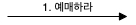 </p>

1. **예매하는 데 필요한 정보를 가장 많이 알고 있는 객체 = 상영**

<p align="center">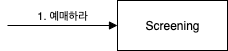 </p>

이제는 외부 인터페이스가 아닌 내부 구현을 개략적으로만 고민해보자.

**단지 Screening이 책임을 수행하는 데 필요한 작업을 구상해보고 처리할 수 없는 작업이 무엇인지 가려보자.**

스스로 못하는 작업은 외부에 요청하면 된다.

**예매하라 메시지를 완료하기 위해서는 예매 가격을 계산하는 작업이 필요하다**

예매 가격을 계산하기 위해서는 영화의 금액이 필요하다.

<br>

2. **영화 가격을 계산하는데 필요한 정보를 알고 있는 객체는? = 영화**

<p align="center">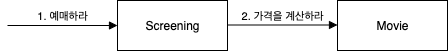 </p>

**영화가 요금을 계산하기 위해서**는 먼저 **영화가 할인 가능한지를 판단**한 후에 **할인 정책을 따라 할인 요금을 계산**한다.

영화가 스스로 처리할 수 없는 일 = 할인 조건에 따라 영화가 할인 가능한지 판단하는 것

<br>

3. **할인 여부를 판단하는 데 필요한 정보를 가장 많이 알고 있는 객체는? = 할인 조건**

<p align="center">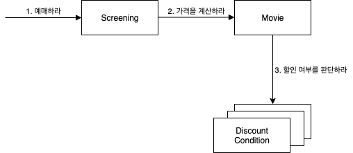 </p>

할인 정책은 외부 도움 없이 스스로 할인 여부를 판단할 수 있다.

<br>

### 2-3 높은 응집도와 낮은 결합도 (두번째 원칙)

설계는 트레이드오프 활동이다. 

<br>

**높은 응집도와 낮은 결합도**

<p align="center">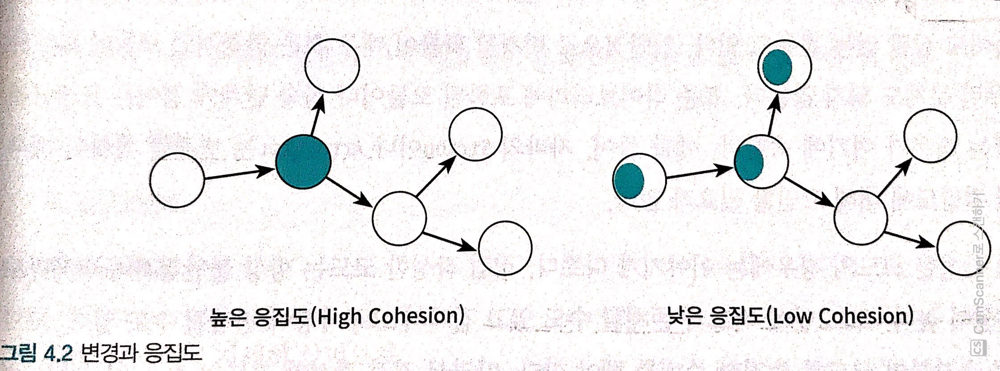<br>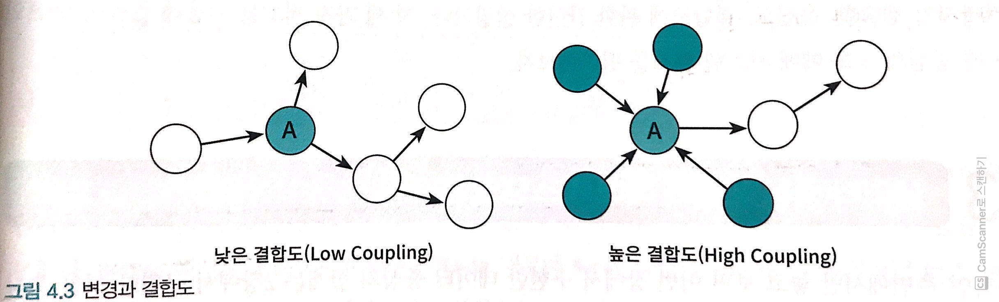<br>출처 : 오브젝트 책 </p>

* 응집도
  * 변경이 발생할 때 모듈 내부에서 발생하는 변경의 정도
  * **높은 응집도에서는 하나의 변경을 반영하기 위해 오직 하나의 모듈만 수정하면 된다.**
* 결합도
  * **한 모듈이 변경되기 위해서 다른 모듈의 변경을 요구하는 정도**
  * 의존성

<br>

**여러 설계 방안들**

**동일한 기능에는 여러 가지 설계 방안이 있다.**

이럴땐 **높은 응집도와 낮은 결합도를 따라가면 된다.**

<p align="center">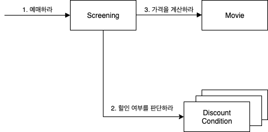<br> ( 같은 기능의 또 다른 설계 )  </p>

* 높은 결합도
  * Screening이 DiscountCondition과 협력할 경우에는 둘 사이의 새로운 결합도가 추가된다.
  * 즉, 의존성이 하나 더 추가된다.
* 낮은 응집도
  * Screening의 책임은 "예매를 생성"하는 것이다. 만약 Screening과 DiscountCondition이 협력한다면 Screening은 영화 요금 계산과 관련된 책임 일부를 떠안아야 한다.
  * 예매 요금을 계산하는 방식이 변경될 경우 Screening도 함께 변경해야 한다.

<br>

### 2-4 CREATOR 패턴 (세 번째 원칙)

<br>

**CREATOR 패턴**

* 아래 조건을 최대한 많이 만족하는 B에게 객체 생성 책임을 할당하라.
  * B가 A 객체를 포함하거나 참조한다.
  * B가 A 객체를 기록한다.
  * B가 A 객체를 긴밀하게 사용한다.
  * B가 A 객체를 초기화하는 데 필요한 데이터를 가지고 있다.

<br>

**Screening이 CREATOR**

<p align="center">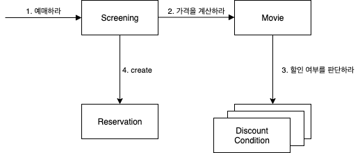 </p>

Screening이 필요한 영화, 상영 시간, 상영 순번 등의 정보에 대한 전문가이며, 예매 요금을 계산하는 데 필수적인 Movie도 알고 있다.

따라서 CREATOR로 선택하는 것이 적절하다.

<br>

## 3 구현을 통한 검증

<br>

### 3-1 메시지 결정 => 책임 결정

```java
class Screening {
  public Reservation reserve(Customer customer, int audienceCount) {
    return new Reservation(customer, this, calculateFee(audienceCount), audienceCount);
  }
  
  private Money calculateFee(int audienceCount) {
    return movie.calculateMovieFee(this).tims(audienceCount); // 아직 Movie를 구현하지 않은 상태
  }
}
```

* **`Screening`은 구현 과정에서 `Movie`의 내부 구현에 대한 어떤 지식도 없이 전송할 메시지를 결정했다.**
  * 전송할 메시지 = 계산해라 = `calculateMovieFee`
* 두 객체의 유일한 연결고리는 메시지 뿐!

<br>

### 3-2 POLYMORPHISM 패턴

* 다형성을 통해 분리하라
* **`if ~ else` 같은 조건 논리는 변경에 취약하다. 다형성을 이용해 분리하자.**

<br>

**분리 전**

```java
public class Movie {
  public Money calculateMovieFee(Screening screening) {
    if(idDiscountable(screening)) // 할인 여부 확인
      return fee.minus(calculateDiscountAmount()); // 할인된 요금
    
    return fee; // 기본 요금
  }
  
  private boolean isDiscountable(Screening screening) { 
    return discountConditions.stream() // 할인 조건 리스트를 돌며 할인 되는지 확인.
      .anyMatch(condition -> condition.isSatisfiedBy(screening));
  }
  ...
}
```

```java
public class DiscountCondition {
  private DiscountConditionType type; // enum
  private int sequence; // 순서 할인 조건 멤버
  private LocalDateTime time; // 기간 할인 조건 멤버
  
  public boolean isSatisfiedBy(Screening screening) {
    if(type == DiscountConditionType.PERIOD) // 기간 할인 조건
      return isSatisfiedByPeriod(screening);
    
    return isSatisfiedBySequence(screening); // 순서 할인 조건
  }
  
  private boolean isSatisfiedByPeriod(Screening screening) {
    ...
  }
  
  private boolean isSatisfiedBySequence(Screening screening) {
    ...
  }
 
}
```

* **문제점**
  * 새로운 할인 조건 추가
    * `isSatisfiedBy` 안에 조건문을 수정해야 한다.
    * 게다가 새로운 할인 조건에 맞는 `DiscountCondition` 속성도 추가해줘야하며, 메서드도 추가해줘야 한다.
  * 순번 조건을 판단하는 로직 변경
    * `isSatisfiedBySequence` 메서드의 내부 구현을 수정해야 한다.
  * 즉, `DiscountCondition`은  하나 이상의 변겨 이유를 가지기 때문에 응집도가 낮다 => 서로 연관성 없는 기능이 하나의 클래스 안에 뭉쳐있다.
* **변경의 이유에 따라 클래스를 분리해야 한다.**
* **위험 징후를 파악하는 패턴**
  1. 인스턴스 변수가 초기화 되는 시점을 살펴보자.
     * 순서 할인 조건일 경우 `time` 은 초기화 되지않고, 반대로 기간 할인 조건일 때는 `sequence`가 초기화 되지 않는다.
     * **즉, 함께 초기화되는 속성을 기준으로 코드를 분리해야 한다.** (응집도나 낮다고 볼 수 있다)
  2. 메서드들이 인스턴스 변수를 사용하는 방식을 살펴보자.
     * 모든 메서드가 객체의 모든 속성을 사용한다면 클래스의 응집도는 높다고 볼 수 있다.

<br>

> 클래스 응집도 판단하기
>
> * 클래스가 **하나 이상의 이유로 변경돼야 한다면 응집도가 낮은 것이다.** 변경의 이유를 기준으로 클래스를 분리하라.
> * 클래스의 인스턴스를 초기화하는 시점에 경우에 따라 **서로 다른 속성들을 초기화하고 있다면 응집도가 낮은 것이다**. 초기화되는 속성의 그룹을 기준으로 클래스를 분리하라.
> * 메서드 그룹이 속성 그룹을 사용하는지 여부로 나뉜다면 응집도가 낮은 것이다. 이들 그룹을 기준으로 클래스를 분리하라.

<br>

#### 분리 후 - 다형성

<p align="center">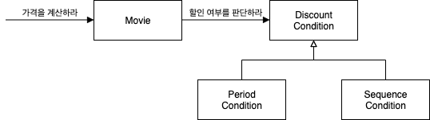 </p>

```java
public interface DiscountCondition { // 역할
  boolean isSatisfiedBy(Screening screening);
}

public class PeriodCondition implements DiscountCondition {...}

public class SequenceCondition implements DiscountCondition {...}
```

* **`Movie`입장에서는 `Period`나 `Sequence`나 동일한 책임을 수행하는 동일한 역할로 본다.**
  * OCP
  * 대체가능성
  * **GRASP에서는 이를 POLYMORPHISM(다형성) 패턴이라 부른다.**
* 캡슐화가 된다.
  * `Movie`로부터 `Period`, `Sequence`의 존재를 감춘다. 

<br>

### 3-3 상속보다는 합성 - 중요

<br>

**상속**

<p align="center">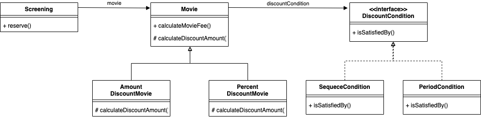 </p>

```java
public abstract class Movie {
  private List<DiscountCondition> discountConditions;
  
  public Money calculateMovieFee(Screening screening) {
    if(idDiscountable(screening)) // 할인 여부 확인
      return fee.minus(calculateDiscountAmount()); // 할인된 요금
    
    return fee; // 기본 요금
  }
  
  private boolean isDiscountable(Screening screening) { 
    return discountConditions.stream() // 할인 조건 리스트를 돌며 할인 되는지 확인.
      .anyMatch(condition -> condition.isSatisfiedBy(screening));
  }
  
  protected abstract Money calculateDiscountAmount(); // 추상 메서드
}

public class AmountDiscountMovie extends Movie {...}

public class PercentDiscountMovie extends Movie {...}
```

* 상속을 사용하는 경우 (템플릿 메서드 패턴)
  * **새로운 할인 정책이 추가될 때마다 인스턴스를 생성하고, 상태를 복사하고, 식별자를 관리하는 코드를 추가해줘야한다.**
  * 이는 번거울뿐만 아니라, 오류가 발생하기도 쉽다.
  * **실행 중에 할인 정책을 변경하기 힘들다. (상속은 생성시 할인 정책이 정해지므로!)**
  * 유연하지 않다.

<br>

**합성**

<p align="center">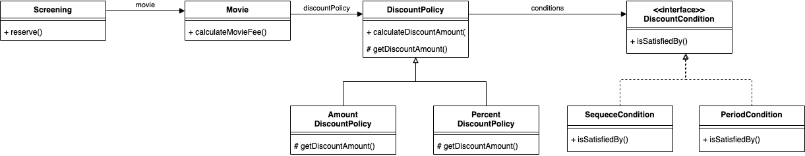 </p>

```java
public class Movie {
  
  private DiscountPolicy discountPolicy;
  
  // 생성자
  
  public Money calculateMovieFee(Screening screening) {
    return fee.minus(discountPolicy.calculateDiscountAmount(screening));
  }
}

public abstract DiscountPolicy {
  private List<DiscountCondition> conditions;
  
  public Money calculateDiscountAmount(Screening screening) {
    ... 할인 조건 판단 => getDiscountAmount 호출.
  }
  
  abstract protected Money getDiscountAmount(Screening screening);
}
```

```java
// 할인 정책 변경
Movie movie = new Movie("타이타닉",
                       Duration.ofMinuts(20),
                       Money.wons(1000),
                       new AmountDiscountPolicy(...));
movie.changeDiscountPolicy(new PercentDiscountPolicy(...)); // 쉽게 할인 정책을 변경할 수 있다.
```
* 새로운 할인 정책(요구사항)이 추가되더라도 추가적으로 코드를 수정해줘야할 일이 없다.
  * 실행중에 요구사항이 변경되야한다면 **새로운 클래스를 추가하고 클래스의 인스턴스를 `Movie`의 `changeDiscountPolicy` 메서드에 전달하면 된다.**
* 유연한 설계가 가능하다.

<br>

## 4 책임 주도 설계 방법: 리팩터링 - 중요
이번 챕터에선 실무에서 많은 사람들이 사용하고 있지만 널리 알려진 적이 없는 책임 주도 설계 방법에 대해서 설명한다.

바로 **일단 절차형 코드로 실행되는 프로그램을 빠르게 작성한 후 완성된 코드를 객체지향적인 코드로 변경하는 것이다.**

> 우선 돌아가는 코드를 만들고, 점차 리팩터링하는 방식.

**처음부터 책임 주도 설계 방법을 따르는 것보다 동작하는 코드를 작성한 후에 리팩터링하는 것이 더 훌륭한 결과물을 낳을 수 있다.**

<br>

### 4-1 첫번째 리팩터링 - 메서드 응집도
 

간단한 예시를 통해 책임 주도로 리팩터링하는 방법중 하나인 메서드 분리에 대해서 살펴본다.

<br>

**메서드 응집도가 낮은 예시**

```java
public class ReservationAgency {
    public Reservation reserve(Screening screening, Customer customer, int audienceCount) {
        Movie movie = screening.getMovie();

        boolean discountable = false;
        for (DiscountCondition condition : movie.getDiscountConditions()) {
            if (condition.getType() == DiscountConditionType.PERIOD) {
                discountable = screening.getWhenScreened().getDayOfWeek().equals(condition.getDayOfWeek()) &&
                    condition.getStartTime().compareTo(screening.getWhenScreened().toLocalTime()) <= 0 &&
                    condition.getEndTime().compareTo(screening.getWhenScreened().toLocalTime()) >= 0;
            } else {
                discountable = condition.getSequence() == screening.getSequence();
            }

            if (discountable) {
                break;
            }
        }

        Money fee;
        if (discountable) {
            Money discountAmount = Money.ZERO;
            switch (movie.getMovieType()) {
                case AMOUNT_DISCOUNT:
                    discountAmount = movie.getDiscountAmount();
                    break;
                case PERCENT_DISCOUNT:
                    discountAmount = movie.getFee().times(movie.getDiscountPercent());
                    break;
                case NONE_DISCOUNT:
                    discountAmount = Money.ZERO;
                    break;
            }

            fee = movie.getFee().minus(discountAmount).times(audienceCount);
        } else {
            fee = movie.getFee().times(audienceCount);
        }

        return new Reservation(customer, screening, fee, audienceCount);
    }
}
```
* **하나의 메서드가 모든 일을 한다. -> 몬스터 메서드**
* **문제점**
  * 어떤 일을 수행하는지 한눈에 파악하기 어렵다.
  * 변경이 필요할 때 수정해야 할 부분을 찾기 어렵다.
  * 메서드 내부의 일부 로직을 수행하더라도 나머지 부분에서 버그가 발생할 확률이 높다.
  * 로직의 일부만 재사용하는 것이 불가능하다.
  * 코드 중복이 발생하기 쉽다.

<br>

**메서드 분리**

```java
public class ReservationAgency {
    public Reservation reserve(Screening screening, Customer customer, int audienceCount) {
        boolean discountable = checkDiscountable(screening);
        Money fee = calculateFee(screening, discountable, audienceCount);
        return createReservation(screening, customer, audienceCount, fee);
    }

    private boolean checkDiscountable(Screening screening) {
        return screening.getMovie().getDiscountConditions().stream()
            .anyMatch(condition -> isDiscountable(condition, screening));
    }

    private boolean isDiscountable(DiscountCondition condition, Screening screening) {
        if (condition.getType == DiscountConditionType.PERIOD) {
            return isSatisfiedByPeriod(condition, screening);
        }

        return isSatisfiedBySequence(condition, screening);
    }

    private boolean isSatisfiedByPeriod(DiscountCondition condition, Screening screening) {
        return screening.getWhenScreened().getDayOfWeek().equals(condition.getDayOfWeek()) &&
            condition.getStartTime().compareTo(screening.getWhenScreened().toLocalTime()) <= 0 &&
            condition.getEndTime().compareTo(screening.getWhenScreened().toLocalTime()) >= 0;
    }

    private boolean isSatisfiedBySequence(DiscountCondition condition, Screening screening) {
        discountable = condition.getSequence() == screening.getSequence();
    } 

    private Money calculateFee(Screening screening, boolean discountable, int audienceCount) {
        if (discountable) {
            return screening.getMovie().getFee()
                .minus(calculateDiscountedFee(screening.getMovie()))
                .times(audienceCount);
        }

        return screening.getMovie().getFee().times(audienceCount);
    }

    private Money calculateDiscountedFee(Movie movie) {
        switch (movie.getMovieType()) {
            case AMOUNT_DISCOUNT:
                return calculateAmountDiscountedFee(movie);
            case PERCENT_DISCOUNT:
                return calculatePercentDiscountedFee(movie);
            case NONE_DISCOUNT:
                return calculateNoneDiscountedFee(movie);
        }

        throw new IllegalArgumentException();
    }

    // ... calculateAmount, Percent, None DiscountedFee

    private Reservation createReservation(Screening screening, Customer customer, int audienceCount, Money fee) {
        return new Reservation(customer, screening, fee, audienceCount);
    }
}
```
* 비록 클래스의 길이는 더 길어졌지만, 가독성과 명확성이 좋아져 변경하기 쉬운 코드가 만들어졌다.
  * 전체적인 흐름을 이해하기 더 쉬워졌다.
* 메서드 분리를 통해 응집도 높은 메서드들을 만들 수 있다.

<br>

### 4-2 두번째 리팩터링 - 객체를 자율적으로 만들기
두번째는 객체로 분리하여 협력하도록 하는 것이다.

**이때 가장 중요한 것은 객체가 자율적인 존재여야한다는 것이다.**

**자율적인 객체로 만드는 지름길은 자신이 소유하고 있는 데이터를 자기 스스로 처리하도록 만드는 것이다.**

<br>

**ReservationAgency에서 DiscountCondition는 getter를 통해 데이터를 가져온다. 이는 분리 힌트이기도 하다.**

```java
public class ReservationAgency {
    private boolean isDiscountable(DiscountCondition condition, Screening screening) {
        if (condition.getType == DiscountConditionType.PERIOD) {
            return isSatisfiedByPeriod(condition, screening);
        }

        return isSatisfiedBySequence(condition, screening);
    }

    private boolean isSatisfiedByPeriod(DiscountCondition condition, Screening screening) {
        return screening.getWhenScreened().getDayOfWeek().equals(condition.getDayOfWeek()) &&
            condition.getStartTime().compareTo(screening.getWhenScreened().toLocalTime()) <= 0 &&
            condition.getEndTime().compareTo(screening.getWhenScreened().toLocalTime()) >= 0;
    }

    private boolean isSatisfiedBySequence(DiscountCondition condition, Screening screening) {
        discountable = condition.getSequence() == screening.getSequence();
    } 

    private Money calculateFee(Screening screening, boolean discountable, int audienceCount) {
        if (discountable) {
            return screening.getMovie().getFee()
                .minus(calculateDiscountedFee(screening.getMovie()))
                .times(audienceCount);
        }

        return screening.getMovie().getFee().times(audienceCount);
    }
}
```
* 위 로직은 많은 getter를 통해 `DiscountCondition`로부터 값을 가져오는 것을 볼 수 있다.
* **보통 메서드를 다른 클래스로 이동시킬 때는 인자에 정의된 클래스 중 하나로 이동하는 경우가 일반적이다.**
  * 인자로 받으며, getter를 많이 사용하는 `DiscountCondition`을 분리시키는 것이 좋다.

<br>

**DiscountCondition을 아래와같이 자율적인 객체로 분리시켜주는 것이 좋다**
```java
public class DiscountCondition {
    private DiscountConditionType type;
    private int sequence;
    private DayOfWeek dayOfWeek;
    private LocalTime startTime;
    private LocalTime endTime;

    public boolean isDiscountable(Screening screening) {
        ...
    }

    private boolean isSatisfiedByPeriod(Screening screening) {
        ...
    }

    private boolean isSatisfiedBySequence(Screening screening) {
        ...
    }
}
```
* 캡슐화를 통해 내부 구현을 숨겼으며, 응집도도 높아졌다.

<br>

> 이외에도 위 예시에서 클래스로 이동시킬 메서드는 많다.
> 
> **메서드를 이동할 때 캡술화, 응집도, 결합도의 측면에서 이동시킨 메서드의 적절성을 판단하여 이동시켜주면 된다.**

<br>

## 정리

* 책임 주도 설계
  * 데이터가 아닌 책임(행동들)을 먼저 결정하라.
  * **메시지** 결정 :arrow_right: 책임 결정 (자동적) 
* 설계는 트레이드오프의 과정
  * 정답은 없다 상황에 따라 결정하자. 단, 상황에 맞게 책임을 평가하는 방법으로 GRASP 패턴을 참고하자.
    * INFORMATION EXPERT
    * 높은 응집도와 낮은 결합도
    * CREATOR
    * POLYMORPHISM
  * ... 
* 설계를 주도하는 것은 변경이다.
  * 코드를 이해하고 수정하기 쉽도록 최대한 단순하게 설계
  * 코드를 수정하지 않고도 변경을 수용할 수 있도록 코드를 유연하게!
    * 분리하라!!! 다형성!!! 상속보다는 합성!!! 
* 리팩터링을 통한 책임 주도 설계
  1. 일단 절차형 코드로 동작하는 프로그램을 만든다.
  2. 리팩터링을 통해 객체지향적인 코드로 변경한다.
    * 메서드 분리 -> 객체 분리 (자율적인 객체)

