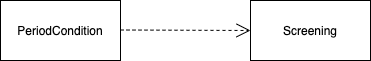
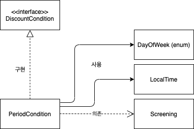
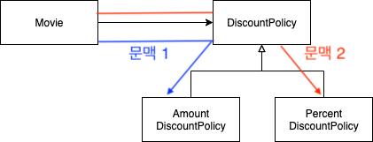
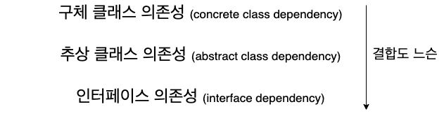
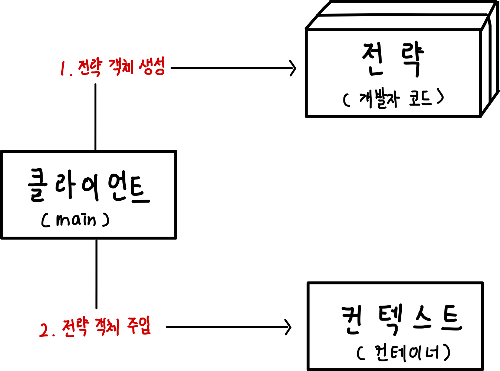

[오브젝트 - 코드로 이해하는 객체지향 설계](http://www.yes24.com/Product/Goods/74219491?OzSrank=1) 를 정리한 자료입니다.

<br>

# 목차

- [목차](#목차)
- [Chapter 08 의존성 관리하기](#chapter-08-의존성-관리하기)
  - [1 의존성 이해하기](#1-의존성-이해하기)
    - [1-1 변경와 의존성](#1-1-변경와-의존성)
    - [1-2 의존성 전이](#1-2-의존성-전이)
    - [1-3 런타임 의존성과 컴파일타임 의존성](#1-3-런타임-의존성과-컴파일타임-의존성)
    - [1-4 컨텍스트 독립성](#1-4-컨텍스트-독립성)
    - [1-5 의존성 해결하기](#1-5-의존성-해결하기)
  - [2 유연한 설계](#2-유연한-설계)
    - [2-1 의존성과 결합도](#2-1-의존성과-결합도)
    - [2-2 지식이 결합을 낳는다](#2-2-지식이-결합을-낳는다)
    - [2-3 추상화에 의존하라](#2-3-추상화에-의존하라)
    - [2-4 명시적인 의존성, 숨겨진 의존성](#2-4-명시적인-의존성-숨겨진-의존성)
    - [2-5 의존성은 외부에서 주입해주는 것이 좋다](#2-5-의존성은-외부에서-주입해주는-것이-좋다)
    - [2-6 표준 클래스에 대한 의존은 해롭지 않다](#2-6-표준-클래스에-대한-의존은-해롭지-않다)
  - [3 새로운 의존성 추가시 팁 - 중요](#3-새로운-의존성-추가시-팁---중요)
    - [3-1 null보단 아무 일도 처리하지 않는 구체 클래스가 좋다](#3-1-null보단-아무-일도-처리하지-않는-구체-클래스가-좋다)
    - [3-2 두 개 이상의 의존성을 주입해줘야할때 - 중요](#3-2-두-개-이상의-의존성을-주입해줘야할때---중요)
  - [정리](#정리)

<br>

# Chapter 08 의존성 관리하기

지금까지 협력이 얼마나 중요한지 계~~~속 강조해왔다.

협력은 필수적이지만 과도한 협력은 설계를 곤경에 빠트릴 수 있다. **협력은 객체가 다른 객체에 대해 알 것을 강요한다**. 알아야 요청을 할 수 있기 때문이다.

**다른 객체와 협력하기 위해서는 그런 객체가 존재한다는 사실을 알고 있어야 한다.** 이런 지식이 바로 **객체 사이의 의존성을 낳는다.**

**객체지향 설계의 핵심은 협력을 위해 필요한 의존성은 유지하면서도 변경을 방해하는 의존성은 제거하는데 있다.**

> **이런 관점에서 객체지향 설계란 객체가 변화를 받아들일 수 있게 의존성을 정리하는 기술라고 볼 수 있다.**

<br>

**이번장에서는 충분히 협력적이면서도 유연한 객체를 만들기 위해 의존성을 관리하는 방법을 살펴본다.**

<br>

## 1 의존성 이해하기

우선 의존성이란 무엇인지 알아보자.

<br>

### 1-1 변경와 의존성

<br>

🤔 **의존성이란**

* 두 요소 사이의 의존성이란
  * **의존되는 요소가 변경**될 때 **의존하는 요소도 함께 변경**될 수 있다는 것을 의미한다.
  * 즉, **의존성은 변경에 의한 영향의 전파 가능성을 암시한다.**
* 의존성이란 **의존하고 있는 대상의 변경에 영향을 받을 수 있는 가능성**을 의미한다.
* 객체들이 협력하기 위해서는 서로의 존재와 수행 가능한 책임을 알아야한다. 이런 지식들이 객체 사이의 의존성을 낳는다.

<br>

💁‍♂️ **코드로 보자**

```java
public class PeriodCondition implements DiscountCondition {
  private DayOfWeek dayOfWeek; // enum
  private LocalTime startTime;
  private LocalTime endTime;
  
  ...
  
  public boolean isSatisfiedBy (Screening screening) { // 상영 정보와 기간 조건이 부합하는지 여부
    return screening.getStartTime().getDayOfWeek().equals(dayOfWeek) &&
      startTime.compareTo(screening.getStartTime().toLocalTime()) <= 0 &&
      endTime.compareTo(screening.getStartTime().toLocalTime()) >= 0;
  }
}
```

위 코드를 쉽게 도식화 하면 아래와 같다.

<p align="center"> </p>

* **실행 시점에 `PeriodCondition`의 인스턴스가 정상적으로 동작하기 위해서는 `Screening`의 인스턴스가 존재해야 한다.**
  * 만약, `Screening`의 코드가 변경되면 `PeriodCondition`는 **제대로 동작하지 않을 것**이며, **같이 변경이 이뤄져야 할 것이다.**

<br>

💁‍♂️ **의존성은 어디든 존재한다.**

<p align="center"> </p>

* **의존성은 객체 사이에서만 존재하지 않고, 어디든 존재한다.**
  * `DayOfWeek`의 코드가 변경된다면 `PeriodCondition`도 변경되야 한다. :arrow_right: `PeriodCondition`은 `DayOfWeek`에 의존적이다.

<br>

💁‍♂️ **의존성은 방향성을 가지며 항상 단방향이다.**

<p align="center"> </p>

* **`Screening`이 변경될 때 `PeriodCondition`이 영향을 받게 되지만 그 역은 성립하지 않는다.**


> 두 요소 사이의 관계는 여러가지가 존재한다.
>
> * 실체화 관계 (realization)
> * 연관 관계 (association)
> * 의존 관계 (dependency)
> * 일반화/특수화 관계 (generalization/specializer)
> * 합성 관계 (composition)
> * 집합 관계 (aggregation)

<br>

### 1-2 의존성 전이

<br>

🤔 **의존성 전이란**

<p align="center"> </p>

* **의존성 전이에 의해 잠재적으로 `PeriodCondition`은 `Movie`에 의존한다.**
  * `Screening`이 가지고 있는 의존성이 `Screening`에 의존하고 있는 `PeriodCondition`에 전이된 것.

<br>

💁‍♂️ **의존성이 모두 전이되는 것은 아니다**

* 의존성이 **함께 변경될 수 있는 가능성**을 의미하기 때문에 모든 경우에 의존성이 전이되는 것은 아니다.
* 의존성이 실제로 **전이될지 안될지 여부는 변경의 방향과 캡슐화의 정도에 따라 달라진다.**
  * 만약 `Screening`이 의존하고 있는 `Movie`가 인터페이스라면 의존성이 전이되지 않는다. (캡슐화)

<br>

💁‍♂️ **직접 의존성과 간접 의존성**

* 직접 의존성 - 한 요소가 다른 요소에 직접 의존하는 경우
  * `PeriodCondition`과 `Screening`의 관계
* 간접 의존성 - 직접적인 관계는 존재하지 않지만 의존성 전이에 의해 영향이 전파되는 경우
  * `PeriodCondition`과 `Movie`의 관계

<br>

### 1-3 런타임 의존성과 컴파일타임 의존성

**의존성은 실행 시점과 구현 시점에 서로 다른 의미를 가진다.**

<br>

🤔 **런타임 시점이란? 컴파일 시점이란?**

* **런타임 시점**
  * 말 그대로 애플리케이션이 실행되는 시점
* **컴파일 시점 (두 가지의 의미가 존재한다)**
  * 작성된 코드를 컴파일하는 시점
  * 컴파일 시점뿐만 아니라 코드 그자체를 가리키기도 한다. (정적 코드) -> `.java`

> 위와 같이 **컴파일 시점은 두 가지의 의미가 있기 때문에 상황에 따라서 해석하면 된다.**

<br>

💁‍♂️ **런타임의 주인공은 객체, 컴파일의 주인공은 클래스**

* 런타임의 주인공은 객체다. (동적)
  * 따라서 런타임 의존성이 다루는 주제는 객체 사이의 의존성이다.
* 컴파일의 주인공은 클래스다. (정적)
  * 따라서 컴파일타임 의존성이 다루는 주제는 클래스 사이의 의존성이다.

<br>

💁‍♂️ **런타임 의존성과 컴파일 의존성이 다를 수 있다 (제일 중요 내용)**

<p align="center"> </p>

* 컴파일 시점의 의존성
  * **코드 작성 시점의 `Movie`와 `DiscountPolicy`사이의 의존성**
  * 중요한 것은 `Movie`에서 `Amount`와 `Percent`로 향하는 어떠한 의존성도 존재하지 않다는 것. :arrow_right: OCP

> **유연하고 재사용 가능한 코드를 설계하기 위해선 두 종류의 의존성이 서로 다른 것이 좋다.**

<br>

<p align="center"> </p>

* 런타임 시점의 의존성
  * **`Movie`의 인스턴스가 가지는 런타임 의존성**
  * 당연히 `Movie`가 인터페이스인 `DiscountPolicy`에 의존하면 실행 자체가 안된다. 하지만 런타임 시점에는 이렇게 구현한 객체가 의존성으로 들어오게 된다.

> **코드 작성 시점의 `Movie`클래스는 할인 정책을 구현한 두 클래스의 존재를 모르지만 실행 시점의 `Movie`객체는 두 클래스의 인스턴스와 협력할 수 있게 된다.**

<br>

❗️ **두 종류의 의존성 사이의 거리가 멀면 멀수록 설계가 유연해지고 재사용 가능해진다.**

쉽게 말해, 컴파일타임 의존성과 런타임 의존성의 거리가 멀어야 유연하다.

> 더 쉽게 말하면 컴파일타임 의존성과 런타임 의존성이 달라야 유연하다.

그러기 위해선 컴파일 타임에 협력할 클래스에 대해서 구체적인 것보단 추상적인 것에 의존하도록 하는 것이 좋다.

그리고 런타임에 의존성에 따라 다르게 동작시키는 것이 좋다.

<br>

### 1-4 컨텍스트 독립성

<br>

🤔 **컨텍스트란**

<p align="center"> </p>

* 컨텍스트 == 문맥
  * `Movie`는 추상 클래스인 `DiscountPolicy`에 의존적이며, 런타임 시점에 구체적인 문맥이 정해진다.
    * 문맥 1 - `Movie`가 `AmountDiscountPolicy`에 의존
    * 문맥 2 - `Movie`가 `PercentDiscountPolicy`에 의존

<br>

🤔 **컨텍스트 독립성이란**

* 컨텍스트 독립성
  * 각 객체가 해당 객체를 실행하는 시스템에 관해 아무것도 **알지 못하는 것**.
  * 즉, **컴파일 시점엔 협력하는 객체에 대해서 모르는 것.**

<br>

💁‍♂️ **실행될 컨텍스트에 대한 정보가 적을 수록 설계가 유연해진다**

* 클래스가 **특정한 문맥에 강하게 결합**될수록 **다른 문맥에서 사용하기가 더 어려워진다.**
* **구체적인 클래스를 알면 알수록 그 클래스가 사용되는 특정한 문맥에 강하게 결합된다.**

> **설계가 유연해지기 위해서는 가능한 한 자신이 실행될 컨텍스트에 대한 구체적인 정보를 최대한 적게 알아야 한다.**

<br>

> 다른 의미로 해석하면 **객체 생성과 사용의 대한 책임을 분리시키면 더 유연한 구조가 나온다고 볼 수 있다.**

<br>

### 1-5 의존성 해결하기

그렇다면 클래스가 **실행 컨텍스트에 독립적인데도 어떻게 런타임에 실행 컨텍스트에 적절한 객체들과 협력할 수 있을까**? :arrow_right: 전략 패턴이 떠오른다.

<br>

💁‍♂️ **생성자**

```java
Movie avatar = new Movie("아바타",
                        Duration.ofMinute(120),
                        Money.wons(10000),
                        new AmountDiscountPolicy());
```

* 객체를 생성할 때 생성자를 통해 의존성을 주입

<br>

💁‍♂️ **Setter**

```java
Movie movie = new Movie(...);
movie.setDiscountPolicy(new AmountDiscountPolicy());
```

* 객체가 생성된 후에 Setter를 통한 의존성 주입

<br>

💁‍♂️ **메서드 매개변수**

```java
public Money calculateMovieFee(Screening screening, DiscountPolicy discountPolicy) {
  ...
}
```
* 하나의 메서드에서만 의존성이 필요할 때 사용한다.

<br>

## 2 유연한 설계

유연한 설계를 만드는데 의존성이 중요하다는 것을 알게되었다. 이제 의존성을 관리하는 데 유용한 몇 가지 원칙과 기법을 알아보자.

<br>

### 2-1 의존성과 결합도

* 의존성은 두 가지로 나눌 수 있다.
  * 바람직한 의존성
  * 바람직하지 못한 의존성

> **바람직하고 바람직하지 않은 의존성은 `결합도(coupling)`라는 용어로 세련되게 가리킨다.**

<br>

💁‍♂️ **바람직한 의존성 - 낮은 결합도**

> **재사용성이 좋다 -> 의존관계의 두 요소가 서로 잘 모른다. -> 지식이 낮다.**

* 어떤 의존성이 **다양한 환경에서 재사용할 수 있다면** 그 의존성은 바람직하다.

  ```java
  public class Movie {
    private DiscountPolicy discountPolicy; // 인터페이스 -> 다양한 환경에서 재사용할 수 있다.
    
    public Movie(..., DiscountPolicy discountPolicy) {
      this.discountPolicy = discountPolicy;
    }
  }
  
  new Movie(...,
           new PercentDiscountPolicy()); // 재사용 가능
  ```

<br>

💁‍♂️ **바람직하지 못한 의존성 - 높은 결합도**

> **재사용성이 안좋다. -> 의존관계의 두 요소가 서로 잘 안다. -> 지식이 많다.**

* 어떤 의존성이 **다양한 환경에서 클래스를 재사용할 수 없도록 제한한다면** 그 의존성은 바람직하지 못한 것이다.

  ```java
  public class Movie {
    private PercentDiscountPolicy discountPolicy; // 구현체 -> 다양한 환경에서 재사용하기 힘들다.
    
    public Movie(..., PercentDiscountPolicy discountPolicy) {
      this.discountPolicy = discountPolicy;
    }
  }
  ```

위와 같이 특정한 컨텍스트(`Movie` -> `PercentDiscountPolicy`에 의존)에 강하게 결합된 의존성은 바람직하지 않다.

<br>

### 2-2 지식이 결합을 낳는다

<br>

💁‍♂️ **정보의 양 -> 결합도 결정**

* 결합도의 정도는 **한 요소가 자신이 의존하고 있는 다른 요소에 대해 알고 있는 정보의 양**으로 결정된다
  * 한 요소가 다른 요소에 대해 **더 많은 정보를 알고 있을수록 두 요소는 강하게 결합된다.**
  * 반대로, 한 요소가 다른 요소에 대해 **더 적은 정보를 알고 있을수록 두 요소는 약하게 결합된다.**

<br>

💁‍♂️ **낮은 결합도 -> 협력하는 대상에 대해 더 적게 알아야 한다**

* 결합도를 느슨하게 만들기 위해서는 협력하는 대상에 대해 필요한 정보 외에는 최대한 감추는 것이 중요하다.

<br>

### 2-3 추상화에 의존하라
어떻게 하면 정보를 적게 알게할까? -> 추상화 (abstraction)

**의존하는 대상이 더 추상적일수록 결합도는 낮아진다. - 핵심**

<br>

💁‍♂️ **정보를 적게 아는 방법 -> 추상화**

* **정보를 적게 아는 방법 -> 추상화 -> 낮은 결합도**

<br>

💁‍♂️ **추상화란**

* 어떤 양상, 세부사항, 구조를 좀 더 명확하게 이해하기 위해 특정 절차나 물체를 **의도적으로 생략하거나 감춤으로써 복잡도를 극복하는 방법**

<br>

💁‍♂️ **추상화의 정도**

<p align="center"><br>내려갈수록 지식의 양이 적어지기 때문에 결합도가 느슨해진다. </p>

* 구체적인 클래스보다 추상 클래스에, 추상 클래스보다 인터페이스에 의존하도록 만드는 것이 결합도 느슨해진다.
  * 즉, **의존하는 대상이 더 추상적일수록 결합도는 더 낮아진다는 것**

<br>

### 2-4 명시적인 의존성, 숨겨진 의존성

<br>

💁‍♂️ **숨겨진 의존성**

```java
public class Movie {
  private DiscountPolicy discountPolicy;
  
  public Movie (...) {
    ...
   this.discountPolicy = new AmountDiscountPolicy(...); // 숨겨진 의존성
  }
}

Movie movie = new Movie(...); // 무엇에 의존하고 있는지 모른다
```

* **문제**
  * 객체 내부에 의존성을 숨기면 코드를 파악하는 것이 쉽지 않다.
* **클래스 안에서 구체 클래스에 대한 모든 의존성을 가능한 없어야 한다.**

<br>

💁‍♂️ **명시적인 의존성**

```java
public class Movie {
  private DiscountPolicy discountPolicy;
  
  public Movie (..., DiscountPolicy discountPolicy) {
    ...
    this.discountPolicy = discountPolicy();
  }
}

Movie movie = new Movie (...,
                        new AmountDiscountPolicy());
```

* 모든 경우에 의존성이 명시적인 것을 **명시적인 의존성**이라 한다.

<br>

💁‍♂️ **의존성은 명시적으로 표현해야 한다**

* 의존성은 명시적으로 표현돼야 한다.
  * **유연하고 재사용 가능한 설계란 인터페이스를 통해 의존성이 명시적으로 드러나는 설계다.** (`new Movie(..., new AmountDiscountPolicy())`)
  * 명시적인 의존성을 사용해야만 컴파일시점 의존성을 적절한 런타임 의존성으로 교체할 수 있다.
* 의존성을 구현 내부에 숨겨두지 마라. (물론 디폴트 값은 숨겨도 된다.)

> 쉽게 말해 구현 클래스에 대한 의존성을 외부에서 주입해주도록하는 것이 좋다.

<br>

### 2-5 의존성은 외부에서 주입해주는 것이 좋다

<br>

💁‍♂️ **new는 해롭다**

`new`를 잘못 사용하면 **클래스 사이의 결합도가 극단적으로 높아진다.**

* **`new`를 사용하면 구체 클래스의 이름을 직접 기술하기 때문**에 결합도가 높아질 수 밖에 없다.
* `new`를 사용하면 구체 클래스 생성자의 인자도 알아야 한다.

```java
public class Movie {
  private DiscountPolicy discountPolicy;
  
  public Movie(...) {
    ...
    this.discountPolicy = new AmountDiscountPolicy(Money.wons(800),
                                                  new SequenceCondition(1),
                                                  new SequenceCondition(10),
                                                  new PeriodCondition(...),
                                                  new PeriodCondition(...));
  }
}
```

* 위 코드의 문제는 Movie가 Condition들에도 의존적이게 되었다.
  * `Movie`가 `DiscountPolicy`에 의존해야 하는 이유는 `calculateDiscountAmount` 메시지를 전송하기 위함이다.
  * 따라서 이 메시지에 대한 의존성 외의 모든 다른 의존성은 Movie의 결합도를 높인다.

<br>

💁‍♂️ **객체를 생성하는 책임을 외부로 옮겨라 -> 로직 분리**

<p align="center"> </p>

한 요소가 사용해야하는 다른 요소의 의존성 외에 **필요 없는 의존성을 없애는 좋은 방법**은 **요소를 생성하는 로직과 생성된 요소를 사용하는 로직을 분리**하는 것이다.

**좋은 예시는 전략패턴이다.**

```java
public class Movie { // 컨텍스트 ( 핵심 로직 )
  private DiscountPolicy discountPolicy;
  
  public Movie (..., DiscountPolicy discountPolicy) {
    ...
    this.discountPolicy = discountPolicy;
  }
}

// 클라이언트
public class Main {
  public static void main(String[] args) {
    // 전략 ( 부가 로직 ) 생성
    DiscountPolicy strategy = new AmountDiscountPolicy();
    
    Movie avatar = new Movie("아바타",..., strategy,...); // 전략 주입 -> 의존성 주입 -> 변경시 이것만 변경해주면 되므로 변경에 용이하다.
  }
}

```

<br>

💁‍♂️ **디폴트 값을 설정할 때는 new를 사용하자**

```java
public class Movie {
  private DiscountPolicy discountPolicy;
  
  public Movie(String title, Duration runningTime, Money fee) {
    this(title, runningTime, fee, new NoneDiscountPolicy()); // 기본 설정 값 (DiscountPolicy가 없는 객체) 
  }
  
  public Movie(String title, Duration runningTime, Money fee, DiscountPolicy discountPolicy) {
    ...
    this.discountPolicy = discountPolicy;
  }
}
```

<br>

### 2-6 표준 클래스에 대한 의존은 해롭지 않다
지금까지의 정리 내용을 종합해서보면 구체적인 것에 의존하는 것은 좋지 않다.

그렇다면 JDK는 어떻게 할 것인가?

결론부터 말하면 변경될 확률이 0에 가까운 JDK의 구체적인 객체에 의존하는 것은 해롭지 않다.

<br>

## 3 새로운 의존성 추가시 팁 - 중요
새로운 의존성 추가시 상황별 어떻게 처리하는 것이 좋을까?

개인적으로 이번 챕에서 가장 인상 깊은 부분이다.

<br>

### 3-1 null보단 아무 일도 처리하지 않는 구체 클래스가 좋다
**할인 혜택이 제공되지 않는 영화를 만든다고 가정해본다.**

<br>

💁‍♂️ **AS-IS**

> **null을 통해 예외 케이스 두는 방식**

```java
public class Movie {
    public Movie(String title, Duration runningTime, Money fee) {
        this(title, runningTime, fee, null); // 문제의 null
    }

    public Movie(String title, Duration runningTime, Money fee, DiscountPolicy discountPolicy) {
        ...
        this.discountPolicy = discountPolicy;
    }
    
    public Money calculateMovieFee(Screening screening) {
        if (discountPolicy == null) { // 문제의 null 처리
            return fee;
        }
        return fee;
    }

    ...
}
```
위와 같이 생성자 체이닝 방식을 활용하여 null을 따로 두고 null 여부를 판단하는 것은 좋지 않다.

**이유는 예외 케이스를 위해 `Movie` 내부 코드를 직접 수정해줘야하기 때문이다.**

내부 코드를 수정하다보면 기존의 다른 로직도 건드릴 확률이 존재하기 때문에 위험하기도 하다.

<br>

💁‍♂️ **TO-BE**

> 해결책은 할인 정책이 존재한다는 예외 케이스를 두지 않고 기존의 `DiscountPolicy`를 활용하는 것
```java
public class NoneDiscountPolicy extends DiscountPolicy {
    @Override
    protected Money getDiscountAmount(Screening screening) {
        return Money.ZERO;
    }
}

Movie avartar = new Movie(
    "아바타", Duration.ofMinute(40), Money.wons(1000), new NoneDiscountPolicy()
);
```

위와 같이 기존의 존재하는 할인 정책 추상클래스를 구현하여 의존성 주입을 해주면 기존의 `Movie`의 내부 코드를 수정이 필요없어진다.

<br>

### 3-2 두 개 이상의 의존성을 주입해줘야할때 - 중요
**하나에 영화에 두 개 이상의 할인 정책이 가능하다고 요구사항이 변경된 경우 어떻게 처리하는 것이 좋을까?**

> 한 영화가 두 개의 할인 정책중 하나라도 준수한다면 할인해준다는 의미.

<br>

💁‍♂️ **AS-IS**

> 가장 먼저 떠오르는 방법은 `Movie`가 `List<Discountpolicy>`에 의존하도록 수정하는 것이다

```java
public class Movie {
    private List<DiscountPolicy> discountPolicies;

    ...

    public Movie(String title, Duration runningTime, Money fee, List<DiscountPolicy> discountPolicy) {
        ...
        this.discountPolicy = discountPolicy;
    }

    ...
}
```
이렇게 되면 `Movie`의 생성자에도 수정이 발생하기에 결론적으론 `Movie` 내부 코드가 수정되게 된다.

`Movie`를 생성 혹은 의존하는 모든 객체에 영향을 줄 수 있기 좋은 방법은 아니다.

<br>

💁‍♂️ **TO-BE**

> 기존의 `DiscountPolicy`를 활용하면 된다.

```java
public class OverlappedDiscountPolicy extends DiscountPolicy {
    private List<DiscountPolicy> discountPolicies = new ArrayList<>();

    public OverlappedDiscountPolicy(List<DiscountPolicy> discountPolicies) {
        this.discountPolicies = discountPolicies;
    }

    @Override
    protected Money getDiscountAmount(Screening screening) {
        Money result = Money.ZERO;
        for (DiscountPolicy each : discountPolicies) {
            result = result.plus(each.calculateDiscountAmount(screening));
        }
        return result;
    }
}

Movie avartar = new Movie(
    "아바타", Duration.ofMinute(40), Money.wons(1000),
    new OverlappedDiscountPolicy(
        new AmountDiscountPolicy(...),
        new PercentDiscountPolicy(...)
    )
);
```
**좋은 해결책은 중복 할인 정책을 하나의 할인 정책으로 간주하고 기존의 코드를 활용하는 것.**

이렇게하면 기존의 `Movie` 내부 코드를 수정이 필요없기 때문에 좋은 해결책이라고 볼 수 있다.

<br>

## 정리

<br>

💁‍♂️ **협력을 하려면 의존성이 필요하다. 단, 필요한 의존성만 가지게 해야한다.**

* 협력이란 메시지 요청을 의미하며, 꼭 메시지 요청을 해야하는 객체에 대한 의존성만을 가지고 있어야한다.
* 만약, 사용하지 않는 의존성을 가지고 있으면 결합도가 높아진다.

<br>

💁‍♂️ **지식이 결합을 낳는다**

* 협력하는 객체에 대해서 필요한 지식만 알자.
* 필요 없는 지식은 결합도만 높일 뿐이다
  * 구현체를 가지고 있지말고, 추상화한 타입을 가지고 있어라 -> 인터페이스, 추상클래스

<br>

💁‍♂️ **유연하고 재사용 가능한 설계는 How가 아닌 What을 표현한다.**

How가 아닌 What에 집중하면 유연한 설계를 만들 수 있다.

* How - `if(Amount)... else if(Period)...`
  * enum -> DicountPolicy -> new (DiscountPolicy.Amount)
* What - `new Movie(new Amount);`

전략 패턴을 사용하면 이러한 문제를 쉽게 해결할 수 있다.

> **훌륭한 객체지향 설계를 위한 핵심**

<br>

💁‍♂️ **의존성을 잘 관리하여 결합도를 낮추고 싶은가? 분리하라**

* 각 컨텍스트가 독립적일수록 결합도가 낮아진다. 즉, 각 로직이 분리되야 결합도가 낮아진다.
  * 추상화를 이용하라

