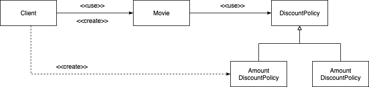

[오브젝트 - 코드로 이해하는 객체지향 설계](http://www.yes24.com/Product/Goods/74219491?OzSrank=1) 를 정리한 자료입니다.

<br>

# 목차

- [목차](#목차)
- [Chapter 09 유연한 설계](#chapter-09-유연한-설계)
  - [1 개방 - 폐쇄 원칙  OCP](#1-개방---폐쇄-원칙--ocp)
    - [1-1 개방 - 폐쇄 원칙이란](#1-1-개방---폐쇄-원칙이란)
    - [1-2 컴파일타임 의존성을 고정시키고 런타임 의존성을 변경하라](#1-2-컴파일타임-의존성을-고정시키고-런타임-의존성을-변경하라)
    - [1-3 추상화가 핵심이다](#1-3-추상화가-핵심이다)
  - [2 생성 사용 분리](#2-생성-사용-분리)
    - [2-1 생성과 사용을 분리하라](#2-1-생성과-사용을-분리하라)
    - [2-2 FACTORY 추가하기](#2-2-factory-추가하기)
    - [2-3 순수한 가공물에게 책임 할당하기 - 중요](#2-3-순수한-가공물에게-책임-할당하기---중요)
  - [3 의존성 주입](#3-의존성-주입)
    - [3-1 의존성 주입](#3-1-의존성-주입)
    - [3-2 명시적인 의존성이 숨겨진 의존성보다 좋다](#3-2-명시적인-의존성이-숨겨진-의존성보다-좋다)
  - [4 의존성 역전 원칙 DIP](#4-의존성-역전-원칙-dip)
    - [4-1 의존성 역전 원칙](#4-1-의존성-역전-원칙)
    - [4-2 상위 수준의 모듈은 하위 수준의 모듈에 의존하면 안된다](#4-2-상위-수준의-모듈은-하위-수준의-모듈에-의존하면-안된다)
    - [4-3 추상화는 구체적인 사항에 의존해서는 안된다](#4-3-추상화는-구체적인-사항에-의존해서는-안된다)
    - [4-4 역전의 의미](#4-4-역전의-의미)
  - [5 유연성에 대한 조언](#5-유연성에-대한-조언)
    - [5-1 유연한 설계는 유연성이 필요할 때만 옳다](#5-1-유연한-설계는-유연성이-필요할-때만-옳다)
    - [5-2 협력과 책임이 중요하다](#5-2-협력과-책임이-중요하다)
  - [정리](#정리)
    - [OCP - 구체적인 것이 아닌 추상적인 것에 의존하라](#ocp---구체적인-것이-아닌-추상적인-것에-의존하라)
    - [생성과 사용 책임을 분리하라](#생성과-사용-책임을-분리하라)
    - [숨겨진 의존성은 나쁘다](#숨겨진-의존성은-나쁘다)
    - [DIP - 상위 수준의 모듈은 하위 수준의 모듈에 의존하면 안된다](#dip---상위-수준의-모듈은-하위-수준의-모듈에-의존하면-안된다)
    - [무엇보다 중요한 것은 역할, 책임 ,협력이다](#무엇보다-중요한-것은-역할-책임-협력이다)

<br>

# Chapter 09 유연한 설계

이번 장에서는 이전 장에서도 계속해서 설명했던 **유연한 설계를 만드는 기법들을 원칙으로 알아본다.**

**중복된 내용이 많지만, 원칙을 통해 기법들을 정리하면 머리에 더 오래 남으며 또렷하게 정리가 된다.**

<br>

## 1 개방 - 폐쇄 원칙  OCP

유연한 설계의 대표적인 원칙이 바로 "개방 - 폐쇄 원칙"이다.

<br>

### 1-1 개방 - 폐쇄 원칙이란

<p align="center"> </p>

* 소프트웨어 개체 (클래스, 모듈, 함수 등등)는 **확장에 대해 열려 있어야 하고, 수정에 대해서는 닫혀 있어야 한다.**
  * **확장 -> Open** : 요구사항이 변경될 때 이 변경에 맞게 **새로운 '동작'을 추가해서** 기능을 **확장**할 수 있다.
  * **폐쇄 -> Closed** : 기존의 **코드**를 **수정하지 않고**도 **동작을 추가하거나 변경**할 수 있다.
* **기존의 코드를 수정하지 않고도 애플리케이션의 동작을 확장할 수 있는 설계 원칙을 의미한다.**

> 예시를 통해 쉽게 말하면, `DiscountPolicy`의 **코드를 수정하지** 않고, 그에 대한 **구현체 `PercentDiscountPolicy`를 통해 확장**한 것을 OCP라고도 볼 수 있다.

<br>

### 1-2 컴파일타임 의존성을 고정시키고 런타임 의존성을 변경하라

<br>

🤔 **어떻게 기존의 코드를 수정하지 않고 새로운 동작을 추가할 수 있는 것일까?**

* **바로 컴파일타임 의존성을 추상적인 것에 고정시키고, 런타임 의존성을 주입된 구현체에 따라 변경하도록 하면 된다.**

<br>

💁‍♂️ **사실 개방 - 폐쇄 원칙은 런타임 의존성과 컴파일타임 의존성에 관한 이야기이다.**

<p align="center"> </p>

* **런타임 의존성**
  * 실행시에 협력에 참여하는 객체들 사이의 관계

<br>

<p align="center"> </p>

* **컴파일타임 의존성**
  * 코드에서 드러나는 클래스들 사이의 관계

<br>

💁‍♂️ **변경을 하려면 전략을 만들어 주입해주기만 하면 된다**

```java
public class Movie {
  private DiscountPolicy discountPolicy; // 인터페이스 -> 다양한 환경에서 재사용할 수 있다.
  
  public Movie(..., DiscountPolicy discountPolicy) {
    this.discountPolicy = discountPolicy;
  }
}

new Movie(...,
         new PercentDiscountPolicy()); // 재사용 가능
```

* 변경을 하려면 `DiscountPolicy`의 구현체를 생성하여 주입해주기만 하면 된다.
  * 확장에 대해서는 열려 있고, 기존 코드는 수정할 필요 없이 새로운 클래스를 추가하는 것만으로 할인 정책을 확장할 수 있다.

<br>

### 1-3 추상화가 핵심이다

<br>

💁‍♂️ **개방 - 폐쇄 원칙의 핵심은 추상화다**

```java
// Template Method Pattern
public abstract class DiscountPolicy {
  private List<DiscountCondition> conditions = new ArrayList<>();
  
  public DiscountPolicy(DiscountCondition... conditions) {
    this.conditions = Arrays.asList(conditions);
  }
  
  public Money calculateDiscountAmount(Screening screening) {
    for(DiscountCondition each : conditions) {
      if(each.isSatisfiedBy(screening))
        return getDiscountAmount(screening);
    }
    return screening.getMovieFee();
  }
  
  abstract protected Monet getDiscountAmount(Screening screening); // 추상 메서드 -> 핵심 로직 (전략)
}
```

* 추상화란
  * 핵심적인 부분만 남기고 불필요한 부분은 생략함으로써 복잡성을 극복하는 기법.
  * 추상화과정을 거치면 문맥이 바뀌더라도 변하지 않는 부분만 남게 되고 문맥에 따라 변하는 부분은 생략된다.

<br>

🤔 **전략패턴?**

* 공통적인 부분은 문맥이 바뀌더라도 변하지 않아야 한다 -> **핵심 로직과 부가 로직을 분리** -> 전략(핵심 로직)을 컨텍스트 (부가 로직)에 주입한다.

<br>

💁‍♂️ **추상화만 했다고 개방 - 폐쇄 원칙이 아니다 변하는 것이 무엇인지 이해해야 한다**

* 추상화를 했다고 해서 모든 수정에 대해 설계가 폐쇄되는 것은 아니다.
  * 변하는 것과 변하지 않는 것이 무엇인지를 이해하고 이를 추상화의 목적으로 삼아야한다.
  * 즉, **변하는 것(핵심 로직)과 변하지 않는 것(부가 로직)을 분리해야 한다.**
* 추상화가 수정에 대해 닫혀 있을 수 있는 이유가 바로 이렇게 변하는 것과 변하지 않는 것을 결정하였기 때문이다.

<br>

## 2 생성 사용 분리

다른 객체에 의존하기 위해서는 객체를 생성해야 한다. 즉, **객체 생성은 피할 수 없다.**

어딘가에서는 반드시 객체를 생성해야 한다. 문제는 객체 생성이 아니다. **부적절한 곳에서 객체를 생성한다는 것이 문제다.**

또한, **객체가 추상화에만 의존하기 위해서는 외부에서 구현체를 주입해주는 방법 밖에 없다.**

<br>

### 2-1 생성과 사용을 분리하라

소프트웨어 시스템은 시작 단계와 실행 단계를 분리해야 한다.

<br>

😱 **생성과 사용의 책임을 함께 맡고 있는 객체**

<p align="center"> </p>

```java
public class Movie {
  private DiscountPolicy discountPolicy;
  
  public Movie(String title, Duration runningTime, Monie fee) {
    ...
    this.discountPolicy = new AmountDiscountPolicy(...); // 생성 책임
  }
  
  public Money calculateMovieFee(Screening screening) { 
    return fee.minus(discountPolicy.calculateDiscountAmount(screening)); // 사용 책임
  }
}
```

위 `Movie`는 `DiscountPolicy`에 대한 생성과 사용에 대한 책임을 모두 수행중이다.

만약 **`AmountDiscountPolicy`를 `PercentDiscountPolicy`로 수정하고싶다면 `Movie` 객체의 코드를 수정해줘야한다.**

이는 **OCP의 닫혀있다(기존의 코드를 수정하지 않고 새로운 동작 추가)를 위반하는 것과 같다.**

이 문제의 **해결책은 생성과 사용에 대한 책임을 서로 다른 객체에 할당하는 것이다.**

<br>

💁‍♂️ **생성과 사용의 책임을 분리한 객체**

<p align="center">이제 Movie는 DiscountPolicy 구현체에 대한 생성을 Client에게 위임하고, DiscountPolicy의 사용에만 집중할 수 있다. </p>

```java
// 클라이언트
public class Client { 
  public Money getAvatarFee() {
    // 생성책임
    Movie avatar = new Movie("아바타",
                            Duration.ofMinutes(120),
                            Money.wons(1000),
                            new PercentDiscountPolicy(...) // Movie가 사용할 객체에 대한 생성을 Client가 담당.
                            );
    
    return avatar.getFee();
  }
}
```

이제 생성 책임을 `Client`에게 위임했으니 각 객체의 역할은 다음과 같다.

* 생성 책임 - Client
  * 생성은 `Client`에게 위임한다
* 사용 책임 - Movie
  * `Movie`는 `DiscountPolicy`의 사용에만 집중한다

이를 통해 `Movie`의 의존성을 추상화된 `DiscountPolicy`로만 제한하기에 확장에는 열려있고, 변경에는 닫혀있는 코드를 완성할 수 있다. (OCP)

<br>

### 2-2 FACTORY 추가하기
`Client`에게 생성 책임을 위임하여 `Movie -> DiscountPolicy`에 대한 생성과 사용 책임을 분리시킬 수 있었다.

<br>

<p align="center"> </p>

* `Client`의 책임
  * 생성 - `new Movie(...)` (`Movie`에 대한 생성 책임)
  * 사용 - `return avatar.getFee()` (`Movie`에 대한 사용 책임)
* `Client`도 생성과 사용이라는 두 가지의 책임을 가지고 있으며, **특정 컨텍스트에 종속적이다.**
  * 컨텍스트 1 - `AmountDiscountPolicy`를 만들어 주입 -> 종속
  * 컨텍스트 2 - `PercentDiscountPolicy`를 만들어 주입 -> 종속

<br>

🤔 **만약 Client도 `Client -> Movie`의 생성과 사용을 분리해야 한다면?**

* **`Movie -> DiscountPolicy`의 생성과 사용의 책임을 분리했듯이, 동일한 방법으로 생성에 대한 책임을 다른 객체에게 위임하면 된다.**
  * **FACTORY를 만들자**
* **FACTORY란?**
  * 생성과 사용을 분리하기 위해 **객체 생성에 특화된 객체**를 FACTORY라고 한다.

<br>

<p align="center"> </p>

```java
// 생성 책임 (Movie, AmountDiscountPolicy를 생성)
public class Factory {
  public Movie createAvatarMovie() {
    return new Movie("아바타",
                    Duration.ofMinute(120),
                    Money.wons(10000),
                    new AmountDiscountPolicy(...));
  }
}
```

```java
public class Client {
  private Factory factory;
  
  public Client(Factory factory) {
    this.factory = factory;
  }
  
  public Money getAvatarFee() {
    Movie avatar = factory.createAvatarMovie(); // 생성 책임은 FACTORY에게 위임
    return avatar.getFee(); // 사용 책임
  }
}
```

* Movie와 AmountDiscountPolicy 생성에 대한 책임을 모두 FACTORY가 가지게 되었다.
  * **이제 Client와 Movie는 사용 책임만을 수행하면 된다.**
  * **의존성에 변경이 필요하다면 FACTORY의 코드만 변경해주면 된다.**

> 생성에 대한 책임을 누군가에게 위임하든간에, 적어도 한 객체는 생성에 대한 책임만으 지녀야한다...

<br>

### 2-3 순수한 가공물에게 책임 할당하기 - 중요
**사용과 책임에 대한 책임을 분리하기 위해 만든 FACTORY는 도메인 모델에 속한 객체인가??**

**물론 아니다.** 이는 객체의 전체적인 결합도를 낮추기위해 만든 순수한 가공물(객체)이다.

<br>

🤔 **순수한 가공물 (PURE FABRICATION)이란?**

* 눈치가 빠른 사람이라면 방금 만든 FACTORY가 도메인 모델에 속하지 않는다는 사실을 알아챘을 것이다.
  * **FACTORY를 추가한 이유는 순수하게 기술적인 결정이다. 전체적으로 결합도를 낮추기 위해 만들어진 순수한 가공물이다.**
* 이처럼 **책임을 할당하기 위해 창조되는 도메인과 무관한 인공적인 객체를 순수한 가공물**이라 부른다.
  * 즉, 도메인 모델을 기반으로 책임을 할당하는 과정에서 도움을 주는 객체.

<br>

🤔 **표현적 분해와 행위적 분해 - 중요**

크레이그 라만은 시스템을 객체로 분해하는 데 크게 두 가지 방식이 존재한다고 설명한다.

<p align="center"><br>표현적 분해 (도메인 모델)</p>

* **표현적 분해**
  * **도메인에 존재하는 사물 또는 개념을 표현하는 객체들을 이용해 시스템을 분해하는 것**
  * 도메인 모델에 담겨 있는 개념과 관계를 따르며 도메인과 소프트웨어 사이의 표현적 차이를 최소화하는 것을 목적으로 한다.
* **행위적 분해**
  * 어떤 행동을 추가하려고 하는데 이 행동을 책임질 마땅한 도메인 개념이 존재하지 않는다면 순수한 가공물을 추가하고 이 객체에게 책임을 할당한다.
  * **이렇게 도메인 모델과 관련 없는 순수한 가공물을 생성하여 분해하는 것을 행위적 분해라 한다.**

<br>

💁‍♂️ **이러한 측면에서 객체지향은 실세계의 모방이라는 말은 옳지 않다. - 중요**

* 그 이유는 도메인 모델과는 관련 없는 순수한 객체를 많이 만들기 때문이다.
  * **실제로 객체지향 애플리케이션의 대부분은 실제 도메인에서 발견할 수 없는 순수한 인공물로 가득하다. -> Spring Framework만봐도 그렇다.**
* 책에선 현대적인 도시의 본질은 자연과 인간이지만, 편의를 위해 건물이나 도로와 같은 인공물이 가득찬 것을 비유했다. -> 좋은 비유인 듯 하다.
* **먼저 도메인의 본질적인 개념을 표현하는 추상화를 이용해 애플리케이션을 구축한다. -> 만약 도메인 개념이 만족스럽지 못하다면 인공적인 객체를 만들어라.**
  * 객체지향이 실세계를 모방해야한다는 헛된 주장에 현혹될 필요없다.

> **이렇게 인공물 역할을 하는 객체 만드는 패턴은 PURE FABRICATION 패턴이라고 부르기도 한다.**

<br>

💁‍♂️ **만약 도메인 개념만으로 결합도를 낮출 수 없다면 인공적인 객체를 창조하라**

* **만약 도메인 개념이 만족스럽지 못한다면 주저하지 말고 인공적인 객체를 창조하라**
  * 도메인 모델에서 시작해서 설계에 유연성을 추가하기 위해선 많은 인공적인 객체를 만들 수도 있다.
* FACTORY도 객체의 생성 책임을 할당할만한 도메인 객체가 존재하지 않을 때 선택할 수 있는 순수한 가공물이다.

<br>

## 3 의존성 주입
생성과 사용에 대한 책임을 분리시키기 위한 조건은 외부로부터 의존성을 주입받는 것이다.

<br>

### 3-1 의존성 주입

<br>

🤔 **의존성 주입이란?**

* 사용하는 객체가 아닌 외부의 독립적인 객체가 인스턴스를 생성한 후 이를 전달해서 의존성을 해결하는 방법

<br>

🤔 **의존성 주입 방법**

* 생성자 주입 - 객체를 생성하는 시점에 생성자를 통한 의존성 해결
* setter 주입 - 객체 생성 후 setter 메서드를 통한 의존성 해결
* 메서드 주입 - 메서드 실행 시 인자를 이용한 의존성 해결

<br>

### 3-2 명시적인 의존성이 숨겨진 의존성보다 좋다

**의존성 주입외에도 의존성을 해결할 수 있는 다양한 방법이 존재한다.**

그중에서 가장 널리 사용되는 방법이 **SERVICE LOCATOR**다. 하지만 이 방법은 의존성을 숨긴다.

<br>

🤔  **숨겨진 의존성 - SERVICE LOCATOR**

<br>

SERVICE LOCATOR는 의존성을 해결할 객체들을 보관하는 일종의 저장소이다.

```java
public class Movie {
  private DiscountPolicy discountPolicy;
  
  public Movie(...) {
    ...
    this.discountPolicy = ServiceLocator.discountPolicy();
  }
}

public class ServiceLocator {
  private ServiceLocator(){}; // 객체 생성 불가
  
  private static ServiceLocator soleInstance = new ServiceLocator();
  private DiscountPolicy discountPolicy;
  
  public static DiscountPolicy discountPolicy() {
    return soleInstance.discountPolicy();
  }
  
  public static void provide(DiscountPolicy discountPolicy) {
    soleInstance.discountPolicy = discountPolicy;
  }
}

// 클라이언트
ServiceLocator.provide(new AmountDiscountPolicy(...)); // 의존성 추가 (만약 이 코드가 없다면 에러)
Movie avatar = new Movie("아바타",
                        Duration.ofMinutes(120),
                        Money.wons(120)); // 의존성이 숨겨진다.
```

* SERVICE LOCATOR (서비스 중개자 패턴)은 의존성을 해결해주는 좋은 도구처럼 보인다.
* 하지만, **의존성을 숨기기 때문에 안티패턴이라 불린다.**
* **아무리 의존성을 해결해주는 좋은 도구여도, 의존성을 숨겨버리면 유지보수나 협업에 있어서 좋지 않다.**

<br>

😱  **숨겨진 의존성의 문제**

1. **코드를 이해하기 위해서 내부 구현을 이해해야한다.**
   * 이는 WHAT이 아닌 HOW를 이해해야하기 때문에 캡슐화를 위반했다고도 볼 수 있다.
2. **의존성을 숨긴다면 의존성과 관련된 문제를 컴파일타임이 아닌 런타임에야 발견할 수 있다.**
   * **또한 발견하기 쉽지 않으므로 확장이나 유지보수면에서 좋지 않다.**
3. 단위 테스트가 쉽지 않다.
   * 테스트마다 원하는 의존성을 주입해주기 힘들다.

<br>

💁‍♂️ **퍼블릭 인터페이스에 의존성을 명시적으로 드러내라**

```java
Movie avatar = new Movie("아바타",
                        Duration.ofMinutes(120),
                        Money.wons(120),
                        new AmountDiscountPolicy(...));
```

* 퍼블릭 인터페이스에 명시적으로 의존성이 나타나는 것이 숨겨진 의존성보다 좋다.
* **가급적 의존성을 객체의 퍼블릭 인터페이스에 노출하라.**
  * **의존성을 구현 내부에 숨기면 숨길수록 코드를 이해하기도, 수정하기도 어려워진다.**

> 의존성 주입은 의존성을 명시적으로 명시할 수 있는 좋은 방법 중 하나일 뿐.
> 
> **요점은 명시적인 의존성이다. 의존성을 숨기지 마라.**

<br>

## 4 의존성 역전 원칙 DIP

<br>

### 4-1 의존성 역전 원칙

<p align="center"><br>DIP 예시 - 구체 클래스인 Movie, AmountDP, PercentDP 모두 추상 클래스인 DiscountPolicy에 의존한다. </p>

* 의존은 추상과 이루어져야 한다는 원칙
* **추상화된 것은 구체적인 것에 의존하면 안된다. 구체적인 것이 추상화된 것에 의존해야 한다 - 로버트 C. 마틴 -**
  * 자주 변하는 것보다 변화하기 어려운 것, 변화가 거의 없는 것에 의존하라는 것.
* **DIP의 특징**
  * **상위 수준의 모듈은 하위 수준의 모듈에 의존하면 안된다** -> 둘 다 추상화에 의존해야한다. - 중요
  * **추상화는 구체적인 사항에 의존해서는 안 된다.** -> 구체적인 사항은 추상화에 의존해야 한다. - 중요

<br>

### 4-2 상위 수준의 모듈은 하위 수준의 모듈에 의존하면 안된다

<p align="center"> </p>

* 상위 수준의 클래스는 어떤 식으로든 하위 수준의 클래스에 의존해서는 안된다
* **상위 수준의 변경에 의해 하위 수준이 변경되는 것은 납득할 수 있지만 하위 수준의 변경으로 인해 상위 수준이 변경돼서는 곤란하다.**
  * 인터페이스의 변경으로 인해 구현체가 변경되는 것은 납득 가능
  * 구현체가 변경되는 것이 인터페이스를 변경한다는 것은 납득 불가능 (말이 안된다)

<br>

### 4-3 추상화는 구체적인 사항에 의존해서는 안된다

<p align="center"> </p>

* 결국은 해결사는 추상화다.
* **상위 수준의 클래스와 하위 수준의 클래스 모두 추상화에 의존한다 - 중요**
  * `Movie`는 추상 클래스인 `DiscountPolicy`에 의존한다
  * `AmountDiscountPolicy`도 `DiscountPolicy`에 의존한다
* **추상화에 의존하라 - 중요**
  * 유연하고 재사용 가능한 설계를 원한다면 모든 의존성의 방향이 추상 클래스나 인터페이스와 같은 추상화를 따라야 한다
  * 하위 클래스의 변경이 상위 클래스에 영향을 끼치지 못한다. (**`AmountDiscountPolicy`의 변경이 `Movie`에 어떠한 영향도 주지 못한다**)
  * 상위 수준을 재사용할 때 하위 수준의 클래스에 얽매이지 않을 수 있다. (**`Movie`의 변경이 `AmountDiscountPolicy`에 어떠한 영향도 주지 못한다**)

<br>

### 4-4 역전의 의미
* DIP를 따르는 설계는 **의존성 방향이 전통적인 절차형 프로그래밍과는 반대 방향으로 나타나기 때문.**

<br>

## 5 유연성에 대한 조언
유연성을 높이기위해 코드를 작성하다보면 가독성이 떨어질 수 있다.

즉, 트레이드오프가 발생한다.

이번 챕터에선 유연성을 높이기위한 저자의 조언이 담겨있다.

<br>

### 5-1 유연한 설계는 유연성이 필요할 때만 옳다

<br>

🤔  **유연하고 재사용 가능한 설계란 - 중요**

* **런타임 의존성과 컴파일타임 의존성의 차이를 인식하고 동일한 컴파일타임 의존성으로부터 다양한 런타임 의존성을 만들 수 있는 코드 구조를 가지는 설계.**
  * 인터페이스 -> 구현체

<br>

💁‍♂️ **유연성은 좋지만 항상 복잡성을 수반한다 - 중요**

* 유연성은 좋지만 항상 복잡성을 수반한다. 유연하지 않은 설계는 단순하고 명확하다. (Trade-Off)
  * **그 이유는 설계가 유연할수록 클래스 구조(컴파일타임)와 객체(런타임) 구조 사이의 거리가 점점 멀어지기 때문에 코드를 이해하는 것이 쉽지 않기 때문이다. - 중요!**
* **불필요한 유연성은 불필요한 복잡성을 낳는다**
  * 단순하고 명확한 해법이 그런대로 만족스럽다면 유연성을 제거하라
  * 유연성은 코드를 읽는 사람들이 복잡함을 수용할 수 있을 때만 가치가 있다.

<br>

### 5-2 협력과 책임이 중요하다

<br>

💁‍♂️ **객체의 협력과 책임이 더 중요하다**

* 객체의 협력과 책임이 더 중요하다
  * 설계를 유연하게 만드는 근본적인 것은 객체의 협력과 책임이기 때문이다. -> 객체끼리 각자 책임을 다하며 매세지를 통해 협력을 해야 유연한 설계도 만들 수 있기 때문.
* 먼저 역할, 책임, 협력에 초점을 맞춰야 한다.

> **초보자가 가장 흔히하는 실수가 객체의 역할과 책임이 자리 잡기전에 성급하게 객체 생성에 집중하는 것이다. -> 협력과 책임을 먼저 고민하고나서 생성에 대해 고민해도 늦지 않다.**

<br>

💁‍♂️ **역할, 책임, 협력 -> 생성**

* 객체들의 역할, 책임, 협력을 생각하고 객체 생성 메커니즘을 생각하라.
* **마치 객체가 이미 존재하는 것처럼 객체들의 역할, 책임, 협력을 생각하고 마지막으로 객체 생성 메커니즘을 생각하자.**

<br>

## 정리

<br>

### OCP - 구체적인 것이 아닌 추상적인 것에 의존하라

* 컴파일타임 의존성을 고정시키고 런타임 의존성을 변경하라
* 추상화가 핵심이다. 구체적인 것이 아닌 추상적인 것에 의존해야한다.

<br>

### 생성과 사용 책임을 분리하라

* 생성과 사용의 책임을 분리해라
* 생성에 관해서 도메인 모델에 존재하지 않는 순수한 객체를 만들어서 사용해라.
  * Factory

<br>

### 숨겨진 의존성은 나쁘다

* 아무리 생성 책임을 잘 수행하는 객체를 만들 수 있어도 의존성을 숨기면 안 좋다.
* 명시적인 의존성이 훨씬 좋다.
  * 의존성 주입 -> 전략패턴

<br>

### DIP - 상위 수준의 모듈은 하위 수준의 모듈에 의존하면 안된다

* 상위 수준의 모듈은 하위 수준의 모듈에 의존하면 안된다.
  * 하위 수준의 모듈들을 추상화하여 상위 수준으로 만들어 의존성을 역전 시켜라

<br>

### 무엇보다 중요한 것은 역할, 책임 ,협력이다

* 유연성은 복잡성을 수반한다.
* **너무 유연성을 따지지말고 객체 생성의 책임을 무시한채 역할, 책임, 협력을 기반으로 객체를 먼저 만들고 나서 생성의 대한 매커니즘을 생각하라.**
  * 생성과 관련된 책임은 가장 마지막 시점에 내리는 것이 적절하다.

> **초보자가 가장 흔히하는 실수가 객체의 역할과 책임이 자리 잡기전에 성급하게 객체 생성에 집중하는 것이다. -> 협력과 책임을 먼저 고민하고나서 생성에 대해 고민해도 늦지 않다.**

<br>

