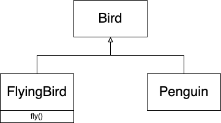
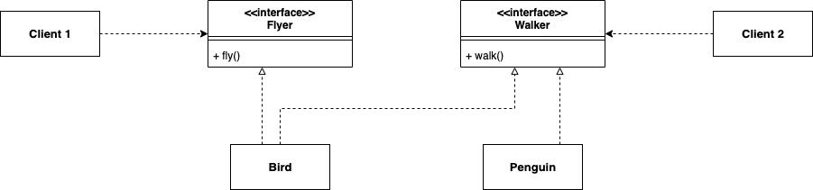
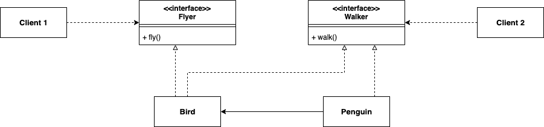

[오브젝트 - 코드로 이해하는 객체지향 설계](http://www.yes24.com/Product/Goods/74219491?OzSrank=1) 를 정리한 자료입니다.

<br>

# 목차

<br>

<br>

# Chapter 13 서브클래싱과 서브타이핑

상속은 객체지향에서 빠질 수 없는 개념중 하나다.

흔히 상속은 두 가지 용도로 사용된다.

1. 타입 계층
   * 상위 클래스는 일반적인 개념을 구현하고, 하위 클래스는 특수한 개념을 구현한다.
   * 즉, 상위 클래스는 일반화, 하위 클래스는 특수화다.
2. 코드 재사용
   * 상속을 이용하면 상위 클래스의 코드를 쉽게 재사용할 수 있다.
   * 물론 이 방법은 좋지 않다. 하위 클래스가 상위 클래스에 굉장히 의존적이게 되기 때문이다.

<br>

🤔 **상속의 용도는 2가지라면, 올바른 사용법은 무엇일까?**

* 올바른 사용법은 **코드 재사용이 아닌 타입 계층을 구현하는 것.**
  * 이를 통해 다형적으로 동작하는 객체들의 관계에 기반해 확장 가능하고 유연한 설계를 얻을 수 있다.
  * **컴파일 타임에 일반화된 상위 클래스에 의존하고, 런타임에 구체적인 하위 클래스에 따라 메시지를 받아 다르게 동작시키는 다형성을 이용하라는 의미이다.**
* 다시 말하지만 **단순히 코드를 재사용하기 위해서 상속을 사용해서는 안된다.**

<br>

이번 13장을 읽고나면 상속이 서브타입 다형성과 동적 메서드 탐색에 밀접하게 관련있다는 것을 알게된다.

<br>

## 1 타입
우선 객체지향에서 말하는 타입이란 무엇일까에 대해서 다룬다.

**객체지향에서의 타입을 이해하기 위해선 개념 관점의 타입과 프로그래밍 언어 관점에서의 타입을 이해해야한다.**

<br>

### 1-1 개념 관점의 타입
* 개념 관점의 타입이란?
  * **개념 관점에서 타입이란 공통의 특징을 공유하는 대상들의 분류다.**
  * 개념 관점에서 타입이란 우리가 인지하는 세상의 사물의 종류를 말하며, 이는 사물을 분류하기 위한 틀로 사용된다. (카테고리)
* 예시
  * 타입: 프로그래밍 언어
  * 인스턴스(객체라고도 불린다): 자바, 루비, JS, C등등
* 개념 관점의 타입은 세 가지로 구성된다.
  * 심볼(symbol): 타입의 이름. (ex. 프로그래밍)
  * 내연(intension): 타입의 정의. 타입에 속하는 객체들이 가지는 공통적인 속성이나 행동을 가리킴. (ex. 프로그래밍 언어 = 컴퓨터에게 특정한 작업을 요청해 처리)
  * 외연(extension): 타입에 속하는 객체들의 집합. (ex. 자바, 루비, JS, C등등)

<br>

### 1-2 프로그래밍 언어 관점의 타입
* 프로그래밍 언어 관점의 타입이란?
  * 프로그래밍 언어 관점의 타입은 **비트 묶음에 의미를 부여하기 위해 정의된 제약과 규칙을 가리킨다.**
  * **동일한 오퍼레이션을 적용할 수 있는 인스턴스들의 집합.**
* 예시
  * 00000001 을 int로 인식할지, string로 인식할지
* 타입의 목적
  * 타입에 수행될 수 있는 유효한 오퍼레이션의 집합을 정의. (ex. `+`는 int와 string 타입에서만 사용가능.)
  * 타입에 수행되는 오퍼레이션에 대해 미리 약속된 문맥을 제공. (ex. `+`가 int에는 더하기, string에는 이어붙이기로 동작한다.)

> 타입은 적용 가능한 오퍼레이션의 종류와 의미를 정의한다. 이를 통해 개발자의 실수를 방지한다.

<br>

### 1-3 객체지향 패러다임 관점의 타입
그렇다면 객체지향 패러다임 관점에서의 타입은 어떤 의미일까?

* 객체지향 패러다임 관점의 타입
  * 개념 관점에서의 관점
    * **공통의 특징 (객체가 수신할 수 있는 메시지)를 기반으로 분류.**
  * 프로그래밍 언어 관점
    * 객체지향 프로그래밍에서 **오퍼레이션은 객체가 수신할 수 있는 메시지를 의미한다.**
    * 이는 수신할 수 있는 메시지의 집합은 **퍼블릭 인터페이스**를 의미한다.
* **객체지향에서의 타입을 결정하는 것은 내부의 속성이 아닌 객체가 외부에 제공하는 행동이다. - 중요**

> **객체지향에서는 퍼블릭 인터페이스가 객체의 타입을 결정한다!** 이는 **객체에게 중요한 것은 속성이 아니라 행동**이라는 사실을 더욱 강조한다.

<br>

## 2 타입 계층
타입을 이용하여 계층을 만들 수 있다.

<br>

### 2-1 타입 사이의 포함관계
* 타입 역시 객체들의 집합이기에 다른 타입을 포함할 수 있다.
  * 타입 안에 포함된 객체들은 좀 더 상세한 기준으로 묶어 새로운 타입으로 정의하며 기존 타입의 부분집합이 된다.
  * ex. 자바, 루비, JS는 객체지향 언어로 분류되며, C는 절차적 언어로 분류되지만, 모두 프로그래밍 언어이다.
* 포함 관계의 특징
  1. 타입은 집합의 관점에서 더 세분화된 타입의 집합을 부분집합으로 포함할 수 있다.
  2. 동일한 인스턴스가 하나 이상의 타입으로 분류될 수 있다.
* **포함 관계로 연결된 타입 사이에 개념적으로 일반화와 특수화 관계가 존재한다.**
  * 일반화: 다른 타입을 완전히 포함하거나 내포하는 타입을 식별하는 행위.
  * 특수화: 다른 타입 안에 전체적으로 포함되거나 완전히 내포되는 타입을 식별하는 행위.
* 이는 슈퍼 타입과 서브 타입으로 나눌 수 있다.
  * 슈퍼타입
    * 집합이 다른 집합의 모든 멤버를 포함한다.
    * 타입 정의가 다른 타입보다 좀 더 일반적이다.
  * 서브타입
    * 집합에 포함되는 인스턴스들이 더 큰 집합에 포함된다.
    * 타입 정의가 다른 타입보다 좀 더 구체적이다.

<br>

### 2-2 객체지향 프로그래밍과 타입 계층
* 우선 **객체의 타입을 정하는 기준은 퍼블릭 인터페이스다**
* 슈퍼타입과 서브타입
  * 슈퍼타입: 서브타입이 정의한 퍼블릭 인터페이스를 **일반화시켜 상대적으로 범용적이고 넓은 의미로 정의**한 것.
  * 서브타입: 슈퍼타입이 정의한 퍼블릭 인터페이스를 **특수화시켜 상대적으로 구체적이고 좁은 의미**로 정의한 것.
* **중요한 것은 슈퍼타입과 서브타입 간의 관계를 형성하는 기준이 퍼블릭 인터페이스라는 것.**
* **또한, 서브 타입의 인스턴스는 슈퍼타입의 인스턴스로 간주 될 수 있다.**

<br>

## 3 서브클래싱과 서브타이핑
이번엔 서브클래싱과 서브타이핑에 대해서 다룬다.

그리고 상속을 제대로 사용하기 위한 행동호환성에 대해서도 다룬다.

<br>

### 3-1 서브클래싱과 서브타이핑
* 서브클래싱: 다른 클래스의 코드를 재사용할 목적으로 상속을 사용하는 경우.
  * 하위 클래스와 상위 클래스의 행동이 호환되지 않기 때문에 하위 클래스의 인스턴스가 상위 클래스의 인스턴스를 대체할 수 없다. 
  * 클래스의 내부 구현 자체를 상속받는 것에 초점을 두기 때문에 구현 상속(implementation inheritance) 또는 클래스 상속(class inheritance)이라 부른다.
* 서브타이핑: 다른 계층을 구성하기 위해 상속을 사용하는 경우.
  * 하위 클래스와 상위 클래스의 행동이 호환되기 때문에 하위 클래스의 인스턴스가 상위 클래스의 인스턴스를 대체할 수 있다.
  * 상위 클래스는 하위 클래스의 슈퍼타입이 되고 하위 클래스는 상위 클래스의 하위 타입이된다. 그래서 인터페이스 상속 (interface inheritance)라고 부른다.
* **서브클래싱과 서브타이핑을 나누는 기준은 상속을 사용하는 목적이다.**
* **결론적으론 상속을 올바르게 사용하는 방법은 행동 호환성을 지키는 것이다.**
  * 이는 서브타입이 슈퍼타입이 하는 모든 행동을 동일하게 할 수 있어야 한다. (대체 가능성)
  * **행동 호환성을 만족하는 상속 관계는 상위 클래스를 새로운 하위 클래스로 대체하더라도 시스템이 문제없이 동작한다.** (리스코프 치환 원칙)

<br>

### 3-2 언제 상속을 사용해야하는가?
상속은 흔히 두 가지 조건을 만족할 때 사용하라고한다.

1. `is`관계인가?
   * 흔히 `하위 클래스는 상위클래스다`라고해도 이상하지 않을때를 의미한다.
2. 클라이언트 입장에서 상위 클래스의 타입으로 하위 클래스를 사용해도 무방한가? 
   * 클라이언트의 입장에서 상위 클래스와 하위 클래스의 차이점을 몰라야한다. (이를 행동 호환성이라부른다.)

<br>

간단한 예시를 통해 언제 상속을 사용해야하는지 설명한다. 

**중요한 점은 클라이언트의 관점에서 두 클래스에 기대하는 행동이 다르다면 비록 `is-a`관계여도 상속을 사용하면 안된다는 것이다.**

<br>

💁‍♂️ **`is-a`보단 행동 호환성을 고려하라**

두 가지 사실이 있다.

* 펭귄은 새다.
* 새는 날 수 있다.

```java
public class Bird {
    public void fly() {...}
}

public class Penguin extends Bird {
    ...
}
```

위 코드는 반은 맞고 반은 틀리다. **펭귄은 분명 새지만 날 수 없는 새다.** 

**어휘적으로 펭귄은 새지만 (`is-a`) 만약 새의 정의에 날 수 있다는 행동이 포함된다면 펭귄은 새의 서브타입이 될 수 없다. - `is-a`관계가 중요하지 않는 이유**

즉, **타입의 이름 사이에 개념적으로 어떤 연관성이 있다해도 행동에 연관성이 없다면 `is-a`관계를 사용하면 안된다.**

<br>

💁‍♂️ **행동 호환성**

**상속은 `is-a`가 아닌, 두 타입 사이에 행동이 호환될 경우에만 타입 계층으로 묶어야한다.**

**행동이 호환된다는 의미는 동일한 메서드를 구현하고 있으며, 클라이언트 관점에서 두 타입이 동일하게 행동한다는 것을 의미한다.**

위 예시에서의 `Penguin`은 클라이언트 입장에서 모든 새가 날 수 있다고 가정하기 때문에 상속을 잘못 사용한 예시이다.

아마 다음과 같은 해결법을 생각할 것이다.

1. `Penguin`의 `fly`메서드를 오버라이딩해서 내부 구현을 비워두는 것.
2. `Penguin`의 `fly`메서드를 오버라이딩해서 예외를 던지는 것.
3. `flyBird`로 메서드를 수정하고 매개변수로 `Bird`를 넘겨서 `Penguin`인지 확인후 `fly`를 호출하는 것.

하지만 위 방법 모두 행동이 호환되지 않거나 결합도면에서 문제가 있다.

**이 문제를 해결하는 방법은 클라이언트의 기대에 따라 계층을 분리시키는 것이다.**

<br>

### 3-3 클라이언트의 기대에 따라 계층 분리하기
펭귄과 새의 관계를 클라이언트 입장에서 분리시킬 필요가 있다.

따라서 우선 **날 수 있는 새와 날 수 없는 새를 명확하게 구분**할 수 있게 상속 계측을 분리시켜야한다.

<p align="center"> </p>

이제 날 수 있는 타입(`FlyingBird`)의 인스턴스만이 `fly`메서드를 수신할 수 있다.

<br>

🤔 **만약 새가 날 수 있으면서 걸을 수 있다는 요구사항이 생긴다면 어떻게 해야할까?**

<p align="center"> </p>

**해결방법은 위와 같이 클라이언트에 따라 인터페이스를 분리하는 것이다.**

그리고 만약 Penguin이 Bird의 코드를 재사용해야한다면, 상속보다는 아래와 같이 조합을 사용하는 것이 좋다.

<p align="center"> </p>

<br>

💁‍♂️ **ISP** (Interface Segregation Principle)

만약 위 구조에서 `Flyer` 인터페이스가 변경된다고 한다면, Flyer에 의존하고있는 Bird에만 영향을 끼치게된다.

Client2는 Flyer나 Bird에 대해 전혀 모르기 때문에 전혀 영향을 받지 않게 된다.

이처럼 인터페이스를 클라이언트 기대에 따라 분리함으로써 변경에 의해 영향을 제어하는 설계 원칙을 ISP가 부른다.

<br>

💁‍♂️ **설계가 꼭 현실 세계를 반영할 필요는 없다.**

설계가 꼭 현실 세계를 반영할 필요는 없다. 설계는 정답이 없으며, 요구사항을 실용적으로 수용하는 것을 목표로하는 것이 좋다.

즉, **자연어에 현혹되지 말고 요구사항 속에서 클라이언트가 기대하는 행동에 집중하는 것이 우선이다.**

<br>

## 4 리스코프 치환 원칙

<br>


