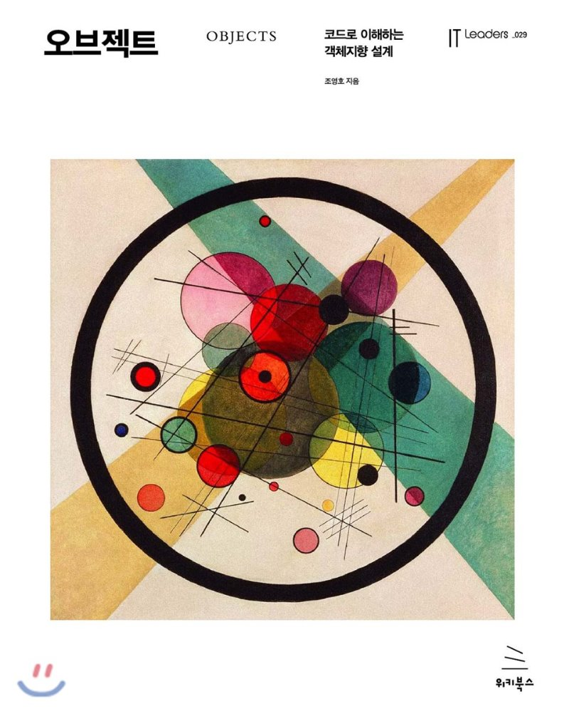

[오브젝트 - 코드로 이해하는 객체지향 설계](http://www.yes24.com/Product/Goods/74219491?OzSrank=1) 를 정리한 자료입니다.

# 목차

* [01 객체, 설계](https://github.com/binghe819/TIL/blob/master/OOP/%EC%98%A4%EB%B8%8C%EC%A0%9D%ED%8A%B8/01%20%EA%B0%9D%EC%B2%B4,%20%EC%84%A4%EA%B3%84.md)
* [02 객체지향 프로그래밍](https://github.com/binghe819/TIL/blob/master/OOP/%EC%98%A4%EB%B8%8C%EC%A0%9D%ED%8A%B8/02%20%EA%B0%9D%EC%B2%B4%EC%A7%80%ED%96%A5%20%ED%94%84%EB%A1%9C%EA%B7%B8%EB%9E%98%EB%B0%8D.md)
* [03 역할, 책임, 협력](https://github.com/binghe819/TIL/blob/master/OOP/%EC%98%A4%EB%B8%8C%EC%A0%9D%ED%8A%B8/03%20%EC%97%AD%ED%95%A0,%20%EC%B1%85%EC%9E%84,%20%ED%98%91%EB%A0%A5.md)
* [04 설계 품질과 트레이드오프](https://github.com/binghe819/TIL/blob/master/OOP/%EC%98%A4%EB%B8%8C%EC%A0%9D%ED%8A%B8/04%20%EC%84%A4%EA%B3%84%20%ED%92%88%EC%A7%88%EA%B3%BC%20%ED%8A%B8%EB%A0%88%EC%9D%B4%EB%93%9C%EC%98%A4%ED%94%84.pdf)
* [05 책임 할당하기](https://github.com/binghe819/TIL/blob/master/OOP/%EC%98%A4%EB%B8%8C%EC%A0%9D%ED%8A%B8/05%20%EC%B1%85%EC%9E%84%20%ED%95%A0%EB%8B%B9%ED%95%98%EA%B8%B0.md)
* [06 메시지와 인터페이스](https://github.com/binghe819/TIL/blob/master/OOP/%EC%98%A4%EB%B8%8C%EC%A0%9D%ED%8A%B8/06%20%EB%A9%94%EC%8B%9C%EC%A7%80%EC%99%80%20%EC%9D%B8%ED%84%B0%ED%8E%98%EC%9D%B4%EC%8A%A4.md)
* [08 의존성 관리하기](https://github.com/binghe819/TIL/blob/master/OOP/%EC%98%A4%EB%B8%8C%EC%A0%9D%ED%8A%B8/08%20%EC%9D%98%EC%A1%B4%EC%84%B1%20%EA%B4%80%EB%A6%AC%ED%95%98%EA%B8%B0.md)
* [09 유연한 설계]()
* [11 합성과 유연한 설계](https://github.com/binghe819/TIL/blob/master/OOP/%EC%98%A4%EB%B8%8C%EC%A0%9D%ED%8A%B8/11%20%ED%95%A9%EC%84%B1%EA%B3%BC%20%EC%9C%A0%EC%97%B0%ED%95%9C%20%EC%84%A4%EA%B3%84.md)
* [13 서브클래싱과 서브타이핑]()
* [15 디자인 패턴과 프레임워크](https://github.com/binghe819/TIL/blob/master/OOP/%EC%98%A4%EB%B8%8C%EC%A0%9D%ED%8A%B8/15%20%EB%94%94%EC%9E%90%EC%9D%B8%20%ED%8C%A8%ED%84%B4%EA%B3%BC%20%ED%94%84%EB%A0%88%EC%9E%84%EC%9B%8C%ED%81%AC.md)

