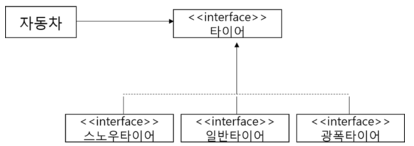
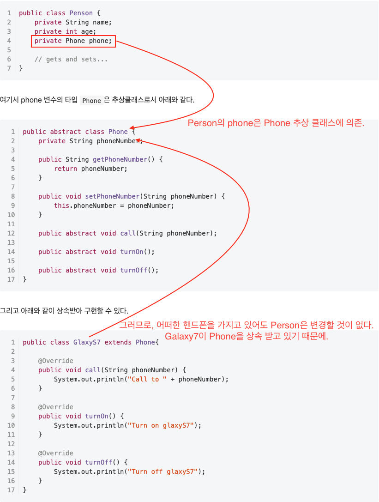

# 목차

- [DIP - 의존 역전 원칙](#dip---의존-역전-원칙)
  * [개념](#개념)
  * [예제 1](#예제-1)
  * [예제 2](#예제-2)
- [참고](#참고)

#  DIP - 의존 역전 원칙

> * "고차원 모듈은 저차원 모듈에 의존하면 안된다. 이 두 모듈 모두 다른 추상화된 것에 의존해야 한다." - 로버트 C. 마틴
> * **"추상화된 것은 구체적인 것에 의존하면 안된다. 구체적인 것이 추상화된 것에 의존해야 한다." - 로버트 C. 마틴**
> * **자신보다 변하기 쉬운 것에 의존하지 마라.**
>   * 자신보다 변하기 쉬운 것에 의존하던 것을 추상화된 인터페이스나 상위 클래스를 두어 변하기 쉬운것의 변화에 영향받지 않게 하는 것이 의존 역전 원칙(DIP이다)

## 개념

* ***의존은 추상과 이루어져야 한다는 원칙***
* 상위 클래스일수록, 인터페이스일수록, 추상 클래스일수록 변하지 않을 가능성이 높기에 **하위 클래스나 구체 클래스가 아닌 상위 클래스, 인터페이스, 추상 클래스를 통해 의존하라는 것이 DIP이다.**
* ***자주 변화하는 것보다 변화하기 어려운 것, 변화가 거의 없는 것에 의존하라는 것***
* 예시
  * 스프링은 DIP를 적극 이용한다.
  * 스프링에서 `DAO` 인터페이스를 놓고, 빈 팩토리를 이용해 구현된 `JdbcDAO`, `JpaDAO`, `myBatisDAO` 중 하나를 주입해준다. `DAO` 코드는 그저 `DAO` 라는 인터페이스를 의존하고 있을 뿐이다.

## 예제 1

* 자동차가 스노우 타이어에 의존하고 있다.
  * 스노우타이어를 일반타이어로 교체할 때 자동차는 그 영향에 노출돼 있다.
  * 자동차 자신보다 더 자주 변하는 스노우타이어에 의존하기에 좋지 않은 설계이다.

* 자동차가 구체적인 타이어들이 아닌 추상화된 타이어 인터페이스에만 의존하게 함으로써 타이어가 변경돼도 자동차는 그 영향을 받지 않는다.
  * OCP와 비슷하다.
* 기존에는 스노우타이어가 의존하지 않는 클래스였는데, 타이어 인터페이스를 만듬으로써, 타이어 인터페이스에 의존하게 됐다.
  * **바로 의존의 방향이 역전된 것이다.**
  * 자신보다 변하기 쉬운 것에 의존하던 것을 추상화된 인터페이스나 상위 클래스를 두어 변하기 쉬운것의 변화에 영향받지 않게 하는 것이 의존 역전 원칙(DIP이다)

## 예제 2

* 만약 갤럭시가 아닌 lg의 G시리즈나 아이폰등도 상속받아서 구현하여 `Person`의 인스턴스 객체의 속성으로 설정함으로서 의존성을 역전 시켜 DIP 원칙을 만족한다.

# 참고

* [스프링 입문을 위한 자바 객체 지향의 원리와 이해](http://www.yes24.com/Product/Goods/17350624)