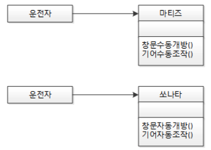
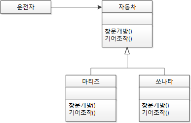
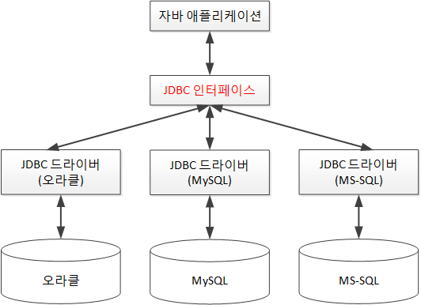
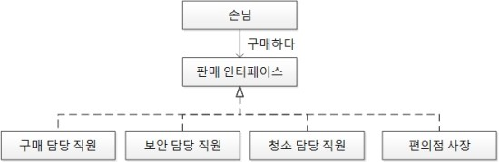

# 목차

- [OCP - 개방 폐쇄 원칙](#ocp---개방-폐쇄-원칙)
  * [개념](#개념)
  * [예제 1](#예제-1)
  * [예제 2](#예제-2)
  * [예제 3](#예제-3)
  * [예제 4](#예제-4)
- [참고](#참고)

# OCP - 개방 폐쇄 원칙

> * "소프트웨어 엔티티(클래스, 모듈, 함수 등)는 확장에 대해서는 열려 있어야 하지만 변경에 대해서는 닫혀 있어야 한다." - 로버트 C. 마틴
> * "자신의 확장에는 열려 있고, 주변의 변화에 대해서는 닫혀 있어야 한다."

## 개념

* 확장에는 열려 있고, 변경에는 닫혀 있다는 원칙
* ***기존의 코드를 변경하지 않고(Closed), 기능을 수정하거나 추가할 수 있도록(Open)해야 한다.***
* 디자인 패턴들의 기본 원칙이 되는 원칙
* **다형성과 인터페이스를 통해 변하는 부분과 변하지 않는 부분을 분리**
* 코드를 유연하고 확장성 있게 만들어 주는 것
* 부모 클래스에서 자식 클래스를 만들 때, 자식 클래스에서 기능을 추가/수정 할 수 있지만, 자식 클래스를 위해 부모 클래스가 수정될 필요는 없다.

## 예제 1

* `운전자`는 `마티즈`와 `쏘나타`의 변화에 따라 행동이 `의존적`으로 변하게 된다.
  * `운전자`가 `마티즈`를 운전하다가 차를 `쏘나타`로 바꾸면 기어와 창문의 조작 방법이 달라 `운전자`가 변화가 필요하다.

* 상위 클래스 또는 인터페이스를 중간에 둠으로써 다양한 자동차가 생긴다고 해도 객체 지향 세계의 `운전자`는 운전 습관에 영향을 받지 않게 된다.
* 다양한 `자동차`가 생긴다고 하는 것은 자동차 입장에서는 자신의 확정에는 개방돼 있는 것이고, `운전자` 입장에서는 주변의 변화에 폐쇄돼 있는 것이다.

## 예제 2

* DB의 확장에는 열려있고, JDBC인터페이스의 변화는 닫혀있다.

## 예제 3

JVM

* 개발자가 작성한 소스코드는 운영체제의 변화에 닫혀 있고, 각 운영체제별 JVM은 확정에 열려있는 구조가 된다.

## 예제 4

* 편의점에서 일일 삼교대로 직원이 교대한다. 직원이 바뀐다고 해서 손님이 구매라는 행위를 하는 데는 영향이 없다.

# 참고

* [스프링 입문을 위한 자바 객체 지향의 원리와 이해](http://www.yes24.com/Product/Goods/17350624)