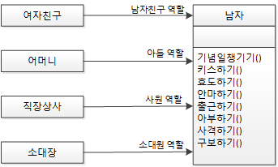

# 목차

- [SRP - 단일 책임 원칙](#srp---단일-책임-원칙)
  * [개념](#개념)
  * [예제 1](#예제-1)
  * [예제 2](#예제-2)
  * [예제 3](#예제-3)
- [참고](#참고)


# SRP - 단일 책임 원칙

> * "어떤 클래스를 변경해야 하는 이유는 오직 하나뿐이어야 한다." - 로버트 C. 마틴
> * 단일 책임 원칙은 모델링 과정을 담당하는 추상화와 깊은 연관이 있다.
>   * 객체 모델링 설계 과정에서 단일 책임 원칙을 고려해야 한다.


## 개념

* **클래스나 함수가 한가지 책임만을 가져야 한다는 원칙**
  * 책임이란 변경의 근원, 변경의 원인이 같다면 같은 책임.
* 클래스를 역할과 책임에 따라 분리해서 각각 하나의 역할과 책임만 갖게하는 원칙
* **만약 하나의 클래스가 여러가지 책임을 가지고 있다면, 그 클래스는 수시로 변경될 것이며, 그 클래스를 사용하고 있는 다른 클래스들도 영향을 받게 되기 때문에 좋은 설계라 할 수 없다.**
* 같은 책임을 가진 것끼리의 그룹화를 잘 해야한다.


## 예제 1



* `남자`라는 클래스에 의존하는 여러 개의 클래스가 있다고 하면, `남자`클래스가 해야 할 일과 책임이 너무 많게 된다.
* 이런 경우에 역할(책임)을 분리하라는 것이 SRP이다.


* `남자`라는 클래스를 역할과 책임에 따라 `남자친구`, `사원`, `아들`, `소대원`으로 나누었다.
  * `여자친구`랑 헤어졌다고해도 `아들-어머니`, `직장상사-사원`, `소대장-소대원`한테는 영향이 전혀 없다.


## 예제 2

```java
// SRP를 어기는 예제
class 강아지 {
  final static Boolean 수컷 = true;
  final staic Boolean 암컷 = false;
  Boolean 성별;
  
  void 소변보다() {
    if(this.성별 == 수컷)
      // 한쪽 다리를 들고 소변을 보다.
   	else
      // 뒷다리 두 개를 굽혀 앉은 자세로 소변을 보다.
  }
}
```

* `강아지`클래스가 `수컷`과 `암컷`을 한번에 구현하려고 하기에 단일 책임(행위)원칙을 위배하고 있다.

```java
// SRP를 적용한 예제
abstract class 강아지 {
  abstract void 소변보다();
}

class 수컷강아지 extends 강아지 {
  void 소변보다() {
    // 한쪽 다리를 들고 소변을 보다.
  }
}

class 암컷강아지 extends 강아지 {
  void 소변보다() {
    // 뒷다리 두 개를 굽혀 앉은 자세로 수변을 보다.
  }
}
```

* 책임을 분배해줌으로써 하나의 클래스가 하나의 책임과 역할만을 담당한다.


## 예제 3

```java
class User {
  private String id;
  private String password;
  private String name;
  private int age;
  
  // get/set
  public String getName() {return name;}
  ...
    
  // save
  void save() {
    // 대충 사용자정보를 DB에 저장하는 로직
  }
}
```

* `User`클래스는 유저의 두 가지의 책임을 가지고 있다.
  * 속성 관리 책임
  * DB 관리 책임

```java
class User {
  private String id;
  private String password;
  private String name;
  private int age;
  
  // get/set
  public String getName() {return name;}
  ...
}

class UserDB {
  User getUser(String name){
    // 사용자정보를 DB에서 가져오는 로직...
    return user;
  }
  
  void save(User user){
    // 대충 사용자정보를 DB에 저장하는 로직...
  }
}
```

* `User`는 유저의 속성 관리 책임을, `UserDB`는 DB 관리 책임을 가지고 있으며 이는 SRP를 지킨 설계이다.


# 참고

* [스프링 입문을 위한 자바 객체 지향의 원리와 이해](http://www.yes24.com/Product/Goods/17350624)