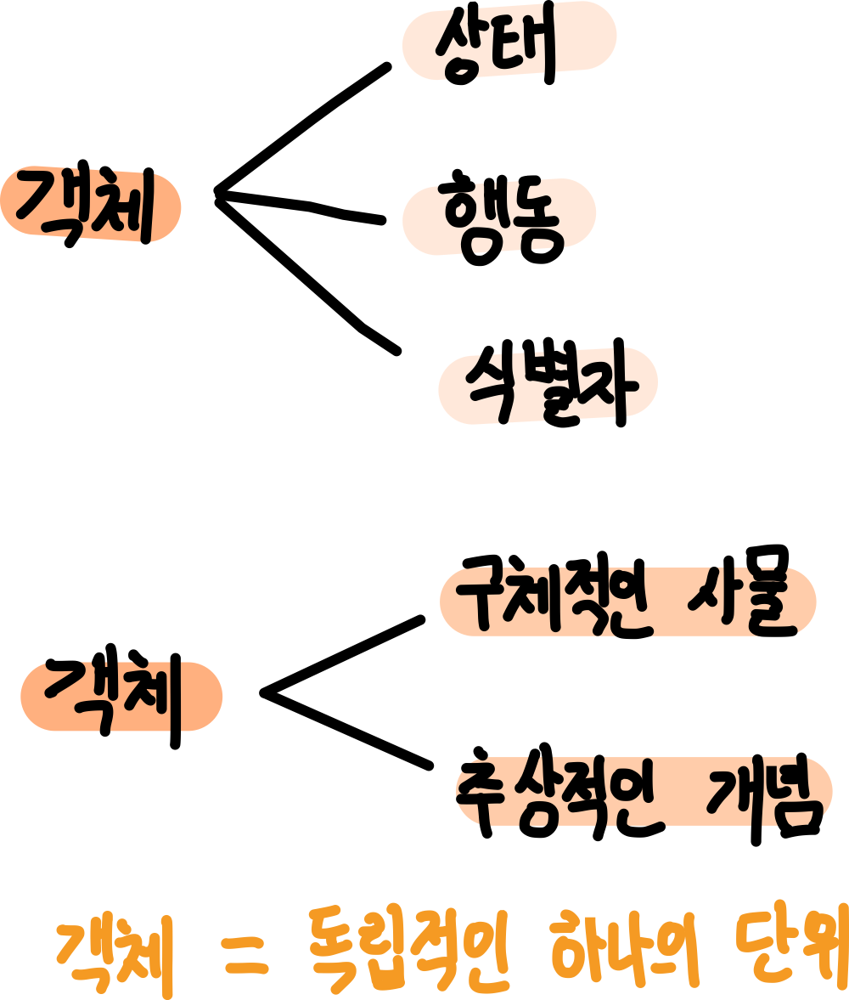
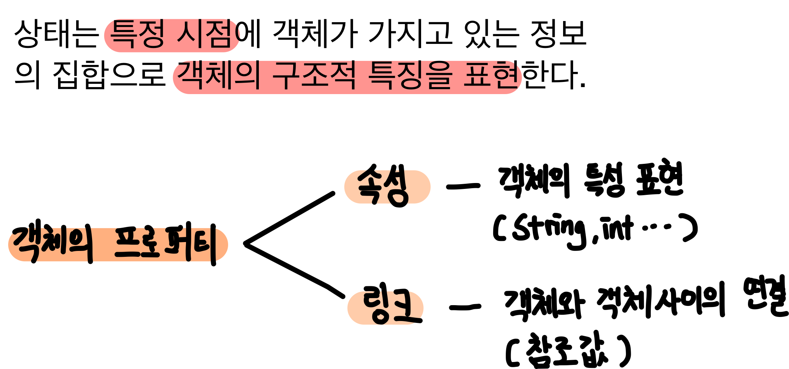
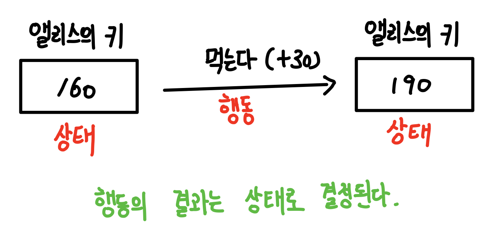
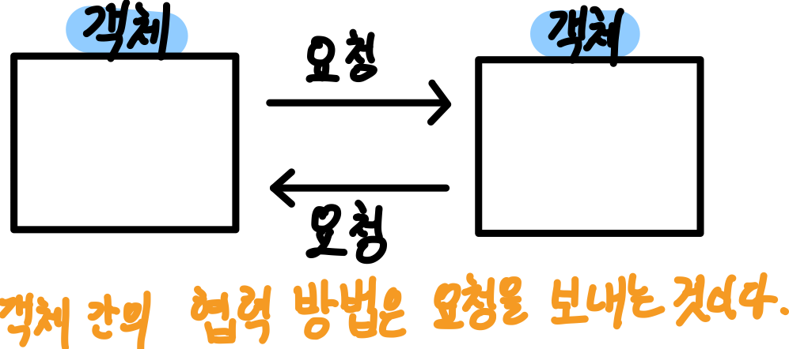
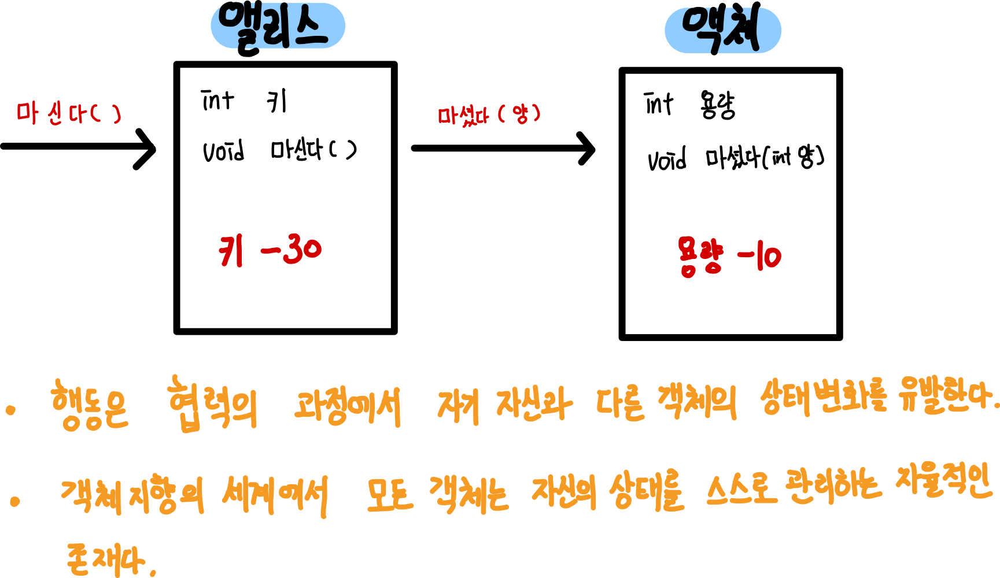
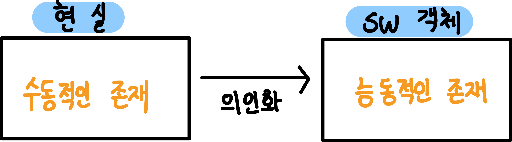

[객체지향의 사실과 오해](http://www.yes24.com/Product/Goods/18249021)를 바탕으로 정리한 자료입니다.

# 목차

- [2장. 이상한 나라의 객체](#2장-이상한-나라의-객체)
  * [1 이상한 나라의 앨리스](#1-이상한-나라의-앨리스)
    + [1-1 내용](#1-1-내용)
    + [1-2 해석](#1-2-해석)
  * [2 객체, 그리고 소프트웨어 나라](#2-객체-그리고-소프트웨어-나라)
    + [2-1 상태](#2-1-상태)
    + [2-2 행동](#2-2-행동)
      - [2-2-1 상태와 행동](#2-2-1-상태와-행동)
      - [2-2-2 협력과 행동](#2-2-2-협력과-행동)
      - [2-2-3 상태 캡슐화](#2-2-3-상태-캡슐화)
    + [2-3 식별자](#2-3-식별자)
      - [2-3-1 값 == 값 객체](#2-3-1-값-==-값-객체)
      - [2-3-2 객체 == 참조 객체, 엔티티](#2-3-2-객체-==-참조-객체--엔티티)
  * [3 기계로서의 객체](#3-기계로서의-객체)
    + [3-1 기계 버튼](#3-1-기계-버튼)
  * [4 행동이 상태를 결정한다](#4-행동이-상태를-결정한다)
  * [5 객체지향 != 현실 세계](#5-객체지향-!=-현실-세계)
    + [5-1 의안화](#5-1-의인화)
    + [5-2 은유](#5-2-은유)

# 2장 이상한 나라의 객체

> 객체지향 패러다임은 지식을 추상화하고 추상화한 지식을 객체 안에 캡슐화함으로써 실세계 문제에 내제된 복잡성을 관리하려고 한다. 객체를 발견하고 창조하는 것은 지식과 행동을 구조화하는 문제다. - 레베카 워프스브록 -

## 1 이상한 나라의 앨리스

저자는 "이상한 나라의 앨리스" 동화책을 기초하여 보다 "참신"하게  객체지향을 설명하였다.

### 1-1 내용

🤔 이상한 나라의 앨리스 이야기 요약

* 앨리스는 작은 문을 발견하고, 작은 문 뒤에 아름다운 정원을 발견한다. 하지만 작은 문의 높이는 40센티이므로, 앨리스는 문을 통과하지 못한다.
* 앨리스는 자신의 몸을 작게 만들 방법을 고민하기 시작한다. 그리고 주변에 보이는 것을 먹으면 몸이 작아지거나 커지는 것을 알게된다.
  * 병 속의 액체마셨더니 몸이 작아졌다.
  * 케이크를 먹었더니 몸이 커졌다.
* 앨리스는 몸의 크기를 컨트롤할 수 있는 버섯을 받고 문을 통과해 고대하던 아름다원으로 발길을 들여 놓을 수 있었다.

### 1-2 해석

저자는 "이상한 나라의 앨리스"에서 `앨리스`라는 객체로 객체지향을 잘 묘사했다.

💁‍♂️ **이상한 나라의 앨리스는 상태, 행동, 식별자를 지닌 실체다.**

* **상태**
  * 앨리스는 상태를 가지며 상태는 변경가능하다.
    * 앨리스의 상태는 키와, 위치이다.
* **행동**
  * ***상태를 변화시키는 것은 행동이다.***
    * 앨리스의 키(상태)는 앨리스가 병 속의 액체를 "마시다"라는 행동을 하거나, 케이크를 "먹는다"라는 행동을 했을 때 변하게 된다.
  * ***상태를 결정하는 것은 행동이지만 행동의 결과를 결정하는 것은 상태다.***
    * 케이크를 먹거나 액체를 마시거나 하기 전에 앨리스의 키가 얼마였느냐가 앨리스의 키를 결정한다.
    * 즉, ***앨리스가 한 행동의 결과는 앨리스의 상태에 의존적이다.***
  * 행동의 순서가 결과에 영향을 미친다.
    * 문을 통과하는 행동이 성공하려면 액체나 케이크를 먹는 행동이 선행돼야만 한다.
* **식별자**
  * 앨리스는 어떤 상태에 있더라도 유일하게 식별 가능하다.
    * **아무리 앨리스의 상태가 변경되어도, 앨리스는 앨리스다.**

## 2 객체, 그리고 소프트웨어 나라

💁‍♂️ 객체의 특성
* 객체는 상태를 가지며 상태는 변경 가능하다.
* 객체의 상태를 변경시키는 것은 객체의 행동이다.
  * **행동의 결과는 상태에 의존적이며 상태를 이용해 서술할 수 있다.**
  * 행동의 순서가 실행 결과에 영향을 미친다.
* 객체는 어떤 상태에 있더라도 유일하게 식별 가능하다.

### 2-1 상태

🤔 왜 상태가 필요한가?

* ***상태를 이용하면 과거의 모든 행동 이력을 설명하지 않고도 행동의 결과를 쉽게 예측하고 설명할 수 있다.***

* ***상태를 이용하면 과거에 얽매이지 않고 현재를 기반으로 객체의 행동 방식을 이해할 수 있다. 상태는 근본적으로 세상의 복잡성을 완화하고 인지 과부하를 줄일 수 있는 중요한 개념이다.***
* 어떤 행동의 결과는 과거에 어떤 행동들이 일어났었느냐에 의존한다. 즉, ***행동의 과정과 결과를 단순하게 기술한 것이 상태이다.***

👉 예시

* 여행을 위해 비행기를 이용하려면 탑승 전에 항공권을 발권해야 한다.
* 자판기에 충분한 금액을 투입하기 전에는 원하는 음료를 선택할 수 없다.

### 2-2 행동

🤔 행동이란 **외부의 요청 또는 수신된 메시지에 응답하기 위해 동작하고 반응하는 활동**이다. **행동의 결과로 객체는 자신의 상태를 변경하거나 다른 객체에게 메시지를 전달**할 수 있다. 객체는 행동을 통해 다른 객체와의 협력에 참여하므로 **외부에 가시적**이어야 한다.

#### 2-2-1 상태와 행동

* **객체의 상태는 저절로 변경되지 않는다. 객체의 상태를 변경하는 것은 객체의 자발적인 행동일 뿐이다.**
* **객체가 취하는 행동은 객체 자신의 상태를 변경시킨다.** 객체의 행동에 의해 객체의 상태가 변경된다는 것은 행동이 **부수 효과를 초래**한다는 것을 의미한다.

💁‍♂️ 상태와 행동 사이에는 다음과 같은 관계가 있다.

* 객체의 행동은 상태에 영향을 받는다.
* 객체의 행동은 상태를 변경 시킨다.

#### 2-2-2 협력과 행동

* 다른 객체와의 협력은 ***상호작용***하는 것이라고 볼 수 있다.

💁‍♂️ 객체의 행동으로 인해 발생하는 결과는 두 가지 관점에서 설명할 수 있다.

* **객체 자신의 상태 변경**
* 행동 내에서 협력하는 다른 객체에 대한 ***메시지 전송***

#### 2-2-3 상태 캡슐화

🤔 캡슐화의 의미
* ***객체의 행동을 유발하는 것은 외부로부터 전달된 메시지지만 객체의 상태를 변경할지 여부는 객체 스스로 결정한다.***
* ***이렇게 객체의 상태를 행동에 의존해서 변경될 수 있게 하는 것이 캡슐화의 역할라고 생각한다.***

💁‍♂️ 캡슐화의 역할
* 상태 : 감춘다. (`private member`)
* 행동 : 노출한다. (`public void method()`)

### 2-3 식별자

🤔 객체 : 인간의 인지 능력을 이용해 식별 가능한 경계를 가진 모든 사물을 의미한다.

🤔 식별자 : 객체를 구분할 수 있는 특정 프로퍼티

#### 2-3-1 값 == 값 객체

💁‍♂️ 동등성 (equality) : 상태만을 이용해 두 값이 같은지 판단할 수 있는 성질

* **식별자가 없다.**
* 불변 상태 (immutable state)이기 때문에 식별자가 필요 없다.

#### 2-3-2 객체 == 참조 객체, 엔티티

💁‍♂️ 동일성 (identical) : 식별자를 기반으로 객체가 같은지를 판단할 수 있는 성질

* **식별자가 있다.**
* 가변 상태 (mutable state)이기 때문에 시간에 따라 상태가 변경된다.
* 타입이 같은 두 객체의 상태가 모두 같아도 두 객체는 다르게 인식한다 => 식별자가 필요한 이유

## 3 기계로서의 객체

🙋‍♂️ **객체지향의 세계를 창조하는 개발자들의 주된 업무는 객체의 상태를 조회하고, 변경하는 것이다.**

* 객체 상태 조회 : 쿼리 (query)
* 객체 상태 변경 : 명령 (command)

### 3-1 기계 버튼

* 버튼 : 상태 조회 / 변경
  * 객체 행동 유발 위해 메시지 전송
* ***사용자는 버튼으로 객체 접근 = 인터페이스 (추상화)***

## 4 행동이 상태를 결정한다

***객체지향에 가장 쉽게 빠지기 쉬운 함정은 상태를 중심으로 객체를 바라보는 것이다.***

😱 상태  -> 행동 **(잘못된 설계)**
* 캡슐화가 저해된다. 상태가 공용 인터페이스 그대로 노출할 가능성이 높다.
  * 캡슐화를 안하면 상태가 상태가 다른 메서드나 인터페이스에 그대로 노출된다.
* 객체를 협력자가 아닌 고립된 섬으로 만든다.
  * 여러 객체가 나눠가져야 하는 상태를 한 객체에 몰아넣을 수 있다.
* 객체의 재사용성이 저하된다.

😎 행동 -> 상태 **(제대로 된 설계)**

* 어떤 행동이 어떤 객체에 적합한지 결정 (적합성 결정)
* 책임 - 주도 설계 : 협력 안에서 객체의 행동은 책임을 의미하는데, 어떤 책임이 필요한가를 결정하고 상태를 결정한다.

***어떤 책임이 필요한가를 결정하는 과정이 전체 설계를 주도해야 한다.***

## 5 객체지향 != 현실 세계

객체지향은 현실 세계가 아닌 새로운 세계를 창조하는 것이다.

### 5-1 의인화

🤔 현실 속의 객체와 SW의 객체간의 큰 차이점은 무엇일까?

* 현실 속에서는 수동적인 존재가 SW 객체로 구현될 때는 능동적으로 변한다.
* SW 객체는 현실 객체가 가지지 못한 추가적인 능력을 보유하게 된다. 잘하면 전지전능한 존재가 된다.

🙋‍♂️ **의인화의 관점에서 소프트웨어를 생물로 생각하자. 모든 생물처럼 소프트웨어는 태어나고, 삶을 영위하고, 그리고 죽는다.**

🤔 의인화 : 사람이 아닌 것을 사람에 비기어 표현함

👉 예시
* 현실에서 전화기는 스스로 통화 버튼을 누를 수 없으며 계좌는 스스로 금액을 이체할 수 없다.
* SW에서는 외부 객체의 요청에 의해 전화기 스스로 통화 버튼을 누르고, 계좌 스스로 금액을 이체한다.

### 5-2 은유

🙋‍♂️ 그렇다고 현실 객체와 SW 객체가 전혀 다른 것은 아니다. **현실 세계의 객체와 SW 객체는 은유의 관계를 가지고 있다.**

🤔 은유 : 사물의 상태나 움직임을 암시적으로 나타내는 수사법. 예로는 "내 마음은 호수요." 따위가 있다.
* 은유의 기원은 'transfer(옮기다)'이며, 하나의 의미를 다른 것을 이용해 전달한다는 의미를 가지고 있다.

* "그 여자는 양 같아요", "그 남자는 사자같아요"

  

👉 **현실 속의 객체의 의미 일부가 소프트웨어 객체로 전달되기 때문에 프로그램 내의 객체는 현실 속의 객체에 대한 은유다. (예시)**

* 비록 현실 속의 전화기는 스스로 전화를 걸 수 없다고 하더라도 우리가 익히 알고 있는 현실의 전화기라는 개념을 이용해 SW객체를 묘사하면 그 객체가 전화를 걸 수 있다는 사실을 쉽게 이해하고 기억할 수 있게 된다.

