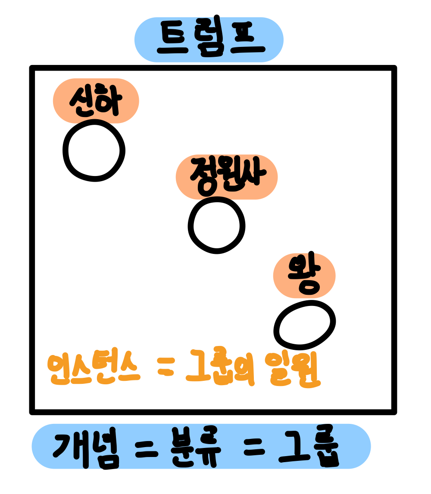
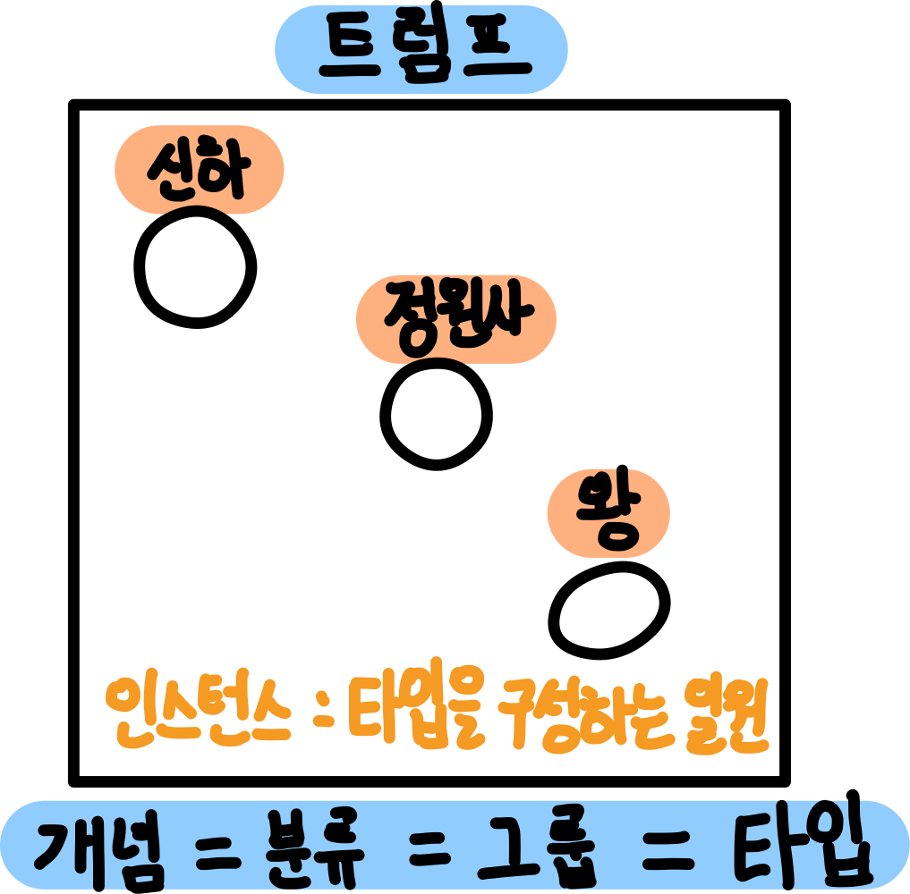
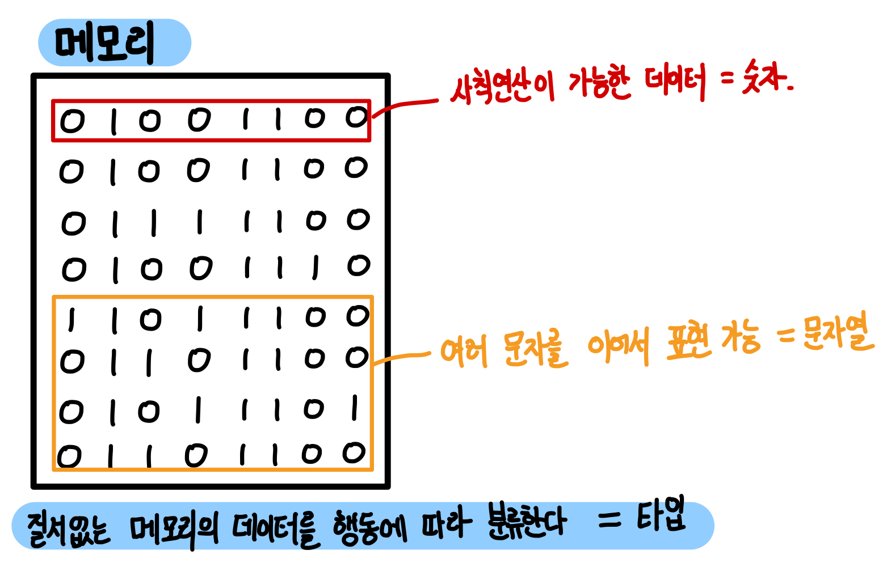
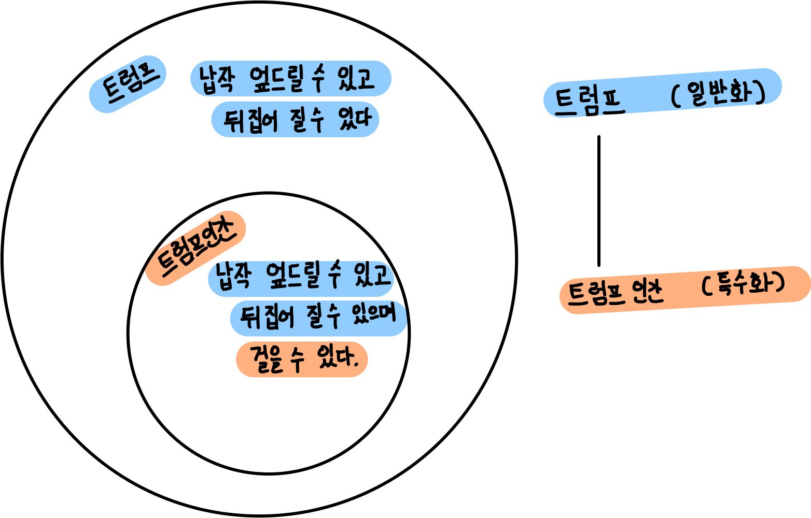
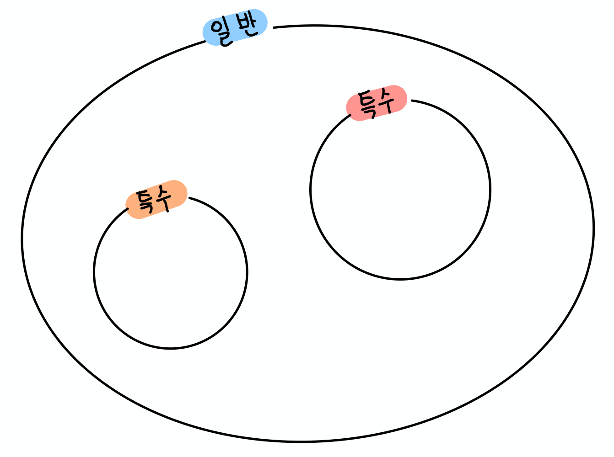
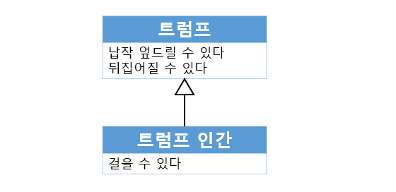

[객체지향의 사실과 오해](http://www.yes24.com/Product/Goods/18249021)를 바탕으로 정리한 자료입니다.

# 목차

- [3장. 타입과 추상화](#3장-타입과-추상화)
  * [1 추상화를 통한 복잡성 극복](#1-추상화를-통한-복잡성-극복)
    + [1-1 추상화](#1-1-추상화)
  * [2 객체지향과 추상화](#2-객체지향과-추상화)
    + [2-1 모두 트럼프일 뿐](#2-1-모두-트럼프일-뿐)
    + [2-2 그룹으로 나누어 단순화하기](#2-2-그룹으로-나누어-단순화하기)
    + [2-3 개념](#2-3-개념)
    + [2-4. 개념의 세 가지 관점](#2-4-개념의-세-가지-관점)
    + [2-5 객체를 분류하기 위한 틀](#2-5-객체를-분류하기-위한-틀)
    + [2-6 분류는 추상화를 위한 도구다](#2-6-분류는-추상화를-위한-도구다)
  * [3 타입](#3-타입)
    + [3-1 타입은 개념이다](#3-1-타입은-개념이다)
    + [3-2 데이터 타입](#3-2-데이터-타입)
    + [3-3 객체와 타입](#3-3-객체와-타입)
    + [3-4 행동이 우선이다](#3-4-행동이-우선이다)
      - [3-4-1 다형성](#3-4-1-다형성)
      - [3-4-2 캡슐화](#3-4-2-캡슐화)
  * [4 타입의 계층](#4-타입의-계층)
    + [4-1 트럼프 계층](#4-1-트럼프-계층)
    + [4-2 일반화 / 특수화 관계](#4-2-일반화-/-특수화-관계)
    + [4-3 일반화는 추상화를 위한 도구다](#4-3-일반화는-추상화를-위한-도구다)
  * [5 정적 모델](#5-정적-모델)
    + [5-1 타입의 목적](#5-1-타입의-목적)
    + [5-2 결국 타입은 추상화](#5-2-결국-타입은-추상화)
    + [5-3 동적 모델과 정적 모델](#5-3-동적-모델과-정적-모델)
    + [5-4 클래스](#5-4-클래스)

# 3장 타입과 추상화

> 일단 컴퓨터를 조작하는 것이 추상화를 구축하고, 조작하고, 추론하는 것에 관한 모든 것이라는 것을 깨닫고 나면 (훌륭한) 컴퓨터 프로그램을 작성하기 위한 중요한 전제 조건은 추상화를 정확하게 다루는 능력이라는 것이 명확해진다.
>
> -키스데블린, 2003-

## 1 추상화를 통한 복잡성 극복

해리 백의 노선도는 지형 정보를 제거하고 역 사이의 연결성을 강조함으로써 승객들의 목적에 맞게 현실을 단순화했다. 이 추상화가 유용했던 이유는 승객들이 지하철을 바라보는 모델과 일치했기 때문이다. 즉, 역의 위치가 중요한 것이 아니라 역과 역 사이의 연결 관계가 중요했던 것이다.

* 추상화의 의미
  * 추상화란 현실에서 출발하되 불필요한 부분을 도려내가면서 사물의 본질을 드러나게 하는 과정.
* 추상화의 목적
  * 불필요한 부분을 무시함으로써 현실에 존재하는 복잡성을 극복하는 것.

### 1-1 추상화

추상화는 어떤 양상, 세부 사항, 구조를 좀 더 명확하게 이해하기 위해 특정 절차나 물체를 의도적으로 생략하거나 감춤으로써 복잡도를 극복하는 방법이다.

복잡성을 다루기 위해 추상화는 두 차원에서 이뤄진다.

* ***일반화***
  * 첫 번째 차원은 구체적인 사물들 간의 ***공톰점을 취하고 차이점은 버리는 "일반화"***를 통해 단순하게 만드는 것이다.
* ***불필요 제거***
  * 두 번째 차원은 중요한 부분을 강조하기 위해 ***불필요한 세부 사항을 "제거함"***으로써 단순하게 만드는 것이다.

## 2 객체지향과 추상화

### 2-1 모두 트럼프일 뿐

앨리스와 하트 여왕이 최초로 마주치는 장면에는 수많은 객체들이 등장한다. 신하들, 공주와 왕자, 왕, 왕비, 정원사, 하얀 토끼들 모두 객체이다.

여기서 등장하는 객체는 제각기 독특한 모습과 행동 양식을 지니고 있다. 하지만 **앨리스는 객체들을 "기껏해야 트럼프에 불과해"라고 한다. 앨리스의 마지막 대사에서 알 수 있는 것처럼 다양한 인물들을 계급, 나이, 성격 등의 차이점은 무시한 채 "트럼프"라는 하나의 개념으로 추상화(단순화)해서 바라보고 있다.**

### 2-2 그룹으로 나누어 단순화하기

각 인물들은 다양한 측면에서 서로 구별할 수 있는 독특한 특징이 있다. 하지만 앨리스는 정원에 있는 인물들을 두 개의 그룹으로 나눴다. 자신이 알고 있는 '트럼프'의 의미에 적합한 인물은 '트럼프' 그룹에 포함하고 '트럼프' 라는 의미에 적합하지 않은 인물은 '트럼프'그룹에서 제외했다.

* 트럼프의 그룹
* 토끼의 그룹.

**두 개의 렌즈(그룹)를 통해 정원을 바라보는 것은 정원에 내재된 복잡성을 효과적으로 감소시킨다.**

### 2-3 개념

**앨리스가 수많은 군중들을 단지 트럼프일 뿐이라고 일축했던 것처럼 주변의 복잡한 객체들은 단지 몇가지 개념의 인스턴스일 뿐이다.**  

* 추상화의 의미
  * 다양한 차이점을 무시하고 공통점만을 취해 단순화하는 것.
* 개념이란
  * 공통점을 기반으로 객체들을 묶기 위한 그릇을 ***개념 (concept)***라고 한다.
  * ***개념 = 분류(class) = 그룹***
* 개념의 예시
  * 길거리를 빠른 속도로 누비는 교통수단에 대해서 "자동차"라는 개념을 적용한다.
  * 몸이 납작하고 두 손 두 발이 네모난 몸 모서리에 달려 있는 것에 대해서 "트럼프"라는 개념으로 추상화된다.

* 분류 (Classification)
  * 개념을 이용하면 객체를 여러 그룹으로 ***분류 (classification)***할 수 있다.
  * 결과적으로 개념은 공통점을 기반으로 객체를 분류할 수 있는 일종의 체라고 할 수 있다.
* 인스턴스 (Instance)
  * 객체에 어떤 개념을 적용하는 것이 가능해서 개념 그룹의 일원이 될 때 객체를 그 개념의 ***인스턴스 (instance)***라고 한다.
  * ***자바에서의 인스턴스화란 개념(class) 그룹의 새로운 일원을 생성하는 것이다.***

### 2-4 개념의 세 가지 관점

어떤 객체에 어떤 개념이 적용됐다고 할 때는 그 개념이 부가하는 의미를 만족시킴으로써 다른 객체와 함께 해당 개념의 일원이 됐다는 것을 의미한다.

1. 심볼 (symbol)
   * 개념을 가리키는 이름이나 명칭
   * 예 ) 트럼프
2. 내연 (intension)
   * 개념의 완전한 정의를 나타낸다.
   * 내연은 개념을 객체에게 적용할 수 있는지 여부를 판단하기 위한 조건.
   * 예 ) 몸이 납작하고 두 손과 두 발은 네모 귀퉁이에 달려 있는 등장인물
3. 외연 (extension)
   * 개념에 속하는 모든 객체의 집합
   * 개념의 인스턴스들이 모여 이뤄진 집합을 가리킨다.
   * 예 ) 정원사, 병사, 신하, 왕자와 공주 ...

### 2-5 객체를 분류하기 위한 틀

어떤 객체와 마주했을 때 객체에게 적용할 개념을 결정하는 것은 결국 해당 객체를 개념이 적용된 객체 집합의 일원으로 맞아들인다는 것을 의미한다.

* 분류란
  * **특정한 객체를 특정한 개념의 객체 집합에 포함시키거나 포함시키지 않는 작업을 의미한다.**
  * 객체에 특정한 개념을 적용하기로 결심했을 때 우리는 그 객체를 특정한 집합의 멤버로 분류하고 있는 것이다.

### 2-6 분류는 추상화를 위한 도구다

***개념을 통해 객체를 분류하는 과정은 추상화의 두 가지 차원을 모두 사용한다.***

1. 첫 번째 차원 : 구체적인 사물 간의 공통점은 취하고 차이점은 버리는 ***일반화***를 통해 단순화하는 것이다.
   * 정원사, 병사, 신하, 왕자와 공주 ... 등을 **'트럼프'라는 개념**으로 묶은 것은 **개별 객체 간의 차이점을 무시하고 공통점을 취한 결과이다.**
2. 두 번째 차원 : 중요한 부분을 강조하기 위해 ***불필요한*** 세부 사항을 ***제거***해 단순화하는 것이다.
   * 트럼프에 속하는 객체들의 공통점 중 몸이 납잡하고 두 손과 두 발이 네모난 몸 모서리에 달려있다는 것 외의 사항들은 **무시**하고 있다.

## 3 타입

### 3-1 타입은 개념이다

* 개념이란?
  * 우리 주위의 대상에서 ***공통된 것, 일반적인 것***을 꺼내어 개괄함으로써 생겨난 관념.
* 타입이란?
  * 타입은 개념과 동일하다.
  * **타입이란 우리가 인식하고 있는 다양한 사물이나 객체에 적용할 수 있는 아이디어나 관념을 의미한다.** 
* 타입의 인스턴스란?
  * 어떤 객체에 타입을 적용할 수 있을 때 그 객체를 타입의 인스턴스라고 한다. 타입의 인스턴스는 타입을 구성하는 외연인 객체 집합의 일원이 된다.

### 3-2 데이터 타입

* 타입이 없는 메모리
  * **메모리의 세상에는 타입이라는 질서가 존재하지 않는다. (우리가 타입을 지정해주지 않는다면)**
  * 문제는 **"10010001"가 숫자인지, 문자열인지, 아니면 특정한 메모리 상의 주소인지 모른다는 것이다.**
* 특정한 의미 부여
  * 자신이 다뤄야 하는 ***데이터의 용도와 행동***에 따라 그것들을 ***분류***한다.
    * 데이터와 데이터가 더하거나 빼거나 나누거나 곱할 수 있다 = 숫자 **(행동 = 사칙연산)**
    * 데이터가 여러 문자로 구성돼 있고 다른 문자와 연결 가능 = 문자열 **(행동 = 문자 붙이기)**
  * ***메모리의 데이터를 목적에 따라 분류하기 시작하면서 타입 시스템이 생겨났다.***

* 데이터 타입이란?
  * 데이터 타입은 메모리 안에 저장된 데이터의 종류를 ***분류***하는 데 사용하는 메모리 집합에 관한 메타데이터이다.
* 타입에 관한 두 가지 사실
  * 첫째, 타입은 데이터가 어떻게 사용되느냐에 관한 것이다. (행동을 먼저 생각)
    * 숫자형 데이터가 숫자형인 이유는 데이터를 사칙연산할 수 있기 때문이다.
  * 둘째, 타입에 속한 데이터를 메모리에 어떻게 표현하는지는 외부로부터 철저하게 감춰진다. (캡슐화)
    * `int a = 5`라는 데이터는 메모리 상에 `101`로 저장되지만, 개발자는 내부의 저장 방식을 몰라도 된다. 

### 3-3 객체와 타입

원시 자료형 타입과 객체지향의 타입 사이에는 깊은 연관성이 있다.

그렇다면 객체는 데이터인가? 그렇지 않다. 객체에서 중요한 것은 객체의 행동이다.

* 객체 타입도 원시 자료형 타입과 동일하다.
  * 첫째, 어떤 객체가 어떤 타입에 속하는지를 결정하는 것은 ***객체가 수행하는 행동***이다.
  * 둘째, 객체의 내부적인 표현은 ***외부로부터*** 철저하게 ***감춰진다***.

### 3-4 행동이 우선이다

* ***객체의 타입을 결정하는 것은 행동뿐이다.***

  * 데이터는 아무런 영향도 미치지 않는다.
  * 분류할 때의 명확한 기준.

  

#### 3-4-1 다형성

* 동일한 행동이란 동일한 책임, 동일한 책임은 동일한 메시지 수신을 의미한다.
  * 따라서, 동일한 타입에 속한 객체는 내부 데이터 표현이 달라도 동일한 메시지를 수신하고 처리할 수 있다.
  * 다만 데이터 표현이 달라 처리하는 방식이 다를 수 밖에 없고, 이것은 ***다형성***에 의미를 부여한다.

* **다형성이란?**
  * 동일한 요청에 대해 서로 다른 방식으로 응답할 수 있는 능력을 뜻한다.

#### 3-4-2 캡슐화

* 내부 표현 방식과 무관하게 행동만이 고려 대상이다.
  * 외부에 데이터를 감춰야한다.
  * 이는 ***캡슐화***를 의미한다.
  * 외부에서 바로 데이터에 접근시 객체의 분류 체계는 급격히 위험에 노출된다.
* 예시
  * 계좌의 잔고는 마이너스가 될 수도 없고, 행동을 통해 인증을 거치지않고 바로 접근시, 은행 체계 자체가 흔들릴 수 있다.

> ***객체를 결정하는 것은 행동이다. 데이터는 단지 행동을 따를 뿐이다. 이것이 객체를 객체답게 만드는 가장 핵심적인 원칙이다.***

## 4 타입의 계층

### 4-1 트럼프 계층

* 트럼프 인간은 트럼프가 할 수 있는 모든 것을 할 수 있지만 트럼프보다 좀 더 특화된 행동을 할 수 있다.
* 트럼프 인간은 트럼프이다.
  * 이 관점에서 트럼프는 트럼프 인간을 포괄하는 좀 더 일반적인 개념
  * 트럼프 인간은 트럼프보다 좀 더 특화된 행동을 하는 특수한 개념이다.

### 4-2 일반화 / 특수화 관계

* 일반화와 특수화는 동시에 일어난다.
* **일반화와 특수화를 결정하는 요인은 상태를 표현하는 데이터가 아니라 *행동*이다.**
  * 즉, 내부에 보관한 데이터가 아니라, ***외부로 노출된 행동***
  * 일반적인 타입 : 공통된 행동, 적은 수의 행동
  * 특수한 타입 : 일반적인 타입에 비해 많은 행동을 가지며, 일반적인 타입이 하는 모든 행동을 동일하게 수행할 수 있다.
* 슈퍼 타입 : 일반적인 타입
* 서브 타입 : 특수한 타입

### 4-3 일반화는 추상화를 위한 도구다

* 추상화의 중요한 부분
  * 일반화
  * 불필요한 세부 사항 제거
* 일반화 / 특수화 계층은 객체지향 패러다임에서 추상화의 두 번째 차원을 적절하게 활용하는 대표적인 예이다.
  * 앨리스의 이야기에서 걸을 수 있는 트럼프 인간의 특수한 능력을 ***제거***하고 트럼프의 특성에 집중하였다.

## 5 정적 모델

### 5-1 타입의 목적

* 왜 타입을 사용해야 하는가?
  * 인간의 인지능력으로 부족한 시간에 따라 동적으로 변하는 ***객체의 복잡성을 극복하기 위해***
  * ***객체의 상태는 변하지만, 다른 객체와 구별할 수 있는 식별성은 동일하게 유지된다.***
* ***타입은 시간에 따라 동적으로 변하는 상태를 시간과 무관한 정적인 모습으로 다룰 수 있게 해준다.***

### 5-2 결국 타입은 추상화

* 타입은 추상화다.
* 타입을 이용하면 객체의 동적인 특성을 추상화 할 수 있다.
  * ***결국 타입은 시간에 따른 객체의 상태 변경이라는 복잡성을 단순화할 수 있는 효과적인 방법인 것이다.***

### 5-3 동적 모델과 정적 모델

* 객체의 스냅샷으로 동적 모델
  * 객체가 특정 시점에 구체적으로 어떤 상태를 가지느냐를 ***스냅샷***이라고한다.
  * 스냅샷처럼 실제로 상태가 어떻게 변하고 어떻게 행동하는지를 포착하는 것이 ***동적 모델***이다.
* 정적 모델 == 타입 모델
  * 객체가 가질 수 있는 모든 상태와 모든 행동을 시간에 ***독립적으로 표현***하는 것
  * 객체 다이어그램 (UML)
* 객체지향을 설계하고 구현하기 위해서는 동적, 정적 모델을 적절히 혼용해야 한다.

### 5-4 클래스

* 정적인 모델은 클래스를 이용해 구현한다.
  * 타입을 구현하는 가장 보편적인 방법은 클래스이다.
  * 클래스 != 타입
* 클래스와 타입을 구분하는 것은 중요하다.
  * 클래스는 타입을 구현하기 위한 구현 매커니즘의 한 종류
  * JS는 프로토타입을 사용한다.

