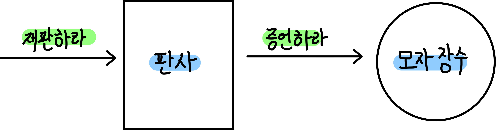
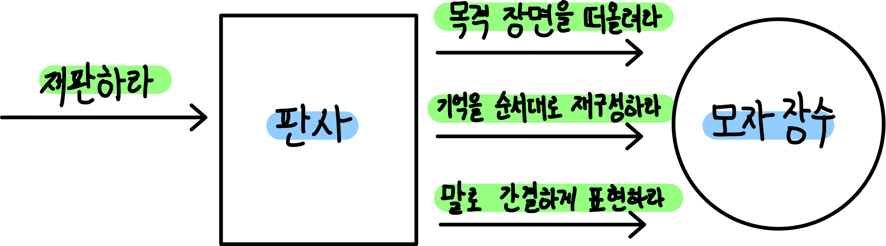
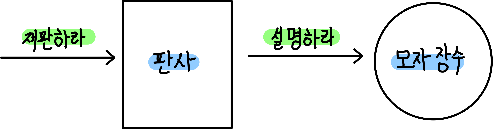
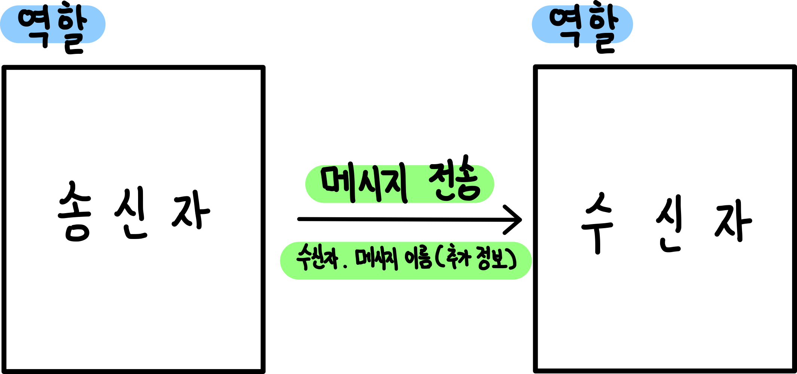
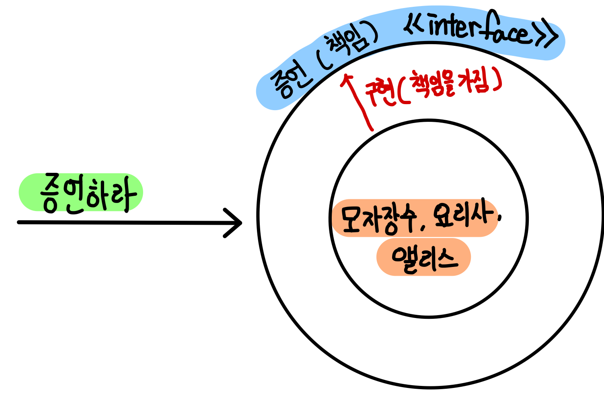
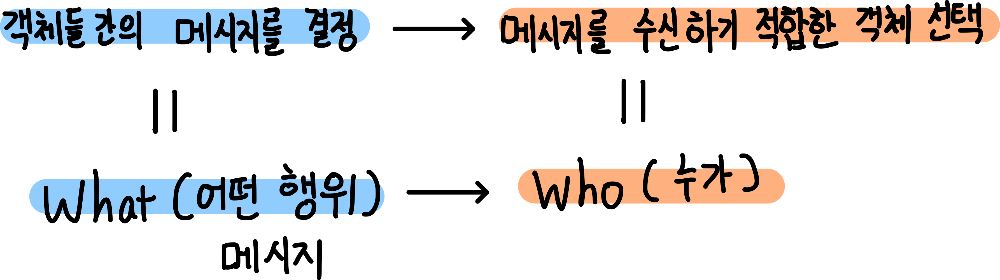
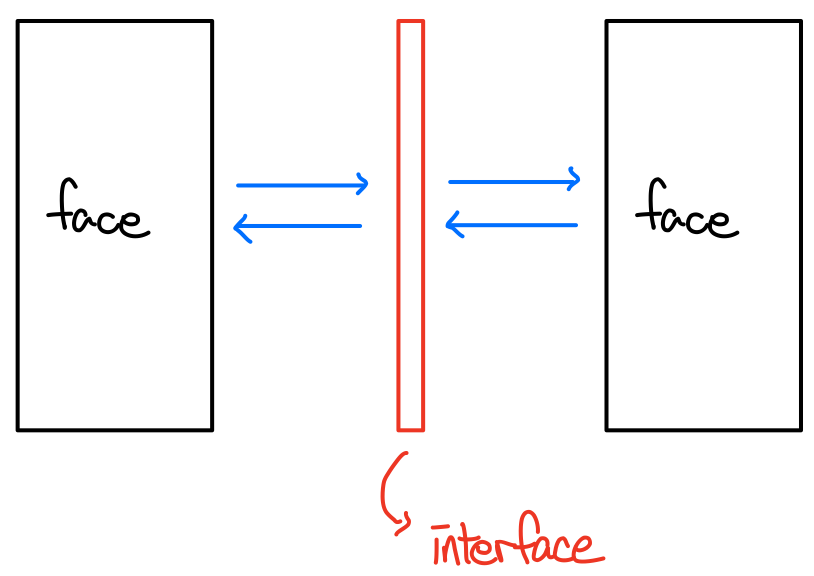
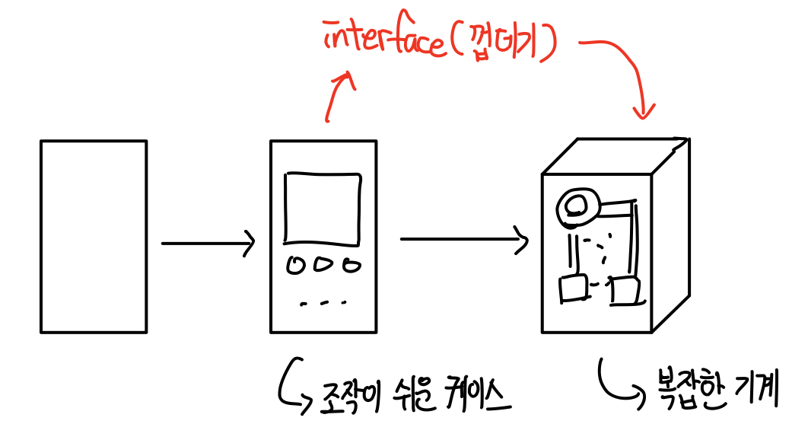
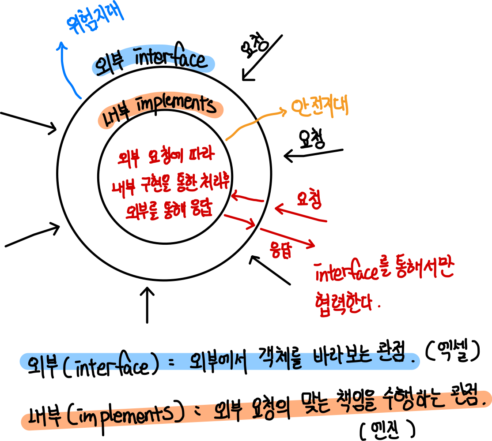

[객체지향의 사실과 오해](http://www.yes24.com/Product/Goods/18249021)를 바탕으로 정리한 자료입니다.

# 목차

# 5장 책임과 메시지

> 의도는 "메시징"이다. 훌륭하고 성장 가능한 시스템을 만들기 위한 핵심은 모듈 내부의 속성과 행동이 어떤가보다는 모듈이 어떻게 커뮤니케이션하는가에 달려있다. - 앨런 케이 -

🙋‍♂️ 훌륭한 객체지향의 세계는 **명확하게 정의된 역할과 책임**을 지닌 객체들이 상호 협력하는 세계다.

* 현실세계
  * 현실세계에서 사건에 대한 목격자가 많으면 많을 수록 개인이 느끼는 책임감은 적어진다.
  * 명확한 책임이 개인에게 주어진다면 사건을 쉽게 해결할 수 있을 것이다.

## 1 자율적인 책임

🤔 ***자율성***이란?

* 자기 **스스로의 원칙**에 따라 어떤 일을 하거나 자신을 통제해서 절제하는 성질이나 특성

  

🤔 ***자율적인 객체***란?

* **스스로 정한 원칙**에 따라 판단하고 **스스로의 의지**를 기반으로 행동하는 객체

* 타인이 정한 규칙이나 명령에 따라 판단하고 행동하는 객체는 자율적인 객체가 아니다.

* **객체의 내부(구현)와 외부(인터페이스)를 엄격하게 분리하는 것.**

  

💁‍♂️ **협력에 참여하는 객체가 얼마나 자율적인지가 전체 애플리케이션의 품질을 결정한다.**

### 1-1 책임이 너무 구체적이면 안된다

💁‍♂️ 객체가 책임을 자율적으로 수행하기 위해서는 객체에게 할당되는 책임이 자율적이어야 한다.

  

😎 **자유로운 객체의 예시**

* `모자 장수`는 증언할 책임이 있지만 증언을 위한 **구체적인 방법이나 절차에 대해서는 자유를 누린다.**
  * `모자 장수`가 기록해놓은 수첩을 통해 증언하든, 기억을 되돌아봐 증언하든 자유이다.
* **중요한 것은 `왕`은 `모자 장수`가 무엇을 하든 신경쓰지 않는다는 것이다.**

😱 **자유롭지 않은 객체의 예시**

* `왕`은 `모자 장수`에게 좀 더 상세한 수준의 요청을 한다.
* 자유롭지 않다.
  * **문제는 이 책임들이 `모자 장수`가 증언하기 위해 선택할 수 있는 자유의 범위를 지나치게 제한한다.**
  * `모자 장수`는 책임을 수행하기 위해 자신의 의지나 판단력이 아닌 **`왕`에게 의존**해야 한다.

### 1-2 책임이 너무 추상적이어도 안된다

💁‍♂️ **포괄적이고 추상적인 책임을 선택한다고 해서 무조건 좋은 것은 아니다.**  

  

* ***책임은 협력에 참여하는 의도를 명확하게 설명할 수 있는 수준 안에서 추상적이어야 한다.***
  * `설명하라`는 정확히 무엇을 설명하라는지 너무 추상적이다.

### 1-3 '어떻게'가 아니라 '무엇'을

💁‍♂️ **자율적인 책임**의 특징은 객체가 **'어떻게(How)'**해야 하는가가 아니라 **'무엇(What)'**을 해야하는 가를 설명한다.

* **'증언하라'라는 책임은 `모자 장수`가 협력을 위해 `무엇`을 해야하는지는 결정하지만 `어떻게`는 결정하지 않는다.**

💁‍♂️ **책임을 수행하는 방법은 객체 자신이 자율적으로 선택할 수 있다. (How는 내맘대로~)**

### 1-4 책임을 자극하는 메시지

💁‍♂️ **객체는 다른 객체로부터 전송된 요청을 수신할 때만 어떤 행동을 한다.**

* 객체가 자신에게 할당된 책임을 수행하도록 만드는 것은 외부에서 전달되는 요청이다.

## 2 메시지와 메서드

### 2-1 메시지

🤔 **메시지란?**

* 메시지는 **객체들이 서로 협력**하기 위해 사용할 수 있는 **유일한 의사소통 수단**이다.
* **`객체가 다른 객체에게 접근하는 방법` == `요청을 전송` == `메시지`**
* 메시지는 **"어떻게"**수행 될 것인지는 **명시하지 않고**, **"무엇"이 실행되기를 바라는지만 명시한다.**

🤔 **메시지 전송이란?**

* 메시지-전송 메커니즘은 객체가 다른 객체에 접근할 수 있는 유일한 방법이다.
* 메서드 호출

💁‍♂️ **메시지의 구성**

* 메시지는 3 부분으로 구성된다.
  * 수신자
  * 메시지 이름
  * 인자 : 메시지를 전송할 때 추가적인 정보를 다는데 사용된다.
* 메시지의 예시
  * `모자장수.증언하라(어제, 왕국)`

💁‍♂️ **메시지와 책임**

* 메시지의 개념은 책임과 연결된다.
  * 송신자는 메시지 전송을 통해서만 다른 객체의 책임을 요청하고, 수신자는 오직 메시지 수신을 통해서만 자신의 책임을 수행한다.
  * 즉, **객체가 수신할 수 있는 메시지의 모양이 객체가 수행할 책임의 모양을 결정한다. (인터페이스)**

### 2-2 메서드

🤔 **메서드란?**

* 메시지를 처리하기 위해 선택할 수 있는 방법
* 예시
  * `모자 장수`가 `증언하라`라는 메시지를 처리하기 위해 내부적으로 선택하는 증언 방법

💁‍♂️ **메시지와 메서드**

* `메시지 == 무엇`
  * 메시지는 '어떻게'수행될 것인지는 명시하지 않는다. 단지 '무엇'이 실행되기를 바란다.
* `메서드 == 어떻게`
  * 메서드는 메시지에 따른 '어떻게'를 명시한다. 메서드를 선택하는 것은 전적으로 수신자의 결정이다.

### 2-3 다형성

🤔 **다형성이란?**

* **서로 다른 유형의 객체**가 **동일한 메시지**에 대해 **서로 다르게 반응**하는 것.
* **서로 다른 타입의 객체**들이 **동일한 메시지**를 수신할 경우 **서로 다른 메서드**를 이용해 메시지를 처리할 수 있는 메커니즘

:point_right: **다형성 예시**

* `모자 장수`, `요리사`, `앨리스`는 증언이라는 책임을 가지므로, `증언하라`라는 메시지를 이해할 수 있다.
* 또한, 각자 자신만의 방법(메서드)로 메시지를 처리한다.

💁‍♂️ **다형성의 본질**

* 서로 다른 객체들이 **다형성을 만족**시킨다는 것은 ***객체들이 동일한 책임을 공유***한다는 것을 의미한다.
* **다형성에서 중요한 것은 메시지 송신자의 관점이다. 동일한 책임을 수행하므로 동일한 메시지를 보낼 수 있다.**

### 2-4 재사용성이 높은 협력

😎 **다형성을 통한 재사용성이 높은 협력**

1. 협력이 유연해진다.
   * 송신자에게 아무런 영향도 미치지 않고 수신자를 교체할 수 있다.

2. 협력이 수행되는 방식을 확장할 수 있다. 
   * 협력에 영향을 미치지않고 수신자를 바꿀 수 있으므로 협력의 세부적인 수행 방식을 쉽게 수정할 수 있다.
3. 협력이 수행되는 방식을 재사용할 수 있다.
   * 협력에 영향을 미치지않고 수신자를 바꿀 수 있으므로 다양한 문맥에서 협력을 재사용할 수 있다.

## 3 메시지를 따라라

### 3-1 객체지향의 핵심, 메시지

😱 **클래스가 중심이 아니다.**

* 초심자가 흔히 하는 클래스를 중심에 두는 설계는 유연하지 못하고 확장하기 어렵다.
* **객체지향은 시스템을 정적인 클래스들의 집합이 아니라 메시지를 주고받는 동적인 객체들의 집합으로 바라보는 것에서 시작된다.**
* 객체지향은 클래스를 이용해 만들어지지만 메시지를 통해 정의된다.

😎 **중요한 것은 메시지다.**

* 객체지향은 자율적인 객체들의 협력을 통해 애플리케이션을 구축하는 것이며, 서로 협력하기 위해 유일한 방법은 메시지를 전송하는 것이다.

* ***객체지향의 중심 사상***은 **메시지를 전송하고 수신하는 객체들** 사이의 **협력 관계**를 기반으로 기능을 제공하는 것이다.

💁‍♂️ **객체가 메시지를 선택하는 것이 아니라 메시지가 객체를 선택하게 해야 한다.**

* 독립된 객체의 상태와 행위에 대해 고민하지 말고 ***객체가 다른 객체에게 제공해야 하는 메시지***에 대해 고민해야한다.
* 훌륭한 객체지향 설계는 메시지 전송과 수신을 통한 협력 관계를 구성하는 것이다.
* **인터페이스를 먼저 생각해라**

### 3-2 책임-주도 설계와 메시지

> 객체지향 설계는 **적절한** 책임을 **적절한**객체에게 할당하면서 ***메시지를 기반으로 협력***하는 객체들의 관계를 발견하는 과정이다.

🙋‍♂️ **책임-주도 설계에서 가장 중요한 것은 메시지다.**

* 책임 - 주도 설계의 기본 아이디어는 **객체들 간의 주고받는 메시지를 기반으로 적절한 역할과 책임, 협력을 발견하는 것이다.**

🙋‍♂️ **메시지가 수신자의 책임을 결정한다.**

* ***객체가 자신이 수신할 메시지를 결정하게 하지 말고 메시지가 협력에 필요한 객체를 발견하게 해야 한다.***

🤔 **What / Who란?**

* 객체 사이의 **협력 관계를 설계**하기 위해 먼저 **'어떤 행위(What)'**를 수행할 것인지를 결정하고 **'누가(Who)'** 그 행위를 수행할 것인지를 결정한다는 것이다.
* 책임 - 주도 설계의 핵심은 **어떤 행위가 필요한지를 먼저 결정한 후 이 행위를 수행할 객체를 결정하는 것이다.**

* **협력에서 객체의 책임을 결정하는 것은 메시지다.**

🙋‍♂️ **인터페이스**

* 수신 가능한 메시지가 모여 객체의 인터페이스를 구성한다.
* 메시지를 통한 '인터페이스 발견'은 TDD를 이용한 객체 설계에서 핵심이 되는 아이디어이다.

## 4 객체 인터페이스

> 책임-주도 설계는 객체가 아니라 객체들이 주고받는 메시지에 초점을 맞추게 함으로써 객체지향의 장점을 극대화한다.
>
> 이때, 메시지가 모여 객체의 인터페이스를 구성하게 된다.

`인터페이스 == 책임(행동들의 집합)`

### 4-1 인터페이스

🤔 **인터페이스란?**

* 인터페이스란 어떤 두 사물이 마주치는 경계 지점에서 서로 상호작용할 수 있게 이어주는 방법이나 장치를 말한다.
* 예시
  * 사람들이 상호작용하는 말과 글
  * 리모콘
  * GUI

💁‍♂️ **인터페이스 특징**

1. **인터페이스의 사용법**만 알고 있으면 대상의 **내부 구조나 동작 방법을 몰라도 상호작용이 가능**하다. (추상화)
   * 자동차 인터페이스는 자동차 내부의 복잡함을 감추고 운전에 필요한 요소만 운전자에게 노출시킨다. (엑셀, 브레이크..)
2. 인터페이스가 변경되지 않고 **단순히 내부 구성이나 작동 방식이 변경**되는 것은 **인터페이스 사용자에게 아무런 영향을 미치지않는다.** (개방폐쇄)
   * 자동차의 내부를 변경한다고 해서 자동차를 운전하는 방법이 변하는 것은 아니다.
3. **인터페이스가 동일**하기만 하다면 **어떤 대상과도 상호작용할 수 있다.** (다형성)
   * 하나의 자동차를 운전하기 위한 인터페이스에 능숙하다면 어떤 자동차라도 운전할 수 있다.

### 4-2 메시지가 인터페이스를 결정한다

😎 **인터페이스는 객체가 수신할 수 있는 메시지의 목록으로 구성되며, 객체가 어떤 메시지를 수신할 수 있는지 제공한다.**

### 4-3 공용 인터페이스

💁‍♂️ 인터페이스 종류

* 공용 인터페이스
  * 메시지 송신자가 다른 객체
* 내부 인터페이스
  * 메시지 송신자가 자기 자신 (구현)

> 인터페이스는 어떻게보면 행동들의 목록인 책임을 뜻한다.
>
> `증언하라`의 `증언`책임은 외부에 노출된 공용이지만, `기억`을 더듬고, `증언하는 방식`에 대한 책임은 자기 자신에게 있으므로, 이들은 내부 인터페이스(책임)이라고 볼 수 있다.

## 5 인터페이스와 구현의 분리

💁‍♂️ **맷 와이스펠드는 객체지향적인 사고 방식을 이해하기 위해서는 다음의 세 가지 원칙이 중요하다고 한다.**

* 좀 더 추상적인 인터페이스
  * 추상화 = 세부사항 제거후 메시지의 의도를 표현
  * 너무 구체적인 인터페이스보다는 추상적인 인터페이스를 설계하는 것이 좋다.
* 최소 인터페이스
  * 외부에서 사용할 필요가 없는 인터페이스는 최대한 노출하지 말아라. (내부 인터페이스)
  * 내부 수정이로 인해 외부에 미치는 영향을 최소화하기 위함.
* 인터페이스와 구현 간에 차이가 있다는 점을 인식
  * 구현

### 5-1 구현

> **객체의 외부를 '공용 인터페이스'라고 부르고, 객체의 내부를 '구현(implements)'라고 부른다.**

🤔 **구현 이란?**

* 구현은 내부 구조와 작동 방식을 가리키는 고유 용어이다.
* 객체를 구성하지만 공용 인터페이스에 포함되지 않는 모든 것이 구현에 포함된다.
* `implements`

### 5-2 인터페이스와 구현의 분리 원칙

> 훌륭한 객체란 구현을 모른 채 인터페이스만 알면 쉽게 상호작용할 수 있는 객체를 의미한다.

🤔 **인터페이스와 구현의 분리 원칙이란?**

* 객체를 설계할 때 **외부에 노출되는 인터페이스**와 내부에 숨겨지는 구현을 **명확하게 분리**해서 고려해야 한다는 것을 의미한다.

* 즉, ***객체 설계의 핵심은 외부에 공개되는 인터페이스와 내부에 감춰지는 구현이다.***

  

🤔 **인터페이스와 구현의 분리가 왜 중요한가?**

* 소프트웨어는 항상 변하기 때문.
  * **어떤 객체를 수정했을 때 어떤 객체가 영향을 받는지 판단하는 것**은 매우 힘들다.
* 변경으로부터 **안전지대를 내부인 구현**이고, **위험 지대를 외부인 인터페이스**라고 한다.
* 분리하는 가장 큰 이유는 **변경을 관리하기 위함**이다.

> * 객체가 가져야 할 상태와 메서드 구현은 **객체 내부**에 속한다.
> * 객체 **외부에 영향을 미치는 변경**은 **객체의 공용 인터페이스를 수정할 때 뿐**이다.

### 5-3 캡슐화

🤔 **캡슐화란?**

* 객체의 자율성을 보존하기 위해 구현을 외부로부터 감추는 것.
* 정보 은닉

💁‍♂️ **캡슐화의 관점**

* 상태와 행위의 캡슐화
  * `Getter/Setter`를 통한 데이터 캡슐화
* 사적인 비밀의 캡슐화
  * **공용 인터페이스를 통해 외부와 분리시키는 것. (인터페이스와 구현의 분리 원칙)**
  * 개방 폐쇄 원칙, 의존 역전 원칙

## 6 책임의 자율성이 협력의 품질을 결정한다

🤔 **왜 책임의 자율성이 중요한 것일까?**

1. **자율적인 책임**은 **협력을 단순**하게 만든다.
   * **자율적인 책임은 세부적인 사항들을 무시하고 의도만을 드러내 협력을 단순하게 만든다.**
2. 자율적인 책임은 모자 장수의 외부와 내부를 명확하게 분리한다.
   * 캡슐화 (인터페이스와 구현)
3. 책임이 자율적일 경우 책임을 수행하는 내부적인 방법을 변경하더라도 외부에 영향을 미치지 않는다.
   * 개방 폐쇄 원칙
4. 자율적인 책임은 협력의 대상을 다양하게 선택할 수 있는 유연성을 제공한다.
   * 재사용성
5. 객체가 수행하는 책임들이 자율적일수록 객체의 역할을 이해하기 쉬워진다.
   * 객체의 존재 이유가 명확

> 객체지향의 시작은 책임을 자율적으로 만드는 것이다. 메시지에 달렸다.

