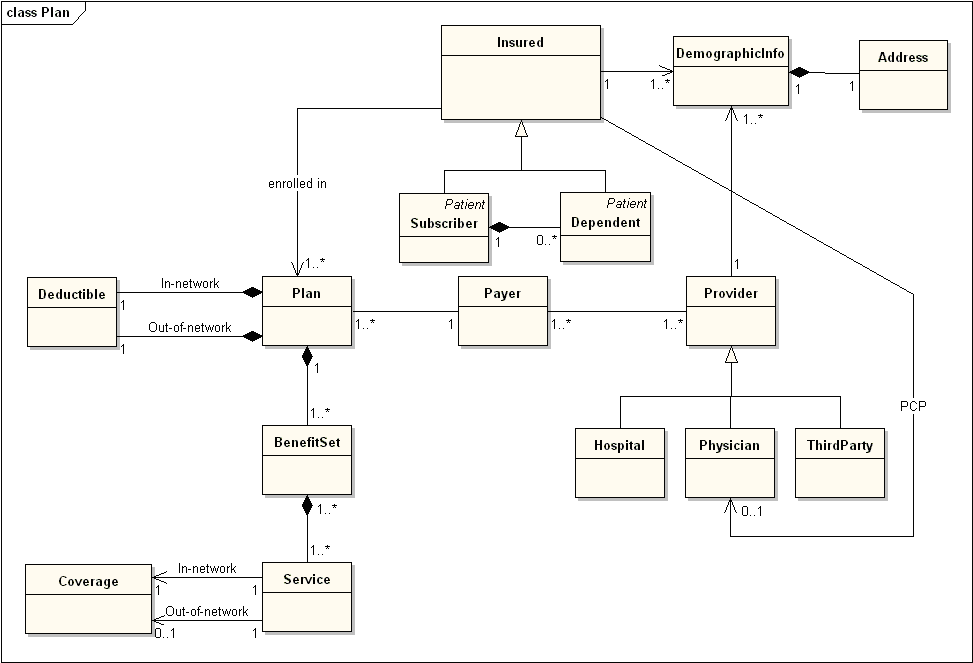

[객체지향의 사실과 오해](http://www.yes24.com/Product/Goods/18249021)를 바탕으로 정리한 자료입니다.

# 목차

- [6장 객체 지도](#6장-객체-지도)
  * [1 기능 설계 대 구조 설계](#1-기능-설계-대-구조-설계)
  * [2 두 가지 재료: 기능과 구조](#2-두-가지-재료-기능과-구조)
  * [3 안정적인 재료: 구조](#3-안정적인-재료-구조)
    + [3-1 도메인 모델](#3-1-도메인-모델)
      - [도메인](#도메인)
      - [모델](#모델)
      - [도메인 모델](#도메인-모델)
    + [3-2 표현적 차이](#3-2-표현적-차이)
    + [3-3 불안정한 기능을 담는 안정적인 도메인 모델](#3-3-불안정한-기능을-담는-안정적인-도메인-모델)
  * [4 불안정한 재료: 기능](#4-불안정한-재료-기능)
    + [4-1 유스케이스란](#4-1-유스케이스란)
    + [4-2 유스케이스의 특성](#4-2-유스케이스의-특성)
  * [5 재료 합치기: 기능과 구조의 통합](#5-재료-합치기-기능과-구조의-통합)
    + [5-1 도메인 모델, 유스케이스, 그리고 책임-주도 설계](#5-1-도메인-모델-유스케이스-그리고-책임-주도-설계)
    + [5-2 기능 변경을 흡수하는 안정적인 구조](#5-2-기능-변경을-흡수하는-안정적인-구조)

# 6장 객체 지도

> **이번 장에서는 기능이 아니라 구조를 바탕으로 시스템을 분할하는 객체지향의 또 다른 측면에 관해 설명한다.**

💁‍♂️ **저자는 길을 찾는 상황을 통해 기능 설계와 구조 설계를 은유를 통해 설명한다.**

* 길을 직접 알려주는 방법
  * 기능적이고 해결책 지향적인 접근법 (기능)
  * 기능에 구조를 종속
  * 경로를 단계별로 상세히 물어봐야한다.
* 지도를 이용하는 방법
  * 구조적이고 문제 지향적인 접근법 (구조)
  * 구조에 기능을 종속
  * 길을 찾는데 필요한 구체적인 기능이 아니라 길을 찾는 **구조**를 제공한다.
  * 변경에 대비하고 변경의 여지를 남겨 놓는다.

 

🤔 **기능 설계와 구조 설계?**

* 기능 측면 설계

  

  * 기능이 변경되면 구조도 같이 변경된다.

* 구조 측면 설계

  

  * 구조가 변경되면 기능도 같이 변경된다.
  * 구조는 기능에 의존적이지 않고 기능이 구조에 의존적이다.

💁‍♂️ **핵심은 구조를 기반으로 모델을 구축하는 편이 좀 더 범용적이고 변경에 안정적이라는 것이다.**

* 사람들의 요구사항은 계속 변하기 때문에 모델이 제공해야 하는 기능 역시 이에 따라 지속적 변해야한다.
* 따라서, **안정적인 구조를 중심으로 기능을 종속시키는 방법이 변경에 유연하게 대처하는 모델이다.**

## 1 기능 설계 대 구조 설계

💁‍♂️ **소프트웨어에 요구사항은 항상 변경된다.** 설계가 어려운 이유는 여러 변경사항을 모두 수용할 수 있게해야한다는 것이다.

* 기능 측면 설계
  * 제품이 사용자를 위해 무엇을 할 수 있는지에 초점을 맞춘다.
  * 시스템 기능은 더 작은 기능으로 분해되고 각 기능은 서로 밀접하게 관련된 하나의 덩어리로 이루어진다.
  * 변경될 경우 기능의 축을 따라 설계된 소프트웨어가 전체적으로 요동치게 된다.
  * **분해된 기능끼리 서로 밀접하게 연관**
* 구조 측면 설계
  * 제품의 형태가 어떠해야 하는지에 초점을 맞춘다.
  * 시스템 기능을 객체 간의 책임으로 분배한다.
  * 시스템 기능은 더 작은 책임으로 분할되고 적절한 객체에게 분리되기 때문에 기능이 변경되더라도 객체 간의 구조는 그대로 유지된다.
  * **자주 변경되지 않는 안정적인 객체 구조를 바탕으로 시스템 기능을 객체간 책임으로 분배**

> 미래에 대비하는 가장 좋은 방법은 변경을 예측하는 것이 아니라 변경을 수용할 수 있는 선택의 여지를 설계에 마련해 놓는 것이다.

## 2 두 가지 재료: 기능과 구조

* 구조 : 사용자나 이해관계자들이 도메인(domain)에 관해 생각하는 개념과 개념들 간의 관계로 표현한다. - 도메인 모델링
* 기능 : 사용자의 목표를 만족시키기 위해 책임을 수행하는 시스템의 행위로 표현한다. - 유스케이스 모델링

## 3 안정적인 재료: 구조

### 3-1 도메인 모델

#### 도메인

> 사전적 의미 : 영역, 분야, 범위

🤔 **도메인이란?**

* 소프트웨어를 사용하는 사람들은 자신이 관심을 가지고 있는 특정한 분야의 문제를 해결하기 위해 소프트웨어를 사용한다.
* 이처럼 사용자가 **프로그램을 사용하는 대상 분야**를 **도메인**이라고 한다.
* **한 도메인은 다시 여러개의 하위 도메인으로 나뉠 수 있다.**

:point_right: 예시

* 온라인 서점의 하위 도메인
  * 상품, 회원, 주문, 정산, 배송 등등

#### 모델

🤔 **모델이란?**

* 지식을 선택적으로 **단순화하고 의식적**으로 **구조화한 형태.**
* **복잡성을 관리**하기 위해 사용하는 **기본적인 도구**다.

#### 도메인 모델

출처 : 위키피디아

🤔 **도메인 모델이란?**

* 특정 도메인을 개념적으로 표현한 것.

* 이를 이용하면 **여러 사람들이 동일한 모습으로 도메인을 이해하고, 도메인 지식을 공유하는데 도움이 된다.**

  * 도메인이 제공하는 기능과 주요 데이터 구성

* **사용자가 프로그램을 사용하는 대상 영역**에 관한 지식을 선택적으로 **단순화하고 의식적으로 구조화한 형태.**

  

🤔 **멘탈 모델?**

* **도메인 모델은 소프트웨어에 대한 멘탈 모델이다.**
* **멘탈 모델이란 사람들이 자기 자신, 다른 사람, 환경, 자신이 상호작용하는 사물에 대해 갖는 모형이다.**
* 사람들은 현상을 이해하고 반응하기 위해 자신의 마음 속에 멘탈 모델을 구축한다. 도메인 모델도 똑같다. **여러 사람들이 도메인을 이해하고, 반응하기 위한 도구이다.**

💁‍♂️ **도널드 노먼은 제품을 설계할 때 제품에 관한 모든 것이 사용자들이 제품에 대해 가지고 있는 멘탈 모델과 정확하게 일치해야 한다고 주장한다.**

출처 : http://www.swweek.kr/um/um02/um0204/um0204View.do?postId=8243&cpage=16

* 사용자 모델 : **사용자가 제품에 대해 가지고 있는 개념들의 모습**
* 디자인 모델 : 설계자가 마음 속에 가지고 있는 시스템에 대한 개념화
* 시스템 이미지 : 최종 제품

***`도메인 모델 == 사용자들이 도메인을 바라보는 관점(멘탈 모델) == 설계자가 시스템구조를 바라보는 관점 == 소프트웨어 안에 구현된 코드 그자체`가 제일 이상적인 시스템이다.***

> 설계자는 디자인 모델을 기반으로 만든 시스템 이미지가 사용자 모델을 정확하게 반영하도록 노력해야 한다.

> 도메인 모델은 도메인에 대한 사용자 모델, 디자인 모델, 시스템 이미지를 포괄하도록 추상화한 소프트웨어 모델이다.

### 3-2 표현적 차이

> **소프트웨어 객체는 현실 객체를 모방하는 것이 아니라 은유를 기반으로 재창조하는 것이다.**

> **소프트웨어 설계의 초점은 사용자가 해당 도메인을 떠올렸을 때 생각하는 "멘탈모델"이다.**

🤔 표현적 차이란?

* **소프트웨어 객체와 현실 객체 사이의 의미적 거리**를 가리키는 말.
* 핵심은 **은유를 통해 현실 객체와 소프트웨어 객체 사이의 차이를 최대한 줄이는 것이다.**
* **코드의 구조가 도메인의 구조를 잘 반영하면, 도메인을 이해하면 코드를 이해하기가 훨씬 수월해진다.**
* 표현적 차이를 연결완전성이라고도 한다.

🤔 ***은유를 통해 투영해야 하는 대상은 무엇인가?***

* 바로 ***사용자가 도메인에 대해 생각하는 개념***들이다.
* 즉, 소프트웨어 객체를 창조하기 위해 은유해야 하는 대상은 ***도메인 모델***이다.

:point_right: 예시

[출처 : 7월29일-객체지향의-사실과-오해6](https://medium.com/@seojunkim/7%EC%9B%9429%EC%9D%BC-%EA%B0%9D%EC%B2%B4%EC%A7%80%ED%96%A5%EC%9D%98-%EC%82%AC%EC%8B%A4%EA%B3%BC-%EC%98%A4%ED%95%B46-f03af9d5cd2b)  

  

### 3-3 불안정한 기능을 담는 안정적인 도메인 모델

* **사용자 모델은 변경될 확률이 적기 때문에** 이를 **기반으로 설계와 코드를 만들면 변경에 쉽게 대처**할 수 있다.

## 4 불안정한 재료: 기능

### 4-1 유스케이스란

🤔  **유스케이스란?**

* 사용자의 목표를 달성하기 위해 **사용자와 시스템 간의 이뤄지는 상호작용의 흐름**을 정리한 것
* 사용자의 목표를 만족시키기 위해 **일련의 절차를 수행하는 시스템 간의 상호작용의 흐름**을 정리 한 것.

💁‍♂️ **유스케이스 == 시나리오 집합**

* **사용자 목표가 유스케이스의 핵심**이며, **유스케이스는 사용자 목표를 통해 강하게 연관된 시나리오의 집합이다.**
* **시나리오를 유스케이스의 인스턴스**라고 보면 된다.

### 4-2 유스케이스의 특성

1. 유스케이스는 사용자와 시스템 간의 상호작용을 보여주는 "텍스트"이다.
   * **중요한 것은 사용자와 시스템 간의 상호작용의 흐름**
2. 유스케이스는 하나의 시나리오가 아니라 여러 시나리오의 집합이다.
3. 유스케이스는 단순한 피처 목록이 아니다.
   * 피처 : 기능 목록
4. 유스케이스는 사용자 인터페이스와 관련된 세부 정보를 포함하지 말아야 한다.
   * 사용자 관점에서 시스템의 행위에 초점을 맞춘다.
5. 유스케이스는 내부 설계와 관련된 정보를 포함하지 않는다.
   * 유스케이스의 목적은 시스템의 기능의 상호작용이다.
   * 유스케이스는 객체 설계에 약간의 힌트만 줄 뿐 큰 연결 관계는 없다.

> **객체지향은 "창조"하는 작업이다. 유스케이스는 그저 참조용으로 작성하는 것 뿐.**

## 5 재료 합치기: 기능과 구조의 통합

### 5-1 도메인 모델, 유스케이스, 그리고 책임-주도 설계

> **시스템에 할당된 커다란 책임은 시스템 안의 작은 규모의 객체들로 더 작은 규모의 책임으로 세분화한다.**

💁‍♂️ **객체 설계는 다음과 같이 표현할 수 있다.**

1. 유스케이스를 통해 **요구사항들을 식별한다.**
2. 요구사항을 참조하여 **도메인 모델을 생성한다.**
3. **도메인 모델을 기반으로 객체들을 생성하거나 선택하여 책임을 할당한다.**
   * 클래스에 메서드들을 추가한다. (책임)
   * 소프트웨어와 코드 사이의 표현적 차이를 줄이는 작업.
4. **협력 공동체를 창조한다.**
   * 요구사항을 충족하기 위해 객체들 간의 **메시지 전송을 정의한다.**

>  **위와 같이 객체를 설계하면서 지속적으로 유스케이스와 도메인 모델의 설계를 바탕으로 객체 세계를 창조한다.**

💁‍♂️ **객체지향은 재귀적으로 컴퓨터를 객체라고 불리는 더 작은 컴퓨터로 분할한다.**

* 객체 안에 다른 객체를 포함하는 재귀적 합성

### 5-2 기능 변경을 흡수하는 안정적인 구조

💁‍♂️ 도메인 모델이 구성하는 요소의 특징

1. **도메인 모델을 구성하는 개념**은 **비즈니스가 없어지거나 완전히 개편되지 않은 한 안정적으로 유지된다.**
2. 도메인 모델을 구성하는 개념 간의 관계는 **비즈니스 규칙을 기반으로 하기 때문에 비즈니스 정책이 크게 변경되지 않는 한 안정적으로 유지**된다.

> 비즈니스 정책이나 규칙이 크게 변경되지 않는 한 시스템의 기능이 변경되더라도 객체 간의 관계는 일정하게 유지된다. 기능적인 요구사항이 변경될 경우 책임과 객체 간의 대응 관계만 수정될 뿐이다. 이는 변경에 대한 파급효과를 최소화하고 요구사항 변경에 유연하게 대응할 수 있는 시스템을 구축할 수 있게 한다.

