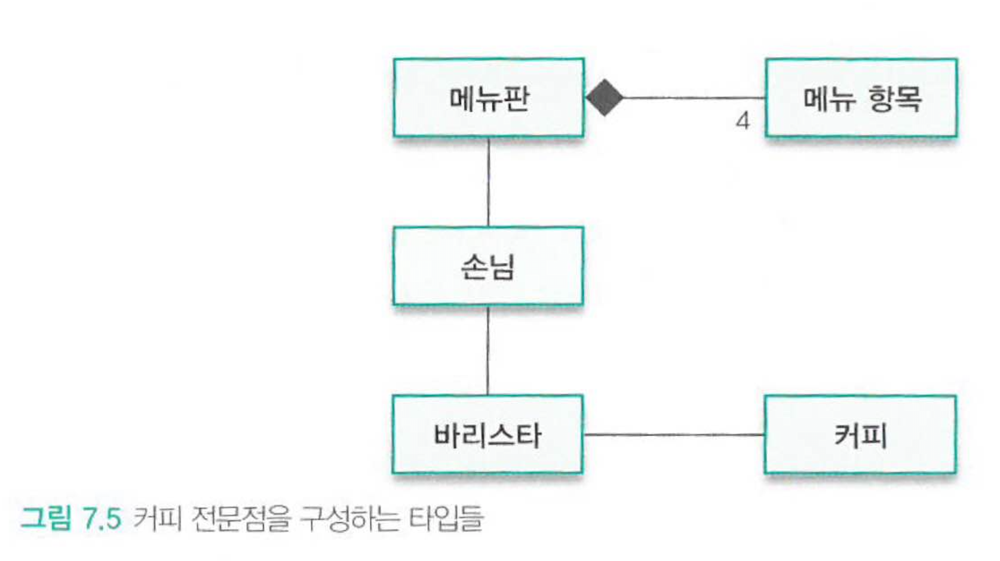
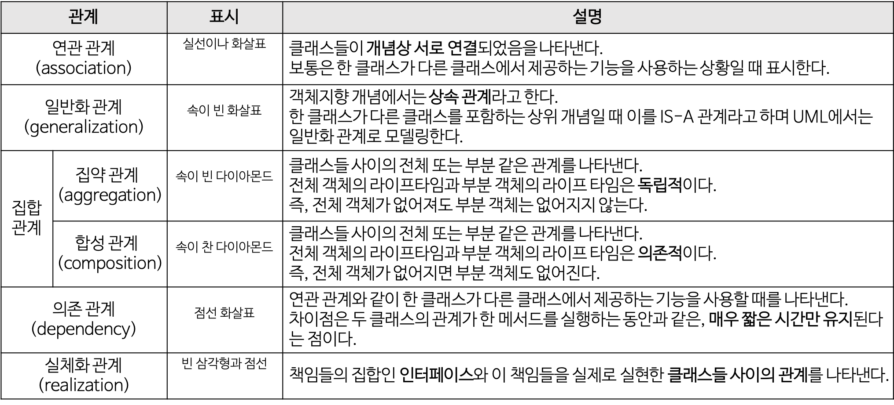
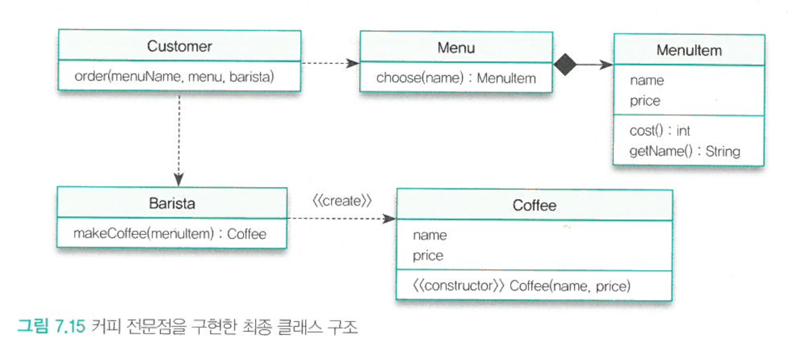

[객체지향의 사실과 오해](http://www.yes24.com/Product/Goods/18249021)를 바탕으로 정리한 자료입니다.


# 목차

- [7장 함께 모으기](#7-함께-모으기)
  * [1 객체를 바라보는 3가지 관점](#1-객체를-바라보는-3가지-관점)
  * [2 커피 전문점 도메인](#2-커피-전문점-도메인)
    + [2-1 목적: 커피 주문](#2-1-목적-커피-주문)
    + [2-2 개념: 도메인 모델](#2-2-개념-도메인-모델)
      - [어떤 객체들이 있을까?](#어떤-객체들이-있을까)
      - [객체들 간의 관계는 어떤가?](#객체들-간의-관계는-어떤가)
    + [2-3 명세: 협력 찾기](#2-3-명세-협력-찾기)
      - [협력에 적절한 객체 선택](#협력에-적절한-객체-선택)
      - [인터페이스 정리하기](#인터페이스-정리하기)
    + [2-4 구현: 구현하기](#2-4-구현-구현하기)
      - [Customer](#customer)
      - [Menu](#menu)
      - [Barista](#barista)
      - [Coffee](#coffee)
      - [MenuItem](#menuitem)
    + [2-5 꼭 알고 넘어가야할 핵심](#2-5-꼭-알고-넘어가야할-핵심)
  * [3 코드와 세 가지 관점](#3-코드와-세-가지-관점)
    + [3-1 코드는 세 가지 관점을 모두 제공해야 한다.](#3-1-코드는-세-가지-관점을-모두-제공해야-한다)
    + [3-2 인터페이스와 구현을 분리하라](#3-2-인터페이스와-구현을-분리하라)


# 7장 함께 모으기

이번 장에서는 예제를 통해서 객체 설계의 전반적인 내용을 다룬다.


## 1 객체를 바라보는 3가지 관점

🙋‍♂️  마틴 파울러는 **하나의 객체안에 세 가지 관심을 모두 포함**해야 한다고 주장한다.

* 개념 관점
  * 도메인 모델 - 도메인 안에 존재하는 개념과 개념들 사이의 관계를 표현
  * 핵심은 **사용자가 도메인을 바라보는 관점**을 최대한 **반영**해야 한다는 것이다.
* 명세 관점
  * 객체들의 책임에 초점 - 인터페이스
  * 핵심은 **객체가 협력을 위해 "무엇"을 할 수 있는가**이다.
  * 인터페이스와 구현을 분리하자.
* 구현 관점
  * 실제 작업을 수행하는 코드를 구현
  * 핵심은 **객체들이 책임을 수행하는 데 필요한 코드**를 작성하는 것이다.
  * **객체의 책임을 "어떻게" 수행**할 것인가에 초점


> 꼭 순서대로 개발할 필요는 없다. 그저 클래스를 세 가지의 다른 방향에서 바라보는 것을 의미한다.
>
> * 클래스가 은유하는 개념 = 도메인 관점
> * 클래스의 공용 인터페이스 = 명세 관점
> * 클래스의 속성과 메서드 = 구현 관점 


## 2 커피 전문점 도메인

🙋‍♂️ "커피 주문"이라는 예시를 통해 객체지향 설계를 "맛"보자.

* 목적 - 요구 사항 정리
* 개념 - 도메인 모델
* 명세 - 협력 찾기
* 구현 - 구현하기


### 2-1 목적: 커피 주문

🙋‍♂️ 모든 소프트웨어에는 **목적**이 있어야한다. **목적을 통해 요구 사항을 정리**해보자. (**유스케이스**)

* 커피는 4가지 판매한다.
  * 아메리카노, 카푸치노, 카라멜 마키아또, 에스프레소
* 손님이 메뉴 결정을 도울 메뉴판이 있다.
* 손님은 테이블에 앉아 메뉴판을 잠시 보고 커피를 주문한다.
* 주문 받은 커피를 제조하는 것은 바리스타의 몫이다.


> 이렇게 요구사항을 정리해놓으면 소프트웨어의 목적이 명확해진다.
>
> 또한, 목적이란 사용자의 관점에서 시스템을 바라보는 관점도 있기 때문에 도메인 모델을 작성하는데 도움을 주는 것 같다.


### 2-2 개념: 도메인 모델

> 객체지향은 객체들로 구성된 작은 세상이다.


#### 어떤 객체들이 있을까?

🙋‍♂️ 작은 세상을 만들어보자. 커피 전문점을 구성하는 요소들


* 메뉴판
  * 커피 전문점 안에는 메뉴판이 존재한다.
* 메뉴 항목
  * 메뉴판안에 4가지의 메뉴 항목이 존재한다.
* 손님
  * 손님은 메뉴판을 보고 바리스타에게 원하는 커피를 주문한다.
* 바리스타
  * 바리스타는 주문을 받은 메뉴에 따라 적절한 커피를 제조한다.
* 커피
  * 바리스타가 제조할 수 있는 커피는 4가지이다.
  * 커피도 자신만의 경계를 가지므로 객체로 볼 수 있다.


> 객체들이 어떠한 속성과 행동을 가진지는 전혀 신경쓰지 않는다.


#### 객체들 간의 관계는 어떤가?

> 실제로는 각 객체들간의 관계가 있냐 없으냐가 중요하지 설계단계부터 정확히 무슨 관계인지를 알기 힘들다.
>
> 그래서 **저자는 관계만을 맺고 나중에 구현하면서 정확한 관계를 명시하는게 좋다고 한다.**

🙋‍♂️ 커피 전문점 세계의 구성요소는 알았는데 그들 사이의 관계는?

* 순서
  * 행동
  * 타입 결정 - 동일 행동을 하는 객체들은 동일한 타입(분류)
    * 아메리카노, 에스프레소, ... 등은 모두 커피 타입의 인스턴스이다.
  * 인스턴스간의 관계
* 중요한 것은 **행동을 기반으로 관계를 맺어주는 것**이다. 상태는 전혀 신경쓰지 않는다.



* 손님 - 메뉴판 (연관관계)
  * 손님은 메뉴판을 통해서 주문을 하므로 메뉴판을 알아야 하므로 둘이 관계가 존재한다.
* 손님 - 바리스타 (연관관계)
  * 손님은 바리스타에게 주문을 해야 하므로 둘 사이에 관계가 존재한다.
* 메뉴판 - 메뉴 항목 (포함관계)
  * 메뉴판은 다수의 메뉴 항목 객체로 구성되어 있다. 메뉴판이 없으면 메뉴 항목도 존재하지 않는다.
* 바리스타 - 커피 (연관관계)
  * 바리스타 타입은 커피를 제조해야 하므로 커피 타입을 알고 있어야 한다.


> 
>
> <center>출처 : https://gmlwjd9405.github.io/2018/07/04/class-diagram.html</center>
>
> * 연관 관계 (Association) : 클래스 A가 클래스 B를 멤버 변수로 가지고 있고, 사용하는 경우
>   * 
>   * 단방향 연관 관계(화살표) : 한 쪽은 알지만 다른 쪽은 상대방의 존재를 모른다. (사람과 핸드폰)
>   * 양방향 연관 관계(실선) : 두 클래스의 객체가 서로 인지한다. (상담의사와 환자)
> * 일반화 관계 : 상속관계 (is a kind of)
>   * 
> * 집합 관계
>   * 집약 관계(Aggregation) : 전체와 부분의 관계. 멤버변수를 가지고 있고, 직접 new를 하지 않는 관계. 전체 객체가 메모리에서 사라진다 해도 부분 객체는 사라지지 않는다. (집 vs 냉장고)
>   * 
>   * 집합 관계(Composition) : 전체와 부분의 관계. 멤버변수를 가지고 있고, 직접 new를 하는 관계. 전체 객체가 사라지면 부분 객체도 없어진다. (사람 vs 심장)
>   * 


### 2-3 명세: 협력 찾기


#### 협력에 적절한 객체 선택

🙋‍♂️ 협력을 찾을때는 **메시지를 기반으로 객체를 선택해야 한다.** 즉 **메시지를 먼저 선택하고 그 후에 메시지를 수신하기에 적절한 객체를 선택해야 한다는 의미**


* "커피를 주문하라"라는 메시지
  * 주문할 책임 : `손님`
* "메뉴 항목을 찾아라"
  * 메뉴 항목을 찾는 책임 : `메뉴판`
  * 메시지에 "메뉴 이름"이라는 인자를 포함해 함께 전송한다. (메뉴 항목이 메뉴판에 일부이기때문)
* "커피를 제조하라"
  * 커피를 제조해야 하는 책임 : `바리스타`
* "생성하라"
  * 바리스타는 커피를 만드는데 필요한 정보와 기술을 함께 가지고 있다. (자율적인 존재) : `커피` (생성자)


> * **현실**
>   * 메뉴판은 **스스로 메뉴 항목을 찾지 않는다.** 손님의 의해 펼쳐지거나 닫혀지는 **수동적인 존재**다.
> * **객체 세계**
>   * 메뉴판은 마치 생명을 가진 존재처럼 **자기 스스로 메뉴 항목을 찾는다.** **모든 객체는 능동적이고 자율적인 존재다.**


#### 인터페이스 정리하기

🙋‍♂️ **각 객체들이 가져야 하는 책임(행동의 모음)을 정리하자.**

* 협력을 통해 식별된 타입의 실행은 외부에서 접근 가능한 공용 인터페이스이다.
* 각 객체가 외부에 공개해야하는 메서드를 정리한다고 생각하면 된다.


```java
class Customer{
  public void order(String menuName){}
}

class MenuItem{
  
}

class Menu {
  public MenuItem choose(String name){}
}

class Barista{
  public Coffee makeCoffee(MenuItem menuItem){}
}

class Coffee{
  public Coffe(MenuItem menuItem){}
}
```


> **이제 책임(행동의 모음)을 결정하였으니, 이를 바탕으로 구현을 통해 상태와 메서드를 구현한다.**


### 2-4 구현: 구현하기

🙋‍♂️ 도메인 모델과 명세를 참조하여 각 클래스의 멤버와 메서드를 구현해준다.




#### Customer

```java
// 추상화 (인터페이스)
public interface ICustomer{
  public void order(String menuName, Menu menu, Barista barista);
}

// 객체
class Customer implements ICustomer{
  public void order(String menuName, Menu menu, Barista barista){
    MenuItem menuItem = menu.choose(menuName);
    Coffee coffe = barista.makeCoffee(menuItem);
    ...
  }
}
```

* `Customer`가 `Menu`와 `Barista`에 메시지를 보내기 위해서는 두 객체의 참조가 필요하다.
  * 참조는 얻는 방법은 여러가지 이다.
    * 매개변수
    * 객체 생성 (new)
    * 의존성 주입 (DI)
  * 여기서는 간단하게 매개변수를 통해 참조 값을 전달 받았다.


> 중요한 것은 **구현 과정 중  `order`의 메서드 형태가 변경되었다는 것이다. (매개변수)**
>
> * 기존 명세에서는 : `public void order(String menuName)`
> * 구현 과정 중 변경 : `public void order(String menuName, Menu menu, Barista barista)`
>
> **`order`외에도 구현 중에는 언제든 여러 객체들의 메서드 구현의 형태가 달라질 수 있다.**


#### Menu

```java
class Menu { // 메뉴판
  private List<MenuItem> items;
  
  public Menu(List<MenuItem> items){
    this.items = items;
  }
  
  public MenuItem choose(String name){
    for(MenuItem each : items){
      if(each.getName().equals(name)){
        return each;
      }
    }
    return null;
  }
}
```

* `Menu`는 `menuName`에 해당하는 `MenuItem`을 찾아야하는 책임이 있다.
  * 도메인 모델 설계때 처럼 `Menu`가 내부적으로 `MenuItem`을 포함하게 해야한다.
  * 여기서는 생성자를 통해서 메뉴들의 모임은 `MenuItem`의 리스트를 받는다. (의존성 주입)


> 중요한 것은 `List`를 사용해서 `MenuItem`의 목록을 포함시킨 결정이 구현의 과정에서 정해졌다는 것이다.
>
> 즉, **행동을 정하고 구현을 하는 과정중에서 상태를 결정한 것이다.**


#### Barista

```java
public interface IBarista{
  public Coffee makeCoffee(menuItem menuItem);
}

public class Barista implements IBarista {
  public Coffee makeCoffee(menuItem menuItem){
    Coffee coffee = new Coffee(menuItem);
    return coffee;
  }
}
```

* `Barista`는 매개변수로 받는 `menuItem`로 `Coffee`를 만들어 반환한다.


#### Coffee

```java
class Coffee {
  private String name;
  private int price;
  
  public Coffee(MenuItem menuItem){
    this.name = menuItem.getName();
    this.price = menuItem.cost();
  }
}
```

* `Coffee`는 자기 자신을 생성하기 위해 생성자를 제공한다.
  * `Coffee`를 생성한다는 책임을 생성자를 통해서 구현.
  * 즉, **생성자도 메시지에 반응하는 하나의 책임이라고 볼 수 있다.**


> **어떤 객체를 생성한다는 책임은 생성자를 통해서 구현할 수 있다.**
>
> * **객체는 모두 자율적이다. 바리스타가 메시지를 통해 요청만 할 뿐 커피를 만드는 주체는 커피다.**
> * 즉, 생성자도 하나의 책임이다.


#### MenuItem

```java
public class MenuItem {
  String name;
  int price;
  
  public MenuItem(String name, int price){
    this.name = name;
    this.pricae = price;
  }
  
  public int cost(){
    return price;
  }
  
  public String getName() {
    return this.name;
  }
}
```

```java
// 만약 인터페이스로 정의한다면
public interface IMenuItem {
  public MenuItem(String name, int price);
  public int cost();
  public String getName();
}
```

* `MenuItem`은 `getName()`과 `cost()` 메시지에 응답할 수 있도록 메서드를 구현해야 한다.
  * 바리스타에게 어떠한 커피를 만들어야할지 요청을 보내기 위함.


> 저자는 인터페이스를 통해 실제 상호작용을 해보지 않으면 인터페이스의 모습을 정확하게 예측하기 힘들다고 한다.
>
> 즉, 가능한 빨리 설계를 끝마치고 구현에 돌입해야한다는 것이다. 그리고 구현을 통해 설계를 조금씩 변경해나가면 된다.


### 2-5 꼭 알고 넘어가야할 핵심

🙋‍♂️ 중요한 세 가지

* 메시지가 객체를 결정한다
* 책임을 따라 설계가 이뤄지는 과정
* 인터페이스와 구현의 분리


## 3 코드와 세 가지 관점


### 3-1 코드는 세 가지 관점을 모두 제공해야 한다

* 개념 관점
  * **사용자가 생각하는 도메인과 소프트웨어의 도메인 모델의 간격을 좁혀야 한다.**
  * 소프트웨어 클래스와 도메인 클래스 사이의 간격이 좁으면 좁을 수록 변경이 수월하다.
  * 예 )
    * 커피를 제조하는 사람은 바리스타. 현실 세계와 동일하게 커피 제조 방법은 바꾼다면 바리스타의 코드만 변경해주면 된다.
* 명세 관점
  * 인터페이스(책임)은 외부의 객체가 해당 객체에 접근할 수 있는 유일한 부분. 인터페이스를 수정하면 해당 객체와 협력하는 모든 객체에게 영향을 미친다.
  * 그러므로 객체의 인터페이스는 가능한 수정하지 않도록 내부의 세부사항을 잘 숨겨야 한다.
  * 또한, 명세 관점에서는 클래스의 상태와 메서드를 신경쓰지 않는다.
* 구현 관점
  * 클래스의 메서드와 상태를 구현하는 것이지, **공용 인터페이스(책임)을 변경하는 것이 아니다. 즉, 구현 관점에서 외부의 객체에게 영향을 끼쳐서는 안된다.** (내부의 동작만 구현)
  * 외부의 클래스는 자신이 협력하는 다른 클래스의 비밀 때문에 우왕좌왕해서는 안된다.


> 모든 클래스는 위와 같이 3 가지의 관점을 가지고 있어야 좋은 객체 설계라고 볼 수 있다.


### 3-2 인터페이스와 구현을 분리하라

> 다시 한번 강조한다. 인터페이스와 구현을 분리하라
>
> * 인터페이스 : 외부에서 바라보는 나의 책임
> * 구현 : 책임을 수행하는 과정

🙋‍♂️ **마틴 파울러는 명세 관점과 구현 관점을 분리하는 것이 매우 중요하다고 한다.** 

* 명세 관점이 설계를 주도하도록 해야하며, 구현 관점이 명세 관점에 영향을 끼쳐서는 안된다.
  * 명세 관점 : 인터페이스를 통해 책임을 결정
  * 구현 관점 : 정해진 인터페이스의 동작을 구현