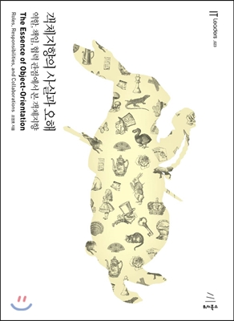

# 객체지향의 사실과 오해 정리

* [1장. 협력하는 객체들의 공동체](https://github.com/binghe819/TIL/blob/master/OOP/%EA%B0%9D%EC%B2%B4%EC%A7%80%ED%96%A5%EC%9D%98%20%EC%82%AC%EC%8B%A4%EA%B3%BC%20%EC%98%A4%ED%95%B4/1%EC%9E%A5.%20%ED%98%91%EB%A0%A5%ED%95%98%EB%8A%94%20%EA%B0%9D%EC%B2%B4%EB%93%A4%EC%9D%98%20%EA%B3%B5%EB%8F%99%EC%B2%B4.md)
* [2장. 이상한 나라의 객체](https://github.com/binghe819/TIL/blob/master/OOP/%EA%B0%9D%EC%B2%B4%EC%A7%80%ED%96%A5%EC%9D%98%20%EC%82%AC%EC%8B%A4%EA%B3%BC%20%EC%98%A4%ED%95%B4/2%EC%9E%A5.%20%EC%9D%B4%EC%83%81%ED%95%9C%20%EB%82%98%EB%9D%BC%EC%9D%98%20%EA%B0%9D%EC%B2%B4.md)
* [3장. 타입과 추상화](https://github.com/binghe819/TIL/blob/master/OOP/%EA%B0%9D%EC%B2%B4%EC%A7%80%ED%96%A5%EC%9D%98%20%EC%82%AC%EC%8B%A4%EA%B3%BC%20%EC%98%A4%ED%95%B4/3%E1%84%8C%E1%85%A1%E1%86%BC.%20%E1%84%90%E1%85%A1%E1%84%8B%E1%85%B5%E1%86%B8%E1%84%80%E1%85%AA%20%E1%84%8E%E1%85%AE%E1%84%89%E1%85%A1%E1%86%BC%E1%84%92%E1%85%AA.md)

