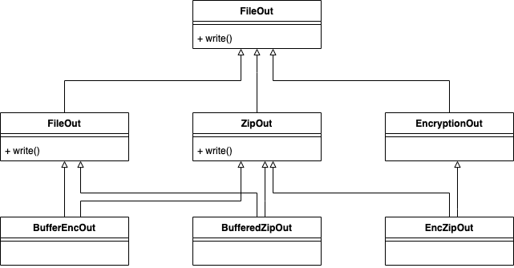
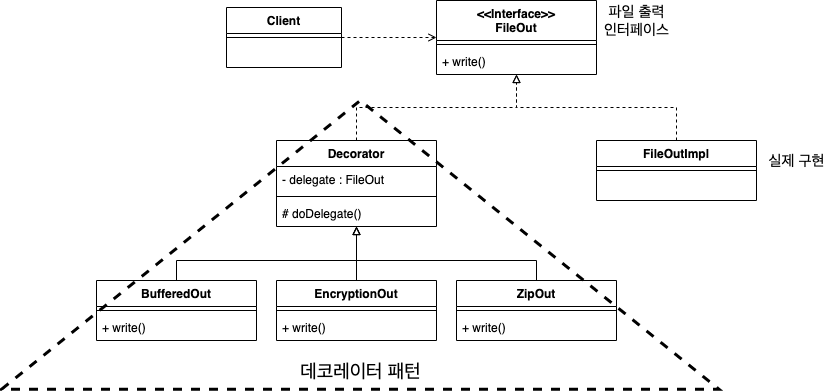
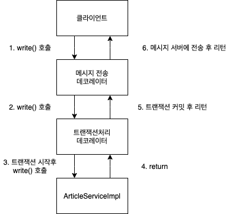

# 목차

<br>

- [목차](#목차)
- [데코레이터 패턴](#데코레이터-패턴)
  - [1 데코레이터 패턴을 사용하지 않을 이유](#1-데코레이터-패턴을-사용하지-않을-이유)
  - [2 데코레이터 패턴이란?](#2-데코레이터-패턴이란)
  - [3 데코레이터의 장점](#3-데코레이터의-장점)
  - [4 데코레이터의 단점](#4-데코레이터의-단점)
  - [5 데코레이터 패턴을 적용할 때 고려할 점](#5-데코레이터-패턴을-적용할-때-고려할-점)
    - [5-1 기능 개수](#5-1-기능-개수)
    - [5-2 비정상적으로 동작할 경우 대처](#5-2-비정상적으로-동작할-경우-대처)
- [참고](#참고)

<br>

# 데코레이터 패턴

<br>

## 1 데코레이터 패턴을 사용하지 않을 이유
* 상속의 단점
  * 상속은 기능을 확장하는 방법을 제공한다. 게다가 쉽게 확장 가능하다.
  * **하지만 다양한 조합의 기능 확장이 요구될 때 클래스가 불필요하게 증가하는 문제가 발생한다.**

<br>

**예시**
<p align="center"> </p>

* 버퍼 기능과 압축 기능을 함께 제공해야 한다거나, 압축한 뒤 암호화 기능을 제공해야 한다거나, 또는 버퍼 기능과 암호화 기능을 함께 제공해야 한다면, **위와 같이 클래스가 증가하고 계층구조가 복잡해진다.**

<br>

**이런 경우 데코레이터 패턴을 사용하면 문제 해결이 가능하다**

<br>

## 2 데코레이터 패턴이란?
> decorator: 장식, 도배업자
* **데코레이터 패턴은 상속이 아닌 위임을 하는 방식으로 기능을 확장해 나간다.**

<br>

**예시**
<p align="center"></p>

```java
// 데코레이터를 위한 기반 클래스인 Decorator 구현
public abstract class Decorator implements FileOut {
    private FilaOut delegate; // 위임 대상

    public Decorator(FileOut delegate) {
        this.delegate = delegate;
    }

    protected void doDelegate(byte[] data) {
        delegate.write(data); // delegate에 쓰기 위임
    }
}
```
```java
// EncryptionOut 구현
public class EncryptionOut extends Decorator {
    public EncryptionOut(FileOut delegate) {
        super(delegate);
    }

    public void write(Byte[] data) {
        byte[] encryptedData = encrypt(data); // 핵심 로직
        super.doDelegate(encrpytedData);      // 부가 로직 (Decorator)
    }

    ...
}
```
* 중요한 점은 기능 확장을 위해 FileOutImpl`를 상속받지 않고 `Decorator` (추상 클래스)를 만들었다는 것이다.
* **`Decorator`는 모든 데코레이터를 위한 기반 기능을 제공하는 추상클래스다.**
  * **이 클래스의 `doDelegate()`메서드는 생성자를 통해서 전달받은 `FileOut` 객체에 쓰기 기능을 위임한다.**

```java
// 사용 - 핵심 로직을 구현하고 있는 객체에 부가 로직을 주입해준다.
FileOut delegate = new FileOutImpl();
FileOut fileOut = new EncryptionOut(delegate);
fileOut.write(data);
```
* **기존 기능에 새로운 기능을 추가해 준다는 의미에서 `EncryptionOut` 객체를 데코레이터라고 부른다.**

<br>

> `상속보단 조합`과 비슷한 듯하다.

<br>

**예시**
```java
public interface IService {
  public abstract String runSomething();
}

public class Service implements IService {
  public String runSomething() {
    return "서비스 짱!!!";
  }
}

public class Decorator implements IService {
  IService service;
  
  public String runSomething() {
    System.out.println("호출에 대한 장식 주목적, 클라이언트에게 반환 결과에 장식을 더하여 전달");
    service = new Service();
    return "정말" + service.runSomething();
  }
}

public class ClientWithDecolator {
  public static void main(String[] args) {
    IService decorator = new Decorator();
    System.out.println(decorator.runSomething()); // 정말 서비스 짱!!!
  }
}
```
* 장식자(Decolator)는 실제 서비스와 같은 이름의 메서드를 구현한다. 이때 인터페이스를 사용한다.
* 장식자는 실제 서비스에 대한 참조 변수를 갖는다. (합성)
* 장식자는 실제 서비스의 같은 이름을 가진 메서드를 호출하고, 그 반환값에 장식을 더해 클라이언트에게 돌려준다.
* 장식자는 실제 서비스의 메서드 호출 전후에 별도의 로직을 수행할 수도 있다.

<br>

## 3 데코레이터의 장점
**조합**
```java
FileOut delegate = new FileOutImpl();

// 버퍼 -> 암호화 -> 압축 -> 파일쓰기
FileOut fileOut = new BufferedOut(new EncryptionOut(new ZipOut(delegate)));

// 암호화 -> 압축 -> 버퍼 -> 파일 쓰기
FileOut fileOut = new EncryptionOut(new ZipOut(new BufferedOut(delegate)));
```
* **기능 적용 순서를 이용해서 다양한 조합을 만들 수 있다.**
  * 데코레이터의 생성 순서를 변경해 주기만 하면 된다.
* **각 확장 기능 및 원래 기능을 서로 영향 없이 변경할 수 있도록 만들어준다.**

> 다른 의미론 데코레이터 패턴은 단일 책임 원칙을 지킬 수 있도록 만들어준다.

<br>

## 4 데코레이터의 단점
**가독성**
* 사용자 입장에서 데코레이터 객체와 실제 구현 객체의 구분이 되지 않기 때문에 코드만으로는 기능이 어떻게 동작하는지 이해하기 어렵다.

<br>

## 5 데코레이터 패턴을 적용할 때 고려할 점

<br>

### 5-1 기능 개수
* 데코레이터 패턴을 구현할 때 고려할 점은 **데코레이터 대상이 되는 타입의 기능 개수다.**
  * **정의되어 있는 메서드가 증가하게 되면 그 만큼 데코레이터의 구현도 복잡해진다.**

<br>

### 5-2 비정상적으로 동작할 경우 대처
<p align="center"><br>데코레이터 메시지 흐름</p>

* 문제점 - **원자성**
  * 외부의 메시지 서버에 장애가 발생하면 6번 과정에 문제가 발생하게 된다.
  * 하지만, **1~5번의 과정은 정상적으로 처리되므로, DB에는 새로운 데이터가 정상적으로 추가된다.**
* 해결 방법 - 예외처리 대신 실패 로그를 남기고 사후 처리

<br>

# 참고
* [개발자가 반드시 정복해야 할 객체 지향과 디자인 패턴](http://www.yes24.com/Cooperate/Naver/welcomeNaver.aspx?pageNo=1&goodsNo=9179120)
