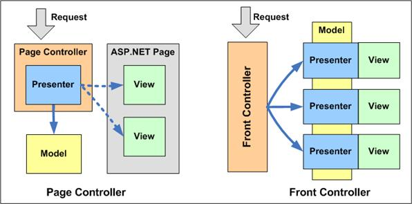

# 목차

- [Front Controller Pattern](#front-controller-pattern)
  * [1 Front Controller Pattern 개념](#1-front-controller-pattern-개념)
    + [1-1 Page Controller](#1-1-page-controller)
    + [1-2 Front Controller](#1-2-front-controller)
    + [1-3 Front Controller의 장점](#1-3-front-controller의-장점)
    + [1-4 Spring에서의 Front Controller](#1-4-spring에서의-front-controller)
  * [2 Front Controller Pattern 예시](#2-front-controller-pattern-예시)
    + [2-1 Front Controller Pattern 역할](#2-1-front-controller-pattern-역할)
    + [2-2 간단한 예시](#2-2-간단한-예시)
- [참고](#참고)


# Front Controller Pattern

서블릿에서 MVC 패턴은 `Page Controller` 를 기반으로 동작한다. 즉 **한 개의 URL당 하나의 서블릿을 생성해줘야한다.**

하지만 웹 애플리케이션은 많은 뷰와 컨트롤러가 존재해서 각가의 뷰와 컨트롤러가 연결되어 독립적으로 실행되면, 웹 애플리케이션 실행에 대하여 일괄적으로 처리하기 어렵다.

이럴 때 사용하는 것이 **대표 컨트롤러 (`Front Controller`)** 이다. `Front Contoller` 는 뷰에서 들어오는 모든 요청을 담당하여 웹 애플리케이션을 실행하는 모든 요청을 일괄적으로 처리한다.

**스프링에서도 `DispatcherServlet` 을 대표 컨트롤러로 적극 활용한다.**


## 1 Front Controller Pattern 개념

`Page Controller` 와 `Front Controller Pattern` 을 살펴보며 개념을 정리하였다.


<center></center>

<center> 출처 : https://www.developerfusion.com/article/9450/controller-patterns-for-aspnet/ </center>


### 1-1 Page Controller

* An object that handles a request for a specific page or action on a Web site.
* 특정 뷰에서 요청이 들어왔을 때 요청을 받아 처리하는 특정 컨트롤러
  * 하나의 URL당 하나의 컨트롤러(서블릿)를 할당. 


### 1-2 Front Controller 

* A controller that handles all requests for a web site.
* ***In a complex Web site there are many similar things you need to do when handling a request. These things include security, internationalization, and providing particular views for centain users.*** If the input controller behavior is scattered across multiple objects, much of this behavior can end up duplicated(중복). Also, it's difficult to change behavior at runtime.
* ***The Front Controller consolidates(통합하다) all request handling by channeling(채널, 흐르다) requests through a single handler object.*** This object can carry out common behavior, which can be modified at runtime with decorators. ***The handler then dispatches to command objects for behavior particular to a request.***

* 모든 요청을 처리해주는 하나의 컨트롤러를 두는 패턴


### 1-3 Front Controller의 장점

* 모든 요청을 하나의 컨트롤러를 통해 작업을 한 곳에서 수행할 수 있다.
* 추적, 보안을 적용할 때 하나의 컨트롤러에 하기 때문에 편리하다.
* 파일 구조가 바뀌어도 URL을 유지할 수 있다.


### 1-4 Spring에서의 Front Controller

* 스프링은 `DispatcherServlet` 이라는 `Front Controller` 를 스프링 IoC 컨테이너의 Bean으로 등록하여 `Controller Package` 들을 스캔하여 `Controller (Page Controller)` 를 등록하여 사용한다.
  * 즉, **하나의 컨트롤러 클래스 안의 여러 개의 `Page Controller` 를 처리한다.**


## 2 Front Controller Pattern 예시


### 2-1 Front Controller Pattern 역할

<center></center>

<center></center>

<center> 출처 : http://www.corej2eepatterns.com/FrontController.htm </center>

* Front Controller - 모든 요청을 핸들링.
  * **로깅 처리, 보안 처리 등의 모든 핸들링이 공통적으로 처리해야하는 로직을 담당.**
* Dispatcher - Front Controller로 부터 받는 요청에 따라 특정한 객체에게 요청을 배치.
  * **특정 핸들러에게 요청을 배치**
* View - 요청이 수행되는 객체(서블릿).


### 2-2 간단한 예시


```java
// Views
public class IndexView{
    public void show(){
        System.out.println("Show IndexView");
    }
}

public class LoginView{
    public void show(){
        System.out.println("Show LoginView");
    }
}
```

```java
// Dispatcher
public class Dispatcher {

    IndexView indexView;
    LoginView loginView;

    public Dispatcher() {
        indexView = new IndexView();
        loginView = new LoginView();
    }

    public void dispatch(String request){
        if(request.equals("IndexView")){
            indexView.show();
        } else {
            loginView.show();
        }
    }
}
```

```java
// Front Controller
public class FrontController {

    private Dispatcher dispatcher;

    public FrontController() {
        dispatcher = new Dispatcher();
    }

    private boolean isAuthentic(){
        // 보안 관련 로직
        System.out.println("인증된 유저");
        return true;
    }

    private void logging(String request){
        System.out.println("요청 로깅 완료 : " + request);
    }

    public void dispatchRequest(String request){
        // 요청 로깅
        logging(request);

        // 보안
        if(isAuthentic()){
            dispatcher.dispatch(request);
        }
    }
}
```

```java
// Client
public class Client {

    public static void main(String[] args) {
        FrontController controller = new FrontController();
        controller.dispatchRequest("IndexView");
        controller.dispatchRequest("LoginView");
    }
}
```


# 참고

* https://www.developerfusion.com/article/9450/controller-patterns-for-aspnet/
* https://www.tutorialspoint.com/design_pattern/front_controller_pattern.htm
* http://www.corej2eepatterns.com/FrontController.htm
* https://www.opentutorials.org/module/3569/21219
* https://nesoy.github.io/articles/2017-02/Front-Controller