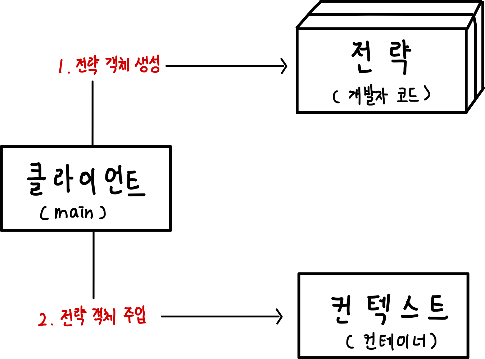
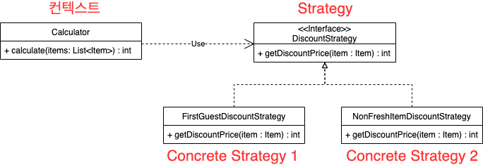
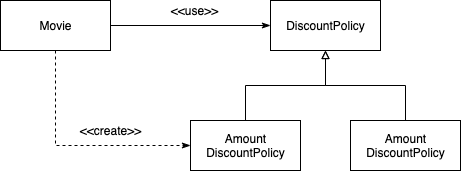
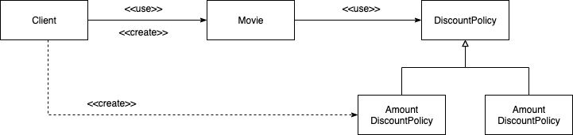

# 목차

- [목차](#목차)
- [전략 패턴](#전략-패턴)
  - [1 전략 패턴 개념](#1-전략-패턴-개념)
    - [1-1 전략 패턴이란?](#1-1-전략-패턴이란)
    - [1-2 전략 패턴 특징](#1-2-전략-패턴-특징)
  - [2 예시](#2-예시)
    - [2-1 요금 계산기](#2-1-요금-계산기)
    - [2-2 영화 요금제](#2-2-영화-요금제)
- [참고](#참고)

<br>

# 전략 패턴

<br>

## 1 전략 패턴 개념

<br>

### 1-1 전략 패턴이란?
<p align="center"></p>

* **클라이언트가 전략을 생성해 전략을 실행할 컨텍스트에 주입하는 패턴**
* 공통적인 부분은 문맥이 바뀌더라도 변하지 않아야 한다 -> 핵심 로직과 부가 로직을 분리 -> 전략(핵심 로직)을 컨텍스트 (부가 로직)에 주입한다.
  * 핵심 로직: 전략
  * 부가 로직: 컨텍스트
* 꼭 알아야하는 세 요소
  * 전략 메서드를 가진 전략 객체
  * 전략 객체를 사용하는 컨텍스트(전략 객체의 사용자/소비자)
  * 전략 객체를 생성해 컨텍스트에 주입하는 클라이언트(제3자, 전략 객체의 공급자)
* `OCP + 생성자를 통합 의존성 주입`이 좋은 예시이다.

<br>

### 1-2 전략 패턴 특징
* 컨텍스트 코드의 변경 없이 새로운 전략을 추가할 수 있다.
* 컨텍스트는 사용할 전략을 직접 생성하지 않는다. 대신, 클라이언트가 전략을 생성하여 컨텍스트에 주입해준다.
* **컴파일 타임때 `if-else`를 이용하지 않고, 런타임때 객체를 주입해서 특정 작업을 한다.**

<br>

## 2 예시

<br>

### 2-1 요금 계산기
**전략 패턴 사용전**
```java
public class Calculator {

    public int calculate(boolean firstGuest, List<Item> items) {
        int sum = 0;
        for (Item item : items) {
            if (firstGuest)
                sum += (int) (item.getPrice() * 0.9); // 첫 손님 10% 할인
            else if (! item.isFresh())
                sum += (int) (item.getPrice() * 0.8); // 덜 신선한 것 20% 할인
            else
                sum += item.getPrice();
        }
        return sum;
    }
}
```
* 서로 다른 계산 정책들이 한 코드에 섞여 있어, 정책을 추가, 수정될수록 점점 어려워진다.

<br>

**전략 패턴 사용후**
```java
// 전략 명세
public interface DiscountStrategy {

    int getDiscountPrice(Item item);
}

// 컨텍스트
public class Calculator {

    private DiscountStrategy discountStrategy; // 전략

    // 생성자를 통한 전략 주입
    public Calculator(DiscountStrategy discountStrategy) {
        this.discountStrategy = discountStrategy;
    }

    public int calcuclate(List<Item> items) {
        // 컨텍스트 (부가 로직)
        int sum = 0;
        for (Item item : items) {
            sum += discountStrategy.getDiscountPrice(item); // 전략 사용 (핵심 로직)
        }
        return sum;
    }
}
```
* 이제 컨텍스트의 변경 없이 새로운 전략을 추가할 수 있다.

<p align="center"> </p>

<br>

### 2-2 영화 요금제
전략 패턴을 사용할 때 주의할 점이 `생성과 사용을 분리하라`이다.

생성과 사용을 분리하지 않으면 전략 패턴을 십분 활용하지 못한다.

<br>

**생성과 사용을 분리하지 않은 예시**

<p align="center"> </p>

```java
public class Movie {
  private DiscountPolicy discountPolicy;
  
  public Movie(String title, Duration runningTime, Monie fee) {
    ...
    this.discountPolicy = new AmountDiscountPolicy(...); // 생성 책임
  }
  
  public Money calculateMovieFee(Screening screening) { 
    return fee.minus(discountPolicy.calculateDiscountAmount(screening)); // 사용 책임
  }
}
```
* 만약 새로운 요금 정책을 특정 영화에 추가/변경/삭제하고 싶다면 컴파일타임에 수정해줘야한다..

<br>

**생성과 사용을 분리한 예시**

<p align="center"> </p>

```java
public class Movie {
  private DiscountPolicy discountPolicy; // 전략
  
  public Movie(String title, Duration runningTime, Monie fee, DiscountPolicy discountPolicy) {
    ...
    this.discountPolicy = discountPolicy; // 주입
  }
  
  // 컨텍스트
  public Money calculateMovieFee(Screening screening) { 
    return fee.minus(discountPolicy.calculateDiscountAmount(screening));
  }
}
```
```java
public class Client { // 클라이언트
  public Money getAvatarFee() {
    // 생성책임
    Movie avatar = new Movie("아바타",
                            Duration.ofMinutes(120),
                            Money.wons(1000),
                            new PercentDiscountPolicy(...));
    
    return avatar.getFee();
  }
}
```

# 참고
* [개발자가 반드시 정복해야 할 객체 지향과 디자인 패턴](http://www.yes24.com/Cooperate/Naver/welcomeNaver.aspx?pageNo=1&goodsNo=9179120)
* [오브젝트](http://www.yes24.com/Cooperate/Naver/welcomeNaver.aspx?pageNo=1&goodsNo=9179120)
