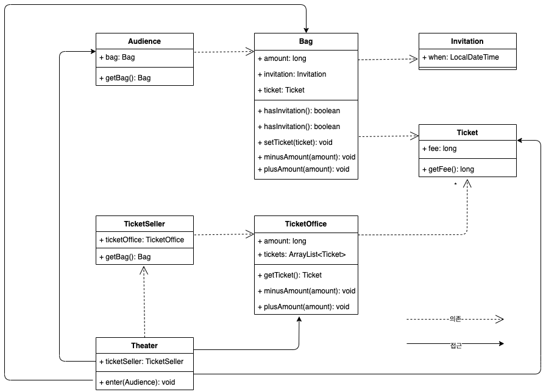
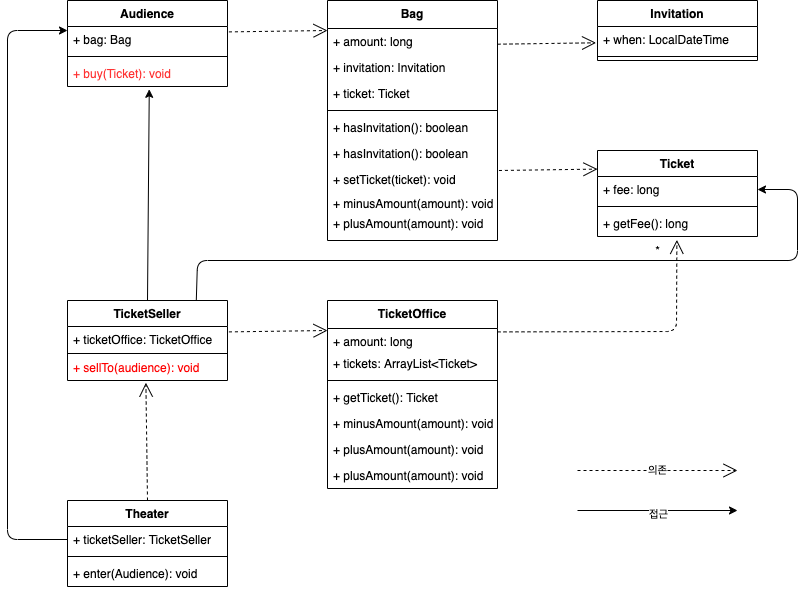
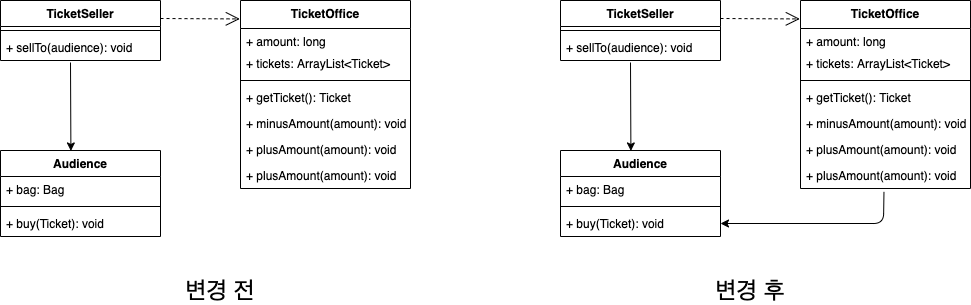

[오브젝트 - 코드로 이해하는 객체지향 설계](http://www.yes24.com/Product/Goods/74219491?OzSrank=1) 를 정리한 자료입니다.


# 목차

- [Chapter 01 객체, 설계](#chapter-01-객체-설계)
  * [이론이 먼저일까? 실무가 먼저일까?](#이론이-먼저일까-실무가-먼저일까)
  * [1 소프트웨어 모듈이 가져야 할 세 가지 기능](#1-소프트웨어-모듈이-가져야-할-세-가지-기능)
    + [1-1 문제의 티켓 판매 애플리케이션 구현하기](#1-1-문제의-티켓-판매-애플리케이션-구현하기)
      - [시나리오](#시나리오)
      - [문제점](#문제점)
    + [1-2 예상을 빗나가는 코드](#1-2-예상을-빗나가는-코드)
    + [1-3 변경에 취약한 코드](#1-3-변경에-취약한-코드)
  * [2 설계 개선하기](#2-설계-개선하기)
    + [2-1 자율성을 높이자](#2-1-자율성을-높이자)
    + [2-2 무엇이 개선됐는가](#2-2-무엇이-개선됐는가)
    + [2-3 어떻게 한 것인가?](#2-3-어떻게-한-것인가)
    + [2-4 캡슐화와 응집도](#2-4-캡슐화와-응집도)
      - [캡슐화](#캡슐화)
      - [응집도](#응집도)
    + [2-5 절차지향과 객체지향](#2-5-절차지향과-객체지향)
    + [2-6 책임의 이동](#2-6-책임의-이동)
  * [3 더 개선해보자](#3-더-개선해보자)
    + [3-1 더 자유롭게 해보자](#3-1-더-자유롭게-해보자)
    + [3-2 트레이드 오프](#3-2-트레이드-오프)
    + [3-3 의인화](#3-3-의인화)
  * [4 좋은 설계](#4-좋은-설계)


# Chapter 01 객체, 설계


## 이론이 먼저일까? 실무가 먼저일까?

🤔 정말 궁금한 주제이다. 이론이 먼저일까? 실무가 먼저일까?

* 당연히 이론이 먼저이고 실무가 그 다음에 발전되는 것으로 생각했는데.. 로버트 L. 글래스는 그 반대라고 주장한다.
  * 이론을 정립할 수 없는 초기에는 실무가 먼저 급속한 발전을 이룬다는 것이다.
  * 해당 분야가 충분히 성숙해진 후에야 이론이 실무를 추월하게 된다는 것.
* **요약하면 이론보다 실무가 먼저라는 것이다.**
  * **실무가 이론보다 앞서 있는 대표적인 분야가 바로 "설계"와 "유지보수"이다.**
  * 설계 분야에서 실무는 이론을 압도한다.
* **소프트웨어 설계와 유지보수에 중점을 두려면 이론이 아닌 실무에 초점을 맞추는 것이 효과적이다.**


## 1 소프트웨어 모듈이 가져야 할 세 가지 기능

💁‍♂️ 책에선 설계의 잘못된 예시를 통해 **로버트 마틴이 주장하는 소프트웨어 모듈이 가져야 하는 세 가지 기능**에 관해 설명한다.

1. **제대로 작동해야 한다.**
2. **간단한 작업만으로 변경이 가능해야 하며, 변경이 쉬워야 한다.**
3. **특별한 훈련 없이도 쉽게 이해할 수 있어야 한다.**
   * 이해가 가능한 코드란 동작이 우리의 예상에서 크게 벗어나지 않는 코드.

> 모든 모듈은 제대로 실행돼야 하고, 변경이 용이해야 하며, 이해하기 쉬워야 한다.


### 1-1 문제의 티켓 판매 애플리케이션 구현하기

> 잘못된 설계가 어떠한 결과를 낳는지 보자.

#### 시나리오

💁‍♂️ 극장에서 관람객을 입장시키는 시나리오이다.

* 극장은 관람객의 가방에 초대장이 있는지 확인한다.
  * 만약 초대장이 들어 있다면, 판매원에게서 받은 티켓을 관람객의 가방에 넣는다.
  * 만약 초대장이 없다면, 티켓을 판매한다.
    * 관람객의 가방에서 티켓의 금액을 차감하고, 매표소에 금액을 증가시킨다.
    * 그리고 티켓을 관람객의 가방에 넣어준다.



* **문제는 `Theater` 가 대부분의 객체에 접근이 가능하며 너무 의존적이라는 것.**


#### 문제점

1. 예상을 빗나가는 코드 - 수동적인 존재
2. 변경에 취약한 코드 - 의존성이 너무 강함


### 1-2 예상을 빗나가는 코드

객체는 모두 자율적인 객체이여야 하지만, 관람객과 판매원은 **수동적인 존재**이다.

* 관람객과 판매원이 소극장의 통제를 받는다.
  * 소극장이 마음대로 매표소의 티켓과 현금에 접근할 수 있다. (이해할 수 없는 사실)
* **이해가 가능한 코드란 동작이 우리의 예상에서 크게 벗어나지 않는 코드이다.**
* 하지만, **수동적인 존재가 우리의 예상을 벗어나고, 소극장의 `enter` 가 너무 많은 동작을 한다.**

```java
class Theater {
    private TicketSeller ticketSeller;

    public void enter(Audience audience){
        if(audience.getBag().hasInvitation()){
            Ticket ticket = ticketSeller.getTicketOffice().getTicket();
            audience.getBag().setTicket(ticket);
        } else {
            Ticket ticket = ticketSeller.getTicketOffice().getTicket();
            audience.getBag().minusAmount(ticket.getFee());
            ticketSeller.getTicketOffice().plusAmount(ticket.getFee());
            audience.getBag().setTicket(ticket);
        }
    }
}
```

* 만약 `Audience` 와 `TicketSeller` 의 코드가 변경된다면 `Theater` 도 같이 변경되야 한다. (의존)


### 1-3 변경에 취약한 코드

**변경에 취약하다는 것은 객체 사이의 의존성이 너무 과하다는 것이다.**

* 현재의 가정
  * 관람객이 현금과 초대장을 보관하기 위해 항상 가방을 들고 다닌다.
  * 매표소에서만 티켓을 판매한다.
  * 현금으로 결제한다.
* 현재의 가정이 변경에 취약한 이유
  * 만약 가방을 갖고 있지 않다면?
    * `Audience` 에서 `Bag` 을 제거한다면 `Audience.Bag` 에 접근하는 `Theater` 의 `enter` 도 변경되야 한다.
  * 관람객이 현금이 아닌 카드로 결제하려고 한다면?
  * 매표소 밖에서 티켓을 판매해야 한다면?

객체 사이의 관계가 **너무 의존적**이다.

즉 객체 사이의 결합도(`coupling`)가 너무 높다.

**우리의 설계의 목적은 객체 사이의 결합도를 낮추는 것이다.**


> 결합도란
>
> * 객체 사이의 의존성을 나타내는 지표.
> * 두 객체 사이가 너무 의존적일 때 결합도가 높다고 한다.
>   * 두 객체 사이의 결합도가 높으면 높을수록 함께 변경될 확률도 높아지기 때문에 변경하기 어려워진다.


## 2 설계 개선하기

티켓 판매 애플리케이션은 로버트 마틴의 세 가지 목적 중 제대로 동작하는 조건은 만족하지만 나머지 두 가지를 만족하지 못한다.

* 변경 - 변경에 취약하다.
  * 너무 의존적이다.
* 의사소통 - 이해하기 힘들다.
  * `Theater` 가 관람객의 가방과 판매원의 매표소에 직접 접근한다.

> 이 문제들의 해결방안은 모든 객체를 **자율적인 존재로** 만드는 것이다.

### 2-1 자율성을 높이자

 `Audience` 와 `TicketSeller` 는 자신이 가지고 있는 소지품을 스스로 관리하도록 변경하면 자율적인 객체가 된다.

* 자율적인 객체로 만들자. (**캡슐화**)
  * `Audience` 가 직접 `Bag` 을 관리한다.
    * **`Audience` 외에는 `Bag` 에 접근할 수 없다.**
  * `TicketSeller` 가 직접 `TicketOffice` 를 관리한다.
    * **`TicketSeller` 외에는 `TicketOffice` 에 접근할 수 없다.**

```java
// Theater은 TicketSeller에만 접근 가능하도록 변경
public class Theater {
  private TicketSeller ticketSeller;
  
  public void enter(Audience audience){
    // Theater은 ticketSeller에게 요청 메시지를 보낸다.
    ticketSeller.sellTo(audience);
  }
}

// TicketSeller는 TicketOffice를 캡슐화하여 자기만 접근 가능하도록 한다.
public class TicketSeller {
  private TicketOffice ticketOffice;
  
  public void sellTo(audience){
    // TicketSeller가 직접 Audience의 Bag에 접근하면 안된다.
    if (audience.getBag().hasInvitation()) {
			Ticket ticket = ticketOffice.getTicket();
			audience.getBag().setTicket(ticket);
		} else {
			Ticket ticket = ticketOffice.getTicket();
			audience.getBag().minusAmount(ticket.getFee());
			ticketOffice.plusAmount(ticket.getFee());
			audience.getBag().setTicket(ticket);
		}
  }
}
```

* `Theater` 의 `enter` 메서드에서 `ticketOffice` 에 접근하는 모든 코드를 `TicketSeller` 내부로 숨긴다.
  * 캡슐화를 위해 `getTicketOffice` 를 없앴다.
* 하지만, 이번엔 `TicketSeller` 가 `Audience` 의 `Bag` 에 직접 접근한다. 이를 변경해야 한다.

```java
public class Audience {
  private Bag bag;
  
  // getter를 없애서 아무도 bag에 접근하지 못하게 한다.
  
  public long buy(Ticket ticket) {
    if(bag.hasInvitation()){
      bag.setTicket(ticket);
      return 0L;
    } else {
      bag.setTicket(ticket);
      bag.minusAmount(ticket.getFee);
      return ticket.getFee();
    }
  }
}

public class TicketSeller {
  private TicketOffice ticketOffice;
  
  public void sellTo(Audience audience){
    ticketOffice.plusAmount(audience.buy(ticketOffice.getTicket()));
  }
}
```

* 이제 `Audience` 도 자기 자신만 `Bag` 을 관리할 수 있게 되었다.



* `Theater` 가 `Audience` 나 `TicketSeller` 의 내부에 직접 접근하지 않게 되었다.

> **여기서 중요한 점은 자율적인 객체로 변경됨과 동시에 여러 객체가 자신의 책임을 수행하고, 객체들 간의 요청 메시지를 통해 협력한다는 것이다.**


### 2-2 무엇이 개선됐는가

* 이해가 쉽다.
  * 수정된 `Audience`와 `TicketSeller`는 자신이 직접 관리해, 객체의 행동이 우리의 예상과 맞다.

* 변경에 유연하다.
  * 더 나아가서 `Audience`와 `TicketSeller` 내부가 변한다 하더라도 `Theater` 는 변경할 필요 없으므로 변경이 용이해진다.
    * `Audience` 가 가방이 아니라 지갑을 가지는 것으로 변경하려면 `Audience` 만 수정해주면 된다.
  * **즉, 세 객체 모두 의인화가 된 것.**


### 2-3 어떻게 한 것인가?

* 각각의 **객체가 자신의 책임**을 다하고 **객체들간의 협력은 요청 메시지를 통해서만 하도록 변경하였다**.

* 자율적인 객체 - 응집도를 높일 수 있다.
  * 객체의 모든 세부사항을 캡슐화
* 의존성을 최소화 - 결합도는 낮춘다.
  * 적절한 객체에 적절한 책임을 할당


### 2-4 캡슐화와 응집도

#### 캡슐화

* **핵심은 객체 내부의 상태를 캡슐화하고 객체 간에 오직 메시지를 통해서만 상호작용하도록 만드는 것이다.**
  * 자기 자신외에는 오직 외부에 노출되는 책임을 메시지를 통해서만 상호작용하도록 하였다.
  * **자기 자신외에는 자신의 물건(상태)에 접근하지 못한다. (캡슐화)**

#### 응집도

* **밀접하게 연관된 작업만을 수행**하고 **연관성 없는 작업은 다른 객체에게 위임**하는 객체를 가리켜 **응집도가 높다**고 한다.
  * **객체의 응집도를 높이려면 객체 스스로 자신의 데이터를 책임지게 해야한다.**
  * 즉, **자율적**이여야 한다.


### 2-5 절차지향과 객체지향

* 절차지향
  * 프로세스와 데이터를 별도의 모듈에 위치시키는 방식
    * 초기의 애플리케이션 설계가 바로 절차지향적인 설계이다.
    * `Theater` 의 `enter` 가 **프로세스**, `Audience`, `TicketSeller`, `Bag`, `TicketOffice` 가 **데이터.**
    * 모두 수동적인 존재이다.
  * **프로세스가 필요한 모든 데이터에 의존해야 한다는 근본적인 문제점 때문에 변경에 취약하다.**
* 객체 지향
  * 데이터와 프로세스가 동일한 모듈 내부에 위치하도록 프로그래밍하는 방식
    * `Theater` 는 오직 `TicketSeller` 에만 의존한다.

> **훌륭한 객체지향 설계의 핵심은 캡슐화를 이용해 의존성을 적절히 관리함으로써 객체 사이의 결합도는 낮추는 것이다.**


### 2-6 책임의 이동

* 초기의 애플리케이션 책임
  * 모두 책임이 `Theater` 에 집중되어있다.
* 개선한 애플리케이션의 책임
  * **`Theater` 에 몰려 있던 책임이 개별 객체로 이동됐다.**
  * 즉, 책임이 적절히 분배된다. 
  * **각 객체는 자신을 스스로 책임진다.**

> **객체지향 설계의 핵심은 적절한 객체에 적절한 책임을 할당하는 것이다.**


## 3 더 개선해보자

> 더 개선해보자면 `Bag` 와 `TicketOffice` 도 자율적인 객체로 만들 수 있다.


### 3-1 더 자유롭게 해보자

1. `TicketOffice` 의 자율권을 보장해줘보자.

```java
public class TicketOffice{
  // TicketOffice가 audience의 의존성이 필요해졌다.
  public void sellTicketTo(Audience audience){
    plusAmount(audience.buy(getTicket()));
  }
  
  // private을 통해 외부에서는 상태에 접근하지 못하게 캡슐화.
  private Ticket getTicket(){
    return tickets.remove(0);
  }
  
  private void plusAmount(long amount){
    this.amount += amount;
  }
}

public class TicketSeller {
  public void sellTo(Audience audience){
    ticketOffice.sellTicketTo(audience);
  }
}
```

* 이전엔 `TicketSeller` 가 마음대로 `TicketOffice` 의 접근하여 상태(`amount`, `ticket`)을 조작하였다. 이는 `TicketOffice` 가 자유롭지 않아 자유롭게 변경한 것이다.

**문제는 `TicketOffice` 를 자유롭게 해줌으로써 의존성이 하나 더 생겨난 것이다.**




### 3-2 트레이드 오프

모든 객체를 더 자유롭게 개선했지만 더 실망스러운 결과가 나왔다.

**`TicketOffice` 와 `Audience` 사이에 의존성이 추가됐기 때문이다.**

변경 전에는 두 객체가 서로 몰랐지만, 변경 후에는 서로 의존하는 관계가 되었다. (매개변수를 통해)

**즉, `TicketOffice` 의 자율성은 높였지만 전체 설계의 관점에서는 결합도가 상승했다.**

**트레이드 시점이 온 것이다. `Audience` 에 대한 결합도(의존)가 우선이냐? `TicketOffice` 의 자율성이 우선이냐를 선택해야 한다.**

**결국, 설계는 트레이드오프의 산물이다. 정답은 없다.**


### 3-3 의인화

예제에서의 매표소와 가방 등은 실세계에서 수동적이나 코드에서는 자율적이다.

실세계 객체를 소프트웨어 객체로 의인화했기 때문이다.

소프트웨어 세계에서 모든 객체는 생명과 지능을 가진 싱싱한 존재로 다시 태어난다.

훌륭한 객체지향 설계란 소프트웨어를 구성하는 모든 객체들이 자율적으로 행동하는 설계를 가리킨다. (이해하기가 쉽다.)


## 4 좋은 설계

설계가 왜 필요한가?

* 설계란 코드를 배치하는 것

**좋은 설계란 기능을 구현하는 동시에 쉽게 변경 가능한 코드를 짜는 것이다.**


