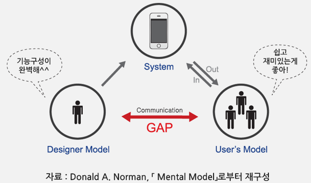

[오브젝트 - 코드로 이해하는 객체지향 설계](http://www.yes24.com/Product/Goods/74219491?OzSrank=1) 를 정리한 자료입니다.

<br>

# 목차

- [목차](#목차)
- [Chapter 02 객체지향 프로그래밍](#chapter-02-객체지향-프로그래밍)
  - [1 영화 예매 시스템](#1-영화-예매-시스템)
    - [요구사항](#요구사항)
  - [2 객체지향 프로그래밍을 향해](#2-객체지향-프로그래밍을-향해)
    - [2-1 협력, 객체, 클래스](#2-1-협력-객체-클래스)
    - [2-2 도메인 모델](#2-2-도메인-모델)
    - [2-3 클래스는 내부 외부를 분리해야한다](#2-3-클래스는-내부-외부를-분리해야한다)
    - [2-4 협력하는 객체들의 공동체](#2-4-협력하는-객체들의-공동체)
  - [3 할인 요금 구하기](#3-할인-요금-구하기)
    - [3-1 할인 정책과 할인 조건](#3-1-할인-정책과-할인-조건)
    - [3-2 할인 정책 구성하기](#3-2-할인-정책-구성하기)
  - [4 상속과 다형성](#4-상속과-다형성)
    - [4-1 컴파일 시간 의존성과 실행 시간 의존성](#4-1-컴파일-시간-의존성과-실행-시간-의존성)
    - [4-2 차이의 의한 프로그래밍](#4-2-차이의-의한-프로그래밍)
    - [4-3 상속과 인터페이스](#4-3-상속과-인터페이스)
    - [4-4 다형성](#4-4-다형성)
    - [4-5 인터페이스와 다형성](#4-5-인터페이스와-다형성)
  - [5 추상화와 유연성](#5-추상화와-유연성)
    - [5-1 추상화의 힘](#5-1-추상화의-힘)
    - [5-2 유연한 설계](#5-2-유연한-설계)
    - [5-3 추상 클래스와 인터페이스 트레이드 오프](#5-3-추상-클래스와-인터페이스-트레이드-오프)
    - [5-4 상속 vs 합성](#5-4-상속-vs-합성)
  - [6 정리](#6-정리)

<br>

# Chapter 02 객체지향 프로그래밍

예제를 통해 요구사항부터 구현까지 큰그림을 그려주는 챕터이다.

<br>

## 1 영화 예매 시스템

<br>

### 요구사항

* 사용자는 쉽고 빠르게 영화를 예매할 수 있다.
* '영화'는 하루에 다양한 시간대에 한 번 이상 '상영'될 수 있다.
  * 사용자가 실제로 예매하는 것은 '상영'이다.
* 요금 할인
  * 할인 조건
    * 순서 조건 - 상영 순번을 이용해 할인 여부를 결정.
      * 예) 매일 10번째로 상영되는 영화를 예매하는 사용자들에게 할인 혜택
    * 기간 조건 - 상영 시작 시간을 이용해 할인 여부를 결정.
      * 예) 월요일(요일), 시작 시간 10시, 종료 시간 오후 1시인 영화 할인 혜택
  * 할인 정책 - 할인 요금을 결정
    * 금액 할인 정책 - 예매 요금에서 일정 금액을 할인
      * 예) 9,000원의 영화에 금액 할인 정책이 800이면 8,200
    * 비율 할인 정책 - 정가에서 일정 비율의 요금을 할인
      * 예) 9,000원의 영화에 10%의 비율 할인 정책이면 8,100
* 하나의 영화에 최대 하나의 할인 정책만 적용할 수 있다.
* 할인 조건은 다수를 지정할 수 있다. 순서 조건과 기간 조건을 섞는 것도 가능하다.
* 사용자의 예매 정보가 할인 조건 중 하나라도 만족하는지 검사한다. 할인 조건을 만족할 경우 할인 정책으 이용해 할인 요금을 계산한다.

<br>

## 2 객체지향 프로그래밍을 향해

요구사항에 맞춰 객체지향 프로그래밍언어를 이용해 구현해본다.

<br>

### 2-1 협력, 객체, 클래스

**객체지향의 본질**

* 보통 객체지향을 생각할 때 어떤 `class` 가 필요한지 생각한다. 그리고 **무슨 속성과 메서드**가 필요한지 고민한다.
  * **하지만 이것은 객체지향의 본질과 거리가 멀다.**
* 진정한 객체 지향은 **클래스가 아닌 객체에 초점**을 맞춰야 하고, 이것은 두 가지를 통해 이뤄진다.
  1. **어떤 클래스가 아니라, 어떤 객체가 필요한지 고민하라.**
     * 클래스는 그저 공통적인 상태와 행동을 공유하는 객체들을 추상화한 것 뿐이다.
     * **객체가 어떤 상태와 어떤 행동을 가지는지 생각하면 클래스의 윤곽이 잡힌다.**
  2. **객체**를 독립적인 존재가 아닌, **협력하기 위한 공동체의 일원**으로 봐라.
     * **훌륭한 협력이 훌륭한 객체를 낳고, 훌륭한 객체가 훌륭한 클래스를 낳는다.**

<br>

### 2-2 도메인 모델

🤔 **도메인**

* 문제를 해결하기 위해 사용자가 프로그램을 사용하는 **분야 (영역)**

<br>

🤔 객체지향과 도메인의 관계

* **요구사항과 프로그램을 객체라는 동일한 관점에서 바라볼 수 있게 해준다.**
  * 또한, **도메인을 구성하는 개념들이 프로그램의 객체와 클래스로 매끄럽게 연결될 수 있다.**
* 객체지향 패러다임이 강력한 이유
  * 요구사항 분석부터 구현까지 객체라는 추상화 기법으로 전부 해결

* 가장 이상적인 도메인 모델 설계

<p align="center"><br>출처 : http://www.swweek.kr/um/um02/um0204/um0204View.do?postId=8243&cpage=16</p>

***`도메인 모델 == 사용자들이 도메인을 바라보는 관점(멘탈 모델) == 설계자가 시스템구조를 바라보는 관점 == 소프트웨어 안에 구현된 코드 그자체`가 제일 이상적인 시스템이다. - 도널드 노먼 -***

<br>

:point_right: 영화 예매 시스템 도메인


<br>

### 2-3 클래스는 내부 외부를 분리해야한다

```java
public class Screening {
  private Movie movie;
  private int sequence;
  private LocalDateTime whenScreened;
  
  ... 생성자
    
  public LocalDateTime getStratTime() { return whenScreened; }

  ... getter
}
```

* 인스턴스의 변수는 `private`, 메서드는 `public` 이다. 
  * 이렇게 클래스의 내부와 외부를 구분하는 이유는 객체의 자율성을 보장해주기 위해서이다.
  * **상태는 행동에 의해서만 변경되어야 한다.**
* 클래스의 경계를 구분 짓는 것
  * **어떤 부분을 감추고 어떤 부분을 공개할지 정하는 것.**
* **클래스의 내부 외부를 분리하는 이유**
  * 경계의 명확성이 **객체의 자율성을 보장.** - 자율적인 객체
  * 프로그래머에게 구현의 자유를 제공한다. - 프로그래머의 자유

<br>

**자율적인 객체**

> 모든 객체는 자율적이여야 한다. 현실에서 수동적인 객체는 객체지향에서 능동적으로 행동해야한다.(의인화)

* 중요한 사실
  * 객체는 **상태**(state)와 **행동**(behavior)을 가지는 복합적인 존재이다.
  * 객체는 스스로 판단하고 행동하는 **자율적인 존재**이다.
* 캡슐화 - 데이터(상태)와 기능(행동)을 내부로 함께 묶는 것.
  * 캡슐화를 구현하기 위해 많은 객체지향 언어는 접근 제어를 제공한다.
    * `private`, `protected`, `public`
* 캡슐화와 접근 제어를 통해서 **객체를 두 부분으로 나눈다. (인터페이스와 구현의 분리)**
  * **외부에서 접근 가능한 `public interface`**
  * **내부에서만 접근 가능한 `implementation`**
* 내부에 대한 접근을 막는 이유
  * 객체는 자율적이여야 하므로 스스로 상태를 관리하고, 판단하고, 행동해야 한다.
  * 즉, 자율적인 존재가 되기 위해서는 **외부의 간섭**을 최소화해야 한다.
  * 간단히 말해서는 **부수효과를 없애고, 자율적인 객체가 되기 위함**

<br>

**프로그래머의 자유**

* **프로그래머의 역할을 클래스 작성자와 클라이언트 프로그래머로 구분하는 것이 좋다.**
  * **클래스 작성자** : 새로운 데이터 타입을 프로그램에 추가 - 라이브러리
    * 필요한 부분만 공개하고 나머지는 숨긴다.
  * **클라이언트 프로그래머** : 클래스 작성자가 추가한 데이터 타입을 사용. - API를 사용하는 개발자
    * 필요한 클래스들을 엮어서 애플리케이션을 **빠르고 안정적으로 구축한다.**
* 구현 은닉 - **클래스 작성자가 클라이언트 프로그래머에게 필요한 부분만을 공개하고 나머지를 숨김.**
  * 이를 통해 **외부로부터의 영향을 고려하지 않고 내부 구현을 변경**할 수 있다.
* 구현 은닉을 왜 해야하는가?
  * 클라이언트 프로그래머는 **내부의 구현은 무시한 채 인터페이스만 알고 있어도 클래스를 사용할 수 있다.**
  * 클래스 작성자는 인터페이스를 바꾸지 않은 한 내부 구현을 자유롭게 변경할 수 있다.
  * **구현 은닉(접근 제어)를 통해 변경을 관리할 수 있다.** 
* **클래스를 개발할 때마다 인터페이스와 구현을 깔끔하게 나누기 위해 노력하자.**

> 설계의 목적은 변경을 관리하기 위해서이다.

<br>

### 2-4 협력하는 객체들의 공동체

<p align="center"> </p>

영화 예매하는 과정을 통해 **협력하는 객체들의 공동체**를 설명한다.

<br>

<p align="center"> </p>

* 영화 예매하기 위해 `Screening`, `Money`, `Reservation` 이 서로 메서드를 호출하고 상호작용하는 협력을 수행한다.

```java
public class Screening {
  
  // 공개 인터페이스 (사용자의 영화 예매 요청을 받는 메서드)
  public Reservation reserve(Customer customer, int audienceCount){
    return new Reservation(customer, this, calculateFee(audienceCount), audienceCount);
  }
  
  // 내부 구현
  private Money calculateFee(int audienceCount){
    // Movie에게 영화 가격을 계산해달라고 요청.
    return movie.calculateMovieFee(this).times(audienceCount);
  }
}
```

* `reserve` 는 공개 인터페이스이며, 예매하기 위한 정보를 담은 `Reservation` 객체를 반환한다.

* `calculateFee` 에서 돈을 왜 `Money` 라는 객체를 만들어서 전달하는가???

  * **일반적인 `Long` 타입을 사용하지 않는 이유는 `Money` 타입처럼 저장하는 값이 금액과 관련돼 있다는 의미를 전달할 수는 없다.**

  * 또한 금액과 관련된 로직이 서로 다른 곳에 중복되어 구현되는 것을 막을 수 없다. (**불변식**)

    ```java
    public class Money {
      public static final Money ZERO = Money.wons(0);
      
      private final BigDecimal amount;
      
      public static Money won(long amount){ // 머니 생성
        return new Money(BigDecimal.valueOf(amount));
      }
      
      Money(BigDecimal amount){ // 생성자
        this.amount = amount;
      }
      
      ... 돈 계산 관련 메서드 (플러스, 마이너스, 퍼센트, 값 비교..)
    }
    ```

<br>

**협력에 관한 짧은 이야기**

* 요청과 응답 - 객체들간의 협력도 요청과 응답으로 이뤄져야 한다.
* 메시지 전송, 수신
  * **객체가 다른 객체와 상호작용**할 수 있는 **유일한 방법은 메시지 전송.**
  * 다른 객체에게 요청이 도착할 때 해당 객체가 메시지를 수신했다고 이야기 한다.
  * **수신된 메시지를 처리하기 위한 자신만의 방법을 메서드라고 한다.**

<br>

## 3 할인 요금 구하기

<p align="center"> </p>

이제 예매 요금을 계산하는 협력을 구현해보자

```java
public class Movie {
  private String title;
  private Duration runningTime;
  private Money fee; // 기본 영화 요금
  private DiscountPolicy discountPolicy;
  
  public Money calculateMovieFee(Screening screening){
    return fee.minus(discountPolicy.calculateDiscountAmount(screening));
  }
}
```

* `Movie` 객체는 영화 요금을 계산하기 위한 `calculateMovieFee`라는 메서드를 공개 인터페이스로 제공한다.
  * `calculateMovieFee` 메서드는 `discountPolicy` 에 `calculateDiscountAmount` 메시지를 전송해 할인 요금을 반환받는다.
  * `Movie.calculateMovieFee` 는 기본요금인 `fee` 에서 반환된 할인 요금을 `minus` 하고 반환한다.

> 🤔 어떤 할인 정책을 사용할 지 존재하지 않는 이유는
>
> * 상속, 다형성, 추상화를 통해 유연한 코드로 설계를 했기 때문이다. (**컴파일 타임이 아닌 런타임에 결정**)

<br>

### 3-1 할인 정책과 할인 조건

* 할인 정책은 두 가지지만 대부분은 유사하다.
  * 따라서 두 클래스 사이의 중복을 제거하기 위한 공통 보관 클래스가 필요하다.
  * 이를 **추상클래스**라한다.

```java
public abstract class DiscountPolicy {
  private List<DiscountCondition> conditions = new ArrayList<>();
  
  public Money calculateDiscountAmount(Screening screening){
    // 만약 할인 조건에 맞는 상영이라면 할인 금액을 리턴
    for(DiscountCondition each : conditions){
      if(each.isSatisfiedBy(screening)){
        return getDiscountAmount(screening); // 할인 금액
      }
    }
    
    // 만약 할인 조건이 없는 상영이라면 0원의 할인 금액 리턴
    return Money.ZERO;
  }
  
  // 하위 클래스가 구현하도록 추상화
  abstract protected Money getDiscountAmount(Screening screening);
}
```

* 할인 정책은 다수의 할인 조건을 갖고 있고, 만족하는 경우 **추상 메서드** 를 호출한다.
  * **`DiscountCondition` 은 인터페이스를 통해 할인 조건 여부를 반환한다.**
  * `DiscountCondition.isSatisfiedBy(screening)` 인자로 전달된 `screening` 이 할인 조건을 만족시키는지 여부를 확인하는 메서드이다.
  * 즉, `DiscountPolicy` 가 `DiscountCondition` 에게 메시지 요청하는 것.
* 템플릿 메서드 패턴
  * 전체적인 흐름(컨텍스트)는 상위 클래스에서 정의하고, 핵심 로직(전략)은 상속받는 하위 클래스가 정의하는 것을 **템플릿 메서드 패턴**이라 한다.

```java
public interface DiscountCondition { // 할인 조건 인터페이스
  boolean isSatisfiedBy(Screening screening);
}
```

<p align="center"> </p>

<br>

### 3-2 할인 정책 구성하기

영화(`Movie`)의 할인 정책을 구성하는 것을 구현한다. 생성자를 사용한다.

```java
public class Movie {
  public Movie(String title, Duration runningTime, Money fee, DiscountPolicy discountPolicy){	
    ...
    this.discountPolicy = discountPolicy;
  }
}

public abstract class DiscountPolicy {
  public DiscountPolicy(DiscountCondition ... conditions){
    this.conditions = Arrays.asList(conditions);
  }
}
```

* **생성자**를 통해 `Movie` 와 `DiscountPolicy` 사이의 **관계와 제약을 강제한다.**
  * 이처럼 생성자 초기화를 통해 의존성을 주입해주면 올바른 상태를 가진 객체의 생성을 보장할 수 있다.

<br>

## 4 상속과 다형성

🤔 `Movie` 클래스 어디에서도 조건문이 없는데 어떤 할인 정책을 사용할지 어떻게 아는 것일까?

* 이는 상속과 다형성을 이용해 실행 시점에 동적 바인딩을 하기 때문이다. (컴파일이 아닌 런타임에 결정)

<br>

### 4-1 컴파일 시간 의존성과 실행 시간 의존성

`Movie` 의 영화 요금 계산하기 위해서 필요한 것은 `DiscountPolicy` 가 아닌 `AmoundDiscoutPolicy` 혹은 `PercentDiscountPolicy` 중 하나에 의존해야 한다. 

하지만 코드 수준에서는 어떤 것에도 의존하지 않고, 오로지 추상 클래스인 `DiscountPolicy`에 의존하고 있다.

* 상속과 다형성
  * **코드의 의존성과 실행 시점의 의존성이 서로 다를 수 있다.**
  * 즉, 클래스 사이의 의존성과 객체 사이의 의존성은 동일하지 않을 수 있다.
* 트레이드 오프
  * 코드의 의존성과 실행 시점의 의존성이 다를수록 코드는 이해하기 어려워 진다.
  * 반면에, 코드의 의존성과 실행 시점의 의존성이 다를수록 더 유연해지고 확장 가능해진다.
  * 이는 객체지향이 매력적인 이유중 하나이다.

<br>

### 4-2 차이의 의한 프로그래밍

* 상속을 이용하면 기존 클래스의 속성과 행동을 새로운 클래스에 포함시킬 수 있다.
* 이처럼 부모 클래스와 다른 부분만을 추가해 클래스를 빠르고 쉽게 만드는 방법을 **차이에 의한 프로그래밍이라 한다.**

<br>

### 4-3 상속과 인터페이스

* 상속의 진정한 의미
  * **기존의 많이 알고 있는 의미 : 메서드나 인스턴스 변수를 재사용 하는 것을 목적으로 하는 것이 아니다.**
  * 상속의 진정한 의미는 **상위 클래스가 제공하는 인터페이스를 하위 클래스가 물려받을 수 있다**라는 것이다.
  * **상속을 통한 하위 클래스 = 자신의 인터페이스 + 상위 클래스의 인터페이스**
* 인터페이스 - 객체가 이해할 수 있는 메시지의 목록
  * 하위 클래스는 상위 클래스가 수신할 수 있는 모든 메시지를 수신할 수 있다.
    * 외부 객체는 이를 통해 하위와 상위 클래스를 동일한 타입으로 간주한다.
* **업캐스팅 - 하위 클래스가 상위 클래스를 대신하는 것.**

<br>

### 4-4 다형성

`메시지 != 메서드`

`Movie`가 `DiscountPolicy` 의 인스턴스에게 `calculateDiscountAmount` 메시지를 전송한다. 그렇다면 실행되는 메서드는??

🤔 다형성

* `Movie` 는 동일한 메시지를 전송하지만 **실제로 어떤 메서드가 실행될 것인지는 메시지를 수신한 클래스가 무엇인가에 따라 달라진다.**
  * 이를 **다형성**이라 한다.
  * 동일한 메시지를 수신 했을 때, 객체의 타입에 따라 다르게 응답할 수 있는 능력
  * 인터페이스가 동일하다.
    * **다형적인 객체들은 같은 메시지를 이해할 수 있어야 한다.**
* 다형성 구현방법
  * 추상 클래스
  * 인터페이스

<br>

🤔 다형성과 메시지의 공통점

* 다형성을 구현하는 방법은 다양하지만 **메시지에 응답할 메서드를 컴파일 시점이 아닌 실행 시점에 결정한다는 공통점**이 있다.
  * 즉, **실행 시점에 메시지와 실행 메서드를 바인딩한다.** => 동적 바인딩, 지연 바인딩
  * 반대로 메시지에 응답할 메서드를 컴파일 시점에 바인딩 하는것 => 초기 바인딩, 정적 바인딩

<br>

### 4-5 인터페이스와 다형성

추상 클래스를 이용해 다형성을 구현했던 **할인 정책과 달리 할인 조건은 구현을 공유할 필요가 없기 때문에 인터페이스** 를 이용해 다형성을 구현하였다.

* 상속 - 내부 구현까지 공유
* 인터페이스 - 내부 구현은 공유하지 않고, 인터페이스만 공유

<br>

## 5 추상화와 유연성

<br>

### 5-1 추상화의 힘

<p align="center"> </p>

"영화 요금은 최대 하나의 정책을 갖고, 다수의 조건을 이용한다"

* 추상화는 더 일반적인 개념들을 포함한다.

* **추상화를 통해 세부적인 내용이 아니라 상위 정책을 간단하게 표현 할 수 있다.**
  * 즉, **기본적인 어플리케이션의 협력 흐름을 나타내고, 새로운 하위 클래스들은 추상화를 이용해 상위 흐름을 그대로 따른다.**

> 이러한 내용은 디자인 패턴, 프레임워크에서 매우 중요하게 작용된다.

<br>

### 5-2 유연한 설계

만약 할인 정책이 없는 경우, 할인 요금을 계산할 필요 없이 영화에 설정된 기본 가격을 사용하면 된다.

<br>

**안좋은 설계**

```java
public class Movie {
  public Money calculateMovieFee(Screening screening){
    if(discountPolicy == null) // 할인 정책이 없는 경우
      return fee;
    
    return fee.minus(discountPolicy.calculateDiscountAmount(screening));
  }
}
```

* **이 방식의 문제점은 할인 정책이 없는 경우를 예외 케이스로 취급하기 때문에 일관성이 무너진다.**
  * 이 경우 할인을 책임이 `DiscountPolicy` 가 아니라 `Movie` 에 있기 때문에 일관성이 무너지는 것.
  * 협력의 설계 측면에서 좋지 않다.
* **일관성을 지킬 수 있는 방법은 0원이라는 할인 요금을 계산할 책임을 그대로 `DiscountPolicy` 가 유지하는 것이다.**

<br>

**좋은 설계**

```java
public class NoneDiscountPolicy extends DiscountPolicy {
  @Override
  protected Money getDiscountAmount(Screening screening){
    return Money.ZERO;
  }
}

Movie starWars = new Movie("스타워즈",
                          Duration.ofMinutes(210),
                          Money.wons(10000),
                          new NoneDiscountPolicy());
```

* **기존의 `Movie`와 `DiscountPolicy` 는 수정하지 않고 새로운 클래스를 추가하는 것만으로 기능을 확장했다.**
  * 추상화를 이용했기 때문에 유연하고 확장 가능한 설계가 완성됐다.
  * 유연성이 필요한 곳에 추상화를 사용하라.

> 책임의 위치를 결정하기 위해 조건문을 사용하는 것은 협력의 설계 측면에서 대부분의 경우 좋지 않은 선택이다.

<br>

### 5-3 추상 클래스와 인터페이스 트레이드 오프

만약 아래와 같이 인터페이스를 이용해 할인 정책을 설계한다면?

<p align="center"> </p>

🤔 이런 설계와 추상 클래스와의 설계 중 어느 것이 더 좋은 것일까??

* 이상적으로는 인터페이스를 사용한 이 설계가 더 좋다.
* 하지만 `NoneDiscountPolicy` 만을 위해 인터페이스를 추가하는 것은 과할 거 같단 생각이 든다.
* 정답은 없다고 한다.


> 객체 지향의 모든 것은 트레이드 오프의 산물이다.
>
> * 하지만 자신이 작성한 모든 코드에는 합당한 이유가 있어야 한다.

<br>

### 5-4 상속 vs 합성

코드를 재사용할 수 있는 방법은 두 가지이다. 상속, 합성

그렇다면 **사람들이 합성을 더 선호하는 이유는 무엇**일까??

* 상속
  * 두 관점에서 안 좋은 영향을 미친다.
    * **캡슐화를 위반**
      * **내부 구현을 하위 클래스에 상속하므로 내용이 노출.**
      * **상위 클래스가 변경하면 하위 클래스도 따라서 변경이 된다.**
    * **설계를 유연하지 못하게 한다**.
      * 상위 하위 클래스 간의 관계가 컴파일 시점에 결정된다. **따라서 실행 시점에 객체의 종류를 변경하는 것이 불가능하다.**
* 합성
  * 인터페이스에 정의된 메시지를 통해서만 코드를 재사용하는 방법
  * 합성의 상속의 두 가지 단점을 모두 해결한다.
    * **인터페이스**에 정의된 메시지를 통해서만 재사용하기에 **내부 구현을 캡슐화**할 수 있다.
    * `setter` 를 통해 인스턴스 교체가 쉽기 때문에 설계가 유연하다. **실행 시점에 변경이 가능하다.**

> 정답은 없다.
>
> * 상속보다 합성을 선호하는 것은 옳지만, 다형성을 위해 인터페이스를 재사용하는 경우에는 상속과 합성을 조합해서 사용한다.

<br>

## 6 정리

* 다형성은 지연 바인딩을 통해 구현된다.
* 상속보다는 합성
* 유연한 객체지향을 위해서는 컴파일 시간 의존성과 실행 시간 의존성이 달라야 한다.
