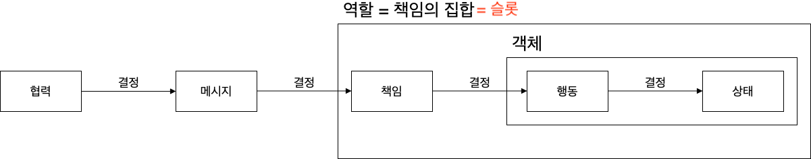
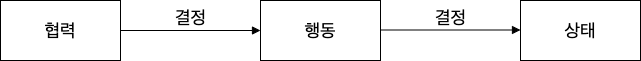
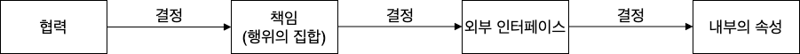
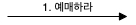
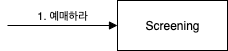
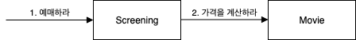
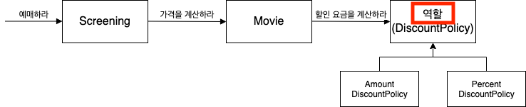
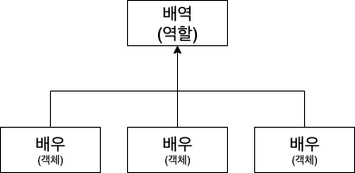

[오브젝트 - 코드로 이해하는 객체지향 설계](http://www.yes24.com/Product/Goods/74219491?OzSrank=1) 를 정리한 자료입니다.

# 목차

- [Chapter 03 역할, 책임, 협력](#chapter-03-역할-책임-협력)
  * [1 협력](#1-협력)
    + [1-1 협력이란?](#1-1-협력이란)
    + [1-2 협력이 설계를 위한 문맥을 결정한다](#1-2-협력이-설계를-위한-문맥을-결정한다)
  * [2 책임](#2-책임)
    + [2-1 책임이란?](#2-1-책임이란)
    + [2-2 책임 할당](#2-2-책임-할당)
    + [2-3 책임을 할당할 때 고려해야 하는 두 가지 요소](#2-3-책임을-할당할-때-고려해야-하는-두-가지-요소)
  * [3 역할](#3-역할)
    + [3-1 역할이란](#3-1-역할이란)
    + [3-2 유연하고 재사용 가능한 협력](#3-2-유연하고-재사용-가능한-협력)
    + [3-3 역할과 추상화](#3-3-역할과-추상화)
  * [4 정리](#4-정리)

# Chapter 03 역할, 책임, 협력

2장에서는 다양한 객체지향 프로그래밍을 구성하는 다양한 요소와 구현 기법을 살펴봤다.

* 다형성은 지연 바인딩을 통해 구현된다.
* 상속보다는 합성
* 유연한 객체지향을 위해서는 컴파일 시간 의존성과 실행 시간 의존성이 달라야 한다.

**3장에서는 객체지향의 핵심인 역할, 책임, 협력에 대해서 다룬다.**

협력, 책임, 역할의 관계

객체지향의 본질은 협력하는 객체들의 공동체를 창조하는 것.

* 협력 - 객체들이 애플리케이션의 기능을 구현하기 위해 수행하는 상호작용
* 책임 - 객체가 협력에 참여하기 위해 수행하는 로직
* 역할 - 객체들이 협력 안에서 수행하는 책임들이 모여 객체가 수행하는 역할을 구성.

## 1 협력

### 1-1 협력이란?

#### 객체는 사회적인 존재이다

* 객체는 고립된 존재가 아니라 시스템의 기능이라는 **더 큰 목표를 달성하기 위해 다른 객체와 협력하는 사회적인 존재다.**

#### 협력 수단 - 메시지

* 협력의 시작
  * 두 객체 사이의 협력은 하나의 객체가 다른 객체에게 도움을 요청할 때 시작된다.
* 협력의 수단
  * **메시지 전송은 객체 사이의 협력을 위해 사용할 수 있는 유일한 커뮤니케이션 수단이다.**
  * 일반적인 클라이언트 - 서버 관계를 생각하면 될 듯하다.

#### 협력

* **협력이란 어떤 객체가 다른 객체에게 무언인가를 요청하는 것이다.**
* **한 객체는 어떤 것이 필요할 때 다른 객체에게 전적으로 위임하거나 서로 협력한다.**
  * 두 객체가 상호작용을 통해 더 큰 책임을 수행하는 것.

#### 캡슐화

* 객체들간의 **협력을 하는 과정 속**에서 **모든 객체는 자율적이여야 한다.**
* 객체를 자율적으로 만드는 가장 기본적인 방법은 **내부 구현을 캡슐화**하는 것이다.

### 1-2 협력이 설계를 위한 문맥을 결정한다

협력은 객체를 설계하는 데 필요한 **일종의 문맥 (Context)**을 제공한다. => 매우매우 중요한 개념

#### 협력이 존재하기 때문에 객체가 존재하는 것

* 협력 :arrow_right: 행동
  * **협력이라는 문맥을 고려하지 않고 객체의 행동을 결정하는 것은 아무런 의미가 없다.**
  * 협력이 존재하기 때문에 객체가 존재하는 것이다.
* 행동 :arrow_right: 상태
  * 객체의 상태를 결정하는 것은 행동이다.
  * **객체의 상태는 그 객체가 행동을 수행하는 데 필요한 정보가 무엇인지로 결정된다.**

## 2 책임

객체를 설계하기 위해 필요한 문맥인 협력이 갖춰졌다고 하자.

다음으로 할 일은 협력에 필요한 행동을 수행할 수 있는 적절한 객체를 찾는 것이다.

### 2-1 책임이란?

#### 책임

* **책임이란 객체에 의해 정의되는 응집도 있는 행위의 집합.**
  * 객체가 유지해야 하는 정보와 수행 할 수 있는 행동에 대해 개략적으로 서술한 문장이다. => 인터페이스
* 책임은 **협력에 참여하기 위해 객체가 수행하는 행동**이다.

#### 책임은 두 가지로 나뉜다

* 객체가 **무엇을 알고 있는가?**
* 객체가 **무엇을 할 수 있는가?**

그리고 두 가지는 서로 밀접한 관계를 가진다. 

왜냐하면 객체는 자신이 맡은 책임을 수행하는 데 필요한 정보를 알고 있을 책임이 있기때문이다.

또한, 객체는 자신이 할 수 없는 작업을 도와줄 객체를 알고 있을 책임이 있다.

#### 하는 것 (doing)

* 객체를 생성하거나 계산을 수행하는 등의 스스로 하는 것.
* 다른 객체의 행동을 시작시키는 것. (위임 시키는 것)
* 다른 객체의 활동을 제어하고 조절하는 것

#### 아는 것 (knowing)

* 사적인 정보에 관해 아는 것
* 관련된 객체에 관해 아는 것
* 자신이 유도하거나 계산할 수 있는 것에 관해 아는 것

#### 협력이 책임을 결정한다

* 협력 안에서 객체에게 할당된 **책임이 외부의 인터페이스와 내부의 속성을 결정한다**

### 2-2 책임 할당

**객체 지향 설계는 협력에 필요한 메시지를 찾고 메시지에 적절한 객체를 선택하는 반복적인 과정을 통해 이뤄진다.**

**그러므로 각 객체에 책임을 할당하는 것이 설계의 방향과 흐름을 결정한다.**

자세한 내용은 [5장 책임 할당하기]()를 참고하자.

### 2-3 책임을 할당할 때 고려해야 하는 두 가지 요소

* 메시지가 객체를 결정한다
* 행동이 상태를 결정한다

#### 메시지가 객체를 결정한다.

메시지를 먼저 선택하고 메시지가 객체를 선택한다.

* **메시지 주도 설계**
  * 객체가 메시지를 선택하는 것이 아니라 메시지가 객체를 선택하게 해야 한다.
* **책임을 할당하는 데 필요한 메시지를 먼저 식별하고 메시지를 처리할 객체를 나중에 선택하는 것.**

* **메시지가 객체를 선택해야 하는 이유**
  1. 객체가 최소한의 인터페이스를 가질 수 있게 된다. (책임을 자동적으로 결정해주기도 한다.)
  2. 객체는 충분히 추상적인 인터페이스를 가질 수 있게 된다. (캡슐화)
     * **인터페이스는 무엇(what)을 표현해야 하지만 어떻게(how) 수행하는지는 노출해서는 안된다.**

#### 행동이 상태를 결정한다.

* 객체가 존재하는 이유는 협력에 참여하기 위해서다. 따라서 **객체는 협력에 필요한 행동을 제공해야 한다.**
* **상태는 단지 객체가 행동을 정상적으로 수행하기 위해 필요한 재료일 뿐이다.**

## 3 역할

### 3-1 역할이란

#### 역할 = 책임의 집합

* 객체가 어떤 특정한 협력 안에서 수행하는 **책임의 집합을 역할**이라 한다.
* **역할 == 슬롯**

### 3-2 유연하고 재사용 가능한 협력

#### 역할은 다른 것으로 교체할 수 있는 책임의 집합이다.

* 슬롯을 하나 만들고 여러 종류의 객체를 교대로 바꿔 끼울 수 있다.
* 여기서 **슬롯이 바로 역할이다.**

#### 역할의 구현 (중요)

* 추상 클래스 `abstract class`
  * **공유하는 상태와 행동의 기본 구현이 필요한 경우 => 템플릿 메서드 패턴**
* 인터페이스 `interface`
  * **공통의 구현이 필요없고 단지 책임의 목록만 정의하면 되는 경우**

> 상속과 인터페이스의 차이점이기도 하다.

### 3-3 역할과 추상화

#### 역할은 객체가 참여할 수 있는 일종의 슬롯이다

* **역할은 객체가 참여할 수 있는 일종의 슬롯이다.** 유용하고 재사용 가능한 설계라는 문맥에서 필수적이다.
* **역할을 협력 안에서 각자의 위치를 가지는 객체들에 대한 별칭이라고 정의하기도 한다.**

> **객체에 관해 생각할 때 ''이 객체가 무슨 역할을 수행해야 하는가?'라고 자문하는 것이 도움이 된다.**

#### 추상화를 이용한 역할의 두 가지 장점

1. **추상화 계층만을 이용하면 중요한 정책을 상위 수준에서 단순화할 수 있다.**
   * 모든 객체는 협력안에서 각자의 위치(역할)을 수행한다.
2. **설계가 좀 더 유연해진다.**
   * 변경이 일어나게 된다면 슬롯처럼 바꿔끼면 되기 때문이다.

> 역할이 중요한 이유는 동일한 협력을 수행하는 객체들을 추상화할 수 있기 때문이다.

#### 배우와 배역

* 역할 = 배역
  * 역할은 슬롯이다. 추상화를 통해 변경 가능하다.
* 객체 = 배우
  * 객체는 다양한 역할을 가질 수 있다.

## 4 정리

* 협력
  * 객체는 사회적 존재이며, 자율적인 존재
  * 협력 수단 - 메시지
  * 협력이 설계를 위한 문맥을 결정한다. (메시지 기반 설계)
* 책임
  * 하는 것
  * 아는 것
  * 협력이 책임을 결정
  * 책임 할당이 설계의 퀄리티를 좌우한다
  * 메시지가 객체를 결정한다
* 역할
  * 역할은 책임의 집합이며 슬롯(배역)이다
  * 배우(객체)는 여러 배역(역할)을 할 수 있다.

