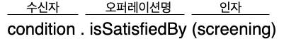
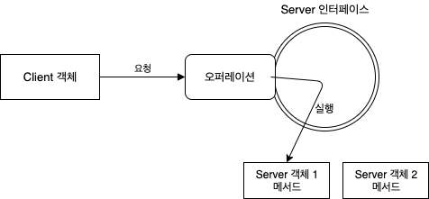

[오브젝트 - 코드로 이해하는 객체지향 설계](http://www.yes24.com/Product/Goods/74219491?OzSrank=1) 를 정리한 자료입니다.


# 목차

- [Chapter 06 메시지와 인터페이스](#chapter-06-메시지와-인터페이스)
  * [1 협력과 메시지](#1-협력과-메시지)
    + [1-1 클라이언트 - 서버 모델](#1-1-클라이언트---서버-모델)
    + [1-2 용어 정리](#1-2-용어-정리)
  * [2 인터페이스와 설계 품질](#2-인터페이스와-설계-품질)
    + [2-1 디미터 법칙](#2-1-디미터-법칙)
    + [2-2 묻지 말고 시켜라](#2-2-묻지-말고-시켜라)
    + [2-3 의도를 드러내는 인터페이스](#2-3-의도를-드러내는-인터페이스)
  * [3 원칙의 함정](#3-원칙의-함정)
    + [3-1 디미터 법칙은 하나의 도트를 강제하는 규칙이 아니다](#3-1-디미터-법칙은-하나의-도트를-강제하는-규칙이-아니다)
  * [4 명령 - 쿼리 분리 원칙](#4-명령---쿼리-분리-원칙)
    + [4-1 프로시저와 함수](#4-1-프로시저와-함수)
    + [4-2 명령 - 쿼리 분리를 사용하는 이유](#4-2-명령---쿼리-분리를-사용하는-이유)
    + [4-3 참조 투명성](#4-3-참조-투명성)
  * [5 정리](#5-정리)
      - [5-1 메시지를 먼저 선택하고 그 후에 메시지를 처리할 객체를 선택하라](#메시지를-먼저-선택하고-그-후에-메시지를-처리할-객체를-선택하라)


# Chapter 06 메시지와 인터페이스

객체지향에서 가장 중요한 재료는 **클래스가 아니라 객체들이 주고 받는 메시지다. (책임)**

* 클래스 사이의 관계 - **정적인 흐름**
* 메시지 사이의 관계 - **동적인 흐름**
  * 역할(인터페이스)를 두고 런타임시에 구현체가 바뀐다.

**애플리케이션은 클래스로 구성되지만 메시지를 통해 정의된다는 사실을 기억하라.**

6장에서는 훌륭한 퍼블릿 인터페이스 (메시지)에 대한 원칙과 기법에 대해서 살펴본다.


## 1 협력과 메시지

우선 협력과 메시지가 무엇인지부터 알아보자.


### 1-1 클라이언트 - 서버 모델


#### 클라이언트 - 서버 모델이란


* 클라이언트 - 서버 모델
  * 두 객체 사이의 협력관계는 "클라이언트 - 서버" 모델로 볼 수 있다.
* 단방향
  * 협력은 클라이언트가 서버의 서비스를 요청하는 단방향 상호작용이다.


#### 객체는 두 가지 역할을 동시에 수행한다.


* **객체는 협력에 참여하는 동안 클라이언트와 서버의 역할을 동시에 수행한다.**


### 1-2 용어 정리

협력과 인터페이스에는 다양한 용어가 등장한다. 이러한 용어들을 정리해보자.


#### 메시지



* 메시지란?
  * **객체가 다른 객체와 협력하기 위해 사용하는 의사소통 매커니즘.**
* 메시지 전송이란?
  * **다른 객체에게 도움을 요청하는 것.**
  * 일반적으로 객체의 오퍼레이션이 실행되도록 요청하는 것을 "메시지 전송"이라 부른다.


#### 메서드

* 메서드
  * **메시지를 수신했을 때 실제로 실행되는 함수** 또는 로직을 메서드라 한다.
  * 메시지에 응답하기 위해 실행되는 코드 블록.
  * 오퍼레이션에 대한 구현.
* **중요한 것은 코드 상에서 동일한 이름의 변수에게 동일한 메시지를 전송하더라도 객체의 타입에 따라 실행되는 메서드가 달라질 수 있다는 것.**
  * 즉, 컴파일 시점과 실행 시점의 의미가 달라진다.
  * 캡슐화, 다형성 => 결합도를 낮춘다.


#### 인터페이스



* 인터페이스
  * **코드가 협력에 참여하기 위해 외부에서 수신할 수 있는 메시지의 묶음.**
  * 책임(행동의 집합)의 집합
* **객체는 안과 밖을 구분하는 뚜렷한 경계를 가진다.**
  * 외부에서 볼 때 안쪽은 미지의 영역이다.
  * 외부의 객체는 오직 객체가 공개(public)하는 메시지를 통해서만 객체와 상호작용할 수 있다.


#### 오퍼레이션

* 오퍼레이션
  * 인터페이스에 포함된 메시지를 오퍼레이션이라 부른다.
  * 오퍼레이션은 수행 가능한 어떤 행동에 대한 추상화다.


#### 시그니처

* 시그니처
  * 오퍼레이션의 이름과 파라미터 목록을 합쳐 시그니처라고 한다.
  * 메서드는 시그니처에 구현을 더한 것이다.


## 2 인터페이스와 설계 품질

좋은 인터페이스란?

* **최소한**의 인터페이스
* **추상적**인 인터페이스

**좋은 인터페이스를 설계하는 가장 좋은 방법은 책임 주도 설계 (메시지 주도 설계)를 하는 것이다.**

아래는 훌륭한 인터페이스가 가지는 **공통적인 특징**이다.

* 디미터 법칙
* 묻지 말고 시켜라
* 의도를 드러내는 인터페이스
* 명령 - 쿼리 분리

위 특징을 지키면 **자연스럽게 자율적인 객체를 만들 수 있다.**


### 2-1 디미터 법칙


#### 디미터 법칙이란

* 객체의 내부 구조에 강하게 결합되지 않도록 협력 경로를 제한하는 것.
  * **낯선 자에게 말하지 말라.**
  * **오직 인접한 이웃하고만 말하라.**
  * **오직 하나의 도트(.)만 사용하라.** => 제일 기억하기 쉽다.
* 협력하는 객체의 내부 구조에 대한 결합(결합도)으로 인해 발생하는 설계 문제를 해결하기 위해 제안된 원칙

```java
screening.getMovie().getDiscountConditions(); // X (도트는 하나만 사용하라) => 기차 충돌

screening.calculateFee(audienceCount); // O
```


#### 디미터 이름의 의미

* "디미터"라는 프로젝트를 하다가 협력 경로를 제한하면 결합도를 낮출 수 있는 것을 발견하여 이름을 디미터원칙이라 한다.


#### 디미터의 원칙

> 인접한 객체에만 요청을 보내라 => **도트(.)를 한번만 사용하라.**

**아래 조건을 만족하는 인스턴스에만 메시지를 전송하라.**

* this 객체
* 메서드의 매개변수
* this의 속성
* this의 속성인 컬렉션의 요소
* 메서드 내에서 생성된 지역 객체


#### 부끄럼타는 코드

디미터법칙을 따르면 부끄럼타는 코드를 작성할 수 있다.

* 부끄럼 타는 코드란?
  * **다른 객체에게 보여주지 않으며, 다른 객체의 구현에 의존하지 않는 코드 => 자율적인 객체**


### 2-2 묻지 말고 시켜라


#### 묻지 말고 시켜라?

* **객체의 상태에 관해 묻지 말고 원하는 것을 시켜야 한다는 것.**
  * **메시지 전송자는 수신자의 상태를 기반으로 결정을 내리지 않고, 메시지 전송자는 그저 수신자에게 묻지 말고 시켜라.**
  * 전송자가 시킨 로직을 처리하는 것은 수신자가 알아서 처리해야 한다.
  * **한마디로, 모든 자율적인 객체를 만들어야 한다는 것.**


#### How(x) What(o)

* **인터페이스는 어떻게 하는지가 아니라 무엇을 하는지를 서술해야 한다.**
  * 어떻게 하는지를 서술하면 캡슐화가 깨진다.
    * ex) isSatisfiedByPeriod
    * ex) isSatisfiedBySequence
  * 무엇을 하는지를 서술하면 캡슐화를 지킬 수 있다.
    * ex) isSatisfiedBy


### 2-3 의도를 드러내는 인터페이스

메시지를 명명하는 법


#### 어떻게가 아닌 무엇을 => 의도를 드러내는 선택자

* 메서드가 어떻게 수행하느냐가 아니라 무엇을 하느냐에 초점을 맞추면 클라이언트의 관점에서 동일한 작업을 수행하는 메서드들을 하나의 타입 계층으로 묶을 수 있다.
* **객체에게 묻지 말고 시키되 구현 방법이 아닌 클라이언트의 의도를 드러내야 한다.**


## 3 원칙의 함정

소프트웨어 설계에 법칙이란 존재하지 않는다.

**원칙이 현재 상황에 부적합하다고 판단된다면 과감하게 원칙을 무시하라.**


### 3-1 디미터 법칙은 하나의 도트를 강제하는 규칙이 아니다

* 디미터 법칙은 결합도와 관련된 것이며, 이 결합도가 **문제가 되는 것은 객체의 내부 구조가 외부로 노출**되는 경우로 한정된다.
  * 객체의 내부 구조가 외부에 노출되지 않은 상황에서 하나 이상의 도트는 디미터 법칙을 위반하는 것이 아니다.
* 예시 - Stream

```java
InStream.of(1,15,3,4,5).filter(x -> x > 10).distinct().count();
```

> 단, 자료구조처럼 당연히 내부를 노출해야 하는 경우 디미터 법칙을 적용할 필요가 없다. - 로버트 마틴 -


## 4 명령 - 쿼리 분리 원칙

명령 - 쿼리 분리 원칙은 인터페이스에 오퍼레이션을 정의할 때 참고할 수 있는 지침을 제공한다.


### 4-1 프로시저와 함수

어떤 절차를 묶어 호출 가능하도록 이름을 부여한 기능 모듈을 **루틴**이라고 부른다.


#### 프로시저

> 프로시저 == 명령형 프로그래밍 (절차지향, 객체지향)

* **프러시저는 부수효과를 발생시킬 수 있지만 값을 반환할 수 없다.**
* **객체의 상태를 변경하는 명령은 반환값을 가질 수 없다. :arrow_right: 프로시저**


#### 함수

> 함수 == 함수형 프로그래밍 (수학적 함수)

* **함수는 값을 반환할 수 있지만 부수효과를 발생시킬 수 없다.**
* **객체의 정보를 반환하는 쿼리는 상태를 변경할 수 없다. :arrow_right: 함수**


#### 명령 - 쿼리 분리 원칙이란

* 명령 - 쿼리 분리 원칙의 요지
  * 오퍼레이션이 부수효과를 발생시키는 명령 :arrow_right: 프로시저 (명령)
  * 오퍼레이션이 부수효과를 발생시키지 않는 명령 :arrow_right: 함수 (쿼리)
* 객체와 인터페이스
  * 객체는 **블랙박스**이며 객체의 인터페이스는 객체의 관찰 가능한 상태를 보기 위한 일련의 디스플레이와 객체의 상태를 변경하기 위해 누를 수 있는 **버튼의 집합**이다.


### 4-2 명령 - 쿼리 분리를 사용하는 이유

명령 - 쿼리 분리를 사용하여 얻는 장점은 무엇일까?


#### 실행 결과를 예측하기 쉽다

```java
public class Event {
  // 명령 - 쿼리를 하나의 메서드에 넣는 예시
  public boolean isSatisfiedBy(RecurringSchedule schedule) { // 쿼리형이여야 한다.
    if(from.getDayOfWeek() != schedule.getDayOfWeek()) ||
      !from.toLocalTime().equals(schedule.getFrom()) ||
      !duration.equals(schedule.getDuration()) {
      reschedule(schedule); // 명령형 로직 (부수효과)
      return false;
    }
    
    return true;
  }
}
// 첫번째 결과 = false
// 두번째 결과 = true
```

* **명령과 쿼리를 뒤섞으면 실행 결과를 예측하기가 어려워진다.**
  * `isSatisfiedBy` 메서드처럼 **겉으로 보기에는 쿼리처럼 보이지만 내부적으로 부수효과를 가지는 메서드**는 **이해하기 어렵고, 잘못 사용하기 쉬우며, 버그를 양산하는 경향이 있다.**


> 명령 - 쿼리 분리를 사용하면 캡슐화가 깨지는 상황이 있긴 하지만, 명령 - 쿼리 분리를 통해 얻는 이득이 더 많다.


### 4-3 참조 투명성

명령과 쿼리를 엄격하게 분류하면 객체의 부수효과를 제어하기가 수월해진다.

**컴퓨터와 수학을 나누는 가장 큰 특징은 부수효과이다.**


#### 참조투명성이란

* 어떤 표현식 e가 있을 때 e의 값으로 나타나는 모든 위치를 교체하더라도 결과가 달라지지 않는 특성

* **부수효과가 없는 특징** :arrow_right: 수학에서의 함수

* 예시

  ```java
  f(1) + f(1) = 6
  f(1) * 2 = 6
  f(1) - 1 = 2
  ```

  `f(1) = 3` 이라는 값은 변하지 않는다.


#### 참조투명성의 이점

* 버그가 적다.

* 디버깅이 용이하다.

  * 모든 함수를 이미 알고 있는 하나의 결괏값으로 대체할 수 있기 때문에 식을 쉽게 계산할 수 있다.

* 쿼리의 순서에 따라 실행 결과가 변하지 않는다.

  ```java
  f(1) - 1 = 2
  f(1) * 2 = 6
  f(1) + f(1) = 6
  ```

  식의 순서를 변경하더라도 `f(1) = 3` 이라는 결과는 달라지지 않는다.


#### 불변성

* 불변성(immutability)이란
  * 어떤 값이 변하지 않는 성질
  * 즉, **어떤 값이 불변하다는 말은 부수효과가 발생하지 않는다는 말과 동일하다.**


#### 명령 - 쿼리 분리 원칙이 객체지향의 참조 투명성의 혜택을 누릴 수 있게 한다.

* 객체지향 != 참조 투명성
  * 객체지향은 **객체의 상태 변경이라는 부수효과**를 기반으로 하기 때문에 **참조 투명성은 예외에 가깝다.**
* **하지만, 명령 - 쿼리 분리 원칙을 사용하면 이 균열을 조금이나마 줄일 수 있다.**


#### 명령형 프로그래밍과 함수형 프로그래밍

* 명령형
  * **상태를 변경시키는 연산들을 적절한 순서대로 나열함으로써 프로그램을 작성한다.**
* 함수형
  * **부수효과가 존재하지 않는 수학적인 함수에 기반한다.**
  * 참조 투명성의 장점을 극대화 할 수 있으며 명령형에 비해 실행 결과를 이해하고 예측하기가 쉽다.
  * **병렬 처리가 중요해진 최근에는 함수형 프로그래밍의 인기가 상승하고 있다.**


## 5 정리


#### 메시지를 먼저 선택하고 그 후에 메시지를 처리할 객체를 선택하라

* **책임 주도 설계 (메시지 주도 설계)를 하면** **자연스럽게 디미터 법칙과 묻지 말고 시켜라 스타일을 해결** 할 수 있다.
  * 디미터 법칙 : 협력이라는 컨텍스트 안에서 객체보다 메시지를 먼저 결정하면 두 객체 사이의 구조적인 결합도를 낮출 수 있다.
  * 묻지 말고 시켜라 : 메시지를 먼저 선택하면 묻지 말고 시켜라 스타일에 따라 협력을 구조화하게 된다.
  * 의도를 드러내는 인터페이스 : **메시지를 먼저 선택한다는 것은 메시지를 전송하는 클라이언트의 관점에서 메시지의 이름을 정한다는 것**
  * 명령 - 쿼리 분리 원칙 : 메시지를 먼저 선택한다는 것은 협력이라는 문맥 안에서 객체의 인터페이스에 관해 고민한다는 것을 의미한다.


