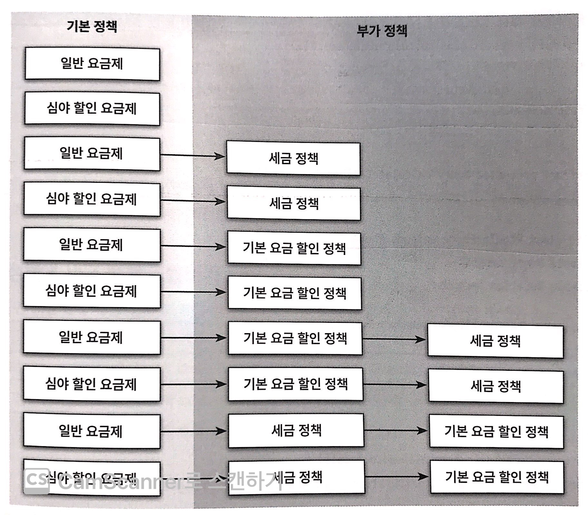
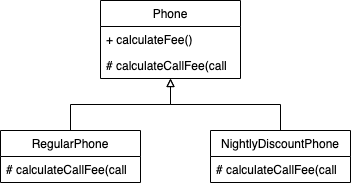
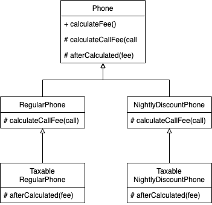
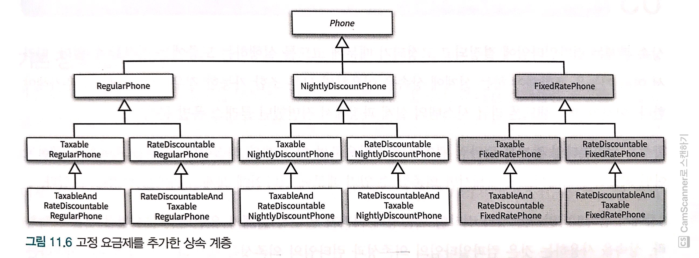
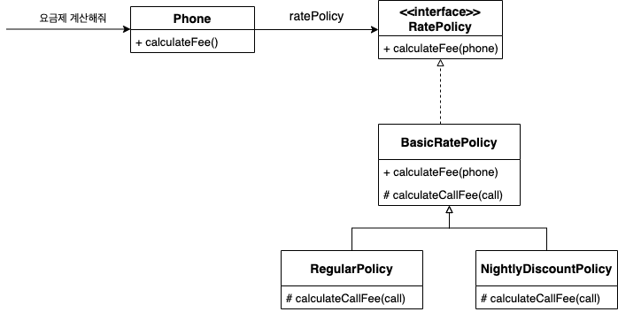
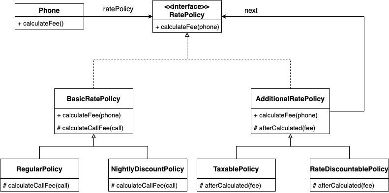
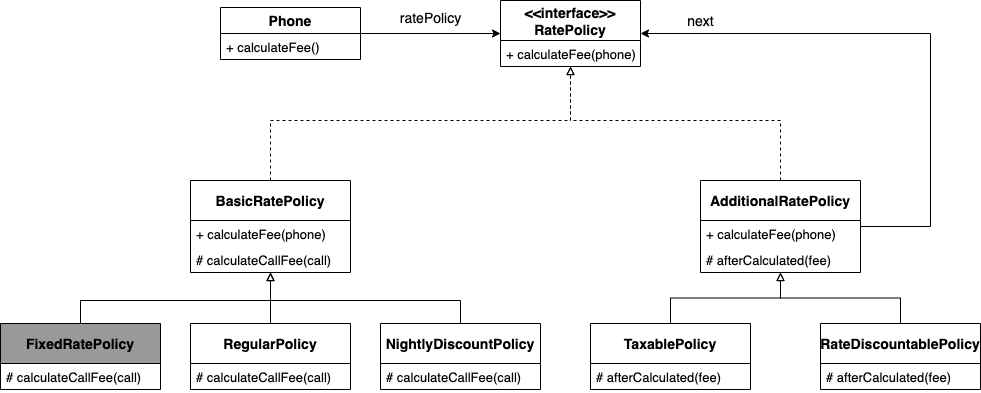

[오브젝트 - 코드로 이해하는 객체지향 설계](http://www.yes24.com/Product/Goods/74219491?OzSrank=1) 를 정리한 자료입니다.


# 목차

- [Chapter 11 합성과 유연한 설계](#chapter-11-합성과-유연한-설계)
  * [1 상속과 합성](#1-상속과-합성)
    + [1-1 상속의 단점](#1-1-상속의-단점)
    + [1-2 합성의 장점](#1-2-합성의-장점)
    + [1-3 상속과 합성의 차이 - 결론](#1-3-상속과-합성의-차이---결론)
  * [2 상속의 문제 -> 합성으로 변환](#2-상속의-문제---합성으로-변환)
    + [2-1 불필요한 인터페이스 상속 문제](#2-1-불필요한-인터페이스-상속-문제)
    + [2-2 메서드 오버라이딩의 오작용 문제](#2-2-메서드-오버라이딩의-오작용-문제)
    + [2-3 부모 클래스와 자식 클래스의 동시 수정 문제](#2-3-부모-클래스와-자식-클래스의-동시-수정-문제)
  * [3 상속으로 인한 조합의 폭발적인 증가](#3-상속으로-인한-조합의-폭발적인-증가)
    + [3-1 기본 정책과 부가 정책 구현하기](#3-1-기본-정책과-부가-정책-구현하기)
    + [3-2 상속을 이용해 기본 정책 구현](#3-2-상속을-이용해-기본-정책-구현)
    + [3-3 기본 정책에 세금 정책 조합하기](#3-3-기본-정책에-세금-정책-조합하기)
    + [3-4 중복 코드의 덫에 걸리다](#3-4-중복-코드의-덫에-걸리다)
    + [3-5 문제는 컴파일타임에만 변경을 할 수 있다는 것 - 결론](#3-5-문제는-컴파일타임에만-변경을-할-수-있다는-것---결론)
  * [4 합성으로 변경하기](#4-합성으로-변경하기)
    + [4-1 합성을 사용해야 하는 이유](#4-1-합성을-사용해야-하는-이유)
    + [4-2 기본 정책 합성](#4-2-기본-정책-합성)
    + [4-3 부가 정책 적용 - 중요](#4-3-부가-정책-적용---중요)
    + [4-4 새로운 정책 추가하기](#4-4-새로운-정책-추가하기)
  * [5 정리](#5-정리)
    + [합성의 문제](#합성의-문제)
    + [합성이 상속보다 좋은 이유](#합성이-상속보다-좋은-이유)
    + [여러 정책을 동시에 계산하는 방법](#여러-정책을-동시에-계산하는-방법)
    + [이번장에서 말하는 상속은 구현상속이다.](#이번장에서-말하는-상속은-구현상속이다)


# Chapter 11 합성과 유연한 설계

객체지향에서 가장 널리 사용되는 코드 재사용 기법은 두 가지이다.

1. 상속 -> 물려준다
2. 합성 -> 전체가 부분을 포함

흔히 많은 사람들이 **상속보단 합성**이라 한다.

이번 챕터에서는 **상속보다 왜 합성이 더 좋은지에 대해서 다루고있다.**


## 1 상속과 합성


### 1-1 상속의 단점

* **상속은 부모 클래스의 정의를 대부분 자식 클래스에 물려준다.**
  * 자식 클래스는 부모 클래스에 대해 상세하게 알아야 한다.
  * 즉, **자식과 부모 사이의 결합도가 높아질 수 밖에 없다.**
    * **자식 클래스가 부모 클래스에 의존**하게 되어, **부모 클래스가 변경되면 자식 클래스의 구현도 변경된다.**
* **결과적으로 상속은 코드를 재사용할 수 있는 쉽고 간단한 방법이지만 우아한 방법은 아니다.**


### 1-2 합성의 장점

* 합성은 구현에 의존하지 않는다.
  * **상속처럼 내부에 포함되는 객체의 구현(부모 클래스의 코드)이 아닌 퍼블릭 인터페이스에 의존한다.**
  * 즉, 의존성이 낮으므로 결합도가 비교적 낮다.


### 1-3 상속과 합성의 차이 - 결론

* 재사용 방법
  * **상속은** 부모 클래스와 자식 클래스를 연결해서 **부모 클래스의 코드를 재사용한다.**
  * **합성은** 전체를 표현하는 객체가 **부분을 표현하는 객체를 포함해서 부분 객체의 코드를 재사용한다.**

* 의존성
  * **상속**에서 부모와 자식 클래스의 의존성은 **컴파일 타임에 해결된다. (extends)**
    * 클래스 사이의 관계가 **정적**
    * 코드 작성 시점에 결정되는 **상속 관계는 실행 시점에 변경이 불가능하다.**
  * **합성**에서 두 객체 사이의 의존성은 **런타임에 해결된다.** (OCP, DIP) -> 인터페이스 -> 런타임 의존성 주입
    * 객체 사이의 관계가 **동적**
    * **실행 시점에 동적으로 변경할 수 있다.**

* 재사용의 대상
  * 상속은 **부모 클래스 안에 구현된 코드 자체를 재사용**
    * **구체적인 부모 클래스에 의존하므로 클래스 사이에 높은 결합도를 가진다.**
  * 합성은 포함되는 객체의 **퍼블릭 인터페이스를 재사용**
    * **인터페이스(추상)에 의존하므로 객체 사이에 낮은 결합도를 가진다.**


> * 상속은 **화이트박스 재사용**이라 한다.
> * 합성은 **블랙박스 재사용**이라 한다.


## 2 상속의 문제 -> 합성으로 변환

상속의 대한 문제점들을 더 자세하게 다뤄본다

그리고 **합성으로 변환하므로써 합성이 왜 더 좋은지 설명한다.**


### 2-1 불필요한 인터페이스 상속 문제


#### 상속으로 인한 문제 -> 부모가 자신의 책임을 자식에게 물려준다.

* **자식 클래스에게는 부적합한 부모 클래스의 오퍼레이션(메서드)이 상속되기 때문에 자식 클래스 인스턴스의 상태가 불안정해지는 문제.**
  * 즉, **자식 클래스가 부모 클래스의 책임도 수행한다.**
  * 예) JDK에 포함된 `Properties`와 `Stack`
    * get, add -> 불필요한 책임을 자식에게 물려준다.


#### 상속 -> 합성 (properties)

자바의 `Hashtable`와 `Properties`클래스 사이의 상속 관계를 합성 관계로 바꿔보자.

**`Properties`클래스에서 상속 관계를 제거하고 `Hashtable`을 `Properties`의 인스턴스 변수로 포함시키면 합성 관계로 변경할 수 있다.**

```java
// 합성으로 변경한 Properties
public class Properties { // (전체)
  private Hashtable<String, String> properties = new Hashtable<>(); // 합성 (부분)
  
  public String setProperty(String key, String value) {
    return properties.put(key, value);
  }
  
  public String getProperty(String key) {
    return properties.get(key);
  }
}
```

* 상속과 달리 합성으로 변경한 `Properties`는 `Hashtable`의 내부 구현에 관해 알지 못한다.
  * 더 이상 불필요한 `Hashtable`의 오퍼레이션들이 `Properties`클래스의 퍼블릿 인터페이스를 오염시키지 않는다.
  * 클라이언트는 오직 `Properties`에서 정의한 오퍼레이션만 사용할 수 있다.


#### 상속 -> 합성 (Stack)

`Stack` 역시 `Vector`의 인스턴스 변수를 `Stack` 클래스의 인스턴스 변수로 선언함으로써 합성 관계로 변경할 수 있다.

```java
public class Stack<E>{
  private Vector<E> elements = new Vector<>();
  
  public E push(E item) {
    elements.addElement(item);
    return item;
  }
  
  public E pop() {
    if(elements.isEmpty()) {
      throw new EmptyStackException();
    }
    return elements.remove(elements.size() - 1);
  }
}
```

* 이제 `Stack`의 퍼블릭 인터페이스에 `Vector`의 오퍼레이션들이 포함되지 않는다.
  * 더이상 임의의 위치에 요소를 추가하거나 삭제할 수 없다. (`add`, `get` 등)


### 2-2 메서드 오버라이딩의 오작용 문제


#### 상속으로 인한 문제 -> ... 

* 자식 클래스가 부모 클래스의 메서드를 오버라이딩 할 때 자식 클래스가 부모 클래스의 메서드 호출 방법에 영향을 받는 문제.
  * 자식 클래스가 부모 클래스 호출 방법


#### 상속 -> 합성 (InstrumentedHashSet)

```java
public class InstrumentedHashSet<E> {
  private int addCount = 0;
  private Set<E> set;
  
  public InstrumentedHashSet(Set<E> set) {
    this.set = set;
  }
  
  ...
    
  public boolean addAll(Collections<? extends E c) {
    addCount += c.size();
    return set.addAll(c);
  }
  ...
}
```

* `InstrumentedHashSet`의 경우 다른 점이 있다.
  * `InstrumentedHashSet`의 경우 `HashSet`의 모든 퍼블릭 인터페이스가 필요하다.
  * **이럴때 사용할 수 있는 방법이 인터페이스를 구현하는 것이다.**

```java
public class InstrumentedHashSet<E> implements Set<E> {
  private int addCount = 0;
  private Set<E> set;
  
  ...
    
 	// InstrumentedHashSet의 인터페이스
  public int getAddCount() {
    return addCount;
  }
   
  // Set의 퍼블릭 인터페이스
  @Override
  public boolean addAll(Collections<? extends E> c) {
    addCount += c.size();
    return set.addAll(c);
  }
  
  ...
  @Override
  public boolean remove(Object o) {return set.remove(o)}; // Set의 퍼블릭 인터페이스를 이용한다. (포워딩)
  ...
}
```

* `Set`을 구현하므로써 `HashSet`의 퍼블릭 인터페이스 또한 제공할 수 있다.


### 2-3 부모 클래스와 자식 클래스의 동시 수정 문제


#### 상속으로 인한 문제 -> 자식 클래스는 부모 클래스에 의존적이다

* 부모 클래스와 자식 클래스 사이의 개념적인 결합으로 인해 부모 클래스를 변경할 때 자식 클래스도 함께 변경해야 하는 문제
  * 너무 의존적이다.


#### 상속 -> 합성

**기존엔 `PlayList`에 새로운 상태(가수)가 추가된다면 상속받는 `PersonalPlaylist`도 변경을 해줘야 했다.**

이를 합성으로 수정한다면 아래와 같다.

```java
public class PersonalPlaylist{
  private Playlist playlist = new Playlist();
  
  public void append(Song song) {
    playlist.append(song);
  }
  
  public void remove(Song song) {
    playlist.getTracks().remove(song);
    playlist.getSingers.remove(song.getSinger()); // 여전히 수정된 상태에 대한 변경 코드가 존재한다.
  }
}
```

* 상속을 합성으로 변경해도 여전히 수정된 상태(가수)에 대한 변경 코드는 존재한다.
  * **그 이유는 합성으로 변경을 해도 여전히 의존성은 남아있기 때문이다.**
  * **하지만, 그래도 상속보다는 유연한다.**


## 3 상속으로 인한 조합의 폭발적인 증가

상속으로 인해 조합의 증가로 인해 발생하는 문제점

* **하나의 기능을 추가하거나 수정**하기 위해 **불필요하게 많은 수의 클래스를 추가하거나 수정해야 한다.**
* 단일 상속만 지원하는 언어에서는 **상속으로 인해 오히려 중복 코드의 양이 늘어날 수 있다.**


이번 장에서는 **핸드폰 요금제를 기본 정책과 부가 정책을 조합해서 구성하는 예시를 통해 상속의 문제점을 설명**한다.


### 3-1 기본 정책과 부가 정책 구현하기

#### 요구사항

* 기본 정책
  * 일반 요금제
  * 심야 할인 요금제
* 부가 정책
  * 세금 정책
  * 기본 요금 할인 정책

* 조합 가능한 모든 요금 계산 순서

<p align="center">

출처 : 오브젝트 책 p.355</p>


### 3-2 상속을 이용해 기본 정책 구현



```java
// 템플릿 메서드 패턴
public abstract class Phone {
  private List<Call> calls = new ArrayList<>(); // 전화 내역 
  
  public Money calculateFee() { // 컨텍스트 (부가로직)
    Money result = Money.ZERO;
    for(Call call : calls) {
      result = result.plus(calculateCallFee(call));
    }
    return result;
  }
  
  abstract protected Money calculateCallFee(Call call); // 핵심 로직
}
```

```java
// 일반 요금제를 구현한 폰
public class RegularPhone extends Phone {
  // RegularPhone의 속성
  private Money amount;
  private Duration seconds;
  
  ...
    
  @Override
  protected Money calculateCallFee(Call call) {
    return amount.times(call.getDuration().getSeconds() / seconds.getSeconds());
  }
}

// 심야 할인 요금제
public class NightDiscountPhone extends Phone {
  // NightDiscountPhone의 속성
  ...
    
 	@Override
  protected Money calculateCallFee(Call call) {
    if(call.getFrom().getHour() >= LATE_NIGHT_HOUR)
      return nightlyAmount.times()...;
   	
    return ...;
  }
}
```

* 상속을 이용하여 핵심 로직과 부가 로직을 분리하였다. (템플릿 메서드 패턴)


### 3-3 기본 정책에 세금 정책 조합하기

일반 요금제에 세금 정책을 조합하려면 어떻게 해야할까?

가장 간단한 방법은 일반 요금제를 상속하는 새로운 클래스를 만드는 것이다.



```java
public abstract class Phone {
  private List<Call> calls = new ArrayList<>();
  
  public Money calculateFee() {
    Money result = Money.ZERO;
    for(Call call : calls) {
      result = result.plus(calculateCallFee(call)); // 기본 요금
    }
    
    return afterCalculated(result); // 보조 요금
  }
  
  protected abstract Money calculateCallFee(Call call); // 기본 요금
  protected Money afterCalculated(Money fee); // 보조 요금 ( 훅 메서드 )
  // protected abstract Money afterCalculated(Money fee); // 추상 메서드로 해도 된다.
}
```

```java
public class RegularPhone extends Phone {
  private Money money;
  private Duration seconds;
  
  ....
  
  @Override
  protected Money calculateCallFee(Call call) {
    return amount.times(call.getDuration.getSeconds() / seconds.getSeconds());
  }
  
  @Override
  protected Money afterCalculated(Money fee) { // 훅 메서드
    return fee; // 기본 요금제 (일반 요금제)이므로 그대로 반환.
  }
}

public class TaxableRegularPhone extends RegularPhone {
  private double taxRate;
  
  ... 
    
  // 훅 메서드 오버라이딩
  @Override
  protected Money afterCalculated(Money fee) {
    return fee.plus(fee.times(taxRate));
  }
}
```

* 추상 메서드와 훅 메서드를 추가한다.
  * 추상 메서드 (`calculateCallFee`) - 기본 정책 계산
  * 훅 메서드 (`afterCalculated`) - 부가 정책 계산

* 문제는 만약 심야 할인 요금제 (`TaxableNightlyDiscountPhone`) 을 구현하려면 중복이 발생한다.
  * `NightlyDiscountPhone`도 만들어줘야 한다...


### 3-4 중복 코드의 덫에 걸리다

<p align="center">

출처 : 오브젝트 p.367</p>

* 상속으로 인해 중복 코드의 덫에 빠진다.
  * **현재 설계에 새로운 정책을 추가하기 위해서는 불필요하게 많은 수의 클래스를 상속 계층 안에 추가해야한다.**
  * `FixedRatePhone`을 추가하기 위해서는 5개의 클래스를 생성해줘야 한다.
* 즉, 하나의 기능을 추가하기 위해 필요 이상으로 많은 수의 클래스를 추가해줘야 한다.


### 3-5 문제는 컴파일타임에만 변경을 할 수 있다는 것 - 결론


#### 상속은 컴파일타임에 결정되고 고정되기 때문에 코드를 런타임에 변경할 수 없다

* 따라서 **여러 기능을 조합해야 하는 설계에 상속을 이용하면 모든 조합 가능한 경우별로 클래스를 추가해야 한다.**
  * 이것이 바로 **상속이 갖는 클래스 폭발 문제**다.


#### 상속은 컴파일시점과 런타임시점의 의존성을 동일하게 만들겠다고 하는 것

* 8장에서 **유연한 설계를 만들기 위해서는 컴파일 시점과 런타임 시점의 의존성이 서로 멀면 멀수록 유연**해진다고 했다.
* **상속은 컴파일 시점과 런타임 시점의 의존성이 동일하다. -> 변경에 취약하다. -> 높은 결합도**


> 이러한 문제를 피하기 위해서는 합성을 사용해야 한다.


## 4 합성으로 변경하기

핸드폰 요금제 설계를 합성으로 변경함으로써 합성의 장점을 알아본다.


### 4-1 합성을 사용해야 하는 이유 

* 상속과 달리 **합성 관계는 런타임에 동적으로 변경할 수 있다.**
  * 즉, **컴파일타임 의존성과 런타임 의존성이 서로 멀어지며, 설계가 유연해진다.**
* 합성의 본질
  * 합성을 사용하면 구현 시점에 정책들의 관계를 고정시킬 필요가 없으며 실행 시점에 정책들의 관계를 유연하게 변경할 수 있게 된다.
  * 즉, **조합을 구성하는 요소들을 개별 클래스로 구현한 후 실행 시점에 인스턴스를 조립하는 방법을 사용하는 것.**


### 4-2 기본 정책 합성



```java
// 요금제 기본 정책 인터페이스
public interface RatePolicy {
  Money calculateFee(Phone phone);
}

// 요금제 기본 정책 기본적인 추상 클래스
public abstract class BasicRatePolicy implements RatePolicy {
  @Override
  public Money calculateFee(Phone phone) {
    Money result = Money.ZERO;
    
    for(Call call : phone.getCalls()) {
      result.plus(calculateCallFee(call));
    }
    return result;
  }
  
  protected abstract Money calculateCallFee(Call call);
}
```

```java
public class Phone {
  private RatePolicy ratePolicy; // 합성
  private List<Call> calls = new ArrayList<>();
  
  public Phone(RatePolicy ratePolicy) {
    this.ratePolicy = ratePolicy;
  }
  
  public List<Call> getCalls() {
    return calls
  }
  
  public Money calculateFee() { // 합성으로 인해 유연해짐.
    return ratePolicy.calculateFee(this);
  }
}
```

일반 요금제 규칙에 따라 통화 요금을 계산하고 싶다면 다음과 같이 합성하여 사용하면 된다.

```java
// 명시적인 의존성 표현할 수 있다.
Phone phone = new Phone(new RegularPolicy(Money.wons(10), Duration.ofSeconds(10))); // Phone과 BasicRatePolicy

Phone phone = new Phone(new NightlyDiscountPolicy(...)); // Phone과 NightlyDiscountPolicy
```

* 장점
  * 런타임시점에 의존성이 주입된다.
  * 의존성이 명시적이다.


### 4-3 부가 정책 적용 - 중요


#### 부가 정책은 기본 정책에 대한 계산이 끝난 후에 적용된다.

<p align="center">

기본 요금제의 인스턴스 관계</p>


<p align="center">
기본 요금제에 세금 정책을 부과한 인스턴스 관계</p>

* **기본 정책 계산 끝난 후 :arrow_right: 부가정책 계산하여 :arrow_right: Phone에게 반환**
  * 세금 정책(TaxablePolicy)은 RegularPolicy의 계산이 끝나고 Phone에게 반환되기 전에 적용돼야 한다.


#### 기본 정책과 부가 정책을 동시에 계산하는 방법



* **부가 정책 내부에 또 다른 기본 정책을 합성하면 된다.**

```java
public abstract class AdditionalRatePolicy implements RatePolicy {
  private RatePolicy next; // 기본정책 (세금 정책 -> 기본 정책)
  
  public AdditionalRatePolicy(RatePolicy next) {
    this.next = next;
  }
  
  @Override
  public Money calculateFee(Phone phone) {
    Money fee = next.calculateFee(phone); // 기본 정책을 먼저 계산
    return afterCalculated(fee); // 부가정책 계산하고 반환.
  }
  
  abstract protected Money afterCalculated(Money fee); // 부가정책 (추상메서드)
}
```

이제 다음과 같이 자유롭게 조합을 하여 사용할 수 있다.

```java
Phone phone = new Phone(new TaxablePolicy(0.05, new RegularPolicy(... ))); // 일반 요금제 + 세금 정책

// 일반 요금제 + 기본 요금할인 정책 + 세금 정책
Phone phone = new Phone(
  new TaxablePolicy(
    0.05, new RateDiscountablePolicy(
      Money.wons(1000), new RegularPolicy(...))));
```


### 4-4 새로운 정책 추가하기



* 합성은 클래스 하나만 만들어주면 쉽게 새로운 정책을 추가할 수 있다.


## 5 정리


### 합성의 문제

* 불필요한 인터페이스 상속 문제
* 메서드 오버라이딩의 오작용 문제
* 부모 클래스와 자식 클래스의 동시 수정 문제


### 합성이 상속보다 좋은 이유

* 재사용 방법
  * **상속은** 부모 클래스와 자식 클래스를 연결해서 **부모 클래스의 코드를 재사용한다.**
  * **합성은** 전체를 표현하는 객체가 **부분을 표현하는 객체를 포함해서 부분 객체의 코드를 재사용한다.**

* 의존성
  * **상속**에서 부모와 자식 클래스의 의존성은 **컴파일 타임에 해결된다.**
    * 클래스 사이의 관계가 **정적**
    * 코드 작성 시점에 결정되는 **상속 관계는 실행 시점에 변경이 불가능하다.**
  * **합성**에서 두 객체 사이의 의존성은 **런타임에 해결된다.** (OCP, DIP)
    * 객체 사이의 관계가 **동적**
    * **실행 시점에 동적으로 변경할 수 있다.**

* 재사용의 대상
  * 상속은 **부모 클래스 안에 구현된 코드 자체를 재사용**
    * **구체적인 부모 클래스에 의존하므로 클래스 사이에 높은 결합도를 가진다.**
  * 합성은 포함되는 객체의 **퍼블릭 인터페이스를 재사용**
    * **인터페이스(추상)에 의존하므로 객체 사이에 낮은 결합도를 가진다.**


### 여러 정책을 동시에 계산하는 방법 - 중요

* **부가 정책 내부에 또 다른 기본 정책을 합성하면 된다.**
  * 기본 정책 안에 부가 정책 안에 또 다른 정책.


### 이번장에서 말하는 상속은 구현상속이다.

* 상속은 두가지로 볼 수 있다.
  * 구현 상속 ( 클래스가 클래스를 상속 )
  * 인터페이스 상속 ( 인터페이스가 인터페이스 상속 )
* 이번 장에서 살펴본 상속의 단점은 모두 구현 상속에 속한다.


