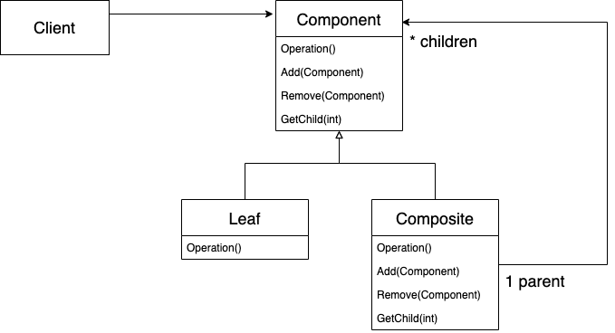
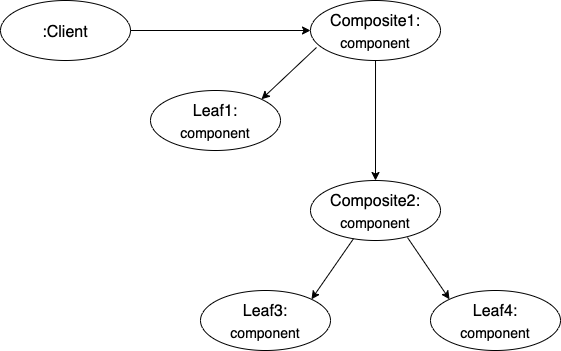
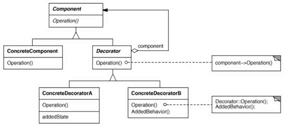
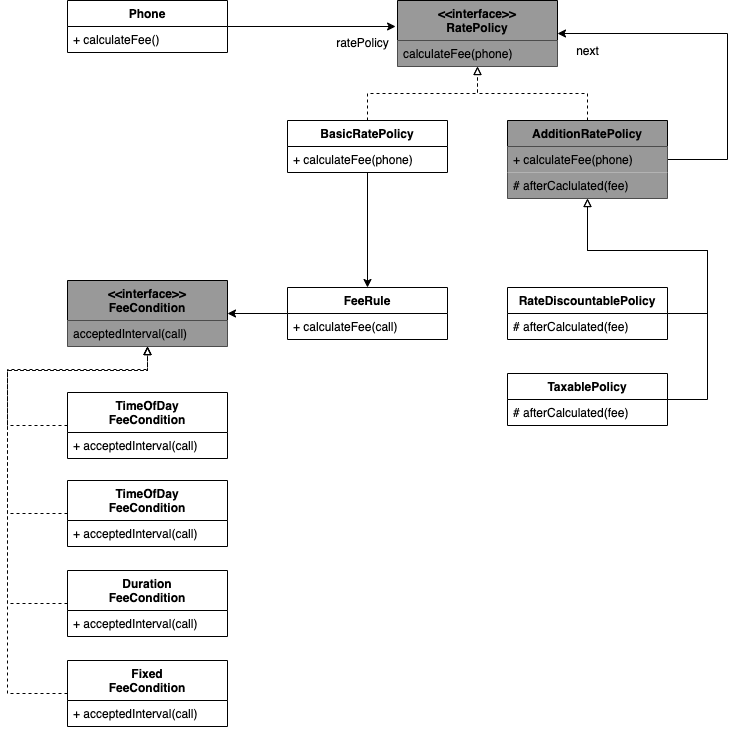
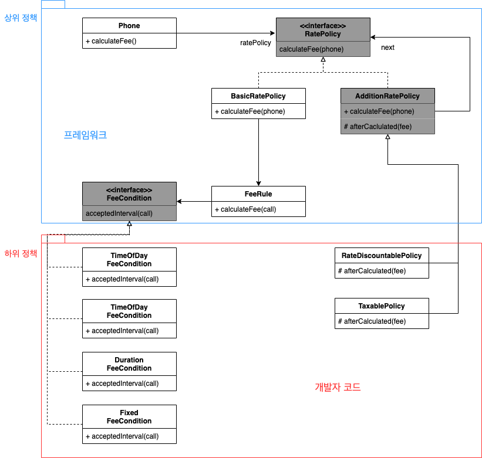
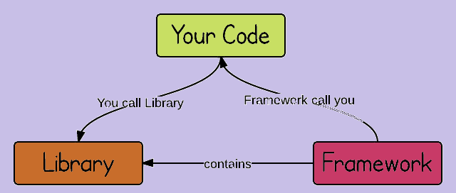

[오브젝트 - 코드로 이해하는 객체지향 설계](http://www.yes24.com/Product/Goods/74219491?OzSrank=1) 를 정리한 자료입니다.


# 목차

- [Chapter 15 디자인 패턴과 프레임워크](#chapter-15-디자인-패턴과-프레임워크)
  * [1 디자인 패턴과 설계 재사용](#1-디자인-패턴과-설계-재사용)
    + [1-1 소프트웨어 패턴](#1-1-소프트웨어-패턴)
    + [1-2 패턴 분류](#1-2-패턴-분류)
    + [1-3 패턴과 책임-주도 설계](#1-3-패턴과-책임-주도-설계)
    + [1-4 캡슐화와 디자인 패턴](#1-4-캡슐화와-디자인-패턴)
    + [1-5 패턴은 출발점이다](#1-5-패턴은-출발점이다)
  * [2 프레임워크와 코드 재사용](#2-프레임워크와-코드-재사용)
    + [2-1 코드 재사용과 설계 재사용](#2-1-코드-재사용과-설계-재사용)
    + [2-2 상위 정책과 하위 정책으로 패키지 분리하기](#2-2-상위-정책과-하위-정책으로-패키지-분리하기)
    + [2-3 제어의 역전](#2-3-제어의-역전)
  * [3 라이브러리 vs 프레임워크](#3-라이브러리-vs-프레임워크)
  * [4 정리](#4-정리)


# Chapter 15 디자인 패턴과 프레임워크

이번 챕터에서는 디자인 패턴과 프레임워크에 대해서 다룬다.


## 1 디자인 패턴과 설계 재사용


### 1-1 소프트웨어 패턴


#### 마틴 파울러의 "패턴" 정의

* GOF가 저술한 <GOF의 디자인 패턴>에 의해 패턴이 대중화된 이후 패턴은 매우 많이 나왔지만 패턴의 정의 역시 다양하고 풍부해졌다.
* 마틴 파울러는 다음과 같이 "패턴"을 정의하고 있다.
  * **하나의 실무 컨텍스트에서 유용하게 사용해 왔고 다른 실무 컨텍스트에서도 유용할 것이라고 예상되는 아이디어다.**
  * 패턴으로 인정하기 위한 조건으로 **'3의 규칙'**을 들 수 있다. **최소 세 가지의 서로 다른 시스템에 특별한 문제 없이 적용할 수 있어야 한다는 것.**
  * 패턴은 경험의 산물이다.


### 1-2 패턴 분류


#### 패턴은 크게 네 가지로 나눌 수 있다

* 아키텍처 패턴
  * 소프트웨어의 전체적인 구조를 결정하기 위해 사용할 수 있는 패턴.
  * 아키텍처 패턴은 **미리 정의된 서브 시스템들을 정의하고, 각 서브 시스템들의 책임을 정의하며, 서브 시스템들 사이의 관계를 조직화하는 규칙과 가이드라인을 포함**한다.
  * 예시
    * 계층화 패턴
    * 클라이언트 - 서버 패턴
* 분석 패턴
  * **도메인 모델링 시에 발견되는 공통적인 구조**를 표현하는 개념들의 집합
* 디자인 패턴
  * 특정 정황 내에서 일반적인 설계 문제를 해결하며, **협력하는 컴포넌트들 사이에서 반복적으로 발생하는 구조**를 서술한다.
* 이디엄
  * **특정 프로그래밍 언어에만 국한된 하위 레벨 패턴.**


### 1-3 패턴과 책임-주도 설계


#### 디자인 패턴의 구성요소는 클래스가 아닌 역할과 책임이다

* 패턴의 구성요소는 클래스가 아니라 '역할'이다.
* **역할, 책임, 협력의 관점에서 유사성을 공유한다는 것.** 
  * 구현 방식을 강제하는 것이 아니다.


#### COMPOSITE



* COMSITE 패턴이란?
  * 객체들의 관계를 트리 구조로 구성하여 부분 - 전체 계층을 표현하는 패턴으로, 사용자가 단일 객체와 복합 객체 모두 동일하게 다루도록 한다.



* 위와 같이 트리 구조처럼 부분 - 전체 계층을 표현 할 수 있다.
* 예시 - 파일, 디렉토리
  * Component - 모든 표현할 요소들의 추상적인 인터페이스 (`Node`)
  * Leaf - Component를 구현한 자식이 없는 요소 (`Leaf`)
  * Composite - Component 요소를 자식으로 가지는 요소. (`Directory`)

```java
// 파일과 디렉토리의 근간. Component 역할을 한다.
interface Node {
  public String getName();
}

// File은 자식 요소를 가질 일이 없으므로 Leaf 역할을 한다.
class File implements Node {
  private String name;
  ...
    
  @Override
  public String getName {return name;}
}

// Directory는 자식 요소를 가져야 하므로 Composite 역할을 한다.
class Directory implements Node {
  private String name;
  private List<Node> children;
  
  ...
    
  @Override
  public String getName() {return name;}
  public void add(Node node) {
    children.add(node);
  }
  ...
}
```

```java
Directory rootDir = new Directory();
rootDir.add(new File()); // 디렉토리에 파일 삽입
rootDir.add(new Directory()); // 디렉토리에 디렉토리 삽입
```


#### COMPOSITE를 보면 패턴의 구성 요소는 클래스가 아니라 "역할"이라는 것을 알 수 있다.

* **패턴의 구성 요소인 Component, Coposite, Leaf는 클래스가 아니라 협력에 참여하는 객체들의 집합이다.**
* 이전의 나왔던 Movie와 DiscountPolicy의 관계가 바로 COMPOSITE 패턴이다.


### 1-4 캡슐화와 디자인 패턴


#### 디자인 패턴의 목적은 특정한 변경을 캡슐화함으로써 유연한 설계를 공유하는 것.

* 대부분의 디자인 패턴의 목적은 특정한 변경을 캡슐화함으로써 유연하고 일관성 있는 협력을 설계할 수 있는 경험을 공유하는 것이다.
* **디자인 패턴에서 중요한 것은 구현 방법이나 구조가 아니다. 어떤 변경을 캡슐화 하는지를 이해하는 것이 중요하다.**


#### DECORATOR

* DECORATOR 패턴이란
  * 주어진 상황 및 용도에 따라 **어떤 객체에 책임을 덧붙이는 패턴으로, 기능 확장이 필요할 대 서브 클래싱 대신 쓸 수 있는 유연한 패턴.**
  * 즉, 탈부착 가능한 책임을 정의할 때 사용한다.
* 사용 예시
  * java.io
  * **핸드폰 요금제 계산**



* 역할
  * Component
    * **기본 기능을 뜻하는 ConcreteComponent와 추가 기능을 뜻하는 Decorator의 공통 기능을 정의**
    * 클라이언트는 Component를 통해 실제 객체를 사용한다.
  * ConcreteComponent
    * **기본 기능을 구현하는 클래스**
  * Decorator
    * 많은 수가 존재하는 구체적인 Decorator의 공통 기능을 제공
  * ConcreateDecorator A, B
    * **Decorator의 하위 클래스로 기본 기능에 추가되는 개별적인 기능.**
    * **합성관계를 통해 기본 기능을 사용.**


#### DECORATOR와 같이 캡슐화를 통해 설계를 유연하게 할 수 있다.

* 그 외에도 여러 패턴들이 있다.
  * 전략 패턴
  * 템플릿 메서드 패턴 등등


### 1-5 패턴은 출발점이다


#### 패턴은 출발점이다 맹목적으로 사용하지 말고 상황에 맞게 적절하게 수정하라

* 패턴을 사용하면서 부딪히게 되는 대부분의 문제는 패턴을 맹목적으로 사용하는 것이다.
  * 이를 **"패턴 만능주의"**라고 부른다. - 조슈아 케리에브스키 -
* 명확한 트레이드오프 없이 **패턴을 남용하면 설계가 불필요하게 복잡해지게 된다.**
* **패턴은 출발점이다. 패턴은 공통적인 문제에 적절한 해법을 제공하지만 공통적인 해법이 우리가 직면한 문제에 적합하지 않을 수도 있다. 문제를 분석하고 창의력을 발휘함으로써 패턴을 현재의 문제에 적합하도록 적절하게 수정하다.**


## 2 프레임워크와 코드 재사용


### 2-1 코드 재사용과 설계 재사용


#### 디자인패턴 == 설계 재사용

* 디자인 패턴은 **언어에 독립적인 설계 재사용 방법**이다.
  * 디자인 패턴은 프로그래밍 언어에 **독립적으로 재사용 가능한 설계 아이디어를 제공하는 것을 목적**으로 한다.
* 단점
  * **언어에 종속적이다.** 언어가 변경되면 언어의 특성에 맞춰 가공해줘야한다.


#### 이상적인 재사용 방법 == 코드 재사용 + 설계 재사용

* 가장 이상적인 재사용 방법
  * **가장 이상적인 재사용 방법**은 **코드 재사용과 설계 재사용을 적절하게 조합하는 것이다.**
* 디자인 패턴의 문제
  * 추상적인 수준에서의 설계 재사용을 강조하는 **디자인 패턴은 재사용을 위해 매번 유사한 코드를 작성해야만 한다.**
* **프레임워크가 바로 이상적인 재사용 방법이다.**
  * **설계를 재사용하면서도 유사한 코드를 반복적으로 구현하는 문제는 피하기 위해 나온 것이 프레임워크이다.**


#### 프레임워크란

* 일반적인 정의
  * **추상 클래스나 인터페이스를 정의하고 인스턴스 사이의 상호작용을 통해 시스템 전체 혹은 일부를 구현해 놓은 재사용 가능한 설계**
  * 애플리케이션 개발자가 현재의 요구사항에 맞게 커스터마이징 할 수 있는 **애플리케이션의 골격.**
* 제어의 역전
  * 프레임워크는 **제어의 역전 개념이 적용된 대표적인 기술이다.**
  * **프레임워크는** 클래스와 객체들의 분할, 전체 구조, 클래스와 객체들 간의 상호 작용, 객체와 클래스 조합 방법, 제어 흐름에 대해 **미리 정의한다**. **애플리케이션 설계자는 애플리케이션에 종속된 부분에 대해서만 구현해주면 된다.**


### 2-2 상위 정책과 하위 정책으로 패키지 분리하기

프레임워크는 상위 정책과 하위 정책을 분리함으로써 코드의 재사용과 설계의 재사용을 구현한다.


#### 프레임워크의 핵심은 추상화

프레임 워크의 핵심은 추상화다. 추상화가 바로 일관성 있는 협력을 만드는 핵심 재료이기 때문이다.

<p align="center">

대부분의 의존성이 추상화를 향하는 일관성 있는 협력</p>

* **의존성 역전 원칙에 맞게 상위 정책과 세부 사항 모두 추상화에 의존하게 만들어라**
  * 상위 정책은 상대적으로 변경에 안정적이지만 세부 사항은 자주 변경된다.
  * 동일한 역할을 수행하는 객체들 사이의 협력 구조를 다양한 애플리케이션 안에서 재사용 하는 것이 핵심이다.
* 즉, 변하는 것과 변하지 않는 것을 서로 분리해야 한다.
  * **그리고 변하지 않는 것의 코드를 재사용해야한다.**


#### 상위 정책과 하위 정책의 분리



* **상위 정책과 하위 정책을 패키지로 분리하고 나면 상위 정책 패키지는 여러 애플리케이션에서 재사용할 수 있다.**
  * 상위 정책 - 프레임 워크 (도메인에 존재하는 핵심 클래스)
    * 전략패턴의 컨텍스트라고 생각하면 이해하기 쉽다.
  * 하위 정책 - 개발자 커스터마이징 코드
    * 전략 패턴의 전략이라고 생각하면 이해하기 쉽다.


### 2-3 제어의 역전

> 훌륭한 객체지향 설계는 의존성이 역전된 설계이다.


#### 제어의 역전이란

* 제어의 역전이란
  * 전통적인 프로그래밍에서 흐름은 **프로그래머가 작성한 프로그램이 외부 라이브러리의 코드를 호출해 이용한다**. 하지만 **제어 반전이 적용된 구조에서는 외부 라이브러리의 코드가 프로그래머가 작성한 코드를 호출한다.**
  * **의존성을 역전시킨 객체지향 구조에서는 프레임 워크가 애플리케이션에 속하는 서브 클래스의 메서드를 호출한다.**
* 의존성 역전 원리
  * **상위 계층(정책 결정)이 하위 계층(세부 사항)에 의존하는 전통적인 의존관계를 반전(역전)시킴으로써 상위 계층이 하위 계층의 구현으로부터 독립되게 할 수 있다**
    * 첫째, 상위 모듈은 하위 모듈에 의존해서는 안된다. **상위 모듈과 하위 모듈 모두 추상화에 의존해야 한다.**
    * 둘째, 추상화는 세부 사항에 의존해서는 안된다. **세부사항이 추상화에 의존해야 한다.**


#### 제어의 역전은 프레임워크의 가장 기본적인 설계 매커니즘이다

* 프레임워크에서 제어권은 프레임워크가 가지고 있는다.
  * 프레임 워크에서 협력을 제어 하는 것은 프레임워크이다.
  * **우리는 적절한 시점에 실행할 것으로 예상되는 코드를 작성할 뿐이다.**
* **제어가 우리에게서 프레임워크로 넘어가 버린 것이다.** 
  * 우리의 코드는 수동적인 존재가 되었다.


## 3 라이브러리 vs 프레임워크

<p align="center"><br>출처 : https://stackoverflow.com/questions/148747/what-is-the-difference-between-a-framework-and-a-library</p>

* 의미
  * 라이브러리 - **단순 활용가능한 도구들의 집합**
  * 프레임워크 - 뼈대, 기반 구조. **소프트웨어의 특정 문제를 해결하기 위해서 상호 협력하는 클래스와 인터페이스의 집합.**

* 제어권
  * **라이브러리를 사용할 때 제어권은 우리에게 있다.**
  * 프레임워크를 사용할 때 제어권은 프레임워크에게 있다. **우린 그저 프레임워크가 실행하는 메인 프로그램이 호출하는 코드를 작성하기만 하면 된다.**


## 4 정리 


* 디자인 패턴
  * 소프트웨어 설계에서 반복적으로 발생하는 문제에 대해 반복적으로 적용할 수 있는 해결 방법.
    * **설계를 재사용하는 것.**
  * 디자인 패턴의 목적은 설계를 재사용하는 것이다.
  * 협력 템플릿
* 프레임워크
  * **설계와 코드를 함께 재사용하기 위한 것.**
  * 프레임워크는 애플리케이션의 아키텍처를 구현 코드의 형태로 제공한다. 각 요구에 따라 적절하게 커스터마이징할 수 있는 확장 포인트를 제공한다.
  * 확장 가능한 코드 템플릿


