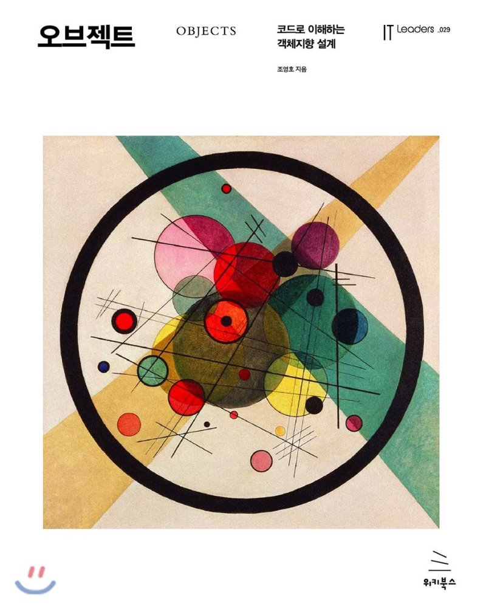

[오브젝트 - 코드로 이해하는 객체지향 설계](http://www.yes24.com/Product/Goods/74219491?OzSrank=1) 를 정리한 자료입니다.

# 목차

* [01 객체, 설계](https://github.com/binghe819/TIL/blob/master/OOP/%EC%98%A4%EB%B8%8C%EC%A0%9D%ED%8A%B8/01%20%EA%B0%9D%EC%B2%B4,%20%EC%84%A4%EA%B3%84.md)
* [02 객체지향 프로그래밍](https://github.com/binghe819/TIL/blob/master/OOP/%EC%98%A4%EB%B8%8C%EC%A0%9D%ED%8A%B8/02%20%EA%B0%9D%EC%B2%B4%EC%A7%80%ED%96%A5%20%ED%94%84%EB%A1%9C%EA%B7%B8%EB%9E%98%EB%B0%8D.md)
* [03 역할, 책임, 협력](https://github.com/binghe819/TIL/blob/master/OOP/%EC%98%A4%EB%B8%8C%EC%A0%9D%ED%8A%B8/03%20%EC%97%AD%ED%95%A0,%20%EC%B1%85%EC%9E%84,%20%ED%98%91%EB%A0%A5.md)
* [05 책임 할당하기](https://github.com/binghe819/TIL/blob/master/OOP/%EC%98%A4%EB%B8%8C%EC%A0%9D%ED%8A%B8/05%20%EC%B1%85%EC%9E%84%20%ED%95%A0%EB%8B%B9%ED%95%98%EA%B8%B0.md)

