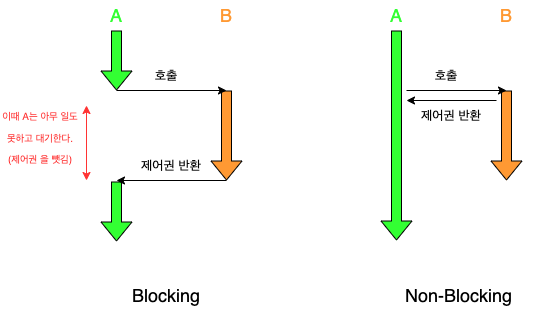
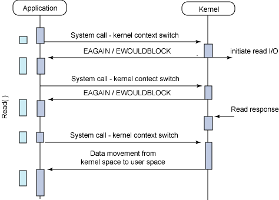
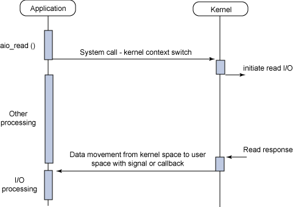

# 목차

<br>

- [목차](#목차)
- [Blocking, Non-Blocking and Synchronous, Asynchronous](#blocking-non-blocking-and-synchronous-asynchronous)
- [기본 Linux I/O 모델 Matrix](#기본-linux-io-모델-matrix)
- [개별적 개념](#개별적-개념)
  - [Blocking vs Non-Blocking](#blocking-vs-non-blocking)
  - [Synchronous vs Asynchronous](#synchronous-vs-asynchronous)
- [Blocking, Non-Blocking, Synchronous, Asynchronous의 조합](#blocking-non-blocking-synchronous-asynchronous의-조합)
  - [Synchronous Blocking](#synchronous-blocking)
  - [Synchronous Non-Blocking](#synchronous-non-blocking)
  - [Asynchronous Blocking](#asynchronous-blocking)
  - [Asynchronous Non-Blocking](#asynchronous-non-blocking)
- [정리](#정리)
- [참고](#참고)

<br>

# Blocking, Non-Blocking and Synchronous, Asynchronous
프로그래밍 관점에서 I/O 방식은 크게 4가지로 나뉜다. 블로킹, 논-블로킹 그리고 동기, 비동기.

아마 개발자라면 한번 쯤은 접하는 용어이다. 어쩌면 자주..? ㅎ

필자도 요즘 맡고있는 프로젝트의 성능과 관련해서 개편하다보니 자주 접하고있다.

대학생때부터 자주 접한 용어라 익숙하지만, 막상 설명하려고하면 쉽지 않은 개념이기도하다.

그리고 여러 개발자분들과 회의를 진행해본 결과.. 각자 조금씩 이해하고 구분하는 방법이 조금씩 다르며, 심지어 구글링하여 나오는 자료마다도 조금씩 다르게 말한다.

그래서 이번 글은 여러 자료를 참고하여 나의 언어로 어떻게 이 4가지를 구분하는지 정리해보려고한다.

<br>

# 기본 Linux I/O 모델 Matrix
<p align="center"><br>출처: https://developer.ibm.com/articles/l-async/ </p>

대부분의 이 주제를 다루는 글을보면 위 그림을 언급한다. 그만큼 4개의 개념을 하나의 그림으로 잘 설명하고있어서 그런 듯 하다.

하지만 위 그림은 2006년에 발표된 굉장히 오래된 그림이며, 그때는 비동기가 익숙하지않은 개념이었다고한다.

> 지금은.. 비동기 개념을 잘 모르면 개발을 못할 정도라고 생각든다..

그러므로 **위 그림처럼 블로킹/논블로킹, 동기/비동기를 위와 같이 조합할 수 있다는 것만 알고넘어가면 좋을 듯 하다.**

<br>

이번 글에선 대신 필자가 간단히 그려본 아래 그림을 이해하고 정리해보는 시간을 가져보려고한다.

<p align="center"> </p>

> 위 그림도 사실 인터넷에 비슷한 그림이 많다. 필자도 여러 그림을보고 이해한것을 정리해서 그렸다.

<br>

# 개별적 개념
위 그림을 이해하기에앞서 먼저 크게 두 그룹으로 나눠서 각각의 개념을 살펴본다.

* Blocking과 Non-Blocking
* Synchronous와 Asynchronous

<br>

## Blocking vs Non-Blocking

<br>

💁‍♂️ **사전적 의미**

`Blocking`이란 단어를 사전에 검색해보면 아래와 같이 나온다.

```
the action or fact of blocking or obstructing someone or somthing

누군가 또는 무언가를 막거나 방해하는 행위 또는 사실
```

**누군가의 행위로인해 무언가가 막혀버린 사실을 의미한다.**

쉽게 말하면, **누군가의 행위로인해 다른 누군가가 제한되거나 대기하는 상태를 의미한다.**

**반대로 `Non-Blocking`은 누군가의 행위로 인해 다른 누간가가 제한되지 않거나 대기하지 않는 상태를 의미한다.**

<br>

💁‍♂️ **컴퓨터로 해석하면..**

이를 컴퓨터로 해석하면 아래와 같다.

```
동기 - 하나의 함수(누군가)가 정해진 코드를 실행하는 과정에서, 다른 함수 (누군가)를 호출함으로써 제한되거나 대기하는 상태.

비동기 - 하나의 함수(누군가)가 정해진 코드를 실행하는 과정에서, 다른 함수 (누군가)를 호출하고도 제한되거나 대기하지 않는 상태.
```

그리고 **이는 제어권의 관점에서 이해하면 이해하기 쉽다.**

<br>

💁‍♂️ **호출한 입장에서의 제어권**

> **제어권 관점에서 Blocking/Non-Blocking은 호출되는 함수의 리턴여부가 관심사이다.**

<p align="center"> </p>

* **Blocking**
  * **호출된 함수가 요청한 작업을 모두 완료할 때까지 호출한 함수에게 제어권을 넘겨주지않고 대기하게 만든다.**
  * 호출한 함수는 호출된 함수가 모든 작업을 끝마칠때까지 아무일도 못하고 대기하게된다.
* **Non-Blocking**
  * **호출된 함수가 요청한 작업을 시작하기전에 바로 리턴해서 호출한 함수에게 제어권을 넘겨주고, 호출한 함수가 다른 일을 할 수 있게한다.**
  * 호출한 함수는 호출된 함수가 모든 작업을 끝마칠때까지 기다리지않고 다음 작업을 수행한다.

> * Blocking: 제어권 하나
> * Non-Blocking: 제어권 하나 이상

<br>

## Synchronous vs Asynchronous

<br>

💁‍♂️ **사전적 의미**

`Synchronous`이란 단어를 사전에 검색해보면 아래와 같이 나온다.

```
happening, moving, or existing at the same time

동시에 발생, 이동 또는 존재
```

**동시 즉, 동시간대에 같이 이루어지는 두 개 이상의 개체 혹은 이벤트를 의미한다.**

<br>

💁‍♂️ **컴퓨터로 해석하면..**

이를 컴퓨터로 해석하면 아래와 같다.

```
동기 - 하나의 함수(누군가)가 다른 함수 (누군가)를 호출하고 그 함수의 결과를 기다리거나 작업 완료 여부를 기다림.

비동기 - 하나의 함수(누군가)가 다른 함수 (누군가)를 호출하고 그 함수의 결과를 기다리지않으며, 작업 완료 여부도 기다리지않음.
```

그리고 이는 **call의 완료를 기다리는 관점에서 이해하면 이해가 쉽다.**

<br>

💁‍♂️ **call의 완료를 기다리는 관점**

* **Synchronous**
  * **호출되는 함수의 작업 완료를 호출한 함수가 신경쓰면 Synchronous라고 볼 수 있다.**
    * **`호출된 함수(B)`의 수행 결과 및 리턴을 `호출한 함수(A)`가 기다리거나 신경쓰는 것.**
  * 물론 Non-Blocking이여서 `호출된 함수(B)`로부터 바로 제어권을 받더라고, `호출한 함수(A)`가 `B`의 작업 완료 여부 및 리턴을 기다리거나 신경쓰면 동기다.
  * A라는 행위와 B라는 행위가 순차적으로 작동한다면 동기라고 볼 수 있다.
    * A라는 행위가 별개의 것이 아니라, B라는 행위를 관찰하는 행위라면 이것이 동시에 일어나더라도 동기라고 본다.
    * A라는 쓰레드와 B라는 쓰레드가 따로 돌아간다고 해도, 어떤 하나의 행위가 다른 행위에 밀착되어 있다면 두 행위가 다른 쓰레드에서 벌어지더라도 동기를 의미한다.
  * **호출되는 함수의 작업 완료를 호출한 함수가 신경쓰면 동기이다. - 중요**
* **Asynchrnous**
  * **호출되는 함수의 작업 완료를 호출된 함수가 신경쓰면 Asynchronous라고 볼 수 있다.**
    * **`호출된 함수(B)`의 수행 결과 및 리턴을 `호출한 함수(A)`가 전혀 안 기다리거나 신경쓰지 않는다면 비동기이다.**
    * 대표적으로 callback 함수를 넘겨서 호출된 함수가 작업 완료후 callback을 실행시키는 것.
  * **호출되는 함수의 작업 완료를 호출된 함수가 신경쓰면 비동기이다. - 중요**
    * 호출된 함수가 자신의 작업을 완료하고 넘겨받은 callback함수를 실행하는 것이 대표적이다.
    * 이때, **호출된 함수가 자신의 작업을 완료하고 호출한 함수에게 알림을 줄 수 있는데, 이것 또한 비동기라고 볼 수 있다.**
      * 예를 들어, **Asynchronous는 보통 별도의 스레드로 뺴서 실행하고, 완료되면 호출하는 측에 알려주는 것이다.**
      * 이때, **호출한 함수에선 결과를 계속 궁금해하진않지만, 호출된 함수가 그저 알려주는 것 뿐이다.**

> * 동기: 하나 혹은 두 개의 제어권이 하나의 일 신경씀.
> * 비동기: 하나 혹은 두 개의 제어권이 하나 이상의 서로 다른 일을 신경씀.

> 동기와 비동기는 처리되는 방식의 특징으로 이해해도 좋다.

<br>

> 동기 
> 

<br>

# Blocking, Non-Blocking, Synchronous, Asynchronous의 조합
Blocking과 Non-Blocking, 그리고 Synchronous와 Asynchronous의 개별적인 개념을 알았으니 이제 서로 조합된 상황을 코드와 함께 살펴본다.

<p align="center"><br>출처: https://developer.ibm.com/articles/l-async/</p>

<br>

## Synchronous Blocking

💁‍♂️ **설명**

가장 일반적인 조합이며, 하나의 제어권만 가지고 한 번에 한 가지의 일만 하는 것을 의미한다.

여러 가지의 작업을 순차적으로 하나의 제어권만을 가지고 처리하는 것이다.

<br>

💁‍♂️ **I/O 관점**

<p align="center"><br>I/O 관점에서의 Synchronous-Blocking <br>출처: https://developer.ibm.com/articles/l-async/ </p>

I/O 관점으로보면 하나의 Application에서 커널에 I/O 요청하고 Application은 제어권을 잃어 블록된 상태로 커털의 I/O 요청이 완료될 때까지 기다린다.

예를 들어, 하나의 Application이 사용자 입력을 받을때까지 대기된다면 이는 동기/블로킹이라고 볼 수 있다.

> 물론 사용자 입력을 받는동안 Application의 뒤에서 다른 스레드가 여러 작업을 실행한다면 말이 달라진다.

<br>

💁‍♂️ **자바로 살펴보는 예시**

간단히 자바 코드로보면 아래와 같다.

```java
public class SynchronousBlockingExample {

    public static void main(String[] args) throws InterruptedException {
        printAfterSeconds("Task A", 3000);
        printAfterSeconds("Task B", 2000);
        printAfterSeconds("Task C", 1000);
    }

    private static void printAfterSeconds(String text, long millis) throws InterruptedException {
        Thread.sleep(millis);
        System.out.println(text);
    }
}
```
실행 결과는 아래와 같다.

```
[main] Task A
[main] Task B
[main] Task C
```

실행 순서는 아래와 같다.

1. 3초 sleep이후 Task A 출력
2. Task A가 출력되고나서 2초 sleep이후 Task B 출력
3. Task B가 출력되고나서 1초 sleep이후 Task C 출력

**실행결과와 순서를 보면 알 수 있듯이, 하나의 제어권안에서 세 가지의 Task를 순차적으로 진행한다.**

이를 `동기/블로킹`이라고보며, 굉장히 간단하며, 직관적이고 이해하기도 쉽다.

> 이해를 위해 하나의 스레드에서 간단히만 예시를 살펴보았다.

<br>

## Synchronous Non-Blocking

💁‍♂️ **설명**

Synchronous (동기)는 호출하는 함수가 호출되는 함수의 작업 완료 여부를 신경쓴다는 의미이고, Non-Blocking은 호출하는 함수가 다른 함수를 호출해도 바로 리턴 받아 제어권을 그대로 가지고있는 것이다.

이를 조합하면 **Non-Blocking 방식으로 함수를 호출하고 바로 반환 받아 다른 작업을 진행하지만, 함수 호출에 의해 수행되는 작업이 완료되었는지 호출하는 함수에서 계속해서 확인하는 것이다.**

> 자주 사용되지 않으므로 생각보다 이해하기가 쉽지않으므로 예시를 살펴보자.

<br>

💁‍♂️ **I/O 관점**

<p align="center"><br>I/O 관점에서의 Synchronous-Non-Blocking <br>출처: https://developer.ibm.com/articles/l-async/ </p>

I/O 관점으로보면 하나의 Application에서 커널에 I/O 요청하지만, Application은 제어권을 그대로 가지고있으며, 중간중간 Application이 커널에 I/O 요청이 완료되었는지 확인하면서 기다린다.

중요한 점은 Application은 I/O 요청을하고도 제어권을 가지고있으므로, 계속해서 자신의 일을 수행할 수 있다. 단, 수행하면서 커널에 요청한 I/O 작업이 완료되었는지 지속적으로 확인한다.

<br>

💁‍♂️ **자바로 살펴보는 예시**

Synchronous Non-Blocking이 어디에 사용될까....해서 여러가지 자료를 찾아보니 자바에선 `Future.isDone()`로 알아볼 수 있을듯하다.

```java
public class SynchronousNonBlockingExample {

    public static void main(String[] args) throws InterruptedException, ExecutionException {
        ExecutorService es = Executors.newCachedThreadPool();

        // Task A 비동기 실행 - 10초동안 I/O 작업하는 Task (라고 생각하자)
        System.out.println("Task A 실행 시작!");
        Future<String> task_a = es.submit(() -> returnValueAfterSeconds("Task A (Kernel I/O)", 10_000));

        // Task A가 종료되었는지 확인
        while(!task_a.isDone()) {
            System.out.println("Task A가 완료되었는지 계속 확인.");
            // Task A가 완료되지않아도 여기에서 다른 작업을 계속 수행.
            printAfterSeconds("Task B (Application 작업)", 2_000);
        }

        // Task A의 작업이 완료되면 작업 결과에 따른 다른 작업 처리.
        System.out.println(task_a.get() + " 실행 종료!");

        es.shutdown();
    }

    private static void printAfterSeconds(String text, long millis) throws InterruptedException {
        Thread.sleep(millis);
        System.out.println(text);
    }

    private static String returnValueAfterSeconds(String text, long millis) throws InterruptedException {
        Thread.sleep(millis);
        return text;
    }
}
```

실행 결과는 아래와 같다.

```
Task A 실행 시작!
Task A가 완료되었는지 계속 확인.
Task B (Application 작업)
Task A가 완료되었는지 계속 확인.
Task B (Application 작업)
Task A가 완료되었는지 계속 확인.
Task B (Application 작업)
Task A가 완료되었는지 계속 확인.
Task B (Application 작업)
Task A가 완료되었는지 계속 확인.
Task B (Application 작업)
Task A (Kernel I/O) 실행 종료!
```

결과에서 알 수 있듯이, Application (Main 스레드이며 `Task B`를 처리)는 `Task A`를 실행하고, `Task A`의 처리 결과를 계속 확인하면서 자신이 처리하는 `Task B`도 처리하는 것을 볼 수 있다.

> 위 예시는 예시일 뿐, 실무에선 상황에 맞는 방법을 사용하는 것이 좋다.

<br>

## Asynchronous Blocking

💁‍♂️ **설명**

Asynchronous (비동기)는 호출하는 함수가 호출되는 함수의 작업 완료 여부를 신경쓰지 않는다는 의미이고, Blocking은 호출하는 함수가 다른 함수를 호출하고 제어권을 잃고 기다리는 것이다.

> 물론 호출된 함수가 자신의 작업을 완료하고 호출한 함수에게 알림을 줄 수 있는데, 이것 또한 비동기라고 볼 수 있다.

이를 조합하면, Blocking 방식으로 함수를 호출해 호출되는 함수에 제어권을 넘겨주며, 함수 호출에 의해 수행되는 작업이 완료되었는지 호출하는 함수에서 전혀 신경쓰지 않는다.

> 호출한 함수가 Blocking되고, 호출된 함수가 작업 완료를 호출한 함수에게 알려주는 방식의 Asynchronous라면 사실 처리방식이  Synchronous-Blocking과 성능상 다를게없다.

<br>

🤔 **전혀 사용될 이유가 없어보이는데 언제 사용될까?**

제어권은 넘겨주면서.. 함수 호출에 수행되는 작업의 완료여부를 신경쓰지 않는다?.. 사실 의도적으로 사용할 이유는 전혀없다.

하지만 **Asynchronous Non-Blocking 방식으로 사용중인 로직에서 하나라도 Blocking으로 동작하는 부분이 포함되어있다면 의도치않게 Asynchronous Blocking으로 동작할 수 있다.**

**대표적으로 여러 언어들의 MySQL 클라이언트 모듈과 MySQL의 조합이다**. (ex. JDBC, pymysql, Node.js 등등)

**예를 들어, Asynchronous Non-Blocking로 동작하는 애플리케이션 서버에서 UPDATE나 DELETE문을 DB에 요청해야한다면, 사실상.. 서버에서 요청하는순간 애플리케이션 서버는 Blocking이 되어버린다.**

**그리고 DB에서 요청한 쿼리 작업을 완료하고 애플리케이션 서버에 결과를 알려준다 (callback처럼 준다고 볼 수 있다.). 이때 애플리케이션은 Blocking이 풀리게된다.**

결국은 **MySQL에서 Asynchronous Non-Blocking을 제대로 지원해주지않기때문에, 이를 사용하는 클라이언트가 아무리 Non-Blocking 방식으로 처리한다고해도 Blocking이 되어버리는 것이다.**

> 일부러 이러한 조합을 사용할 이유는 없어보인다.. 특히 성능이 중요한 곳엔 적합하지않다. (물론 그럼에도.. 많은 서버에서 DB 접속을 위해 어쩔 수 없이 사용한다..)

<br>

💁‍♂️ **I/O 관점**

<p align="center"><br>I/O 관점에서의 Asynchronous-Blocking <br>출처: https://developer.ibm.com/articles/l-async/ </p>

I/O 관점으로보면 하나의 Application에서 커널에 I/O 요청하면서 제어권은 커널에 넘겨준다. 

단, 이때 Asynchronous이므로 커널의 I/O 처리 결과를 알려주기전까진, Application에서 굳이 이를 알 필요가없으므로 제어권을 다시 Application에게 반환한다. Application은 제어권만 가질 뿐 Blocking된다.

커널은 요청받은 I/O 작업을 완료후 Application에게 알림을 준다. Application은 이때 Blocking이 풀리며 커널로부터 받은 알림을 바탕으로 I/O의 결과를 가져온다.

> 그림을 통해 알겠지만, **Asynchronous Blocking은 Asynchronous Non-Blocking처럼 동작하는 과정에서 하나라도 Blocking으로 동작하는 경우라고 보면 이해하기가 쉽다.**
> 
> 즉, Task를 요청할 땐 Non-Blocking처럼 하지만, 해당 Task가 완료되고 호출된 함수에서 신호를 주기전까진 Blocking이된다.

<br>

💁‍♂️ **자바로 살펴보는 예시**

간단한 예시를 살펴보면 자바의 `Future.get()`을 잘못사용하면 Asynchronous-Blocking되는 코드가 될 수 있다.

```java
public class AsynchronousBlockingExample {

    public static void main(String[] args) throws ExecutionException, InterruptedException {
        ExecutorService es = Executors.newCachedThreadPool();

        // Non-Blocking 방식처럼 Task 요청.
        Future<String> taskA = es.submit(() -> {
            Thread.sleep(3000);
            return "Task A Completed";
        });

        // Task 요청하자마자 Blocking 되어 TaskA가 완료되어 신호를 주기전까지 계속 Blocking 상태가된다.  
        String taskAResult = taskA.get();
        System.out.println(taskAResult);

        es.shutdown();
    }
}
```

위 예시가 좋은 예시라고 생각하진 않으며, 실제로 `Future`로 비동기 처리시 위와같이 비효율적으로하진 않을 것이다.

왜냐하면 위 코드는 Synchronous Blocking으로 동작하는 코드와 다를바가 없기때문이다.

그래도 Asynchronous Blocking을 이해하는데 도움이 되었으면해서 생각을 쥐어짜서.. 넣어봤다.

> 이외에도 구현에 따라 I/O Multiplexing이 Asynchronous Blocking 방식의 좋은 예시라고 볼 수 있다.
>
> 물론 I/O Multiplexing에선 Non-Blocking처럼 동작하다가 알림만 블로킹으로 받도록 설계하는 경우가 대부분이다.
> 
> ex. JAVA NIO, Linux select, poll등등

<br>

## Asynchronous Non-Blocking

💁‍♂️ **설명**

Asynchronous (비동기)는 호출하는 함수가 호출되는 함수의 작업 완료 여부를 신경쓰지 않는다는 의미이고, Non-Blocking은 호출하는 함수가 다른 함수를 호출해도 바로 리턴 받아 제어권을 그대로 가지고있는 것이다.

이를 조합하면, Non-Blocking 방식으로 함수를 호출하고 바로 반환 받아 다른 작업을 진행하지만, 함수 호출에 의해 수행되는 작업이 완료되었는지 신경쓰지 않는 것이다.

대표적인 예시는  Callback이다. Non-Blocking으로 함수를 호출할 때 Callback도 같이넘기는 방식이다.

> Task를 처리하는데 가장 성능좋고 효율적인 방식이라고 볼 수 있다.

<br>

💁‍♂️ **I/O 관점**

<p align="center"><br>I/O 관점에서의 Asynchronous-Non-Blocking <br>출처: https://developer.ibm.com/articles/l-async/ </p>

I/O 관점으로보면 하나의 Application에서 커널에 I/O 요청하면서 제어권을 넘겨주지않으며, 커널의 I/O 작업 진행사항이나 완료 여부를 전혀 궁금해하지않는다.

I/O 작업을 요청한 Application은 자신의 일을 계속 제어권을 가지고 진행하며, 커널이 I/O 작업이 완료된 경우 callback으로 시그널을 줘서 Application에 알려주거나 Task 요청시 넘겨받은 Callback을 실행하기만한다.

<br>

💁‍♂️ **자바로 살펴보는 예시**

Asynchronous Non-Blocking 예시는 사실 굉장히 많다.. 로그 기록, AJAX 요청, JS 비동기 콜백등등..

이번 글에선 간단히 Non-Blocking으로 작업을 요청후 해당 작업을 전혀 신경쓰지않는 굉장히 간단한 예시를 남겨둔다.

```java
public class AsynchronousNonBlockingExample {

    public static void main(String[] args) throws InterruptedException {
        ExecutorService es = Executors.newCachedThreadPool();

        System.out.println("Task A 실행 시작!");

        // Non-Blocking으로 작업 요청.
        es.execute(() -> {
            // 아래 작업의 완료 여부는 Main 스레드가 전혀 신경쓰지 않는다. (결과가 전혀 필요없으므로)
            try {
                System.out.println("Task B 실행");
                Thread.sleep(1_000);
                System.out.println("Task B 완료");
            } catch (InterruptedException e) {
                e.printStackTrace();
            }
        });

        System.out.println("Task A 작업은 계속 진행");
        System.out.println("Task A 작업은 계속 진행");
        System.out.println("Task A 작업은 계속 완료");
        es.shutdown();
    }
}
```

<br>

# 정리
* **Blocking vs Non-Blocking**
  * 제어권 관점에서 Blocking/Non-Blocking은 호출되는 함수의 리턴여부가 관심사이다
  * 함수 호출후 바로 리턴되지 않으면 Blocking
  * 함수 호출후 바로 리턴되면 Non-Blocking
* **Synchronous vs Asynchronous**
  * 호출되는 함수의 작업 완료 여부를 누가 신경쓰느냐가 관심사이다.
  * 호출되는 함수의 작업 완료를 호출한 함수가 신경쓴다면 Synchronous
  * 호출되는 함수의 작업 완료를 호출되는 함수가 신경쓴다면 Asynchronous

<br>

# 참고
* https://developer.ibm.com/articles/l-async/
* https://pediaa.com/what-is-the-difference-between-synchronous-and-asynchronous-calls-in-java/
* https://homoefficio.github.io/2017/02/19/Blocking-NonBlocking-Synchronous-Asynchronous/#
* https://musma.github.io/2019/04/17/blocking-and-synchronous.html
* https://interconnection.tistory.com/141
