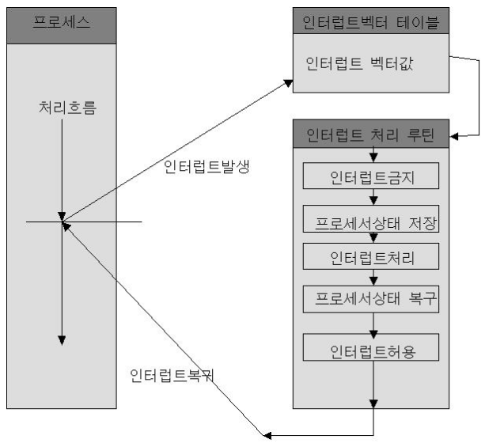

# 목차

 

- [목차](#목차)
- [1 운영체제의 정의](#1-운영체제의-정의)
- [2 운영체제 기능](#2-운영체제-기능)
- [3 운영체제 분류](#3-운영체제-분류)
- [4 운영체제의 자원 관리 가능](#4-운영체제의-자원-관리-가능)
  - [4-1 CPU 스케줄링](#4-1-cpu-스케줄링)
  - [4-2 메모리 관리](#4-2-메모리-관리)
  - [4-3 인터럽트](#4-3-인터럽트)
  - [4-4 컨트롤러](#4-4-컨트롤러)
- [참고](#참고)

 

# 1 운영체제의 정의

 출처: 운영체제 (공룡책)

* 운영체제란?
  * 컴퓨터 하드웨어 바로 윗단에 설치되는 소프트웨어를 뜻한다.
  * **컴퓨터 하드웨어와 소프트웨어, 사용자의 사이에서 중재자 역할**을 한다.
  * 컴퓨터 시스템의 기본 목표는 프로그램을 실행하고 사용자가 쉽게 이용할 수 있게 하는 것이다. 프로그램을 개발 및 실행하기 위해서는 **입출력 장치 제어**와 같은 **특정 공통 작업**이 필요하다. **자원을 제어하고 할당하는 일반적인 기능은 운영체제라는 하나의 소프트웨어로 통합된다.**
* 용어의 의미
  * 운영 체제 (Operation System)
    * **좁은 의미의 운영체제**
      * 커널 (운영체제 코드 중에서도 핵심적인 부분)
    * **넓은 의미의 운영체제**
      * 커널뿐만 아니라 시스템을 위한 유틸리티들을 광범위하게 포함한다. ex. 윈도우 환경에서 파일을 복사하는 프로그램 등이 해당된다.
  * **시스템(System)의 의미는 하드웨어가 운영체제와 한 몸이 되어야만 진정한 컴퓨터 시스템이 되기 때문이다.**
  * 즉, **전원을 켰을 때 운영체제가 없으면 컴퓨터는 그저 고철 덩어리에 불과하다.**
* 커널(kernel)이란?
  * 운영체제도 하나의 소프트웨어로 전원이 켜짐과 동시에 메모리에 올라간다.
  * **이렇게 메모리에 상주하는 운영체제의 부분을 커널(kernel)이라고 부르며, 좁은 의미의 운영체제라고 부른다.**
  * 즉, **운영 체제 = 커널 (핵심 부분) + 시스템 유틸리티**

 

# 2 운영체제 기능

 출처: 운영체제와 정보기술의 원리

* **하드웨어를 위한 역할**  -> (자원들을 효율적으로 관리해 가장 좋은 성능을 내도록 하는 역할)
  * 자원: CPU, 메모리, 하드디스크, 소프트웨어를 통틀어 칭한다.
  * **사용자가 다루기 힘든 각종 하드웨어를 운영체제가 관리하는 역할을 담당한다.**
  * 사용자 및 프로그램들 간에 자원이 형평성 있게 분배되도록 하는 균형자 역할도 함께 수행된다.
* **사용자를 위한 역할**   -> (사용자가 직접 다루기 힘든 각종 하드웨어를 쉽게 도와주는 인터페이스 역할)
  * **추상화된 컴퓨터 시스템.**
  * 또한, 사용자를 위한 편리한 인터페이스를 제공하는 역할을 담당한다.
  * ex. **사용자는 파일이 디스크에 어떻게 저장되는지 모르지만, 운영체제가 제공하는 편리한 인터페이스를 통해 파일을 손쉽게 저장하거나 파일의 내용을 꺼내볼 수 있다.**
* 사용자 및 보안
  * 악의성 프로그램이 운영체제에 올라가면 치명적인 악영향을 끼칠 수 있기 때문에, 보안 및 보호 기능.
  * 악성 프로그램의 메모리 영역 참조, private 파일 접근등을 보안적으로 막아준다.

 

# 3 운영체제 분류

**동시작업 기준**
* **단일작업용 운영체제**
  * 한 번에 하나의 프로그램만 실행시킬 수 있는 운영체제. (ex. DOS)
* **다중작업용 운영체제**
  * 한 번에 여러개의 프로그램을 사용할 수 있는 운영체제. (ex. 현대 컴퓨터, 메일 서버, 웹 서버등등)
  * **여러 프로그램이 동시에 CPU와 메모리를 공유하게 된다.**
    * 정확히는 **시분할 시스템(병행 처리) -> CPU의 작업시간을 여러 프로그램들이 조금씩 나누어 쓰는 시스템**
    * 또한, **메모리 공간을 여러 프로그램들을 동시에 올려놓고 처리하며, 이를 다중 프로그래밍 시스템**이라 부른다.

 

**사용자 기준**
* 단일 사용자용 운영체제
  * 한 번에 한 명의 사용자만이 사용하도록 허용하는 운영체제
* 다중 사용자용 운영체제
  * 여러 사용자가 동시에 접속해 사용할 수 있게 하는 운영체제

 

**작업을 처리하는 방식 기준**
* **배치 처리**
  * 작업을 일정량씩 모아서 한꺼번에 처리하는 방식.
  * 작업 처리 요청하고 응답 시간이 길다.
* **시분할 처리**
  * 여러 작업을 수행할 때 컴퓨터의 처리 능력을 일정한 시간 단위로 분할해 사용하는 방식.
  * 작업 처리 요청하고 응답 시간이 짧다.
  * 현대 대부분의 컴퓨터가 시분할 처리를 사용한다고 한다.
* **실시간 처리**
  * 정해진 시간 안에 어떠한 일이 반드시 처리됨을 보장하는 방식.
  * 일정 시간 안에 작업이 안료되지 못할 경우에는 동작 자체가 되지 않거나 큰 위험을 초래할 가능성이 큰 경우 사용된다.
  * ex. 원자로, 공장 제어 시스템, 미사일 제어 시스템.

 

# 4 운영체제의 자원 관리 가능
> **운영체제의 가장 핵심적인 기능은 자원을 효율적으로 관리하는 것으로, 여기서 자원은 하드웨어 자원과 소프트웨어 자원으로 나뉜다.**

 출처: 운영체제와 정보기술의 원리

 

## 4-1 CPU 스케줄링
* **CPU 스케줄링이 필요한 이유**
  * CPU가 비교적 적은 기본적인 컴퓨터 구조에서도 여러 프로세스가 동시에 수행될 수 있어야 한다.
  * 그러므로 **매 시점 어떤 프로세스에 CPU를 할당해 작업을 처리할 것인지 결정하는 일이 필요하다.**
* **CPU 스케줄링의 목표**
  * CPU를 가장 효율적으로 사용하면서도, 특정 프로세스가 불이익을 당하지 않도록 하는 것.
* **CPU 스케줄링 기법 - 중요**
  * **선입 선출 (FIFO)**
    * **CPU를 사용하기 위해 도착한 프로세스들 중 먼저 온 것을 먼저 처리해주는 방식.**
    * 오래 걸리는 프로세스가 있다면 뒤에 대기 중인 프로세스가 너무 오래 기다려야한다. (비효율적)
  * **라운드 로빈**
    * 선입 선출의 단점을 보완하고자 고안된 기법.
    * **CPU를 한 번 할당받아 사용할 수 있는 시간을 일정하게 고정된 시간으로 제한하는 방식.**
    * 긴 시간이 걸리는 프로세스 때문에 짧은 시간이 필요한 프로세스가 오래 기다릴 필요가 없다.
  * 우선순위
    * **CPU 사용을 위해 대기 중인 프로세스들에 우선순위를 부여하고 우선순위에 따라 먼저 할당하는 방식.**

 

## 4-2 메모리 관리
* **메모리 관리가 필요한 이유**
  * 메모리는 한정된 공간이므로, 여러 프로그램을 수용하려면 효율적으로 동작해야한다.
  * 각 프로세스가 자신의 메모리 영역에만 접근할 수 있도록 관리해야한다. (침범하면 큰 일 난다!)
* **메모리 관리의 특징**
  * 운영체제는 메모리 관리를 위해 **특정 프로그램이 어디 위치하는지 주소**를 통해 관리한다.

 

**메모리 관리 기법**

 출처: 운영체제와 정보기술의 원리

* 고정분할 방식
  * **물리적 메모리를 몇 개의 분할로 미리 나누어 관리**한다.
  * 나뉜 **각각의 분할에는 하나의 프로그램이 적재될 수 있다.**
  * 이 방식은 **융통성이 없다는 단점**이 있다. 
    * 동시 적재되는 최대 프로그램의 수가 분할 개수로 한정되기 때문이다.
    * 또한, 분할의 크기보다 큰 프로그램은 적재가 불가능하다.
    * 반대로, 분할의 크기보다 작은 프로그램가 적재되는 경우 해당 분할 내에 남은 영역이 발생(낭비)하게 된다. (내부 조각)

 

 출처: 운영체제와 정보기술의 원리

* 가변분할 방식
  * **매 시점 프로그램의 크기에 맞게 메모리를 분할해서 사용하는 방식.**
  * 분할의 크기 때문에 큰 프로그램이 실행이 제한되는 문제는 발생하지 않는다.
    * 단, 물리적 메모리의 크기보다 큰 프로그램은 여전히 실행 불가능하다.
  * 외부조각이 발생할 수 있다.
    * 프로그램에 할당되지 않았지만 그 크기가 작아 프로그램을 올리지 못하는 메모리 영역을 말한다.
    * 즉, 메모리 낭비가 발생하게 된다.

 

 출처: https://ko.wikipedia.org/wiki/가상_메모리

* **가상메모리 방식**
  * 현대 범용 컴퓨터에서 가장 널리 사용되는 메모리 관리 기법이다.
  * 물리적 메모리보다 큰 프로그램을 지원한다. (물리적 메모리가 1기가인데 2기가 프로그램을 실행할 수 있다)
    * 실행될 수 있는 프로그램의 크기는 가상메모리의 크기에 의해 결정된다.
    * 이유는 **프로그램의 사용되고 있는 부분만 메모리에 올리고, 나머지는 보조기억장치(하드)에 저장해두다가 필요할 때 적재하기 때문이다.**
    * 이때 사용되는 보조기억장치의 영역을 **스왑 영역**(swap area)이라 부른다.
* **가상 메모리의 원리**
  * **모든 프로그램은 물리적 메모리와는 독립적으로 0번지부터 시작하는 자신만의 가상메모리 주소를 갖는다.**
  * 운영체제는 이 가상메모리의 주소를 물리적 메모리 주소로 매핑하는 기술을 이용해 주소를 변환시킨 후 프로그램을 물리적 메모리에 올리게 된다.
* **페이징 기법**
  * **프로그램을 동일한 단위로 메모리를 나누는 기업을 페이징 기법이라고 한다.**
  * **프로그램을 동일한 크기의 작은 단위로 나누어 물리적 메모리와 스왑 영역에 일부분씩 저장할 때 작은 단위를 페이징이라 부른다.**

 

## 4-3 인터럽트

 출처: https://www.crocus.co.kr/1367

* **인터럽트란?**
  * 주변장치(입출력 장치 포함)는 CPU의 서비스가 필요한 경우에 신호를 발생시켜 서비스를 요청시킨다. 이때 발생시키는 신호를 인터럽트라고 부른다.
* **CPU와 인터럽트**
  * CPU는 평소에 CPU 스케줄링에 따라 자기에게 주어진 작업을 수행하다가 인터럽트가 발생하면 하던 일을 잠시 멈추고 인터럽트에 의한 요청 서비스를 수행한다.
  * ex. 키보드 입력
* **인터럽트 처리 루틴**
  * **인터럽트가 발생했을 때 해주어야 할 작업을 정의한 프로그램 코드를 말한다.**
  * **이것은 운영체제 커널 내에 존재하는 코드**로 CPU 스케줄링, 메모리 관리루틴 등 다양한 기능을 위한 커널 코드의 일부분이라고 보면 된다.

 

## 4-4 컨트롤러
* **컨트롤러란?**
  * 각 **주변장치**마다 그 장치에서 일어나는 업무를 관리하기 위한 **일종의 작은 CPU**를 의미한다.
  * 해당 장치에 대한 업무를 처리하고, 이를 메인 CPU에 인터럽트를 발생시켜 보고하는 역할을 한다.
* **예시**
  * **사용자로부터 키보드에 입력이 들어오면 키보드 컨트롤러가 인터럽트를 발생시켜 CPU에 그 사실을 알려주는 것.**

 

# 참고
* [운영체제와 정보기술의 원리](http://www.yes24.com/Product/Goods/90124877?OzSrank=1)
* [공룡책](http://www.yes24.com/Product/Goods/89496122?OzSrank=2)
* https://ko.wikipedia.org/wiki/가상_메모리
