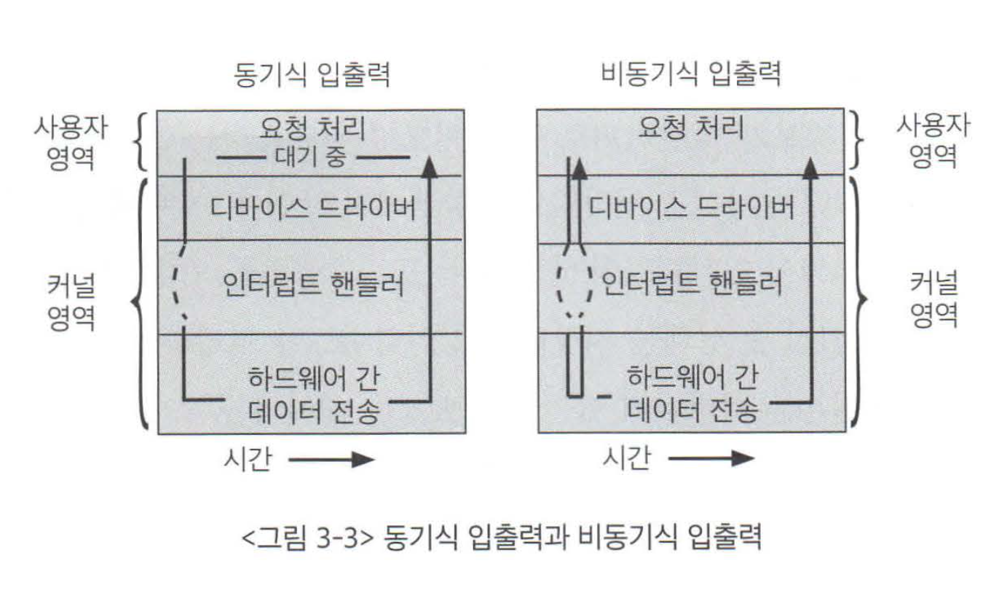
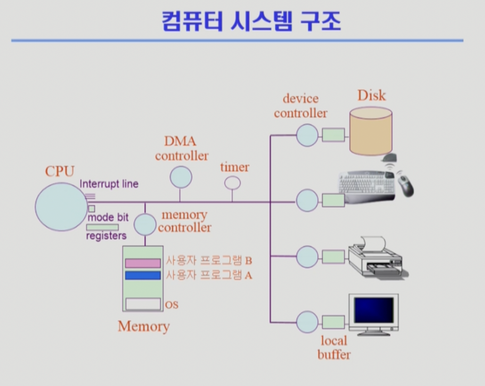
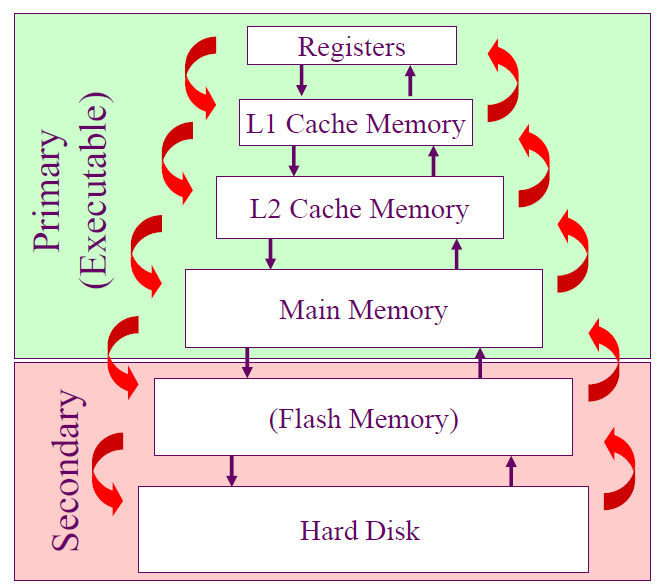
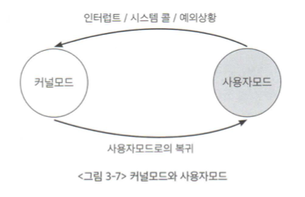
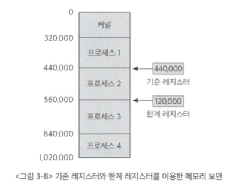

# 목차

 

- [목차](#목차)
- [1 컴퓨터 시스템의 구조](#1-컴퓨터-시스템의-구조)
- [2 CPU 연산과 I/O 연산](#2-cpu-연산과-io-연산)
- [3 인터럽트](#3-인터럽트)
  - [3-1 인터럽트의 일반적 기능](#3-1-인터럽트의-일반적-기능)
  - [3-2 인터럽트 핸들링](#3-2-인터럽트-핸들링)
- [4 입출력 구조](#4-입출력-구조)
  - [4-1 동기식 입출력](#4-1-동기식-입출력)
  - [4-2 비동기식 입출력](#4-2-비동기식-입출력)
  - [4-3 입출력 구조 예시](#4-3-입출력-구조-예시)
- [5 DMA](#5-dma)
- [6 저장장치](#6-저장장치)
- [7 하드웨어 보안](#7-하드웨어-보안)
- [8 메모리 보안](#8-메모리-보안)
- [9 CPU 보호](#9-cpu-보호)
- [10 시스템 콜을 이용한 입출력 수행](#10-시스템-콜을-이용한-입출력-수행)

 

# 1 컴퓨터 시스템의 구조

 출처: 운영체제와 정보기술의 원리

컴퓨터 시스템은 크게 내부장치와 외부장치로 구분할 수 있다.
* 내부 장치: CPU, 메모리 등
* 외부 장치: 디스크, 키보드, 마우스, 모니터, 네트워크 장치 등

 

🤔 Input, Output?
* Input (입력): 외부장치에서 내부 장치로 데이터를 읽어오는 과정.
* Output (출력): 입력으로 들어온 각종 연산을 수행하고 결과를 외부장치로 보내는 과정.

 

🤔 **각각의 장치들은 어떻게 통신을 하는 것일까?**

* 컨트롤러
  * **메모리 및 입출력장치 등 각 하드웨어 장치의 컨트롤러**를 이용하여 통신한다.
  * **컨트롤러**는 일종의 작은 CPU로서, 각 장치를 제어한다.
* 커널
  * 운영체제는 컴퓨터가 부팅될 때부터 항상 메모리에 올라가 있는다. 이 부분을 커널이라고 부른다.
  * 그리고 이 커널이 각종 자원들을 관리한다.

 

# 2 CPU 연산과 I/O 연산

 

🤔 연산
* 입출력 장치들의 I/O 연산은 **입출력 컨트롤러**가 담당.
* 컴퓨터 내에서 수행되는 연산은 **메인 CPU**가 담당.

 

💁‍♂️ 입출력 장치와 메인 CPU는 동시에 수행 가능한가?
* 두 가지 일이 다른 곳에서 발생하기 때문에 가능하다.
  * A는 하드디스크에서 어떠한 정보를 읽어오는 작업을 수행. (컨트롤러가 로컬 버퍼를 사용)
  * B는 CPU를 할당받아 코드를 수행. (CPU 사용)

 

🤔 로컬 버퍼 (local buffer)
* 장치 컨트롤러에서 장치로부터 들어오고 나가는 **데이터를 임시로 저장하기 위한 작은 메모리.**
* **장치 컨트롤러에서 데이터를 읽어와서 로컬 버퍼에 데이터를 임시 저장 후 메모리에 전달한다.**
  * **장치에서 로컬버퍼로 읽어오는 일은 컨트롤러가 담당한다.**
* **인터럽트**
  * **로컬버퍼로 읽어오는 작업이 끝났는지를 메인 CPU가 지속적으로 체크하는 것이 아니라 장치에 있는 컨트롤러가 인터럽트를 발생시켜 CPU에 보고하게 된다.**

 

> * **입출력 장치 컨트롤러**: 해당 장치의 연산을 수행하는 **CPU역할**.
> * **로컬 버퍼**: 해당 장치의 연산을 **메모리 역할**.

 

🤔 인터럽트 (interrupt)
* CPU에 보고할 이벤트가 일어난 경우 컨트롤러가 CPU에 보고하는 방법.
* 보통 CPU는 매 시점 메모리에서 명령을 하나씩 읽어와서 수행한다.
* 그리고 **CPU는 명령 하나를 수행할 때마다 인터럽트가 발생했는지 확인한다.**
  * **발생했다면 자신의 작업을 하던 중간에 멈추고 인터럽트와 관련된 일을 먼저 처리하게 된다.**
  * CPU 옆에 인터럽트가 들어왔는지 확인하는 인터럽트 라인이 있다.
* **쉽게 말하면 여러 장치들이 CPU의 작업이 필요할 때 발생시키는 이벤트다.**
  * 즉, CPU 작업이 필요할 대 장치 컨트롤러가 발생시키는 것.

 

# 3 인터럽트

 

## 3-1 인터럽트의 일반적 기능

 

💁‍♂️ **인터럽트 처리 루틴 (기능)**
1. 프로그램 A가 수행 중에 디스크에서 데이터를 읽어오라는 명령을 한다.
2. 디스크 컨트롤러가 물리적인 디스크에서 내용을 읽어 로컬 버퍼에 저장한다. (이때 CPU는 다른 일을 한다. 컨텍스트 스위칭)
3. 원하는 데이터를 다 읽어오면 장치에 있는 컨트롤러가 인터럽트를 발생시켜 CPU에 보고한다.
4. CPU는 하던 일을 멈추고, 이 인터럽트가 발생했을 때 수행하도록 정의된 코드를 찾아 수행한다.
   * 이때 로컬 버퍼에 있는 내용을 사용자 프로그램의 메모리로 전달하고, 해당 프로그램이 CPU를 할당받을 경우 다음 명령을 수행할 수 있음을 표시한다.

 

🤔 **인터럽트 처리 루틴**

**운영체제 커널은 인터럽트가 들어왔을 때 해야 할 일이 미리 프로그래밍되어 있는 코드를 보관하고 있는다.**

즉, **다양한 인터럽트에 대한 처리루틴(코드)를 저장하고 있다.**

 

 🤔 **인터럽트 벡터와 인터럽트 핸들러**

> 인터럽트가 발생하면 CPU는 하던 일을 멈추고 커널 내에서 해당 인터럽트의 처리르 위해 정의된 코드를 찾게 된다.

 * `key : value = 인터럽트 벡터 : 인터럽트 처리 루틴 (인터럽트 핸들러)`
 * 운영체제가 인터럽트 처리 코드를 쉽게 찾아가기 위해 인터럽트 벡터를 키로 사용한다.
 * 실제 처리해야 할 코드 인털럽트 핸들러라는 곳에 정의되어 있다.

 

💁‍♂️ 두 가지 인터럽트
* **두 인터럽트의 공통점**
  * **CPU의 서비스가 필요한 경우, CPU 옆에 인터럽트 라인에 신호를 보내 인터럽트를 발생시킨다.**
* **하드웨어 인터럽트**
  * 컨트롤러등 하드웨어 장치가 보내는 인터럽트.
  * **하드웨어 장치(컨트롤러, 또 다른 하드웨어 장치)가 CPU의 인터럽트 라인을 세팅한다.**
* **소프트웨어 인터럽트**
  * 소프트웨어가 보내는 인터럽트. (트랩이라고도 불린다.)
  * **소프트웨어 컨트롤러(메모리에 저장된 프로그램)가 CPU의 인터럽트 라인을 세팅한다.**
  * ex. 예외상황, 시스템 콜

> * 예외 사항
>   * 사용자 프로그램이 메모리 영역 바깥에 접근하려는 시도 등 예외가 발생할 때 발생되는 인터럽트. (비정상 요청, 권한없는 작업 요청)
> * 시스템 콜
>   * 사용자 프로그램이 운영체제 내부에 정의된 코드를 실행하고 싶을 때 운영체제에 서비스 요청하는 인터럽트. (ex. 입출력 요청)
> * **일반 함수 호출와 시스템 콜의 차이**
>   * 일반 함수 호출: 자신이 작성한 함수 혹은 라이브러리등 유저가 작성한 함수 호출.
>   * 시스템 콜: 커널 영역의 함수 호출.

 

## 3-2 인터럽트 핸들링

 

🤔 인터럽트 핸들링이란?
* 인터럽트가 발생한 경우에 인터럽트 처리를 위해 CPU가 커널 코드를 실행시키는 것. (**운영체제가 미리 정의해 놓은 인터럽트 처리 코드**)
* 처리하는 루틴은 다음과 같다. (컨텍스트 스위칭)
1. **어떤 프로그램이 실행되던 중에 인터럽트가 발생하면 그 프로그램의 실행 상태를 PCB에 저장한 후 CPU의 제어권은 인터럽트 핸들러(처리 루틴)로 넘어가게된다.**
2. **인터럽트 처리가 끝나면 저장된 상태를 PCB로부터 CPU상에 복원해 인터럽트 당하기 직전의 위치부터 실행을 이어나간다.**

 

🤔  PCB (Process Control Block)이란?
* 현재 시스템 내에서 실행되는 프로그램을 관리하기 위한 자료구조.
* 구성
  * 프로그램이 실행 중이던 코드의 메모리 주소
  * 레지스터 값
  * 하드웨어 상태
  * ...

 

💁‍♂️  가장 중요한 한 마디: 운영체제는 인터럽트가 발생했을 때에만 CPU의 제어권을 획득한다.
* **컴퓨터 운영체제는 인터럽트가 발생할 때에만 실행된다. 인터럽트가 발생하지 않으면 제어권은 계속 사용자 프로그램.**
* 즉, **인터럽트 처리 루틴도 그저 운영체제가 미리 정의해 놓은 프로그램일 뿐이며, 인터럽트가 발생했을 때에만 실행된다.**

 

# 4 입출력 구조

 출처: 운영체제와 정보기술의 원리

🤔 입출력이란?

* 입출력이란 컴퓨터 시스템이 컴퓨터 외부의 주변장치들과 데이터를 주고받는 것을 의미한다.
* 크게 동기식 입출력 구조와 비동기식 입출력 구조를 사용한다.

 

## 4-1 동기식 입출력

🤔 **동기식 입출력?**

* **동기식 입출력이란?**
  * 어떤 프로그램이 입출력 요청을 했을 때 입출력 작업이 완료된 후에야 그 프로그램이 후속 작업을 수행하는 방식.
  * 예시
    * 디스크 읽기 요청하면 디스크 읽기가 완료되기까지 프로그램의 다음 명령을 수행하지 않고 기다린다.
    * 읽기 요청이 완료되어 인터럽트가 발생하면 CPU의 제어권을 프로그램이 갖고 다음 명령을 수행한다.
* **문제점**
  * **CPU는 입출력 연산이 끝날 때까지 인터럽트를 기다리며 자원 낭비를 한다.**
  * 따라서 CPU가 쉬지 않고 일할 수 있도록 다른 프로그램에 이양해야한다. (컨텍스트 스위칭)

 

🤔 CPU 자원 낭비를 줄이기 위해 어떻게 CPU를 다른 프로그램에 이양할까?

* 운영체제는 프로그램을 몇 가지 상태로 나눈다.
  * **입출력 중인 프로그램은 봉쇄 상태(blocked state)로 전환시켜둔다.**
  * **봉쇄 상태의 프로그램에게는 CPU를 할당해주지 않는다.**
  * 해당 프로그램의 입출력 처리가 완료되면 봉쇄 상태를 푼다.
* **그러므로 동기식이지만 다수의 입출력 연산이 동시에 요청되거나 처리 가능하다.**

 

🤔 동기화 문제도 있다. 어떻게 해결할까? -> 큐!

* 여러 프로그램에게 CPU를 이양한 경우 여러 프로그램이 동일한 곳에 접근해서 충돌할 위험이 있다.
  * ex. 프로그램 A와 B가 동일한 파일에 접근한다면, 동기화 문제가 발생한다. (일반적인 동기화 문제와 동일하다.)
* 입출력 요청의 동기화를 위해 장치별로 큐를 두어 이를 방지한다.
  * 먼저 요청한 작업별로 차례차례 처리한다. 즉, 큐에 있는 순서대로 처리해 동시성을 보장한다.
  

 출처: 운영체제와 정보기술의 원리

* 장치마다 큐헤더로 큐를 관리한다.
  * 입출력이 완료될 때까지 CPU가 입출력과 관련 없는 프로그램을 수행하도록 하고, 인터럽트로 입출력 연산 완료를 전달하는 방식.

 

## 4-2 비동기식 입출력

🤔 **비동기식 입출력이란?**

* 비동기식 입출력이란?
  * 입출력 연산을 요청한 후에 CPU의 제어권을 입출력 연산을 호출한 프로그램에게 곧바로 다시 부여하는 방식.
  * 예시
    * 입출력 결과 데이터와 관련 없이 수행해야 할 경우 사용된다.
    * 입출력 연산이 완료되는 것과 무관하게 처리 가능한 작업부터 처리한다.
    * 대표적으로 입출력 쓰기 작업이 해당된다.
  * 물론 입출력 연산이 완료되면 동기식과 동일하게 인터럽트를 통해 CPU에게 알려준다.
    * 이 시점부터 읽어온 데이터를 필요로 하는 명령을 수행할 수 있게 된다.
* 이전 작업이 완료되어야만 다음 작업을 수행할 수 있는 경우 입출력이 완료된 후에 수행한다.
* 이전 작업과 다음 작업이 관계없다면 입출력 연산 완료와 무관하게 처리 가능한 작업부터 처리.

 

## 4-3 입출력 구조 예시
> 운영체제는 보통 동기식 입출력방식을 사용한다. 아래는 동기식 입출력방식의 예시이다.

1. 프로그램 A가 실행 중에 디스크에서 어떤 데이터 읽어오라는 명령 받음
2. A는 시스템 콜을 통해 CPU에게 소프트웨어 인터럽트 발생
3. CPU는 실행하던 A코드를 멈추고 현재 상태 저장
4. CPU는 인터럽트에 의해 처리해야 할 커널의 루틴으로 이동
5. CPU는 컨트롤러에게 입출력 연산 요청
6. 컨트롤러는 A가 요청한 데이터를 디스크로부터 자신의 로컬버퍼로 읽어옴
7. 이동안 운영체제는 A를 봉쇄상태로 표시해 A는 CPU 할당 불가
8. 운영체제는 CPU를 다른 프로그램 B에 할당해 CPU 가동
9. 원하는 정보가 로컬버퍼로 다 들어오면 컨트롤러는 CPU에게 하드웨어 인터럽트 발생
10. CPU는 수행하던 프로그램 B 작업 지점 및 상태 저장 후 인터럽트 처리
11. 로컬버퍼에 있는 A가 요청한 데이터를 A의 메모리 영역으로 읽어옴
12. A의 봉쇄 상태 해제시켜 A에게 CPU할당해도 됨 표시
13. A는 CPU 큐에 대기
14. CPU는 원래 수행하던 프로그램 B 지점으로 돌아가 업무 이어서 수행
15. A는 큐에서 대기하다가 차례가 되면 CPU 할당받고 입출력 연산 후 작업 수행

 

# 5 DMA

 

🤔 DMA가 없을 때의 문제

* 메모리는 CPU에 의해서만 접근할 수 있는 장치다.
* 이러한 방식의 문제점
  * CPU외의 장치는 CPU에게 인터럽트 발생시켜 메모리에 접근해야 한다.
    * 즉, **CPU가 로컬 버퍼와 메모리 사이에서 데이터를 옮기는 일을 하기 때문에 낭비가 발생한다.**
    * 다시 말해, 입출력 장치가 메모리 접근을 원할 때마다 인터럽트에 의해 CPU의 업무가 방해를 받게 되어 CPU 효율성이 떨어진다.
  * CPU의 핵심 역할은 핵심 로직이다.

 

🤔 DMA란?

 출처: 운영체제와 정보기술의 원리

* DMA란?
  * 일종의 컨트롤러
  * CPU가 입출력 장치들의 메모리 접근 요청에 의해 자주 인터럽트 당하는 것을 막아주는 역할을 한다.
  * **DMA를 사용하게 되면 로컬 버퍼에서 메모리로 읽어오는 작업을 CPU 대신 대행해준다.**
    * CPU가 원래 하던 작업을 멈추고 인터럽트를 처리할 필요가 없어졌다.
* DMA는 바이트(byte) 단위가 아닌 블록(block)이라는 큰 단위로 메모리를 읽는다.
  * 이를 통해 CPU를 효율적으로 관리하고, 빠른 입출력 연산 수행이 가능하다. (**결과적으로 인터럽트 빈도를 줄여줌**)

 

# 6 저장장치
**휘발성 주 기억 장치 (RAM)**

* 용도: 빠른 읽기/쓰기, 캐싱, 프로세스 올리기

 

**비휘발성 보조 기억 장치 (HDD/SSD, CD)**

* 파일 시스템
  * 전원이 나가도 유지해야 할 정보를 관리
* 메모리의 연장 공간인 스왑 영역
  * 운영체제는 프로그램의 당장 필요한 부분만 메모리에 올려놓고, 그렇지 않은 부분은 디스크의 스왑 영역에 내려놓게 된다.
  * 그리고 필요할 때에 다시 메모리 영역으로 올리게 된다.

 

**저장장치의 계층 구조**

 출처: 운영체제와 정보기술의 원리

 

# 7 하드웨어 보안
> 여기서 말하는 하드웨어는 비휘발성인 메모리(HDD/SDD)를 말한다.

 

💁‍♂️  운영체제는 보통 다중 프로그래밍 환경이다.

* 운영체제는 보통 여러 프로그램이 동시에 실행되는 환경이다.
* 각 프로그램이 다른 프로그램의 실행을 방해하거나 프로그램 간에 충돌을 일으키는 문제를 막기 위해 하드웨어에 대한 각종 보안 기법이 필요하다.

 

💁‍♂️ 커널 모드와 사용자 모드

 출처: 운영체제와 정보기술의 원리

* **커널 모드**
  * **커널 모드는 운영체제가 CPU의 제어권을 가지고 운영체제 코드를 실행하는 모드.** (모든 종류의 실행 가능)
  * 중요한 정보에 접근해 위험한 상황을 초래할 수 있는 연산은 커널 모드에서만 실행되도록 보안성을 확보한다.
    * 다른 프로그램의 메모리 영역이나 파일 영역 침범 방지
* **사용자 모드**
  * **사용자 모드는 일반 사용자 프로그램이 실행되며 제한적인 명령만 수행할 수 있다.**
  * 제한적인 명령만 실행 가능하므로 보안을 강화.
    * 일반 사용자 프로그램은 직접 위험한 명령 수행 불가.

 

💁‍♂️ 모드 비트

> 커널 모드로만 보안을 완벽히 유지할 수 없기에, 하드웨어적인 방안을 생각한 것이 모드 비트이다.

* 모드 비트란?
  * 실행되는 것이 어떤 모드인지 나타낸다.
  * 사용자 프로그램이 CPU를 가지고 있는 동안 다른 프로그램에 치명적이면서 중요한 연산을 할 수도 있기에 운영체제가 감시해줘야 한다.
  * **이때 사용하는 것이 CPU 내부에 모드 비트를 두어 사용자를 감시하는 것.**
* 0이면
  * 커널모드로서 모든 명령 수행 가능.
* 1이면
  * 사용자모드로서 제한된 명령만 수행 가능.
* 운영체제가 사용자 프로그램에게 CPU 제어권을 넘길 때 모드 비트를 1로 세팅한다.
  * 반대로 하드웨어 접근 등 보안이 필요한 중요한 명령을 수행해야 할 경우 시스템 콜을 통해 운영체제가 대신 수행한다.
  * 또한, 인터럽트가 발생할 때 모드비트는 자동으로 0세팅
  * 운영체제가 수행을 끝내고 다시 제어권을 넘겨줄 때 다시 모드비트를 1로 세팅한다.

 

# 8 메모리 보안
> 비휘발성 보안도 중요하지만 휘발성인 메모리의 보안도 중요하다.

 

💁‍♂️  메모리 보안 이슈

* 여러 프로그램이 메모리에 동시에 올라가서 실행되기 때문에 다른 프로그램이나 운영체제가 위치한 메모리 영역에 침범이 가능하다.
* 특히 인터럽트 벡터와 인터럽트 처리루틴이 있는 곳은 각별한 보안이 필요하다.
* ex. C 언어의 포인터로 운영체제 커널에 참조하려는 시도.

 

💁‍♂️ 기준/한계 레지스터

 출처: 운영체제와 정보기술의 원리

* 메모리 보안 이슈를 해결하기 위해 2개의 레지스터를 사용해서 프로그램이 접근하려는 메모리 부분이 합법적인지 체크함으로써 메모리를 보호할 수 있다.
* 기준 레지스터: 메모리 위 프로그램의 시작 주소
  * 어떤 프로그램이 수행되는 동안 그 프로그램이 합법적으로 접근할 수 있는 메모리 상의 가장 작은 주소 보관.
* 한계 레지스터: 메모리 위 프로그램의 길이
  * 프로그램이 기준 레지스터값부터 접근할 수 있는 메모리의 범위를 보관.

> 이 방법은 메모리의 한 영역에 프로그램을 연속적으로 위치하는 단순화된 메모리 기법을 사용하는 경우에만 한정된다.
> 
> 즉, 페이징을 기본적으로 사용하는 지금 운영체제에선 사용하기 힘든 기법.

 

# 9 CPU 보호

 

💁‍♂️  **CPU 독점 이슈**

* 컴퓨터에 보통 CPU는 하나이다. 만약 한 프로그램이 CPU를 독점하게 되면 다른 프로그램이나 운영체제가 CPU를 점유할 방법이 없다.
* 즉, 특정 프로그램이 CPU를 독점하게 되면 컴퓨터가 아예 뻗게된다.

 

💁‍♂️  **타이머**

* 타이머는 정해진 시간이 지나면 인터럽트를 발생시켜 운영체제가 CPU의 제어권을 획득할 수 있게 한다.
* **타이머에 의해 발생되는 인터럽트 처리루틴의 역할은 CPU 제어권을 빼앗아 다른 프로그램에게 이양하는 것이다.**
* 타이머 세팅
  * 타이머는 일정한 시간 단위로 세팅 가능하다. 세팅 명령은 로드 타이머라고 한다.
  * 매 클럭마다 1씩 감소하며, 0이 되는 순간 인터럽트가 발생한다.

 

# 10 시스템 콜을 이용한 입출력 수행

 

* **시스템 콜이란?**
  * **일종의 소프트웨어적인 인터럽트.**
  * 사용자 프로그램이 시스템 콜을 할 경우 트랩이 발생해 CPU의 제어권이 운영체제로 넘어간다. (이 과정을 시스템 콜이라고 한다.)
* **시스템 콜 동작 과정**
  * 사용자 프로그램이 입출력 처리가 필요하면 시스템 콜을 발생시킨다.
  * 시스템 콜도 인터럽트이기에 운영체제는 해당 시스템 콜을 처리하기 위한 명령을 수행한다.
  * 즉, 입출력 컨트로러에게 요청을 수행하도록 명령하고, 추후에 컨트롤러가 완료되면 다시 인터럽트를 발생시켜 나머지 일을 수행한다.

