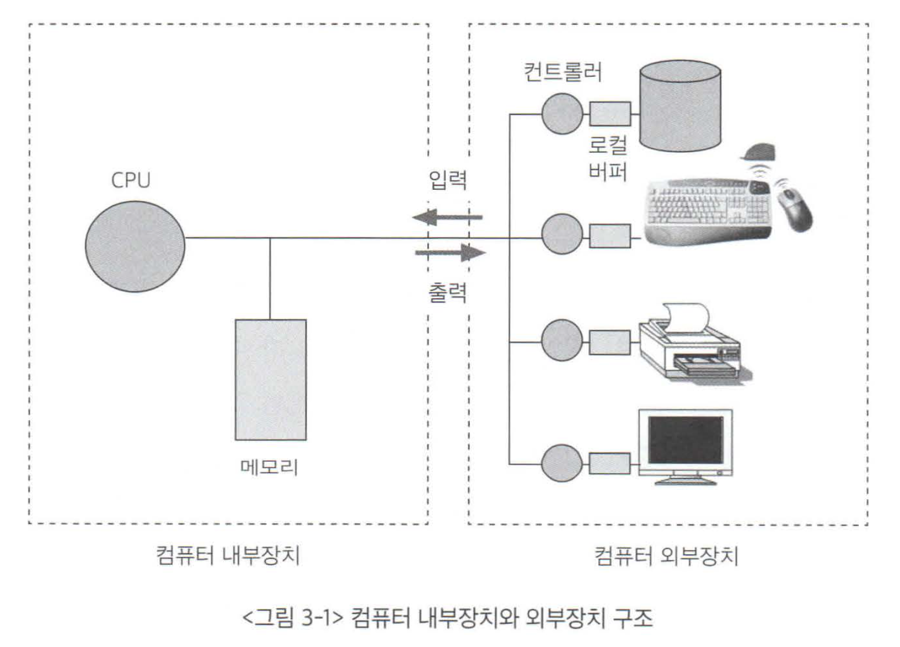
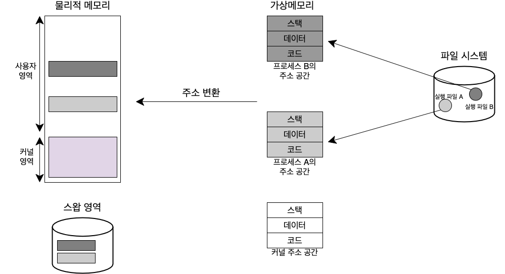
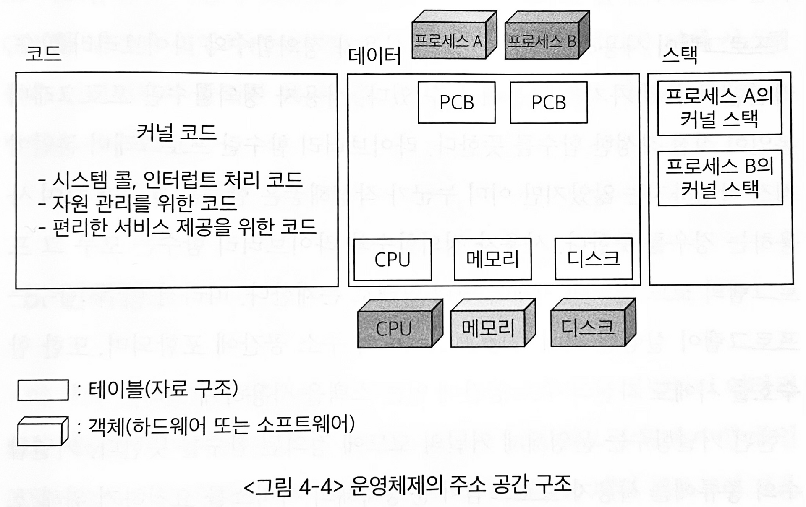
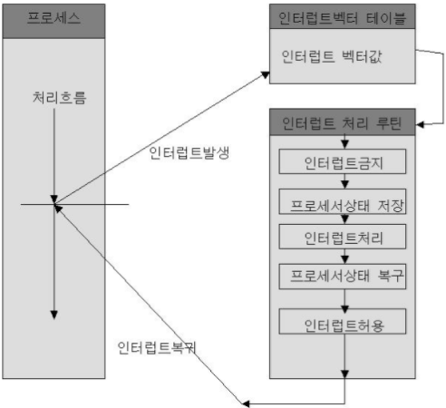
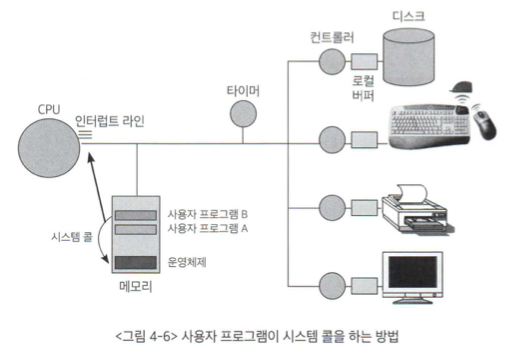

# 목차

 

- [목차](#목차)
- [1 프로그램의 구조와 인터럽트](#1-프로그램의-구조와-인터럽트)
- [2 컴퓨터 시스템의 작동 개요](#2-컴퓨터-시스템의-작동-개요)
- [3 프로그램의 실행](#3-프로그램의-실행)
  - [3-1 프로그램 실행의 의미](#3-1-프로그램-실행의-의미)
  - [3-2 운영체제의 주소 공간 구조 - 중요](#3-2-운영체제의-주소-공간-구조---중요)
- [4 사용자 프로그램이 사용하는 함수](#4-사용자-프로그램이-사용하는-함수)
- [5 인터럽트](#5-인터럽트)
- [6 시스템 콜](#6-시스템-콜)
- [7 프로세스의 두 가지 실행 상태](#7-프로세스의-두-가지-실행-상태)

 

# 1 프로그램의 구조와 인터럽트
> 프로그램은 모두 함수들로 구성되어있다.

💁‍♂️ **프로그램의 주소 영역**

* 코드: 작성한 프로그램 함수들의 코드가 CPU에서 수행할 수 있는 기계어 명령 형태로 변환되어 저장되는 부분.
* 데이터: 전역 변수 등 프로그램이 사용하는 데이터를 저장하는 부분
* 스택: 함수가 호출될 때 호출된 함수의 수행을 마치고 복귀할 주소 및 데이터를 임시로 저장하는 데에 사용되는 공간. (콜스택)

 

💁‍♂️ **스택 vs PCB - 중요**
* 일반적으로 프로그램 내에서 발생되는 사용자 정의 함수호출에 필요한 복귀 주소는 각 프로그램의 주소 공간 중 스택 영역에 보관된다.
* 인터럽트 때문에 CPU를 빼앗긴 위치는 운영체제가 관리하는 PCB(프로세스 제어블록)에 저장된다.

 

> 인터럽트 수행도 기존의 일반적인 함수를 스택에 쌓는 것과 동일하게 동작한다. 
> 
> 즉, 인터럽트 함수를 스택에 쌓는 것 뿐이다. 다만 운영체제가 이를 수행할뿐!

 

# 2 컴퓨터 시스템의 작동 개요
> **CPU는 PC가 가리키는 위치의 명령을 처리할 뿐이다. 스스로 어떠한 작업을 수행해야 하는지 결정하지 않는다.**

 

💁‍♂️ 프로그램 카운터 (PC)
* **CPU가 수행해야 할 메모리 주소를 담고 있는 레지스터.**
  * CPU는 PC가 가리키는 메모리 위치의 명령을 처리한다.
* 커널 모드
  * **PC가 메모리 주소 중 운영체제가 존재하는 부분을 가리키고 있다면 현재 운영체제의 코드를 수행중이며, 이 경우 CPU가 커널 모드에서 수행중이라고한다.**
* 사용자 모드
  * **PC가 사용자 프로그램이 존재하는 메모리 위치를 가리키고 있다면 사용자 모드라 한다.**

 

💁‍♂️ 컴퓨터 시스템의 구조

 출처: 운영체제와 정보기술의 원리

* 컴퓨터 시스템은 CPU와 메모리, 각 입출력 장치를 전담하는 작은 CPU(컨트롤러)와 작은 메모리(로컬 버퍼)로 구성되어 있다.

 

💁‍♂️ **일반명령과 특권명령**
* **일반명령**: 메모리에서 자료를 읽어와 CPU에서 계산하고 결과를 메모리에 쓰는 일련의 명령들, **모든 프로그램이 수행할 수 있는 명령.**
* **특권명령**: 보안이 필요한 명령. 입출력 장치/타미어 등 각종 장치에 접근하는 명령. **운영체제만 수행할 수 있는 명령.** (ex. 시스템 콜)

> 두 명령을 구분하는 방법으로 모드 비트 (mode bit)를 사용한다.

 

💁‍♂️ **시스템 콜**
* **사용자 프로그램에서 특권명령 수행을 위해 운영체제에게 요청하는 인터럽트.**
  * **시스템 콜을 받은 운영체제는 사용자 코드가 아닌 커널 영역제 정의된 시스템 콜 처리 코드를 수행하게 된다.**
* 예시
  * 사용자 프로그램에서 디스크의 파일 접근 필요. (즉, 특권 명령 필요함)
  * 사용자 프로그램은 특권명령을 수행할 수 없으므로 시스템 콜을 통해 운영체제에게 특권명령의 대행을 요청.
  * 운영체제는 시스템 콜을 받아 커널 영역에 정의된 시스템 콜 처리 코드를 수행한다.
  * 디스크에서 자료를 읽는 명령이므로, CPU가 디스크 컨트롤러에게 데이터를 읽어오라는 명령을 내린다.
  * 디스크 컨트롤러는 디스크로부터 데이터를 읽어와서 자신의 로컬버퍼에 저장한다. 
  * 작업이 완료되면 CPU에 인터럽트를 발생시켜 입출력 작업이 완료되었음을 통지한다.

 

💁‍♂️ 주변장치 인터럽트
* CPU는 PC가 가리키는 메모리 위치의 명령만 계속 수행하므로, 주변장치의 상태를 지속적으로 파악할 수 없다.
  * 그러므로, 주변장치는 CPU의 도움이 필요한 경우 인터럽트를 사용해 CPU에게 서비스를 요청한다.
* 인터럽트를 발생시키기 위해 **주변장치들은 CPU에게 서비스를 요청하기 위해 인터럽트 라인을 세팅한다.**
* 인터럽트 종류에 따라 구분되며, **CPU는 매 명령 수행 직후 인터럽트 라인을 체크해서 요청이 들어왔는지 확인한다.**

 

# 3 프로그램의 실행

 

## 3-1 프로그램 실행의 의미

💁‍♂️ **프로그램 실행의 의미**

1. **디스크에 존재하던 실행파일이 메모리에 적재된다는 의미.**
   * 실행 파일이 메모리에 적재될 때, **전체가 메모리에 한꺼번에 올라가기보다는 일부분만 메모리에 올라가고 나머지는 해당 프로그램의 스왑 영역에 저장하여 필요할 때 가져와서 사용한다.**
   * 이를 통해 **더 효율적으로 메모리 공간을 사용**한다.
2. **프로그램이 CPU를 할당받아 명령을 수행하고 있는 상태를 의미.**
   * 물론 CPU는 하나이므로, 여러 프로그램이 병행적으로 동작한다. 프로그램간의 스위칭이 굉장히 빨라서 동시에 실행된다고 말하는 것.

 

💁‍♂️ 프로세스의 주소 공간

 프로세스의 논리적 주소 공간 -> 물리적 주소 공간 

* **프로세스 주소 공간의 구조**
  * 프로세스의 주소 공간은 앞에서 언급했듯이 코드, 데이터, 스택등으로 구성된다.
* **가상 메모리**
  * 프로그램마다 독자적으로 존재하는 이와 같은 주소 공간을 가상 메모리(논리적 메모리)라한다. 
  * **실제 물리적 메모리의 주소와 독립적으로 각 프로그램마다 독자적인 주소 공간을 가진자.**

 

## 3-2 운영체제의 주소 공간 구조 - 중요

 

💁‍♂️ **운영체제도 하나의 프로그램이자 프로세스이다. - 중요**
* **운영체제도 하나의 프로그램이므로 운영체제 커널 역시 코드, 데이터, 스택의 주소 공간 구성을 가지고 있다.**

 

 출처: 운영체제와 정보기술의 원리 

 

💁‍♂️ **커널 코드 영역**
* CPU, 메모리 등의 자원을 관리하기 위한 코드 -> 하드웨어 자원을 효율적으로 관리하는 역할. (아랫단)
* 편리한 인터페이스를 제공하기 위한 코드 -> 응용프로그램 및 사용자에게 편리한 서비스를 제공하는 역할. (윗단)
* 시스템 콜 및 인터럽트를 처리하기 위한 코드.

 

💁‍♂️ **커널 데이터 영역**
* **각종 자원을 관리하기 위한 자료구조를 저장.**
  * 하드웨어 자원을 관리하기 위한 자료구조. (CPU, 메모리 등등)
  * 현재 수행 중인 프로그램(프로세스)의 상태, CPU정보, 메모리 사용 정보등을 저장하는 PCB를 관리 및 저장. (PCB)

 

💁‍♂️ **커널 스택 영역**
* 일반 프로그램의 스택 영역과 마찬가지로 함수호출시의 복귀 주소를 저장하기 위한 용도 사용된다.
* **일반 프로그램의 스택 영역과 다른점** -> 프로세스마다 커널 내의 별도의 스택을 둔다. (PCB)
  * **커널의 스택은 일반 프로그램의 스택과 다르게 현재 수행 중인 프로세스마다 별도의 스택을 두어 관리한다.**
  * 그 이유는 다음과 같다.
    1. 프로세스가 특권명령을 수행하려고 커널에 정의된 시스템 콜을 호출하고 시스템 콜 내부에서 다른 함수를 호출하는 경우 그 복귀 주소는 커널 내의 주소가 되어 사용자 프로그램의 스택과는 별도의 저장공간이 필요하게 된다.
    2. 커널은 일종의 공유 코드로서 일관성 유지를 위해 각 프로세스마다 커널 내에 별도의 스택을 두게 하는 것.

> 쉽게 말하면, 프로그램이 자기 자신의 코드 내에서 함수호출 및 복귀 주소를 유지하기 위해서는 자기 주소 공간의 스택을 사용한다.
> 
> 하지만 만약 시스템 콜이나 인터럽트 등으로 운영체제의 코드가 실행되는 중에 함수호출이 발생할 경우 커널 스택을 사용한다. 이때 커널 스택은 PCB에 저장된다. 

 

# 4 사용자 프로그램이 사용하는 함수

 

💁‍♂️ 프로그램이 사용하는 함수
* 사용자 정의함수
  * 프로그래머가 직접 작성함 함수.
* 라이브러리 함수
  * 프로그래머가 직접 작성하지 않고, 이미 누군가 작성해놓은 함수.
* 커널함수
  * **운영체제 커널의 코드에 정의된 함수.**
  * 시스템 콜 함수: 사용자 프로그램이 운영체제의 서비스를 요청하기 위해 호출하는 함수.
  * 인터럽트 함수: 하드웨어 및 소프트웨어가 CPU의 서비스를 요청하기 위해 발생시키는 인터럽트 처리 함수.

 

사용자 정의함수와 라이브러리 함수는 해당 프로세스의 코드 영역에 기계어 명령 형태로 존재한다.

즉, **해당 프로세스의 주소 공간에 포함되고, 자신의 스택을 사용한다**.

반면, **커널 함수는 사용자 프로세스의 주소 공간이 아닌 운영체제 커널의 주소 공간에 코드가 정의된다.**

즉, 운영체제 내의 함수를 사용자 프로그램이 호출해서 사용하는 것이다.

 

# 5 인터럽트
> 인터럽트에 대한 기본적인 개념은 [이전 글](./1%20컴퓨터%20시스템의%20동작%20원리.md#3-인터럽트)에서 확인하자.

 

💁‍♂️ 인터럽트가 필요한 이유
* CPU는 PC의 명령을 순차적으로 실행한다.
* 수행 중인 프로세스로부터 CPU를 회수해 다른 일을 하도록 하려면 인터럽트 매커니즘이 필요하다.

 

💁‍♂️ 인터럽트 동작 흐름

 출처: http://blog.skby.net/인터럽트-interrupt/

* CPU는 매번 PC가 가리키고 있는 지점의 명령을 수행하고나서, 다음 명령을 수행하기 직전에 인터럽트 라인이 세팅되어있는지 체크한다.
* 만약 인터럽트가 발생했다면 위와 같은 처리 루틴을 통해 처리하게 된다.

 

💁‍♂️ 인터럽트 처리 방식
* 우선순위
  * 인터럽트의 우선순위를 정하고, 우선순위가 낮은 인터럽트 처리 중 높은 인터럽트가 들어오면 현재 인터럽트 서비스 루틴을 중단하고 새로운 인터럽트 처리 수행한다.
* 순차처리
  * CPU가 인터럽트 서비스 루틴을 처리하고 있는 도중에 새로운 인터럽트 요구가 들어오더라도 CPU가 인터럽트 사이클을 수행하지 않도록 방지한다.

 

# 6 시스템 콜

 

 출처: 운영체제와 정보기술의 원리

🤔 시스템 콜이란?
* 시스템 콜은 함수호출이다. 단, **자신의 프로세스 주소 공간을 거스르는 영역에 존재하는 함수를 호출하는 것을 의미한다.**
* 즉, 자신의 프로그램이 아닌, **커널이라는 다른 프로그램의 주소 공간에 존재하는 함수를 호출하는 것.**
  
 

🤔 시스템 콜은 어떻게 기존의 함수로 복귀하는가?

> 일반 사용자 프로그램을 스택을 사용하여 함수를 호출하면 호출된 함수를 스택에 쌓는 방식으로 이전 상태로 복귀한다.

* **시스템 콜은 프로그램 자신이 인터럽트 라인에 인터럽트를 세팅하는 명령을 통해 이루어진다.**
* 이는 **프로그램이 스스로 인터럽트 세팅하는 명령하는 점만 다를 뿐, 일반적인 인터럽트의 발생과 동일한 방법이라 할 수 있다.**

 

💁‍♂️ 시스템 콜 예시 - 파일 입출력
* 사용자 프로그램이 CPU에서 명령을 수행하던 중 디스크의 파일을 읽어야할 경우 시스템 콜로 커널의 함수를 호출한다.
* **입출력 함수의 호출이 자신의 주소 공간에서 이루어질 수 없기 때문에 사용자 프로그램은 CPU 제어권을 운영체제에 이양한다.**
* **이양하는 방법으로 인터럽트 라인을 세팅하는 시스템 콜을 사용한다.**
* CPU는 인터럽트 라인이 세팅된 것을 보고, 현재 수행 중인 사용자 명령을 중지하고 CPU의 제어권을 운영체제로 이양하게 된다.
* **운영체제는 입출력 인터럽트를 인지하고, 해당 서비스루틴으로 이동해 입출력 작업을 수행한다.**
* 이 과정에서 CPU는 디스크 컨트롤러에게 파일을 읽어오라는 명령을 하게 된다.
* 그리고 디스크 컨트롤러가 데이터를 읽어오는 동안 CPU의 제어권을 다른 프로세스에 이양한다. (컨트롤러의 처리 속도가 느리므로)
* 다른 프로세스가 CPU에서 명령을 수행하던 중 입출력 작업이 완료되었음을 알리게 된다.
* 그럼 CPU는 다른 프로세스의 작업을 멈추고, 인터럽트 처리 루틴으로 그 제어권이 넘어가게된다.
* 인터럽트 내용을 읽어서 컨트롤러의 로컬버퍼에서 데이터를 메모리에 복사한 후 해당 요청을 한 프로세스에 CPU를 넘긴다.
* 해당 프로세스는 CPU를 기다리는 큐에 삽입되고 CPU의 제어권은 다른 프로세스에 넘어가게된다.
* 그리고 처음 프로세스가 자신의 차례가 오면 입출력된 결과를 가지고 나머지 로직을 처리하게 된다.

 

💁‍♂️ 프로세스가 중간에 CPU 제어권을 뺏기는 경우
1. 타이머에 의해 인터럽트가 발생하는 경우
2. 입출력 요청을 위해 시스템 콜이 발생하는 경우

 

# 7 프로세스의 두 가지 실행 상태

💁‍♂️ 프로세스 A가 CPU를 점유하고 있다는 것의 의미
1. 자신의 주소 공간에 정의된 코드를 실행하는 것.
   * 사용자모드에서의 실행 상태
2. 커널의 시스템 콜 함수를 실행하는 것.
   * 커널모드에서의 실행 상태

 

💁‍♂️ 정리하자면
* 프로그램이 시작되어 종료될 때까지 다양한 함수 호출을 하며 실행된다.
* 이때 두 가지의 실행상태로 나눌 수 있다.
  * 사용자모드 -> 사용자 정의함수, 라이브러리
  * 커널모드 -> 시스템 콜
    * 커널모드로 진입해 커널의 주소 공간에 정의된 함수를 실행한다.
    * 시스템 콜의 실행이 끝나면 다시 사용자 모드로 복귀해서 시스템 콜 이후의 명령들을 순차적으로 실행한다.

