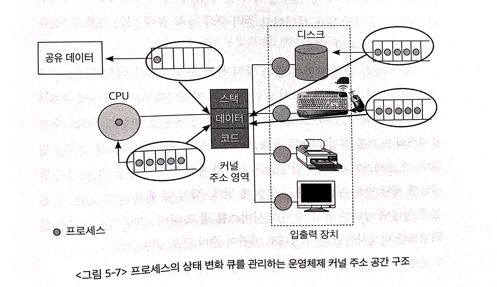

# 목차

 

- [목차](#목차)
- [1 프로세스의 개념](#1-프로세스의-개념)
- [2 프로세스의 상태](#2-프로세스의-상태)
- [3 프로세스 제어블록 (PCB)](#3-프로세스-제어블록-pcb)
- [4 문맥 교환](#4-문맥-교환)
- [5 프로세스를 스케줄링하기 위한 큐](#5-프로세스를-스케줄링하기-위한-큐)
- [6 스케줄러](#6-스케줄러)
- [7 프로세스의 생성과 종료](#7-프로세스의-생성과-종료)
- [8 프로세스 간의 협력](#8-프로세스-간의-협력)

 

# 1 프로세스의 개념

 

🤔 프로세스란?
* 프로세스는 실행 중인 프로그램을 의미한다.
  * 디스크에 실행파일 형태로 존재하던 프로그램이 메모리(RAM)에 올라가면서 생명력을 갖는 프로세스가 된다.
  * 이때부터 프로세스는 CPU를 점유하며 자신의 코드를 수행한다.

 

🤔 프로세스 문맥 (Context)
> 프로세스를 이해하기 위해선 프로세스 문맥에 대해서 알 필요가 있다.

* 프로세스 문맥 (Context)이란?
  * 프로세스가 현재 어떤 상태에서 수행되고 있는지 정확히 규명하기 위해 필요한 정보를 의미한다.
* 프로세스 문맥 (Context)이 왜 필요한가?
  * CPU는 시분할 시스템으로 돌아가며, 각각의 프로세스가 문맥 교환 (Context Switching)을 통해 돌아가면서 실행된다.
  * 이때 프로세스는 CPU를 점유하는 시점에, 이전까지 실행한 정확한 상태를 재현할 필요가 있다. 이를 위해 문맥(Context)이 필요하다.
* 프로세스 문맥 구성
  * 프로세스의 주소 공간 (코드, 데이터, 스택 상태)
  * 레지스터
  * 커널에서 수행한 일의 상태 (커널 스택)
  * PCB
  * ...

 

💁‍♂️ 프로세스 문맥의 종류

 프로세스의 문맥을 구성하는 요소   출처: 운영체제와 정보기술의 원리

* 하드웨어 문맥
  * CPU의 수행 상태를 나타낸다.
  * ex. PC값, 각종 레지스터에 저장되어 있는 값.
* 프로세스의 독자적인 주소 공간
  * 코드, 데이터, 스택
  * 애플리케이션의 코드와 데이터, 그리고 콜 스택 상태를 담고 있다.
* 커널상의 문맥
  * 프로그램이 실행되어 프로세스가 되면 운영체제는 프로세스를 관리하기 위한 자료구조를 유지한다.
  * 즉, **프로세스 관련 커널 자료구조**
    * PCB
    * 커널 스택

 

# 2 프로세스의 상태

 

💁‍♂️ 프로세스 상태

* 실행(running)
  * 프로세스가 CPU를 점유하고, 기계어 명령을 실행하고 있는 상태.
* 준비(ready)
  * 프로세스가 CPU만 점유하면, 당장 명령을 실행할 수 있지만, CPU를 할당받지 못한 상태. (메모리 등 다른 조건을 만족하고 있다는 의미)
* 봉쇄(blocked, wait, sleep)
  * 프로세스가 CPU를 할당받더라도 당장 명령을 실행할 수 없는 프로세스 상태.
  * ex. 프로세스가 요청한 디스크에서 입출력 작업이 진행 중인 경우
* 시작(new)
  * 프로세스가 생성 중인 상태.
  * 프로세스가 시작되어 그 프로세스를 위한 각종 자료구조는 생성되었지만 아직 메모리 획득을 승인받지 못한 상태.
* 완료(terminated)
  * 프로세스가 종료 중인 상태.
  * 프로세스가 종료되었으나 운영체제가 그 프로세스와 관련된 자료구조를 완전히 정리하지 못한 상태.

> 하나의 프로세스는 위 상태 중 한 상태에 머물게 된다. 그리고 시간에 흐름에 따라 변하게 된다.

 

💁‍♂️ 문맥교환과 CPU 디스패치
* 문맥교환 (Context Switching)
  * 실행시킬 프로세스를 변경하기 위해 원래 수행 중이던 프로세스의 문맥을 저장하고 새로운 프로세스의 문맥을 세팅하는 과정.
* CPU 디스패치 (Dispatch)
  * 준비 상태에 있는 프로세스들 중에서 CPU를 할당받은 프로세스를 선택한 후 실제로 CPU의 제어권을 넘겨받는 과정.

 

# 3 프로세스 제어블록 (PCB)

 

🤔 PCB란?
* **운영체제가 시스템 내의 프로세스들을 관리하기 위해 프로세스마다 유지하는 정보들을 담는 커널 내의 자료구조.**

 

🤔 PCB의 구성요소

 출처: 운영체제와 정보기술의 원리

* 프로세스의 상태 (process state)
  * CPU를 할당해도 되는지 여부를 결정하기 위한 상태.
* 프로그램 카운터값 (program counter)
  * 다음에 수행할 명령의 위치를 가리킨다.
* CPU 레지스터의 값 (CPU register)
  * CPU 연산을 위해 현 시점에 레지스터에 어떤 값을 저장하고 있는지를 나타낸다.
* CPU 스케줄링 정보 (CPU scheduling information)
  * 프로세스의 CPU 스케줄링을 위한 정보.
* 메모리 관리 정보 (memory management information)
  * 메모리 할당을 위해 필요한 정보.
* 자원 사용 정보 (accounting information)
  * 사용자에게 자원 사용 요금을 계산해 청구하는 등의 용도로 사용된다.
* 입출력 상태 정보 (I/O status information)
  * 프로세스가 오픈한 파일 정보등 프로세스의 입출력 관련 상태 정보.

 

# 4 문맥 교환

 

🤔 문맥 교환

 출처: 운영체제와 정보기술의 원리

* 하나의 사용자 프로세스로부터 다른 사용자 프로세스로 CPU의 제어권이 이양되는 과정.
  * 프로세스 A가 CPU를 할당받고 실행되던 중 타이머 인터럽트가 걸린다면, 프로세스 A는 PC값등 자신의 문맥을 자신의 PCB에 저장하고, 다른 프로세스에게 CPU를 이양한다.
  * 이양받은 프로세스 B는 이전에 저장했던 자신의 문맥을 PCB로부터 실제 하드웨어로 복원시킨다. 그리고 다시 프로세스를 실행한다.

 

💁‍♂️ 문맥 교환이 일어나는 경우와 그렇지 않은 경우

 출처: 운영체제와 정보기술의 원리

* **문맥 교환이 일어나지 않는 경우 - 모드 변경**
  * **프로세스가 실행 상태일 때 시스템 콜이나 인터럽트**가 발생하면 CPU의 제어권이 운영체제로 넘어와 원래 실행 중이던 프로세스의 업무를 잠시 멈추고 운영체제 커널의 코드가 실행된다.
  * **이 경우에도 CPU의 실행 위치등 프로세스의 문맥 중 일부를 PCB에 저장하게 되지만, 이러한 과정을 문맥교환이라고 하지는 않는다.**
  * **이는 하나의 프로세스의 실행모드만 사용자모드에서 커널모드로 바뀌는 것일 뿐이다. CPU를 다른 프로세스에게 양보하지 않는다.**
  * 이 과정은 문맥 교환보다 훨씬 비용이 적다.
* **문맥 교환이 일어나는 경우 - 타이머 인터럽트, 입출력 시스템 콜**
  * **타이머 인터럽트와 입출력 요청 시스템 콜인 경우에는 문맥교환이 일어난다.**
    * **그 밖엔 문맥 교환이 일어나지 않고 실행 모드만 변경될 뿐이다.**
  
> 문맥 교환은 보통 타이머 인터럽트에 의해 많이 실행된다. 즉, CPU 할당 시간을 어떻게 정하느냐가 중요하다.
> 
> 짧게하면 그만큼 문맥 교환이 많이 발생해 오버헤드가 크다.
> 
> 반대로 길게하면 시분할 시스템 의미가 퇴색하게 된다.

 

# 5 프로세스를 스케줄링하기 위한 큐

 

💁‍♂️ **여러가지 스케줄링 큐**

 출처: 운영체제와 정보기술의 원리

* CPU 스케줄링 큐
  * 준비 상태에 있는 프로세스들을 줄 세우기 위해 준비 큐를 둔다.
  * 그리고 가장 앞에 있는 프로세스부터 먼저 CPU에 할당한다.
  * 타이머 인터럽트가 걸리면 CPU를 양보하고, 큐의 가장 맨뒤로 이동한다.
  * 이와 관련해서는 CPU 스케줄링에서 더 자세히 다룬다.
* 장치 큐
  * 특정 자원을 기다리는 프로세스들을 줄 세우기 위한 자원별 장치 큐.
  * 장치에 서비스를 요청한 프로세스들을 대기시키는 줄.
  * 그리고 관련 작업을 모두 수행하면 인터럽트를 발생시킨다.
  * **장치 큐 예시 - 디스크 입출력 - 중요**
    * 프로세스가 CPU를 할당받아 실행되던 중, 디스크 입출력 이벤트가 걸리게된다면, CPU 상태를 양보하고, Blocked 상태로 변경한다.
    * 디스크에 입출력 서비스를 요청한 프로세스들은 디스크 입출력 큐에 줄 서게 된다.
    * 그럼 디스크 컨트롤러는 디스크 입출력 큐에 줄 서 있는 순서대로 프로세스들의 입출력 작업을 수행하게 된다.
    * 프로세스별 입출력 작업이 완료되면 디스크 컨트롤러가 CPU에 인터럽트를 발생시키게된다.
    * 그럼 CPU는 현재 하던 일을 멈추고, CPU 제어권을 운영체제 커널에게 넘긴다.
    * 운영체제 커널은 디스크 입출력이 끝난 데이터를 해당 프로세스의 메모리 상에 올려주고, 프로세스를 Blocked에서 Ready로 변경한다.
    * 그럼 인터럽트 처리루틴에 의해 디스크 입출력이 완료된 프로세스는 CPU를 기다리는 줄에 서게된다.
* 공유 데이터 큐
  * 데이터 일관성때문에 공유 데이터는 매 시점 하나의 프로세스만 접근할 수 있어야 한다. 그러므로 데이터 큐를 이용한다.
* 이외에도 여러 큐가 존재한다.

 

💁‍♂️ **프로세스 상태 관리 - 중요**

 출처: 운영체제와 정보기술의 원리

* **프로세스 상태 관리**
  * 위와 같이 **프로세스의 상태 관리**는 **커널의 주소 영역 중 데이터 영역**에 **다양한 큐**를 두어 수행하게 된다.
  * **각 프로세스가 CPU를 기다리는지, 입출력을 기다리는지 등의 정보를 커널이 총체적으로 관리**한다는 의미이다.
  * 예시
    * 타이머 인터럽트가 발생하면 커널은 데이터 영역의 준비 큐 정보를 참조해 다음에 어떤 프로세스에게 CPU를 할당할지 결정하고, 현재 실행 중인 프로세스는 준비 큐의 제일 뒤로 보낸다.
* **여러 가지 큐**
  * Job Queue
    * 시스템 내의 모든 프로세스를 관리하기 위한 큐. 프로세스의 상태와 무관하다.
    * 가장 넓은 개념으로, Ready Queue와 Device Queue의 프로세스들은 모두 Job Queue에 속한다.
    * 이때 프로세스는 모두 메모리에 있는 것을 보장하진 않는다. swap 영역에 저장되어 있을 수도 있다.
  * Ready Queue
    * 준비 상태에 있는 프로세스들을 위한 큐.
  * Device Queue
    * 봉쇄 상태에 있는 프로세스들을 위한 큐.
* 프로세스는 상태 변화에 따라 Ready Queue와 Device Queue를 오간다.

 

💁‍♂️ 커널은 연결 리스트 형식으로 큐를 관리한다.

 출처: 운영체제와 정보기술의 원리

* 큐는 각 프로세스의 PCB를 연결 리스트 형태로 관리하며, 포인터를 사용해 순서를 정한다.
  * 각 장치마다 큐를 가지고 있다.
* **각 프로세스들은 상태에 맞는 큐에 들어가 줄을 서면서, 자신의 차례를 기다린다. 그리고 커널의 관리하에 여러 큐를 오간다.**

 

# 6 스케줄러

 

🤔 스케줄러
* 스케줄러란 **어떤 프로세스에게 자원을 할당할지를 결정하는 운영체제 커널의 코드**를 지칭한다.

 

🤔 스케줄러 종류
* 장기 스케줄러
  * 작업 스케줄러라 불리며, **어떤 프로세스를 Ready Queue에 진입시킬지 결정하는 역할**을 한다.
    * **new 상태의 프로세스중 어떤 프로세스를 Ready Queue에 삽입할 것인지 결정하는 역할을 한다.**
  * 장기 스케줄러는 프로세스에게 메모리를 할당하는 문제에 관려하게 된다. (프로세스가 메모리를 보유해야 실행할 수 있기 때문)
* 단기 스케줄러
  * CPU 스케줄러라 불리며, Ready Queue의 프로세스 중에서 어떤 프로세스를 다음번에 Running 상태로 만들 것인지 결정한다.
  * 시분할 시스템에서 타이머 인터럽트가 발생하면 단기 스케줄러가 호출된다.

> * 여기서 말하는 **Ready Queue는 CPU를 얻으면 언제든 실행 가능한 프로세스 집합**을 의미한다.

 

🤔 스케줄러의 특징
* 장기 스케줄러
  * 수십 초 내지 수분 단위로 가끔 호출되기 때문에 속도가 느린 것이 허용된다.
* 단기 스케줄러
  * 밀리초 정도의 시간 단위로 매우 빈번하게 호출되므로 속도가 빨라야한다.

> * **현대의 시분할 시스템에서 사용되는 운영체제에는 일반적으로 장기 스케줄러를 두지 않는다. - 중요**
>   * 이전엔 메모리 효율성때문에 사용했지만, 메모리 용령과 성능이 좋아져서 이젠 사용되지 않는다고한다.

 

💁‍♂️ 중기 스케줄러
> 현대의 시분할 시스템에선 장기 스케줄러 대신 중기 스케줄러를 둔다.
* 중기 스케줄러란?
  * 매우 **많은 프로세스에게 메모리를 할당해 시스템의 성능이 저하**되는 경우, 이를 해결하기 위해 **메모리에 적재된 프로세스의 수를 동적으로 조절**하기 위해 추가된 스케줄러.
  * 쉽게 말해, **많은 프로세스가 메모리에 할당되서 swap이 많이 일어나는 것을 방지하기 위해서, 아예 특정 프로세스를 선정해 swap out하는 역할을 담당한다.**
    * **메모리에 올라와있는 프로세스의 수를 조절하는 역할**
* 중기 스케줄러가 필요한 이유?
  * 너무 많은 프로세스가 메모리에 적재되면, 프로세스당 보유하고 있는 메모리양이 극도로 적어진다.
  * 이로 인해 CPU 수행에 당장 필요한 프로세스의 주소 공간조차도 메모리에 올려놓기 어려운 상황이 발생할 수 있다.
  * **결과적으로 메모리 swap으로 인해 디스크 I/O가 많이 발생하므로 성능이 심각하게 저하된다.**
  * **중기 스케줄러는 이런 경우 메모리에 올라와있는 프로세스 중 일부를 선정해 통째로 디스크의 swap 영역에 저장해둔다. (메모리 확보)**

 

🤔 중기 스케줄러가 swap out 시키는 대상은?
* 중기 스케줄러가 프로세스를 메모리에서 디스크로 swap out시키는 **0순위는 봉쇄 상태의 프로세스**들이다.
  * 이유는 봉쇄 상태인 프로세스들은 당장 CPU를 획득할 가능성이 없기 때문이다.
* 봉쇄 상태인 프로세스들을 swap out하고도 메모리가 부족하다면, **타이머 인터럽트가 발생해 준비 큐로 이동하는 프로세스**를 swap out 시킨다.

 

💁‍♂️ **중기 스케줄러의 등장으로 중지(suspended)상태가 추가되었다**

 출처: https://kosaf04pyh.tistory.com/190

* **중지 상태란?**
  * 외부적인 이유로 프로세스의 수행이 정지된 상태를 의미한다.
* **중지 상태에 있는 프로세스들은**
  * **외부에서 재개시키지 않는 이상 다시 활성화될 수 없으므로 메모리(RAM) 자원이 당장 필요하지 않다.**
  * 따라서 중지 상태의 프로세스는 통째로 swap out되서 디스크에 저장된다.
* **중지 상태의 종류**
  * 중지준비(suspended ready) 상태: 준비 상태의 프로세스가 중기 스케줄러에 의해 swap out된 상태.
  * 중지봉쇄(suspended blocked) 상태: 봉쇄 상태의 프로세스가 중기 스케줄러에 의해 swap out된 상태.
  * 중지봉쇄 상태이던 프로세스가 봉쇄되었던 조건을 만족하게 되면 중지준비 상태로 바뀐다.

 

# 7 프로세스의 생성과 종료

 

❗️ **흔한 오해 - 운영체제가 프로세스 전부를 생성한다고 생각한다**
* 그렇지 않다.
  * 시스템이 부팅된 후 최초의 프로세스는 운영체제가 직접 생성하지만, 그 다음부터는 **이미 존재하는 프로세스가 다른 프로세스를 복제 생성하게 된다.**

 

💁‍♂️ **부모 프로세스와 자식 프로세스**
* **프로세스는 계층구조를 형성한다.**
  * 부모 프로세스: 다른 프로세스를 새롭게 생성한 프로세스.
  * 자식 프로세스: 부모 프로세스에 의해 새롭게 생성된 프로세스.
* **특징 - 자식이 먼저 죽는다**
  * 자식 프로세스가 먼저 죽으며, 자식을 처리하는 역할은 해당 프로세스의 부모 프로세스가 담당한다.
  * 만약 후손들이 여러 단계에 걸쳐 많이 생성된 프로세스가 종료될 경우, **해당 프로세스가 생성한 모든 후손 프로세스들을 연쇄적으로 종료시킨 후에야 본인이 종료될 수 있다.**

 

💁‍♂️ **생성된 프로세스가 작업을 수행하기 위해 자원을 얻는 방법**
> 운영체제와 자원에 따라 다를 수 있다.
1. 운영체제로부터 직접 자원을 할당받는 경우
2. 부모 프로세스와 같은 자원을 공유해서 사용하는 경우

 

💁‍♂️ **프로세스가 수행되는 모델**
1. **부모와 자식이 공존하며 수행되는 모델**
   * 자식과 부모가 같이 CPU를 획득하기 위해 경쟁하는 관계.
2. **자식이 종료될 때까지 부모가 기다리는(wait) 모델.**
   * 자식 프로세스가 종료될 때까지 부모 프로세스는 아무 일도 하지 않고 봉쇄 상태에 머물러 있다, 자식이 종료되면 그때 부모가 준비 상태가 되어 CPU 점유를 기다린다.
   * **대표적인 예시**
     * 유닉스 명령어 입력 (부모), 명령어을 통해 실행된 프로세스 (자식)
     * 명령어를 쳐서 자식 프로세스를 실행시키면, 해당 자식이 종료될 때까지 부모 프로세스는 프롬프트를 다시 띄우지 않고, 봉쇄 상태에서 자식이 끝나기를 기다린다.

 

💁‍♂️ **프로세스 생성 절차중요**
* **생성 절차 - 복사 덮어씌우기**
  * 각 프로세스는 독자적인 공간을 갖는다. 하지만 자식 프로세스를 만들 때 부모 프로세스의 주소 공간 내용을 그대로 복사하여 생성한다. (복사)
  * 그리고 자식 프로세스가 생성된 주소 공간 위에 새로운 프로그램의 주소 공간을 덮어씌워 실행하게 된다. (덮어씌우기)
* **유닉스를 통해 보는 예시**
  * `fork()` 시스템 콜을 통해 새로운 프로세스를 생성할 수 있다.
    * 이때 부모 프로세스가 자식 프로세스를 그대로 복사하여 생성한다.  (PID 제외)
  * `exec()` 시스템 콜을 통해 새로운 프로그램으로 주소 공간을 덮어 씌운다.

 

 유닉스 시스템의 프로세스 계층도 출처: https://slideplayer.com/slide/13554589/ 

 

 유닉스 프로세스 계층도 예시 출처: 공룡책 

 

💁‍♂️ **자식 프로세스가 생성되는 과정**

 I/O, timer, fork, interrupt등 이벤트가 들어오면 cpu제어권을 다른 프로세스에게 넘겨주고 ready큐에 들어가서 순환된다.  출처: 운영체제와 정보기술의 원리

1. 프로세스 A1 가 `fork()`를 호출한다.
2. 시스템 콜로 의해 CPU 제어권이 커널에게 주어진다
3. 커널은 `fork()`를 호출한 프로세스 A1를 복제해 자식 프로세스 A1-1생성한다.
4. A1-1는 A1와 모든 문맥을 동일하게 가지고 있다.

> 이때 완전 복제인간으로써, A1-1은 자신이 A1이라고 생각한다. (PCB의 정보가 그대로 복사되므로)

5. 새로운 프로세스의 주소 공간을 복사한 주소 공간에 두기 위해 `exec()` 시스템 콜을 실행한다.
6. 이때 `wait()` 시스템 콜을 통해 부모가 자식 프로세스가 종료되기를 기다리도록 부모를 봉쇄 상태로 만든다.

> `fork()`, `exec()`, `wait()`은 사용자가 실행할 수 없는 특권 명령에 속한다. (시스템 콜을 통해서만 가능하다.)

 

💁‍♂️ **프로세스 종료 - 중요**

원칙적으로 후손 자식들이 모두 종료되어야 부모 프로세스가 종료될 수 있다. 이와 관련해 프로세스의 종류는 두가지로 나뉜다.

1. 자발적 종료 - `exit()`
   * 프로세스가 마지막 명령을 수행한 후 운영체제에게 이를 알리는 방법.
   * 프로그램 종료되는 지점에 컴파일러가 자동으로 `exit()` 명령어를 삽입한다.
2. 비자발적 종료 - `abort()`
   * 부모 프로세스가 자식 프로세스의 수행을 강제로 종료 방법.
   * 발생하는 상황
     * 자식 프로세스가 할당 자원의 한계치를 넘어서는 자원을 요구할 때
     * 자식 프로세스에게 할당된 작업이 더이상 필요 없을 때
     * 부모 프로세스가 종료(exit)되는 경우

 

🤔 서버에서 로그아웃하고도 계속 프로그램이 돌기 희망한다면?
> 자바 실행할 때 `nohup`에 대한 원리 설명!

* 서버에 로그인하고, 수행되는 프로세스는 모두 해당 로그인 프로세스 밑에 생성된다. 즉, 로그아웃하면 모든 프로세스가 종료된다.
* 만약 로그아웃하고도 모든 프로세스를 종료시키고 싶지 않으면, 자식 프로세스를 종료되지 않을 다른 프로세스의 자식으로 보내주어야 한다.

 

# 8 프로세스 간의 협력

 

❗️ **프로세스는 독립적인 주소 공간을 가지며, 다른 프로세스의 주소 공간을 참조하는 것을 허용하지 않는다.**

* 하나의 프로세스는 다른 프로세스의 수행에 영향을 미칠 수 없다.
* 부모 프로세스가 자식 프로세스를 생성할 때도 복제하여 생성이 완료되면 각자 자신의 독자적인 주소 공간만을 참조하므로 독립적인 공간이된다. (부모, 자식도 서로 CPU 레이스를 한다)

 

💁‍♂️ IPC (Inter-Proccess Communication)
> **때때로 정보 공유 등 프로세스 간 협력이 필요할 때가 있다**
* IPC란
  * 하나의 컴퓨터 안에서 실행 중인 서로 다른 프로세스 간에 발생하는 통신을 의미한다.
  * **IPC는 프로세스들 간의 통신과 통기화를 이루기 위한 메커니즘을 의미한다**.
* IPC 기능
  * 통신
  * 동기화

 

 IPC의 두 가지 통신 방식 출처: 운영체제와 정보기술의 원리

🤔 IPC 통신 방식 1 - 메시지 전달 방식
> 프로세스 사이에 공유 데이터를 사용하지 않는다.
* 중간에 커널이 메시지 전달 역할을 담당한다.
  * 두 프로세스 간의 커뮤니케이션 링크를 생성한다.
  * 이후 `send(message)`와 `receive(message)`라는 두 가지 연산을 통해 통신한다.
  * 두 연산을 통해 프로세스는 전달할 메시지를 시스템 콜 방식으로 요청해 전달할 수 있다.
* 통신 방식
  * 직접 통신 (p1 - p2)
  * 간접 통신 (p1 - MailBox - p2)
* 통신 방식을 둘로 나누긴 하지만, 중간에 인터페이스를 두냐 안두냐에 차이일 뿐 통신하는 메커니즘은 동일하다.

 

🤔 IPC 통신 방식 2 - 공유메모리 방식
> 프로세스 사이에 공유 데이터를 사용한다.
* 프로세스들이 주소 공간의 일부를 공유한다.
  * 공유메모리 방식을 사용하는 여러 프로세스는 각자 독립적인 메모리 공간이 존재하지만, 공유메모리 영역(주소)가 존재한다.
  * 그리고 이 공유메모리 주소는 동일한 물리적 주소에 매핑되게 된다.
  * 그리고 이 공간에 데이터를 저장하면 해당 공유메모리를 참조하는 모든 프로세스가 데이터를 읽을 수 있다.
* 문제는 동기화이다.
  * 운영체제에서 동기화 문제를 책임지지 않기 때문에, 사용자가 직접 동기화 문제를 해결해야한다.

