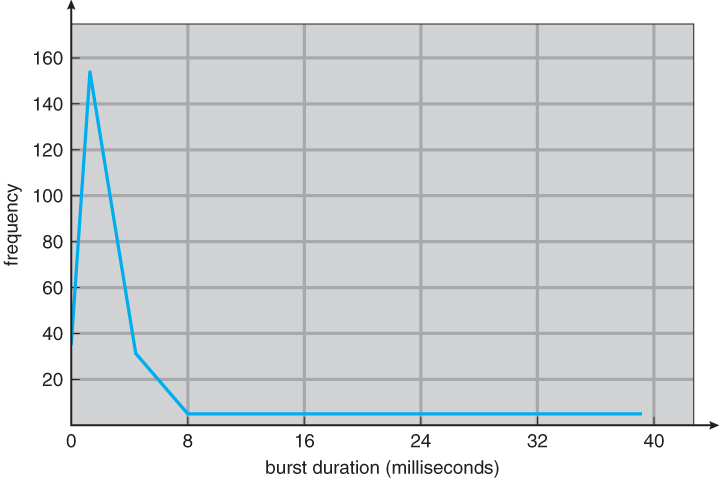
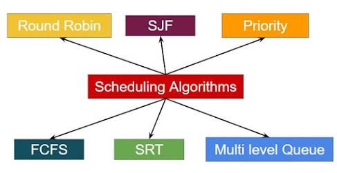

# 목차

 

- [목차](#목차)
- [1 CPU 스케줄링이 필요한이유](#1-cpu-스케줄링이-필요한이유)
- [2 CPU 스케줄러](#2-cpu-스케줄러)
- [3 디스패처](#3-디스패처)
- [4 스케줄링 성능 평가](#4-스케줄링-성능-평가)
- [5 스케줄링 알고리즘](#5-스케줄링-알고리즘)
  - [5-1 선입선출](#5-1-선입선출)
  - [5-2 최단작업 우선 스케줄링](#5-2-최단작업-우선-스케줄링)
  - [5-3 우선순위 스케줄링](#5-3-우선순위-스케줄링)
  - [5-4 라운드 로빈 스케줄링](#5-4-라운드-로빈-스케줄링)
  - [5-5 멀티레벨 큐](#5-5-멀티레벨-큐)
  - [5-6 멀티레벨 피드백 큐](#5-6-멀티레벨-피드백-큐)
  - [5-7 다중처리기 스케줄링](#5-7-다중처리기-스케줄링)
  - [5-8 실시간 스케줄링](#5-8-실시간-스케줄링)
  - [CPU 스케줄링에 대한 더 자세한 내용](#cpu-스케줄링에-대한-더-자세한-내용)
- [6 스케줄링 알고리즘의 평가](#6-스케줄링-알고리즘의-평가)

 

# 1 CPU 스케줄링이 필요한이유
우선 CPU가 어떤 명령을 처리하며, 각 프로세스들은 어떠한 특징을 가지는지 살펴본다.

그리고 CPU 스케줄링이 왜 필요한지 서술한다.

 

💁‍♂️ **CPU의 역할**

* CPU는 프로그램의 기계어 명령을 실제로 수행하는 중앙처리장치이다.
* 이때 프로그램이 메모리에 올라가 프로세스가되면, PCB의 PC (Program Counter) 레지스터가 현재 CPU에서 수행할 코드의 메모리 주소값을 갖게된다. 그리고 CPU는 PC를 참고하여 프로세스를 실행한다.

 

💁‍♂️ **CPU를 사용하는 기계어 명령 종류 - 중요**

1. CPU 내에서 수행되는 명령 
   * CPU 내의 레지스터에 있는 값을 이용하여 수행되는 명령.
   * CPU 내에서만 수행되기때문에 굉장히 빠르다.
   * 일반명령에 속한다. (사용자가 직접 실행가능)
   * 제어권을 계속해서 사용자 프로그램이 가지게된다.
   * ex. add (메모리내의 두 숫자 더하기)
2. 메모리 접근을 필요로하는 명령
   * 메모리에 데이터를 저장하거나 CPU 레지스터로 읽어들여 실행되는 명령.
   * CPU 내에서만 수행되는 명령보단 오래걸리지만, 그래도 굉장히 빠르다.
   * 일반명령에 속한다. (사용자가 직접 실행가능)
   * 제어권을 계속해서 사용자 프로그램이 가지게된다.
   * ex. store, load
3. I/O를 동반하는 명령.
   * 키보드로부터 입력을 받거나 디스크에 저장 및 읽기를 동반할 때 사용되는 명령.
   * I/O가 수반하는 명령은 CPU 내 명령이나 메모리 접근 명령에 비해 상당히 오랜 시간이 소요된다.
   * 특권명령에 속한다. (사용자 프로세스가 직접 수행할 수 없으며, 운영체제를 통해 서비스를 대행한다.)
   * I/O 작업은 제어권을 운영체제에 넘기며, 상대적으로 매우 누린 I/O장치의 접근이 필요하게된다.
   * ex. 키보드 입력, 디스크 I/O

> 프로세스는 보통 위 3가지 명령을 번갈아가며 CPU에의해 실행된다.

 

🤔 **CPU 버스트와 I/O 버스트**

 프로세스는 CPU 버스트와 I/O 버스트를 번갈아가며 실행된다. 출처: https://www.cs.uic.edu/~jbell/CourseNotes/OperatingSystems/6_CPU_Scheduling.html

* **CPU 버스트** (burst)
  * 사용자 프로그램이 CPU를 직접 가지고 빠른 명령을 수행하는 일련의 단계.
    * CPU 내에서 수행되는 명령 (ex. add)
    * 메모리 접근을 필요로하는 명령 (ex. 메모리에 저장 및 읽기)
  * 프로세스가 I/O를 한번 수행하고 다음 번 I/O를 수행하기까지 직접 CPU를 가지고 명령을 수행하는 단계.
* **I/O 버스트** (burst)
  * I/O 요청이 발생해 커널에 의해 입출력 작업을 진행하는 비교적 느린 단계.
    * I/O를 동반하는 명령. (ex. Disk I/O)
  * I/O 작업이 요청된 후 완료되어 다시 CPU 버스트로 돌아가기까지 일어나는 일련의 단계.

 

💁‍♂️ **각 프로세스마다 CPU 버스트와 I/O 버스트가 차지하는 비율이 균일하지않다.**

* 당연히 각 프로세스마다 CPU 버스트와 I/O 버스트를 차지하는 비율이 모두 다르다.
* 어떤 프로세스는 I/O 버스트가 빈번해 CPU 버스트가 매우 짧게 나타나는 반면, 또 다른 프로세스는 I/O를 거의 하지 않아 CPU 버스트가 매우 길게 나타난다.

> 각 프로세스마다 차지하는 비율이 다르다는 것은 꼭 필요한 프로세스에 먼저 CPU 자원을 할당하는 스케줄링이 필요하다는 의미이기도하다.

 

💁‍♂️ **프로세스마다 CPU 버스트와 I/O 버스트를 차지하는 비율에 따라 CPU 바운디드 프로세스 (CPU bound process)와 I/O 바운디드 프로세스 (I/O bound process)로 나뉜다.**
* **CPU 바운드 프로세스**
  * I/O 작업을 거의 수행하지 않아 CPU 버스트가 길게 나타나는 프로세스.
  * **상당 시간을 입출력 작업없이 CPU 작업에 소모하는 계산 위주의 프로세스.**
* **I/O 바운드 프로세스**
  * I/O 요청이 빈번해 CPU 버스트가 짧게 나타나는 프로세스.
  * **주로 사용자의 인터렉션을 받아가며 수행되는 대화형 프로세스.**

 CPU 버스트 시간 출처: https://www.cs.uic.edu/~jbell/CourseNotes/OperatingSystems/6_CPU_Scheduling.html 

* I/O 바운드 프로세스는 짧은 CPU 버스트를 많이 가진다.
* CPU 바운드 프로세스는 소수의 긴 CPU 버스트로 구성된다.

 

🤔 **그래서 CPU 스케줄링이 필요한 이유는?**

* **CPU 스케줄링은 CPU를 사용하는 패턴이 상이한 여러 프로세스가 동일한 시스템 내부에서 함께 실행되기때문에 필요하다.**
  * 여러 프로세스의 CPU 버스트가 모두 균일하다면 스케줄링이 필요없지만, 현대의 시분할 시스템에서는 CPU 버스트가 균일하지않아 효율적인 CPU 스케줄링 기법이 필요하다.
* **프로세스들의 CPU버스트를 분석해보면 대부분 짧은 CPU 버스트를 가지며, 극히 일부분만 긴 CPU 버스트를 가진다고한다.**
  * 즉, CPU를 한번에 오래 사용하기보다는 잠깐 사용하고 I/O 작업을 수행하는 프로세스들이 많다는 것.
* **그리고 이러한 프로세스가 바로 사용자와의 인터렉션을하는 프로세스이며, 대화형 작업이므로 사용자에 대한 빠른 응답이 중요하다.**
  * **따라서 CPU 스케줄링을 할 때 CPU 버스트가 짧은 프로세스에게 우선적으로 CPU를 사용할 수 있게해줘야한다.**
    * **CPU 버스트가 짧은 프로세는 I/O 작업을 많이 수행하기 때문이다.**

 

💁‍♂️ **CPU 스케줄링시 I/O 바운드 프로세스의 우선순위를 높여주는 것이 바람직하다.**

* **I/O 바운드 프로세스에 먼저 CPU를 할당해야지 CPU를 잠깐만 사용한 후 곧바로 I/O 작업을 수행할 수 있으므로 I/O 장치의 이용률이 높아진다.**
* 또한, **대부분의 프로세스는 대화형 프로세스이므로, I/O 작업이 많은 프로세스에 우선순위를 높게주는게 좋다.**

 

# 2 CPU 스케줄러

 

🤔 **CPU 스케줄러란?**
* **CPU 스케줄러도 하나의 프로세스이다. CPU 스케줄러는 준비 상태에 있는 프로세스들 중 어떠한 프로세스에게 CPU를 할당할지 결정하는 역할을 담당한다.**
* 프로세스가 CPU를 점유해서 실행되다가 타이머 인터럽트가 발생하면 CPU 스케줄러가 호출된다.

 

🤔 **CPU 스케줄러는 언제 사용되는가?**
* 타이머 인터럽트가 발생하여 준비 상태의 프로세스에게 CPU를 할당해야하는 경우.
* 실행 상태에 있던 프로세스가 I/O 요청으로 봉쇄 상태로 바뀌는 경우.
* 실행 상태에 있던 프로세스가 타이머 인터럽트 발생에 의해 준비 상태로 바뀌는 경우.
* I/O 요청으로 봉쇄 상태에 있던 프로세스의 I/O 작업이 완료되어 인터럽트가 발생하고 그 결과 이 프로세스의 상태가 준비 상태로 바뀌는 경우.
* CPU에서 실행 상태에 있는 프로세스가 종료되는 경우.

> 사실상.. 프로세스가 CPU를 사용할 일이 있을 때 모두 사용된다고보면된다.

 

💁‍♂️ **CPU 스케줄링의 2가지 방식**
1. 선점형
   * 프로세스가 CPU를 계속 사용하기를 원한더라도 강제로 빼앗을 수 있는 방식. (ex. 타이머 인터럽트)
2. 비선점형
   * CPU를 획득한 프로세스가 스스로 CPU를 반납하기 전까지는 CPU를 빼앗기지 않는 방식.

 

# 3 디스패처

🤔 **디스패처란?**
* CPU 스케줄러에의해 선택된 프로세스가 실제로 CPU를 이양하는 작업.
* 이와 같이 컨텍스트 스위칭 작업도 포함해서 말한다.
  * 디스패처 : 프로세스에 CPU 이양 + 컨텍스트 스위칭.

 

💁‍♂️ **디스패치 지연시간의 대부분은 컨텍스트 스위칭 오버헤드에 해당한다.**

 

# 4 스케줄링 성능 평가
스케줄링 성능 평가는 크게 2가지로 나눌 수 있다.

* 시스템 관점
* 사용자 관점

 

💁‍♂️ **시스템 관점**

* CPU 이용률 (cpu utilization)
  * 전체 시간 중에서 CPU가 일을 한 시간의 비율.
  * CPU가 일을하지않고 휴먼 (idle) 상태에 머무르는 시간을 최대한 줄이는 것이 좋다. (스케줄링의 목표)
* 처리량 (throughput)
  * 주어진 시간동안 준비 큐에서 기다리고있는 프로세스중 몇 개를 끝마쳤는지를 나타낸다.
    * CPU 버스트를 완료한 프로세스의 수.
  * 즉, CPU 서비스를 원하는 프로세스 중 몇 개가 원하는 만큼의 CPU를 사용하고, 이번 CPU 버스트를 끝내어 준비 큐를 떠났는지 측정.
  * 많은 프로세스들이 CPU 작업을 완료하기위해서는 CPU 버스트가 짧은 프로세스에게 우선적으로 CPU를 할당하는 것이 좋다.

 

💁‍♂️ **사용자 관점**

* 소요시간 (turnaround time)
  * 프로세스가 CPU를 요청한 시점부터 자신이 원하는 만큼 CPU를 다 쓰고 CPU 버스트가 끝날 때까지 걸린 시간.
* 대기시간 (waiting time)
  * CPU 버스트 기간중 프로세스가 준비 큐에서 CPU를 얻기 위해 기다린 시간의 합.
* 응답시간 (response time)
  * 프로세스가 준비 큐에 들어온 후 첫 번째 CPU를 획득하기까지 기다린 시간.

 

> 책에선 하나의 좋은 비유를 이야기한다.
> * 중국집에 주방장 입장 -> CPU 이용률, 처리량.
> * 중국집 손님 입장 -> 소요시간, 대기시간, 응답시간.

 

# 5 스케줄링 알고리즘

 CPU 스케줄링 방식 출처: https://vsonwalkar3.medium.com/scheduling-algorithms-in-operating-system-bade5f192ca4 

 

## 5-1 선입선출
* 개념
  * 선입선출 (First-Come First-Served)는 준비 큐에 도착한 시간 순서대로 CPU를 할당하는 방식.
* 특징
  * CPU를 먼저 요청한 프로세스에게 CPU를 먼저 할당하고, 프로세스는 자발적으로 CPU를 반납할 때까지 놓지않는다.
  * 먼저 도착한 프로세스의 성격에따라 평균 대기시간이 크게 달라진다.
* 단점
  * 하나의 프로세스가 오랫동안 CPU를 점유하면, 다른 준비 큐에있는 프로세스는 모두 멈춘다.
  * I/O 작업등 일시적인 CPU 버스트가 필요한 프로세스의경우에도 모두 대기상태를 유지하기때문에 비효율적이다.

 

> **콘보이 현상** (convoy effect)
> * CPU 버스트가 짧은 프로세스가 CPU 버스트가 긴 프로세스보다 나중에 도착해 오랜 시간을 기다리는 현상.

 

## 5-2 최단작업 우선 스케줄링
* 개념
  * 최단작업 우선 스케줄링 (Shortest-Job First)는 CPU 버스트가 가장 짧은 프로세스에게 제일 먼저 CPU를 할당하는 방식.
* 종류
  * 비선점형
    * CPU 한번 획득하면 해당 프로세스가 자진으로 반납하기전까지 CPU를 반납하지 않음.
  * 선점형
    * CPU를 획득했다하더라도, 준비 큐에 더 짧은 프로세스가 도착할 경우 반납함.
    * 프로세스들이 준비 큐에 도착하는 시간이 불규착한 환경에서 최적의 알고리즘.
* 장점
  * 짧은 프로세스가 준비 큐에서 먼저 빠져나서 실행되기때문에, 준비 큐에서 기다리는 전체적인 시간이 줄어든다. (평균 대기시간이 짧아짐.)
* 단점 (한계)
  * 현실적으로 프로세스의 CPU 버스트 시간을 미리 알 수 없다..

 

## 5-3 우선순위 스케줄링
* 개념
  * 우선순위 스케줄링 (Priority)이란 준비 큐에서 기다리는 프로세스들 중 우선순위가 가장 높은 프로세스에게 제일 먼저 CPU를 할당하는 방식.
  * 각 프로세스마다 우선순위 값을 가지며, 우선순위값은 작을수록 높은 우선순위를 가지게된다.
* 우선순위 결정방식 
  * CPU 버스트 시간 (SJF과 동일)
  * 시스템과 관련된 중요한 작업에 우선순위를 더 줄 수도 있음.
* 종류
  * SJF과 동일하게 우선순위 스케줄링도 비선점형과 선점형이 존재한다.
* 단점 (문제)
  * **기아 현상**이 발생할 수 있다. 즉, 우선순위가 낮은 프로세스는 계속해서 CPU를 얻지 못할 수 있다.
    * 물론 이러한 문제를 **노화**(aging) 기법으로 해결할 순 있다. 노화 기법이란 기다리는 시간이 길어지면 우선순위를 높이는 방식이다.

 

## 5-4 라운드 로빈 스케줄링
* 개념
  * 라운드 로빈 스케줄링 (Round Robin)은 각 프로세스가 CPU를 연속적으로 사용할 수 있는 시간이 특정 시간으로 제한하며, 이 시간을 경과하면 해당 프로세스를 준비 큐에 줄 서게하고 다음 프로세스가 CPU를 얻게하는 방식.
  * 공정한 스케줄링 방식.
  * ex. 시분할 시스템
* 시간 기준이 가장 중요하다.
  * 각 프로세스가 CPU 점유하는 시간을 길게하면 -> FCFS처럼 하나의 프로세스가 너무 오랫동안 CPU를 점유하여, 다른 준비 큐에있는 프로세스가 모두 멈춘다.
  * 각 프로세스가 CPU 점유하는 시간을 짧게하면 -> CPU를 사용하는 프로세스가 빈번하게 교체되어 컨텍스트 스위칭의 오버헤드가 커진다.
  * 적당한 시간을 정하는 것이 좋다. 책에선 수십 밀리초 정도가 적당하다고 말한다.
* 장점
  * 라운드 로빈 스케줄링은 여러 종류의 이질적인 프로세스가 같이 실행되는 환경에서 효과적이라고 볼 수 있다.
  * 모든 프로세스가 일정 시간이 지나면 무조건 CPU를 점유하므로, 대화형 프로세스의 빠른 응답시간을 보장할 수 있다.
  * CPU 버스트 시간이 짧은 프로세스가 빨리 CPU를 점유할 수 있음과 동시에 CPU 버스트 시간이 긴 프로세스가 불이익을 당하지않는다.
* 단점
  * 각 프로세스 CPU를 점유하는 시간에따라 호율성이 결졍된다. 그러므로, 시간을 잘 정해야한다.

 

## 5-5 멀티레벨 큐
* 개념
  * 멀티레벨 큐 (Multi-level Queue)란 준비 큐를 여러 개로 분할해 관리하는 방식.
  * 즉, 프로세스들이 CPU를 기다리기 위해 한 줄이 아닌 여러 줄로 서는 것을 말한다.
* 서로 다른 성격을 가진 큐로 구성한다.
  * 보통 대화형 작업을 담기 위한 전위 큐(라운드 로빈)와 계산 위주의 작업을 담기 위한 후위 큐(FCFS)로 구성된다.
    * 전위 큐에선 대화형 작업을 위해 응답시간을 짧게 실행되는 라운드 로빈을 사용한다.
    * 후위 큐에선 계산 위주의 작업을 위해 응답시간이 큰 의미를 가지지않는 FCFS를 사용한다.
* 여러 큐중에서 큐 자체에 대한 스케줄링이 필요하다.
  * 고정 우선순위 방식.
    * 큐에 고정적인 우선순위를 부여해 우선순위가 높은 큐를 먼저 서비스하고, 우선순위가 낮은 큐는 우선순위가 높은 큐가 비어있을때만 실행되는 구조.
  * 타임 슬라이스 방식.
    * 큐에 대한 기아 현상을 해소할 수 있는 방식으로, 각 큐에 CPU 시간을 적절한 비율로 할당하는 구조. 전위 큐엔 80%, 후위 큐엔 20%를 할당하는 방식.
* 단점
  * CPU는 하나뿐이므로 어떤 줄에 서 있는 프로세스를 우선적으로 스케줄링할 것인지에 대한 문제가 존재한다.
  * 또한, 프로세스가 준비 큐에 설 때, 어떤 준비 큐에 설지도 정해야하는 문제가 존재한다.

 

## 5-6 멀티레벨 피드백 큐
* 개념
  * 멀티레벨 피드백 큐 (Multi-level Feedback Queue)는 멀티레벨 큐와 동일하나, 프로세스가 하나의 큐에서 다른 큐로 이동이 가능한 방식.
* 각 큐의 알고리즘을 정해두고, 프로세스를 강등과 승격시키는 방식을 사용할 수 있다.
  * 기아 현상을 해결하기위한 노화 기법을 멀티레벨 피드백 큐에 적용할 수 있다.
    * 우선순위가 낮은 큐에서 오래 기다렸으면 우선순위가 높은 큐로 승격시키는 방식이다.
    * 그리고 가장 높은 큐엔 라운드 로빈 (할당시간 5), 그 다음 우선순위가 낮은 큐엔 라운드 로빈 (할당시간 10), 가장 마지막 큐는 FCFS를 두는 방식이다.
    * 이러한 방식은 라운드 로빈 스케줄링을 한층 더 발전시켜, 프로세스의 CPU 작업시간을 다단계로 분류함으로써 짧은 프로세스일수록 더욱 빠른 서비스가 가능하며, 작업시간이 긴 프로세스에 대해서는 컨텍스트 스위칭없이 CPU 작업에만 열중할 수 있는 FCFS방식을 사용할 수 있따.
* 장점
  * 다양한 알고리즘을 융합해서 사용할 수 있다.

 

## 5-7 다중처리기 스케줄링
* 개념
  * CPU가 여러 개인 시스템인 다중처리기 시스템에선 CPU 스케줄링은 CPU가 하나일 때보다 더 복잡해진다.
  * 다중처리기 환경에서 CPU를 스케줄링하는 방식.
* 다양한 방식이 존재한다.
  * 하나의 준비 큐에 한 줄로 프로세스를 세워서 여러 CPU가 알아서 다음 프로세스를 꺼내서 실행하는 구조.
    * 문제 - 특정 CPU에서 수행되어야 하는 프로세스가 있는 경우 문제가 복잡해진다.
  * 각 CPU별로 준비 큐 세우는 방식.
    * 문제 - 일부 CPU에 작업이 편중되는 현상이 발생할 수 있다.
  * 이러한 문제들로인해 각 CPU별 부하가 적절히 분산되도록하는 부하 균형 메커니즘이 필요하다.
* 대칭형과 비대칭형 다중처리 방식.
  * 대칭형: 각 CPU가 각자 알아서 스케줄링을 결정하는 방식.
  * 비대칭형: 다중처리는 하나의 CPU가 다른 모든 CPU의 스케줄링 및 데이터 접근을 책임지고, 나머지 CPU는 거기에 따라 움직이는 방식.

 

## 5-8 실시간 스케줄링
* 개념
  * 실시간 시스템에서는 각 작업마다 주어진 데드라인이 있어 정해진 데드라인 안에 반드시 작업을 처리해야한다.
  * 먼저 온 요청을 처리하기보다는 데드라인이 얼마 남지 않은 요청을 먼저 처리하는 처리 방식이 필요하다.
* 크게 Hard 실시간과 Soft 실시간으로 나눠볼 수 있다.
  * Hard 실시간: 미사일 발사, 원자로 제어
  * Soft 실시간: 비디오 스트리밍.

 

## CPU 스케줄링에 대한 더 자세한 내용
CPU 스케줄링에 관한 더 자세한 내용과 예시는 아래 참고.

* https://vsonwalkar3.medium.com/scheduling-algorithms-in-operating-system-bade5f192ca4
* https://www.gatevidyalay.com/first-come-first-serve-cpu-scheduling/

 

# 6 스케줄링 알고리즘의 평가
* 스케줄링 알고리즘의 성능을 평가하는 방법
  * 큐잉 모델 방식.
    * 확률분포를 통해 프로세스들의 도착률과 CPU의 처리율을 입력삾으로 주면 수학적 계산을 통해 각종 성능피죠인 CPU 처리량, 프로세스의 평균 대기시간등을 구한다.
  * 시뮬레이션 방식.
    * 가상으로 CPU 스케줄링 프로그램을 작성한 후 프로그램의 CPU 요청을 입력값으로 넣어 결과를 확인하는 방식.
  * 구현 및 실측 방식.
    * OS 커널의 CPU 스케줄링 소스 코드를 직접 수정하고 컴파일하면서 직접 알고리즘의 성능을 평가하는 방식.
