# 목차

 

- [목차](#목차)
- [1 주소 공간](#1-주소-공간)
- [2 주소 바인딩](#2-주소-바인딩)
- [3 메모리 관리와 관련된 용어](#3-메모리-관리와-관련된-용어)
  - [3-1 동적 로딩](#3-1-동적-로딩)
  - [3-2 동적 연결](#3-2-동적-연결)
  - [3-3 중첩](#3-3-중첩)
  - [3-4 스와핑 기법](#3-4-스와핑-기법)
- [4 물리적 메모리의 할당 방식](#4-물리적-메모리의-할당-방식)
  - [4-1 연속할당 방식](#4-1-연속할당-방식)
  - [4-2 불연속할당 기법](#4-2-불연속할당-기법)
- [5 페이징 기법](#5-페이징-기법)
  - [5-1 주소 변환 기법](#5-1-주소-변환-기법)
  - [5-2 페이지 테이블의 구현 (TLB)](#5-2-페이지-테이블의-구현-tlb)
  - [5-3 계층적 페이징](#5-3-계층적-페이징)
  - [5-4 역페이지 테이블](#5-4-역페이지-테이블)
  - [5-5 공유 페이지](#5-5-공유-페이지)
  - [5-6 메모리 보호](#5-6-메모리-보호)
- [6 세그먼테이션](#6-세그먼테이션)

 

# 1 주소 공간
* 주소란
  * 서로 다른 위치를 구분하기 위해 사용하는 일련의 숫자로 구성된 단위.
* 컴퓨터는 이진수로 주소를 표현한다.
  * 컴퓨터는 보통 32비트 혹은 64비트의 주소 체계를 사용한다. (운영체제보면 32bit, 64bit가 존재함.)
* 컴퓨터는 byte단위로 메모리 주소를 부여한다.
  * 32비트 주소체계(4바이트)는 2^32바이트, 64비트 주소체계(8바이트)는 2^64바이트의 서로 다른 메모리 위치를 구분할 수 있다.
  * **32비트 주소체계를 사용한다는 의미는 메모리의 위치정보를 32비트에 저장한다는 의미이다.** (0 ~ 2^32까지 표현할 수 있다.)
* 은유
  * 현실에서의 주소: 계층적으로 행정구역을 묶어서 주소를 표현한다. (ex. 서울시 서대문구 이화여대길 52번지)
    * 전체 주소 중 52번지는 건물 번호처럼 자세한 주소를 나타낸다.
  * 컴퓨터에서의 주소: 보통 4KB(2^12바이트, 32000비트) 단위로 묶어서 페이지라는 행정구역을 묶어서 주소를 표현한다. (32비트 주소체계 기준)
    * 페이지 하나의 크기가 4KB이므로, 페이지내에서 바이트별 위치 구분을 위해선 12비트가 필요하다.
    * 그러므로 32비트의 주소 중 하위 12비트(하나의 페이지)는 페이지 내에서의 주소를 나타내게 된다.

 

# 2 주소 바인딩

 

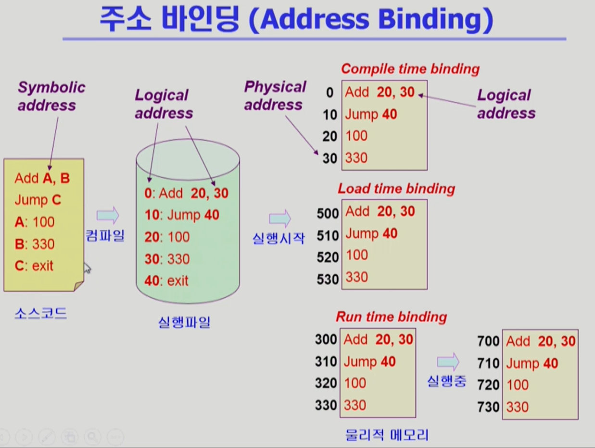 출처: 운영체제 수업. 반효경 

💁‍♂️ **논리적 주소와 물리적 주소**
* 논리적 주소 (가상 주소)
  * 메모리에 적재되는 프로세스를 위한 독자적인 주소 공간.
  * 논리적 주소는 각 프로세스마다 독립적으로 할당되며 0번지부터 시작된다.
* 물리적 주소
  * 물리적 메모리(RAM)에 실제로 올라가는 위치를 말한다.
  * 낮은 주소 영역에는 운영체제가 올라가고, 높은 주소 영역에는 사용자 프로세스들이 올라간다.

🤔 **주소 바인딩이란?**
* 프로세스가 실행되기 위해선 어쨋든 물리적 메모리에 올라가 있어야 한다.
* **이렇게 프로세스의 논리적 주소를 물리적 메모리 주소로 연결시켜주는 작업을 주소 바인딩이라고 한다.**
  * 주소 바인딩 = 물리적 주소와 논리적 주소의 매핑.

 

💁‍♂️ **주소 바인딩의 3가지 방식.**

물리적 주소와 논리적 주소를 바인딩하는 방법은 크게 3가지가있다.

1. **컴파일 타임 바인딩: 컴파일 시점에 해당 프로그램이 물리적 메모리의 몇 번지에 위치할 것인지 결정.**
  * 프로그램이 절대주소로 적재된다는 의미. 주소를 변경하기 위해선 다시 컴파일 해야한다.
  * 따라서 컴파일 타임 바인딩은 비현실적이고, 현대의 시분할 컴퓨팅 환경에서는 잘 사용되지 않는다.
2. **로드 타임 바인딩: 프로그램 실행 시점에 로더에 의해 해당 프로그램이 물리적 메모리의 몇 번지에 위치할 것인지 결정.**
  * 프로그램이 종료될 때까지 물리적 메모리상의 위치는 고정된다.
  * 로더 -> 사용자 프로그램을 메모리에 적재시키는 프로그램. (JVM도 클래스로더가 존재한다.)
3. **실행시간 바인딩: 프로그램이 실행을 시작한 후에도 그 프로그램이 위치한 물리적 메모리 상의 주소가 변경될 수 있는 방식.**
  * CPU가 메모리를 참조할 때마다 해당 데이터가 물리적 메모리의 어느 위치에 존재하는지, 주소 매핑 테이블을 이용해 바인딩을 점검해야한다.
  * 또한, **실행시간에 바인딩을 점검하고 변경할 수 있기때문에 기준 레지스터와 한계 레지스터를 포함해 MMU (메모리 관리 유닛)라는 하드웨어의 지원이 필요하다.**

> 실제 많이 사용되는 시분할 시스템에선 실행시간 바인딩을 디폴트로 사용한다.

 

🤔 **MMU 기법**

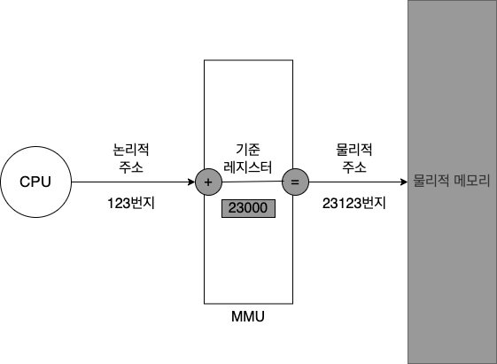 MMU 기법에 의한 주소 변환 

* **논리적 주소 + 기준 레지스터 값 => 물리적 주소**
  * **CPU가 논리적 주소를 참조하려고 할 때 MMU기법은 그 논리적 주소값에 기준 레지스터의 값을 더해 물리적 주소값을 얻어낸다.**
  * 즉, **MMU기법에서는 프로그램의 주소 공간이 물리적 메모리의 한 장소에 연속적으로 적재되는 것으로 가정한다.**
* **기준 레지스터 (재배치 레지스터): 현재 CPU에서 수행 중인 프로세스의 물리적 메모리 시작 주소가 저장되어 있다.**
  * MMU 기법에서는 프로그램의 주소 공간이 물리적 메모리의 한 장소에 연속적으로 적재되기때문에, **프로세스마다 물리적 메모리상의 시작 주소만 알면 수조 변환을 쉽게 할 수 있다.**
  * **기준 레지스터에는 각 프로세스별 물리적 메모리 시작 주소가 저장된다.**
* **MMU 기법에선 사용자 프로그램이나 CPU는 논리적 주소만 다룰 뿐, 물리적 주소는 알지 못하며 알아야 할 필요도 없다.**

> 

 

💁‍♂️ **MMU로인해 각 프로세스의 논리적 주소가 같더라도 실제 물리적 메모리에선 서로 다른 내용을 담고있다.**

MMU는 컨텍스트 스위칭으로 CPU에서 수행 중인 프로세스가 바뀔 때마다 기준 레지스터의 값을 그 프로세스에 해당하는 값으로 재설정함으로써 각 프로세스에 맞는, 서로 다른 주소에 접근한다.

 

💁‍♂️ **한계 레지스터의 필요성**

**보통 물리적 메모리에선 여러 개의 프로세스가 동시에 올라가 실행된다. 이때 CPU가 요청한 논리적 주소값를 통해 물리적 주소값을 구했더니 해당 프로세스의 주소 공간을 벗어날 수도 있다.**

만약 A프로세스의 논리적 주소값을 통해 물리적 주소값을 구했는데, 다른 프로세스의 물리적 주소값을 침범한다면 **메모리 보안상 치명적인 결과를 초래한다.**

**OS는 이러한 문제를 해결하기위해 한계 레지스터를 사용한다.**

 

🤔 **한계 레지스터**

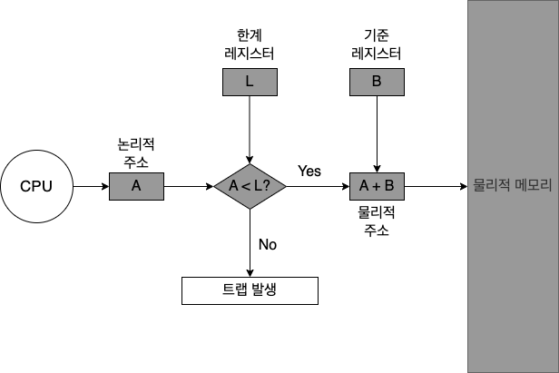 기준 레지스터와 한계 레지스터에 의한 주소 변환 

1. CPU가 요청한 프로세스의 논리적 주소값이 한계 레지스터에 저장된 프로세스의 크기보다 작은지 확인.
2. 작다면 노리적 주소값에 기준 레지스터값을 더해 물리적 주소에 접근한다.
   * 크다면 트랩을 발생시켜 해당 프로세스를 강제 종료시킨다.

 

**한계 레지스터는 위와 같이 프로세스가 자신의 주소 공간을 넘어서는 메모리 참조를 하려고하는지 체크하는 용도로 사용된다.**

**이를 위해 현재 CPU에서 수행중인 프로세스의 논리적 주소의 최댓값, 즉 그 프로세스의 크기를 담고있다.**

 

# 3 메모리 관리와 관련된 용어
메모리 관리에 필요한 다양한 용어들에 대해서 다룬다.

 

## 3-1 동적 로딩

🤔 **동적 로딩이란**
* 프로세스가 시작될 때 그 프로세스의 주소 공간 전체를 메모리에 모두 올려놓는 것이 아닌 사용되는 부분만 불릴때마다 올려놓는 것을 말한다.
* **지연 로딩 (lazy-loading)과 같은 의미.**

 

💁‍♂️ **장점**
* 여러 프로그램이 동시에 메모리에 올라가는 다중 프로그래밍 환경에서 메모리 사용의 효율을 높이기위해 사용된다.
* 예를 들어 에러처리와 같은 코드들을 실제로 많이 사용되지 않으므로 내려놓고 있다가 필요할 때만 올리게됩니다.

 

## 3-2 동적 연결

🤔 **연결** (link)란?
* 개발자가 작성한 소스 코드를 컴파일하여 생성된 목적 파일 (object file, 자바에선 class파일)과, 이미 컴파일된 라이브러리 파일들을 묶어 하나의 실행파일을 생성하는 과정을 말한다.
* 자바로 생각하면 사용자 소스코드와 라이브러리 코드를 합쳐서 하나의 `.jar` 파일을 만드는 과정이라고보면된다.

 

🤔 **동적 연결**

* 컴파일을 통해 생성된 목적 파일과 라이브러리 파일 사이의 연결을 프로그램의 실행 시점까지 지연시키는 기법.

 

🤔 **동적 연결이 필요한 이유는?**

동적 연결과 대비되는 개념인 정적 연결을 생각하면 왜 동적 연결이 필요한지 알 수 있다.
* 정적 연결은 개발자가 작성한 코드와 라이브러리 코드가 모두 합쳐져서 실행파일이 생성된다.
* 이렇게되면 실행파일의 크기가 생다적으로 크며, 동일한 라이브러리를 각 프로세스가 개별적으로 메모리에 적재함으로써 물리적 메모리 낭비가 발생한다.

 

💁‍♂️ **동적 연결의 장점**

* 라이브러리가 실행 시점에 연결된다.
* 즉, 프로그램이 실행되면서 라이브러리 함수를 호출할 때가 되어서야 라이브러리에 대한 연결이 이루어진다.
* 또한, 다수의 프로그램이 공통으로 사용하는 라이브러리를 메모리에 한 번만 적재하므로 메모리 사용의 효율성을 높일 수 있다.

 

## 3-3 중첩

🤔 **중첩** (overlays)

* 프로세스의 주소 공간을 분할해 실제 필요한 부분만을 메모리에 적재하는 기법을 말한다.
* 동적 로딩과 개념적으로 유사하다. 하지만, 동적 로딩과 중첩을 사용하는 이유가 상이하다.
  * 중첩은 초장기 컴퓨터 시스템에서 물리적 메모리가 부족한 상황으로 인해 하나의 프로세스조차도 메모리에 올릴 수 없을 때 사용하던 기법이다.
    * 하나의 프로세스를 메모리에 분할해서 올리기위함. (메모리 크기가 프로세스보다 작을 때 사용된다.)
  * 동적로딩은 다중프로그래밍 환경에서 메모리 이용률을 높이기위해 사용되는 기법이다.
    * 여러 프로세스환경에서 메모리 사용율을 높이기위함.

 

## 3-4 스와핑 기법

🤔 **스와핑**

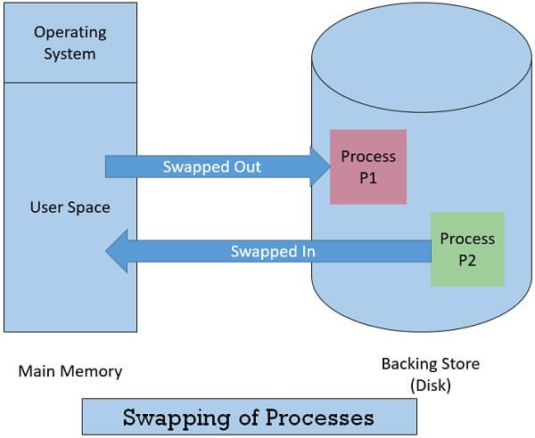 출처: https://binaryterms.com/swapping-in-operating-system.html 

* **메모리에 올라온 프로세스의 주소 공간 전체를 디스크의 스왑 영역 (swap area)에 일시적으로 내려놓는 것을 말한다.**
  * 수행 중인 프로세스의 주소 공간을 일시적으로 메모리에서 디스크로 내려놓는 것. (swap out)
* 스와핑의 역할
  * **스와핑의 가장 중요한 역할은 메모리에 존재하는 프로세스의 수를 조절하는 것이다.**
* 일반적으로 중기 스케줄러에 의해 스와핑이 발생한다.

 

# 4 물리적 메모리의 할당 방식

 

💁‍♂️ **물리적 메모리 영역**

* 운영체제 상주 영역
  * 인터럽트 벡터와 함께 물리적 메모리의 낮은 주소 영역을 사용하며, 운영체제 커널이 이곳에 위치한다.
* 사용자 프로세스 영역
  * 물리적 메모리의 높은 주소 영역을 사용하며, 여러 사용자 프로세스들이 이곳에 적재되어 실행된다.

 

💁‍♂️ **물리적 메모리의 할당 방식은 크게 2가지로 나뉜다.**

* 연속할당
  * 각각 프로세스를 물리적 프로세스의 연속적인 공간에 올리는 방식.
  * 물리적 메모리를 다수의 분할로 나누어 하나의 분할에 하나의 프로세스가 적재되도록한다.
  * 종류
    * 고정분할 - 물리적 메모리를 고정된 크기의 분할로 미리 나누어두는 방식.
    * 가변분할 - 분할을 미리 나누어놓지않은 채 프로그램이 실행되고 종료되는 순서에 따라 분할을 관리하는 방식.
* 불연속할당
  * 하나의 프로세스를 물리적 메모리의 여러 영역에 분산해 적재하는 방식.
  * 종류
    * 페이징 기법 - 각 프로세스의 주소 공간을 동일한 크기의 페이지로 잘라서 메모리에 페이지 단위로 적재시키는 방식.
    * 세그먼테이션 - 프로그램의 주소 공간을 코드, 데이터, 스택 등 의미있는 단위로 세그먼트로 나누어 세그먼트 단위로 적재하는 방식.
    * 페이지드 세그먼테이션 - 세그먼트 하나를 다수의 페이지로 구성하는 방식.

> 사용자 프로세스 영역에서의 물리적 메모리 할당 빙식.

 

## 4-1 연속할당 방식

 

🤔 연속할당 방식

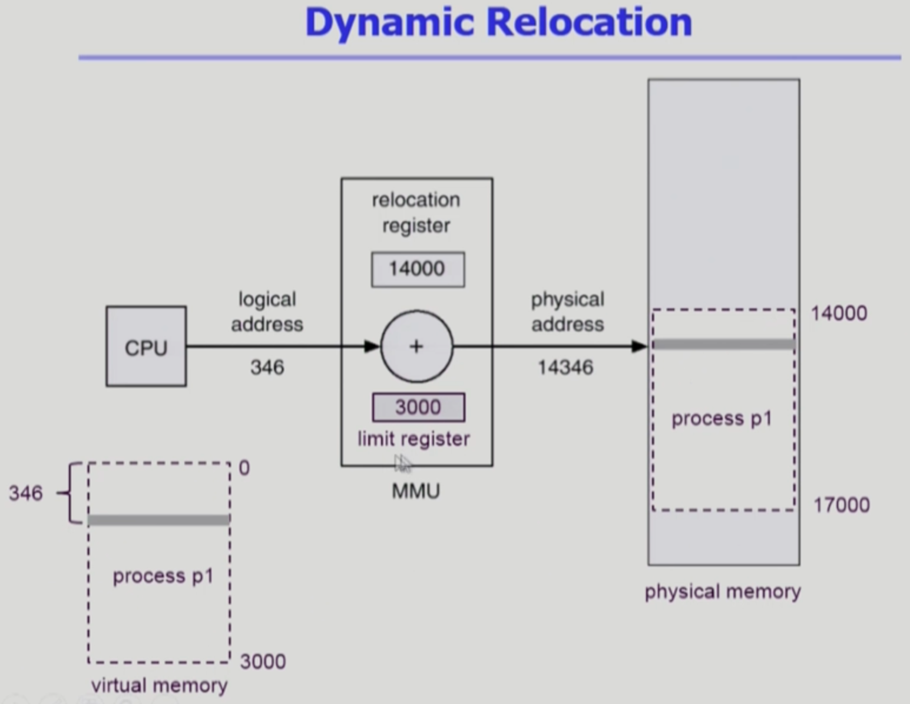 출처: 출처: 운영체제 수업. 반효경 

* **프로세스를 메모리에 올릴 때 그 주소 공간을 여러 개로 분할하지 않고 물리적 메모리의 한 곳에 연속적으로 적재하는 방식.**
  * 프로그램이 통째로 올라가는 방식이기때문에 물리적 메모리에 올라가는 첫번째 주소만 알면 쉽게 물리적 메모리의 주소를 얻을 수 있다.
* 두 가지로 나뉜다.
  * 고정분할
  * 가변분할

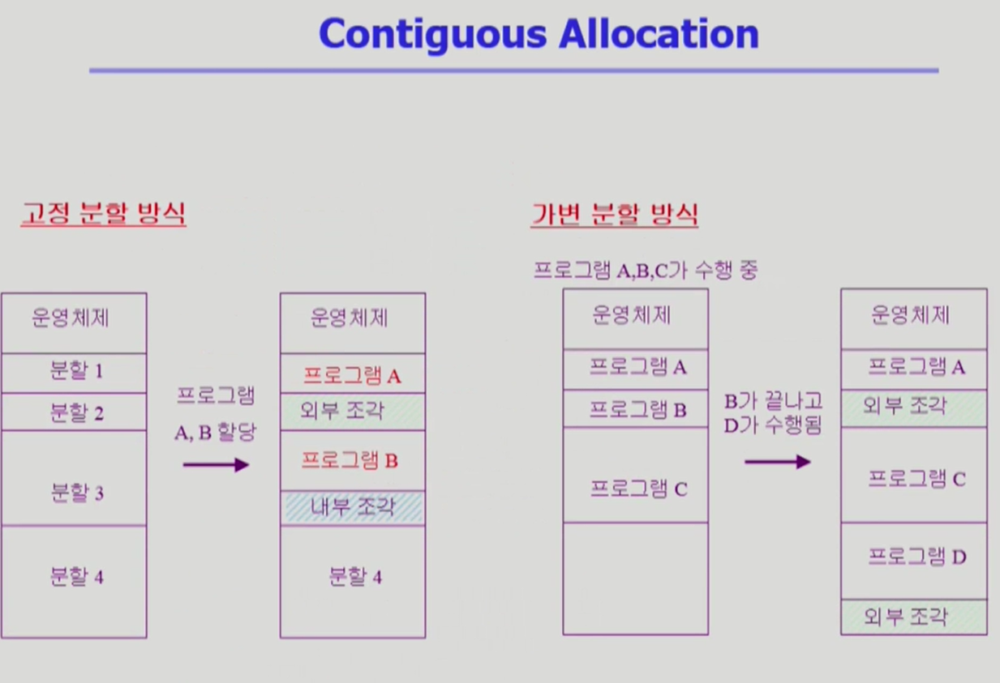 출처: 운영체제 수업. 반효경 

 

1️⃣ 고정분할 방식

* 개념
  * **물리적 메모리를 주어진 개수만큼의 영구적인 분할로 미리 누나어두고 각 분할에 하나의 프로세스를 적재해 실행시키는 방식이다.**
* 특징
  * 이때 분할의 크기는 모두 동일하게 혹은 서로 다르게 할 수 있다. 하지만 하나의 분할에는 하나의 프로세스만 올릴 수 있는 것은 동일하다.
* 단점 1
  * **동시에 메모리에 올릴 수 있는 프로그램의 수가 고정되어있으며, 수행 가능한 프로그램의 최대 크기도 제한한다.** (융통성이 떨어진다.)
* 단점 2
  * **외부조각과 내부조각 문제가 발생한다.**
    * 외부조각이란 프로그램의 크기보다 분할의 크기가 작은 경우 해당 분할이 비어있는데도 불구하고 다른 프로그램이 적재하지못하는 메모리 공간을 의미한다.
    * 내부조각은 프로그램의 크기보다 분할의 크기가 큰 경우 해당 분할에 프로그램을 적재하고 남는 메모리 공간을 의미한다.
  * **이는 메모리 낭비를 유발한다.**

 

2️⃣ 가변분할 방식

* 개념
  * 메모리에 적재되는 프로그램의 크기에 따라 분할의 크기, 개수가 동적으로 변하는 방식.
* 내부조각은 발생하지않지만, 외부조각이 발생할 수 있다.
  * 분할의 크기를 프로그램의 크기보다 일부러 크게 할당하지않기때문에 내부 조각은 발생하지 않는다.
  * 이미 메모리에 존재하는 프로그램이 종료될 경우 중간에 빈 공간이 발생하게되어 외부조각이 발생할 확률은 존재한다.
* 동적 메모리 할당 문제
  * 주소 공간의 크기가 n인 프로세스를 메모리에 올릴 때 물리적 메모리 내 가용 공간 중 어떤 위치에 올릴지 결정하는 문제를 말한다. - 외부조각을 최대한 피하기 위해선 중요한 문제이다.
  * 3가지 방법이 존재한다.
    * 최초적합 - 메모리 가용공간중 프로그램 크기보다 작은면 건너뛰고, 그렇지않으면 최초로 발견한 공간에 프로그램을 올리는 방식.
    * 최적적합 - 모든 메모리를 순회하여 새로운 프로그램을 할당할 수 있는 가장 이상적인 공간을 찾아 할당하는 방식. (속도면에서 좋지않다.)
    * 최악적합 - 모든 메모리를 순회하여 가장 크기가 큰 곳에 새로운 프로그램을 할당하는 방식. (속도, 공간면에서 좋지않다.)
  * 실험결과로는 최초적합과 최적적합이 속도와 공간 이용률 측면에서 효과적이라고한다.

 

> 이외에도 컴패션이라고.. 수행 중인 프로세스의 물리적 메모리 위치를 더 효과적인 공간으로 옮기는 방식이있는데, 현실적으로 구현이 복잡하며 성능상으로도 좋지않다.

 

## 4-2 불연속할당 기법

🤔 불연속할당 방식

* **하나의 프로세스가 물리적 메모리의 여러 위치에 분산되어 올라갈 수 있는 메모리 할당 기법.**
* 종류
  * 페이징 기법 - 하나의 프로그램을 분할하는 기준에 따라 동일한 크기로 나누어 메모리에 올리는 기법.
  * 세그먼테이션 - 크기는 일정하지 않지만 의미 단위로 나누어 메모리에 올리는 기법.
  * 페이지드 세그먼테이션 - 세그먼테이션을 기본으로 하되 이를 다시 동일 크기의 페이지로 나누어 메모리에 올리는 기법.

> 페이징과 세그먼테이션은 비교적 복잡하므로 아래 글에 더 자세히 정리한다.

 

# 5 페이징 기법

 

🤔 페이징 기법?

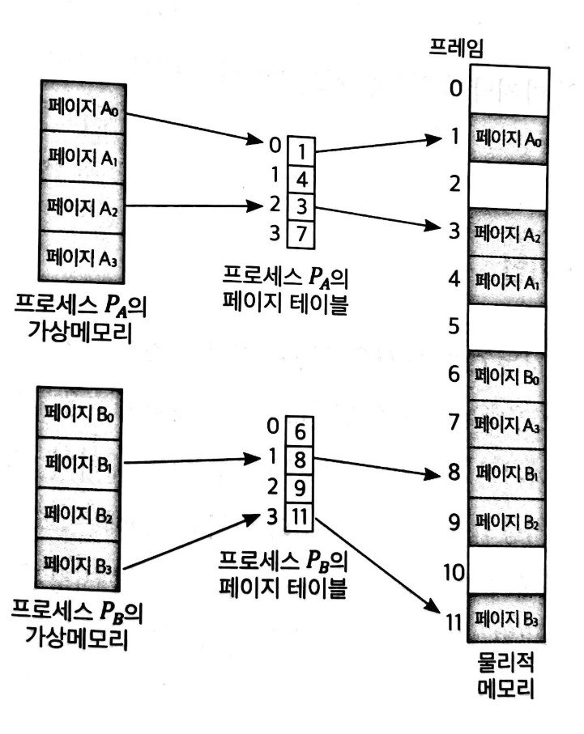 출처: 운영체제와 정보기술의 원리 

* 개념
  * 프로세스의 주소 공간을 동일한 크기의 페이지 단위로 나누어 물리적 메모리의 서로 다른 위치에 페이지들을 저장하는 방식.
  * 특정 프로세스의 몇 번째 페이지가 물리적 메모리의 몇 번째 프레임에 들어 있다는 페이지별 주소 변환 정보를 유지한다.
    * 모든 프로세스가 각각의 주소 변환을 위한 페이지 테이블을 가진다. (`key:value = 페이지 번호 : 물리적 메모리의 시작위치` 형태)
* 장점 1 - 동적 메모리 할당 문제가 발생하지 않는다.
  * 페이징 기법에서는 물리적 메모리를 페이지와 동일한 크기의 프레임(frame)으로 미리 나누어둔다. 
  * 이로인해 메모리에 올리는 단위가 모두 동일한 페이지 크기이므로, 메모리를 같은 크기로 미리 분할해두더라도 빈 프레임이 있으면 어떤 위치든 사용할 수 있다.
* 장점 2 - 메모리 효율화
  * 페이징 기법은 각 프로세스의 주소 공간 전체를 물리적 메모리에 한번에 올릴 필요가 없으므로, 일부는 백킹스토어 (swap out)에, 일부는 물리적 메모리에 혼재시키는 것이 가능하다.
* 장점 3 - 외부조각 문제는 발생하지않고, 내부조각은 간혹 조금 발생한다.
  * 페이징 기법은 프로세스의 주소 공간과 물리적 메모리가 모두 같은 크기의 페이지 단위로 나누어지기때문에 빈 공간은 어디든 활용가능하다.
  * 따라서 메모리상의 가용 공간의 크기가 작아서 빈 공간임에도 활용되지 못하는 외부조각 문제가 발생하지 않는다.
  * 단, 프로세스의 주소 공간중 제일 마지막에 위치한 페이지는 내부조각이 발생할 가능성이있다.
* 단점
  * 주소 변환 절차가 비교적 복잡하다.

 

## 5-1 주소 변환 기법

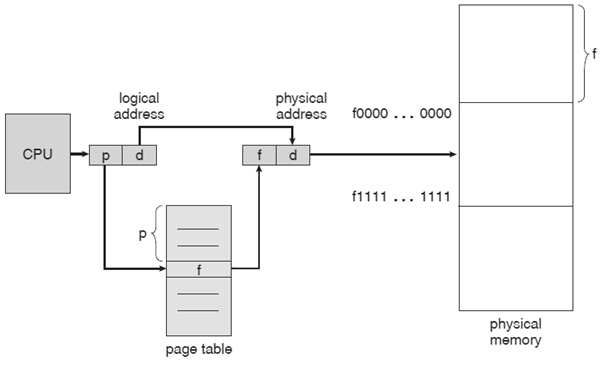 페이지 테이블을 이용한 주소 변환 출처: https://er.yuvayana.org/paging-in-operating-system-with-examples/ 

* 페이징 기법에서는 CPU가 사용하는 논리적 주소를 페이지 번호(p)와 페이지 오프셋(d)로 나누어 주소 변환에 사용한다.
  * 페이지 번호(p): 각 페이지별 주소 변환 정보를 담고있는 페이지 테이블 접근시 사용되는 인덱스 (key)
    * 페이지 테이블은 페이지 번호를 기준으로 물리적 메모리의 시작 위치(frame 번호)를 반환한다.
  * 페이지 오프셋(d): 하나의 페이지 내에서의 변위. (원하는 데이터를 해당 페이지내에서의 정확한 위치를 얻어내기 위함.)
    * 서울시 성동구 독서당로 xx길 xx 1000동 101호 -> 1000동 101호가 페이지 오프셋에 속함.
* CPU가 사용하는 논리적 주소를 물리적 주소로 변환하는 과정
  * 페이지 번호(p) -> 페이지 테이블에서 페이지 번호 기준으로 물리적 메모리상의 페이지 시작 위치(f) 반환 -> 시작 위치 (f)와 페이지 오프셋 (d)를 이용하여 정확한 물리적 주소를 얻는다.
  * 물리적 주소 = 시작 위치(f) + 변위(d)

 

## 5-2 페이지 테이블의 구현 (TLB)

🤔 **페이지 테이블**

* 페이지 테이블은 페이징 기법에서 주소 변환을 하기 위한 자료구조로, **물리적 메모리에 위치한다.**
  * **배열로 되어있다! 인덱스가 페이지 번호이며, 담겨있는 값이 물리적 메모리의 주소이다.**
* **페이지 테이블이 물리적 메모리에 위치한 이유는 비교적 용량이 크기때문에 CPU 레지스터나 캐시 메모리에 넣기 힘들기 때문이다.**

 

💁‍♂️ **CPU에서 실행 중인 프로세스의 페이지 테이블에 접근하기위해 사용되는 2개의 레지스터**

1. 페이지 테이블 기준 레지스터
   * 메모리 내에서의 페이지 테이블의 위치를 찾기위한 시작 위치를 가리킴. 
2. 페이지 테이블 길이 레지스터
   * 페이지 테이블의 크기를 보관.

 

💁‍♂️ **TLB (Translation Look-aside Buffer)**

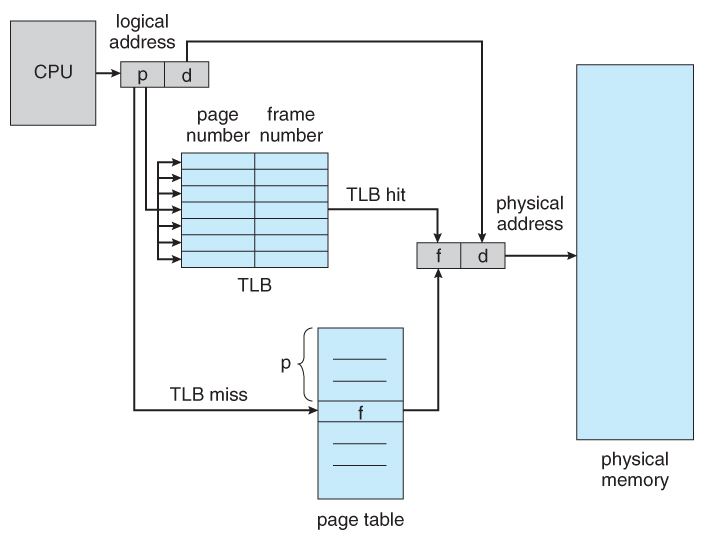 출처: 운영체제 수업. 반효경 

* **페이징 기법에서는 메모리 접근 연산이 두 가지 과정으로 나뉜다.**
  1. 논리적 메모리 -> 물리적 메모리 주소 변환을 위해 페이지 테이블에 접근.
  2. 변환된 주소에서 실제 데이터에 접근.
* **매번 위와 같이 메모리에 한 번 접근하기위해 메모리에 두 번 접근해야하는 오버헤드가 존재하는데, 이러한 성능을 향상시키기위해 사용되는 것이 TLB란 하드웨어 캐시이다.**
  * TLB는 `페이지 번호 : 물리적 메모리 프레임 번호`로 저장되며 굉장히 빠르다.
    * CPU와 물리적 메모리 사이 계층에존재한다.
  * 단, 주소 변환 정보가 프로세스별로 다르기에 컨텍스트 스위칭시 TLB에 저장된 이전 프로세스의 내용은 모두 소멸된다.

 

## 5-3 계층적 페이징

 

💁‍♂️ **페이징으로인한 메모리 낭비를 줄이기위해 2단계 페이징 기법을 사용한다.**

* 프로세스의 코드, 데이터, 스택중에서 실제 사용하는 부분은 지극히 일부분이다.
  * 실제로 사용되지않는 것이 논리적 주소의 상당부분 차지하게되며, 사용되지않음에도 페이지 테이블에 해당 데이터가 존재해야한다.
    * 사용되지않는 것이 페이지 테이블의 중간에 위치한다면.. 페이지 테이블이 배열이기때문에 없앨 수도 없다. 그대로 낭비되게 둘 수 밖에 없다.
  * 만약 수행 중인 프로세스 수가 증가한다면, 전체 메모리의 상당 부분이 주소 변환을 위한 페이지 테이블에 할애되어 실제 사용가능한 메모리 공간이 줄어들게된다.
* **이러한 메모리 공간 낭비를 줄이기위해 2단계 페이징 기법을 사용한다.**
  * 단, 계층적 페이징 기법은 속도는 조금 손해보지만, 공간을 많이 절약한다.

 

💁‍♂️ **계층적 페이징 기법은 논리적 주소를 더 세분화한 것뿐이다.**

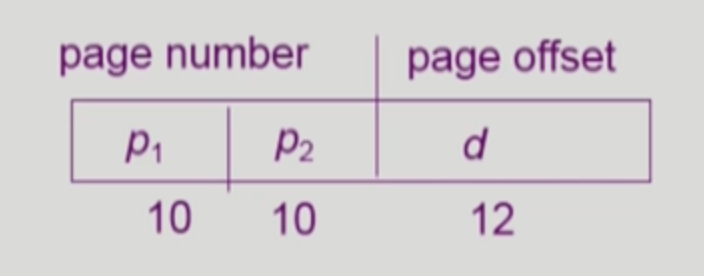 기존에 페이지 넘버가 한 개였지만, 지금은 두 개이며, 32bit 주소체계에서 위와 같이 나누게 된다. 출처: 운영체제 수업. 반효경 

* 비유
  * 1단계 페이징 - 서울시, 제주시, 천안시, 인천시로 나눔.
  * 2단계 페이징 - 서울시를 성동구, 성북구, 강남구, 서초구로. 인천시를 부평구, 미추홀구, 서구등으로 나눔.
* 위와 같이 논리적 주소를 한단계 더 나눔으로써 세세하게 나눈 것이다.
  * 10bit - page number (서울시, 제주시..)
  * 10bit - page offset (이번에 새로 생김. 성동구, 성북구, 강남구..)
  * 12bit - 기존의 page offset (독서당로 xx길 xx로.)

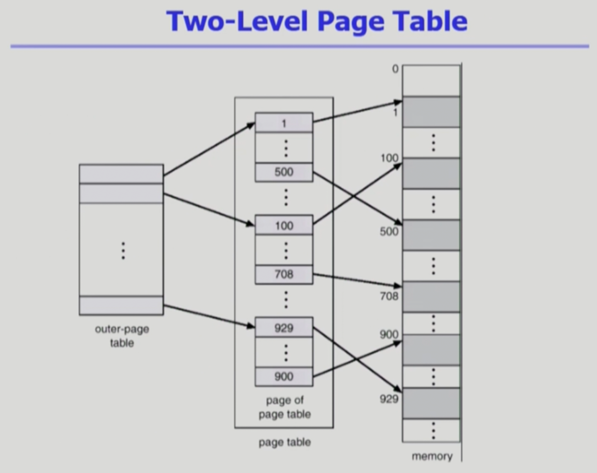 출처: 운영체제 수업. 반효경 

 

🤔 **2단계 페이징 기법이 왜 메모리 용량을 더 절약할 수 있다고하는 것일까?**

내부 페이지 테이블과 물리적 메모리가 매핑되어야하기때문에 외부 페이지 테이블의 추가로인해 더욱 공간을 낭비하는게 아닌가?

* 결론적으로 외부 페이지 테이블과 프로세스의 논리적 주소만큼 생성이되지만, 실제 사용되지않는 것을 NULL로 만듬으로써, 내부 페이지 테이블을 생성하지 않게된다.
* 이렇게되면 실제로 사용되지않는 페이지에 대한 실제 주소 변환 정보를 내부 페이지 테이블에 만들지 않기때문에 메모리를 절약할 수 있는 것.

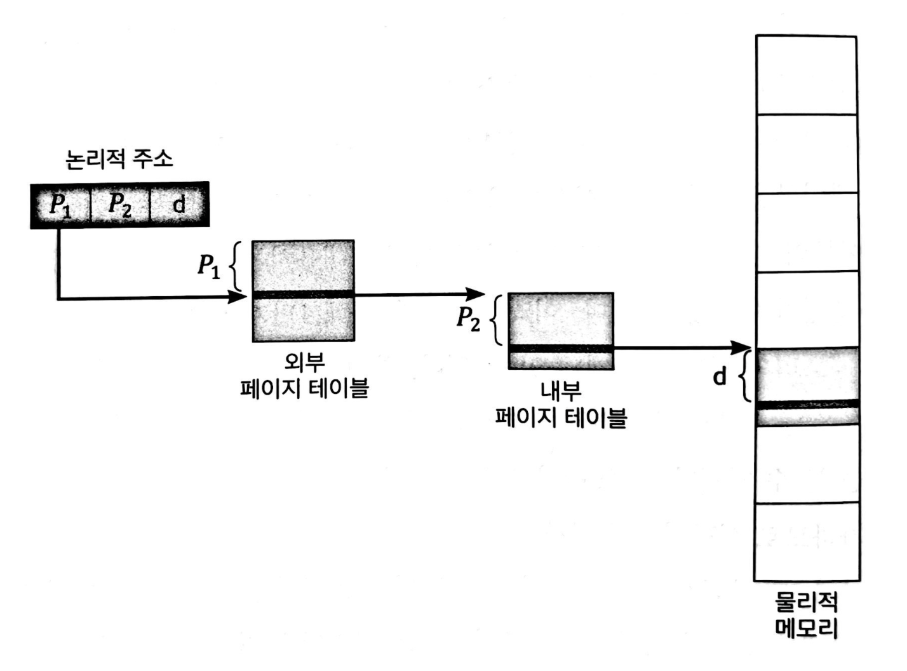 출처: 운영체제와 정보기술의 원리 

 

* 비유
  * 한 프로세스가 서울시, 제주시, 천안시, 인천시순서로 페이지 정보를 담고있다고 가정해본다.
  * 만약 제주시, 천안시에 대한 페이지가 전혀 필요없다면, 2단계 페이징기법에서는 해당 두 페이지에 대한 외부 페이지 테이블에 NULL로 저장함으로써 메모리를 절약한다.

> 즉, 기존 페이지 테이블에서 중간부분에 사용되지않는 페이지를 외부 페이지 테이블에 NULL로 함으로써 해당 테이블의 정보를 물리적 메모리에 저장하지 않는 것이다.

 

💁‍♂️ **계층적 페이징은 2단계뿐만아니라 3, 4단계 그 이상도 가능하긴하다.**

* 단계가 높아질 수록 메모리 공간을 절약되지만, 점차 속도가 줄어들게된다.
  * 메모리를 접근할 때 단계만큼 메모리 접근이 필요하기때문에 속도가 줄어드는 것.
* **물론 TLB를 사용한다면 접근 속도 저하를 보완할 수 있다. 그러므로 다단계가 큰 오버헤드가 되진 않는다. - 중요**

 

🤔 **TLB를 key:value 형식이 아닌 병렬 탐색으로 모든 항목을 탐색하는 것으로 나오는데... 왜 이렇게하지?**

프로세스는 코드, 데이터, 스택중으로 이루어지는데, 논리적 메모리의 페이징 기법에선 페이지 테이블을 배열로 구현한다고 나온다.

이로인해 페이지 테이블에 접근하려면 인덱스를 통해 접근한다.. 이로인해 프로세스에서 사용되지않는 부분의 낭비를 막기위해 다단계 페이징 기법을 사용하는 것인데.. 처음부터 key:value로 페이지 테이블을 구현하면 되는것이 아닌가?

 

## 5-4 역페이지 테이블

💁‍♂️ **페이지 테이블의 문제 - 굉장히 많은 용량을 차지한다.**

* 모든 프로세스별로 논리적 주소에 대응하는 모든 페이지에 대해 페이지 테이블 엔트리가 존재해야한다.
* 대응하는 페이지가 메모리에 있든 아니든 간에 페이지 테이블에는 엔트리가 존재해야한다. (메모리 낭비)

 

💁‍♂️ **역페이지 테이블**

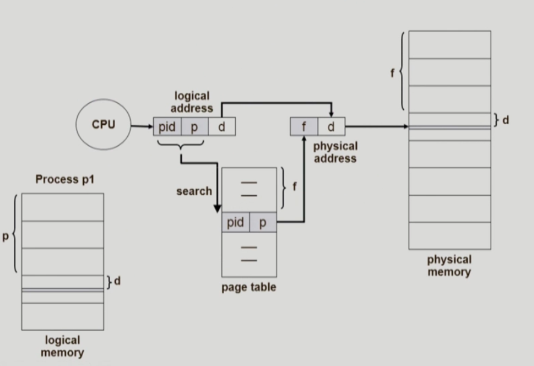 출처: 운영체제 수업. 반효경 

* 기존의 페이지 테이블
  * 프로세스마다 페이지 테이블이 존재.
* 역페이지 테이블
  * 시스템안에 페이지 테이블이 딱 하나만 존재하며, 해당 페이지 테이블은 물리적 메모리와 각 위치가 1 : 1 대응하게구성된다. 
  * 그러므로 물리적 메모리의 프레임 개수만큼 페이지 테이블의 개수가 존재하게된다. 그리고 페이지 테이블의 엔트리에 프로세스의 번호(PID)를 포함시켜 프로세스별로 주소 변환을 진행한다.
* 왜 역페이지인가?
  * 역페이지 테이블은 논리적 주소에 대해 페이지 테이블을 만드는 것이 아닌, 물리적 주소에 대해 페이지 테이블을 만드는 것이다.
  * 이로인해, 역페이지 테이블의 각 항목은 PID와 그 프로세스 내의 논리적 페이지 번호(p)를 담고있다.
* 단점
  * 주소 변환 작업은 논리적 주소로부터 물리적 주소를 얻어내는 것임에도.. 역페이지 테이블은 물리적 주소로부터 논리적 주소를 얻기 수월하게 되어있다.
  * 따라서 역페이지 테이블에 주소 변환 요청이 들어오면, 그 주소를 담은 페이지가 물리적 메모리에 존재하는지 여부를 판단하기위해 페이지 테이블을 풀스캔해야한다. (굉장히 비용이 크다.)
  * 테이블에서 p를 찾으면, 해당 인덱스를 통해 물리적 주소를 찾는다. (물리적 메모리와 주소의 위치가 인덱스로 1:1 매칭되어있기때문.)
* 물론 병렬처리를 통해 역페이지 테이블의 풀스캔 성능을 높일 순 있다.
  * 병렬처리를 통해 순차적인 풀스캔의 비용을 줄일 순 있다.

 

## 5-5 공유 페이지

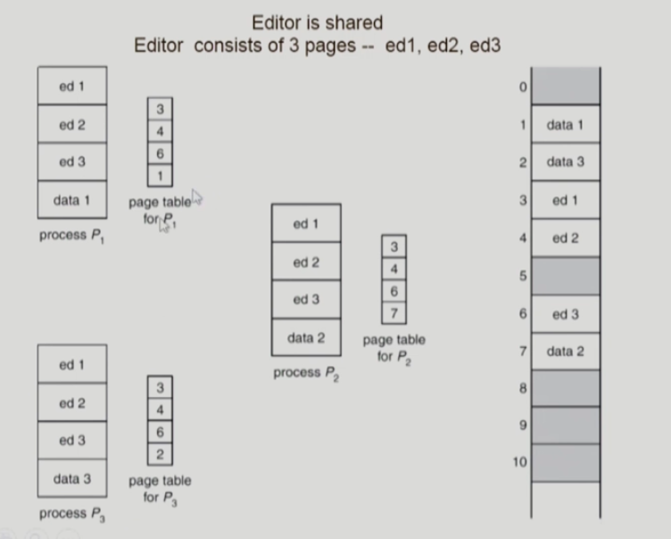 출처: 운영체제 수업. 반효경  

💁‍♂️ 공유 페이지

* 공유 코드
  * 여러 프로세스에 의해 공통으로 사용될 수 있도록 작성된 코드를 의미한다.
* 공유 페이지
  * 공유 코드를 담고있는 페이지를 의미한다.
  * 여러 프로세스에 의해 공유되는 페이지이므로 물리적 메모리에 하나만 적재되어 메모리를 좀 더 효율적으로 사용할 수 있게한다.
* 예시
  * 에디터 프로그램을 공유 페이지를 사용해서 작성할 경우, 이 프로세스를 여러 개 실행하더라도 메모리를 공유하기때문에 효율적으로 수행가능하다.
* 주의
  * 동시성 문제로인해 공유코드는 read-only의 특성을 지녀야하며, 논리적 주소 공간에서 동일한 위치에 존재해야한다.
  * 페이지 테이블은 인덱스를 기반으로 구성되기때문에, 모든 공유하는 프로세스가 동일한 페이지 번호를 가져야함.

 

## 5-6 메모리 보호
💁‍♂️ **페이지 테이블엔 각 entry마다 다른 데이터도 가지고있다.**

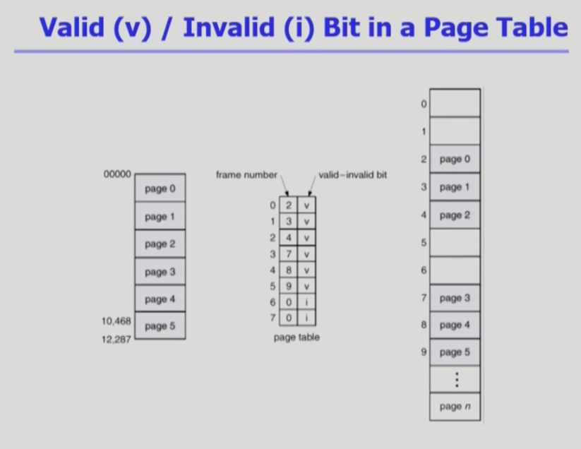 출처: 운영체제 수업. 반효경 

* 배열의 인덱스: 논리적 메모리의 페이지 번호
* frame number: 물리적 메모리의 페이지 번호
* valid-invalid bit: 주소 변환용 데이터말고도, 엔트리마다 부가적인 데이터. 
  * 프로그램이 사용하는 논리적 메모리의 페이지 개수가 존재하지만, 사용되지않는 페이지도 존재하게된다. (코드, 데이터, 스택중 중간에 위치한 데이터들.) 
    * 페이지 테이블엔 이러한 사용되지않는 영역을 구분하기위해 valid-invalid bit을 사용한다.
  * v값이면 실제 물리적 메모리에 올라와있다는 의미.
  * i값이면 물리적 메모리에 올라와있지 않다는 것이거나, 해당 페이지가 메모리에 올라와 있지 않고 swap area에 있는 경우.

> 이외에도 protection bit도 저장된다고한다.
> * page에 대한 접근 권한 (read / write / read-only)
> * 페이지마다 코드 혹은 스택등의 데이터를 가지고있는데, 코드는 수정하면 큰 부수효과가 발생할 수 있기에, 코드가 존재하는 페이지에 접근 권한을 주는 것.

 

# 6 세그먼테이션

💁‍♂️ **페이징 기법과 세그먼테이션**

* 페이징 기법
  * 프로세스의 주소 공간을 동일한 크기 단위로 나누어 물리적 메모리에 올리는 방식.
* 세그먼테이션
  * 프로세스의 주소 공간을 의미 단위로 segment로 나누어 물리적 메모리에 올리는 방식.

 

🤔 **세그먼테이션?**

* 프로세스의 구성
  * 하나의 프로세스를 구성하는 주소 공간은 코드, 데이터, 스택등의 의미있는 단위로 구성된다.
* 세그먼트
  * 세그먼트는 주소 공간을 기능 단위로 또는 의미 단위로 나눈 것을 말한다.
  * 프로세스의 주소 공간 전체를 하나의 세그먼트로 볼 수 있으나, 일반적으론 코드, 데이터, 스택등의 기능 단위로 세그먼트를 정의한다.
* 세그먼트 특징
  * 세그먼트는 논리적인 단위로 나눈 것이기때문에 페이징과 다르게 그 크기가 균일하지 않다.

 

💁‍♂️ 세그먼테이션 구성

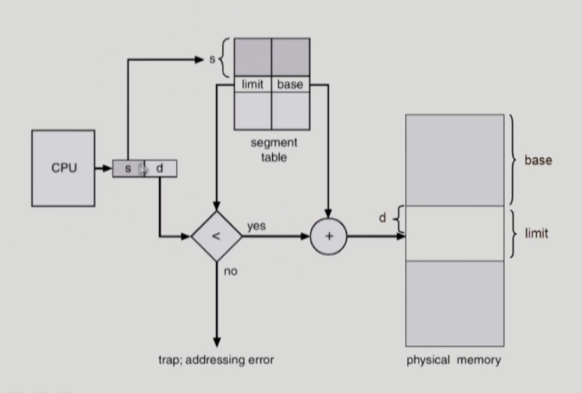 출처: 운영체제 수업. 반효경  

* 물리적 주소는 다음 두 가지로 구성된다.
  * `<segment-number, offset>`
  * segment-number는 해당 논리적 주소가 프로세스 주소 공간 내에서 몇 번째 세그먼트에 속하는지 나타낸다.
  * offset은 그 세그먼트 내에서 얼마만큼 떨어져 있는지에 대한 정보를 나타낸다.
* 세그먼트 테이블
  * 각 엔트리는 다음과 같은 정보를 가진다.
    * 기준점 (base) - 물리적 메모리에서 그 세그먼트의 시작 위치를 나타낸다.
    * 한계점 (limit) - 세그먼트의 길이를 나타낸다.
  * 페이징 기법도 기준점을 가지고있지만, 세그먼테이션은 페이징 기법과 다르게 길이가 일정하지않으므로 한계점을 가지고있는 것이다.
* 세그먼트 테이블 베이스 레지스터 (segment-table base register)
  * 현재 CPU에서 실행 중인 프로세스의 세그먼트 테이블이 메모리의 어느 위치에 있는지에 대한 시작 주소를 담고있음.
* 세그먼트 테이블 길이 레지스터 (segment-table length register)
  * 그 프로세스의 주소 공간이 총 몇 개의 세그먼트로 구성되는지, 즉 세그먼트 개수를 나타냄.

 

