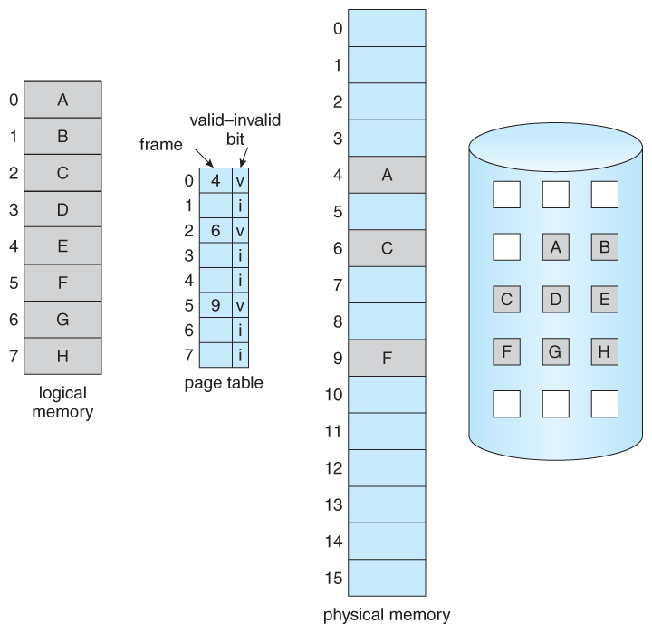
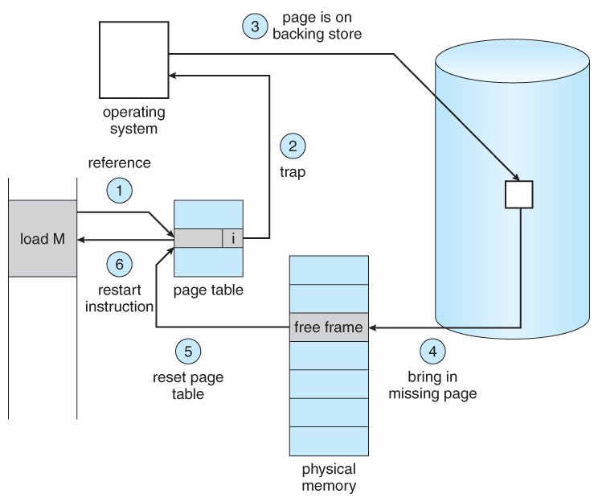
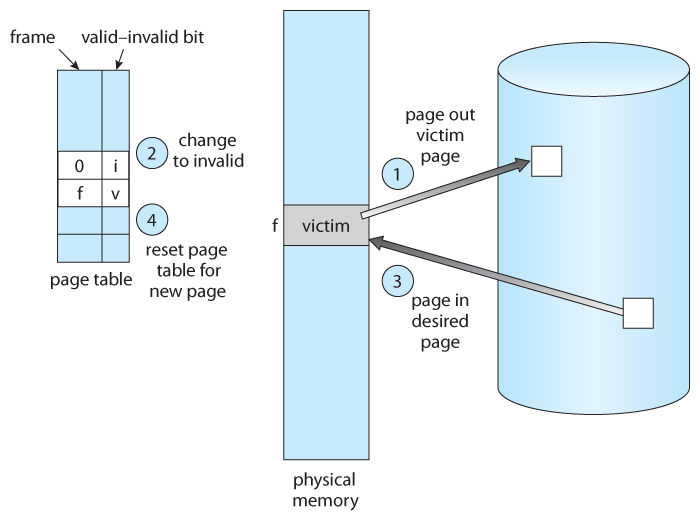
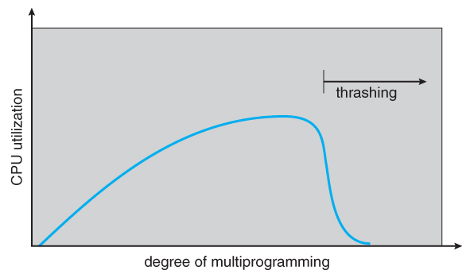

# 목차

 

- [목차](#목차)
- [1 가상메모리](#1-가상메모리)
- [2 요구 페이징](#2-요구-페이징)
- [페이지 교체](#페이지-교체)
- [페이지 프레임의 할당](#페이지-프레임의-할당)
- [전역교체와 지역교체](#전역교체와-지역교체)
- [스레싱](#스레싱)
- [추가 참고](#추가-참고)

 

# 1 가상메모리

💁‍♂️ **가상메모리란?**

* 운영체제의 역할 -> 메모리 할당
  * 프로그램이 CPU에서 실행되려면 실행에 당장 필요한 부분이 메모리에 올라와 있어야 한다.
  * **그리고 현대 운영체제는 여러 프로세스를 한번에 동작시키는데, 이때 어떤 프로그램에게 어느 정도의 메모리를 할당할 것인가에 대한 문제에 직면한다.**
* 스왑 영역
  * 프로그램이 실행되기 위해 프로세스의 주소 공간 전체가 메모리에 올라와야한다면 실행 가능한 프로세스의 개수는 한계가 존재한다. (심지어 물리적 메모리보다 큰 프로그램은 실행이 안되니.. 문제가 크다)
  * **다행히 운영체제는 CPU에서 당장 수행해야 할 부분만을 메모리에 올려놓고 그렇지 않은 부분은 디스크의 스왑 영역에 내려놓았다가 다시 필요해지면 메모리에 올라가 있는 부분과 교체하는 방식을 사용한다.**
* 물리적 메모리에 대해서 고려하지않도록 운영체제가 지원한다.
  * 스왑 영역을 활용하여 프로그램 입장에선 물리적 메모리 크기에 대한 제약을 생각하지 않아도 된다.
  * 심지어 운영체제는 프로그램이 물리적 메모리를 고려할 필요 없이 자기 자신만이 메모리를 사용하는 것처럼 가정해 프로그래밍하는 것을 지원한다.
* **가상메모리**
  * 이렇게 프로그램은 **0번지부터 시작하는 자기 자신만의 메모리 주소 공간을 가정할 수 있는데, 이러한 메모리 공간을 가상 메모리**라고 부른다.
  * 즉, **프로세스마다 각각 0번지부터의 주소 공간을 가지게 되며, 이들 공간 중 일부는 물리적 메모리에 적재되고 일부는 디스크의 스왑 영역에 존재하게 된다.**

 

💁‍♂️ **프로세스의 주소 공간을 메모리에 적재하는 단위에 따라 가상메모리 기법은 두 가지로 나뉜다.**
* 요구 페이징 방식
* 요구 세그먼테이션 방식

대부분의 경우 요구 페이징 방식을 사용하기 때문에, 책에선 요구 페이징 방식에 대해서만 서술하고있다.

 

# 2 요구 페이징

 

💁‍♂️ **요구 페이징이란**

* **프로그램 실행 시 프로세스를 구성하는 모든 페이지를 한꺼번에 메모리에 올리는 것이 아닌, 당장 사용될 페이지만을 올리는 방식.**
  * 따라서 요구 페이징 기법에서는 특정 페이지에 대해 CPU의 요청이 들어온 후에야 해당 페이지를 메모리에 올린다.
  * 프로세스가 실행되는 동안 일부 페이지만 메모리에 올리고 나머지 페이지는 디스크의 스왑 영역에 존재하게된다.

 

💁‍♂️ **장점**

* 요구 페이징 기법에서는 **당장 실행에 필요한 페이지만을 메모리에 적재하기 때문에 메모리 사용량이 감소하고, 프로세스 전체를 메모리에 올리는 데 소요되는 입출력 오버헤드도 줄어든다**.
  * 사용되지 않을 주소 영역에 대한 입출력까지 수행하던 기존 방식에 비해 응답시간을 단축시킬 수 있으며, 시스템이 더 많은 프로세스를 수용할 수 있게 해준다.
* 가장 큰 장점은 **프로그램이 물리적 메모리의 용량 제약을 벗어날 수 있게해준다**.

 

💁‍♂️ **유효-무효 비트**

 출처: https://www.cs.uic.edu/~jbell/CourseNotes/OperatingSystems/9_VirtualMemory.html

* **요구 페이징에는 유효-무효 비트를 두어 각 페이지가 메모리에 존재하는지 표시한다.**
  * 프로세스가 실행되기 전엔 몯든 페이지의 비트가 무효값으로 초기화되지만, 특정 페이지가 참조되어 메모리에 적재되는 경우 해당 페이지의 비트는 유효값으로 변경된다.
  * 그리고 메모리에 적재되어 있던 페이지가 디스크의 스왑 영역으로 쫓겨날 때에는 비트가 다시 무효값을 가지게 된다.
* 이 비트는 각 프로세스를 구성하는 모든 페이지에 대해 존재해야하므로, **페이지 테이블의 각 항목별로 저장된다.**

 

💁‍♂️ **페이지 부재** (page fault)

* **CPU가 참조하려는 페이지가 현재 메모리에 올라와 있지 않아 유효-무효 비트가 무효로 세팅되어 있는 경우 '페이지 부재'가 일어났나고 부른다.**

 

💁‍♂️ **페이징 부재 처리**

 출처: https://www.cs.uic.edu/~jbell/CourseNotes/OperatingSystems/9_VirtualMemory.html

* CPU가 무효 페이지에 접근하면 주소 변환을 담당하는 하드웨어인 MMU가 페이지 부재 트랩 (page fault trap)을 발생시킨다.
* 그러면 CPU의 제어권이 커널모드로 전환되고, 운영체제의 페이지 부재 처리 루틴이 호출되어 아래와 같은 순서로 페이지 부재를 처리한다.
  1. CPU가 페이지 N을 참조.
  2. 페이지 테이블에서 페이지 N이 무효 상태임을 확인.
  3. 페이지 부재트랩이 발생한다.
  4. 디스크에서 부재 페이지를 빈 프레임으로 적재하고 페이지 테이블을 업데이트한다.

 

💁‍♂️ **요구 페이징의 성능**

* 요구 페이징 기법의 성능에 가장 큰 영향을 미치는 요소는 페이지 부재의 발생 빈도이다.
* 페이지 부재가 일어나면 요청된 페이지를 디스크로부터 메모리에 읽어오는 막대한 오버헤드가 발생하기 때문.

 

# 페이지 교체

 

💁‍♂️ **페이지 교체란?**

 출처: https://www.cs.uic.edu/~jbell/CourseNotes/OperatingSystems/9_VirtualMemory.html

* 메모리에 빈 프레임이 존재하지 않을 경우 페이지 교체가 발생한다.
  * 페이지 부재가 발생하면 요청된 페이지를 디스크에서 메모리로 읽어와야한다.
  * 이때 물리적 메모리에 빈 프레임이 존재하지 않을 수 있다.
  * 이 경우 **메모리에 올라와 있는 페이지 중 하나를 디스크로 쫓아내 메모리에 빈 공간을 확보하는 작업**이 필요하다. -> 이것을 페이지 교체라한다.

 

💁‍♂️ **페이지 교체 알고리즘**

* 페이지 교체가 발생하고, 어떤 프레임에 있는 페이지를 쫓아낼 것인지 결정하는 알고리즘을 교체 알고리즘이라고한다.
* 알고리즘의 목표는 페이지 부재율을 최소화하는 것이다.
  * 보통 가까운 미래에 참조될 가능성이 가장 적은 페이지를 선택해서 내쫓는 것이 성능을 향상시킬 수 있는 방안이다.

 

💁‍♂️ **페이지 교체 알고리즘 성능 평가 방법**

* 주어진 페이지 참조열 (page reference string)에 대해 페이지 부재율을 계산함으로써 평가할 수 있다.
  * 페이지 참조열이란 참조되는 페이지들의 번호를 시간 순서에 따라 나열한 것이다.
  * 해당 번호의 페이지가 메모리에 이미 올라와 있으면 메모리에 hit되었다고 하고, 메모리에 없는 경우 페이지 부재가 발생했다고 말한다.

 

💁‍♂️ **알고리즘**

1. 최적 페이지 교체
   * 페이지 부재율을 가장 최소화하기 위해선 가장 먼 미래에 참조될 페이지를 쫓아내면된다. 
   * 최적 페이지 교체는 빌레디의 최적 알고리즘이라고 불리며, 가장 먼 미래에 참조되는 페이지를 선정하여 페이지 교체하는 알고리즘이다.
   * 문제는 미래에 어떤 페이지가 어떠한 순서로 참조될지 미리 안다는 전제하에 사용 가능하므로, 실제 운영체제에선 사용하기 쉽지 않다.
   * 그저 최적의 알고리즘이라고 이해하면 된다.
2. 선입선출 알고리즘
   * 말그대로 가장 먼저 올라온 페이지를 우선적으로 내쫓는 알고리즘.
   * 물리적 메모리를 증가시켰을 때 페이지 부재율이 오히려 늘어나는 단점이 있다.
3. LRU (Least Recently Used) 알고리즘
   * 마지막 참조 시점이 가장 오래된 페이지를 교체하는 알고리즘.
4. LFU (Least Frequently Used) 알고리즘
   * 페이지의 참조 횟수로 교체 페이지를 결정하는 알고리즘.
   * 즉, 물리적 메모리 내에 존재하는 페이지 중에서 과저에 참조 횟수가 가장 적었던 페이지를 쫓아내고 그 자리에 새로 참조될 페이지를 적재한다.
5. 클럭 알고리즘
   * LRU, LFU 모두 페이지의 참조 시각 및 참조 횟수를 소프트웨어적으로 유지하고 비교해야 하므로 알고리즘 운영에 오버헤드가 발생한다.
     * 클럭 알고리즘은 하드웨어적인 지원을 통해 이와 같은 알고리즘의 운영 오버헤드를 줄인 방식이다.
   * 클럭 알고리즘은 LRU를 근사시킨 알고리즘으로 NUR (Not Used Recently)알고리즘이라고 불리운다. 
     * LRU와 반대로 가장 오래된 참조된 페이지를 교체하는 것이 아닌, 오랫동안 참조되지 않은 페이지 중 하나를 교체한다.
     * 즉, LRU와 유사하지만 교체되는 페이지의 참조 시점이 가장 오래되었다는 것을 보장하진 못한다는 점에서 LRU를 근사시킨 알고리즘이라고한다.
   * 대부분의 시스템에서 페이지 교체 알고리즘으로 클럭 알고리즘을 채택한다고한다.
6. 

> 각 알고리즘별 장점과 문제점은 필요할 때 자세히 알아보고 선정하면 될 듯 하다.

 

# 페이지 프레임의 할당

 

💁‍♂️ **프로세스 여러 개가 동시에 수행되는 상황에선 각 프로세스에 얼마만큼의 메모리 공간을 할당할지 고려해야한다.**

* 프로그램별로 페이지 할당을 해주지 않으면 메모리에 특정 프로세스가 페이지 프레임을 장학하는 현상이 발생할 수 있다.
* 이를 방지하기위해선 각각의 프로그램마다 필요로하는 페이지를 할당해서 페이지 부재를 적게 나도록해줘야한다.

 

💁‍♂️ **할당 방식**

* 균등할당
  * 모든 프로세스에 동일한 개수 할당
  * 어떤 프로세스는 페이지를 많이 필요로하고 어떤 프로세스는 적게 필요로하므로 비효율적이다.
* 비례할당
  * 프로세스 크기에 비례하여 할당
  * 문제는 같은 프로세스라도 시간에 따라 필요한 페이지가 다를 수 있다.
* 우선순위 할당
  * 프로세스의 우선순위에 따라 할당
  * CPU 우선순위가 높은 프로세스에게 페이지를 더 많이 할당해주는 방식.

> **위 방식 모두 효과적이지 않을 수 있으므로, 각 프로세스별 일정 수준의 페이지 프레임 할당은 필수다.**

 

# 전역교체와 지역교체

페이지 교체시 교체 대상이 될 프레임의 범위에 따라 전역과 지역으로 나뉜다.

 

💁‍♂️ **전역 교체**

* 모든 페이지 프레임이 교체 대상이되는 방안.
* 프로세스마다 페이지 프레임을 미리 할당하지 않고, 전체 메모리를 각 프로세스가 공유해서 교체 알고리즘에 근거해서 할당되는 메모리 양을 가변적으로 교체한다.
  * 즉, 교체 대상 페이지가 어떤 프로세스에 속한 것인지는 고려하지 않는다.

 

💁‍♂️ **지역교체**

* 현재 수행 중인 프로세스에게 할당된 프레임 내에서만 교체 대상을 선정하는 방안.
* 지역교체는 프로세스마다 페이지 프레임을 미리 할당하는 것을 전제로한다.

 

# 스레싱

 

💁‍♂️ **스레싱이란?**

 x축이 멀티 프로그래밍 정도이며, y축이 CPU 사용률이다. 출처: https://www.cs.uic.edu/~jbell/CourseNotes/OperatingSystems/9_VirtualMemory.html

* 페이지 부재가 발생하면 OS내 trap이 발생한다. 보통 OS는 I/O 작업을 하러가면 CPU의 낭비를 방지하기위해 CPU 사용률이 낮아진다. (I/O 작업이 완료되었다고하면 그때 다시 작업시작 -> Event 처리 방식과 유사)
* **문제는 프로세스마다 메모리가 너무 적게 할당되어 페이지 부재가 아주 빈번히 발생하면 I/O 처리량만 늘어남으로써 CPU 사용률이 낮아지는 문제가 발생한다. 이러한 현상을 스레싱이라한다.**
  * 메모리에 동시에 올라가 있는 프로세스의 수가 많아져서 각 프로세스가 갖는 메모리 용량이 적으면 프로세스에게 페이지가 너무 적게 할당되어 잦은 페이지 부재가 발생할 수 있다.
  * 이럼 I/O 작업을 해야하므로, CPU 사용률이 줄어드는 것.

 

💁‍♂️ **더 큰 문제는..**

* OS는 CPU 이용률이 낮아지면 프로그램을 메모리에 더 올려야한다고 판단하기때문에 프로그램을 계속해서 올린다.
* 즉, 프로그램이 계속 메모리가 올라갈 수록 페이지 부재가 더 자주 발생하여, 페이지 교체하고 I/O 작업하느라 CPU는 할 일이 없어서 한가한 상황이 되어버린다.

 

💁‍♂️ **정리하면 멀티 프로그래밍 정도와 CPU 이용률의 상관관계가 존재한다.**

* 메모리 내에 프로세스의 수를 증가시키면 CPU 이용률이 이에 비례해서 증가하게 된다.
* 그러나 어느 한계치를 넘어서면 CPU 이용률이 급격하게 떨어진다. -> 스레싱

 

💁‍♂️ **따라서 스레싱이 발생하지 않도록 하면서 CPU 이용률을 최대한 높일 수 있도록 멀티 프로그래밍 정도를 조절해야한다.**

* 멀티 프로그래밍 정도를 조절하는 알고리즘으로 크게 두 가지가 있다.
  * **워킹셋 알고리즘**
    * 집중적으로 참조되는 페이지들을 집합으로 묶어서 한번에 메모리에 올리고, 디스크에 내리는 방식이다.
    * 집합으로 묶을 워킹셋 윈도우를 사용하여 각 프로세스가 처리에 필요한 페이지를 한번에 내리고 한번에 올리는 방식.
    * 이는 **프로세스가 너무 많으면 워킹셋에의해 메모리에 올리는 프로세스의 개수를 제한함으로써 멀티 프로그래밍 정도를 줄인다. 반면 프레임이 남으면 프로세스의 워킹 셋을 한번에 올려 멀티프로그래밍 정도를 증가시킨다.**
  * **페이지 부재 빈도 알고리즘**
    * 프로세스의 페이지 부재율을 주기적으로 조사하고 이 값에 근거해서 각 프로세스에 할당할 메모리 양을 동적으로 조절한다.
    * 어떤 프로세스의 페이지 부재율이 시스템에서 미리 정해높은 상한값을 넘게되면 이 프로세스에 할당된 프레임의 수가 판단하여 프레임을 추가로 할당한다.
    * 반면 프로세스의 페이지 부재율이 하한값이하로 떨어지면 이 프로세스에게 필요 이상으로 많은 프레임이 할당된 것으로 간주해 할당된 프레임의 수를 줄인다.

 

# 추가 참고
* https://www.cs.uic.edu/~jbell/CourseNotes/OperatingSystems/9_VirtualMemory.html

