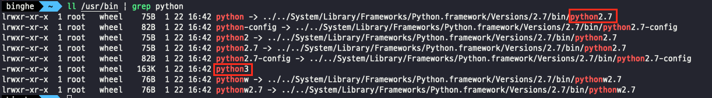
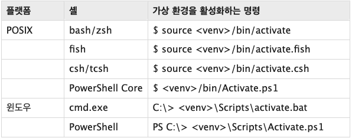

# 목차

<br>

- [목차](#목차)
- [들어가며](#들어가며)
- [파이썬 설치](#파이썬-설치)
- [가상 환경](#가상-환경)
- [venv 가상 환경 사용법](#venv-가상-환경-사용법)
  - [가상 환경 생성 및 활성화](#가상-환경-생성-및-활성화)
  - [가상 환경 비활성화](#가상-환경-비활성화)
  - [가상 환경에 패키지 설치](#가상-환경에-패키지-설치)
- [참고](#참고)

<br>

# 들어가며
파이썬은 `venv` 모듈을 통해 자체 디렉토리를 갖는 경량 "가상 환경"을 지원한다.

또한, 선택적으로 시스템 사이트 디렉토리에서 격리할 수 있도록 지원한다.

각 가상 환경은 고유한 파이썬 바이너리를 가지며, 자신의 디렉토리에 독립적으로 설치된 파이썬 패키지 집합을 가질 수 있다.

이번 글에선 파이썬에 익숙치 않은 개발자를 대상으로, 파이썬을 설치하고 `venv`를 통해 간단한 가상 환경을 구축해본다.

> 이번 글은 맥북 사용자를 대상으로 작성된 글이다.

<br>

# 파이썬 설치
`venv` 모듈을 사용하려면 당연히 파이썬이 설치되어있어야 한다.

사실 맥 사용자라면 파이썬을 설치할 필요 없이, 이미 맥에 설치가 되어있다.

<br>

```shell
$ which python
/usr/bin/python

$ which python3
/usr/bin/python3
```
`python`과 `python3` 모두 설치되어있는 것을 알 수 있다.

<br>

각각은 무엇을 가리키고있는지 아래 명령어를 통해 확인할 수 있다.

```shell
$ ll /usr/bin | grep python
```

<p align="center"> </p>

* `python` -> `python2.7`를 가리킨다.
* `python3` -> `python3`를 가리킨다.
  * `python3 --version`을 통해 버전을 확인해보니 `python 3.8.9`를 가리킨다.

> 맥의 운영체제 그리고 버전별로 설치된 Python 버전을 다를 것으로 예상된다.

<br>

# 가상 환경

<br>

🤔 **가상 환경이란?**

파이썬은 버전 별로 다른 점도 많으므로, 프로젝트별로 버전을 깔끔하게 사용하고자하는 요구가 많다.

그래서인지 파이썬에선 여러 가지의 가상 환경 툴이 존재한다.

**가장 환경이란 파이썬과 원하는 모듈만 담아 운용하는 독립된 공간을 의미한다.**

그리고 가상 환경을 이용한다면 아래와 같은 이점을 얻을 수 있다.

* 독립된 파이썬 환경을 구축할 수 있다.
* 의존성과 버전 문제 차이로 인한 충돌 문제를 해결할 수 있다.

<br>

💁‍♂️ **다양한 가상 환경 툴이 있다.**

파이썬은 아래와 같이 여러 가지의 가상 환경 툴을 제공한다.

* virtualenv
* conda
* pipenv
* pyenv

위와 같이 다양하게 많지만, 파이썬에서 표준배포판에 탑재한 가상 환경 툴은 `venv`이다.

> Python 3.4부터 표준배포판에 탑재되었다.

<br>

이번 글에선 `venv`의 사용법을 다룬다.

<br>

# venv 가상 환경 사용법

<br>

## 가상 환경 생성 및 활성화

<br>

💁‍♂️ **가상 환경을 만들 디렉토리로 이동 (프로젝트)**

```shell
$ cd {project directory}
```

<br>

💁‍♂️ **가상 환경 생성**

```shell
$ python3 -m venv ./{project directory}
```

<br>

💁‍♂️ **가상 환경 활성화**

OS 별로 가상 환경을 활성화 시키는 방법은 다양하다.

<p align="center"><br>출처: https://docs.python.org/ko/3/library/venv.html </p>

이번 글은 맥 대상이기 때문에 `bash/zsh` 셸 방식을 이용한다.

```shell
$ source {project directory}/bin/activate
```

만약 `iterm`기반의 zsh 셸에서 가상 환경이 제대로 활성화 되었다면 아래와 같이 왼쪽에 가상 환경 이름이 출력된다.

<p align="center"> </p>

<br>

## 가상 환경 비활성화

<br>

💁‍♂️ **가상 환경 비활성화**

```shell
$ deactivate
```

<br>

## 가상 환경에 패키지 설치
파이썬을 사용할 때 많이 사용되는 Jupyter Notebook을 설치해본다.

<br>

💁‍♂️ **패키지 설치** (Jupyter Notebook)

```shell
$ pip install jupyter notebook
```

<br>

💁‍♂️ **주피터 실행**

```shell
$ jupyter notebook
```

<br>

> 만약 pip 에러가 난다면 `pip install --upgrade pip`를 해주면 된다.

<br>

# 참고
* https://docs.python.org/ko/3/library/venv.html
