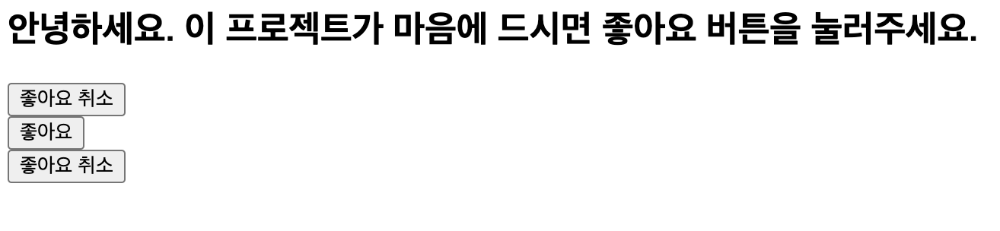
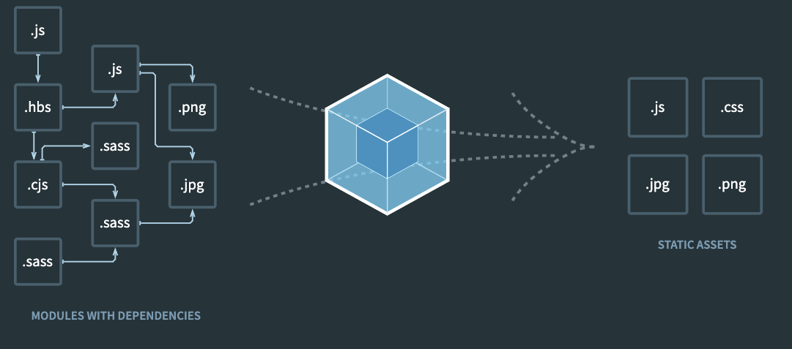
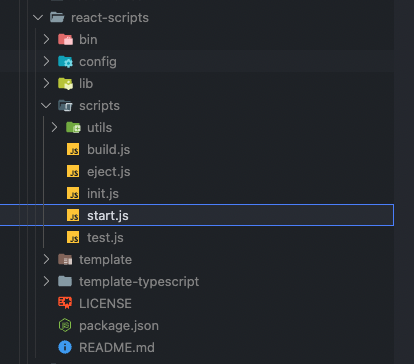

# 목차

<br>

- [목차](#목차)
- [리액트 프로젝트 시작하기](#리액트-프로젝트-시작하기)
- [1 리액트란 무엇이고, 왜 사용하는가](#1-리액트란-무엇이고-왜-사용하는가)
- [2 리액트 개발 환경 직접 구축해보기](#2-리액트-개발-환경-직접-구축해보기)
  - [2-1 **리액트 JS 파일 다운**](#2-1-리액트-js-파일-다운)
  - [2-2 **간단한 웹 애플리케이션 만들기**](#2-2-간단한-웹-애플리케이션-만들기)
  - [2-3 여러 개의 DOM 요소에 랜더링하기 (컴포넌트 재활용 예시)](#2-3-여러-개의-dom-요소에-랜더링하기-컴포넌트-재활용-예시)
  - [2-4 바벨 사용](#2-4-바벨-사용)
    - [바벨 이해하기](#바벨-이해하기)
  - [2-5 웹팩 사용하기](#2-5-웹팩-사용하기)
    - [웹팩 이해하기](#웹팩-이해하기)
- [3 create-react-app으로 시작하기](#3-create-react-app으로-시작하기)
- [참고](#참고)

<br>

# 리액트 프로젝트 시작하기
리액트를 사용하여 웹 프론트 애플리케이션을 만들기에앞서, 리액트를 사용하여 어떻게 프로젝트를 구성하고 사용하는지 살펴본다.

<br>

# 1 리액트란 무엇이고, 왜 사용하는가
* 리액트는 페이스북에서 개발하고 관리하는 UI 라이브러리이다.
  * 리액트는 SPA이나 모바일 애플리케이션 개발에 사용될 수 있다.
* **리액트는 프레임워크가 아닌 라이브러리이다.**
  * 앵귤러, 뷰와 다르게 리액트는 전적으로 UI를 랜더링하는데만 관여한다. 
    * **따라서 전역 상태 관리, 라우팅, 빌드 시스템등을 각 개발자가 직접 구축해줘야한다.**
  * **화면 랜더링외엔 모두 기타 라이브러리를 사용하여 각자 상황에 맞춰 환경을 구축해야한다.**
    * 라우팅 (페이지 이동) - `react-router-dom`
    * 상태 관리 - `redux`, `mobx`, `recoil`
    * 테스트 - `Jest`, `Mocha`
* 리액트 사용이유
  * 변경된 상탯값에 따라 UI를 자동으로 업데이트해준다.
    * API 통신이나 사용자 이벤트에 따라 프로그램의 상태 값이 변경될 때마다, 직접 Vanilla JS로 처리하면 코드가 기하급수적으로 복잡해진다.
    * 리액트에 상응하는 자체 라이브러리를 사용하면 복잡하지않게 이를 처리할 수 있다.
  * 가상 돔 (virtual dom)
    * 가상 돔을 통해 UI를 빠르게 업데이트한다. (가상 돔과 관련해서는 다른 글에서 더 자세히 정리할 예정이다.)
  * Component 단위 개발
    * 컴포넌트는 UI를 구성하는 개별적인 뷰 단위이며, UI가 레고라면 컴포넌트는 블록 역할을한다고 볼 수 있다. 리액트는 이렇게 컴포넌트라는 블록을 조립해 하나의 완성품을 만들 수 있으며, 하나의 컴포넌트를 다양한 곳에 재활용할 수 있게해준다. (생산성과 유지보수에 좋다.)
  * JSX
    * JSX는 Javascript + xml로 JS에 대한 확장 구문이다. 리액트에서는 JSX로 구현된 element (요소)를 바벨을 통해 리액트 코드로 변환함으로써 사용된다.

<br>

# 2 리액트 개발 환경 직접 구축해보기
흔히 리액트 개발 환경을 세팅할 때 사용하는 `create-react-app` 을 사용하지않고, 직접 리액트 개발 환경을 구축하면서, 리액트외적으로 필요한 라이브러리 (바벨과 웹팩)에 대해 이해해본다.

<br>

## 2-1 **리액트 JS 파일 다운**

우선 4개의 파일을 리액트 테스트 폴더에 다운한다. (테스트할 아무 디렉토리에 다운받아놓으면 된다.)

* [https://unpkg.com/react@16.14.0/umd/react.development.js](https://unpkg.com/react@16.14.0/umd/react.development.js)
* [https://unpkg.com/react@16.14.0/umd/react.production.min.js](https://unpkg.com/react@16.14.0/umd/react.production.min.js)
* [https://unpkg.com/react-dom@16.14.0/umd/react-dom.development.js](https://unpkg.com/react-dom@16.14.0/umd/react-dom.development.js)
* [https://unpkg.com/react-dom@16.14.0/umd/react-dom.production.min.js](https://unpkg.com/react-dom@16.14.0/umd/react-dom.production.min.js)

<br>

## 2-2 **간단한 웹 애플리케이션 만들기**

다운받은 리액트 JS 파일을 사용하여 간단한 웹 애플리케이션을 만들어본다. 

그리고 **다른 라이브러리 (바벨, 웹팩) 도움없이 기존의 HTML과 JS의 조합으로만 리액트 애플리케이션을 실행해본다.**

> simple1.html
```html
<html>
    <body>
        <h2>안녕하세요. 이 프로젝트가 마음에 드시면 좋아요 버튼을 눌러주세요.</h2>
        <div id="react-root"></div>
        <script src="react.development.js"></script>
        <script src="react-dom.development.js"></script>
        <script src="simple1.js"></script>
    </body>
</html>
```
* 리액트로 렌더링할 때 사용할 돔 요소 생성 (`<div id="react-root"></div>`)
* script 태그로 필요한 리액트 파일 입력 (의존성 불러오기)
* `simple1.js`에 리액트 코드를 작성한다.

<br>

> simple1.js
```js
// 컴포넌트 정의
function LikeButton(){
    const [liked, setLiked] = React.useState(false); // 컴포넌트 상태값 정의.
    const text = liked ? '좋아요 취소' : '좋아요';
    return React.createElement( // 리액트 요소 반환 (버튼 돔)
        'button',
        { onClick: () => setLiked(!liked)}, // 버튼을 클릭하면 호출되며, 컴포넌트 상태값이 변경된다.
        text
    );
}
const domContainer = document.querySelector('#react-root'); // 대상 dom 가져오기
ReactDOM.render(React.createElement(LikeButton), domContainer); // LikeButton 컴포넌트를 dom에 붙인다.
```
* React 관련된 변수는 모두 HTML에서의 script 태그를 통해 전역 변수로 생성된다.

> 🤔 **`React.createElement`란 -> 인자로 주어지는 타입에 따라 새로운 React 엘리먼트를 생성하여 반환한다.**
> 
> ```js
> // createElement를 사용하지 않는 일반 HTML
> <div>
> 	<p>hello</p>
> 	<p>world</>
> </div>
>
> // createElement를 사용하는 리액트 코드
> createElement(
> 	'div',
> 	null,
> 	createElement('p', null, 'hello'),
> 	createElement('p', null, 'world'),
> )
> ```

<br>

💁‍♂️ **랜더링 결과**

`simple1.html`을 통해 브라우저에 랜더링하며 아래와 같이 랜더링된다.

<p align="center"><br>랜더링 결과 </p>

그리고 `좋아요` 버튼은 `좋아요`와 `좋아요 취소`를 번갈아가며 변경된다.

<br>

## 2-3 여러 개의 DOM 요소에 랜더링하기 (컴포넌트 재활용 예시)
이번엔 좋아요 컴포넌트 (`LikeButton`)을 재활용하여 여러 DOM 요소에 랜더링해본다.

> simple2.html
```html
<html>
    <body>
        <h2>안녕하세요. 이 프로젝트가 마음에 드시면 좋아요 버튼을 눌러주세요.</h2>
        <div id="react-root1"></div>
        <div id="react-root2"></div>
        <div id="react-root3"></div>
        <script src="react.development.js"></script>
        <script src="react-dom.development.js"></script>
        <script src="simple2.js"></script>
    </body>
</html>
```
간단한 HTML을 만들어주고, 컴포넌트를 구성한다.

> simple2.js
```js
// 좋아요 컴포넌트
function LikeButton(){
    const [liked, setLiked] = React.useState(false);
    const text = liked ? '좋아요 취소' : '좋아요';
    return React.createElement(
        'button',
        { onClick: () => setLiked(!liked)},
        text
    );
}

// 각 DOM에 컴포넌트를 랜더링한다.
ReactDOM.render(
    React.createElement(LikeButton),
    document.querySelector('#react-root1')
);
ReactDOM.render(
    React.createElement(LikeButton),
    document.querySelector('#react-root2')
);
ReactDOM.render(
    React.createElement(LikeButton),
    document.querySelector('#react-root3')
);
```
* `LikeButton` 컴포넌트는 수정하지 않으며, 세 개의 DOM 요소에 랜더링하게 된다.
  * 이는 재활용할 수 있으며, 이를 통해 유지보수가 편하다는 장점을 가지게된다.

<br>

💁‍♂️ **랜더링 결과**

`simple2.html`을 통해 브라우저에 랜더링하며 아래와 같이 랜더링된다.

<p align="center"><br>랜더링 결과 </p>

좋아요 버튼이 세 개 랜더링 되고 있는 것을 볼 수 있다.

<br>

## 2-4 바벨 사용
이번엔 `좋아요` 버튼을 누르면 카운트가 증가하고 감소하는 예시를 구현하면서 바벨의 개념과 필요한 이유에 대해서 알아본다.

<br>

💁‍♂️ **바벨을 사용하지 않는다면**

우선 바벨을 사용하지않고, 예시를 구현해본다.

> simple3.html

```html
<html>
    <body>
        <h2>안녕하세요. 이 프로젝트가 마음에 드시면 좋아요 버튼을 눌러주세요.</h2>
        <div id="react-root"></div>
        <script src="react.development.js"></script>
        <script src="react-dom.development.js"></script>
        <script src="simple3.js"></script>
    </body>
</html>
```

> simple3.js

```js
// 좋아요 컴포넌트
function LikeButton(){
    const [liked, setLiked] = React.useState(false);
    const text = liked ? '좋아요 취소' : '좋아요';
    return React.createElement(
        'button',
        { onClick: () => setLiked(!liked)},
        text
    );
}
// 좋아요 컴포넌트의 상위 컴포넌트
function Container(){
    const [count, setCount] = React.useState(0);
    return React.createElement(
        'div',
        null,
        React.createElement(LikeButton),
        React.createElement(
            'div',
            {style: {marginTop:20}},
            React.createElement('span', null, '현재 카운트: '),
            React.createElement('span', null, count),
            React.createElement(
                'button',
                {onClick: () => setCount(count + 1)},
                '증가',
            ),
            React.createElement(
                'button',
                {onClick: () => setCount(count - 1)},
                '감소',
            ),
        ),
    );
}
const domContainer = document.querySelector('#react-root');
ReactDOM.render(React.createElement(Container), domContainer);
```
* 코드를 보면 알겠지만.. `Container`의 컴포넌트가 굉장히 이해하기 힘들고 복잡하다.

<br>

💁‍♂️ **바벨에서 지원하는 JSX 문법을 사용하면 위 코드를 이해하기 쉬운 코드로 리팩토링 할 수 있다.**

JSX를 이용하도록 리팩토링하면 위 코드는 이해하기 쉬운 코드로 리팩토링 할 수 있다.

> simple4.html

```html
<html>
    <body>
        <h2>안녕하세요. 이 프로젝트가 마음에 드시면 좋아요 버튼을 눌러주세요.</h2>
        <div id="react-root"></div>
        <script src="react.development.js"></script>
        <script src="react-dom.development.js"></script>
        <script src="simple4.js"></script>
    </body>
</html>
```

> simple4.js

```js
function LikeButton(){
    const [liked, setLiked] = React.useState(false);
    const text = liked ? '좋아요 취소' : '좋아요';
    return React.createElement(
        'button',
        { onClick: () => setLiked(!liked)},
        text
    );
}
function Container(){
    const [count, setCount] = React.useState(false);
    return (
        <div>
            <LikeButton />
            <div style={{marginTop:20}}>
                <span>현재 카운트: </span>
                <span>{count}</span>
                <button onClick={() => setCount(count + 1)}>증가</button>
                <button onClick={() => setCount(count - 1)}>감소</button>
            </div>
        </div>
    );
}
const domContainer = document.querySelector('#react-root');
ReactDOM.render(React.createElement(Container), domContainer);
```

💁‍♂️ **이제 위 코드를 바벨을 이용하여 컴파일 해주면 된다.**

* `npm install @babel/core @bable/cli @bable/preset-react`
  * `@babel/cli` - cli로 바벨을 실행할 수 있게해주는 바이너리 파일
  * `@babel/preset-react` - JSX로 작성된 코드를 `createElement` 함수로 변환해주는 플러그인.
* `npx bable --watch src --out-dir . --presets @babel/preset-react`
  
> 더 자세한 내용은 [바벨 예시](https://babeljs.io/repl#?browsers=defaults%2C%20not%20ie%2011%2C%20not%20ie_mob%2011&build=&builtIns=false&corejs=3.6&spec=false&loose=false&code_lz=GYVwdgxgLglg9mABACwKYBt1wBQEpEDeAUIogE6pQhlIA8AJjAG4B8AEhlogO5xnr0AhLQD0jVgG4iAXyJA&debug=false&forceAllTransforms=false&shippedProposals=false&circleciRepo=&evaluate=false&fileSize=false&timeTravel=false&sourceType=module&lineWrap=true&presets=react&prettier=false&targets=&version=7.20.4&externalPlugins=&assumptions=%7B%7D)를 참고.

바벨로 컴파일하면 `src`에 존재하던 `simple4.js`가 아래와 같이 컴파일 된다.

<details>
  <summary>바벨로 컴파일된 결과</summary>
  
  ---
  ```js
  function LikeButton() {
    const [liked, setLiked] = React.useState(false);
    const text = liked ? '좋아요 취소' : '좋아요';
    return React.createElement('button', {
      onClick: () => setLiked(!liked)
    }, text);
  }
  function Container() {
    const [count, setCount] = React.useState(0);
    return /*#__PURE__*/React.createElement("div", null, /*#__PURE__*/React.createElement(LikeButton, null), /*#__PURE__*/React.createElement("div", {
      style: {
        marginTop: 20
      }
    }, /*#__PURE__*/React.createElement("span", null, "\uD604\uC7AC \uCE74\uC6B4\uD2B8: "), /*#__PURE__*/React.createElement("span", null, count), /*#__PURE__*/React.createElement("button", {
      onClick: () => setCount(count + 1)
    }, "\uC99D\uAC00"), /*#__PURE__*/React.createElement("button", {
      onClick: () => setCount(count - 1)
    }, "\uAC10\uC18C")));
  }
  const domContainer = document.querySelector('#react-root');
  ReactDOM.render(React.createElement(Container), domContainer);
  ```
  결과에서 알 수 있듯이, JSX로 구현된 코드가 모두 `React.createElement`등으로 변환된 것을 볼 수 있다.
  
  ---
</details>

<br>

❗️ **JSX를 사용하기위해선 `/src` 폴더안에 JS 파일을 넣어줘야한다.**

```js
./
├── react-dom.development.js
├── react-dom.production.min.js
├── react.development.js
├── react.production.min.js
├── simple1.html
└── src
    └── simple1.js
```

<br>

### 바벨 이해하기
* 바벨이란?
  * 최신 자바스크립트 문법을 지원하지 않는 브라우저들을 위해서 최신 자바스크립트 문법을 구형 브라우저에서도 돌 수 있게해주는 변환 라이브러리이다.
* 바벨 사용처
  * 구형 브라우저 호환
  * 코드 압축
  * JSX 문법 변환 (JSX문법으로 작성된 코드를 `createElement` 함수를 호출하는 코드로 변환해준다)

<br>

## 2-5 웹팩 사용하기
마지막으로 리액트를 사용하는데 빼놓을 수 없는 웹팩 사용하는 예시를 살펴본다.

<br>

💁‍♂️ **폴더 생성 및 외부 패키지 불러오기**

```shell
mkdir {폴더}
npm init -y
npm install webpack webpack-cli react react-dom
```

<br>

💁‍♂️ **리액트 예시 구현**

> index.html

```html
<html>
    <body>
        <h2>안녕하세요. 이 프로젝트가 마음에 드시면 좋아요 버튼을 눌러주세요.</h2>
        <div id="react-root"></div>
        <!-- react 불러오는 script제거 -->
        <!-- simple.js던 내용 수정 -->
        <script src="dist/main.js"></script>
    </body>
</html>
```
* 눈여겨 봐야할 부분은 기존의 JS에서 `script`를 통해 불러오던 react 코드들이 모두 없어졌다.
  * 대신 웹팩을 사용하여 리액트의 의존성을 가져온다.

<br>

> src/index.js

```js
import React from 'react';
import ReactDOM from 'react-dom';
import Button from './Button.js';

function Container(){
    return React.createElement(
        'div',
        null,
        React.createElement('p', null, '버튼을 클릭해 주세요.'),
        React.createElement(Button, {label: '좋아요'}),
        React.createElement(Button, {label: '싫어요'}),
    );
}
const domContainer = document.querySelector('#react-root');
ReactDOM.render(React.createElement(Container), domContainer);
```

> src/Button.js
```js
import React from 'react';

export default function Button(props) {
    return React.createElement('button', null, props.label);
}
```
* `export`, `import`등 ESM (ES6의 모듈 시스템)을 활용한 것을 볼 수 있다.

<br>

💁‍♂️ **최종적으론 아래와 같은 디렉토리 구조가 완성된다.**

```shell
├── package.json
├── index.html
└── src
    ├── Button.js
    └── index.js
```

<br>

💁‍♂️ **웹팩을 이용하여 자바스크립트 파일을 하나의 파일로 합친다.**

```shell
npx webpack
```

그럼 아래와 같이 `dist` 폴더안에 `main.js` 파일이 생성된다.

```shell
├── package.json
├── index.html
└── src
    ├── Button.js
    └── index.js
└── dist
		└── main.js
```

**그리고 `index.html`을 브라우저에 랜더링해주면 된다.**

<br>

### 웹팩 이해하기

<p align="center"><br>출처: https://webpack.js.org/ </p>

- **웹팩이 필요한 이유**
    - **전통적인 방식으로는 HTML 코드안에 `<script>` 태그를 이용하여 JS를 실행했다. 하지만 JS 파일이 굉장히 많아지며 한 페이지에도 여러 개의 JS 파일이 필요해지면서 관리하기가 힘들어졌다.**
    - 또한, **파일 간의 의존성 때문에 선언되는 순서를 신경 써야 하기 때문에 필요하다. 이는 뒤에 선언된 JS 파일이 앞에 선언된 파일에서 생성한 전역 변수를 덮어쓰는 위험도있었다.**
- 웹팩이 만들어진후엔
    - 웹팩을 실행하여 여러 JS파일을 하나의 JS로 만든다. (물론 원한다면 여러 개의 JS 파일로 분할할 수 있다)
    - 그리고 웹팩이 만들어 준 JS 파일을 HTML의 `<script>` 태그에 포함만 시켜주면 된다.
- 웹팩이란?
    - 웹팩이란 오픈 소스 자바스크립트 모듈 번들러로써 여러 개로 나누어져 있는 파일들을 하나의 자바스크립트 코드로 압축하고 최적화하는 라이브러리이다.
    - 자바스크립트로 만든 프로그램을 배포하기 좋은 형태로 묶어주는 도구.
- 웹팩이 장점
    1. 여러 파일의 자바스크립트 코드를 압축하여 최적화 할 수 있기때문에 로딩에 대한 네트워크 비용을 줄일 수 있다.
    2. 모듈 단위로 개발이 가능하여, 가독성과 유지보수가 쉽다.

<br>

# 3 create-react-app으로 시작하기
위와 같이 매번 리액트에 필요한 모듈을 직접 구성해줄 필요는 없다.
**대신 `npx create-react-app <폴더 이름>`을 통해 쉽게 리액트 환경을 구축할 수 있다.**

<br>

💁‍♂️ **`create react app`으로 실행된 리액트의 기본 구조 살펴보기**

`npx create-react-app <폴더 이름>`로 리액트 프로젝트는 생성했다면, 리액트의 기본 구조는 아래와 같다.

```shell
my-app/
  README.md
  node_modules/
  package.json
  public/
    index.html
    favicon.ico
  src/
    App.css
    App.js
    App.test.js
    index.css
    index.js
    logo.svg
```
[참고](https://create-react-app.dev/docs/folder-structure/)

<br>

💁‍♂️ **각 폴더와 파일 설명**

- `src` 폴더
  - 대부분의 리액트 소스 코드들이 저장되는 곳. (이곳에 JS와 CSS 파일들이 담긴다.)
  - **웹팩은 여기에 있는 파일만 바라본다. 그래서 이 폴더 이외에 넣는 것은 웹팩에 의해서 처리되지 않는다.**
- `public` 폴더
  - 오직 `public/index.html`만 사용할 수 있는 파일들을 담는다. (favicon등등)
- `package.json`
  - 해당 프로젝트에 대한 정보를 가지고있다.
  - 프로젝트 이름, 버전, 필요한 라이브러리 및 버전을 명시한다.
  - 앱을 시작할 때 사용 할 스크립트(`scripts`), 앱을 빌드할 때, 테스트할 때 사용할 스크립트등이 명시되어있다.
  - 자바에서의 gradle와 유사하다고보면 될 듯 하다.

<br>

💁‍♂️ **이름이 수정되면 안되는 파일**

- `public/index.html`
    - 페이지 템플릿.
    - 이 페이지 템플릿을 이용하여 자바스크립트로 페이지를 꾸미게된다.
- `src/index.js`
    - 자바스크립트의 시작점.

<br>

💁‍♂️ **React App 실행하기** (`npm start`)

`packge.json` 에 명시된 `scripts`를 npm으로 실행하면 쉽게 리액트 앱을 실행시킬 수 있다.

`npm run build` 를 입력하면 프로젝트가 빌드되며, `build` 폴더가 생성되게된다.

Java에서 빌드시 생성되는 `build` 폴더와 유사하며, 웹팩을 이용하여 리액트 프로젝트를 번들링하고 실제 리액트 앱을 실행하기위해 사용된다.

<br>

💁‍♂️ **React App이 실행되는 과정**

React App을 실행시키기위해 `npm start` 명령을 사용하는데, 해당 명령이 실행될 때의 과정을 간단히 살펴보면 아래와 같다.

1. `npm start` 명령어는 `package.json`의 `scripts`에 있는 `start` 명령어가 실행된다.

```shell
"scripts": {
  "start": "react-scripts start",
  "build": "react-scripts build",
  "test": "react-scripts test",
  "eject": "react-scripts eject"
}
```

<br>

2. `react-scripts start` 명령 실행.

**`react-scripts start` 명령이 실행하는 것은 `create-react-app`이 기본 포함하고있는 `react-script`의 `start.js` 파일을 실행하는 것이다.**

`react-scripts`는 `node_modules` 폴더에 저장되어있으며, 아래와 같은 폴더 구조를 가진다.

<p align="center"> </p>

<br>

3. `start.js` 실행

`start.js` 파일안에 웹팩 설정등 여러가지 설정이 실행되며, `webpack-dev-server`를 이용하여 브라우저가 접속할 개발서버를 띄운다.

브라우저는 이 서버에 요청을 보내 번들화된 리액트소스를 받아서 실행하는 것.

> start.js의 일부분
```js
...
const devServer = new WebpackDevServer(serverConfig, compiler);
  // Launch WebpackDevServer.
  devServer.startCallback(() => {
    if (isInteractive) {
      clearConsole();
    }

    if (env.raw.FAST_REFRESH && semver.lt(react.version, '16.10.0')) {
      console.log(
        chalk.yellow(
          `Fast Refresh requires React 16.10 or higher. You are using React ${react.version}.`
        )
      );
    }

    console.log(chalk.cyan('Starting the development server...\n'));
    openBrowser(urls.localUrlForBrowser);
  });
...
```

<br>

4. 애플리케이션의 시작점은 `public/index.html`과 `src/index.js`다. 

애플리케이션이 실행되면 자바스크립트의 시작점은 `src/index.js`이다. 

> `src/index.js`
```js
import React from 'react';
import ReactDOM from 'react-dom/client';
import './index.css';
import App from './App';

const root = ReactDOM.createRoot(document.getElementById('root'));
root.render(
  <React.StrictMode>
    <App />
  </React.StrictMode>
);
```
`root`를 `id`로 가진 엘레멘트를 잡아주는데, 이 엘레멘트는 `public/index.html`에 존재한다.

그리고 리액트는 `public/index.html`의 `root`를 `id`로 가진 `div` 엘레멘트 안에서 화면을 꾸미게된다.

<br>

💁‍♂️ 기타 명령어 및 기능

- 빌드하기 - `npm serve -s build`
- 테스트 코드 실행하기 - `npm test`
- 코드 분할하기
    - 코드 분할을 하지 않으면 전체 코드를 한 번에 내려주기때문에 첫 페이지가 뜨는 시간이 오래 걸린다. 코드를 분할하는 한 가지 방법은 동적 임포트를 사용하는 것이다. (`import`)
- 환경변수 사용하기
    - 빌드 시점에 환경 변수별 설정을 지정할 수 있다. (개발, 테스트, 배포 환경별)

<br>

# 참고
* [실전 리액트 프로그래밍](http://www.yes24.com/Product/Goods/90873270)
* https://ko.reactjs.org/docs/getting-started.html

