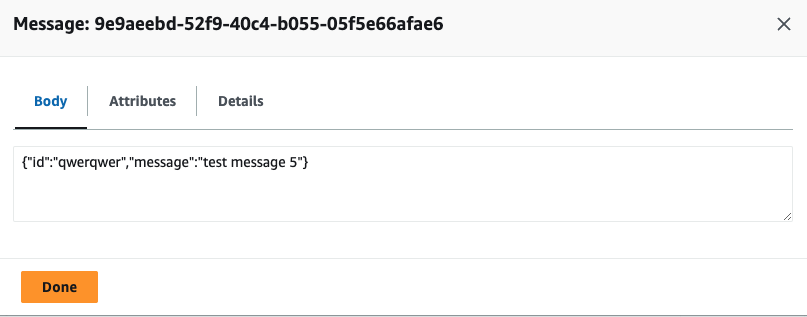
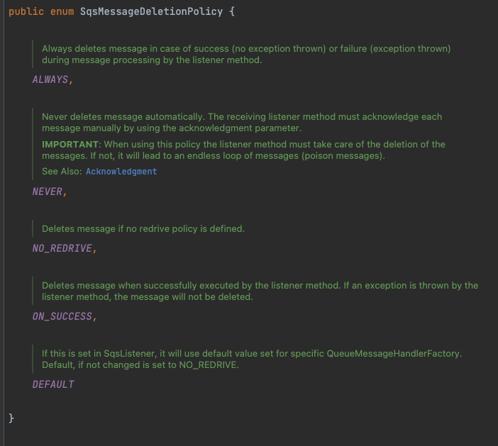

# 목차

<br>

- [목차](#목차)
- [Spring Boot 환경 AWS SNS와 SQS를 이용한 이벤트 처리](#spring-boot-환경-aws-sns와-sqs를-이용한-이벤트-처리)
- [1 예시 코드 작성 및 의존성 설정](#1-예시-코드-작성-및-의존성-설정)
  - [1-1 이벤트 예시 코드 작성](#1-1-이벤트-예시-코드-작성)
  - [1-2 의존성 설정](#1-2-의존성-설정)
- [2 SNS, SQS 관련 설정](#2-sns-sqs-관련-설정)
  - [2-1 credentials 설정](#2-1-credentials-설정)
  - [2-2 SQS 관련 Long Polling 설정](#2-2-sqs-관련-long-polling-설정)
  - [2-3 SNS, SQS properties](#2-3-sns-sqs-properties)
- [3 SNS 이벤트 발행](#3-sns-이벤트-발행)
- [4 SQS 이벤트 수신](#4-sqs-이벤트-수신)
- [참고](#참고)

<br>

# Spring Boot 환경 AWS SNS와 SQS를 이용한 이벤트 처리

SQS는 AWS에서 제공하는 마이크로서비스, 분산 시스템 및 서버리스 애플리케이션등을 분리하고 확장할 수 있는 완전 관리형 메시지 큐(대기열) 서비스이다.

SNS는 특정 주제에 대한 알림을 게시할 수 있는 pub-sub 메시징 시스템이다.

많은 서비스에서 SNS와 SQS를 같이 사용함으로써 각각의 특징을 활용해 효율적이고 안정적인 이벤트 처리 환경을 구축한다.

AWS에서도 추천하는 조합이므로 내구성과 확장성면에서는 충분히 믿고 사용할만하다고 판단된다.

<p align="center"><br>SNS와 SQS 구조.<br>SNS는 SQS말고도 다양한 Subscription을 지원한다.</p>

이번 글은 Spring Boot 환경에서 AWS SNS와 SQS를 이용한 이벤트 처리 과정을 직접 구현해본다.

이를 통해 Spring 환경에선 SNS와 SQS를 어떻게 사용하는지 살펴본다.

<br>

> 이번 글은 AWS SNS와 SQS에 대한 자세한 내용은 다루지않으며, Spring 관점에서 어떻게 사용하는지에 대해서만 다룬다.
>
> 이에 대한 자세한 내용은 [AWS SNS개념과 SQS 연동](), [AWS SQS](../../../Infra&DevOps/AWS/SQS/SQS.md)을 참고.
>
> 또한, EC2에 Boot를 띄워서 실습한다. 외부 서버에서의 이벤트 발행 및 소비는 다른 글을 참고하길 바랍니다.

<br>

# 1 예시 코드 작성 및 의존성 설정
먼저 실습을 위해 간단한 이벤트 예시 코드를 작성하고 SNS, SQS를 활용하기위한 의존성을 설정한다.

<br>

## 1-1 이벤트 예시 코드 작성
이번 글에서 사용할 이벤트 예시 코드는 아래와 같다.

> EventMessageSample.java
```java
@Getter
public class EventMessageSample {

    private Long id;
    private String message;

    private EventMessageSample() {
    }

    public EventMessageSample(Long id, String message) {
        this.id = id;
        this.message = message;
    }
}
```

이벤트 내용은 애플리케이션마다 굉장히 상이하므로, 이번 글에선 간단히 id와 message만을 담는 이벤트 메시지를 구현한다.

<br>

## 1-2 의존성 설정

Spring Cloud AWS 메시징 모듈은 독립 실행형 모듈로 제공되며 아래 라이브러리만 추가해주면 된다.

```gradle
dependencyManagement {
    imports {
        mavenBom("io.awspring.cloud:spring-cloud-aws-dependencies:2.4.4")
    }
}

dependencies {
    ...
    implementation 'io.awspring.cloud:spring-cloud-starter-aws-messaging'
    ...
}
```

Spring Cloud AWS는 SQS 또는 SNS를 통한 메시지 pub, sub을 간소화한 여러 기능을 제공한다.

SQS는 Spring 4.0에 도입된 메시징 API (`org.springframework.messaging.handler.invocation.AbstractMethodMessageHandler`)에 전적으로 의존하므로 쉽게 애노테이션만 사용하여 구현 가능하다.

반면 SQS는 각각의 알림마다 다르게 처리해야할 부분이있어 부분적으로 조금 구현해줘야한다.

<br>

💁‍♂️ **의존성 관련 알아두면 좋은 소식**

아마 Spring 환경에서의 SNS, SQS 의존성관련 다양한 자료를 살펴보면 아래 두 가지가 나온다.

* org.springframework.cloud
* io.awspring.cloud

무엇을 사용해야할지 헷갈린다.

관련해서 구글링해보면 org.springframework.cloud는 2.2.x까지만 지원하며, 그 이상부터는 io.awspring.cloud로 최신화된다는 것을 알 수 있다.

관련된 내용은 [여기](https://spring.io/blog/2021/03/17/spring-cloud-aws-2-3-is-now-available)에서 확인가능하다.

스프링 버전에 따른 의존성 버전관련해서는 [Github - io.awspring.cloud](https://github.com/awspring/spring-cloud-aws)에서 자세히 알 수 있다.

<br>

이번 글에선 아래 버전으로 진행된다.

* Spring Boot 2.7.14
* spring-cloud-starter-aws-messaging 2.4.4

<br>

# 2 SNS, SQS 관련 설정
본격적으로 Spring Boot 프로젝트에서 SNS에 메시지를 Publish하고 SQS로부터 메시지를 Consume하기전에 SNS와 SQS에 대한 설정을 먼저 해주는 것이 좋다.

<br>

## 2-1 credentials 설정

SNS와 SQS 서비스가 동작하는 리전 설정과 인증정보 설정을 해준다.

> AwsConfiguation.java

```java
@Getter
@Configuration
public class AwsConfiguration {
    @Value("${cloud.aws.credentials.access-key}")
    private String awsAccessKey;

    @Value("${cloud.aws.credentials.secret-key}")
    private String awsSecretKey;

    /**
     * SNS 설정
     */
    @Bean
    public AmazonSNS amazonSNS() {
        return AmazonSNSClient.builder()
//                .withCredentials(getAwsCredentialsProvider())
                .withRegion(Regions.AP_NORTHEAST_2)
                .build();
    }

    /**
     * AWS Credential 설정
     */
    public AWSCredentials getAwsCredentials() {
        return new BasicAWSCredentials(awsAccessKey, awsSecretKey);
    }

    public AWSCredentialsProvider getAwsCredentialsProvider() {
        return new AWSStaticCredentialsProvider(getAwsCredentials());
    }

    /**
     * SQS 설정
     */
    @Bean
    public AmazonSQSAsync amazonSqs() {
        return AmazonSQSAsyncClientBuilder
                .standard()
//                .withCredentials(new AWSStaticCredentialsProvider(getAwsCredentials()))
                .withRegion(Regions.AP_NORTHEAST_2)
                .build();
    }
}
```

필자의 경우 AWS내의 같은 리전 같은 VPC안에서 동작하므로, 인증정보도 모두 미리 IAM 설정을통해 해줬으므로 위 설정에선 주석처리해두었다.

만약 AWS내에서 EC2, SNS, SQS등에 IAM 설정을 하지않고, 사용한다면 Credentials 설정을 해줘야 SNS에 이벤트를 Publish 할 수 있다.

> 외부 서버에서 접속한다고 할때도 당연히 Credentials 설정을 해줘야한다.

<br>

## 2-2 SQS 관련 Long Polling 설정

<br>

💁‍♂️ **Short Polling와 Long Polling**

AWS는 `spring-cloud-starter-aws-messaging` 모듈에 SQS를 쉽게 사용할 수 있도록 잘 통합해놓았다.

개발자는 그저 `@SqsListiner`를 이용하면 간단하게 사용할 수 있다.

하지만, 아무 설정없이 사용하면 디폴트로 Short Polling을 하게된다. 

Short Polling은 Consumer에서 메시지 Polling시 SQS 서버의 하위 세트를 샘플링하고 해당 서버에서만 메시지를 탐색하여 Polling해온다.

따라서 메시지가 존재함에도 `ReceiveMessage` 요청이 모든 메시지를 탐색하지 못할 수 있다. 

반면, Long Polling시 일정 시간동안 샘플링이 아닌 모든 SQS 서버를 조회하여 메시지를 탐색 및 반환한다.

<br>

무슨 차이가 있겠나하겠지만, AWS 공식문서를 보면 아래와 같이 명시되어있다.

```text
Long polling helps reduce the cost of using Amazon SQS by eliminating the number of empty responses (when there are no messages available for a ReceiveMessage request) and false empty responses (when messages are available but aren't included in a response)

참고: https://docs.aws.amazon.com/AWSSimpleQueueService/latest/SQSDeveloperGuide/sqs-short-and-long-polling.html#sqs-long-polling
```

해석하면 Short Polling시 빈 응답 수가 많아 SQS 사용 비용이 더 많이 부과된다고한다. 

반면, Long Polling 사용시 빈 응답의 수를 줄여 SQS 비용을 절감할 수 있다.

> 관련한 더 자세한 내용은 [](../../../Infra&DevOps/AWS/SQS/SQS.md#4-5-short-polling%EA%B3%BC-long-polling)를 참고.

<br>

💁‍♂️ **Long Polling 설정**

> AwsConfiguration.java

```java
@Getter
@Configuration
public class AwsConfiguration {
    
    // ... Credentials, Region 설정 ...

    /**
     * SQS는 @SqsListener 이용하면 쉽게 Consume 할 수 있다.
     *
     * 다만, 디폴트로는 Short Polling한다. 그러므로 Long Polling 이용하려면 아래와 같이 설정해줘야한다.
     *
     * 그외에도 Visibility 설정등 SQS의 메시지를 Consume 할 때의 다양한 설정을 해줄 수 있다.
     */
    @Bean
    public SimpleMessageListenerContainerFactory simpleMessageListenerContainerFactory(AmazonSQSAsync amazonSqs,
                                                                                       SimpleAsyncTaskExecutor simpleAsyncTaskExecutor) {
        SimpleMessageListenerContainerFactory factory = new SimpleMessageListenerContainerFactory();
        factory.setAmazonSqs(amazonSqs);
        factory.setWaitTimeOut(10); // polling 설정
        factory.setVisibilityTimeout(30);
        factory.setTaskExecutor(simpleAsyncTaskExecutor);
        return factory;
    }

    @Bean
    public SimpleAsyncTaskExecutor simpleAsyncTaskExecutor() {
        SimpleAsyncTaskExecutor simpleAsyncTaskExecutor = new SimpleAsyncTaskExecutor();
        simpleAsyncTaskExecutor.setConcurrencyLimit(50);
        return simpleAsyncTaskExecutor;
    }
}
```

Consumer가 Polling할 때의 모든 설정을 위와 같이 할 수 있다.

위와 같이 Long Polling 외에도 백그라운드에서 사용되는 스레드나 VisibilityTimeout등을 설정할 수 있다.

<br>

## 2-3 SNS, SQS properties

마지막으로 SNS와 SQS를 특정할 수 있는 설정을 properties에 해준다.

> application.yml
```yaml
cloud:
  aws:
    credentials:
      access-key: accesskey
      secret-key: secretkey
    stack:
      auto: false

sns-topic:
  binghe-test-sns: "arn:aws:sns:ap-northeast-2:385423560848:binghe-test-sns"

sqs-event:
  binghe-test-sqs: "binghe-test"
```

<br>

# 3 SNS 이벤트 발행
설정이 완료되었다면, 간단히 이벤트를 생성하여 SNS에 Publish 해본다.

<br>

💁‍♂️ **Publisher 구현**

> AwsSnsPublisher.java

```java
@Slf4j
@Component
@RequiredArgsConstructor
public class AwsSnsPublisher {

    private final AmazonSNS amazonSNS;
    private final ObjectMapper objectMapper;

    public void publishJson(String topic, Object message) {
        try {
            publishToSns(topic, objectMapper.writeValueAsString(message));
        } catch (JsonProcessingException e) {
            log.error("[TOPIC::{}] Json serializing fail {}", topic, message, e.getMessage(), e);
        }
    }

    private PublishResult publishToSns(String topic, String message) {
        PublishRequest publishRequest = new PublishRequest()
                .withTopicArn(topic)
                .withMessage(message)
                .addMessageAttributesEntry("contentType",
                        new MessageAttributeValue()
                                .withDataType("String")
                                .withStringValue(APPLICATION_JSON_UTF8_VALUE));

        PublishResult result = amazonSNS.publish(publishRequest);
        log.info("[TOPIC::{}] published MessageID : {}, message : {}", topic, result.getMessageId(), message);
        return result;
    }
}
```

구현 방식은 각 상황에 맞춰 구현해주면된다.

<br>

💁‍♂️ **메시지 발행 간단 예시 구현**

메시지를 간단히 발행해보기위해 간단히 테스트 API를 만들어 Publish 해본다.

```java
@RestController
public class TestController {

    private final AwsSnsPublisher publisher;
    private final String topic;

    public TestController(AwsSnsPublisher publisher,
                          @Value("${sns-topic.binghe-test-sns}") String topic) {
        this.publisher = publisher;
        this.topic = topic;
    }

    @PostMapping("/test")
    public ResponseEntity<String> test(@RequestBody EventMessageSample eventMessageSample) {
        publisher.publishJson(topic, eventMessageSample);
        return ResponseEntity.ok("ok");
    }
}
```

API를 호출해보면 아래와 같이 SQS에 메시지가 쌓이는 것을 볼 수 있다.

<p align="center"> </p>


<br>

# 4 SQS 이벤트 수신

이제 SQS 이벤트를 Consume하는 코드를 작성해본다.

<br>

💁‍♂️ **리스너 구현**

Consume하는 로직은 `@SqsListiner`를 이용하면 손수 `@Scheduler`로 Polling하지 않고 편리하게 이용할 수 있다.

기타 메시지 삭제정책과 같은 옵션도 제공하므로 유용하게 사용할 수 있다.

```java
@Slf4j
@Component
public class AwsSqsConsumer {

    @SqsListener(value = "${sqs-event.binghe-test-sqs}", deletionPolicy = SqsMessageDeletionPolicy.ON_SUCCESS)
    public void consume(@Payload EventMessageSample event, @Headers Map<String, String> headers) {
        log.info("[Consumed Message] id : {}, message : {}", event.getId(), event.getMessage());

//        SqsMessageDeletionPolicy.NEVER 설정시 명시적으로 아래와 같이 메시지를 삭제하도록 ack 응답을 보낼 수 있다.
//        ack.acknowledge();
    }
}
```

실행해보면 아래와 같이 위에서 SNS로 Publish한 이벤트 메시지를 Consume할 수 있다.

<p align="center"> </p>

<br>

💁‍♂️ **삭제 정책**

메세지를 Polling하고 여러가지 처리를 진행한후에 메시지를 어떻게 언제 삭제할지를 설정할 수 있다.

<p align="center"> </p>

필자는 `ON_SUCCESS`만 사용해보긴했으나, 로직에 따라 다양하게 설정해서 사용할 수 있을 듯 하다.

<br>

# 참고
* https://docs.aws.amazon.com/sns/index.html
* https://docs.aws.amazon.com/sqs/index.html
* https://github.com/awspring/spring-cloud-aws


