# 목차

<br>

- [목차](#목차)
- [들어가며](#들어가며)
- [1 스프링 배치 Hello World](#1-스프링-배치-hello-world)
  - [1-1 프로젝트 생성 및 의존성](#1-1-프로젝트-생성-및-의존성)
  - [1-2 Hello World Job 구성 및 실행](#1-2-hello-world-job-구성-및-실행)
- [2 배치 구조](#2-배치-구조)
  - [2-1 Job, Step, Tasklet](#2-1-job-step-tasklet)
  - [2-2 다시 살펴보는 Hello World Job](#2-2-다시-살펴보는-hello-world-job)
  - [2-3 배치 실행 FLOW](#2-3-배치-실행-flow)
- [3 배치를 실행시키는 다양한 방법 (feat. @EnableBatchProcessing)](#3-배치를-실행시키는-다양한-방법-feat-enablebatchprocessing)
  - [3-1 배치를 실행시키는 객체 - JobLauncher](#3-1-배치를-실행시키는-객체---joblauncher)
  - [3-2 배치를 실행시키는 다양한 방법](#3-2-배치를-실행시키는-다양한-방법)
  - [3-3 @EnableBatchProcessing](#3-3-enablebatchprocessing)
  - [3-4 @EnableBatchProcessing - 원하는 Job만 실행시키기](#3-4-enablebatchprocessing---원하는-job만-실행시키기)
- [참고](#참고)

<br>

# 들어가며
이번 글부터는 본격적으로 스프링 배치에 대해서 알아본다.

많은 스프링 배치 관련 글에선 주로 배치에서 사용되는 도메인에 대해서 바로 설명한다.

필자의 경우는 처음에 이부분이 조금 당혹스러웠다...

이번 글은 배치의 도메인에 관해서 깊게 다루진 않고, 우선 Hello World 수준의 Job을 하나 만들고 실행해본다.

실행하는 과정을 통해 스프링 배치의 전체적인 구조를 살펴보고, 배치 애플리케이션을 동작시키는 여러가지 방법에 대해서 알아본다.

<br>

# 1 스프링 배치 Hello World
간단히 스프링 배치 프로젝트를 생성하고 Hello World 수준의 Job을 구성 및 실행해본다.

<br>

## 1-1 프로젝트 생성 및 의존성
아래와 같이 `Spring Initializer`를 통해 Spring Boot 프로젝트를 만든다.

<p align="center">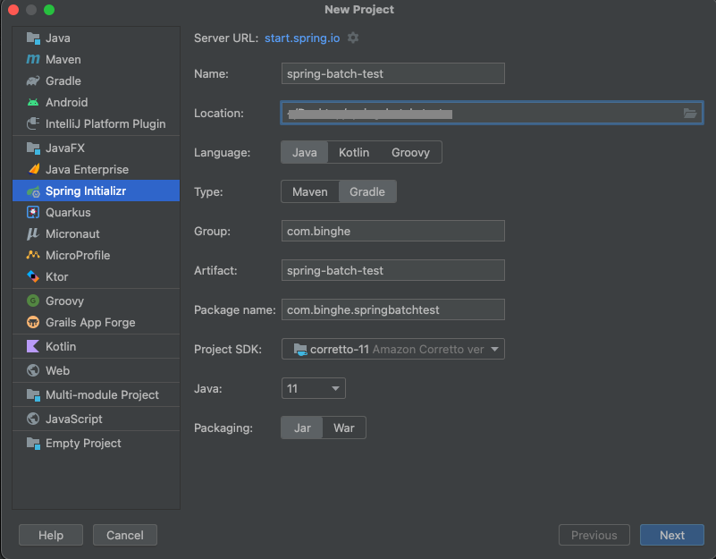 </p>

의존성은 아래와 같이 설정해준다.

<p align="center">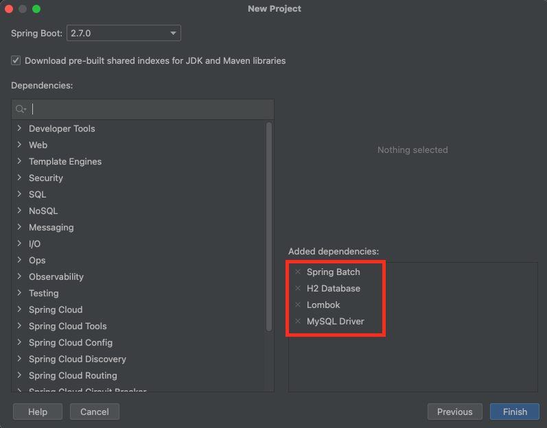 </p>

총 4개의 의존성을 넣어준 것을 볼 수 있다.

* Spring Batch
  * Spring Boot 기반의 Spring Batch를 실행할 때 필요한 의존성.
* H2, MySQL
  * Profile에 따라 배치 도메인 메타 데이터 테이블을 저장하기 위한 DB 관련 의존성.
* Lombok

위 4가지의 의존성을 추가하고 프로젝트를 생성해준다.

> 프로젝트를 생성한 후 위 4가지 의존성을 설정해줘도 무방하다.

<br>

## 1-2 Hello World Job 구성 및 실행
프로젝트가 잘 생성되었다면, 이번엔 Hello World 수준의 Job을 구성해본다.

> HelloWorldJobConfiguration.java

```java
@RequiredArgsConstructor
@Configuration
public class HelloWorldJobConfiguration {

    private final JobBuilderFactory jobBuilderFactory;
    private final StepBuilderFactory stepBuilderFactory;

    @Bean
    public Job helloWorldJob() {
        return jobBuilderFactory.get("helloWorldJob")
                .start(helloWorldStep1())
                .next(helloWorldStep2())
                .build();
    }

    @Bean
    public Step helloWorldStep1() {
        return stepBuilderFactory.get("helloWorldStep1")
                .tasklet((contribution, chunkContext) -> {
                    System.out.println(" >>> helloWorldStep1 실행됨.");
                    return RepeatStatus.FINISHED;
                })
                .build();
    }

    @Bean
    public Step helloWorldStep2() {
        return stepBuilderFactory.get("helloWorldStep2")
                .tasklet((contribution, chunkContext) -> {
                    System.out.println(" >>> helloWorldStep2 실행됨.");
                    return RepeatStatus.FINISHED;
                })
                .build();
    }
}
```

<br>

그리고 배치 애플리케이션을 동작시키기위해 아래와 같이 스프링 부트 애플리케이션 실행하는 부분에 `@EnableBatchProcessing`를 넣어준다.

> SpringBatchTestApplication.java

```java
@SpringBootApplication
@EnableBatchProcessing
public class SpringBatchTestApplication {

    public static void main(String[] args) {
        SpringApplication.run(SpringBatchTestApplication.class, args);
    }

}
```

그리고 이제 평소 Spring Boot 기반의 애플리케이션을 실행하듯이 실행을 해주면 아래와 같이 배치가 동작하여 콘솔에 출력되는 것을 볼 수 있다.

<p align="center">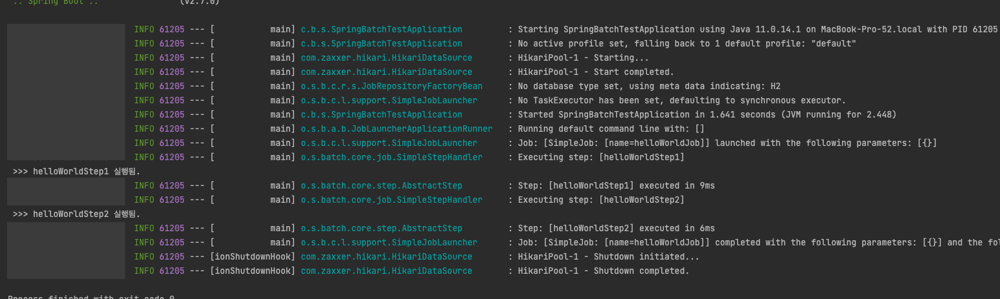 </p>

> `@EnableBatchProcessing`은 스프링 부트 메인 클래스나 아무 설정 파일중 하나에 명시해주기만 하면 된다. (대부분 부트 메인 클래스에 정의한다.)

<br>

어떤가! 굉장히 간단하지 않은가?? 배치를 동작하는데 필요한 자바 빈 몇가지를 설정해주면고 실행하면 원하는 순서에 따라 배치가 동작한다.

<br>

# 2 배치 구조
이번엔 Hello World를 벗어나서 배치 구조를 이해하고 Hello World 코드를 이해해본다.

<br>

## 2-1 Job, Step, Tasklet

Hello World Job 코드를 보면 눈에 띄는 도메인 객체가 있다. 바로 Job, Step, Tasklet이다.

세 도메인의 관계는 아래와 같다.

<p align="center">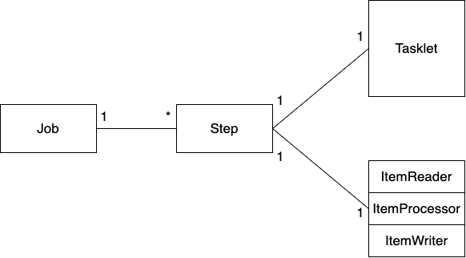<br>Job, Step, Tasklet의 관계</p>

* **Job - 일, 일감** (전체적인 일)
  * 배치 구조에서 Job이란 가장 상위에 있는 개념으로 하나의 배치작업 자체를 의미한다.
  * 하나의 Job에는 여러 개의 Step이 존재한다. (적어도 하나 이상)
* **Step - 일의 단위, 일의 항목** (단계)
  * 배치 Job을 구성하는 독립적인 하나의 단계를 의미하며, 실제 배치 처리에 대한 구현을 정의하고 컨트롤하는 데 필요한 모든 정보를 가진다.
  * Step은 `Tasklet` 혹은 `Reader + Processor + Writer`(Chunk 기반 처리)로 구성된다.
    * 같은 Step 안에서 두 방식을 혼용해서 사용할 수 없다.
* **Tasklet 일의 작업 내용** (구현, 단계 별 비즈니스 로직)
  * `Step`안에서 단일 태스크로 수행되는 로직을 구현한다.
  * tasklet은 기본적으로 무한 반복시킨다. `RepeatStatus` 를 통해 반복할 것인지를 반환해줘야한다.

> Chunk기반의 처리 요소인 ItemReader, ItemProcessor, ItemWriter는 우선 무시해도 된다.

<br>

## 2-2 다시 살펴보는 Hello World Job
그림을 통해 Job과 Step간의 관계를 알았으니, 이제 바로 위에서 구성했던 HelloWorldJob의 설정 파일을 살펴보면 구조가 조금 이해가 된다.

<p align="center">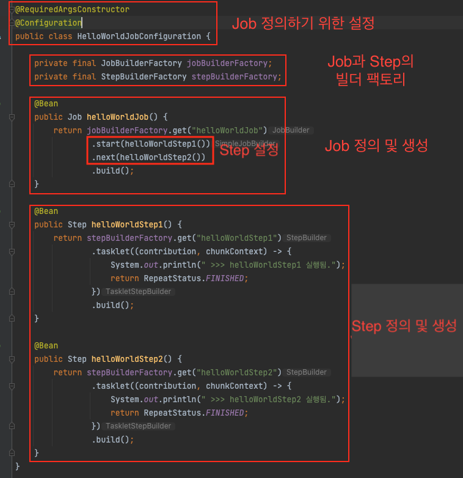 </p>

* @Configuration
  * 보통 하나의 배치 Job을 정의할 때 사용되는 빈 설정
* JobBuilderFactory, StepBuilderFactory
  * Job과 Step 모두 여러 개의 구현체를 가지고있다. 이와 관련된 빌더 또한 여러가지있다.
  * 위 두 팩토리 객체는 어떤 메서드 체이닝을 하느냐에 따라서 각각 구현체의 빌더를 반환하도록 해준다.
    * ex. Step의 경우 메서드 체이닝으로 `chunk`를 주면 `SimpleStepBuilder`가 생성되고, `tasklet`을 주면 `TaskletStepBuilder`가 생성된다.
  * 쉽게 생각하면, Job와 Step을 생성하는 빌더 팩토리라고보면 된다. (이와 관련된 더 자세한 내용은 추후에 다룰 예정이다.)
* Job
  * Job을 정의한다.
* Step
  * Step을 정의한다.
* Tasklet
  * 각 Step이 실행되었다는 콘솔 출력에 대한 구현 코드를 작성하였다.

<br>

## 2-3 배치 실행 FLOW
이제 Hello World 코드와 위 그림을 통해 배치 구조에 대한 큰그림을 알 수 있었다.

더 이해하기 쉬운 방법은 각 요소간의 실행 FLOW는 어떻게되는지를 보면된다.

아래 그림은 **Job, Step, Tasklet 간의 관계를 더욱 잘 보여주는 배치 실행 FLOW** 이다.

<p align="center">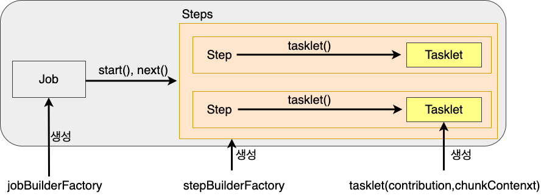<br>화살표가 실행되는 방향이기도 하고, 구성 요소를 가리키는 방향도 된다. </p>

* 실행 순서
  * Job -> Step -> Tasklet
* 스프링 배치를 실행시키면 위와 같이 필요한 Job, Step, Tasklet에 대한 빈이 등록되고, 위 순서로 실행되게 된다.
* `Job`은 `Step`을 가지고있는 컨테이너 역할을 한다고 보면 된다.

<br>

이제 처음에 구성했던 Hello World Job이 이해가 쉽게 될 것이라 생각든다.

<br>

# 3 배치를 실행시키는 다양한 방법 (feat. @EnableBatchProcessing)
이제 배치 구조를 살펴보았으니 Job, Step, Tasklet의 관계와 어떻게 구성되고 동작하는지 알게되었다.

그렇다면 어떻게 `@EnableBatchProcessing` 애노테이션만 붙이고 배치를 실행시킬 수 있었을까?

만약 한 프로젝트에 여러 개의 배치 Job을 구성하고 특정 Job만 실행시키고싶다면 어떻게 해야할까?

**이번 챕터에선 배치를 실행시키는 다양한 방법에 대해서 알아보고, `@EnableBatchProcessing`를 붙이면 어떤 효과가있는지 알아본다.**

<br>

## 3-1 배치를 실행시키는 객체 - JobLauncher
위에선 Job, Step, Tasklet에 대해서만 얘기했지만, 사실 조금 더 큰 그림을 보면 배치의 구조는 아래와 같다.

<p align="center">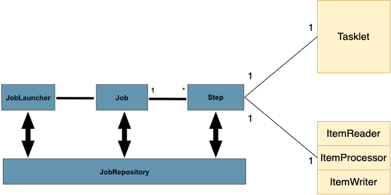<br>공식 문서의 그림을 조금 수정한 이미지입니다.</p>

가장 왼쪽을 보면 `JobLauncher`라는 도메인을 볼 수 있다.

**이름에서 알 수 있듯이, 이 도메인은 배치 Job을 실행시키는 역할을 한다.**

조금 더 자세히 살펴보면 아래 코드와 같다.

<p align="center">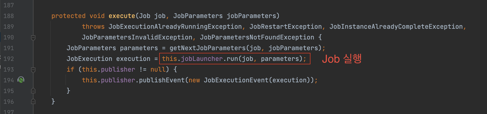<br>JobLauncherCommandLineRunner.execute 구현부분</p>

위 코드는 실제 스프링 부트기반의 Spring Batch에서 Job을 실행할 때 사용되는 코드이다.

`JobLauncher` 객체에 `Job`과 `JobParameters`를 인자로 넘겨 `run`메서드를 호출하면 배치가 실행된다.

> 우선은 JobLauncher를 Job을 실행시키는 객체로만 이해하자. 더 자세한 내용은 후에 정리할 예정이다.

<br>

## 3-2 배치를 실행시키는 다양한 방법
앞에서 `JobLauncher`가 배치 Job을 실행시키는 주체라는 것을 설명했다.

생각보다 간단하지 않은가? **이를 활용하면 다양한 배치 실행 방법을 떠올릴 수 있다.**

이번 글에선 대표적인 두 가지 방법을 소개한다.

<br>

1️⃣ **첫번째 방법 - ApplicationRunner 구현하여 직접 실행하는 방법**

스프링 부트 (`@SpringBootApplication`)는 실행시 `ApplicationRunner`를 구현한 빈의 `run()` 부분을 호출한다.

만약 여러 개의 `ApplicationRunner`가 존재해서 순서를 보장해야한다면 `@Order` 애노테이션을 이용하여 순서를 정해준다.

**스프링 배치에서 Job을 실행시키는 주체인 `JobLauncher`도 이 `ApplicationRunner` 혹은 `CommandLineRunner`를 구현한 빈을 이용하면 쉽게 스프링 애플리케이션이 실행되고 자동으로 Job을 실행시킬 수 있다.**

<br>

> ManualJobLauncher.java

```java
/**
 * 수동으로 JobLauncher를 통해 배치를 실행시키는 ApplicationRunner
 * -> 설정파일 (yml)에서 spring.batch.job.enabled = false로 해줘야한다.
 */
@Component
public class ManualJobLauncher implements ApplicationRunner {

    private final JobLauncher jobLauncher;
    private final Collection<Job> jobs;

    public ManualJobLauncher(JobLauncher jobLauncher, Collection<Job> jobs) {
        this.jobLauncher = jobLauncher;
        this.jobs = jobs;
    }

    @Override
    public void run(ApplicationArguments args) throws Exception {
        String jobName = "{실행하고자하는 job 이름}"; // Job 이름

        // Job
        Job job = determineJob(jobName);

        // JobParameters
        JobParameters jobParameters = new JobParametersBuilder()
                .addString("name", "binghe")
                .toJobParameters();

        // Job (혹은 여러 Job) 실행
        jobLauncher.run(job, jobParameters);
    }

    private Job determineJob(String jobName) {
        return jobs.stream()
                .filter(job -> job.getName().equals(jobName))
                .findFirst()
                .orElseThrow(() -> new IllegalArgumentException("존재하지 않는 Job 이름입니다."));
    }
}
```

`jobName`에 실행시키고자하는 Job을 입력하고 스프링 부트를 실행하면 된다.

**밑에서 다루겠지만, `@EnableBatchProcessing`도 이 `ApplicationRunner` 방식과 유사한 `CommandLineRunner`을 이용하여 Job을 자동으로 실행시킨다.**

> 실제 스프링 부트와 배치를 같이 사용하면서 위와 같은 방법을 이용하려면 설정 파일 (`yml` 혹은 `properties`)에서 `spring.batch.job.enabled = false` 설정을 해주어야한다.

<br>

2️⃣ **두번째 방법 - HTTP 요청시 실행**

두번째 방법은 굉장히 쉬운.. HTTP 웹 요청시 아래와 같이 `JobLauncher`를 주입받아 Job을 실행시키는 것이다.

> JobLauncherTestController.java
```java
@Slf4j
@RequiredArgsConstructor
@RestController
public class JobLauncherTestController {

    private final JobLauncher jobLauncher;
    private final Job scopeSampleJob;

    @GetMapping("/batch")
    public ResponseEntity<String> launchBatch(@RequestParam("date") String date) {
        JobParameters jobParameters = new JobParametersBuilder()
                .addString("date", date)
                .toJobParameters();

        try {
            jobLauncher.run(scopeSampleJob, jobParameters);
        } catch (Exception e) {
            System.out.println(e.getMessage());
            return ResponseEntity.ok("error");
        }

        return ResponseEntity.ok("ok");
    }
}
```
위 예시는 웹 표현계층에 `JobLauncher`와 `Job`을 주입받아 실행시키는 예시이다.

위 방식은 사용할 때 주의해야한다. 만약 단기간에 너무 많은 API 요청하면, 너무 많은 배치가 한번에 실행되서 서버에 부하가 걸리기 쉽기 때문이다.

> 일반적으로 배치의 경우 대용량을 다루는 경우가 많기에, CPU나 메모리가 기존의 웹 애플리케이션보다 많이 소요된다. 그러기에 API 요청을 받아 배치 Job을 실행시키는 방식은 지양하는 것이 좋다.

<br>

## 3-3 @EnableBatchProcessing
**실제로 스프링 부트 기반의 스프링 배치도 위와 같이 `JobLauncher`를 이용하여 Job을 실행시킨다.**

물론 스프링 진영에서 Job 실행시키는 부분을 모두 추상화시켜두었다.

그래서 아래와 같이 개발자로하여금 `@EnableBatchProcessing`만 붙이면 자동으로 Job을 실행시켜준다.

<p align="center">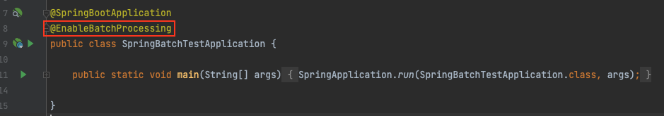 </p>

`@EnableBatchProcessing`는 스프링 부트 환경에서 스프링 배치가 작동하기 위해 선언되는 애노테이션이다.

<br>

🤔 **왜 선언해줘야 할까?**

**바로 배치 작업에 필요한 도메인을 생성하기 위한 빌더 팩토리 빈 설정과 배치에 필요한 주요 도메인을 자동으로 설정 및 초기화하기 위함이다.** (AutoConfiguration)

즉, **스프링 부트 배치의 자동 설정 클래스를 실행시킴으로써 빈으로 등록된 모든 Job을 검색해서 필요한 빈을 초기화시켜주는 것이다.**

또한, **애플리케이션을 `ApplicationRunner` 구현한 빈 객체를 생성하여 Job을 자동으로 실행시켜준다.**

> 배치에 사용되는 필요한 빈의 예시로는 `JobBuilderFactory`, `StepBuilderFactory`, `JobRepository`, `JobLauncher`등등이 있다.

<br>

🤔 **어떻게 자동으로 설정해준다는 것일까? - 동작 원리**

`@EnableBatchProcessing`이 붙은 애플리케이션이 작동하면 4개의 설정 클래스가 실행되면서 배치의 모든 초기화 및 실행 구성이 이루어진다.

<p align="center">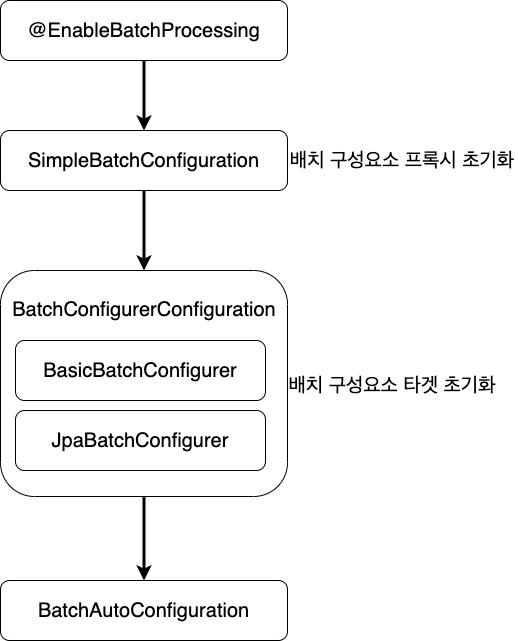 </p>

* `SimpleBatchConfiguration`
  * 스프링 배치의 주요 구성 요소를 생성 및 초기화.
    * `JobBuilderFactory`, `StepBuilderFactory`, `JobRepository`, `JobLauncher`등등 배치를 돌리는데 필요한 빈을 초기화한다.
  * **주요 구성 요소를 생성할 때, 실제 타겟 객체를 생성 및 초기화하진 않고 프록시 객체를 생성한다. 그리고 `BatchConfigurerConfiguration`의 구현체들이 실행되면서 타겟 객체를 설정한다. - 중요**
  * `InitializingBean`을 활용하여 빈을 생성할 때 위와 같이 배치에 필요한 빈들을 설정해준다.
* `BatchConfigurerConfiguration`
  * `BasicBatchConfigurer`
    * **`SimpleBatchConfigurer`에서 생성된 프록시 객체의 실제 대상 객체를 생성하는 설정 클래스이다. - 중요**
    * 빈으로 의존성 주입받아서 주요 객체들을 참조하여 사용할 수 있다.
  * `JpaBatchConfigrer`
    * JPA 관련 객체를 생성하는 설정 클래스이다.
* `BatchAutoConfiguration`
  * **스프링 배치의 주요 구성 요소가 생성 및 초기화되고 실행되며, `ApplicationRunner`를 구현한 `JobLauncherApplicationRunner` 빈을 생성과 동시에 지정된 Job을 실행한다.**
  * [위에서 설명했듯이](#3-2-배치를-실행시키는-다양한-방법), `ApplicationRunner`는 빈이 생성과 동시에 `run()` 메서드를 호출한다. 이때 Job을 실행하게 되는 것이다.

<br>

## 3-4 @EnableBatchProcessing - 원하는 Job만 실행시키기
앞서 말했듯, `@EnableBatchProcessing`을 붙이면 스프링 배치 애플리케이션을 실행하는데 필요한 도메인과 인프라 빈 객체를 생성 및 실행시켜준다.

사실 스프링 배치를 이용하여 배치 코드를 작성할 때, 위 내용은 그렇게 중요하진 않다.

프레임워크의 장점중 하나는 개발자로 하여금 핵심 비즈니스에만 집중할 수 있게 하는 것이다.

이러한 점에서 스프링 진영은 추상화를 잘 적용했다고 볼 수도 있다.

그래서 **이번 글의 마지막으로 알아볼 내용은 개발자가 실제 처음 배치 애플리케이션을 궁금한 부분인 `프로젝트내에서 원하는 Job을 실행시키는 방법`이다.**

`BatchAutoConfiguration` 내부 코드를 자세히 본 사람은 알겠지만.. 

<p align="center">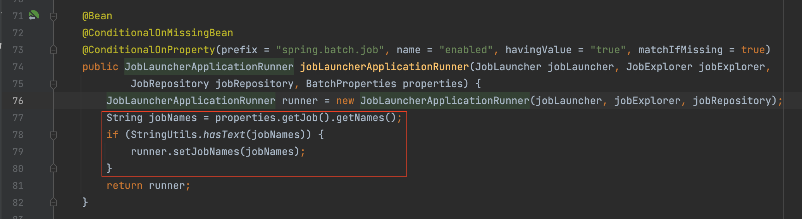<br>BatchAutoConfiguration </p>

`JobLauncher`의 빈을 생성하는 부분을 보면 `BatchProperties`에서 실행할 Job의 이름을 가져와서 Setter로 주입해준다.

그리고 `BatchProperties`의 내부 코드를 보면 아래와 같이 `spring.batch.job.names`에서 해당 Job 이름 가져오는 것을 알 수 있다.

<p align="center">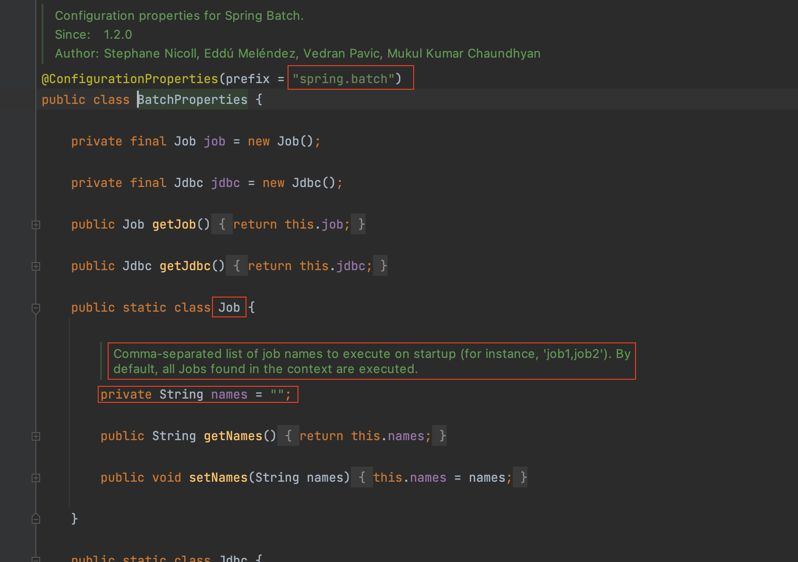 </p>

즉... **원하는 Job을 실행시키는 방법은 배치 애플리케이션 실행시 `spring.batch.job.names`에 Job Name을 기입해주면 된다.**

<p align="center">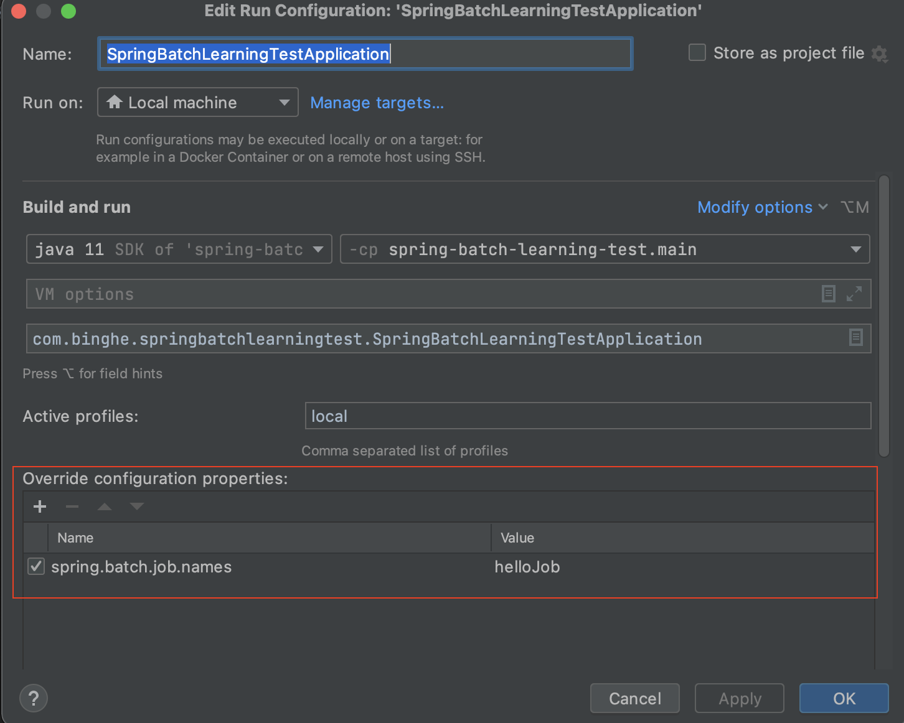<br>IntelliJ에서 실행하는 예시 </p>

CLI환경에서 실행한다면 아래와 같이 명령어를 입력해주면 된다.

```shell
java -jar batch-application.jar --job.name={jobNames}
```

<br>

# 참고
* https://docs.spring.io/spring-batch/docs/current/reference/html/
* [스프링배치 완벽 가이드](http://www.yes24.com/product/goods/99422216)


