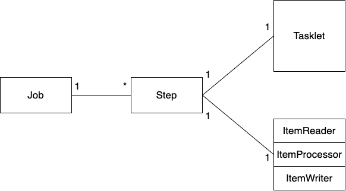
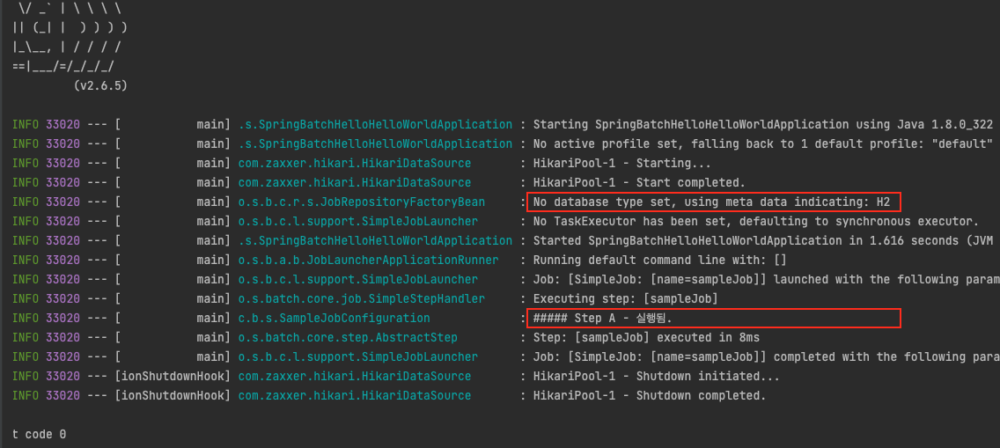

# 목차

<br>

- [목차](#목차)
- [들어가며](#들어가며)
- [Hello World](#hello-world)
  - [프로젝트 생성 및 의존성](#프로젝트-생성-및-의존성)
  - [Sample Job 생성 후 실행해보기](#sample-job-생성-후-실행해보기)
  - [애플리케이션 실행](#애플리케이션-실행)
- [배치 애플리케이션 메타 데이터 스키마](#배치-애플리케이션-메타-데이터-스키마)
  - [메타 데이터 스키마](#메타-데이터-스키마)
  - [MySQL에 메타 데이터 스키마 생성후 연결](#mysql에-메타-데이터-스키마-생성후-연결)
- [메타 데이터와 함께보는 배치 도메인](#메타-데이터와-함께보는-배치-도메인)
  - [Job, JobInstance, JobExecution](#job-jobinstance-jobexecution)
    - [Job](#job)
    - [JobInstance](#jobinstance)
    - [JobExecution](#jobexecution)
  - [JobParameters](#jobparameters)
  - [Step](#step)
  - [StepExecution](#stepexecution)
  - [JobRepository](#jobrepository)
  - [JobLauncher](#joblauncher)
  - [ItemReader](#itemreader)
  - [ItemProcessor](#itemprocessor)
  - [ItemWriter](#itemwriter)
  - [Chunk](#chunk)
  - [Tasklet](#tasklet)
- [참고](#참고)

<br>

# 들어가며
이번 글에선 스프링 배치를 다루면서 꼭 알아야하는 도메인 언어를 살펴본다.

스프링 배치는 어떠한 도메인을 사용하는지에 대해서 다룬다고 보면 된다.

그저 어떤 도메인이 존재하며, 어떤 역할인지를 글로 설명하기보다는 간단한 예시와 함께 살펴보려고한다.

스프링 배치의 도메인 언어를 이해하기 위해선 배치를 돌릴 때 꼭 같이 사용되는 DB 메타 테이블에 대한 이해가 필요하다.

그래서 이번 글은 우선 Hello World로 간단히 배치를 경험해보고, DB 메타 테이블과 도메인 언어를 같이 다룬다.

> 마지막으로 이번 글의 목적은 이 글을 읽고 어디가서 스프링 배치 아는 척을 하는 것이다 :)

<br>

# Hello World
본격적으로 도메인 언어와 메타 테이블에 대해 다루기전에 스프링 배치를 이용해 Hello World를 작성해본다.

## 프로젝트 생성 및 의존성

우선 `Spring Initializer`를 통해 Spring Boot 프로젝트를 만들어준다.

그리고 아래와 같이 의존성을 추가해준다.

```gradle
plugins {
	id 'org.springframework.boot' version '2.6.5'
	id 'io.spring.dependency-management' version '1.0.11.RELEASE'
	id 'java'
}

group = 'com.binghe'
version = '0.0.1-SNAPSHOT'
sourceCompatibility = '1.8'

configurations {
	compileOnly {
		extendsFrom annotationProcessor
	}
}

repositories {
	mavenCentral()
}

dependencies {
	implementation 'org.springframework.boot:spring-boot-starter-batch'
	implementation 'org.springframework.boot:spring-boot-starter-jdbc'
	compileOnly 'org.projectlombok:lombok'
	runtimeOnly 'com.h2database:h2'
	runtimeOnly 'mysql:mysql-connector-java'
	annotationProcessor 'org.projectlombok:lombok'
	testImplementation 'org.springframework.boot:spring-boot-starter-test'
	testImplementation 'org.springframework.batch:spring-batch-test'
}

tasks.named('test') {
	useJUnitPlatform()
}
```
> `JDBC`대신 `JPA`를 선택해서 사용해도 문제없다.

<br>

여기서 주목할 점은 스프링 배치라고 크게 특별한 것 없이 기존의 Spring Boot 프로젝트를 그대로 사용한다는 것이다.

기존의 `spring-web`의존성 대신 `spring-batch` 의존성이 들어온 것 뿐이다.

> 확실히 스프링 부트가 대단..

<br>

## Sample Job 생성 후 실행해보기
이제 프로젝트를 만들었으니 간단히 배치 Job을 만들어 동작시켜본다.

> Job에 대한 내용은 아래서 자세히 다룰 예정이다. 지금은 배치 처리할 일을 만든다고 보면 된다.

이제 간단한 Job을 만들기에 Job에 대한 설정을 해주면 된다.

`job` 패키지를 만들고 아래와 같이 설정 파일을 만들어주면 된다.

> SampleJobConfiguration.java
```java
@EnableBatchProcessing
@RequiredArgsConstructor
@Slf4j
@Configuration // Spring Batch의 모든 Job은 설정 파일에 등록해서 사용된다.
public class SampleJobConfiguration {

    private final JobBuilderFactory jobBuilderFactory;
    private final StepBuilderFactory stepBuilderFactory;

    // sampleJob이란 Batch Job 생성
    @Bean
    public Job sampleJob() {
        return jobBuilderFactory.get("sampleJob")
                .start(sampleStepA())
                .build();
    }

    // sampleStepA란 Batch Step 생성
    @Bean
    public Step sampleStepA() {
        return stepBuilderFactory.get("sampleJob")
                // tasklet로 구성
                .tasklet((contribution, chunkContext) -> {
                    log.info("##### Step A - 실행됨.");
                    return RepeatStatus.FINISHED;
                })
                .build();
    }
}
```
위 코드를 보면 `sampleStepA`란 Step을 가진 `sampleJob` Job을 만들고 있음을 알 수 있다.

Spring Batch에서 Job이란 하나의 배치 작업 단위를 의미한다.

그리고 아래 그림과 같이 Job안에는 여러 Step이 존재한다.

<p align="center"> </p>

Step은 `Tasklet` 혹은 `Reader + Processor + Writer`로 구성할 수 있다.

주의할 점은 `Tasklet`과 `Reader + Processor + Writer`은 같은 레벨의 묶음이다.

즉, 같은 Step안에서 두 방식을 혼용해서 사용할 수 없다.

> `@EnableBatchProcessing`은 `@SpringBootAppliction`이 메인 클래스와 설정 파일중 하나에 명시해주기만 하면 된다.

<br>

## 애플리케이션 실행
이제 메인 메서드를 실행히셬 배치 애플리케이션을 실행해본다.

<p align="center"> </p>

실행하면 아래와 같이 잘 실행된 것을 볼 수 있다.

<p align="center"> </p>

Step에서 설정한 로깅이 잘 찍힌 것을 볼 수 있다.

그리고 배치가 동작하는데 필요한 메타 테이블은 스프링 부트의 내장 H2를 사용한 것을 볼 수 있다.

<br>

# 배치 애플리케이션 메타 데이터 스키마
간단한 Hello World는 실행해보았으니, 이제 본격적으로 배치 도메인 모델에 대해서 알아본다.

그전에 배치 도메인 모델을 알아보기 전에 메타 데이터 스키마에 대해서 다룬다.

<br>

🤔 **메타 데이터 테이블?**

* 스프링 메타 데이터 테이블은 배치 애플리케이션 (자바)에서 사용되는 Domain 객체를 영속화하기 위해 사용되는 테이블이다.
* 메타 데이터는 다음과 같은 정보를 가지고 있다.
  * 이전에 실행한 Job이 어떤 것이 있는지
  * 최근 실패한 배치 파라미터가 어떤 것이 있으며, 성공한 Job은 어떻 것이 있는지
  * 다시 실행한다면 어디서부터 시작할지
  * 어떤 Job에 어떤 Step이 있고, Step들 중 성공한 Step과 실패한 Step들은 어떤 것이 있는지

<br>

## 메타 데이터 스키마
> 스키마에 대한 공식문서는 [여기](https://docs.spring.io/spring-batch/docs/current/reference/html/schema-appendix.html#metaDataSchema)를 참고하면 된다.

메타 스키마는 아래와 같다.

<p align="center"><br>출처: https://docs.spring.io/spring-batch/docs/current/reference/html/schema-appendix.html#metaDataSchema</p>

위 테이블들이 존재해야 스프링 배치가 정상 동작한다.

스프링 부트에서 실행한다면 기본적으로 내장 H2에 생성해서 사용한다. 하지만 이는 애플리케이션이 꺼지면 데이터가 삭제되는 영속화가 안된다.

그래서 보통은 MySQL이나 Oracle등 DB에 개발자들이 직접 생성해두고 실행하게된다.

위 스키마의 테이블 생성 SQL 파일은 `org.springframwork.batch.core`에 위치한다.

보통은 아래와 같이 파일을 검색을 통해 찾아볼 수 있다.

<p align="center"> </p>

<br>

## MySQL에 메타 데이터 스키마 생성후 연결
이제 내장 H2가 아닌 도커로 MySQL을 실행시키고 메타 데이터를 저장해본다.

> [도커를 이용한 MySQL을 실행하는 방법](https://hub.docker.com/_/mysql)을 참고.

<br>

우선 MySQL을 실행하여 아래와 같이 테이블을 모두 만들어준다.

SQL은 `schema-mysql.sql`파일을 검색해 찾아서 복붙해주면 된다.

<p align="center"> </p>

이제 table을 확인해보면 아래와 같이 생성된 것을 볼 수 있다.

<p align="center"> </p>

<br>

이제 아래와 같이 `Datasource`를 설정해준다.

> application.yml
```yml
spring.profiles.active: local

---
spring.profiles: local

spring:
  datasource:
    url: jdbc:h2:mem:testdb;DB_CLOSE_DELAY=-1;DB_CLOSE_ON_EXIT=FALSE
    username: sa
    password:
    driver-class-name: org.h2.Driver

---
spring.profiles: mysql

spring:
  datasource:
    url: jdbc:mysql://localhost:3306/batch?serverTimezone=UTC&characterEncoding=UTF-8
    username: root
    password: password
    driver-class-name: com.mysql.cj.jdbc.Driver
```
`local` 환경에선 H2, `mysql` 환경에선 MySQL을 이용하도록 DataSource를 설정해주는 설정파일.

가장 상단의 `spring.profiles.active`는 디폴트로 `local`로 애플리케이션을 동작시키기 위해서 설정한 것이다.

<br>

이제 아래와 같이 애플리케이션을 동작할 때 `MySQL` 프로파일을 사용하도록하고 실행한다.

<p align="center"> </p>

결과 로그로 다음과 같이 잘 실행된 것을 볼 수 있다.

<p align="center"> </p>

<br>

# 메타 데이터와 함께보는 배치 도메인
이제 MySQL로 실행하는 방법도 알았으니, 실제로 여러 학습테스트과 함께 배치 도메인에 대해서 정리해본다.

배치 도메인의 큰 그림을 그려보면 아래와 같아.

<p align="center"><br>공식 문서의 그림을 조금 수정한 이미지입니다.</p>

이제 위 그림의 의미를 테이블과 함께 알아본다.

<br>

## Job, JobInstance, JobExecution
우선 가장 기본이 되는 3개의 도메인에 대해서 알아본다.

도메인 계층구조를 살펴보면 아래와 같다.

<p align="center"><br>Job 계층구조<br>출처: Spring Batch Docs</p>

> 위 그림이 아직 이해가 안되도 괜찮다. 아래 글을 읽고 학습 테스트를 한다면 이해가 된다.

<br>

### Job
* `Job`은 배치 처리 과정을 하나의 단위로 추상화하여 표현한 객체이다.
* 위와 같이 전체 배치 처리의 항상 최상단 계층에 위치한다.
* `Job`은 XML 혹은 자바 기반의 설정 (`@Configuration`)을 통해 구성할 수 있다.
* `Job`은 여러 개의 `Step`을 포함하는 컨테이너 역할을 한다.
* `Job` 객체를 만드는 빌더는 여러개 존재한다. `JobBuilderFactory`를 통해 다양한 빌더를 활용할 수 있다.

<br>

### JobInstance
🤔 **JobInstance란?**

* `JobInstance`는 배치 처리에서 `Job`이 실행될 때 하나의 `Job` 실행 단위를 의미한다.
  * `Job`이 클래스라면, `JobInstance`는 `Job`클래스의 인스턴스라고 보면 이해가 쉽다.
* 각각의 `JobInstance`는 여러 개의 `JobExecution`을 갖는다.

<br>

💁‍♂️ **학습테스트로보는 JobInstance 특징**

배치 메타 테이블을 보면 `BATCH_JOB_INSTANCE` 테이블이 존재한다.

그리고 MySQL을 연결시켜 배치를 한번 실행하면 아래와 같이 `sampleJob`이 생성된 것을 볼 수 있다.

<p align="center"> </p>

그리고 `JobInstance` (테이블로보면 `BATCH_JOB_INSTANCE`)는 `JobParameter`에 따라 데이터가 생성되는 테이블이다.

> 일단 `JobParameter`는 배치 애플리케이션 실행시 외부에서 입력받는 파라미터로 생각하면 된다. (ex. 날짜, 이름등등)

예를 들어, 특정 날짜를 `JobParameter`를 넘기면 배치에서는 해당 날짜 데이터를 이용하여 Read + Process + Write을 하게 된다.

학습 테스트를 통해 맞는지 확인해본다.

> SampleJobConfiguration.java
```java
@EnableBatchProcessing
@RequiredArgsConstructor
@Slf4j
@Configuration
public class SampleJobConfiguration {

    private final JobBuilderFactory jobBuilderFactory;
    private final StepBuilderFactory stepBuilderFactory;

    @Bean
    public Job sampleJob() {
        return jobBuilderFactory.get("sampleJob")
                .start(sampleStepA(null))
                .build();
    }

    @Bean
    @JobScope // 꼭 필요.
    public Step sampleStepA(@Value("#{jobParameters[date]}") String date) {
        return stepBuilderFactory.get("sampleJob")
                .tasklet((contribution, chunkContext) -> {
                    log.info("##### Step A - 실행됨.");
                    log.info("##### date = {}", date);
                    return RepeatStatus.FINISHED;
                })
                .build();
    }
}
```
실행할 때 아래와 같이 argument를 입력하여 실행해준다.

<p align="center"> </p>

그리고 실행해보면 아래와 같이 파라미터가 전해져서 제대로 실행된 것을 볼 수 있다.

<p align="center"> </p>

마지막으로 `BATCH_JOB_INSTANCE`을 확인해보면 아래와 같이 새로운 데이터가 추가된 것을 볼 수 있다.

<p align="center"> </p>

만약 또 한번 동일한 파라미터 (`date=20220327`)로 실행한다면 아래와 같이 에러가 발생하는 것을 볼 수 있다.

<p align="center"> </p>

물론 파라미터를 바꾸고 다시 실행하면 문제없이 실행되고, 새로운 `JobInstance`가 테이블에 저장된다.

<br>

💁‍♂️ **JobInstance의 특징 정리**

* `JobInstance`를 객체로 비유하면, `Job`는 같은 상태(`JobParameter`)를 가진 객체(`JobInstance`)를 만들 수 없다.
  * `JobParameter`가 달라지면 그때마다 새로운 `JobInstance`를 만들게 되고, 이는 `BATCH_JOB_INSTANCE`의 새로운 데이터가 insert된다는 의미이다.
* 동일한 `JobParameter`를 가진 `JobInstance`는 존재할 수 없다.

<br>

**예를 들어**

<p align="center"><br>출처: Spring Batch Docs </p>

* `JobInstance` = `Job` + identifying `JobParameters`
* 예를 들어, 하나의 `Job`이 있고, `2022-03-27`와 `2022-03-28`의 매개변수를 받아서 `Job`을 한번씩 실행해본다고 가정해보자.
  * `JobInstance`는 당연히 2개 생성된다. 하나는 `2022-03-27`을 파라미터로 받은 인스턴스, 나머지 하나는 `2022-03-28`을 파라미터로 받은 인스턴스이다.

> `JobParameters`에 대해선 뒤에서 더 자세히 다룰 예정이다.

<br>

### JobExecution
🤔 **JobExecution이란?**

* `JobExecution`은 `JobInstance`에 대한 한 번의 실행을 나타내는 객체이다.
  * 만약 오늘 `Job`이 실패해 내일 다시 동일한 `Job`을 실행하면 오늘과 내일의 실행 모두 같은 `JobInstance`를 사용하게된다. (같은 파라미터를 받는다는 가정하에)
  * 이때 `JobExecution`은 오늘과 내일의 실행 정보 2개를 가지게 된다.
* **`JobExecution`은 `JobInstance`에 대한 실행 정보를 포함하고 있다.**
  * **`JobExecution`은 `JobInstance`의 성공/실패와 상관없이 모든 실행 내역을 갖고 있다.**

<br>

💁‍♂️ **학습테스트로보는 JobExecution 특징**

현재 `BATCH_JOB_EXECUTION`을 조회해보면 위에서 학습 테스트할 때 실행했던 기록이 남아있다.

<p align="center"> </p>

테스트를 위해 아래와 같이 실행하면 무조건 실패하는 Job으로 수정해본다.

> SampleJobConfiguration.java
```java
@EnableBatchProcessing
@RequiredArgsConstructor
@Slf4j
@Configuration
public class SampleJobConfiguration {

    private final JobBuilderFactory jobBuilderFactory;
    private final StepBuilderFactory stepBuilderFactory;

    @Bean
    public Job sampleJob() {
        return jobBuilderFactory.get("sampleJob")
                .start(sampleJobStepA(null))
                .next(sampleStepB(null))
                .build();
    }

    @Bean
    @JobScope
    public Step sampleJobStepA(@Value("#{jobParameters[date]}") String date) {
        return stepBuilderFactory.get("sampleJob")
                .tasklet(((contribution, chunkContext) -> {
                    throw new IllegalAccessException("일부러 예외 던짐.");
                }))
                .build();
    }

    @Bean
    @JobScope
    public Step sampleStepB(@Value("#{jobParameters[date]}") String date) {
        return stepBuilderFactory.get("sampleJob")
                .tasklet((contribution, chunkContext) -> {
                    log.info("##### Step B - 실행됨.");
                    log.info("##### date = {}", date);
                    return RepeatStatus.FINISHED;
                })
                .build();
    }
}
```
파라미터로 `date=20220328`를 설정하고 실행하면 아래와 같이 예외가 발생한 것을 볼 수 있다.

<p align="center"> </p>

그리고 `BATCH_JOB_EXECUTION`을 확인해보면 아래와 같이 실패 (`FAILED`)한 새로운 데이터를 볼 수 있다.

<p align="center"> </p>

이제 아래와 같이 일부러 던진 예외를 수정한다.

```java
@Bean
@JobScope
public Step sampleJobStepA(@Value("#{jobParameters[date]}") String date) {
    return stepBuilderFactory.get("sampleJob")
            .tasklet(((contribution, chunkContext) -> {
                log.info("##### Step A - 실행됨."); // 수정된 부분
                log.info("##### date = {}", date); // 수정된 부분
                return RepeatStatus.FINISHED;
            }))
            .build();
}
```

그리고 다시 실행해보면 아래와 같이 Job이 제대로 수행된다.

<p align="center"> </p>

`BATCH_JOB_EXECUTION` 테이블을 확인해보면 아래와 같이 성공 (`COMPLETED`)한 새로운 데이터를 볼 수 있다.

<p align="center"> </p>

재밌는 점은 성공한 `JobInstance` (파라미터가 같은)를 다시 실행하면 아래와 같은 예외가 발생한다.

```text
A job instance already exists and is complete for parameters={date=20220328}.  If you want to run this job again, change the parameters.
```

<br>

💁‍♂️ **JobExecution의 특징 정리**

* 동일한 `JobParameter`로 성공한 기록이 있을 때만 재수행이 안된다. 실패했다면 해당 `JobInstance`를 다시 실행할 수 있다.
  * **만약 오늘 `Job`이 실패해 내일 다시 동일한 `Job`(같은 파라미터를 가진)을 실행하면 오늘과 내일의 실행 모두 같은 `JobInstance`를 사용한다.**
  * **만약 오늘 `Job`이 성공하고 내일 다시 동일한 `Job`(같은 파라미터를 가진)을 실행하면 예외가 발생한다.**

<br>

## JobParameters
* `JobParameters`는 `Job`이 실행될 때 외부 혹은 내부에서 파라미터를 입력받아 사용할 수 있도록 해준다.
* `JobParameters`는 `Map`타입으로 지정하는 객체이다.
  * `Double`, `Long`, `Date`, `String` 데이터 타입을 사용할 수 있다.
  * `LocalDate`와 `LocalDateTime`을 이용하고 싶다면 [여기](https://jojoldu.tistory.com/490)를 참고.
* `JobParameters`는 `JobInstance`를 구분하는 기준이된다.

> `JobParameters`와 관련된 더 자세한 내용은 다른 글에서 다룰 예정이다.

<br>

## Step
* `Step`은 배치 처리의 단계를 정의하고 배치를 제어하는데 필요한 모든 정보가 있는 도메인 객체이다.
  * `Job`을 처리하는 실질적인 단위
* 모든 `Job`에는 1개 이상의 `Step`이 존재해야한다.

<br>

## StepExecution
* `Job`에 `JobExcution`이 있듯이, `Step`에는 `StepExecution`이 있다.
* `Step`의 실행 정보를 담는 객체이다.

<br>

## JobRepository
* `JobRepository`는 배치 처리 정보를 담고 있는 매커니즘을 의미한다.
  * 어떤 `Job`이 몇 번 실행되었고, 언제 시작하여 끝났는지 등 배치 처리에 대한 메타데이터를 저장소에 저장하는 역할을 한다.
* 예를 들어, `Job`하나가 실행되면 `JobRepository`는 배치 실행에 관련된 정보를 담고 있는 `JobExecution`을 생성한다.
* `JobRepository`는 `Step`에 관련된 정보도 저장/관리하는 역할을 수행한다.

<br>

## JobLauncher
* `JobLauncher`는 `Job`, `JobParameters`와 함께 배치를 실행하는 인터페이스이다.

<br>

## ItemReader
* `ItemReader`는 `Step`의 대상이 되는 배치 데이터를 읽어오는 인터페이스이다.
  * File, XML, JSON, DB로부터 여러 타입의 데이터를 읽어올 수 있다.

<br>

## ItemProcessor
* `ItemProcessor`는 `ItemReader`로부터 읽어온 데이터를 변환하는 역할을 수행한다.

<br>

## ItemWriter
* `ItemWriter`는 `ItemProcessor`로부터 처리된 데이터를 저장하는 역할을 수행한다.
  * 일반적으로 파일이나 DB에 저장한다.

<br>

## Chunk
* 하나의 Transaction 안에서 처리할 Item의 덩어리를 의미한다.
* Chunk란 처리 되는 row 수를 의미한다.
  * Chunk Size가 10이면 하나의 Transaction 안에서 10개의 item에 대해 처리를하고 commit을 한다.
  * 만약 Rollback이 발생하면 Chunk 사이즈만큼만 Rollback이 발생하게 된다.

<br>

## Tasklet
* Step안에서 수행될 비즈니스 로직 전략의 인터페이스.
  * `Tasklet`의 단위는 `ItemReader + ItemProcessor + ItemWriter`를 합친 것과 같다.
* Tasklet은 하나의 메서드로 구성 되어있으며, 실패를 알리기 위해 예외를 반환 하거나 throw할 때까지 execute를 반복적으로 호출하게 된다.

<br>

# 참고
* [Spring Batch Docs](https://docs.spring.io/spring-batch/docs/current/reference/html/index.html)
* https://jojoldu.tistory.com/325?category=902551
* https://cheese10yun.github.io/spring-batch-basic/

