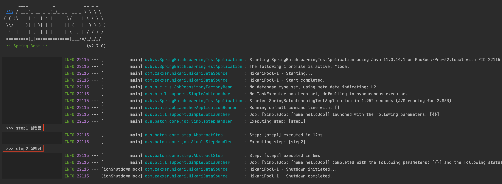
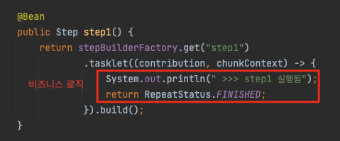

# 목차

<br>

- [목차](#목차)
- [들어가며](#들어가며)
- [Hello World Job 구성 및 실행](#hello-world-job-구성-및-실행)
- [디버깅을 통해 차근차근 살펴보는 스프링 배치 동작 과정](#디버깅을-통해-차근차근-살펴보는-스프링-배치-동작-과정)
  - [1 - BatchAutoConfiguration와 JobLauncherApplicationRunner](#1---batchautoconfiguration와-joblauncherapplicationrunner)
  - [2 - JobLauncher](#2---joblauncher)
  - [3 - Job](#3---job)
  - [4 - Step](#4---step)
    - [RepeatOperation.iterate](#repeatoperationiterate)
    - [TransactionTemplate](#transactiontemplate)
    - [RepeatOperation.iterate와 TransactionTemplate의 동작 과정 - 중요](#repeatoperationiterate와-transactiontemplate의-동작-과정---중요)
- [다시보는 전체 WorkFlow](#다시보는-전체-workflow)
- [마치며](#마치며)

<br>

# 들어가며
이전 글에선 Hello World 수준의 배치 Job을 만들어 스프링 배치의 전체적인 구조와 동작시키는 방법에 대해서 다루었다.

필자는 항상 특정 프레임워크를 사용할 때 해당 프레임워크는 어떤 방식으로 동작하는지에 대한 동작과정을 분석 및 정리한다.

실제로 스프링MVC를 사용할 때 [DispatcherServlet 처리 과정](https://github.com/binghe819/TIL/blob/master/Spring/MVC/Spring%20MVC%20flow.md)을 분석하면서 스프링MVC을 더 잘 이해하고 사용할 수 있게 되었다.

또한, 어떤 문제가 발생할 때 원인 파악을 훨씬 빠르게 할 수 있다.

**이번 글은 배치 애플리케이션의 가장 기초적인 SimpleJob과 TaskletStep을 구성하여 디버깅을 통해 전체적으로 배치가 어떻게 동작하는지에 대한 스프링 배치 WorkFlow를 정리하였다.**

<br>

# Hello World Job 구성 및 실행
스프링 배치의 전체적인 WorkFlow를 알아보기위한 Hello World 수준의 Job을 먼저 구성한다.

> 프로젝트 생성과 의존성에 대한 설정은 [이전 글](../spring-batch-helloworld-and-enabledbatchprocessing/spring-batch-helloworld-and-enabledbatchprocessing.md#1-1-프로젝트-생성-및-의존성)과 동일하다.

<br>

> HelloJobConfiguration.java

```java
@Configuration
@RequiredArgsConstructor
public class HelloJobConfiguration {

    private final JobBuilderFactory jobBuilderFactory;
    private final StepBuilderFactory stepBuilderFactory;

    @Bean
    public Job helloJob() {
        return jobBuilderFactory.get("helloJob")
                .start(step1())
                .next(step2())
                .build();
    }

    @Bean
    public Step step1() {
        return stepBuilderFactory.get("step1")
                .tasklet((contribution, chunkContext) -> {
                    System.out.println(" >>> step1 실행됨");
                    return RepeatStatus.FINISHED;
                }).build();
    }

    @Bean
    public Step step2() {
        return stepBuilderFactory.get("step2")
                .tasklet((contribution, chunkContext) -> {
                    System.out.println(" >>> step2 실행됨");
                    return RepeatStatus.FINISHED;
                }).build();
    }
}
```
하나의 Job (SimpleJob)에 두 개의 Step (TaskletStep)을 설정하였다.

<br>

> SpringBatchLearningTestApplication.java

```java
@SpringBootApplication
@EnableBatchProcessing
public class SpringBatchLearningTestApplication {

    public static void main(String[] args) {
        SpringApplication.run(SpringBatchLearningTestApplication.class, args);
    }

}
```
`@EnableBatchProcessing`을 붙이고 스프링 부트를 실행해주면 아래와 같이 실행이 잘 된 것을 볼 수 있다.

<p align="center"><br>실행 결과 </p>

> 지금은 하나의 Job만 구성해둔 상태에서 실행한 것이며, 만약 여러 Job이 존재하는 배치 프로젝트에서 특정 Job만을 실행시키고싶다면 [여기](../spring-batch-helloworld-and-enabledbatchprocessing/spring-batch-helloworld-and-enabledbatchprocessing.md#3-4-enablebatchprocessing---원하는-job만-실행시키기)를 참고하면 된다.

<br>

# 디버깅을 통해 차근차근 살펴보는 스프링 배치 동작 과정
이제 본격적으로 디버깅을 통해 스프링 배치 동작 과정을 살펴본다.

본래 스프링 부트 기반의 배치 애플리케이션을 실행하면 Job, Step등 여러 배치 도메인을 위한 빈을 설정한다.

하지만, 본 글에선 해당 부분을 제외하고, `JobLauncher`부분부터 다룰 예정이다.

> 이번 글에서의 동작 과정은 SimpleJob과 TaskletStep만으로 이루어진 동작 과정이다. 이 과정을 이해하면 추후에 ChunkOrientedTasklet을 이해하는데도 도움이 많이 된다.

<br>

우선 실행 과정에 대한 큰그림을 그려보면 아래와 같다.

<p align="center"> </p>

<br>

**빈 생성 부분을 제외하고 실행부터 실제 실행 과정은 아래와 같다.**

<p align="center"> </p>

지금 위 Flow가 이해되지 않아도 괜찮다. 차근차근 디버깅하면서 알아보면 된다.

<br>

## 1 - BatchAutoConfiguration와 JobLauncherApplicationRunner

스프링 부트 기반의 배치 애플리케이션을 실행하기위해 `@EnableBatchProcessing`를 붙이면, 배치를 실행하는데 필요한 도메인 빈들을 자동으로 등록해준다.

그리고 `BatchAutoConfiguration`에 정의된 빈들도 모두 등록되는데, 이때 아래와 같이 `ApplicationRunner`를 구현한 `JobLauncherApplicationRunner`가 빈으로 등록된다.

<br>

> BatchAutoConfiguration.java
<p align="center"><br>BatchAutoConfiguration </p>

<br>

`ApplicationRunner`를 구현한 `JobLauncherApplicationRunner`는 스프링 IoC 컨테이너에 의해 빈으로 등록된 후, `run()` 메서드가 호출된다.

`run()` 메서드의 구현은 아래와 같다.

<br>

> JobLauncherApplicationRunner.java
<p align="center"><br>JobLauncherApplicationRunner의 run() 메서드 구현 부분</p>

컴포넌트 스캔으로 등록된 모든 Job객체를 반복하며 설정된 JobName에 해당하는 모든 Job을 실행한다.

JobName 설정은 `spring.batch.job.names` 프로퍼티 설정을 통해 쉽게 설정할 수 있다.

그리고 코드에서도 알 수 있듯이, 여러 Job을 실행시키고싶다면 `,`를 기준으로 여러 JobName을 입력해주면 된다.

> 이와 관련된 더 자세한 내용은 [이전 글](../spring-batch-helloworld-and-enabledbatchprocessing/spring-batch-helloworld-and-enabledbatchprocessing.md#3-4-enablebatchprocessing---원하는-job만-실행시키기)을 참고하면 된다.

<br>

## 2 - JobLauncher
Job은 `JobLauncher.run(job, parameters)`를 통해 실행된다.

실제로 아래 코드는 보면 이해가 쉽다.

<br>

> SimpleJobLauncher.java

<p align="center"><br>SimpleJobLauncher의 run()메서드 부분 </p>

위 구현 부분을 보면 `JobLauncher.run` 메서드를 호출할 때 매개변수로 넘어온 Job을 실행하는 것을 볼 수 있다.

정확히는 `Job` 인터페이스의 `execute()` 메서드를 실행하여 Job을 실행한다.

> `JobExecution`은 배치 도메인 객체중 하나이다. 이와 관련된 자세한 내용은 다음 글에서 정리할 계획이다. 우선은 `execute()` 부분만 봐도 무방하다.

<br>

인터넷에있는 많은 배치 자료를 보면 JobLauncher가 Job을 실행한다고하는데, 실제 코드를 디버깅해보면 해당 내용은 모두 사실이라는 것을 증명할 수 있다.

별거 아니지만.. 이렇게 디버깅을 하며 동작 원리를 이해하면 공식 문서의 내용도 이해가 쉽고, 추후 발생한 문제에 대한 원인파악도 쉽다.

<br>

## 3 - Job
위에서 `JobLauncher`가 매개변수로 넘어온 `job.execute(jobExecution)`을 통해 Job을 실행하는 것을 알 수 있었다.

그리고 `Job` 인터페이스의 `execute(jobExecution)`을 구현한 구현체는 크게 `AbstractJob`와 `GroupAwareJob`이 존재한다.

<p align="center"><br>Job 인터페이스의 구현체 </p>

보통 많이 사용되는 구현체는 `AbstractJob` (이름에서 알 수 있듯이 추상 클래스다)이다. 

> 필자는 아직 `GroupAwareJob`을 사용하는 경우는 본 적이 없다. 추후 이와 관련된 내용을 더 자세히 다룰 예정이다.

<br>

`AbstractJob`의 `execute` 구현부분은 아래와 같다.

<br>

> AbstractJob.java

<p align="center"><br>AbstractJob의 execute 구현부분 </p>

이미 눈치채신 분들도 있겠지만, 템플릿 메서드 패턴을 활용한 것을 알 수 있다.

모든 Job 구현체마다의 공통 로직은 `AbstractJob`의 `execute`메서드에 위임하고, 핵심 로직만을 `AbstractJob`을 구현한 구체 클래스의 `doExecute` 메서드에 정의하는 것이다.

그리고 핵심 로직을 구현한 구체 클래스는 다음과 같다.

<p align="center"><br>추상 클래스 AbstractJob의 구현체 </p>

> 이렇게보면 스프링 생태계는 객체지향을 지향하며, 다양한 디자인 패턴을 잘 활용한다는 것을 알 수 있다.

<br>

아래는 실제 이번 디버깅에 사용될 `SimpleJob`의 `doExecute` 구현부분이다.

FlowJob의 구현 부분은 추후에 다른 글에서 자세히 다룰 예정이다. 이 글에선 큰 그림을 이해하기 쉽게하기 위해 비교적 간단한 `SimpleJob`을 대상으로 디버깅한다.

<br>

> SimpleJob.java

<p align="center"><br>SimpleJob의 doExecute 구현 부분 </p>

**코드에서도 쉽게 파악할 수 있듯이, Job이 가지고있는 Step들을 반복하며 하나 하나 실행하는 것을 알 수 있다.**

> Job과 Step을 설정하는 Configuration에서 스프링 IoC에 의해 설정된 Step들이 Job에 주입된다.

생각보다 엄청 간단하지 않은가? 필자는 이 부분을 디버깅하며, 생각보단 배치 애플리케이션이 간단히 구현되어 있다는 것을 느꼈다.

<br>

## 4 - Step
`SimpleJob`의 구현부분을 보면 알 수 있듯이, Step을 반복하며 StepHandler를 통해 Step을 실행한다.

아래는 StepHandler의 구현체인 `SimpleStepHandler.handleStep` 구현부분이다.

<br>

> SimepleStepHandler.java

<p align="center"><br>SimpleStepHandler.handleStep 구현 부분 </p>

`step.execute`를 통해 매개변수로 넘어온 step을 실행하는 것을 볼 수 있다.

그리고 바로 윗 부분은 JobRepository를 통해 같은 JobInstance에서 이미 실행된 Step인지 DB로부터 확인한다.

> 이 부분은 바로 다음 글에서 더 자세히 다룰 예정이다.

즉, Job에서 Step을 반복하면서 StepHandler를 통해 Step마다 `execute`를 호출하여 Step을 실행하는 것이다.

<br>

Step의 바로 아래 구현체는 `AbstractStep` 추상 클래스만 존재한다.

그리고 Step도 Job과 동일하게 템플릿 메서드 패턴을 활용한다.

> AbstractStep.java

<p align="center"><br>AbstractStep의 execute 구현부분 </p>

Job과 동일하게 모든 Step의 공통 로직은 `AbstractStep`에서 담당하고, 핵심 로직은 `AbstractStep`의 구현체들에 위임한다.

<p align="center"><br>AbstractStep의 구현체 </p>

AbstractStep의 구현체는 위와 같이 다양하다.

이번 글에선 가장 간단하고 많이 사용되는 `TaskletStep`을 대상으로만 디버깅한다.

<br>

> 여기서부터의 내용은 더더욱 중요하다. 이후에 청크 지향을 이해하는데 기초적인 내용이기 때문이다.

아래는 `TaskletStep`의 `doExecute` 메서드 구현 부분이다.

<p align="center"><br>TaskletStep의 doExecute 구현 부분 </p>

눈에 띄는 것이 크게 두 가지 있다. (중요한 내용이기도 하다.)

1. RepeatOperation.iterate
2. TransactionTemplate

<br>

### RepeatOperation.iterate
첫번째로 눈에 띄는 것은 iterate 부분이다.

위 구현 코드에선 구현체인 `stepOperation.iterate`로 사용되며, 실제 구현체는 보통 `RepeatTemplate`을 사용한다.

> RepeatOperation.java

<p align="center"><br>RepeatOperation </p>

인터페이스인 `RepeatOperation`의 내용을 살펴보면, `callback의 결과에 따라 callback 재호출 여부를 판단한다고 되어있다`

실제 매개변수로 넘어오는 callback는 `RepeatCallback` 인터페이스의 구현체들이며, 위 코드에선 익명 클래스를 사용했다.

> RepeatCallback.java

<p align="center"><br>RepeatCallback </p>

메서드 시그니처를 보면 알 수 있듯이 반환값으로 `RepeatStatus`를 받고있다.

그리고 `RepeatStatus`는 아래와 같이 `Enum`이며, `CONTINUABLE`와 `FINISHED` 두 개의 상수를 가진다.

<p align="center"><br>RepeatStatus </p>

즉, **`RepeatOperation`은 callback으로 넘어오는 `RepeatCallback`의 구현체를 실행함과 동시에, 결과 값이 어떤 값이냐에 따라서 해당 callback을 재호출 여부를 판단한다.**

지금쯤 눈치채신 분도 계시겠지만, 아래와 같이 개발자가 구현하는 `Tasklet`의 반환값으로 보통 `RepeatStatus`를 반환한다.

<p align="center"><br>개발자가 구현하는 Tasklet의 비즈니스 코드</p>

아마 처음 스프링 배치를 접하여 HelloWorld Job을 구성하다보면 TaskletStep 구성중 왜 RepeatStatus를 반환하는지 모르는 개발자가 많을 것이다.

이제 이 글을 읽은 독자는 그 이유를 알게 된 것이다 :) 바로 해당 개발자가 구현한 비즈니스 로직의 재호출 여부를 판단하기 위해 반환하는 것이었다.

<br>

즉, `RepeatStatus.FINISHED`를 반환하거나 예외가 발생하기 전까지 개발자가 구현한 비즈니스 로직을 담은 Tasklet을 반복 실행한다.

<br>

### TransactionTemplate
두번째로 눈에 띄는 것은 TransactionTemplate이다.

<p align="center"> </p>

위 호출 부분을 잘 보면, `TransactionManager`를 매개변수로 넘기며, `TransactionTemplate`의 `execute()` 메서드를 호출한다.

> TransactionTemplate.java

<p align="center"> </p>

위 코드를 보면 알 수 있듯이, `TransactionTemplate`이 생성될 때 생성자로 받은 `TransactionManager`를 이용하여, 트랜잭션 기반으로 동작하는 것을 볼 수 있다.

그리고 실제 `TransactionCallback`의 구현체인 `ChunkTransactionCallback`의 `doInTranction` 구현부분은 아래와 같다.

> ChunkTransactionCallback.java

<p align="center"> </p>

Tasklet을 실행하는 것을 볼 수 있다. 그리고 **위 Tasklet이 바로 아래와 같이 개발자가 구현한 비즈니스 코드이다.**

<p align="center"> </p>

> 참고로 `ChunkTransactionCallback`는 `TaskletStep`의 내부 클래스이기 때문에, `TaskletStep` 빈이 생성될 때 주입받은 Tasklet에 접근할 수 있다.

<br>

### RepeatOperation.iterate와 TransactionTemplate의 동작 과정 - 중요
이제 눈에 띄는 두 가지 개념을 하나로 모아서 동작 과정을 정리해보면 아래와 같다.

<p align="center"><br>TaskletStep의 동작과정 </p>

* `TaskletStep`은 `RepeatTemplate`을 이용하여 `RepeatStatus.FINISHED`를 반환하거나 예외가 발생하기 전까지 비즈니스 로직을 반복한다.
* 그리고 이때 매 실행마다 `Transaction`안에서 동작하게 된다.

<br>

# 다시보는 전체 WorkFlow
이제 이 글의 처음에 보여주었던 동작 과정을 다시 살펴보자.

<p align="center"> </p>

1. `@EnableBatchProcessing`으로 인해 배치에 필요한 빈들이 생성 및 설정된다.
   * 이때 개발자가 설정한 Job과 Step 빈들이 주입되며, 배치를 실행할 때 필요한 도메인 빈들도 같이 생성 및 설정된다.
2. `JobLauncher`에 의해 실행시 설정한 `JobNames`를 기준으로 `Job`을 실행한다.
3. `Job`마다 하나 이상의 `Step`을 가지며, 반복문을 돌면서 `Step`을 실행한다.
4. 각 `Step`마다 개발자가 주어진 비즈니스 로직을 `RepeatStatus.FINISHED` 혹은 예외가 발생할 때까지 반복 실행한다.
   * 이때 매 실행은 트랜잭션안에서 동작하게 된다.

<br>

# 마치며
디버깅과 글을 같이 작성하다보니.. 글이 조금 난잡해졌다.

이런 동작 원리에 관한 것은 역시 글보단 영상을 통해 같이 디버깅하는 과정이 좋은 듯 하다.

그래도 필자가 디버깅하는 전체적인 과정을 모두 담았으며, 그림을 통해 설명하려 노력했다.

이 글을 읽을 땐 직접 디버깅하면서 같이 읽으면 좋을 듯 하다. (백문불여일타)

다음 글은 디버깅을 하면서 자꾸만 눈에 띄던 여러 배치 도메인에 대해서 정리한다.
