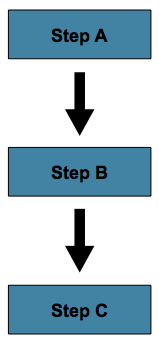
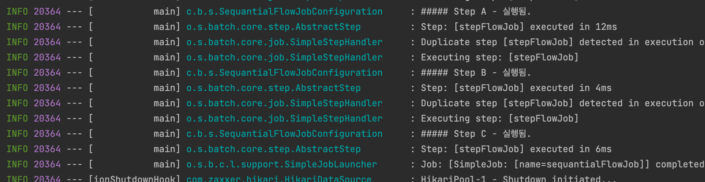
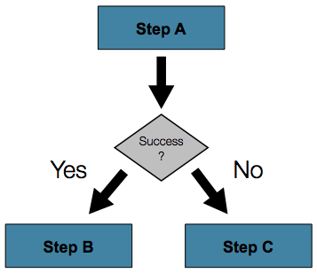
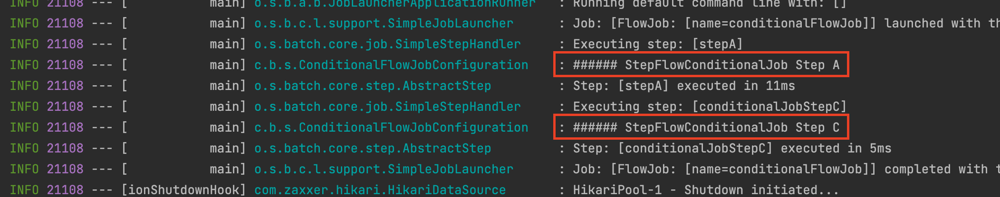
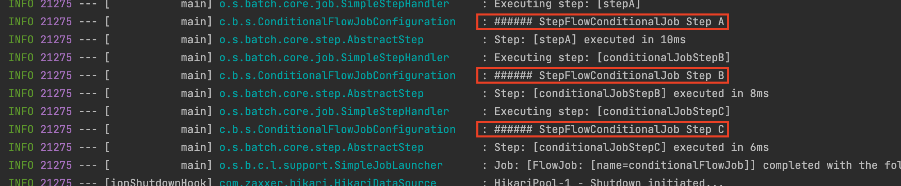
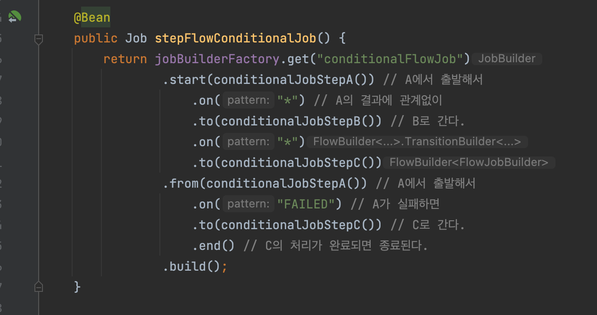
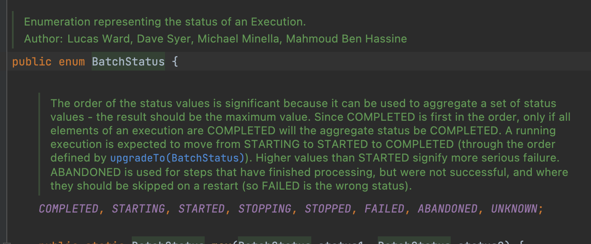
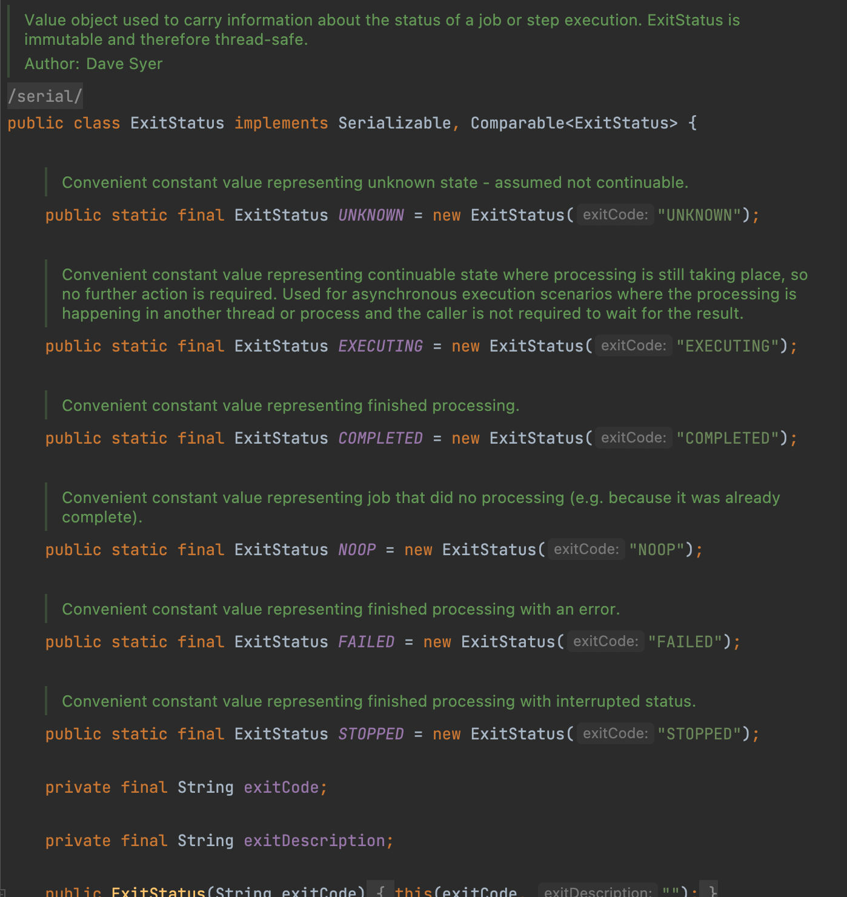
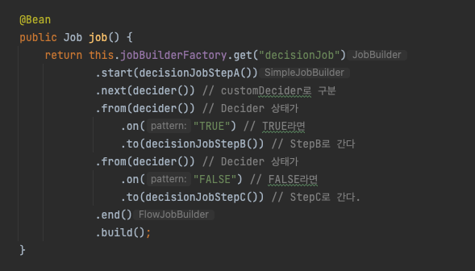

# 목차

<br>

- [목차](#목차)
- [들어가며](#들어가며)
- [순차 흐름 제어 - next()](#순차-흐름-제어---next)
- [조건별 흐름 제어](#조건별-흐름-제어)
- [fail()과 stopAndRestart() - TODO](#fail과-stopandrestart---todo)
- [Batch Status vs Exit Status](#batch-status-vs-exit-status)
  - [Batch Status](#batch-status)
  - [Exit Status](#exit-status)
- [프로그래밍 방식의 흐름 제어](#프로그래밍-방식의-흐름-제어)
- [Split 흐름 제어 - TO DO](#split-흐름-제어---to-do)
- [마치며](#마치며)
- [참고](#참고)

<br>

# 들어가며
Spring Batch에서 Job을 구성하는 요소는 Step이다.

그리고 Step은 실제로 Batch의 작업을 수행하는 역할을 수행한다.

이때, 특정 Step이 실패했다고 무조건 해당 Job이 실패해야하는 것은 아니다.

물론 특정 Step이 성공해야지만 바로 다음 순서의 Step (순차적 Flow 관점)으로 이어지는 것도 아니다.

이러한 Step들간의 순서 혹은 처리 흐름을 제어하는 것은 Job 구성에 있어서 굉장히 중요하다.

이번 글은 Step의 Flow를 제어하는 내용을 다룬다.

<br>

# 순차 흐름 제어 - next()
우선 가장 간단한 것을 먼저 알아본다.

바로 `next()`를 이용한 순차 Flow를 구성해보는 것이다.

<p align="center"><br>출처: Spring Batch Docs </p>

> SequantialFlowJobConfiguration.java

```java
@EnableBatchProcessing
@RequiredArgsConstructor
@Slf4j
@Configuration
public class SequantialFlowJobConfiguration {

    private final JobBuilderFactory jobBuilderFactory;
    private final StepBuilderFactory stepBuilderFactory;

    @Bean
    public Job stepFlowJob() {
        return jobBuilderFactory.get("sequantialFlowJob")
                .start(stepFlowStepA())
                .next(stepFlowStepB())
                .next(stepFlowStepC())
                .build();
    }

    @Bean
    public Step stepFlowStepA() {
        return stepBuilderFactory.get("stepFlowJob")
                .tasklet(((contribution, chunkContext) -> {
                    log.info("##### Step A - 실행됨.");
                    return RepeatStatus.FINISHED;
                }))
                .build();
    }

    @Bean
    public Step stepFlowStepB() {
        return stepBuilderFactory.get("stepFlowJob")
                .tasklet(((contribution, chunkContext) -> {
                    log.info("##### Step B - 실행됨.");
                    return RepeatStatus.FINISHED;
                }))
                .build();
    }

    @Bean
    public Step stepFlowStepC() {
        return stepBuilderFactory.get("stepFlowJob")
                .tasklet(((contribution, chunkContext) -> {
                    log.info("##### Step C - 실행됨.");
                    return RepeatStatus.FINISHED;
                }))
                .build();
    }
}
```
Job 설정을 보면 `next()`를 통해 순차적으로 Step을 설정한 것을 볼 수 있다.

`StepA -> StepB -> StepC`

실행해보면 아래와 같이 순차적으로 Job이 실행된 것을 볼 수 있다.

<p align="center"> </p>

> 특정 Job을 실행하는 방법에 대해선 [여기 - ]()에서 다뤘습니다.

<br>

# 조건별 흐름 제어
위와 같이 순차별 흐름 제어만 사용하면 좋겠지만.. 배치 작업을 하다보면 Step들을 조건별 흐름 제어할 일도 종종 생긴다.

예를 들어, 특정 Step이 실패해도 남은 Step을 계속해서 실행되야한다든지, 

아래와 같이 Step A가 정상인 경우 B로 실패인경우 C로 흐름을 제어한다든지

<p align="center"><br>출처: Spring Batch Docs </p>

스프링 배치에서는 위와 같은 조건별 흐름 제어를 위해 다양한 기능을 제공해주고 있다.

우선 위 그림에 맞는 코드를 작성 및 실행해보고 자세한 내용에 대해서 다뤄본다.

<br>

```java
@EnableBatchProcessing
@RequiredArgsConstructor
@Slf4j
@Configuration
public class ConditionalFlowJobConfiguration {

    private final JobBuilderFactory jobBuilderFactory;
    private final StepBuilderFactory stepBuilderFactory;

    @Bean
    public Job stepFlowConditionalJob() {
        return jobBuilderFactory.get("conditionalFlowJob")
                .start(conditionalJobStepA()) // A에서 출발해서
                    .on("*") // A의 결과에 관계없이
                    .to(conditionalJobStepB()) // B로 간다.
                    .on("*")
                    .to(conditionalJobStepC())
                .from(conditionalJobStepA()) // A에서 출발해서
                    .on("FAILED") // A가 실패하면
                    .to(conditionalJobStepC()) // C로 간다.
                    .end() // C의 처리가 완료되면 종료된다.
                .build();
    }

    @Bean
    public Step conditionalJobStepA() {
        return stepBuilderFactory.get("stepA")
                .tasklet((contribution, chunkContext) -> {
                    log.info("###### StepFlowConditionalJob Step A");

                    contribution.setExitStatus(ExitStatus.FAILED);

                    return RepeatStatus.FINISHED;
                })
                .build();
    }

    @Bean
    public Step conditionalJobStepB() {
        return stepBuilderFactory.get("conditionalJobStepB")
                .tasklet((contribution, chunkContext) -> {
                    log.info("###### StepFlowConditionalJob Step B");
                    return RepeatStatus.FINISHED;
                })
                .build();
    }

    @Bean
    public Step conditionalJobStepC() {
        return stepBuilderFactory.get("conditionalJobStepC")
                .tasklet((contribution, chunkContext) -> {
                    log.info("###### StepFlowConditionalJob Step C");
                    return RepeatStatus.FINISHED;
                })
                .build();
    }
}
```
<details>
  <summary>Job 설정은 동일하게 동작하지만 아래와 같이 다르게 설정할 수 도 있다.</summary>
  
  ---
  
  ```java
    @Bean
    public Job stepFlowConditionalJob() {
        return jobBuilderFactory.get("conditionalFlowJob")
                .start(conditionalJobStepA()) // A에서 출발해서
                    .on("FAILED") // A가 실패하면
                    .to(conditionalJobStepC()) // C로 간다
                    .on("*") // C의 결과에 관계없이
                    .end() // C의 처리가 완료되면 종료한다
                .from(conditionalJobStepA()) // A에서 출발해서
                    .on("*") // 결과에 관계없이
                    .to(conditionalJobStepB()) // B로 간다
                    .on("*") // B의 결과에 관계없이
                    .to(conditionalJobStepC()) // C로 간다.
                    .end() // C의 처리가 완료되면 종료한다
                .build();
    }
  ```
  
  ---
</details>

위 Job을 실행하면 아래와 같이 `A -> C`로 결과가 나오는 것을 볼 수 있다.

<p align="center"><br>A -> C </p>

만약 `conditionalJobStepA`의 `contribution.setExitStatus(...)`를 주석처리하면 아래와 같이 `A -> B -> C`로 결과가 나오는 것을 볼 수 있다.

<p align="center"><br>A -> B -> C</p>

정리해보면 위 Job의 Flow는 다음과 같다.

* A 성공시: A -> B -> C
* A 실패시: A -> C

<br>

위 Flow는 모두 Job의 설정을 통해 가능하다.

<p align="center"> </p>

* `start()`
  * Job의 시작을 의미.
  * `JobFlowBuilder`를 반환한다.
* `on()`
  * 간단한 패턴을 입력하여 해당 Step 실행 결과인 `ExitStatus`와 매치하는 역할.
  * 즉, 캐치할 `ExitStatus` 지정 (중요한 점은 Step이 실행된 후에 매칭한다는 것)
    * "*" matches zero or more characters
    * "?" matches exactly one character
* `to()`
  * 다음으로 이동할 Step 지정.
* `from()`
  * 매개변수로 넘어온 Step으로 돌아가서 새 Flow를 시작해야하는 경우 사용한다. 아직 등록되지 않은 Step이면 `start(step)`으로 동작한다.
  * 이벤트 리스터와 비슷한 역할을 한다.
  * ex. 만약 `StepA`의 이벤트 캐치가 `FAILED`면 추가로 이벤트 캐치를 해줘야하기에 이때 `from`을 사용한다.
* `end()`
  * 
  * 두 종류의 end가 존재한다.
    * `FlowBuilder`를 반환하는 end -> `on("*")`앞에 위치함
    * `FlowBuilder`를 종료하는 end -> `build()`앞에 위치함
  * `Flowbuilder`를 반환하는 end의 경우 계속해서 `from`을 이어갈 수 있다.

<br>

여기서 중요한 부분은 `on`이 매칭하는 것은 `BatchStatus`가 아닌 `ExitStatus`라는 것이다.

그러므로 만약 Job의 Flow를 제어하려면 `ExitStatus`를 사용하면 된다.

> 위 코드에선 `contribution.setExitStatus(...)`부분을 참고하면 된다.

<br>

# fail()과 stopAndRestart() - TODO

<br>

# Batch Status vs Exit Status
Spring Batch Docs를 보면 Job의 Step을 조건별로 흐름 제어하려면 `BatchStatus`와 `ExitStatus`의 차이점을 이해하는 것이 중요하다고 나온다.

이번 장에선 이 둘의 차이점에 대해서 다뤄본다.

<br>

## Batch Status
`BatchStatus`는 Job과 Step의 실행 결과인 `JobExecution`과 `StepExecution`의 상태를 기록할 때 사용되는 Enum이다.

<p align="center"> </p>

> `BATCH_JOB_EXECUTION`테이블의 `STATUS`를 나타내는 상수라고보면 된다.

<br>

## Exit Status
반면에 `ExitStatus`는 Step의 흐름을 제어할 때 사용되는 `on`메서드의 매개변수로 참조된다.

그리고 `ExitStatus`는 Step의 실행 후 상태를 의미한다.

<p align="center"> </p>

예를 들면, `from(StepA()).on("FAILED").to(StepB()`)는 StepA의 `ExitStatus` exitCode가 `FAILED` 로 끝나면 StepB로 가라는 의미이다.

<br>

Step의 `ExitStatus` exitCode는 디폴트로 항상 `BatchStatus`와 같다.

만약 `ExitStatus`의 exitCode가 `BatchStatus`와 다르게 커스텀하고 싶다면 아래와 같이 해주면 된다.

```java
@Bean
public Job customExitStatusJob() {
    return this.jobBuilderFactory.get("customExitStatusJob")
            .start(stepA())
                .on("FAILED")
                .end()
            .from(stepA())
                .on("COMPLETED WITH SKIPS")
                .to(printErrorStep())
            .from(stepA())
                .on("*")
                .to(stepB())
                .end()
            .build();
}
```
위 설정의 결과는 3가지가 될 수 있다.

* StepA가 실패하면, Job이 실패하게된다.
* StepA가 성공적으로 수행되면 StepB가 수행된다.
* StepA가 성공적으로 완료되었지만, exitCode가 `COMPLETED WITH SKIPS`면 오류를 처리하기 위해 다른 Step(printErrorStep)을 실행한다.

위와 같이 커스텀한 exitCode를 설정하기 위해선 아래와 같이 Listener를 구현해주어야한다.

```java
public class SkipCheckingListener extends StepExecutionListenerSupport {

    @Override
    public ExitStatus afterStep(StepExecution stepExecution) {
        String exitCode = stepExecution.getExitStatus().getExitCode();
        if (!exitCode.equals(ExitStatus.FAILED.getExitCode()) && stepExecution.getSkipCount() > 0) {
            return new ExitStatus("COMPLETED WITH SKIPS");
        }
        return null;
    }
}
```
위 코드를 해석해보면 Step이 실패하지않으며, skip count가 0보다 크면 커스텀 errorCode인 `COMPLETED WITH SKIPS`를 반환하도록 한다.

<br>

# 프로그래밍 방식의 흐름 제어
어떤 상황에서는 다음에 실행할 Step을 결정하기 위해 `ExitStatus`보다 더 많은 정보가 필요할 수도 있다.

위에서 설명한 `ExitStatus`를 이용하여 Step의 흐름 제어를 하는 것은 다음과 같은 문제점이 존재한다.

1. `ExitStatus`보다 더 많은 정보가 필요한 경우 직접 Listener를 구현해줘야하는 번거로움이 존재.
2. `ExitStatus`에 의존적이라 Step에서 분기처리를 위해 `ExitStatus`를 제어해줘야한다. 이는 Step의 역할이 하나 이상이라는 의미이다.

스프링에서는 위와 같은 문제를 `JobExecutionDecider`라는 이름으로 흐름 제어의 역할만을 담당하는 객체를 제공한다.

<br>

> DeciderJobConfiguration.java
```java
@EnableBatchProcessing
@RequiredArgsConstructor
@Slf4j
@Configuration
public class DecisionJobConfiguration {

    private final JobBuilderFactory jobBuilderFactory;
    private final StepBuilderFactory stepBuilderFactory;

    @Bean
    public Job job() {
        return this.jobBuilderFactory.get("decisionJob")
                .start(decisionJobStepA())
                .next(decider()) // customDecider로 구분
                .from(decider()) // Decider 상태가
                    .on("TRUE") // TRUE라면
                    .to(decisionJobStepB()) // StepB로 간다
                .from(decider()) // Decider 상태가
                    .on("FALSE") // FALSE라면
                    .to(decisionJobStepC()) // StepC로 간다.
                .end()
                .build();
    }

    @Bean
    public Step decisionJobStepA() {
        return stepBuilderFactory.get("stepA")
                .tasklet((contribution, chunkContext) -> {
                    log.info("###### StepFlowConditionalJob Step A");
                    return RepeatStatus.FINISHED;
                })
                .build();
    }

    @Bean
    public Step decisionJobStepB() {
        return stepBuilderFactory.get("stepB")
                .tasklet((contribution, chunkContext) -> {
                    log.info("###### StepFlowConditionalJob Step B");
                    return RepeatStatus.FINISHED;
                })
                .build();
    }

    @Bean
    public Step decisionJobStepC() {
        return stepBuilderFactory.get("stepC")
                .tasklet((contribution, chunkContext) -> {
                    log.info("###### StepFlowConditionalJob Step C");
                    return RepeatStatus.FINISHED;
                })
                .build();
    }

    @Bean
    public JobExecutionDecider decider() {
        return new CustomDecider();
    }

    static class CustomDecider implements JobExecutionDecider {
        @Override
        public FlowExecutionStatus decide(JobExecution jobExecution, StepExecution stepExecution) {
            if (someCondition()) {
                return new FlowExecutionStatus("TRUE");
            }
            return new FlowExecutionStatus("FALSE");
        }

        private boolean someCondition() {
            return false; // 이 값에 따라 StepB로 갈지 StepC로 갈지 결정된다.
        }
    }
}
```
이제 Step들은 자신이 맡은 로직만을 처리하고, 분기처리는 Decision에 위임할 수 있게 되었다.

<p align="center"> </p>

* `start()`
  * Job Flow의 첫 Step을 시작.
* `next()`
  * 첫 Step을 실행후 `decision`을 실행
* `from()`
  * `decision` 상태값을 보고 일치하는 상태로 `to`에 포함된 Step을 실행

<br>

# Split 흐름 제어 - TO DO

<br>

# 마치며
이번엔 Job의 구성요소인 Step의 흐름을 어떻게 제어하는지에 대해서 다뤘다.

아직 TODO로 남겨둔 내용이 있지만, 이는 추후에 하나하나 채울 예정이다.

<br>

# 참고
* https://docs.spring.io/spring-batch/docs/current/reference/html/step.html#controllingStepFlow
* https://jojoldu.tistory.com/328?category=902551
