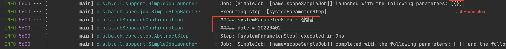
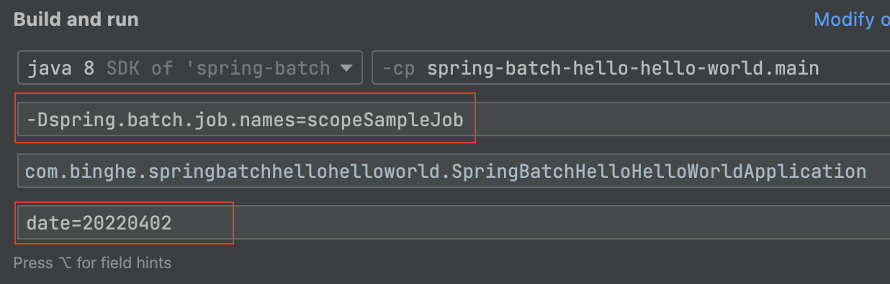
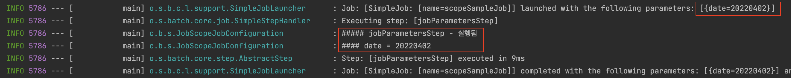
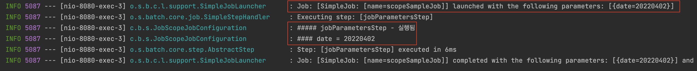
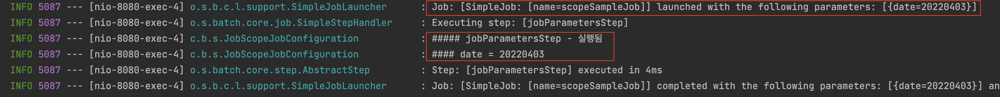

# 목차

<br>

- [목차](#목차)
- [들어가며](#들어가며)
- [Spring Scope](#spring-scope)
- [@JobScope와 @StepScope는 왜 필요한가? (feat. JobParameter와의 관계)](#jobscope와-stepscope는-왜-필요한가-feat-jobparameter와의-관계)
  - [사전지식. 시스템 변수와 Job Parameters](#사전지식-시스템-변수와-job-parameters)
  - [첫번째 이유. Late Binding](#첫번째-이유-late-binding)
    - [두번째이유. 병렬 혹은 동시에 사용할 때 안전하다.](#두번째이유-병렬-혹은-동시에-사용할-때-안전하다)
- [Job Parameters는 Step이나 Job Scope일 때만 사용가능하다](#job-parameters는-step이나-job-scope일-때만-사용가능하다)
- [JobScope vs StepScope - 미완성](#jobscope-vs-stepscope---미완성)
- [마치며](#마치며)
- [참고](#참고)

<br>

# 들어가며
스프링 배치를 제대로 활용하려면 Scope에 대한 이해가 필요하다.

필자의 경우는 공식 문서와 여러 자료를 봐도 Scope이 왜 필요한지에 대한 이해를 하지 못했다..

그래서 필자가 이해한대로 한번 정리해보고자 한다.

이번 글은 Spring Batch의 Scope와 Job Parameters에 대한 정리글이다.

<br>

# Spring Scope
Spring을 사용해본 개발자라면 다 알다시피 Spring의 Bean은 Scope이 존재한다.

`singleton, prototype, request, session, application, websocker`등등

SpringMVC에서는 객체 생성의 비용을 최소화하기 위해 `singleton`을 디폴트로 많이 사용한다.

Spring Batch도 디폴트는 `singleton`이다.

하지만 Spring Batch에서는 Spring Framework가 제공하는 Scope외에도 추가적인 Scope를 지원한다.

이전에 살펴봤듯이 배치는 보통 Job과 Step을 통해 작업이 수행되기 때문에 이에 맞는 Scope이 존재한다.

* `@JobScope`
* `@StepScope`

<br>

# @JobScope와 @StepScope는 왜 필요한가? (feat. JobParameter와의 관계)
Spring Batch에서는 왜 새로운 Scope인 `@JobScope`와 `@StepScope`를 만들었을까?

이들은 어떻게 사용될까? 간단한 예시를 통해 왜 필요한지 살펴본다.

> 필자도 너무 궁금했던 내용이었는데.. 공식 문서를 잘 읽어보면 힌트를 알 수 있다. [참고](https://docs.spring.io/spring-batch/docs/current/reference/html/step.html#late-binding)

**결론적으로 두 Scope이 필요한 이유는 다음과 같다.**
1. Late Binding를 통해 실행시점에 매개변수를 할당할 수 있다.
   * 이를 통해, 컴파일타임이 아닌 런타임에 파라미터로 매개변수를 할당할 수 있다.
2. 병렬 혹은 동시에 사용할 때 안전하다.
   * Step내 존재하는 멤버 변수를 변경하는 로직이 존재한다면, 병렬 처리시 서로의 상태를 침범할 수 있다. Scope을 사용하면 이 문제를 방지할 수 있다.

<br>

이유를 이해하기 위해선 우선 배치에 외부 입력값을 할당할 수 있는 시스템 변수 방식과 Job Parameters 방식을 이해해야한다.

<br>

## 사전지식. 시스템 변수와 Job Parameters
**`@JobScope`와 `@StepScope`를 만든 이유를 이해하기 위해선 Job이나 Step에 매개변수를 할당해주는 기능에 대해서 먼저 이해해야한다.**

매개변수로 할당하는 방식은 시스템 변수와 Spring Batch의 Job Parameters 방식이 존재한다.

간단히 두 가지 방법에 대해서 알아보자.

<br>

1️⃣ **시스템 변수를 통한 할당**

자바 애플리케이션 실행시 할당해주는 시스템 변수를 통해 Job의 매개변수를 할당해줄 수 있다.

```java
@Bean
public Step systemParameterStep(@Value("${input.date}") String date) {
    return stepBuilderFactory.get("systemParameterStep")
            .tasklet(((contribution, chunkContext) -> {
                log.info("##### systemParameterStep - 실행됨.");
                log.info("##### date = {}", date);
                return RepeatStatus.FINISHED;
            }))
            .build();
}
```
실행할 때 `-Dinput.date=20220402`를 시스템 변수로 넘겨주면 아래와 같이 잘 실행된다.

<p align="center"> </p>

> 이 방식의 문제점은 Spring Batch의 배치 기능을 사용할 수 없다는 것이다.
> 
> 위 결과에서도 자세히보면 Spring Batch에서는 시스템 변수로 넘어온 값을 인식하지 못한다.
> 
> **그저 Spring에서 제공하는 @Value 기능을 통해 전역 변수로 할당된 시스템 변수를 가져오는 것.**

<br>

2️⃣ **Job Parameters를 통한 할당**

스프링 배치에서 만든 매개변수 할당 방식.

```java
@Bean
@JobScope
public Step jobParametersStep(@Value("#{jobParameters[date]}") String date) {
    return stepBuilderFactory.get("jobParametersStep")
            .tasklet((contribution, chunkContext) -> {
                log.info("##### jobParametersStep - 실행됨");
                log.info("#### date = {}", date);
                return RepeatStatus.FINISHED;
            })
            .build();
}
```
`program argument`로 아래와 같이 설정해서 실행한다

<p align="center"> </p>

실행하면 아래와 같은 결과를 얻을 수 있다.

<p align="center"> </p>

중요한 점은 시스템 변수와 다르게 Spring Batch에서 이 Parameter를 인식함으로써 배치의 기능을 활용할 수 있다.

이와 관련되서는 아래서 더 자세히 다룰 예정이다.

<br>

## 첫번째 이유. Late Binding
위에서 Scope가 필요한 첫번째 이유로 `Late Binding`을 이야기했다.

**이 `Late Binding`란 Bean의 생성시점이 스프링 애플리케이션 컨텍스트가 생성되는 시점이 아닌 `@JobScope`와 `@StepScope`가 명시된 메서드를 실행될 때까지 지연시킨다는 의미이다.**

그렇다면 왜 `Late Binding`이 필요할까요?

정답부터 말하자면 Job Parameters를 사용하기 위함이다.

풀어서 얘기하자면 아래와 같은 이유 때문이다.

1. **Job 혹은 Step마다 서로 다른 매개변수를 동적으로 할당할 수 있다.**
   * 시스템 변수로 매개변수를 할당하면 컴파일타임에 전역 변수로 전달하는 것과 동일하다. 즉, 전역 변수이기에 매번 모든 Job에 동일한 값만을 넘기게 된다.
   * 반면에, Job Parameters를 통해 동적으로 할당할 수 있다면, 매번 다른 매개변수를 통해 Job을 동작시킬 수 있다.
2. **시스템 변수가 아닌 Job Parameters를 통해 Parameter 관련 메타 테이블을 관리하고, 배치의 기본적인 기능을 수행할 수 있다.**
   * ex. 같은 Job Parameters로 같은 Job을 두 번 실행할 수 없다. (배치의 기본 기능)

<br>

간단한 예시를 통해 두 이유를 설명해본다.

1️⃣ **Job 혹은 Step마다 서로 다른 매개변수를 동적으로 할당할 수 있다.**

예를 들어, 웹 서버가 있고 특정 URL을 요청할 때마다 배치를 동작시킨다고 가정해본다.

> JobScopeJobConfiguration.java
```java
@EnableBatchProcessing
@RequiredArgsConstructor
@Slf4j
@Configuration
public class JobScopeJobConfiguration {

    private final JobBuilderFactory jobBuilderFactory;
    private final StepBuilderFactory stepBuilderFactory;

    @Bean
    public Job scopeSampleJob() {
        return jobBuilderFactory.get("scopeSampleJob")
                .start(jobParametersStep(null))
                .build();
    }

    @Bean
    @JobScope
    public Step jobParametersStep(@Value("#{jobParameters[date]}") String date) {
        return stepBuilderFactory.get("jobParametersStep")
                .tasklet((contribution, chunkContext) -> {
                    log.info("##### jobParametersStep - 실행됨");
                    log.info("#### date = {}", date);
                    return RepeatStatus.FINISHED;
                })
                .build();
    }
}
```

> JobLauncherTestController.java
```java
@Slf4j
@RequiredArgsConstructor
@RestController
public class JobLauncherTestController {

    private final JobLauncher jobLauncher;
    private final Job scopeSampleJob;

    @GetMapping("/batch")
    public ResponseEntity<String> launchBatch(@RequestParam("date") String date) {
        JobParameters jobParameters = new JobParametersBuilder()
                .addString("date", date)
                .toJobParameters();

        try {
            jobLauncher.run(scopeSampleJob, jobParameters);
        } catch (Exception e) {
            System.out.println(e.getMessage());
            return ResponseEntity.ok("error");
        }

        return ResponseEntity.ok("ok");
    }
}
```
파라미터로 `date` 값을 받는 간단한 배치 Job을 만들고 웹 애플리케이션의 Controller를 통해 job을 실행시키는 예제이다.

> Step에 자세히보면 `@JobScope`가 붙어있다.

예제를 통해 보면 알 수 있듯이, Job에 넘길 파라미터를 다음과 같이 동적으로 설정해줄 수 있다.

```java
JobParameters jobParameters = new JobParametersBuilder()
                .addString("date", date)
                .toJobParameters();
```

그리고 JobLauncher를 통해 Job을 수행할 수 있다.

```java
jobLauncher.run(jobNamee, jobParameters);
```

실제로 웹 애플리케이션을 실행해서 다른 QueryParam을 넘겨보면 아래와 같이 다른 파라미터로 Job이 동작하는 것을 볼 수 있다.

<p align="center"><br>파라미터 date=20220402 </p>

<p align="center"><br>파라미터 date=20220403 </p>

위와 같이 Scope을 붙여줌으로서 Job Parameters를 이용할 수 있으며, 동적으로 파라미터를 넘겨줘서 Job을 실행할 수 있다.

시스템 변수를 통해 매개변수 넘기는 방식으로는 위와 같이 동적으로 할당할 수 없다.

<br>

2️⃣ **Job Parameters를 사용해야 배치 애플리케이션의 기본 기능을 사용할 수 있다.**

위 웹 애플리케이션을 켠 상태에서 방금 요청한 `date=20220402`로 재요청을 날리면 아래와 같이 예외가 발생한다.

<p align="center"><br>이전에 요청했던 date=20220402로 재요청시 발생한 예외</p>

위 예외가 발생하고 배치는 실행조차 되지 않는다.

배치의 기본 기능인 `Job`은 같은 `JobParameter`를 가진 `JobInstance`를 만들 수 없는 것 때문에 위와 같은 메시지가 발생하는 것이다.

즉, 같은 JobParameter로 같은 Job을 두 번 실행시킬 수 없다.

만약 시스템 변수로 파라미터를 넘겨준다면 위와 같은 예외는 발생하지 않는다.

<br>

### 두번째이유. 병렬 혹은 동시에 사용할 때 안전하다.
두번째이유는 사실 굉장히 명확하다.

Step안에 멤버변수가 존재하는데 병렬처리를 한다면 당연히 해당 값을 Thread-Safe하지 않다.

그 이유는 Step의 기본 값이 싱글톤이기때문에 병렬처리를 수행하는 여러 Thread가 같은 객체(Step)의 멤버 변수를 변경하기때문이다.

하지만 `@JobScope`나 `@StepScope`를 사용한다면 별도의 Tasklet (혹은 reader / processor / writer)를 생성하여 관리하기 때문에 서로의 상태를 침범 할 일이 없다.

<br>

# Job Parameters는 Step이나 Job Scope일 때만 사용가능하다
Job Parameters를 사용하기 위해선 꼭 `@StepScope` 혹은 `@JobScope`로 Bean을 생성해야한다.

이는 Job Parameters가 Step이나 Tasklet, Writer등 Batch 컴포넌트 Bean을 생성할 때 생성되기 때문이다.

즉, `@StepScope`, `@JobScope` Bean을 생성할 때만 Job Parameters가 생성되기 때문에 사용할 수 있다.

<br>

아래는 Tasklet을 클래스로 분리시키고 DI하여 Job을 구성하는 예시이다.

```java
@Component
@StepScope
public class SampleJobTasklet implements Tasklet {
    
    @Value("#{jobParameters[date]}")
    private String date;

    public SampleJobTasklet() {
        log.info(">>>>>>> tasklet 생성");
    }

    @Override
    public RepeatStatus execute(StepContribution contribution, ChunkContext chunkContext) throws Exception {
        log.info(">>>>>>> This is Step1");
        log.info(">>>>>>> date = {}", date);
        return RepeatStatus.FINISHED;
    }
}
```

```java
@Bean
public Job sampleJob() {
    log.info(">>>>>>> definition samplejob");
    return jobBuilderFactory.get("sampleJob")
        .start(sampleStep1())
        .next(sampleStep2(null))
        .build();
}

@Autowired
private final SampleJobTasklet sampleJobTasklet;

// @Bean
// @JobScope 명시해줄 필요 없는 애노테이션
public Step sampleStep1() {
    log.info(">>>>>>> definition SampleStep1");
    return stepBuilderFactory.get("sampleStep1")
        .tasklet(sampleJobTasklet)
        .build();
}
```
위와 같이 Tasklet을 분리하고 Scope만 잘 부여해주면 Job Parameters를 사용할 수 있다.

만약 `@StepScope`가 없다면 해당 Bean은 싱글톤으로 생성되며, `jobParameters cannot be found` 에러가 발생한다.

<br>

# JobScope vs StepScope - 미완성
* 사용처
  * JobScope는 Step에 사용할 수 있다.
  * StepScope는 reader / processor / writer 혹은 tasklet에 사용할 수 있다.
* Thread-safe
  * Step에 사용된 `@JobScope`는 Job이 실행되는 경우, Late Binding되어 프록시 형태로 새로운 빈이 등록된다.
  * reader / processor / writer / tasklet에 사용된 `@StepScope`는 매번 step이 실행되는 경우, Late Binding 되어 프록시 형태로 새로운 빈이 등록된다.

Convenient annotation for step scoped beans that defaults the proxy mode, so that it doesn't have to be specified explicitly on every bean definition. Use this on any @Bean that needs to inject @Values from the step context, and any bean that needs to share a lifecycle with a step execution (e.g. an ItemStream). E.g.

https://docs.spring.io/spring-batch/docs/current/api/org/springframework/batch/core/configuration/annotation/StepScope.html

https://stackoverflow.com/questions/51549891/spring-batch-late-binding-step-scope-or-job-scope

<br>

# 마치며
이제 필자는 배치에 왜 Scope가 필요한지 알게되었다.

이 글을 읽는 분들도 모두 조금이나마 도움이 되었기를....

<br>

# 참고
* https://docs.spring.io/spring-batch/docs/current/reference/html/step.html#late-binding
* https://jojoldu.tistory.com/330?category=902551
