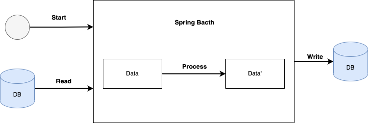
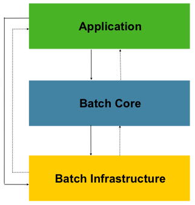

# 목차

 

- [목차](#목차)
- [들어가며](#들어가며)
- [배치 애플리케이션이란](#배치-애플리케이션이란)
- [스프링 배치 (Spring Batch)](#스프링-배치-spring-batch)
  - [스프링 배치 탄생 배경](#스프링-배치-탄생-배경)
  - [Spring Batch 사용 시나리오](#spring-batch-사용-시나리오)
  - [스프링 배치](#스프링-배치)
- [마치며](#마치며)
- [참고](#참고)

 

# 들어가며
현업에서 개발을 하다보면 웹 어플리케이션만큼 배치 어플리케이션을 많이 다루게된다. 특히 커머스 쪽이라면 더더욱 많이 사용하게된다.

필자도 이번에 CQRS의 리드 모델을 만들기 위한 목적으로 배치 어플리케이션을 다루게되었다.

주먹구구식으로 코드를 짜다보니 문득 `내가 배치 애플리케이션을 제대로 이해하고 작성하고있나?`란 생각을 하게 되었고, 지금까지 알고있던 내용과 여러 자료를 바탕으로 스프링 배치에 대한 글 시리즈를 작성해보려고한다.

이번 글은 가장 첫번째인 `배치 애플리케이션이란 무엇인가?`를 다룬다.

 

# 배치 애플리케이션이란

 

🤔 **배치 처리란?**

배치(Batch)의 사전적 의미는 `일괄처리`이다.

이는 일정 기간마다 주기적으로 컴퓨터 프로그램 흐름에 따라 순차적으로 자료를 처리하는 방식을 뜻한다.

쉽게 말해, 일정 기간 또는 한정된(bounded) 데이터를 모아두었다가 한 시점에 순차적으로 처리하는 방식을 의미한다.

보통은 단발성으로 대용량의 데이터를 처리할 때 사용한다.

ex. CQRS 리드 모델 생성, 정산, 빅데이터 처리, 일매출 집계등등

> 실시간 처리와의 차이점 -> 실시간 처리는 데이터의 발생 (또는 이벤트 발생)과 동시에 즉시 처리하는 방식을 의미한다.

 

🤔 **배치 애플리케이션?**

배치 애플리케이션이란 말그대로 일괄처리를 하는데 필요한 기능들을 제공하며, 개발자로 하여금 비즈니스 로직에 집중할 수 있게 해주는 애플리케이션을 의미한다.

한가지 비슷한 사례를 보면, Spring진영에선 Spring MVC를 제공하여 웹 애플리케이션에 필요한 기반 기능들을 많이 제공함으로써 개발자들이 비즈니스 로직에 더더욱 집중할 수 있다.

배치 애플리케이션도 이와 마찬가지로 배치 처리를 하는데 필요한 기반 기술을 제공하여 개발자로하여금 비즈니스 로직에 집중할 수 있게 해준다고 보면 된다.

 

💁‍♂️ **배치 애플리케이션의 조건**

* 안정성
  * 3만번째 처리에서 실패해도, 3만 1번째부터 다시 실행할 수 있어야한다.
  * 이미 동일한 파라미터(날짜, 입력값등등)로 실행한 함수를 또 실행시키면 예외를 발생시켜 데이터가 뻥튀기 되지 않도록해야한다.
* 대용량 데이터
  * 배치 애플리케이션은 대량의 데이터를 가져오거나, 전달하거나, 계산하는 등의 처리를 할 수 있어야한다.
* 자동화
  * 배치 애플리케이션은 심각한 문제 해결을 제외하고는 사용자 개입없이 실행되어야한다.
* 견고성
  * 배치 애플리케이션은 잘못된 데이터를 충돌/중단 없이 처리할 수 있어야한다.
* 신뢰성
  * 배치 애플리케이션은 무엇이 잘못되었는지를 추적할 수 있어야한다. (ex. 로깅, 알림)
* 성능
  * 배치 애플리케이션은 지정한 시간 안에 처리를 완료하거나 동시에 실행되는 다른 애플리케이션을 방해하지 않도록 수행되어야한다.

 

# 스프링 배치 (Spring Batch)
스프링 진영에서는 배치 처리에 대한 필요성을 느껴 스프링 배치를 만들었다.

그리고 스프링 배치는 위에서 언급한 `배치 애플리케이션의 조건`을 모두 만족한다.

 

## 스프링 배치 탄생 배경
Spring Batch가 나오지 않았다면, 배치 작업은 `Scheduler`나 `Quartz`등을 사용해 지정된 시간에 특정 클래스를 호출하여 배치 처리를 진행해야한다.

이 방식은 대용량 데이터를 처리하는 도중 에러가 발생하면 모든 데이터를 롤백시키고 다시 처음부터 처리해야하며, 몇 번째 데이터에서 에러가 발생했는지 알 수 없다.

즉, 배치 애플리케이션의 기본적인 조건을 만족하지 못한다.

> Batch와 Quartz는 다르다. Quartz는 스케줄러의 역할이지, Batch와 같이 대용량 데이터 배치 처리에 대한 기능을 제공하지 않는다.
> 
> 반대로 Batch도 Quartz의 다양한 스케줄 기능을 제공하지 않는다.
> 
> 그래서 보통은 Quartz (or Jenkins)와 Batch를 같이 사용하는 경우가 많다.

 

스프링 공식문서에 따르면, Spring 진영(Pivotal)이 다른 작업에 집중하고 있을때, 많은 기업들이 일괄처리를 위해 자체 사내 솔루션을 개발하는 경우가 많았다고한다.

하지만 점차 일괄처리에 대한 표준 프레임워크 니즈가 증가하여 Pivotal은 독점적으로 일괄처리 프레임워크를 가지고 있던 기업인 Accenture와 협력하여 Spring Batch 프로젝트를 만들기 시작했다고 한다.

 

## Spring Batch 사용 시나리오
일반적인 배치 작업과 동일하게 Spring Batch도 아래와 같은 시나리오로 사용된다.

 

* DB, 파일 또는 큐에서 데이터 읽기 (Reader - 데이터를 읽어오는 모듈)
* 데이터를 정의한 방식으로 처리
* 처리된 데이터를 특정 위치에 쓰기 (Writer - 데이터를 쓰는 모듈)

 

Spring Batch를 이용하여 제공할 수 있는 비즈니스 시나리오는 다음과 같다.

* 주기적인 배치 작업
* 동시적인 배치 작업 - 작업 병렬 처리
* 단계별 엔터프라이즈 메시지 기반 처리
* 대규모 작업에 대한 병렬 처리 프로세스
* 실패 후 수동 또는 예약된 재시작
* 단계별 순차 처리
* 부분 처리: 레코드 건너 뒤기 (ex. 롤백시)

 

그리고 현재 [Spring Batch 4.3.5 공식 문서](https://docs.spring.io/spring-batch/docs/current/reference/html/readersAndWriters.html#readersAndWriters)를 보면 아래와 같은 Reader와 Writer를 지원한다.

* File
  * Flat file (ex. csv)
* Xml
  * Xml 파싱
* Json
  * Json 파싱
* Database
  * JDBC - 페이징, 커서, 일괄 업데이트등 지원)
  * Hibernate - 페이징, 커서등 지원
  * JPA - 페이징 지원

 

## 스프링 배치 
스프링 진영에선 배치 처리에 대한 니즈를 파악하고 Accenture와 함께 공동작업하여 2007에 Spring Batch를 발표했다.

이를 통해 기존의 스프링이 제공하는 3대 요소인 AOP, DI, PSA를 제공하며, Accenture의 배치 노하우와 기술력을 바탕으로 Spring Batch이 탄생하였다.

스프링 배치는 아래와 같은 아키텍처를 이용하며, 개발자는 Application 계층의 비즈니스 로직에 집중하여 개발할 수 있다.

 

* Application
  * 개발자가 작성한 비즈니스가 담긴 배치 작업 코드
* Batch Core
  * 배치 작업을 시작하고 제어하는데 필요한 핵심 클래스
  * ex. `JobLauncher`, `Job`, `Step` 등등
* Batch Infrastructure
  * 개발자와 애플리케이션에서 사용하는 일반적이 Reader, Writer, Retry Template과 같은 서비스를 제공.
  * Core와 Application에서 사용될 코어 프레임워크와 공통 인프라성 기능 제공.

 

# 마치며
이번 글은 배치 애플리케이션이란 무엇이며, 스프링에선 대략적으로 어떻게 배치 애플리케이션을 제공하는지에 대해서 다루었다.

다음 글은 간단한 Hello World를 통해 스프링 배치 애플리케이션을 다뤄본다.

 

# 참고
* https://docs.spring.io/spring-batch/docs/current/reference/html/spring-batch-intro.html#spring-batch-intro
* https://jojoldu.tistory.com/324
* https://deeplify.dev/back-end/spring/batch-tutorial
