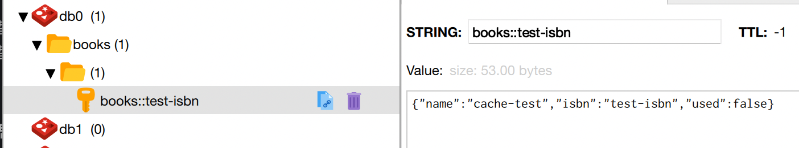

# 목차

<br>

- [목차](#목차)
- [들어가며](#들어가며)
- [스프링 캐싱 코어](#스프링-캐싱-코어)
  - [스프링은 어떻게 캐싱을 처리하지?](#스프링은-어떻게-캐싱을-처리하지)
  - [AOP 코드는 어디에?](#aop-코드는-어디에)
  - [Cache와 CacheManager](#cache와-cachemanager)
  - [멀티 스레드는 기본으로 제공하지 않는다](#멀티-스레드는-기본으로-제공하지-않는다)
  - [결국 핵심은 두 가지다 - 중요](#결국-핵심은-두-가지다---중요)
- [애노테이션](#애노테이션)
  - [@Cacheable](#cacheable)
    - [value, cacheNames](#value-cachenames)
    - [key](#key)
    - [condition](#condition)
    - [unless](#unless)
    - [cacheManager](#cachemanager)
    - [sync](#sync)
  - [@CachePut](#cacheput)
  - [@CacheEvict](#cacheevict)
  - [@Caching](#caching)
  - [@CacheConfig](#cacheconfig)
  - [@EnableCaching](#enablecaching)
- [마치며](#마치며)

<br>

# 들어가며
스프링은 버전 3.1부터 캐싱을 편하게 적용시킬 수 있도록 지원하고 있다.

기존의 `@Transactional`처럼 기존 코드에 큰 변경없이 캐싱을 적용 시킬 수 있다.

다시 말해, 스프링이 트랜잭션을 AOP를 이용하여 추상화시킨 것과 유사하다. (물론 IoC는 기본적으로 활용한다)

캐싱도 관심사의 분리와 AOP를 활용하여 애노테이션만 붙여주면 쉽게 적용시킬 수 있도록 추상화해놓았다.

이번 글은 스프링에서 캐싱을 적용시키기위해 꼭 알아야하는 내용들을 다룬다.

> 글 출처는 [Spring Docs - Cache](https://docs.spring.io/spring-framework/docs/current/reference/html/integration.html#cache)이다.

<br>

# 스프링 캐싱 코어
우선은 스프링에서 어떤 방식으로 캐싱을 처리하고, 추상화 시켰는지 살펴본다.

<br>

## 스프링은 어떻게 캐싱을 처리하지?

<br>

핵심을 말하자면, 스프링은 캐싱을 적용하는 코드를 추상화하여 자바 메서드에 적용시킬 수 있도록 하였다.

예를 들어, MySQL과 같은 DB로부터 조회 쿼리를 실행하는 애플리케이션 메서드가 존재한다고 가정해보자.

그럼 해당 메서드에 **캐싱 애노테이션을 붙이면 AOP를 통해, 캐시 처리를 하는 것이다.**

**이때 만약 캐시 DB (ex. Redis)에 조회하고자하는 데이터가 있다면 해당 타겟 메서드의 로직 (실제 DB에 조회 쿼리)은 실행되지 않는다.**

**캐시해둔 결과를 Proxy에서 반환하기 때문이다.**

물론, **캐시 DB에 조회하고자하는 데이터가 없다면, 실제 DB에 조회 쿼리를 날려 데이터가 가져와서 캐시 DB에 저장후 데이터를 반환한다.**

> 캐싱 전략중 `Look aside Cache`를 생각하면 이해하기 쉽다.

<br>

정말 편한 것은 캐싱 애노테이션만 붙이면 위와 같이 캐싱 전략은 AOP를 통해 자동으로 적용된다는 것이다.

개발자는 그저 핵심 로직 (실제 DB로부터 데이터 조회)만을 작성하면 된다.

<br>

물론 캐싱 DB의 데이터를 실제 DB와 동기화시키기 위한 기능도 제공한다.

즉, **캐싱 DB에 저장되는 데이터를 업데이트하거나 삭제하는 기능도 제공한다.**

이는 데이터의 변경이 발생했을 때 굉장히 유용하게 사용되며, 이 또한 애노테이션을 붙이면 쉽게 적용시킬 수 있다.

<br>

쉽게 얘기해서 `get-if-not-found-then-proceed-and-put-eventually code blocks`라고 이해하면 쉽다.

> 스프링은 프레임워크답게 개발자들이 핵심 로직만 작성하면 쉽게 부가적인 기능 (ex. 트랜잭션, 캐싱)등을 적용시킬 수 있도록 추상화시켜두었다.
> 
> 다시 한번, 스프링을 사용하면서 관심사의 분리, 객체지향 원칙에 대한 이해를 높일 수 있었다.

<br>

## AOP 코드는 어디에?
> 이 장은 그냥 넘겨도 된다. 추후에 직접 구현하며 글을 작성할 예정이다.

이제 스프링이 추상적으로 어떤 방식을 통해 캐싱을 처리하는지는 알았다.

그렇다면 실제로 어떤 객체들이 책임을 나눠 가져가서 처리하는 것일까?

<br>

위에서 언급했듯이, 캐싱 로직도 스프링은 모두 추상화시켜두었다.

풀어 얘기하자면, AOP를 적용시키기위한 `Aspect`, `CacheAnnocationParser`, `CacheProxyFactoryBean`등등을 추상화시켰다.

<br>

스프링 캐싱 의존성을 추가하고, `@EnableCaching` 애노테이션을 선언해주면 자동으로 구현체가 주입된다.

* `CacheAspectSupport`: Base class for caching aspects, such as the CacheInterceptor or an AspectJ aspect.
  * `CacheInterceptor`: 구현체
* `SpringCacheAnnotationParser`: Strategy implementation for parsing Spring's {@link Caching}, {@link Cacheable},
* `CacheProxyFactoryBean`: Proxy factory bean for simplified declarative caching handling.

<br>

**스프링이 추상화를 잘 해두었기 때문에, 사실 사용하는데 있어서 위와 같은 코드를 볼 일은 많이 없다.**

그래서 **이번 글에선 간단히만 다루고, 추후에 직접 AOP를 이용하여 캐싱을 구현하는 글을 작성해서 공유할 예정이다.**

<br>

## Cache와 CacheManager
> 스프링이 캐싱 기능을 잘 추상화시켰고, **그저 `@EnableCaching`이라는 애노테이션을 선언만해주면, 캐시 관련된 애노테이션을 스캔하여 캐싱 로직을 수행한다.**

<br>

사실 **가장 중요한 것은 캐시 데이터를 어디에 저장하느냐이다.**

다시 말해, **스프링은 캐시 관련된 로직을 제공하지만, 캐시 데이터를 어디에 저장할지는 개발자가 지정해줘야한다.**

그리고 이 부분을 스프링은 아래 두 가지 인터페이스를 이용해 추상화해두었다.

* `org.springframework.cache.Cache`: 캐시 데이터에 대한 생명주기를 관리하는 객체.
  * is managed by Cache Manager, which manages the life cycle of Cache. Cache exists in the context of Cache Manager and is a map-like data structure that temporarily stores key-indexed values.A Cache is owned by only one CacheManager
* `org.springframework.cache.CacheManager`: 캐시를 관리해주는 매니저. `Cache` 객체를 관리한다.
  * Create, configure, acquire, manage, and control multiple uniquely named Caches that exist within the context of CacheManager. A CacheManager corresponds to only one CachingProvider

> 더 자세한 아키텍처 부분은 [여기](https://programming.vip/docs/detailed-tutorial-on-redis-caching-in-the-springboot-series.html)를 참고하자.

<br>

스프링은 아래와 같은 캐시 DB의 대한 구현체를 제공한다.
* ConcurrentMapCacheManager: Java의ConcurrentHashMap을 사용해 구현한 캐시를 사용하는 캐시매니저
* SimpleCacheManager: 기본적으로 제공하는 캐시가 없어 사용할 캐시를 직접 등록하여 사용하기 위한 캐시매니저
* EhCacheCacheManager: 자바에서 유명한 캐시 프레임워크 중 하나인 EhCache를 지원하는 캐시 매니저
* CompositeCacheManager: 1개 이상의 캐시 매니저를 사용하도록 지원해주는 혼합 캐시 매니저
* CaffeineCacheManager: Java 8로 Guava 캐시를 재작성한 Caffeine 캐시를 사용하는 캐시 매니저
* JCacheCacheManager: JSR-107 기반의 캐시를 사용하는 캐시 매니저
* RedisCacheManager: 캐시 저장소로 유명한 Redis를 지원하는 캐시 매니저.

<br>

또한, 각 캐시 매니저별 `Cache` 객체의 구현체도 제공한다.

<br>

## 멀티 스레드는 기본으로 제공하지 않는다
스프링의 캐싱 추상화는 기본적으로 멀티 스레드나 멀티 프로세스를 위한 처리를 제공하지 않는다.

**만약 여러 멀티 스레드 환경에서 캐싱 처리를 하려고 한다면 따로 설정해줘야 한다.** (DB Lock같은 기능을 기본적으로 제공하지 않는다)

그러므로 여러 스레드가 같은 아이템를 접근하고 수정하려고하면, 예상과 다르게 동작할 수 있다.

> 물론 `sync`라는 설정이 존재하지만, 대부분의 캐시 저장소가 이를 지원하지 않는다고 한다. (물론 예외는 존재할 듯 싶다)

<br>

## 결국 핵심은 두 가지다 - 중요
스프링에서 캐싱처리를 적용시키기위해 신경써야할 부분은 사실 딱 두가지이다.

* Caching declaration: Identify the methods that need to be cached and their policy.
  * 애노테이션을 통해 어떤 메서드가 캐싱이 필요한지, 또한 애노테이션을 통해 어떤 정책을 사용할지 설정해주면된다.
* Cache Configuration: The backing cache where the data is stored and from which it is read.
  * 캐시한 데이터를 어디에 저장하고 읽어올지 설정해주면 된다.

<br>

# 애노테이션
앞에서 언급했듯이 스프링 캐싱은 선언적 애노테이션을 기반으로 동작한다.

그러므로 각 애노테이션에 대한 이해가 필요하다.

* @Cacheable: Triggers cache population.
* @CacheEvict: Triggers cache eviction.
* @CachePut: Updates the cache without interfering with the method execution.
* @Caching: Regroups multiple cache operations to be applied on a method.
* @CacheConfig: Shares some common cache-related settings at class-level.

<br>

## @Cacheable
자바 메서드에 `@Cacheable`을 설정함으로써 해당 메서드를 캐싱할 수 있다.

타겟메서드가 호출되었을 때, 캐시에 해당 메서드가 이미 동일한 인자로 존재한다면 캐시해둔 결과를 Proxy에서 반환한다.

캐싱해둔 데이터가 없다면, 실제 DB로부터 조회하여 캐싱 저장소에 저장후 결과를 반환한다.

<br>

### value, cacheNames

```java
@Cacheable("books")
public Book findBook(ISBN isbn) {...}
```
* 캐싱 전략 (조건)없이 모든 인자를 캐싱하고자한다면 위와 같이 사용하면 된다.
* **`books`라는 이름으로 캐시저장소가 사용된다.**
  * **메서드가 호출될 때 매번 `books`라는 캐시 데이터를 확인한다.**
* **캐시 저장소는 여러 개 정의할 수 있다.**
  * ex. `@Cacheable({"books", "isbns"})` -> `books`와 isbns`라는 두 군데에 캐시 데이터가 저장된다.

<p align="center"><br>Redis를 이용하여 homeFeed라는 캐시 저장소에 저장시킨 예시</p>

<br>

### key
캐시는 필수적으로 `key:value` 형식으로 저장된다. 그러므로 각 메서드마다 어떤 key를 통해 캐시 데이터를 저장하고 조회할 지 설정해주어야한다.

별도의 커스텀 키를 정의하지 않으면, 디폴트로 알고리즘 기반의 KeyGenerator를 사용하여 키를 생성한다.

* 매개변수가 아무것도 없으면 `SimpleKey.EMPTY`을 반환.
* 매개변수가 하나면, 그 인스턴스를 반환.
* 매개변수가 둘 이상이면, `SimpleKey`를 반환. (모든 매개변수의 Hash 값으로 계산된 키)

기본키는 매개변수의 기본 타입형아니면 `hashCode()`와 `equals()`를 기반으로 계산된 키를 저장한다.

> `SimpleKey`안에 `Object[]`형식으로 키를 가지고 있는다.

다른 기본 키를 생성하려면 `org.springframework.cache.KeyGenerator` 인터페이스를 구현하고, `CacheResolver`에 설정해주면 된다.

<br>

**Custom Key**

원하는 Key가 있다면 아래와 같이 `SpEL`을 사용하며 정의해주면 된다.

```java
@Cacheable(value="books", key="#isbn"
public Book findBook(ISBN isbn, boolean checkWarehouse, boolean includeUsed)
 
 
@Cacheable(value="books", key="#isbn.rawNumber")
public Book findBook(ISBN isbn, boolean checkWarehouse, boolean includeUsed)
 
 
@Cacheable(value="books", key="T(someType).hash(#isbn)")
public Book findBook(ISBN isbn, boolean checkWarehouse, boolean includeUsed)
```

<br>

### condition
> `...일때 캐싱을 해라`

캐싱 조건을 설정해줄 수 있다.

* Condition로 주어진 값이 `true`면 캐싱 O
  * 메서드 내부(핵심 객체)가 실행되지 않는다.
* Condition로 주어진 값이 `false`면 캐싱 X
  * 메서드 내부(핵심 객체)가 실행된다.

```java
@Cacheable(value="book", condition="#name.length < 32")
public Book findBook(String name)
```

> SpEL에 대한 내용은 [Baeldung - SpEL](https://www.baeldung.com/spring-expression-language)와 [공식 문서](https://docs.spring.io/spring-framework/docs/current/reference/html/integration.html#cache-spel-context)을 참고하자.

<br>

### unless
> `...만 아니면 캐싱하라`

`condition`과 동일하게 캐싱 조건을 설정해줄 수 있다.

단, `condition`과 다르게 `unless`는 메서드의 결과값 반환 시점에 결과값을 확인하여 캐싱여부를 결정한다.

다시 말해, 메서드 내부 (핵심 객체)가 항상 실행된다.

* unless로 주어진 값이 `true`면 캐싱 X
* unless로 주어진 값이 `false`면 캐싱 O

```java
@Cacheable(value="book", condition="#name.length < 32", unless="#result.hardback")
public Book findBook(String name)
```
* **메서드 매개변수의 `name`의 길이가 32이 이하며, 반환되는 결과의 `Optional`의 값이 null이면 캐싱되지 않는다.**
* **`#result`를 통해 메서드 호출 결과를 가져올 수 있다. (`unless`와 cache evict 표현에서만 사용가능하다.)**

```java
@Cacheable(value="book", condition="#name.length < 32", unless="#result == null")
public Book findBook(String name)
```
* 반환되는 결과가 `null`이면 캐싱하지 말라는 의미.

<br>

### cacheManager
여러 개의 캐싱 저장소를 사용하거나 전략을 사용하는 경우, 여러 개의 `CacheManager`를 정의해놓을 수 있다.

그리고 `cacheManager`설정을 통해 해당 메서드는 어떤 캐시 매니저를 사용할지 결정할 수 있다.

```java
@Cacheable(cacheNames="books", cacheManager="anotherCacheManager") 
public Book findBook(ISBN isbn) {...}
```

> 이외에도 `cacheResolver`를 설정해주는 설정도 있다.

<br>

### sync
> 디폴트는 false다.

`sync = true`로 설정하면, 해당 메서드는 하나의 스레드에서만 접근할 수 있다. (동기)

```java
@Cacheable(cacheNames="foos", sync=true) 
public Foo executeExpensiveOperation(String id) {...}
```

> 대부분의 캐시 라이브러리는 이를 지원하지 않는다고 한다. (사실상 캐시 저장소로 사용한다면 굳이 사용할 필요 없어보인다.)

<br>

## @CachePut
`@CachePut`이 붙은 메서드는 항상 실행 되며, 결과는 `@CachePut` 옵션에 따라 캐시에 저장된다.

즉, **캐시되어있는 데이터가 있어도, `@CachePut`이 붙은 메서드는 항상 호출되고, 그 결과가 캐시에 저장된다.**

**보통 캐시에 저장하거나 업데이트를 해야하는 경우 사용된다.**

```java
@CachePut(cacheNames="book", key="#isbn")
public Book updateBook(ISBN isbn, BookDescriptor descriptor)
```

<br>

`@CachePut`은 `@Cacheable`과 동일한 옵션을 제공한다. 다만, 캐시에 저장하는 것보다는 메서드 흐름을 최적화하는데 사용되어야한다.

> 한 메서드에 `@Cacheable`과 함께 사용하는 것을 권장하지 않는다.

<br>

## @CacheEvict
> Evict: 축출, 쫗아냄

**`@CacheEvict`는 `@Cacheable`과 반대로, 캐시 저장소에 저장된 데이터를 지울 때 사용된다.**

`@CacheEvict`도 여러 개의 캐시를 명시할 수 있으며, `key`와 `condition`을 사용할 수 있다.

또한, `allEntries` 속성을 통해 키값으로 `Cache Entrie`하나만 비우는 것이 아닌, 캐시 영역의 모든 `Entrie`를 비운다.

이 경우에는 키를 명시하더라도 이를 무시하고 모든 Entrie를 비우게 된다.

<br>

## @Caching
다수의 캐시 애노테이션을 쓰고자 할 때 `@Caching`을 쓴다. `@Cacheable`, `@CacheEvic`, `@CachePut`을 지원한다.

```java
@Caching(evict = { @CacheEvict("primary"), @CacheEvict(value = "secondary", key = "#p0") })
public Book importBooks(String deposit, Date date)
```

<br>

## @CacheConfig
지금까지의 설정은 대부분 Global한 설정이었다.

만약 특정 클래스에만 설정을 다르게 주고 싶다면 `@CacheConfig`를 사용하면 된다.

```java
@CacheConfig("books") 
public class BookRepositoryImpl implements BookRepository {

    @Cacheable
    public Book findBook(ISBN isbn) {...}
}
```
`cacheName`, `CacheManager`, `KeyGenerator`, `CacheResolver`등을 설정해줄 수 있다.

<br>

캐시 설정은 세 가지 레벨로 나뉘며, 낮아질 수록 오버라이딩된다.
* Global 설정. `CacheManger`, `KeyGenerator`에 사용할 수 있다.
* 클래스 레벨 설정. `@CacheConfig`를 사용한다.
* 메서드 레벨 설정.

<br>

## @EnableCaching
마지막 애노테이션은 캐시 설정 애노테이션이다.

아무리 캐시 관련 애노테이션을 사용해서 캐시 트리거를 설정해두어도, 활성화를 시키지 않으면 동작하지 않는다.

모든 캐싱 애노테이션를 활성화시키려면 `@EnableCaching`을 아무 `@Configuration` 클래스에 추가해줘야한다.

```java
@Configuration
@EnableCaching
public class AppConfig {
}
```

이는 Global 설정에 속하며, 애노테이션의 설정을 통해 `ErrorHandler`, `CacheManager`, `KeyGenerator`, `CacheResolver`등을 설정해줄 수 있다.

> `@SpringBootApplication`이 `@Configuration`을 상속받으므로, Application 시작부분에 넣는 예시도 많이 봤다.

<br>

# 마치며
시작할 땐 공식 문서에 살을 더 붙일 예정이었지만, 거의 공식 문서 번역이 되었다...

그래도 읽고 번역하고 정리하며, 스프링 캐싱에 대해서 더 깊게 이해할 수 있었다.

부디 이 자료가 누군가에겐 도움이 되기를..ㅎ


